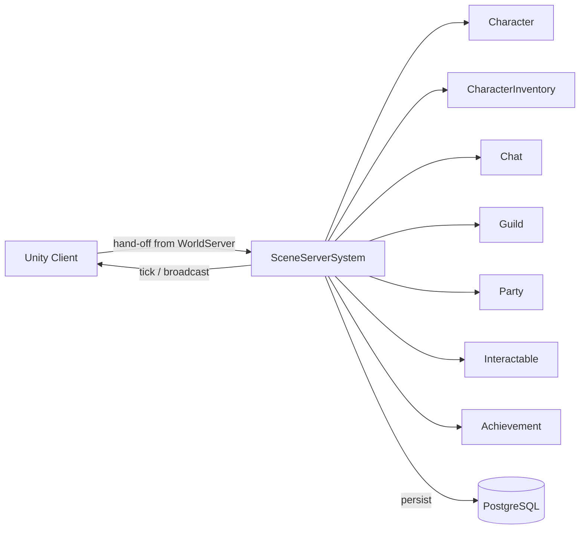

# Scene Server System

**Short description:** Manages scene server node lifecycle, scene instance loading/unloading, heartbeat pulses to the database, character count tracking, and connection–scene routing for the FishMMO scene server.

## Table of Contents

- [Overview](#overview)
- [Supported Platforms](#supported-platforms)
- [Features](#features)
- [Prerequisites](#prerequisites)
- [Installation / Build](#installation--build)
- [Quick Start Guides](#quick-start-guides)
- [Configuration](#configuration)
- [Usage Examples](#usage-examples)
- [Operational Checks](#operational-checks)
- [Flow Diagram](#flow-diagram)
- [Project Structure](#project-structure)
- [License](#license)

## Overview

The SceneServer system is the SceneServer node orchestration layer responsible for scene instance lifecycle, scene-server heartbeat updates, scene readiness tracking, and connection-scene routing. It coordinates Unity/FishNet scene loading with database scene metadata so world services can discover and route players to active scene instances.

The subsystem uses a split execution model:

- **Main thread:** scene manager event handling, mapping updates, routing, broadcast-safe state changes, and per-frame main-thread queue draining.
- **Async worker:** database pulse/update/delete operations dispatched via `TryEnqueueAsyncWork` with entity-keyed ordering.
- **Main-thread queue:** marshalling async completion actions that must mutate Unity/FishNet state back onto the main thread through `ISceneServerSystemMainThreadQueueData`.

`SceneServerSystem` is a `ServerBehaviour` ScriptableObject created via the Unity asset menu (`FishMMO/Server/SceneServer/Scene Server System`). It implements `ISceneServerSystem<NetworkConnection>` and declares data-container dependencies through `[RequiresDataContainer]` attributes for `SceneInstanceMappingData`, `SceneServerRuntimeData`, `SceneServerSystemMainThreadQueueData`, and `AsyncWorkerData`.

## Supported Platforms

| Platform | Supported | Notes |
|----------|-----------|-------|
| Windows  | Yes       | Dedicated server builds |
| Linux    | Yes       | Dedicated server builds |
| WebGL    | N/A       | Server-only system; not applicable to client builds |

**Engine:** Unity 6.3 LTS
**Scripting backend:** IL2CPP

## Features

- **Scene instance lifecycle management** — loads and unloads scene instances on demand from database-queued requests using FishNet's `SceneManager`
- **Periodic heartbeat pulses** — sends server and per-scene heartbeat data to the database at a configurable interval, using an atomic `Interlocked.CompareExchange` gate to prevent overlapping pulses
- **Zero-allocation pulse collection** — reusable runtime buffers with manual `foreach` loops (no `AddRange` enumerator boxing) eliminate per-pulse GC pressure; pulse data is snapshotted before async dispatch
- **Simplified pulse payload** — only `(Handle, CharacterCount)` tuples are sent to the async worker; stale-pulse detection (`StalePulse`, `TimeSinceLastExit`) stays local on the main thread
- **Scene load rate limiting** — `maxScenesLoadedPerPulse` bounds the dequeue loop per pulse cycle to prevent DB flood from overwhelming the scene server
- **Duplicate load guard** — `TryAdd` atomically rejects duplicate scene IDs in `PendingScenes`, preventing races when two queued callbacks target the same scene
- **Pending scene TTL** — bounded sweep with configurable timeout, interval, and max removals per pass; expired requests are failed in the database and cleaned up locally
- **Flat O(1) handle lookup** — `SceneInstanceByHandle` provides constant-time lookup for unload, routing, and character count adjustment, replacing O(worlds × scenes) nested iteration
- **Empty container cleanup** — unload handler prunes empty scene-name and world-server dictionaries to prevent memory leak from scene churn
- **Async enqueue with fallback** — every `TryEnqueueAsyncWork` return value is checked; failures fire the async method directly so the database is never left with stale state
- **Character count integration** — connect/load increments and disconnect decrements tracked per scene instance via `SceneInstanceDetails.AddCharacterCount`; `LastExit` updated when a scene becomes empty for stale detection
- **Connection routing helpers** — `TryLoadSceneForConnection` and `UnloadSceneForConnection` manage per-connection scene visibility through FishNet
- **PhysicsTicker setup** — each loaded scene gets a `PhysicsTicker` GameObject with `HideFlags.DontSave` for explicit cleanup safety and local physics support
- **Scene handle reuse safety** — all handle→details mappings are removed on unload; documented at both Add and Remove sites to prevent stale resolution after handle reuse
- **PendingSceneInfo struct** — merges `SceneData` + `EnqueuedUtc` into a single map entry, eliminating dual-map sync risk
- **Enumerate-then-remove safety** — `SweepExpiredPendingScenes` collects IDs into a buffer before removal; pattern documented inline
- **Database registration and cleanup** — registers this scene server node in the database during initialization and deletes stale scene rows from previous runs; performs blocking cleanup on deinitialization

## Prerequisites

- FishMMO server framework with `ServerBehaviour`, `RuntimeDataContainer`, `IPeriodicUpdateSystem`, and `AsyncWorkerData` infrastructure
- FishNet networking library with `SceneManager` (stacked scene loading, `LocalPhysics`, server params)
- Database layer implementing `ISceneServerService` and `ISceneService` (Npgsql-backed)
- `WorldSceneDetailsCache` ScriptableObject populated with valid scene names
- `ICharacterSystem<NetworkConnection, Scene>` and `ICharacterMappingData<NetworkConnection>` registered in the server behaviour/data registries
- `IAddressProvider` returning a valid `ServerAddress` for this node

## Installation / Build

This is an integrated module within the FishMMO Unity project. No separate installation is required.

1. Ensure all FishMMO server assemblies are present and compiling.
2. Create a `SceneServerSystem` asset via the Unity menu: **Assets → Create → FishMMO → Server → SceneServer → Scene Server System**.
3. Assign the `WorldSceneDetailsCache` reference on the asset.
4. Register the required data containers (`SceneInstanceMappingData`, `SceneServerRuntimeData`, `SceneServerSystemMainThreadQueueData`, `AsyncWorkerData`) in the server's `DataContainerRegistry`.
5. Build the server with IL2CPP for the target platform.

## Quick Start Guides

### Running a Scene Server Node

1. Build or launch the FishMMO server with the Scene Server configuration.
2. Ensure the database is running and accessible (Npgsql connection).
3. The `SceneServerSystem.InitializeOnce()` method automatically:
   - Validates all dependencies (server services, data containers, scene manager, character system, database services).
   - Registers the scene server node in the database via `ISceneServerService.PersistAsync`.
   - Deletes stale scene rows from previous runs via `ISceneService.DeleteBySceneServerAsync`.
   - Subscribes to FishNet `OnLoadEnd` / `OnUnloadEnd` and character connect/disconnect/load events.
   - Registers the periodic pulse callback at the configured `PulseRate`.
   - Clamps all configuration values to safe minimums.
4. The world server queues scene load requests in the database; the scene server dequeues and loads them each pulse.

### Adding a New Scene Type

1. Add the scene to the `WorldSceneDetailsCache` ScriptableObject.
2. Queue a load request in the database with the appropriate `SceneType`, `WorldServerID`, and `SceneName`.
3. The scene server will pick it up during the next periodic pulse and load it via FishNet with stacked loading and local 3D physics.

## Configuration

### Inspector Fields

| Field | Type | Default | Description |
|-------|------|---------|-------------|
| `maxMainThreadActionsPerFrame` | `int` | `100` | Max queued scene-server actions drained from the main-thread queue per frame (clamped ≥ 1) |
| `pendingSceneTimeoutSeconds` | `float` | `60.0` | Max age in seconds before a pending scene load request is failed and removed (clamped ≥ 5.0) |
| `pendingSceneSweepIntervalSeconds` | `float` | `2.0` | Interval in seconds between bounded pending-scene cleanup sweeps (clamped ≥ 0.25) |
| `pendingSceneSweepMaxRemovals` | `int` | `64` | Max expired pending scenes removed per sweep pass (clamped ≥ 1) |
| `maxScenesLoadedPerPulse` | `int` | `3` | Max scene load requests dequeued from the database per pulse cycle (clamped ≥ 1) |
| `pulseRate` | `float` | `5.0` | Interval in seconds between heartbeat pulses to the database |
| `worldSceneDetailsCache` | `WorldSceneDetailsCache` | — | Cache of world scene details including valid scene names and max clients per scene |

### Server Configuration Keys

| Key | Type | Description |
|-----|------|-------------|
| `StaleSceneTimeout` | `int` | Minutes before a stale (empty) scene is unloaded; checked via `Server.Configuration.TryGetInt` |

## Usage Examples

### Querying Scene Instance Details

```csharp
// O(1) lookup by handle with world/scene validation
if (sceneServerSystem.TryGetSceneInstanceDetails(worldServerID, sceneName, sceneHandle, out ISceneInstanceDetails details))
{
    Log.Debug("Example", $"Scene {details.Name} has {details.CharacterCount} characters");
}
```

### Loading a Scene for a Connection

```csharp
if (sceneServerSystem.TryGetSceneInstanceDetails(worldServerID, sceneName, sceneHandle, out var instance))
{
    if (sceneServerSystem.TryLoadSceneForConnection(connection, instance))
    {
        Log.Debug("Example", "Scene loaded for connection successfully");
    }
}
```

### Unloading a Scene for a Connection

```csharp
sceneServerSystem.UnloadSceneForConnection(connection, "MySceneName");
```

### Unloading a Scene by Handle

```csharp
// Queues DB delete and FishNet unload
sceneServerSystem.UnloadScene(sceneHandle);
```

## Operational Checks

| Check | How to Verify | Expected Result |
|-------|---------------|-----------------|
| Scene server registered | Query `SceneServer` table in database after startup | Row with matching address, port, and server ID |
| Heartbeat pulses active | Monitor database `SceneServer` pulse timestamp | Updates every `pulseRate` seconds |
| Scene loaded successfully | Check logs for `"Saved {sceneType} scene"` message | Scene appears in `WorldScenes` and `SceneInstanceByHandle` mappings |
| Stale scene unloaded | Empty scene exceeds `StaleSceneTimeout` minutes | Scene unloaded and removed from database and local mappings |
| Pending scene timeout | Load request exceeds `pendingSceneTimeoutSeconds` | Scene status set to Failed in database; entry removed from `PendingScenes` |
| Duplicate load rejected | Same scene ID queued twice before first load completes | Second request logged as warning and ignored; `TryAdd` returns false |
| Character count tracking | Connect/disconnect characters to a scene | `SceneInstanceDetails.CharacterCount` matches expected count |
| Main-thread queue draining | Enqueue actions via async workers | Actions execute on main thread within `maxMainThreadActionsPerFrame` per frame |
| Pulse overlap prevention | Trigger rapid pulses | `TryBeginPulse` rejects concurrent pulse; `Interlocked.CompareExchange` gate active |
| Graceful shutdown | Stop scene server | Stale scene rows deleted; events unsubscribed; main-thread queue fully drained |

## Flow Diagram

### High-Level Overview



```
┌──────────────────────────────────────────────────────────────┐
│                    InitializeOnce()                          │
│  1. Validate dependencies (Server, DataContainers,           │
│     SceneManager, CharacterSystem, Database services)        │
│  2. Subscribe to OnLoadEnd, OnUnloadEnd, OnDisconnect,       │
│     OnAfterLoadCharacter                                     │
│  3. PersistAsync → register server in DB                     │
│  4. DeleteBySceneServerAsync → clean stale rows              │
│  5. Register periodic pulse callback                         │
│  6. Clamp config values                                      │
└──────────────────────┬───────────────────────────────────────┘
                       │
                       ▼
┌──────────────────────────────────────────────────────────────┐
│              OnPeriodicPulse (every pulseRate s)              │
│                                                              │
│  ┌─ Main Thread ──────────────────────────────────────────┐  │
│  │ 1. SweepExpiredPendingScenes (bounded TTL cleanup)     │  │
│  │ 2. TryBeginPulse (atomic gate)                         │  │
│  │ 3. Collect pulse data into reusable buffers            │  │
│  │    - ScenePulseDataBuffer: (Handle, CharacterCount)    │  │
│  │    - ScenesToUnloadBuffer: stale scene handles         │  │
│  │ 4. Unload stale scenes immediately                     │  │
│  │ 5. Snapshot pulse data for async                       │  │
│  └────────────────────────┬───────────────────────────────┘  │
│                           │ TryEnqueueAsyncWork              │
│                           ▼                                  │
│  ┌─ Async Worker ─────────────────────────────────────────┐  │
│  │ 1. PulseAsync → server heartbeat                       │  │
│  │ 2. PulseBatchAsync → per-scene heartbeats              │  │
│  │ 3. DequeueAsync (×maxScenesLoadedPerPulse)             │  │
│  │    └─ TryEnqueueMainThread → ProcessSceneLoadRequest   │  │
│  │ 4. EndPulse (finally)                                  │  │
│  └────────────────────────────────────────────────────────┘  │
└──────────────────────────────────────────────────────────────┘

┌──────────────────────────────────────────────────────────────┐
│              Scene Load Flow                                 │
│                                                              │
│  ProcessSceneLoadRequest(SceneData)                          │
│    │ 1. Validate scene in WorldSceneDetailsCache             │
│    │ 2. TryAdd to PendingScenes (atomic duplicate guard)     │
│    │ 3. FishNet LoadConnectionScenes (stacked, local 3D      │
│    │    physics, ServerParams = [sceneData.ID])              │
│    ▼                                                         │
│  SceneManager_OnLoadEnd(args)                                │
│    │ 1. Extract sceneDataKey from ServerParams[0]            │
│    │ 2. Resolve PendingSceneInfo, remove from PendingScenes  │
│    │ 3a. Failure → UpdateSceneStatusAsync(Failed)            │
│    │ 3b. Success → ProcessScene + SetSceneReadyAsync         │
│    ▼                                                         │
│  ProcessScene(scene, sceneType, worldServerID)               │
│    1. Add to nested WorldScenes hierarchy                    │
│    2. Add to flat SceneInstanceByHandle + SceneNameByHandle  │
│    3. Create PhysicsTicker (HideFlags.DontSave)              │
└──────────────────────────────────────────────────────────────┘

┌──────────────────────────────────────────────────────────────┐
│              Scene Unload Flow                               │
│                                                              │
│  UnloadScene(handle) [explicit]                              │
│    │ 1. TryEnqueueAsyncWork → DeleteSceneByHandleAsync       │
│    │ 2. FishNet UnloadConnectionScenes                       │
│    ▼                                                         │
│  SceneManager_OnUnloadEnd(args)                              │
│    For each unloaded handle:                                 │
│    1. O(1) lookup in SceneInstanceByHandle                   │
│    2. Remove from nested WorldScenes hierarchy               │
│    3. Clean up empty containers (scene-name, world-server)   │
│    4. Remove from SceneInstanceByHandle + SceneNameByHandle  │
└──────────────────────────────────────────────────────────────┘

┌──────────────────────────────────────────────────────────────┐
│              Character Count Flow                            │
│                                                              │
│  OnAfterLoadCharacter / OnDisconnect                         │
│    └─ AdjustSceneCharacterCount(worldServerID, sceneName,    │
│       sceneHandle, ±1)                                       │
│       └─ TryGetSceneInstanceDetails (O(1) flat lookup)       │
│          └─ instance.AddCharacterCount(amount)               │
│             └─ If CharacterCount < 1 → LastExit = UtcNow     │
└──────────────────────────────────────────────────────────────┘
```

## Project Structure

```
SceneServer/
├── SceneServerSystem.cs                    # Core scene server orchestration: initialization, pulses,
│                                           #   load/unload processing, character count, connection routing
├── SceneServerRuntimeData.cs              # Scene server identity (ID, IsLocked), atomic pulse gate,
│                                           #   reusable zero-allocation buffers, pending scene sweep timer
├── SceneServerSystemMainThreadQueueData.cs # Concrete main-thread queue container for marshalling
│                                           #   async DB results back to the Unity main thread
├── SceneInstanceMappingData.cs            # WorldScenes nested hierarchy, flat SceneInstanceByHandle
│                                           #   and SceneNameByHandle maps, PendingScenes tracking
├── SceneInstanceDetails.cs                # Per-instance metadata: WorldServerID, SceneServerID, Name,
│                                           #   Handle, SceneType, CharacterCount, StalePulse, LastExit
└── README.md                              # This documentation
```

### Inheritance and Interface Hierarchy

```
ServerBehaviour
└── SceneServerSystem : ISceneServerSystem<NetworkConnection>

RuntimeDataContainer
├── SceneInstanceMappingData : ISceneInstanceMappingData
├── SceneServerRuntimeData : ISceneServerRuntimeData
└── SystemMainThreadQueueData
    └── SceneServerSystemMainThreadQueueData : ISceneServerSystemMainThreadQueueData

ISceneInstanceDetails
└── SceneInstanceDetails
```

### Core Contracts

| Interface / Type | Description |
|------------------|-------------|
| `ISceneServerSystem<NetworkConnection>` | Primary system contract for scene server orchestration |
| `ISceneServerRuntimeData` | Scene server identity, lock state, pulse gate, and reusable buffers |
| `ISceneServerSystemMainThreadQueueData` | Main-thread queue for marshalling async results |
| `ISceneInstanceMappingData` | World/scene/handle mapping hierarchy, flat lookups, and pending tracking |
| `ISceneInstanceDetails` | Per-instance runtime metadata and character count with stale detection |
| `PendingSceneInfo` | Readonly struct combining `SceneData` + `EnqueuedUtc` in a single map entry |

## License

This module is part of the FishMMO project and is subject to the FishMMO project license.
