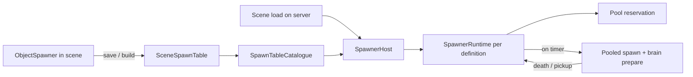

# Spawner System

**Short description:** Server-only, condition-driven framework for spawning and respawning networked objects in FishMMO: spawners are authored in world scenes, baked into server-only tables, and run by the scene server with configurable selection strategies, conditional gating, physics-based placement, and a pre-warmed object pool that gives a map a fixed memory footprint.

## Table of Contents

- [Overview](#overview)
- [Supported Platforms](#supported-platforms)
- [Features](#features)
- [Prerequisites](#prerequisites)
- [Installation / Build](#installation--build)
- [Quick Start Guide](#quick-start-guide)
- [Configuration](#configuration)
- [Usage Examples](#usage-examples)
- [Operational Checks](#operational-checks)
- [Flow Diagram](#flow-diagram)
- [Project Structure](#project-structure)
- [License](#license)

## Overview

The Spawner system spawns and respawns networked objects — NPCs, world items, gathering nodes, containers — with configurable selection (linear, random, weighted), conditional respawn gating (OR and AND lists), bounding-box placement with ground detection, pooling through FishNet, and per-object respawn timers.

### Authored in the scene, run from a table

World scenes are built into **one addressable bundle shared by clients and servers**, so anything left in a scene ships to every player. A spawner is therefore split in two:

| Piece | Where it lives | What it does |
|---|---|---|
| `ObjectSpawner` | A world scene, on a GameObject tagged `EditorOnly` | Design-time placement and settings. Inert at runtime; never reaches a build. |
| `SceneSpawnTable` | `Assets/Prefabs/Server/SceneServer/SpawnTables/<Scene>.asset` | The scene's spawners, baked: every authored value plus where each spawner stood. |
| `SpawnTableCatalogue` | `…/SpawnTables/SpawnTableCatalogue.asset` | Every table, by scene name. Referenced by `SpawnerSystem.asset`, which is in the server-only addressable group. |
| `SpawnerSystem` / `SpawnerHost` | Scene server | On each world scene load, runs one `SpawnerRuntime` per table entry for that scene instance; drops them on unload. |
| `SpawnerRuntime` | Scene server | The spawner itself: pool reservation, spawning, respawn timers, conditions. The spawned objects' `ISpawnOwner`. |

The bake runs from `FishMMO → Spawners → Bake Spawn Tables`, **whenever a world scene is saved**, and **before every addressables build** — which also refuses to build while any spawner is not tagged `EditorOnly` or still carries a `NetworkObject`. The tables are generated but checked in, like the world scene details cache.

It used to be a `NetworkBehaviour` on its own scene `NetworkObject` that disabled itself off the server, which shipped every spawner's configuration to every player and spent a scene network object on each.

### Deterministic memory footprint

Objects are never destroyed and re-instantiated on respawn — they are returned to FishNet's object pool with `DespawnType.Pool` and drawn back out with `GetPooledInstantiated`. That recycling alone is not enough to make a map's cost predictable, because the pool fills *lazily*: the first NPC of each kind is instantiated the moment a player walks into range, so a freshly loaded map hitches as it is explored and only reaches its true heap size once every spawner has fired at least once.

`SpawnerPool` closes that. Each spawner reserves `MaxSpawnCount + PrewarmHeadroom` instances of every prefab it can select, at scene start, de-duplicated across spawners that share a prefab. The result is a one-time load cost and a footprint you can plan capacity against, rather than one discovered under load.

This is also why the per-spawner override settings matter for memory and not only for content: one NPC prefab that becomes a weak variant at one spawner and an elite at another is **one** pool bucket. Duplicating the prefab to make the variant would be a second bucket and a second fixed slice of the budget.

## Supported Platforms

| Platform | Supported | Notes |
|----------|-----------|-------|
| Windows  | Yes       | Dedicated server only; not compiled into clients |
| Linux    | Yes       | Dedicated server only; not compiled into clients |
| WebGL    | N/A       | Server-side only system |

- **Unity Version:** Unity 6.3 LTS
- **Scripting Backend:** IL2CPP

## Features

- Server-only spawn lifecycle (spawn, despawn, respawn); nothing about spawners reaches a client
- Scene-authored, table-run: `ObjectSpawner` authoring components baked into `SceneSpawnTable`s
- One set of spawners per loaded scene instance, so stacked instances of a scene each populate themselves
- Three spawn selection strategies: Linear (sequential), Random (uniform), Weighted (proportional odds via `SpawnChance`)
- Conditional respawn gating with OR and AND condition lists (`RespawnCondition`, serialized data)
- Bounding-box placement with physics SphereCast ground detection in the scene instance's own physics scene
- FishNet object pooling via `GetPooledInstantiated()` / `Despawn(DespawnType.Pool)`
- Object pool pre-warming via `SpawnerPool.Reserve(...)`
- Per-spawner NPC overrides: attribute database, AI archetype, additional or replacement abilities, faction, corpse decay, and a random uniform scale range
- Weighted item roll tables so one world-item prefab can serve every ground pickup in the game from a single pool bucket
- NPC brains prepared before the network spawn: `AIBrainHost.Prepare` adds the brain, gives it the catalogue's (or the spawner's) archetype, and warps its NavMeshAgent onto the mesh at the spawn point
- Per-object configurable respawn timers (fixed or randomized between min/max)
- One sweep per frame for the whole scene server (`SpawnerScheduler`), and only spawners that actually have something to respawn are visited at all
- Auto-calculated vertical offset (`YOffset`) from prefab collider dimensions, computed at bake time
- Editor gizmo visualization of bounding box and spawn area, with a warning label on a spawner that would ship
- `SpawnersClearedCondition` for boss encounters: a camp does not return while the spawner guarding it still has a live creature
- NPC corpse decay: dead NPCs remain visible for `NPC.CorpseDecayDuration` seconds (default 30s) before returning to the object pool. AI is suspended during corpse state and the NPC is immortal. `NPCSpawnableSettings.CorpseDecayDurationOverride` allows per-spawner override. Pets bypass the corpse timer and despawn immediately.
- Re-rolled attributes on each spawn: NPC seed, RNG, gender, and name are regenerated in `OnStartServer` so pooled NPCs get fresh randomized attributes each time.

## Prerequisites

- **Unity 6.3 LTS**
- **FishNetworking** — `NetworkObject`, `ServerManager`, `SceneManager` load/unload events, object pooling
- **FishMMO Shared Core** — `ISpawnable`, `ISpawnOwner`, `ICharacterDamageController`
- **FishMMO Server AI** — `AIBrainHost` for NPC brains

## Installation / Build

Integrated module within the FishMMO Server assembly. The scene server's system list (`SceneServer.unity`) runs `SpawnerSystem`, and `SpawnerSystem.asset` names `SpawnTableCatalogue.asset`; `SpawnerSystem.asset` is in the `Server_Static_Permanent` addressable group, which pulls every table into the server-only bundle.

Scenes authored before the move carry networked spawners. `FishMMO → Spawners → Migrate Scene Spawners` tags every spawner `EditorOnly`, removes the `NetworkObject` that existed only for it, and bakes the tables. `[MovedFrom]` on the settings classes lets old scenes' `[SerializeReference]` records resolve to the server assembly.

## Quick Start Guide

1. Add an `ObjectSpawner` component to an empty GameObject in a world scene (`Add Component → FishMMO/Server/Object Spawner`). The GameObject is tagged `EditorOnly` automatically.
2. Configure `Spawnables` — pick a settings type (NPC, item) and assign its prefab.
3. Set `InitialSpawnCount` and `MaxSpawnCount` to control concurrency.
4. Choose a `SpawnType` (Linear, Random, or Weighted).
5. Optionally configure `BoundingBoxSize` and enable `RandomSpawnPosition` for area-based placement.
6. Optionally add respawn conditions to `OrConditions` / `TrueConditions`.
7. Save the scene. The scene's table is baked on save; check the console for bake warnings.

### Shipped spawners

| Scene | Spawner | Produces |
|---|---|---|
| StartScene A | `NPCSpawner` | Up to 4 of: banker, general merchant, ability crafter, ground loot |
| StartScene A | `OrcSpawner` | Up to 9 of: orc, orc warrior, orc mage |
| StartScene B | `MerchantSpawnArea` | One of: general merchant, banker, ability crafter |
| Tutorial Spawners | `Banker Spawner`, `Ability Crafter Spawner`, `General Merchant Spawner` | Up to 5 of their one townsperson each |
| Tutorial Spawners | `World Item Spawner` | Up to 10 ground loot items |
| Dungeon | `Orc 2`, `Orc 3` | One orc each, weighted: `an orc` 0.5, `an orc warrior` 0.3, `an orc mage` 0.2; prefab respawn cadence |
| Dungeon | `Chest` | `Dungeon Chest`: fixed position on the floor, respawns 5–10 minutes after it is emptied |

`SpawnTableBakeTests.EveryShippedSpawner_SpawnsSomething` fails on any spawner whose entries are empty or name no prefab, which the runtime skips without a word. The Dungeon's three spawners and the tutorial banker shipped that way until 2026-09-16.

**Placement.** With `RandomSpawnPosition` on, the object lands at the ground hit plus the spawnable's `YOffset` — a sphere's radius, but a box's or capsule's **full height**, which suits prefabs whose pivot is at their centre. A prefab whose pivot is at its base (the `Dungeon Chest`) turns random placement off and has its spawner stand on the floor. The ground probe starts at the top of the bounding box and reaches down its full height, so a spawner placed above the floor needs a box at least twice that tall; the Dungeon orc spawners stand 0.5 m up with a 1.5 m box.

## Configuration

### ObjectSpawner (authoring) and SpawnerDefinition (baked)

| Field                | Type                          | Default        | Description                                          |
|----------------------|-------------------------------|----------------|------------------------------------------------------|
| `InitialSpawnCount`  | `int`                         | 0              | Objects spawned immediately on start                 |
| `MaxSpawnCount`      | `int`                         | 1              | Maximum concurrent spawned objects                   |
| `UniqueSpawnables`   | `bool`                        | false          | At most one live instance of each entry              |
| `SpawnType`          | `ObjectSpawnType`             | Linear         | Selection strategy for choosing from the list        |
| `RandomRespawnTime`  | `bool`                        | true           | If true, randomizes between min/max respawn times; otherwise the maximum is used |
| `InitialRespawnTime` | `float`                       | 0              | Respawn delay for an object with no settings and no cadence of its own |
| `RespawnCheckIntervalMinimum` | `float`              | 3              | Shortest delay between this spawner's respawn checks |
| `RespawnCheckIntervalMaximum` | `float`              | 6              | Longest delay; each check re-rolls inside the range so spawners do not poll in lockstep |
| `RandomSpawnPosition`| `bool`                        | true           | If true, picks random position within bounding box   |
| `BoundingBoxSize`    | `Vector3`                     | (1, 1, 1)      | Size of the spawn area                               |
| `SphereRadius`       | `float`                       | 0.5            | SphereCast radius for ground detection               |
| `Spawnables`         | `List<SpawnableSettings>`     | —              | `[SerializeReference]` list of spawnable configurations |
| `OrConditions`       | `List<RespawnCondition>`      | —              | Any condition true → respawn allowed (logical OR)    |
| `TrueConditions`     | `List<RespawnCondition>`      | —              | All conditions must be true (logical AND)            |
| `PrewarmPool`        | `bool`                        | true           | Instantiate this spawner's prefabs into the pool at scene start |
| `PrewarmHeadroom`    | `int`                         | 1              | Extra pooled instances beyond `MaxSpawnCount`, covering corpses that have not yet decayed |

The baked `SpawnerDefinition` adds `Name`, `Position` and `Rotation` — where the spawner stood.

Turn `PrewarmPool` off only for spawners whose prefabs are large and rarely used, where paying the cost on demand is preferable to paying it always.

### SpawnableSettings

| Field               | Type             | Default | Description                                          |
|---------------------|------------------|---------|------------------------------------------------------|
| `NetworkObject`     | `NetworkObject`  | —       | The prefab to spawn                                  |
| `MinimumRespawnTime`| `float`          | 0       | Minimum respawn delay (seconds)                      |
| `MaximumRespawnTime`| `float`          | 0       | Maximum respawn delay (seconds)                      |
| `SpawnChance`       | `float [0–1]`    | 0.5     | Selection weight for weighted spawn mode             |
| `YOffset`           | `float`          | auto    | Vertical offset from ground, calculated from collider at bake time |

### NPCSpawnableSettings

Per-spawner overrides that let one NPC prefab serve a whole zone's worth of variants. Everything but the archetype is applied in `OnSpawned`, which runs after the object leaves the pool and before `ServerManager.Spawn` — that is, before `NPC.OnStartServer` rolls attributes and learns abilities, and before the spawn payload is written to clients. The archetype goes to `AIBrainHost.Prepare` once the NPC is in its scene.

| Field | Type | Default | Description |
|---|---|---|---|
| `AttributeBonusOverride` | `NPCAttributeDatabase` | — | Replaces the prefab's attribute database |
| `CorpseDecayDurationOverride` | `float` | 0 | Corpse decay seconds; 0 = prefab default |
| `EmptyCorpseDecayDurationOverride` | `float` | 0 | Empty-corpse decay seconds; 0 = prefab default |
| `LootTableOverride` | `LootTableTemplate` | — | Replaces the prefab's loot table |
| `ArchetypeOverride` | `AIArchetypeTemplate` | — | Replaces the prefab's whole AI brain; empty = the prefab's brain catalogue entry |
| `AdditionalAbilities` | `List<AbilityTemplate>` | — | Abilities granted on top of the prefab's list |
| `ReplacePrefabAbilities` | `bool` | false | Replace the prefab's ability list rather than extending it |
| `FactionOverride` | `RaceTemplate` | — | Replaces the prefab's race template / faction source |
| `MinimumScale` / `MaximumScale` | `float` | 1 / 1 | Random uniform scale range; 1..1 leaves the prefab scale alone |

Every override resolves to "this spawner's value, or the prefab's" — never to whatever a pooled instance carried from its last spawner.

The scale is deliberately uniform: a non-uniform scale would desynchronise the NavMeshAgent's radius and height from the collider.

### ItemSpawnableSettings

| Field | Type | Default | Description |
|---|---|---|---|
| `ItemTemplate` | `BaseItemTemplate` | — | Item spawned when `RollTable` is empty |
| `MinimumAmount` / `MaximumAmount` | `int` | 1 / 1 | Stack size range |
| `RollTable` | `List<ItemRoll>` | — | Optional weighted table; when non-empty, one entry is rolled per spawn |
| `AchievementTemplateID` | `int` | 0 | Achievement granted on pickup; 0 = none |

Each `ItemRoll` carries its own template, stack range and weight. `OnValidate` repairs inverted stack ranges and negative weights, which would otherwise be a spawn-time exception on a live server rather than a bad item.

`OnSpawned` writes the rolled template and stack amount onto the spawned `WorldItem`, plus a
non-zero **generation seed** onto the `WorldItem` (two 16-bit draws from
`DeterministicRNG.Shared`, retried while zero). Zero is `Item.Initialize`'s sentinel for "derive a
seed from the database id", and a freshly granted item has no id — so a drop spawned without one
rolled its attributes from `RNG(0)`, identically for every drop of that template, and re-rolled
them differently after the next relog once a real row id existed.

### ObjectSpawnType Enum

```
ObjectSpawnType : byte
├── Linear   = 0   # Sequential cycling through the list
├── Random   = 1   # Uniform random selection
└── Weighted = 2   # Weighted random using SpawnChance values
```

## Usage Examples

### ISpawnable and ISpawnOwner

`ISpawnable` (Shared Core) is implemented by any entity a spawner produces. It knows its owner only as an `ISpawnOwner` — the spawner's settings for it are the spawner's bookkeeping.

| Member             | Type                | Description                                         |
|--------------------|---------------------|-----------------------------------------------------|
| `Spawner`          | `ISpawnOwner`       | The spawner that created this entity, or null       |
| `NetworkObject`    | `NetworkObject`     | FishNet network object for synchronization          |
| `ID`               | `long`              | Unique identifier for the spawned entity            |
| `Despawn()`        | `void`              | Hands the entity back to its spawner, or despawns it directly when it has none |

### Spawn Selection Logic (`GetSpawnIndex`)

| SpawnType  | Selection Logic                                                    |
|------------|--------------------------------------------------------------------|
| `Linear`   | Increments an index, wrapping at list end                          |
| `Random`   | Uniform random                                                     |
| `Weighted` | Cumulative weight: picks based on `SpawnChance` proportional odds  |

### Respawn Conditions

`RespawnCondition` is a `[Serializable]` class held by `[SerializeReference]`; subclasses implement `OnCheckCondition(SpawnerRuntime)`. A condition that names other scene objects resolves them at bake time through `Bake(authored, resolveSpawnerIndex)`: a baked table is loaded without its scene, so it may only refer to its siblings by index.

#### SpawnersClearedCondition

Allows respawn only when nothing the listed spawners produced is still alive:

- Authored as a list of `ObjectSpawner`s in the same scene; baked into `SpawnerIndices`.
- Walks each named sibling's live objects; any character whose damage controller is alive blocks the respawn.
- Non-character spawns never block, and an index outside the table is ignored.

Typical use: a camp that does not return while its guard stands.

### External Integration Points

- **NPC System** — NPCs implement `ISpawnable`; `NPC.ReturnToPool` hands a decayed corpse back to its spawner.
- **AI System** — `AIBrainHost.Prepare(npc, spawnPosition, archetypeOverride)` runs after the scene move and before the network spawn.
- **Pet System** — pets are spawned by `PetSystem`, not by spawners, and despawn directly.
- **Scene Server** — `SpawnerHost` follows FishNet's server-side `OnLoadEnd` / `OnUnloadEnd`, and starts a loaded scene one update later so the scene server's own handler (difficulty rules, orphan unloads) has always run first.
- **Build** — `CustomBuildTool` bakes the tables and refuses to build while a spawner would ship.

## Operational Checks

| Check | How to Verify | Expected Result |
|-------|---------------|-----------------|
| Nothing ships | `SpawnTableBakeTests.ABuiltWorldScene_ReferencesNoSpawnerAndNoSpawnerData` | Built world scenes reference no spawner |
| Tables up to date | `SpawnTableBakeTests.EverySceneWithSpawners_HasABakedTableThatMatchesIt` | Every scene's table matches its spawners |
| Initial spawn | Run a scene server with `InitialSpawnCount > 0` | Correct number of entities spawned once the scene loads |
| Max spawn cap | Verify `SpawnedCount` never exceeds `MaxSpawnCount` | Count stays at or below configured maximum |
| Weighted selection | Set `SpawnType = Weighted` with varied `SpawnChance` | Higher-chance entries spawn proportionally more |
| Respawn timer | Kill an NPC, wait out corpse decay and respawn delay | New entity spawns after configured delay |
| Conditions | `SpawnerSchedulerTests` | A refused respawn keeps its deadline and its place in the schedule |
| Stacked instances | Load two instances of one world scene | Each instance populates itself; unloading one leaves the other alone |
| Scheduler membership | Read `SpawnerHost.Scheduler.ActiveCount` with every spawner at its cap | Zero — a world at rest costs nothing per frame |

## Flow Diagram

### High-Level Overview



### Spawn Lifecycle

#### Start (`SpawnerRuntime.Start`, one update after the scene loads)

1. Reserves pool instances for every prefab the spawner can select.
2. Spawns `InitialSpawnCount` objects (clamped to `MaxSpawnCount`).
3. Creates respawn timers for the remaining slots.
4. Joins the scheduler if it has any timers.

#### Spawn (`SpawnObject`)

1. Selects a `SpawnableSettings` via `GetSpawnIndex()` (and a free entry when `UniqueSpawnables`).
2. If `RandomSpawnPosition`, sphere-casts down from a random point at the top of the box in the scene instance's physics scene and adds `YOffset`.
3. Retrieves a pooled instance via `GetPooledInstantiated()`.
4. Applies the settings (`OnSpawned`).
5. Moves the object to the scene instance.
6. For an NPC, prepares its brain through `AIBrainHost`.
7. Sets the object's `Spawner` to this runtime, spawns it, and records it with its settings.
8. Clears respawn timers if `MaxSpawnCount` is reached.

#### Despawn

1. Removes the entity (and its settings record); a second despawn of the same object is ignored.
2. Schedules a respawn timer from the settings' cadence, or the NPC's own.
3. Clears the entity's `Spawner`.
4. Returns the object to the pool via `ServerManager.Despawn(DespawnType.Pool)`.

#### Scene unload

The scene's runtimes leave the schedule and forget their bookkeeping; the objects go with the scene, and any still pointing at a stopped runtime has its `Spawner` cleared.

### Respawn Loop (`TryRespawn`)

1. Skips if no spawnables or no pending timers.
2. Clears all timers if `SpawnedCount >= MaxSpawnCount`.
3. Returns immediately if no timer has elapsed.
4. Evaluates the respawn conditions **once** for the pass.
5. Consumes **every** elapsed timer, spawning one object each, stopping at `MaxSpawnCount`.

A refused respawn consumes no timer: the spawner keeps its work and is re-tested on its own interval, which is what lets a camp come back once the boss guarding it dies.

### Who gets asked, and how often (`SpawnerScheduler`)

- **How often a spawner polls** is its own `RespawnCheckIntervalMinimum` / `Maximum`, re-rolled each pass. Respawn deadlines are wall-clock `DateTime` values, so a longer interval does not shift them.
- **Which spawners are asked at all** is the scheduler's membership list. A spawner joins when it has something to respawn and leaves the moment it does not, so a spawner at its cap costs nothing.

`SpawnerSystem.OnUpdate` ticks the host once per frame. The list is *swept* rather than walked — each frame covers a `FramesPerSweep`-th of it. The scheduler is an instance per host, so a simulation running beside a server does not walk the server's spawners.

## Project Structure

```
Spawner/                                   # Server/Implementation/World/SceneServer/Spawner
├── ObjectSpawner.cs              # Authoring component (EditorOnly); inert at runtime
├── SpawnerDefinition.cs          # One baked spawner
├── SceneSpawnTable.cs            # One scene's baked spawners
├── SpawnTableCatalogue.cs        # Every table, by scene name
├── SpawnerSystem.cs              # Scene server behaviour; ticks the host
├── SpawnerHost.cs                # Starts/stops runtimes per scene instance
├── SpawnerRuntime.cs             # The running spawner; ISpawnOwner
├── SpawnerScheduler.cs           # Active list of spawners with work
├── SpawnerPool.cs                # Pool pre-warming
├── ObjectSpawnType.cs
├── Settings/
│   ├── SpawnableSettings.cs
│   ├── ItemSpawnableSettings.cs
│   └── NPCSpawnableSettings.cs
└── Condition/
    ├── RespawnCondition.cs
    └── Types/
        └── SpawnersClearedCondition.cs
```

Related: `Shared/Core/Entity/Spawner/ISpawnable.cs`, `ISpawnOwner.cs`; editor tooling in `Shared/Implementation/Tools/Extensions/Unity/Editor/Spawner/` (`SpawnTableBaker`, `SpawnerSceneMigration`, `SpawnerBuildStripper`).

## License

This project is subject to the FishMMO project license.
