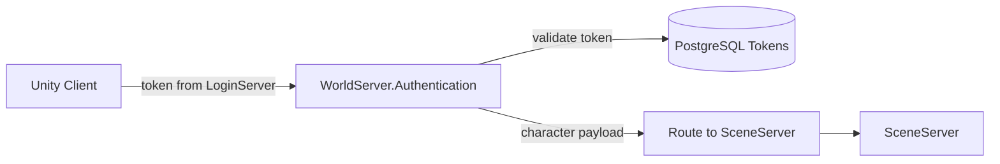

# World Server Authentication System

**Short description:** World-server-specific authentication gate that enforces admission rules (server lock, population cap, selected-character requirement) after shared token-based authentication succeeds, with per-account rate limiting and bounded memory sweeps.

## Table of Contents

- [Overview](#overview)
- [Supported Platforms](#supported-platforms)
- [Features](#features)
- [Prerequisites](#prerequisites)
- [Installation / Build](#installation--build)
- [Quick Start Guides](#quick-start-guides)
- [Configuration](#configuration)
- [Usage Examples](#usage-examples)
- [Operational Checks](#operational-checks)
- [Flow Diagram](#flow-diagram)
- [Project Structure](#project-structure)
- [License](#license)

## Overview

The WorldServer Authentication system specializes the shared token-based authenticator flow for world-server entry. After base token authentication succeeds, it enforces world-specific admission rules (server lock state, population limit, selected-character requirement) and returns world-scoped authentication outcomes (`WorldLoginSuccess`, `ServerFull`, etc.).

The implementation uses a layered execution model:

- **Base layer (`BaseServerAuthenticator`):** X25519 ECDH key exchange, main-thread action queue with time-sliced drain, stale-auth TTL sweeps with hard deadline enforcement, and connection encryption data management.
- **Token layer (`TokenServerAuthenticator`):** HMAC-signed token verification, bounded channel with configurable worker count for async token processing, account mapping, and the `ClientHandshake → ServerHandshake → TokenAuthBroadcast → ClientAuthResultBroadcast` flow.
- **World layer (`WorldServerAuthenticator`):** World-specific admission gate — per-account rate limiting via `ExpiringKeyTracker<string>`, server lock check, population cap enforcement, character service availability check, and selected-character verification via database query.

On successful token authentication the token layer calls `TryLoginAsync(ClientAuthenticationResult.LoginSuccess, username)`, which the world layer overrides to apply its admission checks before returning a final `ClientAuthenticationResult`.

## Supported Platforms

| Platform | Supported | Notes |
|---|---|---|
| Windows | Yes | |
| Linux | Yes | |
| WebGL | N/A | Server-only module |
| Unity 6.3 LTS | Yes | Required engine version |
| IL2CPP | Yes | Supported scripting backend |

## Features

- Inherits full X25519 ECDH handshake, main-thread marshalling, stale-auth TTL sweeps, and hard deadline enforcement from `BaseServerAuthenticator`
- Inherits HMAC-signed token verification, bounded async worker channel, and account mapping from `TokenServerAuthenticator`
- Per-account rate limiting via `ExpiringKeyTracker<string>` with a 1-second debounce window to prevent repeated expensive database calls
- Bounded memory growth guarantee — expired rate-limit entries are swept automatically during `OnAuthSweep()` with configurable scan and removal caps
- Server lock check via `IWorldServerSystemRuntimeData.IsLocked` returning `ServerFull` when the world is locked
- Population cap enforcement via `IWorldSceneMappingData<NetworkConnection>.ConnectionCount` against configurable `MaxPlayers` threshold
- Character service availability check with graceful `ServerBusy` fallback when the database service registry is unavailable
- Selected-character verification via `ICharacterService.FetchByAccountAsync(username, selected: true)` returning `WorldLoginSuccess` or `NoCharacterSelected`
- Empty/whitespace username rejection returning `InvalidUsernameOrPassword` before any database or registry access
- Async `TryLoginAsync` override — all admission checks run on the async authentication path without blocking the main thread
- Warning-level logging for rate-limited authentication attempts with account identification

## Prerequisites

- **Unity 6.3 LTS**
- **FishNetworking** — networking framework (provides `Authenticator`, `NetworkConnection`)
- **FishMMO Server Core** — provides `BaseServerAuthenticator`, `TokenServerAuthenticator`, `IWorldServerSystemRuntimeData`, `IWorldSceneMappingData<NetworkConnection>`, `ExpiringKeyTracker<string>`, and `DataContainerRegistry`
- **FishMMO Database** — provides `ICharacterService`, `CharacterData`, `DatabaseResult<T>`, and `ServiceRegistry`
- **FishMMO Shared** — provides `ClientAuthenticationResult` enum (`LoginSuccess`, `WorldLoginSuccess`, `ServerFull`, `ServerBusy`, `NoCharacterSelected`, `InvalidUsernameOrPassword`)
- **FishMMO Logging** — provides async-safe `Log.Warning`

## Installation / Build

This is an integrated module within FishMMO. It is included as part of the server-side world-server implementation and does not require separate installation. Ensure the FishMMO Server Core and its dependencies are properly configured in your Unity project.

## Quick Start Guides

1. Ensure `WorldServerAuthenticator` is present on the world server GameObject. It inherits from `TokenServerAuthenticator` (which inherits from `BaseServerAuthenticator` → FishNet `Authenticator`), so it automatically participates in the FishNet authentication lifecycle.
2. Set `maxPlayers` in the inspector to the desired concurrent player cap (default: `5000`).
3. Verify that the following data containers are registered in `DataContainerRegistry`:
   - `IWorldServerSystemRuntimeData` — provides the `IsLocked` flag for server lock checks.
   - `IWorldSceneMappingData<NetworkConnection>` — provides `ConnectionCount` for population cap enforcement.
4. Verify that the database `ServiceRegistry` is initialized and `ICharacterService` is registered for selected-character verification.
5. On client connection, the inherited base/token layers handle the ECDH handshake, token verification, and account mapping. If token auth succeeds, `TryLoginAsync` is called with `LoginSuccess` and the account username.
6. `WorldServerAuthenticator.TryLoginAsync` applies admission checks in order: username validation → rate limit → server lock → population cap → character service availability → selected character. The final `ClientAuthenticationResult` is returned to the token layer for broadcast to the client.
7. `OnAuthSweep()` runs periodically (at the base authenticator's sweep interval) and automatically evicts expired rate-limit entries.

## Configuration

### Inspector Parameters

| Parameter | Type | Default | Description |
|---|---|---|---|
| `maxPlayers` | `uint` | `5000` | Upper bound for concurrent world-server admissions. When `ConnectionCount >= MaxPlayers`, new logins receive `ServerFull`. |

### Internal Constants

| Constant | Type | Value | Description |
|---|---|---|---|
| `LoginAttemptDebounceWindow` | `TimeSpan` | `1.0 s` | Per-account rate-limit window for `TryLoginAsync`. Rapid duplicate attempts within this window are rejected with `ServerBusy`. |
| `SweepMaxScan` | `int` | `128` | Maximum entries to scan per auth sweep cycle in `OnAuthSweep()`. |
| `SweepMaxRemove` | `int` | `64` | Maximum entries to remove per auth sweep cycle in `OnAuthSweep()`. |

### Admission Rules

| Rule | Source | Outcome |
|---|---|---|
| Empty/whitespace username | `string.IsNullOrWhiteSpace(username)` | `InvalidUsernameOrPassword` |
| Per-account rate limit | `ExpiringKeyTracker<string>` (1 s debounce) | `ServerBusy` |
| World server is locked | `IWorldServerSystemRuntimeData.IsLocked` | `ServerFull` |
| World server is at capacity | `IWorldSceneMappingData<NetworkConnection>.ConnectionCount >= MaxPlayers` | `ServerFull` |
| Character service unavailable | `Server.Database?.ServiceRegistry` null or `ICharacterService` unresolvable | `ServerBusy` |
| Database fetch failed | `!fetchResult.IsSuccess` | `ServerBusy` |
| Selected character present | `ICharacterService.FetchByAccountAsync(..., selected: true)` returns data | `WorldLoginSuccess` |
| Selected character missing | Same query, no data | `NoCharacterSelected` |

### Runtime Dependencies

| Dependency | Source | Purpose |
|---|---|---|
| `IWorldServerSystemRuntimeData` | `DataContainerRegistry` | Server lock flag |
| `IWorldSceneMappingData<NetworkConnection>` | `DataContainerRegistry` | Current connection count |
| `ICharacterService` | `Database.ServiceRegistry` | Selected character verification |
| `ExpiringKeyTracker<string>` | Internal field | Per-account rate limiting with bounded memory |

## Usage Examples

### Authentication Flow (Step by Step)

1. A client connects to the world server and the FishNet `Authenticator` lifecycle begins.
2. `BaseServerAuthenticator` performs the X25519 ECDH key exchange, establishing an encrypted channel.
3. `TokenServerAuthenticator` receives the encrypted token, decrypts it, verifies the HMAC signature, and maps the account.
4. On success, `TokenServerAuthenticator` calls `TryLoginAsync(ClientAuthenticationResult.LoginSuccess, username)`.
5. `WorldServerAuthenticator.TryLoginAsync` executes:

```
TryLoginAsync(result, username)
│
├── result != LoginSuccess? → return result unchanged
├── username empty/whitespace? → return InvalidUsernameOrPassword
├── loginAttemptByAccount.TryBegin(username) fails? → return ServerBusy (rate-limited)
├── worldData.IsLocked? → return ServerFull
├── sceneData.ConnectionCount >= MaxPlayers? → return ServerFull
├── ICharacterService unavailable? → return ServerBusy
├── FetchByAccountAsync failed? → return ServerBusy
├── selected character exists? → return WorldLoginSuccess
└── no selected character → return NoCharacterSelected
```

6. The result is broadcast to the client via `ClientAuthResultBroadcast`.

### Rate Limiting Behavior

When a client rapidly retries authentication for the same account within the 1-second debounce window:

- The first attempt proceeds through all admission checks.
- Subsequent attempts within the window are immediately rejected with `ServerBusy`.
- A warning is logged: `"Rate-limited TryLoginAsync for account '{username}'"`.
- After the debounce window expires the next attempt proceeds normally.
- Expired entries are cleaned up by `OnAuthSweep()` which scans up to 128 entries and removes up to 64 per cycle.

### Extending Admission Rules

To add a custom admission rule, override `TryLoginAsync` in a subclass of `WorldServerAuthenticator`:

```csharp
internal override async Task<ClientAuthenticationResult> TryLoginAsync(
    ClientAuthenticationResult result, string username)
{
    result = await base.TryLoginAsync(result, username);
    if (result != ClientAuthenticationResult.WorldLoginSuccess)
        return result;

    // Custom check here
    return result;
}
```

## Operational Checks

| Check | How to Verify |
|---|---|
| Initialization success | Confirm `WorldServerAuthenticator` is attached to the world server GameObject and no errors appear during startup |
| Data containers available | Verify `IWorldServerSystemRuntimeData` and `IWorldSceneMappingData<NetworkConnection>` both resolve from `DataContainerRegistry` |
| Character service available | Verify `ICharacterService` resolves from `Server.Database.ServiceRegistry` |
| Successful world login | Connect with a valid token and a selected character; confirm client receives `WorldLoginSuccess` |
| No selected character | Connect with a valid token but no selected character; confirm client receives `NoCharacterSelected` |
| Server full (population cap) | Fill the server to `MaxPlayers` connections; confirm next login receives `ServerFull` |
| Server locked | Set `IWorldServerSystemRuntimeData.IsLocked = true`; confirm next login receives `ServerFull` |
| Rate limiting | Send rapid consecutive login attempts for the same account; confirm excess attempts receive `ServerBusy` and a warning is logged |
| Rate-limit sweep | Wait for auth sweep interval; confirm `ExpiringKeyTracker` entries are evicted (no unbounded memory growth) |
| Empty username rejection | Send a login with empty/whitespace username; confirm `InvalidUsernameOrPassword` is returned |
| Database service unavailable | Disconnect the database; confirm login attempts receive `ServerBusy` |
| Database fetch failure | Simulate a failed `FetchByAccountAsync`; confirm `ServerBusy` is returned |
| Token auth failure passthrough | Send an invalid token; confirm the base authentication failure result propagates unchanged |
| Auth sweep cycle | Confirm `OnAuthSweep()` runs periodically, invoking both the base sweep and `loginAttemptByAccount.SweepExpired()` |

## Flow Diagram

### High-Level Overview



### Full Authentication Pipeline

```
Client Connection
│
▼
BaseServerAuthenticator
├── X25519 ECDH Key Exchange
├── Encrypted Channel Established
├── Stale-Auth TTL Sweep (periodic)
│
▼
TokenServerAuthenticator
├── Decrypt Token Payload (max 2048 bytes)
├── HMAC Signature Verification
├── Account Mapping
├── Bounded Channel → Async Workers (2 workers, capacity 500)
│
▼
TryLoginAsync(LoginSuccess, username)
│
▼
WorldServerAuthenticator.TryLoginAsync
│
├── 1. Pre-check: result != LoginSuccess → pass through
├── 2. Username validation: empty/whitespace → InvalidUsernameOrPassword
├── 3. Rate limit: ExpiringKeyTracker.TryBegin(username, 1s)
│      └── Blocked → ServerBusy (+ warning log)
├── 4. Server lock: IWorldServerSystemRuntimeData.IsLocked
│      └── Locked → ServerFull
├── 5. Population cap: ConnectionCount >= MaxPlayers
│      └── Full → ServerFull
├── 6. Service check: ICharacterService available?
│      └── Unavailable → ServerBusy
├── 7. DB query: FetchByAccountAsync(username, selected: true)
│      ├── Fetch failed → ServerBusy
│      ├── Character found → WorldLoginSuccess
│      └── No character → NoCharacterSelected
│
▼
ClientAuthResultBroadcast → Client
```

### Auth Sweep Lifecycle

```
OnAuthSweep() [periodic, inherited interval]
│
├── base.OnAuthSweep()
│   └── BaseServerAuthenticator stale-connection purge
│
└── loginAttemptByAccount.SweepExpired(DateTime.UtcNow, 128, 64)
    └── Evicts expired rate-limit entries (bounded scan + removal)
```

## Project Structure

### Directory Tree

```
Authentication/
├── WorldServerAuthenticator.cs   # World-server-specific post-token authentication gate
└── README.md                     # This file
```

### Related Files

| File | Purpose |
|---|---|
| `Server/Implementation/Authentication/BaseServerAuthenticator.cs` | Shared X25519 ECDH handshake, main-thread queue, stale-auth TTL sweeps, hard deadline enforcement |
| `Server/Implementation/Authentication/TokenServerAuthenticator.cs` | Token-based auth pipeline: HMAC verification, bounded async channel, account mapping |
| `Server/Core/World/WorldServer/WorldServer/IWorldServerSystemRuntimeData.cs` | Interface providing `IsLocked` flag for server lock checks |
| `Server/Core/World/WorldServer/WorldScene/IWorldSceneMappingData.cs` | Interface providing `ConnectionCount` for population tracking |
| `Shared/Implementation/Network/Authentication/ClientAuthenticationResult.cs` | Enum defining all authentication result codes |
| `Server/Core/Collections/ExpiringKeyTracker.cs` | Bounded expiring key collection used for per-account rate limiting |

### Inheritance Hierarchy

```
Authenticator (FishNet)
└── BaseServerAuthenticator
    ├── X25519 ECDH handshake
    ├── Main-thread action queue (time-sliced drain)
    ├── Stale-auth TTL sweeps (hard deadline)
    └── TokenServerAuthenticator
        ├── HMAC-signed token verification
        ├── Bounded async channel (2 workers, capacity 500)
        ├── Account mapping
        └── WorldServerAuthenticator
            ├── Per-account rate limiting (ExpiringKeyTracker, 1s debounce)
            ├── Server lock / population cap checks
            ├── Selected-character DB verification
            └── Bounded auth sweep (128 scan, 64 remove)
```

## License

This module is part of the FishMMO project and is subject to the FishMMO project license. See the repository root for license details.
