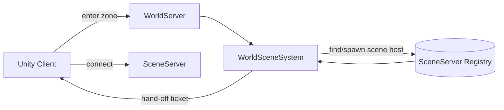

# World Scene System

**Short description:** WorldServer subsystem that routes authenticated players into the correct open-world or instanced scene endpoint, managing waiting queues, scene-server address resolution, connection counting, write-through TTL caching, request debounce, and queue-TTL hardening with all database work async and all FishNet/Unity state mutations marshalled onto the main thread.

## Table of Contents

- [Overview](#overview)
- [Supported Platforms](#supported-platforms)
- [Features](#features)
- [Prerequisites](#prerequisites)
- [Installation / Build](#installation--build)
- [Quick Start Guides](#quick-start-guides)
- [Configuration](#configuration)
- [Usage Examples](#usage-examples)
- [Operational Checks](#operational-checks)
- [Flow Diagram](#flow-diagram)
- [Project Structure](#project-structure)
- [License](#license)
- [Scene-routing queue feedback](#scene-routing-queue-feedback)
- [Routing safety nets](#routing-safety-nets)

## Overview

The World Scene system routes authenticated world-server players into the correct scene endpoint. It supports both open-world and instance scene flows, maintains waiting queues while scenes are loading, coordinates scene-server assignment, and keeps a live connection-count metric used by world admission logic. Database work is asynchronous; all FishNet/Unity state mutations are marshalled onto the main thread through a dedicated queue container.

The implementation uses a split execution model:
- **Main thread:** queue/map mutations, FishNet broadcasts, kicks, event callbacks, waiting-queue TTL purge sweeps, debounce cleanup, and scene cache sweeps.
- **Async worker:** DB fetch/update/persist operations, queue orchestration, batch character loading, batch scene-server address resolution, and connection count aggregation via `TryEnqueueAsyncWork`.
- **Main-thread queue:** marshalling async completion actions back to Unity/FishNet-safe context via `IWorldSceneSystemMainThreadQueueData`.

A runtime-data processing gate (`Interlocked.CompareExchange`) prevents overlapping queue-processing cycles. Snapshot-before-async design removes connections from waiting maps before going async, preventing re-processing and stale routing during the async window. The system includes request-debounce, queue-TTL hardening, and a write-through TTL cache layer to reduce database flood risk and prevent stale queue memory growth.

## Supported Platforms

| Platform | Supported | Notes |
|---|---|---|
| Windows | Yes | |
| Linux | Yes | |
| WebGL | N/A | Server-only module |
| Unity 6.3 LTS | Yes | Required engine version |
| IL2CPP | Yes | Supported scripting backend |

## Features

- Open-world scene routing with preferred `SceneHandle` support (channel switching via `SceneChannelSystem`) and capacity-based fallback assignment using an `InstanceCapacityHeap`
- Instance scene routing with status-aware handling: `Ready` scenes broadcast connect endpoints, `Pending`/`Loading` scenes re-queue, and unknown/terminal statuses fall back to world scene
- Bidirectional queue maps (`WaitingOpenWorldConnections` ↔ `OpenWorldConnectionScenes`, `WaitingInstanceConnections` ↔ `InstanceConnectionScenes`) enabling O(1) add/remove and fast cleanup on disconnect
- Authentication handoff via `WorldServerAuthenticator.OnClientAuthenticationResult` triggering the instance routing flow
- Connection disconnect cleanup via `ServerManager.OnRemoteConnectionState` subscription removing connections from all queues
- Per-account instance-lookup debounce (`ExpiringKeyTracker<string>`) preventing DB flood from rapid reconnect attempts
- Waiting queue TTL purge sweeps removing stale connections that exceed `waitingQueueTtlSeconds`, kicking active stale waiters and silently cleaning inactive entries. The TTL measures the **total** wait: the arrival stamp survives re-queue cycles, and only a terminal outcome (routed, purged, disconnected) clears it
- Scene-routing queue feedback: waiting clients receive a periodic `WorldSceneQueuePositionBroadcast` carrying their position, the size of the queue they are in, an estimated wait, and *why* they are waiting (`Capacity`, `SceneLoading`, `CombatLogoutBody`)
- Defense-in-depth queue size cap (`MAX_WAITING_QUEUE_SIZE = 2500` per queue type) preventing unbounded memory growth
- Write-through TTL cache for scene-instance query results (`AvailableSceneCache`, default 5 s) and scene-server addresses (`SceneServerAddressCache`, default 10 s) with failure-triggered invalidation
- Cache-aware `FetchAvailableScenesAsync` and `FetchSceneServerAddressAsync` wrappers with bypass when TTL is set to 0
- Bounded cache expiry sweeps (`SweepSceneCaches`: max 64 scan, 32 remove per cycle)
- Batch DB integration eliminating N+1 query overhead: `FetchSelectedCharactersByAccountsAsync` for character data, `FetchSceneServersByIDsAsync` for cache-miss server addresses
- Two-pass open-world routing: Pass 1 assigns preferred handles via O(1) dictionary lookup; Pass 2 assigns fallback handles via capacity heap (O(log N) per connection)
- Race guard on all `WorldSceneConnectBroadcast` dispatches: skips broadcast if connection was re-queued during async processing
- Connection count aggregation combining DB scene character totals with waiting open-world and instance queue counts, with cached scene character count TTL
- `CleanupAndEnqueueNewSceneIfNeededAsync` requesting new scene-load when connections remain waiting after routing
- Scene-server stale entry cleanup: unreachable scene servers trigger `DeleteByHandleAsync` and instance flag clearing before world-scene fallback
- Instance flag management: `ClearInstanceFlagAndFallbackAsync` clears `CharacterFlags.IsInInstance`, bumps version, persists updated record, and falls back to world scene
- Per-system main-thread queue isolation with configurable drain cap per frame (`maxMainThreadActionsPerFrame`)
- `RunOnMainThreadAsync` returning `Task<bool>` with immediate false completion on enqueue failure, preventing async callers from hanging on unfulfilled `TaskCompletionSource`
- Graceful shutdown: drains pending main-thread actions, clears all caches and trackers, unsubscribes events, and deletes world-scene DB rows for this world server with a 5-second timeout
- Async worker backpressure via `TryEnqueueAsyncWork` (rejects when queue unavailable/full, releases processing gate on failure)

## Prerequisites

- FishMMO server framework with `ServerBehaviour` base class and `DataContainerRegistry`
- FishNet networking library (provides `NetworkConnection`, `ServerManager`)
- `WorldServerAuthenticator` component present in the scene
- Database with `ISceneService`, `ISceneServerService`, and `ICharacterService` service implementations registered
- `WorldSceneDetailsCache` ScriptableObject asset configured with per-scene max client metadata
- `AsyncWorkerData` data container registered for bounded background task execution

## Installation / Build

This is an integrated module within the FishMMO server framework. No separate installation is required. It is included automatically when building or running the WorldServer.

To configure, assign the `WorldSceneSystem` ScriptableObject asset via the Unity Inspector and ensure all required data containers are registered in the `DataContainerRegistry`:
- `WorldSceneSystemRuntimeData`
- `WorldSceneMappingData`
- `WorldSceneSystemMainThreadQueueData`
- `AsyncWorkerData`

The asset is created via the Unity menu: **Assets → Create → FishMMO → Server → WorldServer → World Scene System**.

## Quick Start Guides

### Server Operator

1. Ensure the `WorldServerAuthenticator` component is in the world server scene.
2. Create a `WorldSceneSystem` ScriptableObject via **Assets → Create → FishMMO → Server → WorldServer → World Scene System**.
3. Assign the `WorldSceneDetailsCache` reference in the inspector.
4. Configure inspector fields (see [Configuration](#configuration)) or use defaults.
5. Register the system with the server's `ServerBehaviour` pipeline.
6. Start the world server — the system automatically subscribes to auth and connection events.

### During Operation

- Authenticated clients are automatically routed: instance-flagged characters go through instance routing; others enter the open-world queue.
- Monitor `ConnectionCount` on `WorldSceneMappingData` for live admission metrics.
- If scene servers go down, cached addresses auto-expire (default 10 s) and stale scene entries are cleaned on next routing attempt.
- Waiting queue TTL (default 45 s) automatically purges ghost connections.

## Configuration

### Inspector Fields

| Field | Type | Default | Clamp | Description |
|---|---|---|---|---|
| `maxMainThreadActionsPerFrame` | `int` | `100` | ≥ 1 | Max world-scene actions drained from main-thread queue per frame |
| `instanceLookupDebounceSeconds` | `float` | `3.0` | ≥ 0.1 | Minimum seconds between instance DB routing lookups for the same account |
| `waitingQueueTtlSeconds` | `float` | `45.0` | ≥ 5.0 | Maximum seconds a connection may remain in waiting queues before being purged |
| `waitingQueueSweepIntervalSeconds` | `float` | `5.0` | ≥ 1.0 | Seconds between stale waiting-queue purge sweeps |
| `debounceCleanupIntervalSeconds` | `float` | `60.0` | ≥ 5.0 | Seconds between stale debounce-entry cleanup sweeps |
| `debounceCleanupMaxScanPerSweep` | `int` | `256` | ≥ 1 | Max account debounce entries scanned per cleanup sweep |
| `debounceCleanupMaxRemovalsPerSweep` | `int` | `128` | ≥ 1 | Max account debounce entries removed per cleanup sweep |
| `waitingQueuePurgeMaxPerSweep` | `int` | `128` | ≥ 1 | Max stale queued connections purged per waiting-queue sweep |
| `queuePositionUpdateRateSeconds` | `float` | `2.0` | ≥ 0.5 | Seconds between scene-routing queue position broadcasts sent to waiting clients |
| `sceneInstanceCacheTtlSeconds` | `float` | `5.0` | ≥ 0.0 | Seconds before cached scene-instance query results expire (0 disables caching) |
| `sceneServerCacheTtlSeconds` | `float` | `10.0` | ≥ 0.0 | Seconds before cached scene-server address results expire (0 disables caching) |
| `worldSceneDetailsCache` | `WorldSceneDetailsCache` | — | — | ScriptableObject with per-scene max client metadata |

### Constants

| Constant | Value | Description |
|---|---|---|
| `MaxClientsPerInstance` | `500` | Hard cap on clients per scene instance; `GetMaxClients` clamps to `[1, MaxClientsPerInstance]` |
| `MAX_WAITING_QUEUE_SIZE` | `2500` | Per-queue-type cap preventing unbounded memory growth; effective global limit is 5000 (2 × 2500) |
| `CombatLogoutRoutingGraceSeconds` | `150.0` | How long a combat-logged character is held for the one scene instance that can hand its body back. Exceeds the 2-minute database session lease so that giving up is safe |
| `SceneLoadWaitTtlMultiplier` | `4.0` | Applied to `waitingQueueTtlSeconds` while the wait is on a scene instance still being created |

### Runtime Data Defaults

| Property | Default | Description |
|---|---|---|
| `WaitQueueRateSeconds` | `2.0` (clamped ≥ 0.5) | Queue tick interval in seconds |
| `NextWaitingQueueSweep` | Set to `waitingQueueSweepIntervalSeconds` | Countdown until first stale-queue purge |
| `NextDebounceCleanup` | Set to `debounceCleanupIntervalSeconds` | Countdown until first debounce cleanup |
| `NextQueuePositionUpdate` | `0.0` | Countdown until the next queue position broadcast |

## Usage Examples

### Authentication Routing Entry Point

When a client authenticates, `Authenticator_OnClientAuthenticationResult` fires:

```csharp
// 1. Resolve account name from connection
Server.AccountManager.GetAccountNameByConnection(conn, out string accountName);

// 2. Debounce check — prevents DB flood from rapid reconnects
TryBeginInstanceLookup(accountName);

// 3. Enqueue async instance routing
TryEnqueueAsyncWork(() => ProcessInstanceConnectionAsync(conn, skipDebounce: true));
```

### Open-World Queue Processing

Each tick, `OnUpdate` snapshots current open-world scene keys and enqueues `ProcessQueuesAsync`:

```csharp
// Snapshot waiting scene names before going async
List<string> openWorldSceneNames = new List<string>(mappingData.WaitingOpenWorldConnections.Count);
openWorldSceneNames.AddRange(mappingData.WaitingOpenWorldConnections.Keys);

// Acquire processing gate and enqueue
if (runtimeData.TryBeginProcessing())
{
    TryEnqueueAsyncWork(() => ProcessQueuesAsync(openWorldSceneNames, instanceConns));
}
```

### Preferred Handle Channel Switching

`SceneChannelSystem` sets the target `SceneHandle` before disconnect. During open-world routing, the system honours that preference:

```csharp
int preferredHandle = charData.SceneHandle;
if (preferredHandle > 0 &&
    capacityByHandle.TryGetValue(preferredHandle, out int prefRemaining) &&
    prefRemaining > 0)
{
    // Route to preferred channel — no DB update needed
    capacityByHandle[preferredHandle] = prefRemaining - 1;
    BroadcastSceneConnect(conn, prefServer);
}
```

### Fallback to World Scene

When instance routing fails (stale instance, invalid flag), the system falls back:

```csharp
// Clear instance flag and persist
characterFlags.DisableBit(CharacterFlags.IsInInstance);
var updatedChar = charData.WithFlagsVersionAndTimestamp(characterFlags, charData.Version + 1, DateTime.UtcNow);
await charService.PersistAsync(updatedChar);

// Re-queue into open-world waiting maps
await FallbackToWorldSceneAsync(conn, accountName);
```

## Operational Checks

| Check | Command / Metric | Expected |
|---|---|---|
| System initialized | Log output contains `"Initialized (WaitQueueRate=..."` | Appears once at startup |
| Connection count | `WorldSceneMappingData.ConnectionCount` | Sum of DB scene characters + open-world waiting + instance waiting |
| Queue processing active | `WorldSceneSystemRuntimeData.TryBeginProcessing()` returns `false` when busy | Gate prevents overlapping cycles |
| Debounce active | Rapid same-account reconnects within `instanceLookupDebounceSeconds` | Second attempt is silently dropped |
| TTL purge active | Connection in queue > its effective TTL | `WorldSceneQueuePositionBroadcast { QueuePosition = -1 }` sent, then the connection is closed with `Disconnect(false)` and the log shows "waiting queue TTL exceeded" |
| Queue feedback flowing | Client waiting on a full or loading scene | `WorldSceneQueuePositionBroadcast` every `queuePositionUpdateRateSeconds` with a 1-based position; the client shows a wait dialog with a Close button |
| Scene-load wait allowance | Client waiting while a scene instance loads | Not purged until `waitingQueueTtlSeconds × SceneLoadWaitTtlMultiplier` |
| Combat-logout hold | Character with `IsCombatLogged` whose instance is unavailable | Held up to `CombatLogoutRoutingGraceSeconds`, reported to the client as `CombatLogoutBody`, then routed normally |
| Queue cap enforced | Queue size reaches `MAX_WAITING_QUEUE_SIZE` | New connections kicked with "Waiting queue capacity exceeded" |
| Scene cache hit | Repeat `FetchAvailableScenesAsync` within TTL | Returns cached result, no DB call |
| Server cache invalidation | Scene server fetch fails | Cache entry invalidated, next call re-fetches |
| Shutdown cleanup | Server shuts down | Log shows `"Deinitializing: Deleting world scenes"`, DB rows removed |
| Race guard | Connection re-queued during async | Broadcast skipped, connection processes on next cycle |

## Flow Diagram

### High-Level Overview



```
┌─────────────────────────────────────────────────────────────────────┐
│                        AUTHENTICATION                               │
│  Client authenticates → Authenticator_OnClientAuthenticationResult  │
│                              │                                      │
│              ┌───────────────┼───────────────┐                      │
│              │ Debounce      │               │                      │
│              │ Check         ▼               │                      │
│              │     TryBeginInstanceLookup     │                      │
│              │         │                     │                      │
│              │    Pass │    Fail → Kick       │                      │
│              │         ▼                     │                      │
│              │  ProcessInstanceConnectionAsync│                      │
│              └───────────────────────────────┘                      │
└─────────────────────────────────────────────────────────────────────┘
                              │
              ┌───────────────┴───────────────┐
              ▼                               ▼
   ┌──────────────────┐           ┌───────────────────────┐
   │ IsInInstance=true │           │ IsInInstance=false     │
   │                  │           │                       │
   │ Fetch instance   │           │ FallbackToWorldScene  │
   │ scene from DB    │           │ Async                 │
   │       │          │           │     │                 │
   │  ┌────┴─────┐    │           │     ▼                 │
   │  ▼          ▼    │           │ AddToQueue (open-     │
   │ Ready    Pending/│           │ world waiting maps)   │
   │  │      Loading  │           └───────────────────────┘
   │  │         │     │                       │
   │  ▼         ▼     │                       ▼
   │ Fetch   Re-add   │           ┌───────────────────────┐
   │ scene   to inst.  │           │  OnUpdate (per tick)  │
   │ server  queue    │           │                       │
   │  │               │           │ 1. Drain main-thread  │
   │  ▼               │           │    queue               │
   │ Broadcast        │           │ 2. TTL purge sweep    │
   │ WorldScene       │           │ 3. Debounce cleanup   │
   │ Connect          │           │ 4. Cache sweep        │
   │                  │           │ 5. Queue tick →       │
   │ (race guard)     │           │    ProcessQueuesAsync  │
   └──────────────────┘           └───────────┬───────────┘
                                              │
                                              ▼
                                  ┌───────────────────────┐
                                  │ ProcessOpenWorldQueue  │
                                  │ Async(sceneName)       │
                                  │                       │
                                  │ 1. FetchAvailable     │
                                  │    ScenesAsync (cache) │
                                  │ 2. Resolve server     │
                                  │    addresses (batch)   │
                                  │ 3. Snapshot & dequeue │
                                  │    waiting conns      │
                                  │ 4. Batch fetch char   │
                                  │    data               │
                                  │ 5. Pass 1: preferred  │
                                  │    handle (O(1))      │
                                  │ 6. Pass 2: fallback   │
                                  │    heap (O(log N))    │
                                  │ 7. Re-queue if no     │
                                  │    capacity           │
                                  │ 8. Enqueue new scene  │
                                  │    if still waiting   │
                                  └───────────────────────┘
```

## Project Structure

### Directory Tree

```
WorldScene/
├── WorldSceneSystem.cs                    # Queue orchestration, scene routing, DB coordination
├── WorldSceneMappingData.cs               # Runtime queue/state maps for open-world and instance routing
├── WorldSceneSystemRuntimeData.cs         # Runtime state (authenticator, timers, processing gate, caches)
├── WorldSceneSystemMainThreadQueueData.cs # Per-system main-thread action queue container
└── README.md
```

### Related Core Contracts

- `Server/Core/World/WorldServer/WorldScene/IWorldSceneSystem.cs`
- `Server/Core/World/WorldServer/WorldScene/IWorldSceneMappingData.cs`
- `Server/Core/World/WorldServer/WorldScene/IWorldSceneSystemRuntimeData.cs`
- `Server/Core/World/WorldServer/WorldScene/IWorldSceneSystemMainThreadQueueData.cs`
- `Server/Core/RuntimeData/IAsyncWorkerData.cs`
- `Server/Core/RuntimeData/IMainThreadQueueData.cs`
- `Server/Core/Collections/ExpiringKeyTracker.cs`
- `Server/Core/Collections/TimedCache.cs`

### Inheritance Hierarchies

#### Behaviour

```
ServerBehaviour
└── WorldSceneSystem : IWorldSceneSystem
```

#### Runtime Data Containers

```
RuntimeDataContainer
├── WorldSceneMappingData          : IWorldSceneMappingData<NetworkConnection>
├── WorldSceneSystemRuntimeData    : IWorldSceneSystemRuntimeData
└── MainThreadQueueData (abstract)
    └── SystemMainThreadQueueData (abstract)
        └── WorldSceneSystemMainThreadQueueData : IWorldSceneSystemMainThreadQueueData
```

### Required Data Container Attributes

`WorldSceneSystem` declares four required containers:

- `[RequiresDataContainer(typeof(WorldSceneSystemRuntimeData))]`
- `[RequiresDataContainer(typeof(WorldSceneMappingData))]`
- `[RequiresDataContainer(typeof(WorldSceneSystemMainThreadQueueData))]`
- `[RequiresDataContainer(typeof(AsyncWorkerData))]`

### Runtime Data Container Details

#### WorldSceneMappingData

Bidirectional queue maps for open-world and instance connection routing. Implements `IWorldSceneMappingData<NetworkConnection>`.

| Property | Type | Purpose |
|---|---|---|
| `WaitingOpenWorldConnections` | `Dictionary<string, HashSet<NetworkConnection>>` | Connections waiting for an open-world scene, keyed by scene name |
| `OpenWorldConnectionScenes` | `Dictionary<NetworkConnection, string>` | Reverse index: connection → open-world scene name |
| `WaitingInstanceConnections` | `Dictionary<long, HashSet<NetworkConnection>>` | Connections waiting for an instance scene, keyed by instance ID |
| `InstanceConnectionScenes` | `Dictionary<NetworkConnection, long>` | Reverse index: connection → instance ID |
| `ConnectionCount` | `int` | Total managed connections (DB scene population + waiting queues) |

**Lifecycle:** `InitializeOnce()` creates empty dictionaries and zeros connection count. `Clear()` clears all dictionaries and resets count. `OnDeinitialize()` delegates to `Clear()`.

#### WorldSceneSystemRuntimeData

Mutable runtime state for queue processing, debounce, caching, and authenticator references. Implements `IWorldSceneSystemRuntimeData`.

| Property | Type | Purpose |
|---|---|---|
| `isProcessingQueue` | `int` (via `Interlocked`) | Processing gate preventing overlapping queue-processing cycles |
| `WaitQueueRateSeconds` | `float` | Queue tick interval in seconds (default 2.0, clamped ≥ 0.5) |
| `NextWaitingQueueSweep` | `float` | Countdown until stale waiting-queue purge sweep |
| `NextDebounceCleanup` | `float` | Countdown until debounce cleanup sweep |
| `InstanceLookupDebounce` | `ExpiringKeyTracker<string>` | Per-account debounce tracker preventing DB flood from rapid instance lookups |
| `WaitingQueueEnteredUtcByClientId` | `Dictionary<int, DateTime>` | Timestamps tracking when each client entered a waiting queue (for TTL purge) |
| `AvailableSceneCache` | `TimedCache<string, IReadOnlyList<SceneData>>` | Write-through TTL cache of `FetchAvailableAsync` results keyed by scene name |
| `SceneServerAddressCache` | `TimedCache<long, (string, ushort)>` | Write-through TTL cache of scene server addresses keyed by scene server ID |
| `CachedSceneCharacterCount` | `int` | Cached total character count across all scenes for connection count aggregation |
| `CachedSceneCharacterCountUtc` | `DateTime` | UTC timestamp of the last `CachedSceneCharacterCount` update |
| `LoginAuthenticator` | `WorldServerAuthenticator` | Reference to the world server authenticator for auth event subscription |
| `NextWaitQueueUpdate` | `float` | Timer countdown until next wait-queue processing tick |

**Lifecycle:** `InitializeOnce()` creates `ExpiringKeyTracker` with `OrdinalIgnoreCase` comparer, empty timestamp dictionary, and both `TimedCache` instances (scene cache uses `OrdinalIgnoreCase` comparer). `Clear()` nulls authenticator, resets all timers, clears tracker, timestamps, and both caches. `OnDeinitialize()` clears and nulls tracker, timestamp dictionary, and both caches.

#### WorldSceneSystemMainThreadQueueData

Per-system main-thread action queue. Inherits from `SystemMainThreadQueueData` (which inherits from `MainThreadQueueData`). Implements `IWorldSceneSystemMainThreadQueueData`.

Provides `Enqueue(Action)` and `Drain(int)` methods for marshalling async worker responses back to the Unity main thread.

**Why a separate concrete type?** The `DataContainerRegistry` creates independent instances per concrete type, ensuring each system gets its own isolated main-thread queue.

### External Integration Points

| Integration | Purpose |
|---|---|
| `WorldServerAuthenticator` | Auth success trigger for scene routing |
| `ISceneService` | Scene lookup, available instance fetch, enqueue new scene, delete by handle |
| `ISceneServerService` | Single and batch scene server address resolution |
| `ICharacterService` | Single and batch character fetch, scene handle persistence, flag updates |
| `WorldServerSystemRuntimeData` | World server ID context for DB scene queries |
| `WorldSceneDetailsCache` | Per-scene max client metadata |
| `AsyncWorkerData` | Bounded background execution with enqueue backpressure |
| `ExpiringKeyTracker` | Per-account debounce with bounded head-first expiry sweeps |
| `TimedCache` | Write-through TTL cache reducing scene-instance and scene-server-address DB polling |

## License

This module is part of the FishMMO project and is subject to the FishMMO project license.

## Scene-routing queue feedback

The World → Scene hop is the only leg of the connection pipeline that can legitimately wait a
long time, and it used to do so in complete silence: the client sits behind a loading overlay
with no panel, no position and no way to give up. That is indistinguishable from a hang, and it
is exactly the problem the LoginServer's admission queue already solved one hop earlier.

`WorldSceneQueuePositionBroadcast` is that same channel applied here. `BroadcastQueuePositions`
runs on the main thread every `queuePositionUpdateRateSeconds`, ranks each waiting connection
within its own group — by scene name for the open-world queue, by instance id for the instance
queue — and sends each one its position.

| Field | Meaning |
|---|---|
| `QueuePosition` | 1-based position while waiting; `0` = routed (a `WorldSceneConnectBroadcast` follows); `-1` = the wait was abandoned and the connection is closing |
| `TotalQueued` | Size of the group this client is waiting in |
| `EstimatedWaitSeconds` | Derived from `routedLastCycleByScene`; `0` means unknown, which the client renders as "Please wait…" rather than as no wait |
| `Reason` | `Capacity`, `SceneLoading`, or `CombatLogoutBody` |

**A healthy login never sees this dialog.** Every routed client passes through the queue — it
is enqueued on authentication and emptied by the next routing cycle — so a sweep landing in
that gap would flash "Queue position: 1 of 1" over a login that was never really queued.
Connections are ranked across the whole group but only *notified* once they have waited longer
than one full routing cycle (`QueueFeedbackDelayCycles`, floored at
`QueueFeedbackDelayMinSeconds`), so a client that crosses the threshold still sees its true
position.

Both routing paths go through `BroadcastSceneConnect`. The instance path used to hand-roll its
own copy, which checked only the instance queue for the re-queue race, never sent the
position-0 that dismisses the wait dialog, and never cleared the wait tracking. The shared
helper checks both queues, because a connection can be put back on either and routing one that
is waiting on the other sends it somewhere the later decision did not choose.

Positions go out on the unreliable channel — they are re-sent every sweep, so a lost one is
corrected by the next. `0` and `-1` are one-shot transitions with nothing behind them and go
reliably; losing one strands the wait dialog on screen. For the same reason the TTL purge sends
`-1` and then calls `Disconnect(false)` rather than `Kick`, because `Kick` calls
`Disconnect(true)`, which drops the transport immediately and discards the notice with it.

### Why the reason matters

The three waits look identical to a player and mean very different things:

- **`Capacity`** — every running instance of the target scene is full. Bounded by
  `waitingQueueTtlSeconds`.
- **`SceneLoading`** — a scene instance has been requested and is still loading on a scene
  server. Bounded by `waitingQueueTtlSeconds × SceneLoadWaitTtlMultiplier`, because a large
  world scene can take longer to load than the capacity TTL allows, and purging then bounces a
  player whose zone was seconds from ready straight into a reconnect that re-enters the same
  queue.
- **`CombatLogoutBody`** — the character's body is still standing in one specific instance and
  only the scene server holding it can hand it back. Bounded by
  `CombatLogoutRoutingGraceSeconds` instead of by the TTL, which it keeps at bay by restarting
  the wait clock on every cycle it holds.

### The TTL had to be made real first

None of this helps if the wait is unbounded, and it was. `AddToQueue` re-stamped the arrival
time on every add, and the routing snapshot cleared it outright — so `waitingQueueTtlSeconds`
measured "time since the last routing cycle touched this connection" (≈ 2 s) and the purge could
never fire. Meanwhile `SweepStrandedResidents` pushes its own deadline forward for any
connection that *is* queued, so nothing else bounded it either: a client waiting on capacity
that never arrived waited forever.

The arrival stamp now survives re-queue cycles. `RecordQueueEntryTime` only stamps a connection
that does not already have one, `RemoveFromQueue` deliberately leaves it alone, and
`ClearQueueTracking` is called from the three terminal outcomes — routed
(`BroadcastSceneConnect`), purged (`PurgeExpiredWaitingConnections`), and disconnected
(`OnRemoteConnectionStopped`). `ResetQueueEntryTime` is the single documented exception, used
only by the combat-logout hold.

### Two clocks, because they answer different questions

`WaitingQueueEnteredUtcByClientId` answers *should this wait be cut short*, and the
combat-logout hold restarts it every cycle precisely so that it is not.
`waitingSinceByClientId` answers *how long has this player been waiting*, and nothing resets
it. Reporting and ranking both read the second.

Using one clock for both is a trap worth naming, because it silently disables the feature for
the case that needs it most: a combat-logout hold resets the clock on every routing cycle, so
the reporting delay is never satisfied and a player waiting up to
`CombatLogoutRoutingGraceSeconds` for their own body is told nothing at all. Ranking is wrong
for the same reason — a held connection keeps sorting to the back of its own queue while
clients that arrived after it move ahead.

## Routing safety nets

**Residency watchdog.** The world server is a router: a client authenticates, receives a
`WorldSceneConnectBroadcast`, and disconnects on its own to dial the scene server. Every step in
between can drop the client somewhere no sweep would find it — the routing snapshot empties the
waiting queues before going async, and both delivery paths go through `TryEnqueueMainThread`,
which returns false and discards the action when the main-thread queue is saturated. A
connection lost that way sits authenticated on the world server forever with no scene and no
error.

`worldResidencyDeadlineByClientId` bounds every such path at once: a connection still here
`WorldResidencyGraceSeconds` (90 s) after authenticating, and **not in any waiting queue**, is
disconnected so its own reconnect loop brings it back to be routed again. Queued connections
have their deadline pushed forward rather than being kicked — `PurgeExpiredWaitingConnections`
owns that case with its own shorter TTL, and kicking here would interrupt the combat-logout
routing deferral, which deliberately holds a connection for up to 150 s.

**Bounded main-thread dispatch.** `RunOnMainThreadAsync` times out after 30 s. A successful
enqueue only promises the action is *queued*; it is run by `OnUpdate`, which stops being called
the moment this behaviour is deinitialized or the server stops. Anything queued after the single
drain in `OnDeinitialize` never ran, and the awaiting worker waited forever — holding an
async-worker slot for the life of the process. Enough of those starve the shared pool, at which
point every system's database work is silently rejected.
