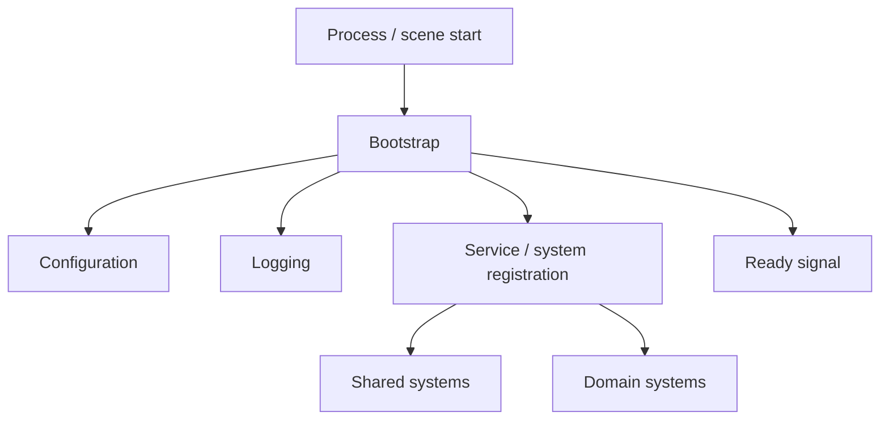

# Bootstrap System

**Short description:** The Bootstrap system manages sequential, event-driven initialization of FishMMO — including Addressable asset and scene loading, logging setup, version management, dynamic load-path overrides, and graceful shutdown — across Editor, Standalone, and WebGL platforms.

## Table of Contents

- [Overview](#overview)
- [Supported Platforms](#supported-platforms)
- [Features](#features)
- [Prerequisites](#prerequisites)
- [Installation / Build](#installation--build)
- [Quick Start Guides](#quick-start-guides)
- [Configuration](#configuration)
- [Usage Examples](#usage-examples)
- [Operational Checks](#operational-checks)
- [Flow Diagram](#flow-diagram)
- [Project Structure](#project-structure)
- [License](#license)

## Overview

The Bootstrap system is the first code that executes when FishMMO launches. It provides a sequential, event-driven startup pipeline where each bootstrap stage loads Addressable assets and scenes through two phases (Preload and Postload), then chains to the next stage by discovering `BootstrapSystem` components in newly loaded scenes.

Each phase waits on an `AddressableLoadBatch` — the handle returned by `AddressableLoadProcessor.BeginProcessQueue()`, which tracks exactly the items that call enqueued and raises `Completed` once those items, and only those items, have finished. Completion is deliberately *not* taken from the processor's global `OnProgressUpdate` event: that event is shared by every bootstrap system, both loading screens, and the world-scene readiness handshake, so any queue draining anywhere reported "done" to all of them at once.

`MainBootstrapSystem` is the entry point placed in the initial Unity scene. It auto-starts via `Awake()`, initializes the structured logging framework (bridging Unity's `Debug.Log` with FishMMO's central `Log` manager), reads `VersionConfig` for game version validation, enqueues the first scene (`ServerLauncher` for server builds or `ClientPreboot` for client builds), and registers graceful shutdown handlers for both editor and standalone environments.

`DynamicAddressableLoadPathSystem` allows runtime overriding of remote Addressable asset URLs — useful for IP discovery or CDN redirection — by replacing the domain portion of HTTP/HTTPS URLs while leaving local paths unchanged.

The Logging subsystem (`Logging/` subdirectory) provides Unity-specific integration with `FishMMO.Logging`: a `UnityLoggerBridge` that intercepts all `Debug.Log` calls and routes them through the central `Log` manager, a `UnityConsoleLogger` that renders structured `LogEntry` objects with rich-text coloring back to the Unity console, a `UnityConsoleFormatter` for columnar multi-colored output, and a `UnityConsoleLoggerConfig` for per-level color theming and filtering. Re-entrant loop prevention is handled via the `IsLoggingInternally` flag.

## Supported Platforms

| Platform | Supported | Notes |
|----------|-----------|-------|
| Windows  | Yes       | Standalone builds; full Preload/Postload pipeline |
| Linux    | Yes       | Standalone and dedicated server builds |
| WebGL    | Yes       | Uses `WebGLPreloadAssets` / `WebGLPreloadScenes` compile-time lists |

| Requirement       | Version / Detail |
|-------------------|------------------|
| Unity             | 6.3 LTS          |
| Scripting Backend | IL2CPP           |

## Features

- **Two-phase Addressable loading pipeline** — each `BootstrapSystem` runs a Preload phase then a Postload phase, each with platform-specific asset and scene lists selected at compile time (`UNITY_EDITOR`, `UNITY_WEBGL`, default Standalone).
- **Per-phase load batches** — each phase waits on its own `AddressableLoadBatch` rather than on a shared progress event, so one system's completion cannot be mistaken for another's.
- **Failures never stall the chain** — a batch completes whether its items succeeded, failed, or were dropped. Failed items are logged by name through `AddressableLoadBatch.FailedItems` and boot continues; withholding completion would strand the client on a black screen with no UI and no way forward.
- **Automatic bootstrap chaining** — when a scene finishes loading, `OnBootstrapPostProcess` scans its root GameObjects (including inactive children) for `BootstrapSystem` components and calls `StartBootstrap()` on each after the current stage completes.
- **Accumulating discovery** — systems found across *every* scene a stage loads are accumulated, not overwritten per scene, so a stage that loads several scenes containing bootstraps starts all of them.
- **Virtual hook points** — `OnPreload()`, `OnPostLoad()`, `OnCompletePreload()`, `OnCompleteProcessing()`, and `OnDestroying()` allow subclasses to inject custom logic at every stage of the pipeline. `Awake()` and `OnDestroy()` are `protected virtual` and must be **overridden**, never shadowed — Unity dispatches only the most-derived member, so a second `void Awake()` in a subclass silently suppresses the base one.
- **Structured logging initialization** — `MainBootstrapSystem` configures `FishMMO.Logging.Log` with `UnityConsoleLogger`, `UnityConsoleFormatter`, `UnityLoggerBridge`, and a JSON-serializable `UnityConsoleLoggerConfig`.
- **Bidirectional Unity ↔ FishMMO log bridging** — `UnityLoggerBridge` intercepts Unity `Debug.Log` calls and routes them to `Log.Write()`; `UnityConsoleLogger` writes back to `Debug.Log` with `IsLoggingInternally = true` to prevent infinite recursion.
- **Rich-text columnar console output** — `UnityConsoleFormatter` renders timestamped, padded, color-coded log entries with exception details and additional data sections.
- **Per-level log filtering and color theming** — `UnityConsoleLoggerConfig` provides `AllowedLevels` (HashSet) and `LogLevelColors` (Dictionary) for runtime configuration.
- **Version management** — reads `VersionConfig` ScriptableObject and optionally validates against `version.txt` in standalone builds.
- **Dynamic Addressable load-path override** — `DynamicAddressableLoadPathSystem` replaces remote asset URL domains at runtime via `Addressables.ResourceManager.InternalIdTransformFunc`.
- **Graceful async shutdown** — handles `Application.wantsToQuit`, editor play-mode exit (`EditorApplication.playModeStateChanged`), and `OnDestroy` with deferred quit, logging config save, `Log.Shutdown()`, and Addressable asset release.
- **Duplicate-start and duplicate-completion guards** — `StartBootstrap()` tracks `hasStartedBootstrap`; `hasCompletedPreload` and `hasCompletedPostload` ensure `OnCompletePreload()` and `OnCompleteProcessing()` each run at most once.
- **Ownership-checked log hook release** — `Log.OnInternalLogMessage` is a single-cast static assigned by every bootstrap system's `Awake()`, so several are alive at once and the last to wake owns it. `OnDestroy()` clears it only if this instance is the current owner; clearing unconditionally silenced internal logging for every system still shutting down.
- **Boot survives a missing `VersionConfig`** — `MainBootstrapSystem` logs the error and continues with an unknown version instead of aborting `OnPreload()`. Aborting left the load queue empty, which made every downstream phase report "done" instantly and produced a permanently black screen; carrying on lets the launcher come up and report the bad version to the player.
- **Client frame rate capped before anything renders** — `MainBootstrapSystem.OnPreload()` sets `Application.targetFrameRate` to `BootstrapTargetFrameRate` (60) and zeroes `QualitySettings.vSyncCount`. Nothing else sets a target before a network connection exists and the default is `-1` (unlimited), so the launcher and login menus would otherwise render as fast as the GPU allows and peg a CPU core drawing a static screen. Headless servers are excluded (`#if !UNITY_SERVER`) — they do not render, and FishNet derives the server frame rate from the tick rate.
- **The player's saved settings are applied immediately afterwards** — `OnPreload()` raises `OnApplyClientBootSettings` on the line after the two writes above. `FishMMO.Client.ClientSettingsBootstrap` subscribes to it and applies display, audio, interface and theme preferences, then creates the input bindings. A hook rather than a direct call because the applier lives in `FishMMO.Client`, which this assembly cannot reference; a hook rather than a second `RuntimeInitializeOnLoadMethod` because ordering is the whole point — anything applied *before* those two lines is silently overwritten by them. The invocation is wrapped in `try/catch`: a settings file that cannot be applied must not stop the client booting. See [Client Settings](../../../Client/Settings/README.md).

## Prerequisites

- Unity 6.3 LTS with IL2CPP scripting backend.
- Addressables package configured with valid asset groups and load paths.
- `FishMMO.Logging` assembly (provides `Log`, `ILogger`, `IConsoleFormatter`, `ILoggerConfig`, `LogEntry`, `LogLevel`, `ConsoleFormatterHelpers`).
- `AddressableLoadProcessor` / `AddressableLoadBatch` — shared utility for queuing and draining Addressable loads, and the per-caller completion handle it hands back.
- `VersionConfig` ScriptableObject assigned in the `MainBootstrapSystem` inspector.
- `Constants` class providing `GetWorkingDirectory()`.
- Initial Unity scene containing a GameObject with the `MainBootstrapSystem` component.

## Installation / Build

This is an integrated module within the FishMMO Unity project. No separate installation steps are required. The Bootstrap classes are compiled as part of the `FishMMO.Shared` assembly and are available to both server and client builds.

Ensure the initial scene in your build settings contains a `MainBootstrapSystem` component on a root GameObject, and that the `VersionConfig` asset reference is assigned in the Inspector.

## Quick Start Guides

### Running the Bootstrap Chain

1. Open the FishMMO Unity project.
2. Ensure the initial scene (e.g., `Bootstrap` or `Main`) is the first scene in **Build Settings**.
3. Verify a root GameObject in that scene has the `MainBootstrapSystem` component attached.
4. Assign the `VersionConfig` asset in the Inspector.
5. Enter Play Mode — `MainBootstrapSystem.Awake()` triggers `StartBootstrap()`, which runs the full Preload → Postload → chain pipeline.

### Adding a New Bootstrap Stage

1. Create a new class inheriting from `BootstrapSystem`.
2. Override `OnPreload()` and/or `OnPostLoad()` to add custom initialization logic.
3. Place the component on a root GameObject in the scene that the preceding stage loads.
4. The preceding stage's `OnBootstrapPostProcess` will discover it, and `OnCompleteProcessing` will call `StartBootstrap()` on it automatically.

### Configuring Logging

1. `MainBootstrapSystem` reads the logging config from `logging.json` in the working directory (configurable via `configFileName` in the Inspector).
2. In the Editor, a `UnityConsoleFormatter` and a manual `UnityConsoleLogger` (all levels enabled) are created automatically.
3. In Standalone builds, logging is driven entirely by the JSON config file; the formatter and manual loggers are `null`.

## Configuration

### MainBootstrapSystem Inspector Properties

| Property | Type | Description |
|----------|------|-------------|
| `configFileName` | `string` | Name of the logging configuration JSON file (default: `"logging.json"`) |
| `versionConfig` | `VersionConfig` | Reference to the VersionConfig ScriptableObject |

### Bootstrap Frame Rate Cap

`BootstrapTargetFrameRate` is a **public** const (60). It is not an Inspector field because it
is not a per-scene tuning value, and it is public because it is read back on the client side:
`ClientDisplaySettings.ResolveSavedFrameRate` resolves to the same number for a player who has
no saved preference. A second copy of it in the client is how the menus end up capped at one
rate while the settings screen reports another.

Two values are written together in `OnPreload()`, both guarded by `#if !UNITY_SERVER`:

| Value | Set to | Reason |
|---|---|---|
| `Application.targetFrameRate` | `BootstrapTargetFrameRate` (60) | Default is `-1` (unlimited) until a network connection exists |
| `QualitySettings.vSyncCount` | `0` | `targetFrameRate` is **ignored entirely** while the active quality level has vSync on |

The vSync write is not cosmetic. `ProjectSettings/QualitySettings.asset` ships the
**Balanced** level with `vSyncCount: 1`, so on that level the cap silently did nothing and
the menus ran uncapped regardless.

#### What happens to these two values next

`OnApplyClientBootSettings` fires on the very next line, so both are revisited within the same
`OnPreload()` call:

| Value | Player has a saved preference | Player has none (fresh install) |
|---|---|---|
| Frame rate | `ClientDisplaySettings.ApplySavedFrameRate` → `Client.ApplyTargetFrameRate`, bounded below by the network tick rate and above by the display's fastest mode | **The bootstrap cap stands.** `ResolveSavedFrameRate` returns `BootstrapTargetFrameRate`, snapped onto a rate this machine offers |
| VSync | `ClientDisplaySettings.ApplySavedVSync` restores it | Stays `0` |

That second column is the point of the constant. It used to be overwritten by the display's
fastest mode moments after being set, which made it dead on arrival — a fresh install rendered
its launcher and login screens as fast as the panel allowed.

> **FishNet does not raise the cap.** An earlier version of this document said it did.
> `NetworkManager.UpdateFramerate` overwrites `targetFrameRate` from `ClientManager.FrameRate`
> on every connection-state change, which turned the scene's value into a hard ceiling on what
> a player could render at — so the client scene now ships with `ChangeFrameRate` **off** and
> the render rate belongs entirely to this default and the player's preference. Simulation is
> unaffected either way: gameplay runs on the fixed 30 Hz `TimeManager` tick.

A player who wants vSync gets it from the boot phase, not from opening the settings screen. The
options panel ships closed, so anything applied only by its `OnStarting()` was not in force
until the player visited the menu — see [Client Settings](../../../Client/Settings/README.md).

### BootstrapSystem Inspector Properties

Each `BootstrapSystem` exposes platform-specific load lists in the Inspector:

| Property | Platform | Phase | Type |
|----------|----------|-------|------|
| `EditorPreloadAssets` | Editor | Preload | `List<AddressableAssetKey>` |
| `EditorPostloadAssets` | Editor | Postload | `List<AddressableAssetKey>` |
| `EditorPreloadScenes` | Editor | Preload | `List<AddressableSceneLoadData>` |
| `EditorPostloadScenes` | Editor | Postload | `List<AddressableSceneLoadData>` |
| `PreloadAssets` | Standalone | Preload | `List<AddressableAssetKey>` |
| `PostloadAssets` | Standalone | Postload | `List<AddressableAssetKey>` |
| `PreloadScenes` | Standalone | Preload | `List<AddressableSceneLoadData>` |
| `PostloadScenes` | Standalone | Postload | `List<AddressableSceneLoadData>` |
| `WebGLPreloadAssets` | WebGL | Preload | `List<AddressableAssetKey>` |
| `WebGLPostloadAssets` | WebGL | Postload | `List<AddressableAssetKey>` |
| `WebGLPreloadScenes` | WebGL | Preload | `List<AddressableSceneLoadData>` |
| `WebGLPostloadScenes` | WebGL | Postload | `List<AddressableSceneLoadData>` |

### DynamicAddressableLoadPathSystem Inspector Properties

| Property | Type | Description |
|----------|------|-------------|
| `RuntimeBaseUrl` | `string` | Base URL to prepend to relative asset paths for remote Addressable loading |

### UnityConsoleLoggerConfig Properties (JSON)

| Property | Type | Default | Description |
|----------|------|---------|-------------|
| `Type` | `string` | `"UnityConsoleLoggerConfig"` | Config type identifier for serialization |
| `LoggerType` | `string` | `"UnityConsoleLogger"` | Logger type identifier for factory lookup |
| `Enabled` | `bool` | `true` | Whether the Unity console logger is active |
| `AllowedLevels` | `HashSet<LogLevel>` | All levels (Critical, Error, Warning, Info, Debug, Verbose) | Which log levels to process |
| `LogLevelColors` | `Dictionary<LogLevel, string>` | Critical/Error = `red`, Warning = `yellow`, Info = `white`, Debug = `lime`, Verbose = `grey` | Unity rich-text color per log level |

## Usage Examples

### Subclassing BootstrapSystem

```csharp
public class MyCustomBootstrap : BootstrapSystem
{
    public override void OnPreload()
    {
        // Custom initialization before preload assets finish loading.
        Log.Info("MyCustomBootstrap", "Preload phase started.");
    }

    public override void OnPostLoad()
    {
        // Custom initialization before postload assets finish loading.
        Log.Info("MyCustomBootstrap", "Postload phase started.");
    }

    public override void OnCompleteProcessing()
    {
        // Custom logic after all loading completes, before chaining.
        Log.Info("MyCustomBootstrap", "All loading complete.");
        base.OnCompleteProcessing(); // Chains to next bootstrap stages.
    }
}
```

### Overriding Addressable Load Paths at Runtime

```csharp
// Attach DynamicAddressableLoadPathSystem to a GameObject and set RuntimeBaseUrl:
// RuntimeBaseUrl = "http://cdn.example.com/"
//
// URL transformation examples:
//   "http://old-host.com/path/to/asset"   → "http://cdn.example.com/path/to/asset"
//   "http://127.0.0.1:8000/bundles/data"  → "http://cdn.example.com/bundles/data"
//   "file:///local/asset"                 → "file:///local/asset" (unchanged)
```

### Logging Configuration (logging.json)

```json
{
  "Loggers": [
    {
      "Type": "UnityConsoleLoggerConfig",
      "LoggerType": "UnityConsoleLogger",
      "Enabled": true,
      "AllowedLevels": ["Critical", "Error", "Warning", "Info", "Debug", "Verbose"],
      "LogLevelColors": {
        "Critical": "red",
        "Error": "red",
        "Warning": "yellow",
        "Info": "white",
        "Debug": "lime",
        "Verbose": "grey"
      }
    }
  ]
}
```

## Operational Checks

| Check | How to Verify | Expected Result |
|-------|---------------|-----------------|
| Bootstrap starts on Play | Enter Play Mode with `MainBootstrapSystem` in the initial scene | Console shows `[MainBootstrapSystem] Initializing...` and `Logging system initialized successfully.` |
| Version loaded | Check console output after bootstrap | `Loaded GameVersion: X.Y.Z` message appears |
| Preload phase completes | Watch console during startup | `Preload Complete` message for each `BootstrapSystem` |
| Postload phase completes | Watch console during startup | `Postload Complete` message for each `BootstrapSystem` |
| Bootstrap chaining works | Load a scene containing another `BootstrapSystem` | `OnCompleteProcessing` triggers `StartBootstrap()` on discovered systems |
| Duplicate start prevented | Attempt to call `StartBootstrap()` twice on same system | Warning: `BootstrapSystem tried to start multiple times. Ignoring.` |
| Load failures do not stall boot | Point a preload entry at a missing Addressable key | `preload finished with N failed item(s). Continuing bootstrap.` and the chain still advances |
| Missing VersionConfig does not hang | Clear the `versionConfig` reference and enter Play Mode | Error is logged, boot completes, and the launcher reports the version problem in its UI — never a black screen |
| Frame rate cap applied | Watch console during client startup | `Client frame rate capped to 60 for bootstrap and menus; a saved preference replaces it below.` |
| Cap holds on a vSync quality level | Set quality to **Balanced** (`vSyncCount: 1`), enter Play Mode, watch the launcher | Frame rate settles at ~60, not the display refresh rate or uncapped |
| VSync preference is not clobbered | Enable VSync in Options, restart the client | `QualitySettings.vSyncCount` is `1` **from boot**, before the panel is opened; the toggle still reads on when it is |
| Fresh install keeps the menu cap | Delete `Configuration.cfg`, start the client, open Options | Frame Rate Limit reads **60 FPS** and that is what is applied |
| Saved settings reach the boot phase | Set a brightness/volume/scale, restart, do **not** open Options | The setting is already in force |
| Logging bridge active | Call `Debug.Log("test")` during play | Message routed through `FishMMO.Logging.Log` with source `"UNITY"` |
| Re-entrant loop prevention | `UnityConsoleLogger` writes to `Debug.Log` | No infinite loop; `IsLoggingInternally` flag prevents re-capture |
| Graceful shutdown (Editor) | Exit Play Mode | `Editor exiting Play Mode. Initiating shutdown...` followed by synchronous `Log.Shutdown()` |
| Graceful shutdown (Standalone) | Close application | Async shutdown: logging config saved, `Log.Shutdown()` awaited, then `Application.Quit()` |
| Dynamic load path override | Set `RuntimeBaseUrl` and load remote assets | HTTP/HTTPS asset URLs have domain replaced; local paths unchanged |
| WebGL asset lists used | Build for WebGL platform | `WebGLPreloadAssets` / `WebGLPreloadScenes` selected at compile time |

## Flow Diagram

### High-Level Overview



### Full Bootstrap Loading Pipeline

```
MainBootstrapSystem.Awake()
    │
    └── StartBootstrap()
            │
            ├── Guard: skip if already started
            │
            └── InitializePreload()
                    │
                    ├── Enqueue platform-specific preload assets
                    │   ├── UNITY_EDITOR  → EditorPreloadAssets / EditorPreloadScenes
                    │   ├── UNITY_WEBGL   → WebGLPreloadAssets / WebGLPreloadScenes
                    │   └── default       → PreloadAssets / PreloadScenes
                    │
                    ├── OnPreload() — MainBootstrapSystem overrides:
                    │   ├── Load VersionConfig (asset + optional version.txt validation)
                    │   ├── Cap the client frame rate (!UNITY_SERVER only):
                    │   │   ├── QualitySettings.vSyncCount  = 0   (else the cap is ignored)
                    │   │   └── Application.targetFrameRate = 60
                    │   ├── OnApplyClientBootSettings?.Invoke()   (!UNITY_SERVER, isolated)
                    │   │   └── ClientSettingsBootstrap.Apply():
                    │   │       ├── ClientSettings.ApplyAll()  (display, audio, interface, theme)
                    │   │       ├── ClientSettingsPump.Install()
                    │   │       └── PlayerInputController.EnsureControlsCreated()
                    │   ├── Set GameVersion static string
                    │   ├── Register editor play-mode state handler (editor only)
                    │   ├── Register Application.wantsToQuit handler
                    │   ├── Configure FishMMO.Logging:
                    │   │   ├── Register UnityConsoleLoggerConfig factory
                    │   │   ├── Create UnityConsoleFormatter (editor only)
                    │   │   ├── Create manual UnityConsoleLogger list (editor only)
                    │   │   └── Log.Initialize(configFilePath, formatter, loggers, callback, configTypes)
                    │   └── Enqueue initial scene:
                    │       ├── UNITY_SERVER  → "ServerLauncher"
                    │       └── !UNITY_SERVER → "ClientPreboot"
                    │
                    └── batch = AddressableLoadProcessor.BeginProcessQueue()
                        batch.Completed += OnPreloadBatchCompleted
                            │
                            └── OnPreloadBatchCompleted(batch)
                                    │
                                    ├── Guard: hasCompletedPreload (run once)
                                    ├── Log batch.FailedItems, if any — continue regardless
                                    └── OnCompletePreload()
                                            │
                                            └── InitializePostload()
                                                    │
                                                    ├── Enqueue platform-specific postload assets/scenes
                                                    ├── OnPostLoad() — virtual hook
                                                    └── batch = BeginProcessQueue()
                                                        batch.Completed += OnPostloadBatchCompleted
                                                            │
                                                            └── OnPostloadBatchCompleted(batch)
                                                                    │
                                                                    ├── Guard: hasCompletedPostload (run once)
                                                                    ├── Log batch.FailedItems, if any
                                                                    └── OnCompleteProcessing()
                                                                            │
                                                                            └── Start discovered BootstrapSystems
                                                                                (over a snapshot — starting one
                                                                                 can append more to the list)
```

A batch with nothing to claim is already complete when `BeginProcessQueue()`
returns, and subscribing to it still invokes the handler — so a stage with an
empty queue advances synchronously rather than hanging.

### Bootstrap Chain Across Builds

```
MainBootstrapSystem (initial scene)
    │
    ├── UNITY_SERVER path:
    │   └── Loads "ServerLauncher" scene
    │       └── ServerLauncher : BootstrapSystem
    │           └── Loads world/scene server scenes
    │
    └── Client path:
        └── Loads "ClientPreboot" scene
            └── plain BootstrapSystem component
                │   (no subclass — the chain is driven entirely by its
                │    Inspector scene lists, which differ per platform)
                │
                ├── Standalone → postload "ClientLauncher"
                │       └── ClientLauncher : MonoBehaviour  (not a BootstrapSystem)
                │           news + version check + patching, and on Play:
                │           loads "ClientPostboot", calls StartBootstrap() on the
                │           ClientPostbootSystem it finds there, then unloads itself
                │
                └── Editor / WebGL → postload "ClientPostboot" directly
                        └── ClientPostbootSystem : BootstrapSystem
                            └── Loads client UI and gameplay scenes
```

The launcher is skipped in the Editor and on WebGL: neither can run the external
updater, so there is nothing for it to do. `ClientLauncher` is deliberately not a
`BootstrapSystem` — it is a terminal stage that hands control to the next
bootstrap explicitly rather than being auto-discovered and chained.

### Logging Flow

```
┌─────────────────────────────────────────────────────────────────────┐
│                        Application Code                             │
│                                                                     │
│   Unity Debug.Log("...")          FishMMO Log.Write(level, src, msg)│
│         │                                    │                      │
│         ▼                                    ▼                      │
│   ┌─────────────────┐              ┌────────────────┐               │
│   │ UnityLoggerBridge│              │  Log (static)  │               │
│   │  (ILogHandler)   │──────────►  │  FishMMO.Logging│               │
│   └─────────────────┘              └───────┬────────┘               │
│                                            │                        │
│                              ┌─────────────┼─────────────┐          │
│                              ▼             ▼             ▼          │
│                    ┌──────────────┐ ┌────────────┐ ┌──────────┐     │
│                    │UnityConsole  │ │ File       │ │ Other    │     │
│                    │Logger        │ │ Logger     │ │ Loggers  │     │
│                    └──────┬───────┘ └────────────┘ └──────────┘     │
│                           │                                         │
│                           ▼                                         │
│                    Unity Debug.Log (with IsLoggingInternally=true)   │
│                           │                                         │
│                           ▼                                         │
│                    UnityLoggerBridge passes through to default       │
│                    handler (no re-capture loop)                      │
└─────────────────────────────────────────────────────────────────────┘
```

### Shutdown Flow

```
Application.wantsToQuit / Editor ExitingPlayMode / OnDestroy
    │
    └── InitiateShutdown()
            │
            ├── Guard: skip if already shutting down
            ├── GraphicsCleanup() — releases Addressable assets
            ├── UnityLoggerBridge.Shutdown() — restores Unity's default log handler
            │
            ├── Editor path:
            │   ├── Log.Shutdown().Wait() — synchronous
            │   └── canQuitApplication = true
            │
            └── Standalone path:
                └── PerformAsyncShutdown()
                        ├── Save logging config to disk
                        ├── await Log.Shutdown()
                        ├── canQuitApplication = true
                        └── Application.Quit()
```

### URL Transformation (DynamicAddressableLoadPathSystem)

| Original URL | RuntimeBaseUrl | Transformed URL |
|---|---|---|
| `http://old-host.com/path/to/asset` | `http://new-host.com/` | `http://new-host.com/path/to/asset` |
| `http://127.0.0.1:8000/bundles/data` | `http://cdn.example.com/` | `http://cdn.example.com/bundles/data` |
| `file:///local/asset` | (any) | `file:///local/asset` (unchanged) |

## Project Structure

### Directory Tree

```
Bootstrap/
├── BootstrapSystem.cs                   # Base class for all bootstrap stages
├── MainBootstrapSystem.cs               # Entry point: logging, version, shutdown
├── DynamicAddressableLoadPathSystem.cs  # Runtime Addressable URL override
├── README.md                            # This file
└── Logging/
    ├── UnityConsoleFormatter.cs         # IConsoleFormatter for Unity rich text
    ├── UnityConsoleLogger.cs            # ILogger outputting to Unity console
    ├── UnityConsoleLoggerConfig.cs      # ILoggerConfig with level filtering and colors
    ├── UnityLoggerBridge.cs             # ILogHandler bridging Unity → FishMMO Log
    └── README.md                        # Logging subsystem documentation
```

### Inheritance Hierarchies

#### Bootstrap Systems (MonoBehaviour)

```
MonoBehaviour
└── BootstrapSystem
    └── MainBootstrapSystem
```

External subclasses (outside this directory):

```
BootstrapSystem
├── ServerLauncher           (Server)
└── ClientPostbootSystem     (Client)
```

#### Logging Interfaces

```
IConsoleFormatter
└── UnityConsoleFormatter

FishMMO.Logging.ILogger
└── UnityConsoleLogger

ILogHandler (Unity)
└── UnityLoggerBridge

ILoggerConfig
└── UnityConsoleLoggerConfig
```

### Virtual Hooks (BootstrapSystem)

| Method | When Called | Purpose |
|--------|------------|---------|
| `OnPreload()` | After preload assets/scenes are enqueued | Subclass initialization before preload begins |
| `OnPostLoad()` | After postload assets/scenes are enqueued | Subclass initialization before postload begins |
| `OnCompletePreload()` | When this system's preload batch completes | Triggers postload (can be overridden) |
| `OnCompleteProcessing()` | When this system's postload batch completes | Chains to next bootstrap stages (can be overridden) |
| `OnDestroying()` | During `OnDestroy` cleanup, before the log hook is released | Custom cleanup logic |

`Awake()` and `OnDestroy()` are `protected virtual` Unity messages rather than
hooks. Subclasses that need them must `override` and call `base` — `base.Awake()`
first (it installs the internal-log callback), `base.OnDestroy()` last (it
releases that callback, and your shutdown work still wants logging routed while
it runs).

### External Dependencies

| Dependency | Purpose |
|------------|---------|
| `AddressableLoadProcessor` | Queuing and draining Addressable asset/scene loads |
| `AddressableLoadBatch` | Per-caller completion handle returned by `BeginProcessQueue()`; exposes `Completed`, `Progressed`, `HasFailures`, `FailedItems` |
| `FishMMO.Logging.Log` | Central static log manager for routing entries to registered loggers |
| `FishMMO.Logging.ILogger` | Interface implemented by `UnityConsoleLogger` |
| `FishMMO.Logging.IConsoleFormatter` | Interface implemented by `UnityConsoleFormatter` |
| `FishMMO.Logging.ILoggerConfig` | Interface implemented by `UnityConsoleLoggerConfig` |
| `FishMMO.Logging.LogEntry` | Structured log entry (Level, Source, Message, Timestamp, ExceptionDetails, Data) |
| `FishMMO.Logging.LogLevel` | Enum: Critical, Error, Warning, Info, Debug, Verbose |
| `FishMMO.Logging.ConsoleFormatterHelpers` | Shared column widths, padding, and Unity rich-text escaping |
| `Constants` | Provides `GetWorkingDirectory()` |
| `VersionConfig` | ScriptableObject providing game version string |
| `UnityEngine.Debug` | Unity's built-in logging API |
| `UnityEngine.ILogHandler` | Unity interface for custom log handlers |
| `UnityEngine.AddressableAssets.Addressables` | Addressable asset system; `InternalIdTransformFunc` for URL overrides |

## License

This module is part of the FishMMO project and is distributed under the FishMMO project license.
