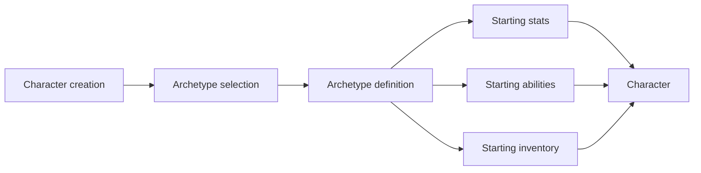

# Archetype System

**Short description:** A data-driven, template-based framework for defining character archetypes (classes/specializations) in FishMMO.

## Table of Contents

- [Overview](#overview)
- [Supported Platforms](#supported-platforms)
- [Features](#features)
- [Prerequisites](#prerequisites)
- [Installation / Build](#installation--build)
- [Quick Start Guide](#quick-start-guide)
- [Configuration](#configuration)
- [Usage Examples](#usage-examples)
- [Operational Checks](#operational-checks)
- [Flow Diagrams](#flow-diagrams)
- [Project Structure](#project-structure)
- [License](#license)

## Overview

The Archetype system is a data-driven, template-based framework for defining character archetypes in FishMMO. An archetype represents a character specialization or class, determining which abilities, items, buffs, titles, and attribute bonuses a character has access to. The system provides conditional requirement gating via `BaseCondition`, NPC guild association, FishNet network payload synchronization, and an event-driven change notification for dependent systems.

## Supported Platforms

| Platform | Supported | Notes |
|----------|-----------|-------|
| Windows  | Yes       | Full server and client support |
| Linux    | Yes       | Full server and client support |
| WebGL    | Yes       | Client only |

**Engine:** Unity 6.3 LTS  
**Backend:** IL2CPP

## Features

- Template-driven archetype definitions via `ArchetypeTemplate` ScriptableObjects with deterministic cached IDs
- Conditional unlock gating via `BaseCondition` (`ArchetypeRequirements`)
- Reward grants on unlock: attributes, abilities, items, buffs, and titles
- NPC guild association per archetype
- Per-entity `ArchetypeController` (`CharacterBehaviour`) with assignment, change detection, and event invocation
- FishNet network payload serialization (`ReadPayload` / `WritePayload`) for initial character sync
- Runtime broadcast synchronization for both owner and observer clients
- Event-driven `OnArchetypeChanged` notification for dependent systems

## Prerequisites

- **Unity 6.3 LTS**
- **FishNetworking** — NetworkBehaviour, Reader/Writer, Broadcasts
- **FishMMO Shared Core** — `CharacterBehaviour`, `CachedScriptableObject`, `BaseCondition`, `IPlayerCharacter`

## Installation / Build

This is an integrated module within the FishMMO project. No separate installation or build steps are required. The archetype system is included automatically when the FishMMO workspace is set up.

## Quick Start Guide

1. **Create an archetype template** — In the Unity Editor, right-click in the Project window and create a new `ArchetypeTemplate` ScriptableObject. Configure its description, icon, rewards, NPC guild, and requirements.
2. **Register the template** — The template self-registers in the `CachedScriptableObject` system for deterministic ID assignment via `ArchetypeTemplate.Get<ArchetypeTemplate>(id)`.
3. **Assign at runtime** — Call `archetypeController.SetArchetype(templateID)` or `archetypeController.SetArchetype(template)` on a character's `ArchetypeController`.
4. **Listen for changes** — Subscribe to `archetypeController.OnArchetypeChanged` to react to archetype assignments (e.g., grant rewards, update UI).
5. **Check requirements** — Call `archetypeTemplate.MeetsRequirements(character)` before allowing archetype unlock.

## Configuration

### ArchetypeTemplate (Inspector)

| Field                   | Type                                | Description                                                  |
|-------------------------|-------------------------------------|--------------------------------------------------------------|
| `NPCGuild`              | `NPCGuildTemplate`                  | The NPC guild associated with this archetype, if any         |
| `Icon`                  | `Sprite`                            | Icon representing this archetype in the UI                   |
| `Description`           | `string`                            | Player-facing description of the archetype                   |
| `AttributeRewards`      | `List<CharacterAttributeTemplate>`  | Attribute templates rewarded for unlocking this archetype    |
| `AbilityRewards`        | `List<BaseAbilityTemplate>`         | Ability templates rewarded for unlocking this archetype      |
| `ItemRewards`           | `List<BaseItemTemplate>`            | Item templates rewarded for unlocking this archetype         |
| `BuffRewards`           | `List<BaseBuffTemplate>`            | Buff templates rewarded for unlocking this archetype         |
| `TitleRewards`          | `List<string>`                      | Title strings rewarded for unlocking this archetype          |
| `ArchetypeRequirements` | `BaseCondition`                     | Condition that must be met to unlock this archetype          |

### ArchetypeTemplate Properties

| Property | Type     | Description                                            |
|----------|----------|--------------------------------------------------------|
| `Name`   | `string` | The archetype name, derived from the ScriptableObject's asset name |

### ArchetypeTemplate Methods

| Method                                          | Returns | Description                                                     |
|-------------------------------------------------|---------|-----------------------------------------------------------------|
| `MeetsRequirements(IPlayerCharacter character)` | `bool`  | Evaluates `ArchetypeRequirements` for the given player. Returns `true` if requirements are met or if none are set. |

## Usage Examples

### ArchetypeController Interface (IArchetypeController)

| Member                | Type / Signature                                    | Description                                                  |
|-----------------------|-----------------------------------------------------|--------------------------------------------------------------|
| `Template`            | `ArchetypeTemplate`                                 | The currently assigned archetype template (read-only)        |
| `OnArchetypeChanged`  | `event Action<ArchetypeTemplate, ArchetypeTemplate>` | Fired when archetype changes (old template, new template)    |
| `SetArchetype(int)`   | `void`                                              | Sets archetype by cached template ID                         |
| `SetArchetype(ArchetypeTemplate)` | `void`                                 | Sets archetype by direct template reference                  |

### Lifecycle Methods

| Method                                  | Description                                                              |
|-----------------------------------------|--------------------------------------------------------------------------|
| `ResetState(bool asServer)`             | Clears the `Template` reference to `null`                                |
| `ReadPayload(connection, reader)`       | Reads template ID (`int`), calls `SetArchetype(id)` if valid (>= 0)     |
| `WritePayload(connection, writer)`      | Writes template ID (`int`), or `-1` if no archetype is assigned          |

### Network Synchronization

#### Payload Serialization (FishNet Reader/Writer)

| Direction | Data Written/Read     | Description                                           |
|-----------|-----------------------|-------------------------------------------------------|
| Write     | `int` (template ID)   | Writes the template's cached `ID`, or `-1` if null    |
| Read      | `int` (template ID)   | Reads the ID and calls `SetArchetype(id)` if >= 0     |

The archetype is synchronized as part of the character's initial payload when a client receives the character's networked state. FishNet calls `WritePayload` on the server and `ReadPayload` on the client automatically for each `NetworkBehaviour` on the character.

#### Runtime Broadcast Synchronization

At runtime, archetype changes are synchronized with two broadcast paths:

| Broadcast                                  | Target            | Description |
|--------------------------------------------|-------------------|-------------|
| `ArchetypeUpdateBroadcast`                  | Owner connection  | Updates the local owner's archetype controller directly. |
| `CharacterObserverArchetypeUpdateBroadcast` | Observer clients  | Includes `CharacterID` so observers can route updates through `BaseCharacter.ClientCharacters` to the correct remote character controller. |

Observer routing avoids per-controller global fan-out by using the client-side character cache keyed by `ICharacter.ID`.

### Events

| Event (on `IArchetypeController`)  | Signature                                          | Description                                      |
|------------------------------------|----------------------------------------------------|--------------------------------------------------|
| `OnArchetypeChanged`               | `Action<ArchetypeTemplate, ArchetypeTemplate>`     | Fired when archetype changes (old, new)          |

The old template parameter may be `null` if no archetype was previously assigned (e.g., on initial assignment during character load).

### External Integration Points

- **Ability System** — `BaseAbilityTemplate.RequiredArchetype` gates ability access by archetype. `AbilityEvent.RequiredArchetype` gates individual ability events. `IsArchetypeCondition` evaluates whether a character matches a required archetype.
- **NPC Guild System** — `NPCGuildTemplate.Archetypes` links guilds to their associated archetypes. Guild interactions may be filtered by archetype membership.
- **Condition System** — `BaseCondition` is used for `ArchetypeRequirements` gating, enabling data-driven unlock prerequisites.
- **Reward Systems** — `AttributeRewards`, `AbilityRewards`, `ItemRewards`, `BuffRewards`, and `TitleRewards` are granted when an archetype is unlocked.
- **UI System** — `Icon` and `Description` are displayed in archetype selection and information panels.
- **Constants** — `ArchetypeTemplate` is registered in the `CachedScriptableObject` type list for deterministic ID assignment.

## Operational Checks

| Check | How to Verify | Expected Result |
|-------|---------------|-----------------|
| Template creation | Create `ArchetypeTemplate` ScriptableObject in Editor | Asset created with all configurable fields visible in Inspector |
| Template ID registration | Call `ArchetypeTemplate.Get<ArchetypeTemplate>(id)` | Returns the correct template instance |
| Requirement evaluation | Call `template.MeetsRequirements(character)` | Returns `true` when conditions met, `false` otherwise |
| Archetype assignment | Call `archetypeController.SetArchetype(templateID)` | `Template` property updated, `OnArchetypeChanged` fired |
| Change detection | Assign same archetype twice | Second call is a no-op (same ID check) |
| Network payload | Connect client to server with assigned archetype | `WritePayload` / `ReadPayload` round-trips template ID correctly |
| Broadcast sync | Change archetype at runtime on server | Owner receives `ArchetypeUpdateBroadcast`, observers receive `CharacterObserverArchetypeUpdateBroadcast` |
| State reset | Call `ResetState(asServer)` | `Template` cleared to `null` |

## Flow Diagrams

### Assignment Flow

```
SetArchetype(templateID)
    │
    ├── Lookup via CachedScriptableObject → ArchetypeTemplate
    │
    └── SetArchetype(template)
            │
            ├── Null check → Log warning if null
            │
            ├── Same ID check → Skip if already assigned
            │
            └── Assign + Invoke OnArchetypeChanged(oldTemplate, newTemplate)
```

## Project Structure

### Directory Structure

```
Archetype/
├── ArchetypeController.cs     # Per-entity controller (CharacterBehaviour)
├── IArchetypeController.cs    # Archetype controller interface
└── Template/
    └── ArchetypeTemplate.cs   # ScriptableObject blueprint for archetypes
```

### Related Files (Outside This Directory)

```
Shared/Implementation/Network/Character/ArchetypeBroadcasts.cs   # FishNet broadcast structs for owner + observer archetype updates
Shared/Implementation/Entity/BaseCharacter.cs                     # Client-side character cache (ClientCharacters) used for observer routing
```

### Inheritance Hierarchies

#### Templates (ScriptableObjects)

```
CachedScriptableObject<ArchetypeTemplate>
└── ArchetypeTemplate : ICachedObject
```

#### Controllers (NetworkBehaviour)

```
CharacterBehaviour
└── ArchetypeController : IArchetypeController
```

## License

This project is subject to the FishMMO project license.

## Flow Diagram


