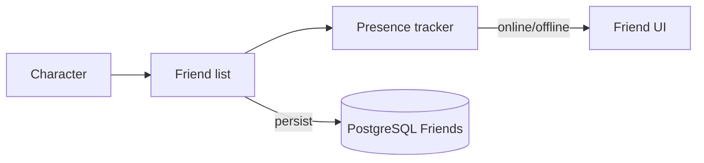

# Friend System

**Short description:** Manages player friend lists with add/remove operations, online status tracking, and FishNet network synchronization.

## Table of Contents

- [Overview](#overview)
- [Supported Platforms](#supported-platforms)
- [Features](#features)
- [Prerequisites](#prerequisites)
- [Installation / Build](#installation--build)
- [Quick Start Guide](#quick-start-guide)
- [Configuration](#configuration)
- [Usage Examples](#usage-examples)
- [Operational Checks](#operational-checks)
- [Flow Diagram](#flow-diagram)
- [Project Structure](#project-structure)
- [License](#license)

## Overview

The Friend system manages player friend lists in FishMMO. It provides a simple ID-based friend list per character, with add/remove operations, online status tracking, and FishNet network synchronization. Friend relationships are persisted to the database and restored on character load. The system uses a client-server architecture where friend requests are validated server-side with async database verification before being applied.

## Supported Platforms

| Platform | Supported | Notes |
|----------|-----------|-------|
| Windows  | Yes       | Full server and client support |
| Linux    | Yes       | Full server and client support |
| WebGL    | Yes       | Client only |

- **Engine:** Unity 6.3 LTS
- **Backend:** IL2CPP

## Features

- Simple ID-based friend list per character (`HashSet<long>`)
- Add and remove friend operations with server-side validation
- Online status tracking via broadcast payloads
- Bulk friend list sync on login via `FriendAddMultipleBroadcast`
- Async two-queue architecture: background DB operations + main-thread state marshalling
- Connection re-validation after async gap (handles mid-operation disconnects)
- Configurable maximum friend list size (default: 100)
- Self-friending prevention
- Database existence verification before adding friends
- Fire-and-forget async deletion for friend removal
- Instance events for UI integration (`OnAddFriend`, `OnRemoveFriend`)

## Prerequisites

- **Unity 6.3 LTS**
- **FishNetworking** (FishNet) — NetworkBehaviour, broadcast infrastructure
- **FishMMO Shared Core** — `CharacterBehaviour`, `IPlayerCharacter`, broadcast structs, database service interfaces

## Installation / Build

This is an integrated module within the FishMMO project. No separate installation is required. The friend scripts are included automatically when the FishMMO Unity project is opened.

## Quick Start Guide

1. **FriendController** — Automatically attached to player character prefabs as a `CharacterBehaviour`. Stores the character's friend list as a `HashSet<long>`.
2. **FriendSystem** — Server-side ScriptableObject (`ServerBehaviour`) that processes all friend broadcasts and manages async DB operations.
3. **Add a friend** — Client sends `FriendAddNewBroadcast(characterID)`. The server validates the target exists, checks capacity, persists to DB, then confirms via `FriendAddBroadcast`.
4. **Remove a friend** — Client sends `FriendRemoveBroadcast(characterID)`. The server removes immediately from memory and confirms, then fire-and-forget deletes from DB.
5. **Login sync** — On character load, `CharacterSystem` fetches the friend list from DB and populates the controller. The list is sent to the client via `FriendAddMultipleBroadcast`.

## Configuration

| Property | Type | Default | Description |
|----------|------|---------|-------------|
| `MaxFriends` | `int` | `100` | Maximum number of friends per character (configurable via inspector on FriendSystem) |

### Data Model (FriendController)

The friend list is a simple `HashSet<long>` of character IDs. There is no `Friend` runtime class — the system stores only IDs. Online status is provided transiently through broadcasts but is not persisted in the controller's state.

| Field | Type | Description |
|-------|------|-------------|
| `Friends` | `HashSet<long>` | Set of friend character IDs |

### Server Validation Rules

| Check | Purpose |
|-------|---------|
| `conn.FirstObject != null` | Connection has an active character |
| `friendController != null` | Character has a friend controller |
| `Friends.Count < maxFriends` | Friend list not full (default: 100) |
| `characterID != msg.CharacterID` | Prevents self-friending |
| `ICharacterService.FetchAsync` | Verifies the friend character exists in the database |

For removal, only connection and controller validity are checked, plus existence in the friend set.

## Usage Examples

### Instance Events

Events are defined on both `IFriendController` and `FriendController`:

| Event | Signature | When Fired |
|-------|-----------|------------|
| `OnAddFriend` | `Action<long, bool>` | When a friend is added (character ID, online status) |
| `OnRemoveFriend` | `Action<long>` | When a friend is removed (character ID) |

These are instance events (not static), so each character's controller fires its own events independently.

### Broadcast Types

| Broadcast | Direction | Purpose |
|-----------|-----------|---------|
| `FriendAddNewBroadcast` | Client → Server | Request to add a new friend |
| `FriendAddBroadcast` | Server → Client | Confirm friend added (includes online status) |
| `FriendAddMultipleBroadcast` | Server → Client | Bulk friend sync on login |
| `FriendRemoveBroadcast` | Client → Server | Request to remove a friend |
| `FriendRemoveBroadcast` | Server → Client | Confirm friend removed |

Note: `FriendRemoveBroadcast` is used bidirectionally — the same struct serves both the client request and the server confirmation.

### Async Architecture

The friend system uses a two-queue architecture for safe async-to-main-thread communication:

| Queue | Purpose |
|-------|---------|
| `AsyncWorkerData` | Executes database operations on a background thread |
| `FriendSystemMainThreadQueueData` | Marshals results back to the main thread for in-memory state changes and broadcasts |

This ensures:
- **Database operations** never block the main thread
- **In-memory state changes** and **FishNet broadcasts** always execute on the main thread
- **Connection re-validation** occurs after the async gap (connection may have disconnected during the DB query)

`OnLateUpdate` drains the main-thread queue each frame.

### External Integration Points

| System | Integration |
|--------|-------------|
| **CharacterSystem** | Loads friend list from database during character initialization via `AddFriend()` |
| **Database Layer** | Friends are persisted via `ICharacterFriendService` (add: `PersistAsync`, remove: `DeleteAsync`, load: fetched during character load) |
| **UI** | `UIFriendList` displays the friend list panel; `UIFriend` represents individual entries with remove buttons. The UI subscribes to `OnAddFriend` and `OnRemoveFriend` instance events |
| **Input System** | `PlayerInputController` toggles `UIFriendList` visibility via the Friends keybind |

## Operational Checks

| Check | Expected Result | How to Verify |
|-------|----------------|---------------|
| Add friend | Friend persisted to DB, added to local set | Add friend, verify in DB and in-game list |
| Remove friend | Friend removed from DB and local set | Remove friend, verify removal |
| Max friends enforcement | Add rejected when at capacity | Fill to `MaxFriends`, attempt add |
| Self-friend prevention | Request rejected | Attempt to add own character ID |
| Non-existent target | Request rejected after DB check | Attempt to add invalid character ID |
| Login sync | Full friend list sent on connect | Log in, verify `FriendAddMultipleBroadcast` received |
| Mid-operation disconnect | No crash; connection re-validated after async | Disconnect during DB operation, verify graceful handling |
| Online status | Correct online flag in `FriendAddBroadcast` | Add friend who is online, verify status flag |

## Flow Diagram

### High-Level Overview



### 1. Adding a Friend

```
Client sends FriendAddNewBroadcast(characterID)
  └── Server: OnServerFriendAddNewBroadcastReceived
      ├── Validate: connection active, controller exists
      ├── Validate: friend count < maxFriends
      ├── Validate: not self-friending
      └── Async task: AddFriendAsync
          ├── Verify friend character exists in DB (ICharacterService.FetchAsync)
          ├── Persist friendship to DB (ICharacterFriendService.PersistAsync)
          └── Marshal to main thread:
              ├── Re-validate connection still active
              ├── friendController.AddFriend(friendID)
              └── Broadcast FriendAddBroadcast(friendID, online) to client
                  └── Client: OnClientFriendAddBroadcastReceived
                      ├── Add to Friends set
                      └── Fire OnAddFriend event
```

### 2. Removing a Friend

```
Client sends FriendRemoveBroadcast(characterID)
  └── Server: OnServerFriendRemoveBroadcastReceived
      ├── Validate: connection active, controller exists
      ├── Validate: friend exists in Friends set
      ├── Remove from in-memory state immediately
      ├── Broadcast FriendRemoveBroadcast(friendID) to client
      │   └── Client: OnClientFriendRemoveBroadcastReceived
      │       ├── Remove from Friends set
      │       └── Fire OnRemoveFriend event
      └── Fire-and-forget async: DeleteFriendAsync
          └── ICharacterFriendService.DeleteAsync
```

### 3. Loading Friends (Login)

```
CharacterSystem.LoadCharacter
  └── Fetch friend data from DB (ICharacterFriendService)
      └── For each friend:
          └── friendController.AddFriend(friend.FriendCharacterID)
```

The initial friend list is sent to the client via `FriendAddMultipleBroadcast` during payload synchronization.

## Project Structure

### Directory Structure

```
Friend/
├── FriendController.cs            # Per-entity controller (CharacterBehaviour / NetworkBehaviour)
└── IFriendController.cs           # Friend controller interface + instance events
```

### Related Files (Outside This Directory)

```
Shared/Implementation/Network/Character/FriendBroadcasts.cs                     # FishNet broadcast structs for friend add/remove
Server/Implementation/World/SceneServer/Friend/FriendSystem.cs                 # Server-side friend management, validation, and DB persistence
Server/Implementation/World/SceneServer/Friend/FriendSystemMainThreadQueueData.cs  # Main-thread queue for marshalling async DB results
Server/Implementation/World/SceneServer/Character/CharacterSystem.cs           # Loads friend list from DB on character load
Client/UI/Controls/World/FriendList/UIFriendList.cs                            # Friend list UI panel
Client/UI/Controls/World/FriendList/UIFriend.cs                                # Individual friend entry UI element
```

### Inheritance Hierarchies

#### Controllers (NetworkBehaviour)

```
CharacterBehaviour
└── FriendController : IFriendController
```

#### Supporting Types

```
FriendAddNewBroadcast              # Client → Server: request to add a friend by character ID
FriendAddBroadcast                 # Server → Client: friend added (ID + online status)
FriendAddMultipleBroadcast         # Server → Client: bulk friend add (initial load)
FriendRemoveBroadcast              # Bidirectional: remove a friend by character ID
```

## License

This project is subject to the FishMMO project license.
