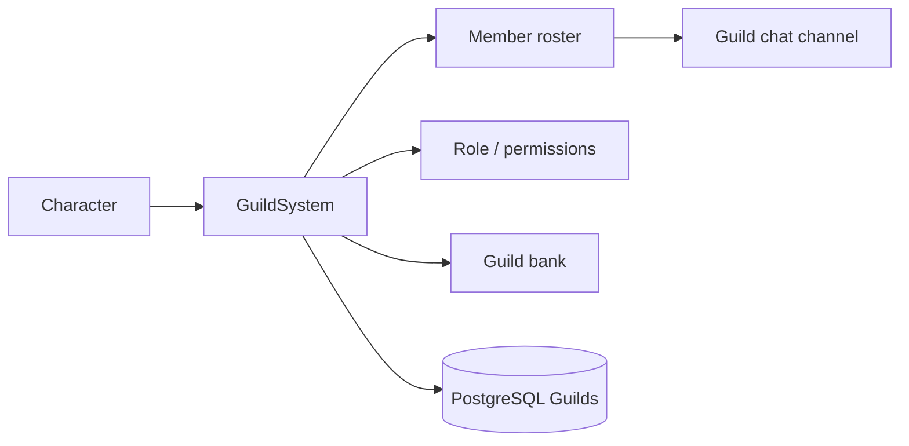

# Guild System

**Short description:** Manages player guilds with creation, invitations, rank management, and cross-server synchronization via periodic database polling.

## Table of Contents

- [Overview](#overview)
- [Supported Platforms](#supported-platforms)
- [Features](#features)
- [Prerequisites](#prerequisites)
- [Installation / Build](#installation--build)
- [Quick Start Guide](#quick-start-guide)
- [Configuration](#configuration)
- [Usage Examples](#usage-examples)
- [Operational Checks](#operational-checks)
- [Flow Diagram](#flow-diagram)
- [Project Structure](#project-structure)
- [License](#license)

## Overview

The Guild system manages player guilds in FishMMO. It supports guild creation, invitations, membership, rank management (Member / Officer / Leader), member removal, and voluntary leave with automatic leadership transfer. Guild state is persisted to the database and synchronized across multiple scene servers via a periodic polling mechanism. The system uses a client-server architecture where all mutations are validated server-side with async database operations, and results are marshalled back to the main thread for in-memory state changes and network broadcasts.

## Supported Platforms

| Platform | Supported | Notes |
|----------|-----------|-------|
| Windows  | Yes       | Full server and client support |
| Linux    | Yes       | Full server and client support |
| WebGL    | Yes       | Client only |

- **Engine:** Unity 6.3 LTS
- **Backend:** IL2CPP

## Features

- Guild creation with name validation and uniqueness checking
- Invitation system with pending invite tracking and accept/decline flow
- Three-tier rank hierarchy: Member, Officer, Leader
- Rank-based permission enforcement (invite, kick, promote)
- Automatic leadership transfer on leader departure
- Auto-deletion of empty guilds when last member leaves
- Cross-server guild synchronization via periodic database polling
- Async two-queue architecture: background DB operations + main-thread state marshalling
- SyncVar-based guild ID broadcasting to nearby players (unreliable channel, 1.0s interval)
- Reliable broadcast delivery for all guild mutation operations
- Chat command integration (`/gi`, `/ginvite`)
- Achievement integration points

## Prerequisites

- **Unity 6.3 LTS**
- **FishNetworking** (FishNet) — NetworkBehaviour, SyncVar, broadcast infrastructure
- **FishMMO Shared Core** — `CharacterBehaviour`, `IPlayerCharacter`, broadcast structs, database service interfaces

## Installation / Build

This is an integrated module within the FishMMO project. No separate installation is required. The guild scripts are included automatically when the FishMMO Unity project is opened.

## Quick Start Guide

1. **GuildController** — Automatically attached to player character prefabs as a `CharacterBehaviour`. Stores the character's guild ID (SyncVar) and rank.
2. **GuildSystem** — Server-side ScriptableObject (`ServerBehaviour`) that processes all guild broadcasts and manages async DB operations.
3. **Create a guild** — A player sends a `GuildCreateBroadcast` with a guild name. The server validates and persists the guild, then sets the creator as Leader.
4. **Invite members** — Leaders and Officers send `GuildInviteBroadcast`. The target receives the invite and can accept or decline.
5. **Chat commands** — Use `/gi <name>` or `/ginvite <name>` to invite a player by name.

## Configuration

### Server Settings (GuildSystem)

| Field | Type | Default | Description |
|-------|------|---------|-------------|
| `maxGuildSize` | `int` | 100 | Maximum members per guild |
| `updatePumpRate` | `float` | 1.0 | Seconds between cross-server guild sync polls |

### Data Model (GuildController)

| Field | Type | Description |
|-------|------|-------------|
| `ID` | `long` (SyncVar) | Guild ID; 0 = not in a guild. Synchronized via unreliable channel, server-only writes. |
| `Rank` | `GuildRank` | Character's rank within the guild (None, Member, Officer, Leader). Not synced — set from broadcasts. |

### Server-Side Data Containers

| Container | Purpose |
|-----------|---------|
| `GuildSystemRuntimeData` | Pending invitations (`Dictionary<long, long>`: target → inviter), last DB fetch timestamp |
| `GuildCharacterMappingData` | `GuildCharacterTracker`: online guild members on this server; `GuildMemberTracker`: all guild members (from DB) |

### Rank Permissions

| Action | Required Rank |
|--------|---------------|
| Create guild | Any (not already in a guild) |
| Invite member | Leader or Officer |
| Accept/Decline invite | Any (must have pending invite) |
| Leave guild | Any |
| Remove member | Officer+ (cannot kick equal or higher rank) |
| Change rank | Leader only |

### Network Synchronization

| Channel | Data | Direction |
|---------|------|-----------|
| Unreliable | `GID` SyncVar (guild ID) | Server → All (excl. owner) |
| Reliable | All guild broadcasts | Server ↔ Client |

The guild ID is synced via SyncVar at 1.0s intervals on the unreliable channel (for nearby players to see guild affiliation). All guild operations use reliable broadcasts for guaranteed delivery.

## Usage Examples

### Chat Commands

| Command | Action |
|---------|--------|
| `/gi <name>` | Invite a character to the guild by name |
| `/ginvite <name>` | Invite a character to the guild by name (alias) |

### Static Events (IGuildController)

| Event | Parameters | Description |
|-------|------------|-------------|
| `OnReadID` | `long guildID, IPlayerCharacter character` | Fired when guild ID is read or changes |

### Instance Events (GuildController)

| Event | Parameters | Description |
|-------|------------|-------------|
| `OnReceiveGuildInvite` | `long inviterCharacterID` | Guild invitation received |
| `OnAddGuildMember` | `long characterID, long guildID, GuildRank rank, string location` | Member added to guild list |
| `OnValidateGuildMembers` | `HashSet<long> memberIDs` | Full member set received for validation |
| `OnRemoveGuildMember` | `long memberID` | Member removed from guild list |
| `OnLeaveGuild` | _(none)_ | Local character left the guild |
| `OnReceiveGuildResult` | `GuildResultType result` | Result of a guild operation |

### Broadcast Types

```
GuildCreateBroadcast                 # Client → Server: request to create a guild
GuildInviteBroadcast                 # Bidirectional: invite a character to a guild
GuildAcceptInviteBroadcast           # Client → Server: accept a guild invitation
GuildDeclineInviteBroadcast          # Client → Server: decline a guild invitation
GuildAddBroadcast                    # Server → Client: guild member added (single)
GuildAddMultipleBroadcast            # Server → Client: bulk guild member add (periodic sync)
GuildLeaveBroadcast                  # Bidirectional: leave the guild
GuildRemoveBroadcast                 # Bidirectional: remove a member from the guild
GuildChangeRankBroadcast             # Client → Server: change a member's rank
GuildResultBroadcast                 # Server → Client: operation result (success/error)
GuildResultType (enum)               # Success, InvalidGuildName, NameAlreadyExists, AlreadyInGuild
```

### Integration Points

| System | Integration |
|--------|-------------|
| `CharacterSystem` | Loads guild membership from DB on character connect; fires `OnConnect`/`OnDisconnect` events |
| `ChatHelper` | Registers `/gi` and `/ginvite` chat commands for guild invites |
| `IPeriodicUpdateSystem` | Registers periodic callback for cross-server guild synchronization |
| `IGuildService` | DB service for guild creation, existence checks, and deletion |
| `ICharacterGuildService` | DB service for member CRUD, rank updates, and capacity checks |
| `IGuildUpdateService` | DB service for cross-server change notification (fetch/persist/delete) |

### Async Architecture

The guild system uses a two-queue architecture for safe async-to-main-thread communication:

1. **Async Worker Queue** (`IAsyncWorkerData`): Game logic calls `EnqueueAsyncWork()` to dispatch database operations to background threads.
2. **Main-Thread Queue** (`IGuildSystemMainThreadQueueData`): Async tasks call `EnqueueMainThread()` to marshal state changes and broadcasts back to the main thread. Drained each frame in `OnLateUpdate`.

This ensures:
- Database operations never block the game loop
- In-memory state and FishNet broadcasts only execute on the main thread
- Each guild system has its own queue slot (no collisions with other systems)

## Operational Checks

| Check | Expected Result | How to Verify |
|-------|----------------|---------------|
| Guild creation | Guild persisted to DB, creator set as Leader | Create guild, verify in DB and in-game |
| Guild name validation | Invalid/duplicate names rejected | Attempt creation with invalid or taken name |
| Invite flow | Target receives invite, can accept/decline | Send invite, check target receives broadcast |
| Capacity enforcement | Invite rejected when guild is full | Fill guild to `maxGuildSize`, attempt invite |
| Rank permissions | Non-Leader cannot change ranks; non-Officer cannot kick | Attempt restricted operations with lower ranks |
| Leadership transfer | Leader leaves, random Officer (or Member) promoted | Have leader leave, verify new leader assigned |
| Cross-server sync | Guild changes propagate to all scene servers | Modify guild on one server, verify update on another |
| SyncVar broadcast | Nearby players see guild ID update | Change guild, observe nearby clients |
| Empty guild cleanup | Guild deleted when last member leaves | Remove all members, verify guild deleted from DB |

## Flow Diagram

### High-Level Overview



### 1. Creating a Guild

```
Client sends GuildCreateBroadcast(guildName)
  └── Server: OnServerGuildCreateBroadcastReceived
      ├── Validate: connection active, not already in a guild
      ├── Validate: guild name passes Constants.Authentication.IsAllowedGuildName
      └── Async task: CreateGuildAsync
          ├── Check guild name uniqueness (IGuildService.ExistsAsync)
          ├── Create guild in DB (IGuildService.PersistAsync → returns new guild ID)
          ├── Persist creator as Leader (ICharacterGuildService.PersistAsync)
          └── Marshal to main thread:
              ├── Set gc.ID = newGuildID, gc.Rank = Leader
              ├── AddGuildCharacterTracker(guildID, characterID)
              └── Broadcast GuildAddBroadcast to creator
```

### 2. Inviting a Member

```
Client sends GuildInviteBroadcast(inviterID, targetID)
  └── Server: OnServerGuildInviteBroadcastReceived
      ├── Validate: inviter is Leader or Officer, target is different character
      └── Async task: InviteToGuildAsync
          ├── Check guild capacity (ICharacterGuildService.CountAsync < maxGuildSize)
          └── Marshal to main thread:
              ├── Validate: target has no pending invite, target not already in a guild
              ├── Add to PendingInvitations[targetID] = inviterID
              └── Broadcast GuildInviteBroadcast to target
```

### 3. Accepting an Invitation

```
Client sends GuildAcceptInviteBroadcast
  └── Server: OnServerGuildAcceptInviteBroadcastReceived
      ├── Validate: character not in a guild, has pending invitation
      ├── Remove from PendingInvitations
      └── Async task: AcceptGuildInviteAsync
          ├── Re-check guild capacity
          ├── Persist membership as Member (ICharacterGuildService.PersistAsync)
          ├── Notify other servers (IGuildUpdateService.PersistAsync)
          └── Marshal to main thread:
              ├── Set gc.ID = guildID, gc.Rank = Member
              ├── AddGuildCharacterTracker(guildID, characterID)
              └── Broadcast GuildAddBroadcast to new member
```

### 4. Declining an Invitation

```
Client sends GuildDeclineInviteBroadcast
  └── Server: OnServerGuildDeclineInviteBroadcastReceived
      └── Remove character from PendingInvitations
```

### 5. Leaving a Guild

```
Client sends GuildLeaveBroadcast
  └── Server: OnServerGuildLeaveBroadcastReceived
      ├── Validate: character is in a guild
      ├── Immediately: set gc.ID = 0, gc.Rank = None
      ├── RemoveGuildCharacterTracker(guildID, characterID)
      ├── Broadcast GuildLeaveBroadcast to character
      └── Async task: LeaveGuildAsync
          ├── If leader: fetch members, transfer leadership to random officer (or member)
          ├── Delete membership (ICharacterGuildService.DeleteAsync)
          ├── If last member: delete guild entirely
          └── Otherwise: notify other servers (IGuildUpdateService.PersistAsync)
```

### 6. Removing a Member (Kick)

```
Client sends GuildRemoveBroadcast(memberID)
  └── Server: OnServerGuildRemoveBroadcastReceived
      ├── Validate: requester is Officer+, target is not self
      └── Async task: RemoveGuildMemberAsync
          ├── Verify target exists, is in same guild
          ├── Verify rank permission (can't kick equal or higher rank)
          ├── Delete membership (ICharacterGuildService.DeleteAsync)
          ├── Notify other servers (IGuildUpdateService.PersistAsync)
          └── Marshal to main thread: RemoveGuildCharacterTracker
```

### 7. Changing Rank

```
Client sends GuildChangeRankBroadcast(memberID, newRank)
  └── Server: OnServerGuildChangeRankBroadcastReceived
      ├── Validate: requester is Leader, target is not self
      └── Async task: ChangeGuildRankAsync
          ├── Update rank in DB (ICharacterGuildService.UpdateRankAsync)
          └── Notify other servers (IGuildUpdateService.PersistAsync)
```

### 8. Cross-Server Synchronization

```
OnPeriodicUpdate (every updatePumpRate seconds)
  └── FetchAndProcessGuildUpdatesAsync
      ├── Read GuildCharacterTracker keys (guilds with online members on this server)
      ├── Fetch guild updates since LastFetchTime (IGuildUpdateService.FetchAsync)
      ├── For each updated guild: fetch full member list (ICharacterGuildService.FetchManyAsync)
      └── Marshal to main thread:
          ├── Update LastFetchTime
          ├── Diff previous vs current members → send GuildLeaveBroadcast to removed members
          ├── Cache new member set in GuildMemberTracker
          ├── Update server-side ranks for online members
          └── Broadcast GuildAddMultipleBroadcast to each online member
```

## Project Structure

### Directory Structure

```
Guild/
├── GuildController.cs             # Per-entity controller (CharacterBehaviour / NetworkBehaviour)
├── GuildRank.cs                   # Enum: None, Member, Officer, Leader
├── IGuildController.cs            # Guild controller interface + static OnReadID event + instance events
└── README.md                      # This file
```

### Related Files (Outside This Directory)

```
Shared/Implementation/Network/Character/GuildBroadcasts.cs                             # FishNet broadcast structs for all guild operations
Server/Core/World/SceneServer/Guild/IGuildSystemRuntimeData.cs                        # Interface for guild runtime state (invitations, fetch time)
Server/Core/World/SceneServer/Guild/IGuildCharacterMappingData.cs                     # Interface for guild↔character mapping data
Server/Core/World/SceneServer/Guild/IGuildSystemMainThreadQueueData.cs                # Per-system main-thread queue interface
Server/Implementation/World/SceneServer/Guild/GuildSystem.cs                          # Server-side guild management (1200+ lines)
Server/Implementation/World/SceneServer/Guild/GuildSystemRuntimeData.cs               # Concrete runtime data container
Server/Implementation/World/SceneServer/Guild/GuildCharacterMappingData.cs            # Concrete guild↔character mapping data
Server/Implementation/World/SceneServer/Guild/GuildSystemMainThreadQueueData.cs       # Concrete main-thread queue data container
Server/Implementation/World/SceneServer/Character/CharacterSystem.cs                  # Loads guild membership from DB on character load
```

### Inheritance Hierarchies

#### Controllers (NetworkBehaviour)

```
CharacterBehaviour
└── GuildController : IGuildController
```

#### Server Systems (ScriptableObject)

```
ServerBehaviour
└── GuildSystem : IGuildSystem<NetworkConnection>
```

#### Data Containers

```
RuntimeDataContainer
├── GuildSystemRuntimeData : IGuildSystemRuntimeData
└── GuildCharacterMappingData : IGuildCharacterMappingData

MainThreadQueueData
└── GuildSystemMainThreadQueueData : IGuildSystemMainThreadQueueData
```

#### Supporting Types

```
GuildRank (enum)                     # None, Member, Officer, Leader
```

## License

This project is subject to the FishMMO project license.
