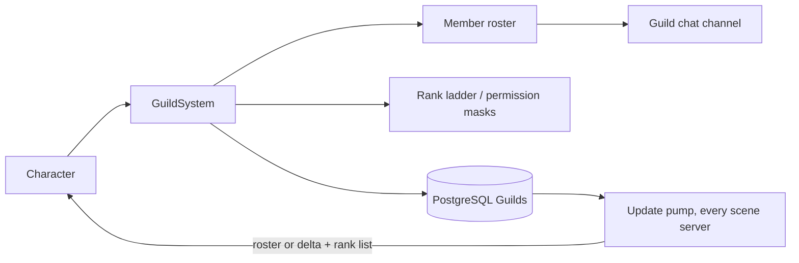

# Guild System

**Short description:** Manages player guilds with creation, invitations, rank management, and cross-server synchronization via periodic database polling.

## Table of Contents

- [Overview](#overview)
- [Supported Platforms](#supported-platforms)
- [Features](#features)
- [Prerequisites](#prerequisites)
- [Installation / Build](#installation--build)
- [Quick Start Guide](#quick-start-guide)
- [Configuration](#configuration)
- [Usage Examples](#usage-examples)
- [Operational Checks](#operational-checks)
- [Flow Diagram](#flow-diagram)
- [Project Structure](#project-structure)
- [License](#license)

## Overview

The Guild system manages player guilds in FishMMO. It supports guild creation, invitations, applications, membership, an editable rank ladder whose ranks hold permission masks, member removal, and voluntary leave with automatic leadership transfer. Guild state is persisted to the database and synchronized across multiple scene servers via a periodic polling mechanism. The system uses a client-server architecture where all mutations are validated server-side with async database operations, and results are marshalled back to the main thread for in-memory state changes and network broadcasts.

This folder holds the shared, client-facing half: `GuildController` (the per-character behaviour that receives every guild broadcast), `GuildPermissions`, `GuildRankDefaults` and the legacy `GuildRank` enum. The server half — the decisions, the rank ladder rules, the update pump and its roster deltas — is documented in `Server/Implementation/World/SceneServer/Guild/README.md`, which is the reference for anything server-side.

## Supported Platforms

| Platform | Supported | Notes |
|----------|-----------|-------|
| Windows  | Yes       | Full server and client support |
| Linux    | Yes       | Full server and client support |
| WebGL    | Yes       | Client only |

- **Engine:** Unity 6.3 LTS
- **Backend:** IL2CPP

## Features

- Guild creation with name validation and uniqueness checking
- Invitation system with pending invite tracking and accept/decline flow
- An editable, contiguous rank ladder (seeded 1 / 2 / 3: member, officer, leader) where each rank holds a `GuildPermissions` mask and its order is used only for seniority
- Permission-mask enforcement, always re-decided server-side from the database; the controller's cached `RankOrder` / `Permissions` / `LeaderRankOrder` only decide which controls the client draws
- Automatic leadership transfer on leader departure
- Auto-deletion of empty guilds when last member leaves
- Cross-server guild synchronization via periodic database polling; after the first full roster a client receives `GuildRosterDeltaBroadcast` with only the changed rows
- Guild join triggers fire only on the server's join notice for a new membership, never on a roster (so a login or zone change is not a join)
- Async two-queue architecture: background DB operations + main-thread state marshalling
- SyncVar-based guild ID broadcasting to nearby players (unreliable channel, 1.0s interval)
- Reliable broadcast delivery for all guild mutation operations
- Chat command integration (`/gi`, `/ginvite`)
- Achievement integration points

## Prerequisites

- **Unity 6.3 LTS**
- **FishNetworking** (FishNet) — NetworkBehaviour, SyncVar, broadcast infrastructure
- **FishMMO Shared Core** — `CharacterBehaviour`, `IPlayerCharacter`, broadcast structs, database service interfaces

## Installation / Build

This is an integrated module within the FishMMO project. No separate installation is required. The guild scripts are included automatically when the FishMMO Unity project is opened.

## Quick Start Guide

1. **GuildController** — Automatically attached to player character prefabs as a `CharacterBehaviour`. Stores the character's guild ID (SyncVar) and its cached standing: rank order, permission mask and the leader's rank order.
2. **GuildSystem** — Server-side ScriptableObject (`ServerBehaviour`) that processes all guild broadcasts and manages async DB operations.
3. **Create a guild** — A player sends a `GuildCreateBroadcast` with a guild name. The server validates and persists the guild, seeds the rank ladder, and seats the creator on the top rank.
4. **Invite members** — A member whose rank holds `GuildPermissions.Invite` sends `GuildInviteBroadcast`. The target receives the invite and can accept or decline.
5. **Chat commands** — Use `/gi <name>` or `/ginvite <name>` to invite a player by name.

## Configuration

### Server Settings (GuildSystem)

| Field | Type | Default | Description |
|-------|------|---------|-------------|
| `maxGuildSize` | `int` | 100 | Maximum members per guild |
| `updatePumpRate` | `float` | 1.0 | Seconds between cross-server guild sync polls |
| `guildExistenceSweepSeconds` | `float` | 30.0 | Seconds between checks for guilds disbanded on another scene server; their members here are cleared within this long |

The full inspector table is in the server README.

### Data Model (GuildController)

| Field | Type | Description |
|-------|------|-------------|
| `ID` | `long` (SyncVar) | Guild ID; 0 = not in a guild. Synchronized via unreliable channel, server-only writes, and not sent to the owner, which learns it from its own roster row. |
| `RankOrder` | `byte` | The character's position on its guild's ladder (higher is more senior). Not synced — set from roster rows and deltas. |
| `Permissions` | `GuildPermissions` | The character's rank's permission mask, set from `GuildRankListBroadcast`. A client-side convenience; the server re-decides every action. |
| `LeaderRankOrder` | `byte` | The top seat on the ladder, so the client can tell whether it holds it. |

### Server-Side Data Containers

| Container | Purpose |
|-----------|---------|
| `GuildSystemRuntimeData` | Pending invitations, invite and application cooldowns, the membership-removal guard, the pump's last fetch time and processed-update record, the ingress guard |
| `GuildCharacterMappingData` | `GuildCharacterTracker`: online guild members on this server; `GuildMemberTracker`: each tracked guild's roster as last delivered (full rows keyed by character ID) |

### Permissions

Every rank holds a `GuildPermissions` mask: `Invite`, `Kick`, `Promote`, `EditMessageOfTheDay`, `EditNotice`, `EditRanks`, `ManageBank`, `ManageApplications`, `Disband`, `EditRecruitment`, `ViewOfficerNotes`, `EditOfficerNotes`, `EditPublicNotes`, `TransferLeadership`. Acting on another member also requires outranking them (a strictly higher `RankOrder`). Creating a guild, accepting or declining an invite, applying and leaving need no permission. The seeded masks and the ladder limits live in `GuildRankDefaults`; the decision table (`GuildRules`) is described in the server README.

### Network Synchronization

| Channel | Data | Direction |
|---------|------|-----------|
| Unreliable | `GID` SyncVar (guild ID) | Server → All (excl. owner) |
| Reliable | All guild broadcasts | Server ↔ Client |

The guild ID is synced via SyncVar at 1.0s intervals on the unreliable channel (for nearby players to see guild affiliation). All guild operations use reliable broadcasts for guaranteed delivery.

## Usage Examples

### Chat Commands

| Command | Action |
|---------|--------|
| `/gi <name>` | Invite a character to the guild by name |
| `/ginvite <name>` | Invite a character to the guild by name (alias) |

### Static Events (IGuildController)

| Event | Parameters | Description |
|-------|------------|-------------|
| `OnReadID` | `long guildID, IPlayerCharacter character` | Fired when guild ID is read or changes |

### Instance Events (GuildController)

| Event | Parameters | Description |
|-------|------------|-------------|
| `OnReceiveGuildInvite` | `long inviterCharacterID` | Guild invitation received |
| `OnAddGuildMember` | `GuildAddBroadcast` | Member added to or updated in the guild list (every listener treats it as add-or-update). The broadcast carries `GuildID` plus one `GuildAddEntry` (`Member`); `GuildAddMultipleBroadcast` carries the guild id **once** and a list of entries, re-attaching it per row so the same handler serves a roster refresh and a single add. Each upsert in a `GuildRosterDeltaBroadcast` raises it too |
| `OnValidateGuildMembers` | `HashSet<long> memberIDs` | Full member set received for validation (whole rosters only; a delta carries its removals instead) |
| `OnRemoveGuildMember` | `long memberID` | Member removed from guild list: a kick, or a removal in a roster delta |
| `OnLeaveGuild` | _(none)_ | Local character left the guild |
| `OnReceiveGuildResult` | `GuildResultType result` | Result of a guild operation |
| `OnReceiveGuildInfo` | `long guildID, string name, string notice, string motd` | Descriptive text arrived |
| `OnReceiveGuildLog` | `GuildLogEntry[] entries` | Recent activity, newest first |
| `OnReceiveGuildRanks` | `GuildRankListBroadcast` | The rank ladder |
| `OnReceiveGuildRecruitmentInfo` | `GuildRecruitmentInfoBroadcast` | Recruitment listing state |
| `OnReceiveGuildDirectory` | `GuildDirectoryEntry[]` | Browsable guild directory |
| `OnReceiveGuildApplications` | `GuildApplicationEntry[]` | Pending applications |
| `OnReceiveGuildCreationCost` | `int currencyTemplateID, long amount` | The creation fee, both 0 when there is none (issue #186) |

The creation fee is also **stored** on the controller as `CreationCostCurrencyTemplateID` /
`CreationCost`, not only raised, because the guild panel is usually bound after the broadcast
arrives: it reads the stored values when it binds and listens for changes afterwards.

### Join and leave triggers

`OnGuildJoinTriggers` fire only from the server's **join notice** — the single `GuildAddBroadcast`
the create and join paths send — and only when it names a guild the client did not already hold
(`GuildController.IsNewMembership`). A whole roster (`GuildAddMultipleBroadcast`) adopts the guild
and the character's rank and fires nothing: every login and zone change loads the character on a
scene server whose first guild message is that roster, and the guild ID cannot tell a join from a
reload there, because the SyncVar is not sent to its owner and a freshly spawned character holds 0
until its first roster arrives. A roster delta never changes the guild ID; the local player's own
row in it updates `RankOrder` only, and a delta naming a guild other than the one held is ignored as
stale. The one join no notice announces is an application accepted while the applicant was offline
or on another scene server; they find the guild in their roster on their next load.
`OnGuildLeaveTriggers` fire on `GuildLeaveBroadcast`.

### Pooling reset

`ResetState(bool)` calls `ClearGuildStanding()` and nulls every event subscriber. `ID` is a SyncVar
and FishNet's own reset returns it to its default, but the three plain fields behind it —
`RankOrder`, `Permissions`, `LeaderRankOrder` — are written from roster broadcasts and would
otherwise stay exactly as the previous occupant of the pool slot left them: a guildless character
inheriting a leader's permission mask draws every officer control in the guild panel, and the server
refuses each one with a result the panel cannot explain. `ClearGuildStanding` is reused rather than
repeated so the leave path and the reset path cannot drift apart.

### Broadcast Types

```
GuildCreateBroadcast                 # Client → Server: request to create a guild
GuildInviteBroadcast                 # Bidirectional: invite a character to a guild
GuildAcceptInviteBroadcast           # Client → Server: accept a guild invitation
GuildDeclineInviteBroadcast          # Client → Server: decline a guild invitation
GuildAddBroadcast                    # Server → Client: the join notice (create / join), our own row
GuildAddMultipleBroadcast            # Server → Client: whole roster (login snapshot, pump's first delivery)
GuildRosterDeltaBroadcast            # Server → Client: GuildID, Upserts, Removals since the last roster
GuildLeaveBroadcast                  # Bidirectional: leave the guild
GuildRemoveBroadcast                 # Bidirectional: remove a member from the guild
GuildChangeRankBroadcast             # Client → Server: change a member's rank
GuildResultBroadcast                 # Server → Client: operation result (success/error)
GuildResultType (enum)               # Result codes, e.g. Success, InvalidGuildName, NameAlreadyExists, InsufficientRank
GuildCreationCostBroadcast           # Server → Client: the founding fee (0/0 when free)
GuildInfoBroadcast                   # Server → Client: name, notice, message of the day
GuildSetMessageOfTheDayBroadcast     # Client → Server
GuildSetNoticeBroadcast              # Client → Server
GuildTransferLeadershipBroadcast     # Client → Server
GuildDisbandBroadcast                # Client → Server: with the typed confirmation name
GuildLogRequestBroadcast / GuildLogBroadcast
```

The rank ladder, notes, recruitment and application messages are in `GuildRankBroadcasts.cs`:
`GuildRankListBroadcast` (the ladder plus the viewer's own rank order, mask and the leader's seat),
`GuildRankListRequestBroadcast`, `GuildEditRankBroadcast`, `GuildCreateRankBroadcast`,
`GuildDeleteRankBroadcast`, `GuildSetMemberNoteBroadcast`, `GuildRecruitmentInfoBroadcast`,
`GuildSetRecruitmentBroadcast`, `GuildDirectoryRequestBroadcast` / `GuildDirectoryBroadcast`,
`GuildApplyBroadcast`, `GuildApplicationListRequestBroadcast` / `GuildApplicationListBroadcast` and
`GuildResolveApplicationBroadcast`.

### Integration Points

| System | Integration |
|--------|-------------|
| `CharacterSystem` | Loads guild membership from DB as a character loads and sends the login roster and ladder (then calls `IGuildSystem.ForgetGuildDeliveryBaselines`); fires `OnConnect`/`OnDisconnect` events |
| `ChatHelper` | Registers `/gi` and `/ginvite` chat commands for guild invites |
| `IPeriodicUpdateSystem` | Registers the cross-server update pump and the guild existence sweep |
| `IGuildService` | DB service for guild creation, existence checks (`FetchExistingIdsAsync`), and deletion |
| `ICharacterGuildService` | DB service for member CRUD, rank updates, location updates, capacity checks and bulk roster reads (`FetchManyAsync(long[])`) |
| `IGuildRankService` | DB service for the rank ladder, including bulk ladder reads |
| `IGuildUpdateService` | DB service for cross-server change notification (fetch/persist/delete) |

### Async Architecture

The guild system uses a two-queue architecture for safe async-to-main-thread communication:

1. **Async Worker Queue** (`IAsyncWorkerData`): Game logic calls `TryEnqueueAsyncWork` (or `EnqueuePersistence` for writes that must not be dropped) to dispatch database operations to background threads.
2. **Main-Thread Queue** (`IGuildSystemMainThreadQueueData`): Async tasks call `TryEnqueueMainThread` to marshal state changes and broadcasts back to the main thread. Drained each frame in `OnUpdate`, up to `maxMainThreadActionsPerFrame`.

This ensures:
- Database operations never block the game loop
- In-memory state and FishNet broadcasts only execute on the main thread
- Each guild system has its own queue slot (no collisions with other systems)

## Operational Checks

| Check | Expected Result | How to Verify |
|-------|----------------|---------------|
| Guild creation | Guild persisted to DB, ladder seeded 1/2/3, creator on the top rank | Create guild, verify in DB and in-game |
| Guild name validation | Invalid/duplicate names rejected | Attempt creation with invalid or taken name |
| Invite flow | Target receives invite, can accept/decline | Send invite, check target receives broadcast |
| Capacity enforcement | Invite rejected when guild is full | Fill guild to `maxGuildSize`, attempt invite |
| Rank permissions | A rank without `Promote` cannot change ranks; one without `Kick` cannot kick; nobody acts on a member at or above them | Attempt restricted operations from ranks lacking the permission |
| Leadership transfer | Leader leaves, a random member of the most senior remaining rank takes the top seat | Have leader leave, verify new leader assigned |
| Cross-server sync | Guild changes propagate to all scene servers | Modify guild on one server, verify update on another |
| Roster delta | After the first roster, a member's zone change reaches the others as one `GuildRosterDeltaBroadcast` row | Watch client traffic while a guildmate changes zone |
| Join triggers | Fire on a real join; do not fire on login or zone change | Join a guild, then relog and change zone with a join trigger configured |
| SyncVar broadcast | Nearby players see guild ID update | Change guild, observe nearby clients |
| Empty guild cleanup | Guild deleted when last member leaves | Remove all members, verify guild deleted from DB |

## Flow Diagram

### High-Level Overview



The server-side handlers (create, invite, accept, leave, kick, rank changes, the ladder, applications,
disband and the update pump) are drawn step by step in the server README,
`Server/Implementation/World/SceneServer/Guild/README.md`. What follows is what the client receives.

### What the Client Receives

```
Character loads on a scene server (login or zone change)
  └── CharacterSystem sends GuildAddMultipleBroadcast (whole roster) + GuildRankListBroadcast
      └── GuildController: adopt GuildID and our RankOrder from our own row; no join triggers
          └── GuildRankListBroadcast sets RankOrder, Permissions, LeaderRankOrder

Create / join (invite accepted, application accepted while online here)
  └── GuildAddBroadcast (join notice: our own row)
      └── IsNewMembership(held, announced) → fire OnGuildJoinTriggers once

Update pump, whenever the guild changes (every updatePumpRate seconds)
  ├── First delivery from this server, or more than half the roster changed
  │     └── GuildAddMultipleBroadcast (whole roster, officer notes only if we may read them)
  ├── Otherwise, if anything we can see changed
  │     └── GuildRosterDeltaBroadcast(GuildID, Upserts, Removals)
  │           ├── ignored unless GuildID is the guild we hold
  │           ├── each upsert → OnAddGuildMember (our own row: RankOrder only)
  │           └── each removal (never our own) → OnRemoveGuildMember
  └── GuildRankListBroadcast only if the ladder or our rank moved

Leave, kick, or the guild disbanded (another server's disband: within guildExistenceSweepSeconds)
  └── GuildLeaveBroadcast → ID = 0, ClearGuildStanding, OnLeaveGuild, OnGuildLeaveTriggers
```

## Project Structure

### Directory Structure

```
Guild/
├── GuildController.cs             # Per-entity controller (CharacterBehaviour / NetworkBehaviour):
│                                  #   guild ID SyncVar, cached standing, every client-side handler
├── GuildPermissions.cs            # [Flags] permission mask a rank holds
├── GuildRankDefaults.cs           # Seeded ladder masks, rank-order and name limits, TrySanitizeRankName
├── GuildRank.cs                   # Legacy enum (None, Member, Officer, Leader); ranks are now ladder rows
└── README.md                      # This file
```

### Related Files (Outside This Directory)

```
Shared/Core/Entity/Guild/IGuildController.cs                                            # Guild controller interface + static OnReadID event
Shared/Implementation/Network/Character/GuildBroadcasts.cs                             # Membership, roster, delta, text, disband and log broadcasts
Shared/Implementation/Network/Character/GuildRankBroadcasts.cs                         # Ladder, notes, recruitment and application broadcasts
Server/Core/World/SceneServer/Guild/IGuildSystem.cs                                     # Server contract, incl. ForgetGuildDeliveryBaselines
Server/Core/World/SceneServer/Guild/IGuildSystemRuntimeData.cs                         # Invitations, cooldowns, fetch time, processed-update record
Server/Core/World/SceneServer/Guild/IGuildCharacterMappingData.cs                      # Local members and the roster as last delivered
Server/Core/World/SceneServer/Guild/IGuildSystemMainThreadQueueData.cs                 # Per-system main-thread queue interface
Server/Implementation/World/SceneServer/Guild/                                          # GuildSystem and its partials, GuildAuthority/GuildRules,
                                                                                        #   GuildRosterDelta, GuildRecipientBaselines, data containers
Server/Implementation/World/SceneServer/Character/CharacterSystem.Social.cs            # Sends the login roster and ladder as a character loads
```

### Inheritance Hierarchies

#### Controllers (NetworkBehaviour)

```
CharacterBehaviour
└── GuildController : IGuildController
```

#### Server Systems (ScriptableObject)

```
ServerBehaviour
└── GuildSystem : IGuildSystem<NetworkConnection>
```

#### Data Containers

```
RuntimeDataContainer
├── GuildSystemRuntimeData : IGuildSystemRuntimeData
└── GuildCharacterMappingData : IGuildCharacterMappingData

SystemMainThreadQueueData
└── GuildSystemMainThreadQueueData : IGuildSystemMainThreadQueueData
```

#### Supporting Types

```
GuildPermissions (enum, [Flags] long)   # The permission mask
GuildRankDefaults (static class)        # Ladder constants and defaults
GuildRank (enum)                        # Legacy: None, Member, Officer, Leader
```

## License

This project is subject to the FishMMO project license.
