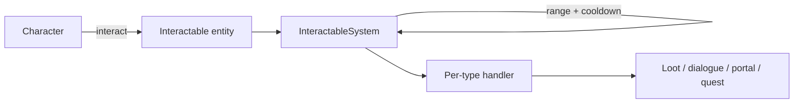

# Interactable System

**Short description:** A server-authoritative, template-driven framework for interactive world objects in FishMMO, providing twenty concrete interactable types from banking to arena boards.

## Table of Contents

- [Overview](#overview)
- [Supported Platforms](#supported-platforms)
- [Features](#features)
- [Prerequisites](#prerequisites)
- [Installation / Build](#installation--build)
- [Quick Start Guide](#quick-start-guide)
- [Configuration](#configuration)
- [Usage Examples](#usage-examples)
- [Operational Checks](#operational-checks)
- [Flow Diagram](#flow-diagram)
- [Project Structure](#project-structure)
- [License](#license)

## Overview

The Interactable system is a server-authoritative, template-driven framework for interactive world objects in FishMMO. It provides an abstract `Interactable` base class (NetworkBehaviour + ISpawnable) that handles range checking, rate limiting, the scene-object spawn payload, scene-object registration, and the overhead title plate. Twenty concrete subclasses extend this base: banking, ability crafting, arena boards and arena objectives, bindstones, capture points, containers (chests), dialogue NPCs, dungeon entrances, gathering nodes, lore objects, mailboxes, merchants, plot foundations, quest givers, shrines, switches, teleporters, waypoints and world items.

## Supported Platforms

| Platform | Supported | Notes |
|----------|-----------|-------|
| Windows  | Yes       | Full server and client support |
| Linux    | Yes       | Full server and client support |
| WebGL    | Yes       | Client only |

- **Engine:** Unity 6.3 LTS
- **Backend:** IL2CPP

## Features

- Abstract `Interactable` base class with range checking, rate limiting, and network payload handling
- Twenty concrete interactable types: AbilityCrafter, ArenaBoard, ArenaObjective, Banker, Bindstone, CapturePoint, Container, DialogueInteractable, DungeonEntrance, GatheringNode, LoreObject, Mailbox, Merchant, PlotFoundation, QuestInteractable, Shrine, Switch, Teleporter, Waypoint, WorldItem
- Server-authoritative validation with `sqrMagnitude`-based range checks (no square root)
- Template-driven configuration via ScriptableObjects per interactable type
- Scene-object registration and generated naming via `SceneObjectNamer` (name generator, seeded per spawn; 5 bytes on the wire)
- Object pooling support through `ISpawnable` and `ObjectSpawner` integration
- Client-side overhead title rendering with customizable colour, written onto a `Nameplate` (`EnsureNameplate` builds one on demand for an object that has none — a crate does not carry a plate prefab, a banker does)
- Arena queueing and arena objectives (`ArenaBoard`, `ArenaObjective`) and claimable housing land (`PlotFoundation`)
- Achievement integration on most interactable types
- Dialogue tree system with branching nodes, conditions, and actions
- PvP/PvE capture point objectives with state tracking (Neutral, Capturing, Captured, Contested)
- Gathering nodes with weighted drop tables, limited uses, and gather timers
- Merchant tab system supporting premade abilities, ability templates, ability events, and items

## Interaction Behaviour Is ECA Triggers

`Banker`, `Merchant`, `Bindstone`, `Teleporter` and the rest are **data holders**. None of them
carries hard-coded interact behaviour — what an interactable does when used comes entirely from the
`Trigger` assets in its `OnInteractTriggers` list, which `InteractableSystem` fires after
server-side validation.

The one exception is corpse looting, which `InteractableSystem` calls directly. That is deliberate:
looting is intrinsic to any NPC that can die, and a content author must not be able to make a
creature silently unlootable by forgetting a list entry. An NPC's own triggers still run on top,
for achievements, quest updates and dialogue.

**An empty list therefore means the object does nothing when used.** It still shows its title, still
accepts the interaction, and still passes every validation — it just has no implementation. The
system logs a warning when this happens, and `FishMMO > Interactables > Audit Interact Triggers`
reports it across every prefab and scene in the project.

### Shipped interaction triggers

Under `Assets/Templates/Entity/ECA/Interactions/`:

| Asset | Actions | Used by |
|---|---|---|
| `Bindstone Interact` | `BindstoneAction` | Bindstone |
| `Banker Interact` | `NPCLookAtInteractorAction`, `SendBankerBroadcastAction` | HumanBanker |
| `Merchant Interact` | `NPCLookAtInteractorAction`, `SendMerchantBroadcastAction` | HumanGeneralMerchant |
| `Ability Crafter Interact` | `NPCLookAtInteractorAction`, `SendAbilityCrafterBroadcastAction` | HumanAbilityCrafter |
| `Dungeon Entrance Interact` | `SendDungeonFinderBroadcastAction` | InstanceDungeonTest |
| `Teleporter Interact` | `TeleportAction` | every Teleporter |
| `Waypoint Interact` | `UnlockWaypointAction` (stop on failure), `AchievementIncrementAction` (Waypoints Discovered) | Waypoint prefab |
| `Waypoint Travel` | `AchievementIncrementAction` (Fast Travels) | Waypoint prefab, `OnTravelTriggers` |
| `World Item Pickup` | `PickupWorldItemAction` | Small World Item |

Create more with `FishMMO/ECA/Trigger`, or from the FishMMO Dashboard's **ECA → Triggers** category.

### Server-only actions

Interaction actions run on the server only, gated at **runtime** via `BaseAction.IsServer` rather
than `#if UNITY_SERVER`. The define is a build-target one and is absent in the editor, where the
scene server also runs — so the compile-time gate silently emptied every action body in the
configuration the project is developed in.

### Resolving which interactable a player meant

One GameObject often carries several: an NPC is its own lootable corpse, and an NPC that also trades
or hands out quests carries that component too. `InteractableResolver` is the single definition of
the rule — **a corpse wins while it is one**, otherwise the first non-corpse interactable — shared by
the client's target resolution, the scene server's interaction system, and the quest system.

`Interactable.CanInteract` enforces the other half: a non-corpse interactable on a body refuses, so
a dead merchant cannot open its shop.

### Rate limiting

`CanInteract` is a pure question. Spending the character's interact rate limit is a separate,
explicit call to `TryConsumeInteractRateLimit`, because three different callers ask the question and
only the interaction path should pay for it.

### What travels in the spawn payload

Only the scene-object `ID`, for most types. `Container` and `GatheringNode` both used to write
their state into the payload of every spawn, to every connection that began observing them, and
neither was ever refreshed afterwards:

- **`Container`** wrote a presence bit plus a template ID and a stack amount per filled slot. No
  client read it — the chest window is driven by `ContainerOpenBroadcast`, sent to the interacting
  player on open and re-sent after every take — so it was pure cost, and it told every client in
  range what was inside every container in the world without anybody opening one. `Items` is
  server state and there is no `WritePayload`/`ReadPayload` override left on the class.
- **`GatheringNode`** wrote `RemainingUses`. The only client use was a `> 0` test whose answer is
  implied by the node still existing (`GatheringNodeAction` despawns it at zero). The charge half
  of the rule is now `GatheringNode.AllowsGathering(remainingUses, chargesAreAuthoritative)` — a
  peer that does not own the count does not get to answer with it, so a client stops consulting a
  number frozen at spawn while the server's refusal stays authoritative.
- **`WorldItem`** is the one that gained a field: it writes the template ID, the stack amount and
  a generation `Seed`, all `Unpacked` (a template ID is a full-range 32-bit hash and a seed is
  full entropy, so FishNet's signed-packed form would spend five bytes where unpacked spends
  four). `ItemSpawnableSettings` rolls the seed at spawn; without it every generated ground drop
  of a template rolled identical attributes from `RNG(0)` and a different set after a relog.
  `ResetState` clears the seed as well as the stack, so a pooled drop cannot inherit the previous
  occupant's roll.

Payload framing matters here: FishNet packs every `NetworkBehaviour`'s spawn payload into one
unframed buffer, so a reader that consumes the wrong number of bytes desynchronises every
behaviour after it.

### Titles are rows on an overhead nameplate

`Interactable.Awake` writes the name and title onto whatever plate the object already has
(`ResolveAuthoredNameplate`) — for a banker or a merchant that is the character's own plate, so the
title stacks under the generated name instead of fighting it for the anchor. An object with no
authored plate (a crate, a harvest node) gets one built by `EnsureNameplate` at the moment the
target frame needs it, rather than a `GameObject` per crate in the zone up front.

## Waypoints

A `Waypoint` is a discoverable fast-travel point (issue #237). It is an ordinary interactable
whose identity is the pair (scene name, `WaypointIndex`): the index is authored on the component,
must be unique within its scene, and **must never change once the scene ships** — it is the bit
position stored in the character's unlock record (`WaypointController`, `character_waypoints`).
The world scene details cache rebuild reports duplicates and out-of-range indices.

- **Discovery.** Interacting runs the `Waypoint Interact` trigger: `UnlockWaypointAction` sets the
  bit through `IWaypointController.Unlock`, which raises `OnWaypointUnlocked`; the server's
  interactable system merges the page into the database and tells the owner. The action is
  abortable and authored with *Stop Chain On Failure*, so the achievement after it counts each
  waypoint once. Interacting with an already-discovered waypoint asks the owner's client to open
  the world map on it instead.
- **Travel.** Requested from the world map (`WaypointTravelRequestBroadcast`), never by
  interaction. `InteractableSystem.Waypoint.cs` checks the scene the map showed against the
  character's current scene, resolves the live object through `WaypointRegistry`, and calls
  `WaypointTravel.TryTravel`, whose rules (`Decide`) are: can act → not in combat → same scene
  instance → discovered → the waypoint's authored `TravelConditions` pass. Refusals are reported
  with a `WaypointTravelRefusalReason`. Arrival runs `OnTravelTriggers` (`Waypoint Travel`).
- **Other ECA pieces.** `GrantWaypointAction` (unlock by scene name + index, for rewards),
  `TeleportToWaypointAction` (move to a waypoint in the current scene; can relax discovery,
  conditions and combat), `WaypointUnlockedCondition`.
- **Map.** A waypoint is drawn from the character's own record, not from a `MapMarker` — do not
  put one on the object; `MapMarkerFilter` drops the waypoint type on purpose. Undiscovered
  waypoints are invisible regardless of fog.
- **Not yet.** Cross-scene travel: the request and the actions refuse a scene other than the
  character's current one until the world-map system lands. The storage and wire already carry
  the scene name so that step needs no schema change.

## Plot foundations

A `PlotFoundation` is a claimable area of land authored into a scene by a designer. The component
carries only the plot's identity and its price — `PlotKey` (unique within the scene, case and
surrounding whitespace ignored), `Price`, `Dimensions` (X by Z metres, default `DefaultSize` 16)
and `Height` (default `DefaultHeight` 12, floored at `MinimumExtent`). Who owns it, and whether it
can be claimed at all, is resolved by the server against the database and pushed back.

- **Discovery, not sweeping.** Foundations announce themselves to `PlotFoundation.Registry`, which
  groups them by the scene manager's **handle**, not by scene name: a scene server may host scenes
  for several world servers at once and each world's copy is its own land with its own owners. The
  handle is process-local and is never persisted or sent anywhere.
- `Registry.OnSceneGainedFoundations` fires when a foundation joins a scene that had none, so the
  housing system can register land that arrived in an additively-loaded scene.
- `Registry.OnClaimRequested` is an event rather than a direct call, because claiming needs the
  database and shared code cannot reference the server behaviour that owns it. On a client, or a
  server with housing off, nothing is listening and the request is dropped.
- **Edit-time validation only.** Plots are placed by designers and never at runtime, which is what
  removes the need for runtime overlap tests — and also means edit time is the only chance to catch
  a bad layout. `FishMMO > Housing > Validate Plots In Open Scenes` (`PlotFoundationValidator`)
  reports duplicate keys and overlapping plots, on demand and again on scene save. Both faults are
  silent at runtime: a duplicate key resolves two foundations onto one database row, and overlapping
  plots let two owners build into the same space.

## Arenas

`ArenaBoard` is where a player queues: a prefab with the component and an interaction whose action
is `SendArenaBoardBroadcastAction`. It offers exactly the `ArenaTemplate`s listed on it and the
server refuses a queue request for anything else.

`ArenaObjective` is a flag stand or a control point placed in an arena scene, interacted with
through `InteractWithArenaObjectiveAction`. `ObjectiveKind` picks which; a Capture the Flag arena
needs one flag stand per team with `FlagTeam` set (0-based), a King of the Hill arena one or more
control points. The title defaults to `Team N Flag` or `Control Point` unless `DisplayName` is set.

## Prerequisites

- **Unity 6.3 LTS**
- **FishNetworking** (FishNet) — NetworkBehaviour, SyncVar, broadcast infrastructure
- **FishMMO Shared Core** — `IInteractable`, `ISpawnable`, `CharacterBehaviour`, `CachedScriptableObject<T>`, scene-object interfaces

## Installation / Build

This is an integrated module within the FishMMO project. No separate installation is required. The interactable scripts are included automatically when the FishMMO Unity project is opened.

## Quick Start Guide

1. **Create a new interactable** — Add one of the concrete interactable components (e.g., `Merchant`, `GatheringNode`, `Container`) to a GameObject in a scene.
2. **Assign a template** — For template-driven types, create the matching ScriptableObject (e.g., `MerchantTemplate`, `GatheringNodeTemplate`) and assign it to the component's `Template` field.
3. **Set interaction range** — Adjust the `InteractionRange` field on the component (default: 3.5 units).
4. **Ensure SceneObjectNamer** — Types like `AbilityCrafter`, `Banker`, `Merchant`, and `Container` require `SceneObjectNamer` (added automatically via `[RequireComponent]`). With default settings it names the object from its `FactionController` race; set a Race Override, a Biome, or another mode (City / Dungeon / Point of Interest / Item) on the component for anything else.
5. **Server registration** — On the server, the interactable registers itself in `Awake()` via `SceneObject.Register()`. On the client, registration happens in `ReadPayload()` after receiving the object's `ID`.

## Configuration

### Interactable Base Constants

| Constant              | Value | Description                                           |
|-----------------------|-------|-------------------------------------------------------|
| `INTERACT_RATE_LIMIT` | 60 ms | Default minimum time between consecutive interactions |

### Interactable Base Fields

| Field              | Type    | Default | Description                                       |
|--------------------|---------|---------|---------------------------------------------------|
| `InteractionRange` | `float` | 3.5     | Maximum distance a player can interact from       |

### Virtual Properties

| Property           | Type     | Default                 | Description                  |
|--------------------|----------|-------------------------|------------------------------|
| `Name`             | `string` | `GameObject.name`       | Object name                  |
| `Title`            | `string` | `"Interactable"`        | Overhead plate title row     |
| `TitleColor`       | `Color`  | `TinyColor.forestGreen` | Title label color            |
| `InteractRateLimit`| `double` | `INTERACT_RATE_LIMIT`   | Override per-type rate limit |

### CapturePointTemplate

| Field / Property       | Type               | Description                                  |
|------------------------|--------------------|----------------------------------------------|
| `Template`             | `CapturePointTemplate` | ScriptableObject with capture parameters |
| `AchievementTemplate`  | `AchievementTemplate`  | Achievement to increment on capture      |
| `OwnerCharacterID`     | `long`             | Current owner (0 = neutral)                  |
| `CaptureProgress`      | `int`              | Interactions toward capture                  |
| `CapturingCharacterID` | `long`             | Player currently capturing                   |
| `State`                | `ObjectiveState`   | Current objective state                      |

### ContainerTemplate

| Field / Property       | Type                | Description                              |
|------------------------|---------------------|------------------------------------------|
| `Template`             | `ContainerTemplate` | ScriptableObject: `SlotCount`, `DespawnWhenEmpty` |
| `AchievementTemplate`  | `AchievementTemplate`  | Achievement to increment on open      |
| `Items`                | `List<Item>`        | Current item slots                       |

### GatheringNodeTemplate

| Field / Property       | Type                    | Description                            |
|------------------------|-------------------------|----------------------------------------|
| `Template`             | `GatheringNodeTemplate` | Drops list, MaxUses, GatherTimeSeconds |
| `RemainingUses`        | `int`                   | Remaining harvests before respawn      |

**GatheringDrop**: `Item` (BaseItemTemplate), `MinAmount`, `MaxAmount`, `Weight`.

### LoreObjectTemplate

| Field             | Type                  | Description                           |
|-------------------|-----------------------|---------------------------------------|
| `Template`        | `LoreObjectTemplate`  | LoreText, GrantAbilities, GrantAbilityEvents, GrantItems |

### MerchantTemplate

**MerchantTemplate** (ScriptableObject): lists of `AbilityTemplate`, `AbilityEvent`, `BaseItemTemplate` and `PremadeAbilityTemplate` references, organized by `MerchantTabType`.

Two of those lists sell abilities, and they sell different things. `Abilities` sells **templates**: the buyer learns the template and must still take it to an Ability Crafter, choose its effects, and craft a usable ability. `PremadeAbilities` sells **finished abilities**: each `PremadeAbilityTemplate` names a base `AbilityTemplate`, the events to bake in, an optional type override and the merchant's own price, and the buyer receives the crafted `Ability` straight into their usable set. A premade recipe is held to the crafting rules (`PremadeAbilityTemplate.Validate`: at most `AdditionalEventSlots` events, at most one type override) on both the inspector and the server, so a premade ability is never something a player could not have built. The UI labels the two tabs "Templates" and "Abilities" respectively, and says under each what a purchase from it needs next — the silence there was issue #247.

### ShrineTemplate

| Field              | Type                  | Description                        |
|--------------------|-----------------------|------------------------------------|
| `HealHealth`       | `bool`                | Whether to heal health             |
| `HealthHealPercent`| `float`               | Percentage of max HP to restore    |
| `HealMana`         | `bool`                | Whether to heal mana               |
| `ManaHealPercent`  | `float`               | Percentage of max MP to restore    |
| `Buff`             | `BaseBuffTemplate`    | Optional buff to apply             |
| `BuffStackCount`   | `int`                 | Number of buff stacks to apply     |

### Switch

`Switch` has no template — its configuration lives directly on the component:

| Field          | Type             | Description                          |
|----------------|------------------|--------------------------------------|
| `SwitchTarget` | `ISwitchTarget`  | Object to activate/deactivate        |
| `IsToggle`     | `bool`           | If true, toggles; otherwise one-shot |

**ISwitchTarget** interface: `IsActivated` (bool), `Activate(IPlayerCharacter)`, `Deactivate(IPlayerCharacter)`.

### DialogueTemplate

**DialogueTemplate** (ScriptableObject):
- `StartNodeId` — entry node in the tree.
- `CacheDialogueChoices` — server-side choice persistence to prevent replay abuse.
- `Nodes` — list of `DialogueNode` entries, each with `Text`, `Conditions`, `OnEnterActions`, `OnExitActions`, and `Choices`.
- `DialogueChoice` — each choice has `Text`, `NextNodeId`, `Conditions`, and `OnSelectActions`.

## Usage Examples

### Network Lifecycle Methods

| Method            | Description                                                              |
|-------------------|--------------------------------------------------------------------------|
| `Awake()`         | Caches `Transform`, computes `interactionRangeSqr`, then calls the virtual `OnAwake()` a subclass overrides. Client: strips "(Clone)" from name, renders title label. Server: calls `SceneObject.Register()`. |
| `OnDestroy()`     | Calls `SceneObject.Unregister()`.                                        |
| `ReadPayload()`   | Reads `ID` (Int64) from network reader, registers in scene.             |
| `WritePayload()`  | Writes `ID` (Int64) to network writer.                                  |
| `ResetState()`    | Clears `OnDespawn` event and `SpawnableSettings` (object pooling reset).|
| `Despawn()`       | Delegates to `ObjectSpawner.Despawn(this)`.                             |

### ISpawnable Members

| Member              | Type                | Description                                         |
|---------------------|---------------------|-----------------------------------------------------|
| `ObjectSpawner`     | `ObjectSpawner`     | The spawner managing this object                    |
| `SpawnableSettings` | `SpawnableSettings` | Spawn configuration from the spawner                |
| `ID`                | `long`              | Unique network identifier                           |
| `OnDespawn`         | `event Action<ISpawnable>` | Fired when the object is despawned            |

### Static Events (ICapturePoint)

- `OnCaptured(CapturePoint, long)` — fired when capture completes.
- `OnStateChanged(CapturePoint, ObjectiveState)` — fired on state transitions.

### Static Events (IDialogueInteractable)

- `OnServerDialogueRequested(ICharacter, DialogueTemplate)` — raised on the server when a dialogue session is requested via an ECA action. `InteractableSystem` subscribes to it to start dialogue sessions.

### Interactable Types Summary

| Type                  | Description                                                              | Template                |
|-----------------------|--------------------------------------------------------------------------|-------------------------|
| AbilityCrafter        | Opens the ability crafting UI. `[RequireComponent(typeof(SceneObjectNamer))]` | —                       |
| ArenaBoard            | Queue for arenas. Offers only the `ArenaTemplate`s listed on it; the server refuses any other | — |
| ArenaObjective        | Flag stand or control point placed in an arena scene (`ArenaObjectiveKind`, `FlagTeam`) | — |
| Banker                | Opens the bank storage UI. `[RequireComponent(typeof(SceneObjectNamer))]`    | —                       |
| Bindstone             | Sets the player's `BindPosition` / `BindScene` via `BindstoneAction`      | —                       |
| CapturePoint          | PvP/PvE objective: ownership + capture progress tracking                 | `CapturePointTemplate`  |
| Container             | Chest/crate with items. `IItemContainer` for full slot management        | `ContainerTemplate`     |
| DialogueInteractable  | NPC dialogue tree with branching, conditions, and actions                | `DialogueTemplate`      |
| DungeonEntrance       | Portal to a dungeon scene. Achievement-integrated. `[RequireComponent(typeof(MapMarker))]`; maps itself on awake — see the [shared map README](../Map/README.md#objects-that-register-themselves) | `DungeonTemplate`       |
| GatheringNode         | Harvestable resource node with weighted drops and limited uses           | `GatheringNodeTemplate` |
| LoreObject            | Discoverable lore granting abilities, events, or items                   | `LoreObjectTemplate`    |
| Mailbox               | Opens the mail UI. No template required                                  | —                       |
| Merchant              | Buy/sell with tabbed inventory. `[RequireComponent(typeof(SceneObjectNamer))]` | `MerchantTemplate`      |
| PlotFoundation        | Claimable area of land for housing. `[RequireComponent(typeof(SceneObjectNamer))]` | —      |
| QuestInteractable     | Quest giver / turn-in NPC                                                | —                       |
| Shrine                | Healing/buff station                                                     | `ShrineTemplate`        |
| Switch                | Toggle/trigger activating an `ISwitchTarget`                             | —                       |
| Teleporter            | Moves player to target Transform                                         | —                       |
| Waypoint              | Discoverable fast-travel point, identified by (scene, `WaypointIndex`)   | —                       |
| WorldItem             | Dropped item with `BaseItemTemplate` + custom network payload            | —                       |

### Common Patterns

- **SceneObjectNamer**: Required component on `AbilityCrafter`, `Banker`, `CapturePoint`, `Container`, `Merchant`, and others. Generates deterministic scene-unique names for network-safe identification.
- **AchievementTemplate**: Most interactable types expose an `AchievementTemplate` field to increment progress on interaction.
- **Title / TitleColor**: Every subclass overrides `Title` and `TitleColor` to customize the row written onto the object's overhead `Nameplate` on the client.
- **SceneObject Registration**: Server-side registration happens in `Awake()`; client-side registration happens in `ReadPayload()` after receiving the object's `ID` from the server.
- **Name normalisation**: `Awake` runs `TeleporterKey.Normalize` on the GameObject name in **every** process, not just the client. The name is a server-side lookup key — a cross-scene teleport resolves against the GameObject name the world scene details cache was baked with, and the bake never sees Unity's `(Clone)` suffix — so stripping it only under `!UNITY_SERVER` made a prefab-spawned teleporter resolve in the editor and miss in a server build.

## Operational Checks

| Check | Expected Result | How to Verify |
|-------|----------------|---------------|
| Interactable spawns in scene | Object appears with floating title label | Enter play mode, observe scene |
| Range check blocks distant interaction | Interaction rejected when player > `InteractionRange` | Move player beyond range, attempt interact |
| Rate limit prevents spam | Rapid interactions throttled to `InteractRateLimit` interval | Spam interact key, observe rejection |
| SceneObject registration | Server registers in `Awake()`, client in `ReadPayload()` | Check server logs for registration |
| Template data loads | ScriptableObject fields populated at runtime | Inspect interactable component in inspector |
| Network payload round-trip | `ID` written/read correctly across server and client | Spawn interactable, verify client receives correct ID |
| Object pooling reset | `ResetState()` clears events and settings on despawn | Despawn and respawn, verify clean state |
| Achievement increment | Achievement progresses on interaction | Interact with achievement-enabled interactable, check achievement |

## Flow Diagram

### High-Level Overview



### Interaction Flow

```
Player requests interaction
        │
        ▼
  CanInteract(IPlayerCharacter)
        │
        ├── NextInteractTime < UtcNow?  ──No──▶  Rejected
        │       │
        │      Yes
        │       ▼
        ├── InRange(transform)?  ──No──▶  Rejected
        │       │
        │      Yes
        │       ▼
        └── Set NextInteractTime = UtcNow + InteractRateLimit
                │
                ▼
           return true → Subclass handles interaction
```

Range checking uses `sqrMagnitude` for efficiency (no square root).

## Project Structure

### Directory Structure

```
Interactable/
├── IInteractable.cs                    # Shared interface (ISceneObject + interaction API)
├── Interactable.cs                     # Abstract NetworkBehaviour base class (IInteractable, ISpawnable)
├── InteractableResolver.cs             # The one rule for "which interactable did the player mean"
├── AbilityCrafter.cs                   # Ability crafting station interactable
├── ArenaBoard.cs                       # Arena queue board (list of ArenaTemplate)
├── ArenaObjective.cs                   # Flag stand / control point in an arena scene
├── Banker.cs                           # Banking access interactable
├── Bindstone.cs                        # Respawn bind-point interactable
├── DungeonEntrance.cs                  # Dungeon portal interactable
├── PlotFoundation.cs                   # Claimable housing land, plus its per-scene Registry
├── Teleporter.cs                       # Teleporter interactable (target Transform)
├── Waypoint.cs                         # Discoverable fast-travel point (scene, WaypointIndex)
├── WorldItem.cs                        # Dropped item in the world (template + stack + roll seed)
├── Editor/
│   └── PlotFoundationValidator.cs      # Duplicate plot keys and overlapping plots in the open scenes
├── CapturePoint/
│   ├── CapturePoint.cs                 # PvP/PvE objective capture interactable
│   ├── CapturePointTemplate.cs         # ScriptableObject: PointValue, InteractionsToCapture
│   └── ObjectiveState.cs               # Enum: Neutral, Capturing, Captured, Contested
├── Container/
│   ├── Container.cs                    # Chest/crate interactable (IItemContainer)
│   └── ContainerTemplate.cs            # ScriptableObject: SlotCount, DespawnWhenEmpty
├── Dialogue/
│   ├── DialogueInteractable.cs         # NPC dialogue interactable
│   ├── DialogueNode.cs                 # Single node in a dialogue tree
│   ├── DialogueChoice.cs               # Choice within a dialogue node
│   └── Template/
│       └── DialogueTemplate.cs         # ScriptableObject: full dialogue tree with branching
├── EventData/
│   └── PlayerInteractionEventData.cs   # EventData subclass for interaction events
├── GatheringNode/
│   ├── GatheringNode.cs                # Harvestable resource node interactable
│   ├── GatheringNodeTemplate.cs        # ScriptableObject: Drops, MaxUses, GatherTimeSeconds
│   └── GatheringDrop.cs               # Drop entry: Item, MinAmount, MaxAmount, Weight
├── LoreObject/
│   ├── LoreObject.cs                   # Lore discovery interactable
│   └── LoreObjectTemplate.cs           # ScriptableObject: LoreText, GrantAbilities, GrantItems
├── Mailbox/
│   └── Mailbox.cs                      # Mail access interactable
├── Merchant/
│   ├── Merchant.cs                     # Buy/sell merchant interactable
│   ├── MerchantTabType.cs              # Enum: None, Ability, AbilityEvent, Item, PremadeAbility
│   └── Template/
│       ├── MerchantTemplate.cs         # ScriptableObject: Abilities, AbilityEvents, Items, PremadeAbilities
│       └── PremadeAbilityTemplate.cs   # ScriptableObject: a finished ability recipe with its own price
├── Quest/
│   └── QuestInteractable.cs            # Quest giver / turn-in interactable
├── Shrine/
│   ├── Shrine.cs                       # Healing/buff shrine interactable
│   └── ShrineTemplate.cs              # ScriptableObject: heal amounts, buff reference
└── Switch/
    ├── Switch.cs                       # Toggle/trigger switch interactable
    ├── ISwitchTarget.cs                # Interface for objects activated by switches
    ├── SwitchTargetMover.cs            # Switch target that moves a transform
    └── SwitchTargetObject.cs           # Switch target that enables/disables a GameObject
```

### Inheritance Hierarchies

#### Interactable Types

```
NetworkBehaviour
└── Interactable (abstract) : IInteractable, ISpawnable
    ├── AbilityCrafter     : IAbilityCrafter
    ├── ArenaBoard         : IArenaBoard
    ├── ArenaObjective     : IArenaObjective
    ├── Banker             : IBanker
    ├── Bindstone          : IBindstone
    ├── CapturePoint       : ICapturePoint
    ├── Container          : IContainer, IItemContainer
    ├── DialogueInteractable : IDialogueInteractable
    ├── DungeonEntrance    : IDungeonEntrance
    ├── GatheringNode      : IGatheringNode
    ├── LoreObject         : ILoreObject
    ├── Mailbox            : IMailbox
    ├── Merchant           : IMerchant
    ├── PlotFoundation     : IPlotFoundation
    ├── QuestInteractable  : IQuestInteractable
    ├── Shrine             : IShrine
    ├── Switch             : ISwitch
    ├── Teleporter         : ITeleporter
    ├── Waypoint           : IWaypoint
    └── WorldItem          : IWorldItem
```

#### Templates (ScriptableObjects)

```
CachedScriptableObject<T>
├── CapturePointTemplate
├── ContainerTemplate
├── DialogueTemplate
├── GatheringNodeTemplate
├── LoreObjectTemplate
├── MerchantTemplate
└── ShrineTemplate
```

#### Enums

```
ObjectiveState : byte
├── Neutral    = 0
├── Capturing  = 1
├── Captured   = 2
└── Contested  = 3

MerchantTabType : byte
├── None           = 0
├── Ability        = 1   (ability TEMPLATES — crafted at an Ability Crafter)
├── AbilityEvent   = 2
├── Item           = 3
└── PremadeAbility = 4   (finished abilities — usable as bought)
```

### Related Files

```
Shared/Core/Entity/Interactable/                # 16 core interfaces (IAbilityCrafter, IBanker, etc.)
Shared/Implementation/Entity/Naming/             # SceneObjectNamer used by interactables
Shared/Implementation/Entity/Spawner/            # ObjectSpawner that spawns/despawns interactables
Server/Implementation/World/SceneServer/          # Server-side interaction handling systems
Client/GUI/World/                                 # Client-side UI Toolkit panels for each interaction type
```

## License

This project is subject to the FishMMO project license.
