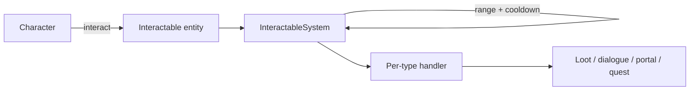

# Interactable System

**Short description:** A server-authoritative, template-driven framework for interactive world objects in FishMMO, providing fourteen concrete interactable types from banking to teleporters.

## Table of Contents

- [Overview](#overview)
- [Supported Platforms](#supported-platforms)
- [Features](#features)
- [Prerequisites](#prerequisites)
- [Installation / Build](#installation--build)
- [Quick Start Guide](#quick-start-guide)
- [Configuration](#configuration)
- [Usage Examples](#usage-examples)
- [Operational Checks](#operational-checks)
- [Flow Diagram](#flow-diagram)
- [Project Structure](#project-structure)
- [License](#license)

## Overview

The Interactable system is a server-authoritative, template-driven framework for interactive world objects in FishMMO. It provides an abstract `Interactable` base class (NetworkBehaviour + ISpawnable) that handles range checking, rate limiting, network payloads, scene-object registration, and UI title rendering. Fourteen concrete subclasses extend this base to implement specific gameplay interactions: banking, ability crafting, shrines, capture points, containers (chests), dialogue NPCs, dungeon entrances, gathering nodes, lore objects, mailboxes, merchants, switches, teleporters, and world items.

## Supported Platforms

| Platform | Supported | Notes |
|----------|-----------|-------|
| Windows  | Yes       | Full server and client support |
| Linux    | Yes       | Full server and client support |
| WebGL    | Yes       | Client only |

- **Engine:** Unity 6.3 LTS
- **Backend:** IL2CPP

## Features

- Abstract `Interactable` base class with range checking, rate limiting, and network payload handling
- Fourteen concrete interactable types: AbilityCrafter, Banker, Bindstone, CapturePoint, Container, DialogueInteractable, DungeonEntrance, GatheringNode, LoreObject, Mailbox, Merchant, Shrine, Switch, Teleporter, WorldItem
- Server-authoritative validation with `sqrMagnitude`-based range checks (no square root)
- Template-driven configuration via ScriptableObjects per interactable type
- Scene-object registration and generated naming via `SceneObjectNamer` (name generator, seeded per spawn; 5 bytes on the wire)
- Object pooling support through `ISpawnable` and `ObjectSpawner` integration
- Client-side floating title/name label rendering with customizable color
- Achievement integration on most interactable types
- Dialogue tree system with branching nodes, conditions, and actions
- PvP/PvE capture point objectives with state tracking (Neutral, Capturing, Captured, Contested)
- Gathering nodes with weighted drop tables, limited uses, and gather timers
- Merchant tab system supporting abilities, ability events, and items

## Interaction Behaviour Is ECA Triggers

`Banker`, `Merchant`, `Bindstone`, `Teleporter` and the rest are **data holders**. None of them
carries hard-coded interact behaviour — what an interactable does when used comes entirely from the
`Trigger` assets in its `OnInteractTriggers` list, which `InteractableSystem` fires after
server-side validation.

The one exception is corpse looting, which `InteractableSystem` calls directly. That is deliberate:
looting is intrinsic to any NPC that can die, and a content author must not be able to make a
creature silently unlootable by forgetting a list entry. An NPC's own triggers still run on top,
for achievements, quest updates and dialogue.

**An empty list therefore means the object does nothing when used.** It still shows its title, still
accepts the interaction, and still passes every validation — it just has no implementation. The
system logs a warning when this happens, and `FishMMO > Interactables > Audit Interact Triggers`
reports it across every prefab and scene in the project.

### Shipped interaction triggers

Under `Assets/Templates/Entity/ECA/Interactions/`:

| Asset | Actions | Used by |
|---|---|---|
| `Bindstone Interact` | `BindstoneAction` | Bindstone |
| `Banker Interact` | `NPCLookAtInteractorAction`, `SendBankerBroadcastAction` | HumanBanker |
| `Merchant Interact` | `NPCLookAtInteractorAction`, `SendMerchantBroadcastAction` | HumanGeneralMerchant |
| `Ability Crafter Interact` | `NPCLookAtInteractorAction`, `SendAbilityCrafterBroadcastAction` | HumanAbilityCrafter |
| `Dungeon Entrance Interact` | `SendDungeonFinderBroadcastAction` | InstanceDungeonTest |
| `Teleporter Interact` | `TeleportAction` | every Teleporter |
| `World Item Pickup` | `PickupWorldItemAction` | Small World Item |

Create more with `FishMMO/ECA/Trigger`, or from the FishMMO Dashboard's **ECA → Triggers** category.

### Server-only actions

Interaction actions run on the server only, gated at **runtime** via `BaseAction.IsServer` rather
than `#if UNITY_SERVER`. The define is a build-target one and is absent in the editor, where the
scene server also runs — so the compile-time gate silently emptied every action body in the
configuration the project is developed in.

### Resolving which interactable a player meant

One GameObject often carries several: an NPC is its own lootable corpse, and an NPC that also trades
or hands out quests carries that component too. `InteractableResolver` is the single definition of
the rule — **a corpse wins while it is one**, otherwise the first non-corpse interactable — shared by
the client's target resolution, the scene server's interaction system, and the quest system.

`Interactable.CanInteract` enforces the other half: a non-corpse interactable on a body refuses, so
a dead merchant cannot open its shop.

### Rate limiting

`CanInteract` is a pure question. Spending the character's interact rate limit is a separate,
explicit call to `TryConsumeInteractRateLimit`, because three different callers ask the question and
only the interaction path should pay for it.

## Prerequisites

- **Unity 6.3 LTS**
- **FishNetworking** (FishNet) — NetworkBehaviour, SyncVar, broadcast infrastructure
- **FishMMO Shared Core** — `IInteractable`, `ISpawnable`, `CharacterBehaviour`, `CachedScriptableObject<T>`, scene-object interfaces

## Installation / Build

This is an integrated module within the FishMMO project. No separate installation is required. The interactable scripts are included automatically when the FishMMO Unity project is opened.

## Quick Start Guide

1. **Create a new interactable** — Add one of the concrete interactable components (e.g., `Merchant`, `GatheringNode`, `Container`) to a GameObject in a scene.
2. **Assign a template** — For template-driven types, create the matching ScriptableObject (e.g., `MerchantTemplate`, `GatheringNodeTemplate`) and assign it to the component's `Template` field.
3. **Set interaction range** — Adjust the `InteractionRange` field on the component (default: 3.5 units).
4. **Ensure SceneObjectNamer** — Types like `AbilityCrafter`, `Banker`, `Merchant`, and `Container` require `SceneObjectNamer` (added automatically via `[RequireComponent]`). With default settings it names the object from its `FactionController` race; set a Race Override, a Biome, or another mode (City / Dungeon / Point of Interest / Item) on the component for anything else.
5. **Server registration** — On the server, the interactable registers itself in `Awake()` via `SceneObject.Register()`. On the client, registration happens in `ReadPayload()` after receiving the object's `ID`.

## Configuration

### Interactable Base Constants

| Constant              | Value | Description                                           |
|-----------------------|-------|-------------------------------------------------------|
| `INTERACT_RATE_LIMIT` | 60 ms | Default minimum time between consecutive interactions |

### Interactable Base Fields

| Field              | Type    | Default | Description                                       |
|--------------------|---------|---------|---------------------------------------------------|
| `InteractionRange` | `float` | 3.5     | Maximum distance a player can interact from       |

### Virtual Properties

| Property           | Type     | Default                 | Description                  |
|--------------------|----------|-------------------------|------------------------------|
| `Name`             | `string` | `GameObject.name`       | Object name                  |
| `Title`            | `string` | `"Interactable"`        | UI display title             |
| `TitleColor`       | `Color`  | `TinyColor.forestGreen` | Title label color            |
| `InteractRateLimit`| `double` | `INTERACT_RATE_LIMIT`   | Override per-type rate limit |

### CapturePointTemplate

| Field / Property       | Type               | Description                                  |
|------------------------|--------------------|----------------------------------------------|
| `Template`             | `CapturePointTemplate` | ScriptableObject with capture parameters |
| `AchievementTemplate`  | `AchievementTemplate`  | Achievement to increment on capture      |
| `OwnerCharacterID`     | `long`             | Current owner (0 = neutral)                  |
| `CaptureProgress`      | `int`              | Interactions toward capture                  |
| `CapturingCharacterID` | `long`             | Player currently capturing                   |
| `State`                | `ObjectiveState`   | Current objective state                      |

### ContainerTemplate

| Field / Property       | Type                | Description                              |
|------------------------|---------------------|------------------------------------------|
| `Template`             | `ContainerTemplate` | ScriptableObject: `SlotCount`, `DespawnWhenEmpty` |
| `AchievementTemplate`  | `AchievementTemplate`  | Achievement to increment on open      |
| `Items`                | `List<Item>`        | Current item slots                       |

### GatheringNodeTemplate

| Field / Property       | Type                    | Description                            |
|------------------------|-------------------------|----------------------------------------|
| `Template`             | `GatheringNodeTemplate` | Drops list, MaxUses, GatherTimeSeconds |
| `RemainingUses`        | `int`                   | Remaining harvests before respawn      |

**GatheringDrop**: `Item` (BaseItemTemplate), `MinAmount`, `MaxAmount`, `Weight`.

### LoreObjectTemplate

| Field             | Type                  | Description                           |
|-------------------|-----------------------|---------------------------------------|
| `Template`        | `LoreObjectTemplate`  | LoreText, GrantAbilities, GrantAbilityEvents, GrantItems |

### MerchantTemplate

**MerchantTemplate** (ScriptableObject): lists of `AbilityTemplate`, `AbilityEvent`, and `BaseItemTemplate` references, organized by `MerchantTabType`.

### ShrineTemplate

| Field              | Type                  | Description                        |
|--------------------|-----------------------|------------------------------------|
| `HealHealth`       | `bool`                | Whether to heal health             |
| `HealthHealPercent`| `float`               | Percentage of max HP to restore    |
| `HealMana`         | `bool`                | Whether to heal mana               |
| `ManaHealPercent`  | `float`               | Percentage of max MP to restore    |
| `Buff`             | `BaseBuffTemplate`    | Optional buff to apply             |
| `BuffStackCount`   | `int`                 | Number of buff stacks to apply     |

### Switch

`Switch` has no template — its configuration lives directly on the component:

| Field          | Type             | Description                          |
|----------------|------------------|--------------------------------------|
| `SwitchTarget` | `ISwitchTarget`  | Object to activate/deactivate        |
| `IsToggle`     | `bool`           | If true, toggles; otherwise one-shot |

**ISwitchTarget** interface: `IsActivated` (bool), `Activate(IPlayerCharacter)`, `Deactivate(IPlayerCharacter)`.

### DialogueTemplate

**DialogueTemplate** (ScriptableObject):
- `StartNodeId` — entry node in the tree.
- `CacheDialogueChoices` — server-side choice persistence to prevent replay abuse.
- `Nodes` — list of `DialogueNode` entries, each with `Text`, `Conditions`, `OnEnterActions`, `OnExitActions`, and `Choices`.
- `DialogueChoice` — each choice has `Text`, `NextNodeId`, `Conditions`, and `OnSelectActions`.

## Usage Examples

### Network Lifecycle Methods

| Method            | Description                                                              |
|-------------------|--------------------------------------------------------------------------|
| `Awake()`         | Caches `Transform`, computes `interactionRangeSqr`. Client: strips "(Clone)" from name, renders title label. Server: calls `SceneObject.Register()`. |
| `OnDestroy()`     | Calls `SceneObject.Unregister()`.                                        |
| `ReadPayload()`   | Reads `ID` (Int64) from network reader, registers in scene.             |
| `WritePayload()`  | Writes `ID` (Int64) to network writer.                                  |
| `ResetState()`    | Clears `OnDespawn` event and `SpawnableSettings` (object pooling reset).|
| `Despawn()`       | Delegates to `ObjectSpawner.Despawn(this)`.                             |

### ISpawnable Members

| Member              | Type                | Description                                         |
|---------------------|---------------------|-----------------------------------------------------|
| `ObjectSpawner`     | `ObjectSpawner`     | The spawner managing this object                    |
| `SpawnableSettings` | `SpawnableSettings` | Spawn configuration from the spawner                |
| `ID`                | `long`              | Unique network identifier                           |
| `OnDespawn`         | `event Action<ISpawnable>` | Fired when the object is despawned            |

### Static Events (ICapturePoint)

- `OnCaptured(CapturePoint, long)` — fired when capture completes.
- `OnStateChanged(CapturePoint, ObjectiveState)` — fired on state transitions.

### Static Events (IDialogueInteractable)

- `OnServerDialogueRequested(ICharacter, DialogueTemplate)` — raised on the server when a dialogue session is requested via an ECA action. `InteractableSystem` subscribes to it to start dialogue sessions.

### Interactable Types Summary

| Type                  | Description                                                              | Template                |
|-----------------------|--------------------------------------------------------------------------|-------------------------|
| AbilityCrafter        | Opens the ability crafting UI. `[RequireComponent(typeof(SceneObjectNamer))]` | —                       |
| Banker                | Opens the bank storage UI. `[RequireComponent(typeof(SceneObjectNamer))]`    | —                       |
| Bindstone             | Sets the player's `BindPosition` / `BindScene` via `BindstoneAction`      | —                       |
| CapturePoint          | PvP/PvE objective: ownership + capture progress tracking                 | `CapturePointTemplate`  |
| Container             | Chest/crate with items. `IItemContainer` for full slot management        | `ContainerTemplate`     |
| DialogueInteractable  | NPC dialogue tree with branching, conditions, and actions                | `DialogueTemplate`      |
| DungeonEntrance       | Portal to a dungeon scene. Achievement-integrated                        | —                       |
| GatheringNode         | Harvestable resource node with weighted drops and limited uses           | `GatheringNodeTemplate` |
| LoreObject            | Discoverable lore granting abilities, events, or items                   | `LoreObjectTemplate`    |
| Mailbox               | Opens the mail UI. No template required                                  | —                       |
| Merchant              | Buy/sell with tabbed inventory. `[RequireComponent(typeof(SceneObjectNamer))]` | `MerchantTemplate`      |
| QuestInteractable     | Quest giver / turn-in NPC                                                | —                       |
| Shrine                | Healing/buff station                                                     | `ShrineTemplate`        |
| Switch                | Toggle/trigger activating an `ISwitchTarget`                             | —                       |
| Teleporter            | Moves player to target Transform                                         | —                       |
| WorldItem             | Dropped item with `BaseItemTemplate` + custom network payload            | —                       |

### Common Patterns

- **SceneObjectNamer**: Required component on `AbilityCrafter`, `Banker`, `CapturePoint`, `Container`, `Merchant`, and others. Generates deterministic scene-unique names for network-safe identification.
- **AchievementTemplate**: Most interactable types expose an `AchievementTemplate` field to increment progress on interaction.
- **Title / TitleColor**: Every subclass overrides `Title` and `TitleColor` to customize the floating name label rendered via the `ICharacter.CharacterGuildLabel` on the client.
- **SceneObject Registration**: Server-side registration happens in `Awake()`; client-side registration happens in `ReadPayload()` after receiving the object's `ID` from the server.

## Operational Checks

| Check | Expected Result | How to Verify |
|-------|----------------|---------------|
| Interactable spawns in scene | Object appears with floating title label | Enter play mode, observe scene |
| Range check blocks distant interaction | Interaction rejected when player > `InteractionRange` | Move player beyond range, attempt interact |
| Rate limit prevents spam | Rapid interactions throttled to `InteractRateLimit` interval | Spam interact key, observe rejection |
| SceneObject registration | Server registers in `Awake()`, client in `ReadPayload()` | Check server logs for registration |
| Template data loads | ScriptableObject fields populated at runtime | Inspect interactable component in inspector |
| Network payload round-trip | `ID` written/read correctly across server and client | Spawn interactable, verify client receives correct ID |
| Object pooling reset | `ResetState()` clears events and settings on despawn | Despawn and respawn, verify clean state |
| Achievement increment | Achievement progresses on interaction | Interact with achievement-enabled interactable, check achievement |

## Flow Diagram

### High-Level Overview



### Interaction Flow

```
Player requests interaction
        │
        ▼
  CanInteract(IPlayerCharacter)
        │
        ├── NextInteractTime < UtcNow?  ──No──▶  Rejected
        │       │
        │      Yes
        │       ▼
        ├── InRange(transform)?  ──No──▶  Rejected
        │       │
        │      Yes
        │       ▼
        └── Set NextInteractTime = UtcNow + InteractRateLimit
                │
                ▼
           return true → Subclass handles interaction
```

Range checking uses `sqrMagnitude` for efficiency (no square root).

## Project Structure

### Directory Structure

```
Interactable/
├── IInteractable.cs                    # Shared interface (ISceneObject + interaction API)
├── Interactable.cs                     # Abstract NetworkBehaviour base class (IInteractable, ISpawnable)
├── AbilityCrafter.cs                   # Ability crafting station interactable
├── Banker.cs                           # Banking access interactable
├── Bindstone.cs                        # Respawn bind-point interactable
├── DungeonEntrance.cs                  # Dungeon portal interactable
├── Teleporter.cs                       # Teleporter interactable (target Transform)
├── WorldItem.cs                        # Dropped item in the world (BaseItemTemplate + custom payload)
├── CapturePoint/
│   ├── CapturePoint.cs                 # PvP/PvE objective capture interactable
│   ├── CapturePointTemplate.cs         # ScriptableObject: PointValue, InteractionsToCapture
│   └── ObjectiveState.cs               # Enum: Neutral, Capturing, Captured, Contested
├── Container/
│   ├── Container.cs                    # Chest/crate interactable (IItemContainer)
│   └── ContainerTemplate.cs            # ScriptableObject: SlotCount, DespawnWhenEmpty
├── Dialogue/
│   ├── DialogueInteractable.cs         # NPC dialogue interactable
│   ├── DialogueNode.cs                 # Single node in a dialogue tree
│   ├── DialogueChoice.cs               # Choice within a dialogue node
│   └── Template/
│       └── DialogueTemplate.cs         # ScriptableObject: full dialogue tree with branching
├── EventData/
│   └── PlayerInteractionEventData.cs   # EventData subclass for interaction events
├── GatheringNode/
│   ├── GatheringNode.cs                # Harvestable resource node interactable
│   ├── GatheringNodeTemplate.cs        # ScriptableObject: Drops, MaxUses, GatherTimeSeconds
│   └── GatheringDrop.cs               # Drop entry: Item, MinAmount, MaxAmount, Weight
├── LoreObject/
│   ├── LoreObject.cs                   # Lore discovery interactable
│   └── LoreObjectTemplate.cs           # ScriptableObject: LoreText, GrantAbilities, GrantItems
├── Mailbox/
│   └── Mailbox.cs                      # Mail access interactable
├── Merchant/
│   ├── Merchant.cs                     # Buy/sell merchant interactable
│   ├── MerchantTabType.cs              # Enum: None, Ability, AbilityEvent, Item
│   └── Template/
│       └── MerchantTemplate.cs         # ScriptableObject: Abilities, AbilityEvents, Items
├── Quest/
│   └── QuestInteractable.cs            # Quest giver / turn-in interactable
├── Shrine/
│   ├── Shrine.cs                       # Healing/buff shrine interactable
│   └── ShrineTemplate.cs              # ScriptableObject: heal amounts, buff reference
└── Switch/
    ├── Switch.cs                       # Toggle/trigger switch interactable
    └── ISwitchTarget.cs                # Interface for objects activated by switches
```

### Inheritance Hierarchies

#### Interactable Types

```
NetworkBehaviour
└── Interactable (abstract) : IInteractable, ISpawnable
    ├── AbilityCrafter     : IAbilityCrafter
    ├── Banker             : IBanker
    ├── Bindstone          : IBindstone
    ├── CapturePoint       : ICapturePoint
    ├── Container          : IContainer, IItemContainer
    ├── DialogueInteractable : IDialogueInteractable
    ├── DungeonEntrance    : IDungeonEntrance
    ├── GatheringNode      : IGatheringNode
    ├── LoreObject         : ILoreObject
    ├── Mailbox            : IMailbox
    ├── Merchant           : IMerchant
    ├── QuestInteractable  : IQuestInteractable
    ├── Shrine             : IShrine
    ├── Switch             : ISwitch
    ├── Teleporter         : ITeleporter
    └── WorldItem          : IWorldItem
```

#### Templates (ScriptableObjects)

```
CachedScriptableObject<T>
├── CapturePointTemplate
├── ContainerTemplate
├── DialogueTemplate
├── GatheringNodeTemplate
├── LoreObjectTemplate
├── MerchantTemplate
└── ShrineTemplate
```

#### Enums

```
ObjectiveState : byte
├── Neutral    = 0
├── Capturing  = 1
├── Captured   = 2
└── Contested  = 3

MerchantTabType : byte
├── None         = 0
├── Ability      = 1
├── AbilityEvent = 2
└── Item         = 3
```

### Related Files

```
Shared/Core/Entity/Interactable/                # 16 core interfaces (IAbilityCrafter, IBanker, etc.)
Shared/Implementation/Entity/Naming/             # SceneObjectNamer used by interactables
Shared/Implementation/Entity/Spawner/            # ObjectSpawner that spawns/despawns interactables
Server/Implementation/World/SceneServer/          # Server-side interaction handling systems
Client/GUI/World/                                 # Client-side UI Toolkit panels for each interaction type
```

## License

This project is subject to the FishMMO project license.
