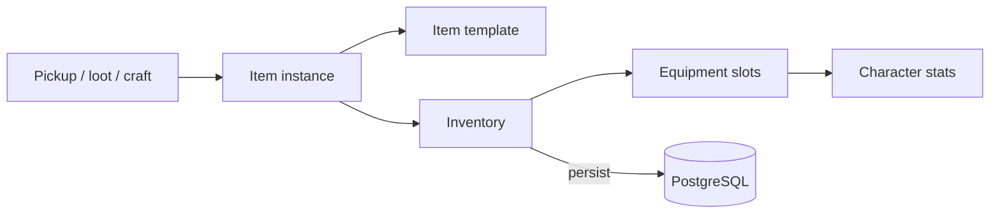

# Item / Inventory System

**Short description:** A component-based, template-driven framework for items, inventories, equipment, and banking in FishMMO.

## Table of Contents

- [Overview](#overview)
- [Supported Platforms](#supported-platforms)
- [Features](#features)
- [Prerequisites](#prerequisites)
- [Installation / Build](#installation--build)
- [Quick Start Guide](#quick-start-guide)
- [Configuration](#configuration)
- [Usage Examples](#usage-examples)
- [Operational Checks](#operational-checks)
- [Flow Diagrams](#flow-diagrams)
- [Project Structure](#project-structure)
- [License](#license)

## Overview

The Item system is a component-based, template-driven framework for items, inventories, equipment, and banking in FishMMO. Each `Item` instance is composed of optional sub-components (`ItemStackable`, `ItemEquippable`, `ItemGenerator`) determined by its template type. Items live inside slot-based `ItemContainer` controllers (`InventoryController`, `EquipmentController`, `BankController`) attached to characters as `CharacterBehaviour` components. The system supports seed-based deterministic attribute generation, stacking, equip/unequip with character stat modification, cross-container slot swaps, and FishNet network synchronization via broadcasts.

## Supported Platforms

| Platform | Supported | Notes |
|----------|-----------|-------|
| Windows  | Yes       | Full server and client support |
| Linux    | Yes       | Full server and client support |
| WebGL    | Yes       | Client only |

**Engine:** Unity 6.3 LTS  
**Backend:** IL2CPP

## Features

- Template-driven item definitions via ScriptableObjects (`BaseItemTemplate`, `EquippableItemTemplate`, `ConsumableTemplate`)
- Composition-based runtime item instances with optional `ItemStackable`, `ItemEquippable`, and `ItemGenerator` sub-components
- Seed-based deterministic attribute generation for weapons, armor, and random attribute pools
- Slot-based abstract `ItemContainer` with concrete `InventoryController` (32 slots), `EquipmentController` (10 slots), and `BankController` (100 slots)
- Full stacking logic with same-template/same-seed matching, stack merging, and unstacking
- Equip/unequip flow with live character attribute modifier application and removal
- Cross-container slot swaps between inventory, equipment, and bank
- Consumable system with charge-based usage, cooldowns, and scroll-based ability learning
- FishNet network synchronization via typed broadcasts (set, batch set, remove, swap) per container
- Event-driven slot updates (`OnSlotUpdated`, `OnEquip`, `OnUnequip`, `OnDestroy`)

## Prerequisites

- **Unity 6.3 LTS**
- **FishNetworking** — NetworkBehaviour, Reader/Writer, Broadcasts
- **FishMMO Shared Core** — `CharacterBehaviour`, `CachedScriptableObject`, `CharacterAttribute`, `BaseCondition`

## Installation / Build

This is an integrated module within the FishMMO project. No separate installation or build steps are required. The item system is included automatically when the FishMMO workspace is set up.

## Quick Start Guide

1. **Create an item template** — In the Unity Editor, right-click in the Project window and create a new ScriptableObject derived from `BaseItemTemplate` (e.g., `WeaponTemplate`, `ArmorTemplate`, `ConsumableTemplate`). Configure its fields (price, stack size, attributes, slot).
2. **Register the template** — Add the template to an `ItemTemplateDatabase` asset so it receives a deterministic cached ID.
3. **Instantiate at runtime** — Create an item via `new Item(id, seed, templateID, amount)`. The constructor auto-wires sub-components based on the template type.
4. **Add to a container** — Call `inventoryController.TryAddItem(item, out modifiedItems)` to place the item in a character's inventory.
5. **Equip an item** — Call `equipmentController.Equip(item, inventoryIndex, sourceContainer, targetSlot)` to equip from inventory.
6. **Consume an item** — Call `consumableTemplate.Invoke(character, item)` for charge-based consumable usage.

## Configuration

### BaseItemTemplate (Inspector)

| Field | Type | Default | Description |
|-------|------|---------|-------------|
| `IsIdentifiable` | `bool` | false | Whether the item has hidden stats |
| `Generate` | `bool` | false | Whether to create an `ItemGenerator` |
| `MaxStackSize` | `uint` | 1 | Max stack size (>1 enables stacking) |
| `Price` | `int` | 0 | Buy/sell price |
| `Attributes` | `List<ItemAttributeTemplate>` | — | Base attributes added after generation |

### EquippableItemTemplate (Inspector)

| Field | Type | Description |
|-------|------|-------------|
| `Slot` | `ItemSlot` | Equipment slot (Head, Chest, Legs, etc.) |
| `MaxItemAttributes` | `int` | Max random attributes on generation |
| `RandomAttributeDatabases` | `ItemAttributeTemplateDatabase[]` | Pools for random attribute selection |
| `ModelSeed` | `uint` | Seed for model randomization |
| `ModelPools` | `int[]` | Visual model variation pools |

### ConsumableTemplate (Inspector)

| Field | Type | Default | Description |
|-------|------|---------|-------------|
| `ConsumableType` | `ConsumableType` | — | Potion, Food, Mount, or Scroll |
| `ChargeCost` | `uint` | 1 | Charges consumed per use |
| `Cooldown` | `float` | 0 | Seconds of cooldown after use |

### Container Sizes

| Container | Default Slots | Notes |
|-----------|---------------|-------|
| `InventoryController` | 32 | Main character inventory |
| `EquipmentController` | `ItemSlot` enum count (10) | One slot per equipment type |
| `BankController` | 100 | Persistent bank storage with currency |

## Usage Examples

### Data Model

#### Item Instance

Each `Item` holds references to its optional sub-components and template:

| Field | Type | Description |
|-------|------|-------------|
| `ID` | `long` | Unique database instance ID |
| `Version` | `long` | Incremented on state changes that affect client sync |
| `Slot` | `int` | Current slot index in its container (-1 if unslotted) |
| `Template` | `BaseItemTemplate` | The ScriptableObject blueprint |
| `Stackable` | `ItemStackable` | Stack management (null if non-stackable) |
| `Equippable` | `ItemEquippable` | Equip/unequip + owner tracking (null if non-equippable) |
| `Generator` | `ItemGenerator` | Seed-based attribute generation (null if non-generated) |

#### ItemStackable

| Field | Type | Description |
|-------|------|-------------|
| `Amount` | `uint` | Current stack count |
| `IsStackFull` | `bool` | True when `Amount == MaxStackSize` |

#### ItemEquippable

| Field | Type | Description |
|-------|------|-------------|
| `Character` | `ICharacter` | The character currently equipping this item (null if not equipped) |

#### ItemGenerator

| Field | Type | Description |
|-------|------|-------------|
| `Seed` | `int` | Deterministic seed for attribute generation |
| `Attributes` | `Dictionary<string, ItemAttribute>` | Generated attribute instances keyed by name |

#### ItemAttribute

| Field | Type | Description |
|-------|------|-------------|
| `Template` | `ItemAttributeTemplate` | The attribute type definition (min/max, linked CharacterAttribute) |
| `value` | `int` | Current attribute value |

### Container API

All containers extend `ItemContainer` which provides:

| Method | Description |
|--------|-------------|
| `AddSlots(items, amount)` | Initializes container capacity |
| `TryAddItem(item, out modifiedItems)` | Adds item with stacking logic, returns modified slots |
| `SetItemSlot(item, slot)` | Direct slot assignment |
| `SwapItemSlots(from, to)` | Swaps two slots, fires `OnSlotUpdated` for both |
| `RemoveItem(slot)` | Removes and returns the item at slot |
| `CanAddItem(item)` | Checks stacking capacity and free slots |
| `HasFreeSlot()` / `FreeSlots()` / `FilledSlots()` | Capacity queries |
| `ContainsItem(template)` / `GetItemCount(template)` | Search by template |
| `CanManipulate()` | Checks character is alive and container is non-empty |

### Stacking Logic

Items stack when they have the same template ID and matching generation seed (via `IsMatch()`).

```
ItemStackable.AddToStack(other)
  ├── Validate: same template, matching seed, neither stack full
  ├── Calculate remainingCapacity = MaxStackSize - Amount
  ├── Transfer: Amount += min(remainingCapacity, other.Amount)
  └── other.Amount = remainder

ItemStackable.TryUnstack(amount, out instance)
  ├── If amount >= Amount: return entire item
  └── Else: reduce Amount, return null (new instance creation unfinished)
```

### Consumable Usage

Consumables use a charge-based model with cooldowns:

```
ConsumableTemplate.Invoke(character, item)
  ├── CanConsume: character alive, item stackable, Amount >= ChargeCost, not on cooldown
  ├── Apply cooldown (if Cooldown > 0)
  ├── item.Stackable.Remove(ChargeCost)
  └── If Amount < 1: item.Destroy()

ScrollConsumableTemplate extends this to grant abilities:
  └── abilityController.LearnBaseAbilities(AbilityTemplates)
```

### Attribute Generation

The `ItemGenerator` uses deterministic seed-based generation:

1. **Seed derivation**: If no seed provided, derived from item ID bytes for reproducibility.
2. **Base attributes**: `WeaponTemplate` generates AttackPower + AttackSpeed; `ArmorTemplate` generates ArmorBonus — values randomized within template min/max ranges.
3. **Random attributes**: Up to `MaxItemAttributes` drawn from `RandomAttributeDatabases`, each with randomized values.
4. **Additional attributes**: `BaseItemTemplate.Attributes` list merged/summed into generated attributes.

`SetAttribute(name, newValue)` updates a generated attribute and, if the item is equipped, immediately adjusts the character's attribute modifiers (removes old value, applies new value).

### Events

#### Item Events

| Event | Parameters | Description |
|-------|------------|-------------|
| `Item.OnDestroy` | _(none)_ | Fired when the item is destroyed |

#### ItemEquippable Events

| Event | Parameters | Description |
|-------|------------|-------------|
| `OnEquip` | `ICharacter owner` | Fired when equipped to a character |
| `OnUnequip` | `ICharacter owner` | Fired when unequipped from a character |

#### Container Events

| Event | Parameters | Description |
|-------|------------|-------------|
| `OnSlotUpdated` | `IItemContainer, Item, int slot` | Fired on any slot change (add, remove, swap, set) |

### Network Synchronization

#### Equipment Payload (FishNet Reader/Writer)

The `EquipmentController` implements `ReadPayload` / `WritePayload` for initial character synchronization:

| Direction | Data per item |
|-----------|---------------|
| Write | `ID, TemplateID, Slot, Seed, StackSize` |
| Read | Creates `Item`, calls `SetItemSlot`, calls `Equippable.Equip(Character)` |

#### Broadcast Types — Inventory

| Broadcast | Direction | Purpose |
|-----------|-----------|---------|
| `InventorySetItemBroadcast` | Server → Client | Set a single inventory slot |
| `InventorySetMultipleItemsBroadcast` | Server → Client | Batch set multiple slots |
| `InventoryRemoveItemBroadcast` | Server → Client | Remove item from slot |
| `InventorySwapItemSlotsBroadcast` | Server → Client | Swap slots (within inventory or cross-container) |

#### Broadcast Types — Equipment

Equipment state is synchronized via the prediction pipeline (`EquipmentController` at Order 93 in `CharacterReconcileData`). Only client→server request broadcasts remain:

| Broadcast | Direction | Purpose |
|-----------|-----------|---------|
| `EquipmentEquipItemBroadcast` | Client ↔ Server | Equip from inventory/bank (echoed back as acknowledgement) |
| `EquipmentUnequipItemBroadcast` | Client ↔ Server | Unequip to inventory/bank (echoed back as acknowledgement) |

#### Broadcast Types — Bank

| Broadcast | Direction | Purpose |
|-----------|-----------|---------|
| `BankSetItemBroadcast` | Server → Client | Set a single bank slot |
| `BankSetMultipleItemsBroadcast` | Server → Client | Batch set multiple slots |
| `BankRemoveItemBroadcast` | Server → Client | Remove item from slot |
| `BankSwapItemSlotsBroadcast` | Server → Client | Swap slots (within bank or cross-container) |

#### Cross-Container Swaps

Swap broadcasts include an `InventoryType` field (`Inventory`, `Equipment`, `Bank`) to identify the source container. The receiving controller resolves the other container via `Character.TryGet<T>()` and performs the swap across both containers.

### External Integration Points

| System | Integration |
|--------|-------------|
| **CharacterAttribute** | `ItemGenerator.ApplyAttributes` / `RemoveAttributes` calls `AddModifier()` on character attributes via `ExternalModifier` |
| **Ability System** | `ScrollConsumableTemplate` teaches abilities via `IAbilityController.LearnBaseAbilities` |
| **Cooldown System** | `ConsumableTemplate` adds cooldowns via `ICooldownController.AddCooldown` |
| **Damage System** | `ItemContainer.CanManipulate()` checks `ICharacterDamageController.IsAlive` |
| **Achievement System** | Item rewards delivered via `InventoryController.TryAddItem` |
| **Quest System** | Checks item prerequisites via `ContainsItem` / `GetItemCount` |
| **Trade / Merchant** | Uses `Price` field and container add/remove operations |
| **Database Layer** | Persists/loads via item DTOs and services (`ICharacterInventoryService`, `ICharacterEquipmentService`, `ICharacterBankService`) |
| **UI** | Inventory, equipment, and bank panels subscribe to `OnSlotUpdated` events |

## Operational Checks

| Check | How to Verify | Expected Result |
|-------|---------------|-----------------|
| Item creation | Instantiate `new Item(id, seed, templateID, amount)` | Sub-components wired based on template type |
| Inventory add | `inventoryController.TryAddItem(item, out modified)` | Returns `true`, item appears in slot |
| Stacking | Add two items with same template + seed | Items merge into single stack |
| Equip | `equipmentController.Equip(item, slot, source, targetSlot)` | Item moves to equipment, character attributes modified |
| Unequip | `equipmentController.Unequip(targetContainer, slot, out modified)` | Item returns to target container, attribute modifiers removed |
| Network sync | Connect client to server with equipped items | `WritePayload` / `ReadPayload` round-trips item state correctly |
| Consumable use | `consumableTemplate.Invoke(character, item)` | Charges consumed, cooldown applied, item destroyed if empty |
| Cross-container swap | Swap broadcast with `InventoryType` field | Items swap correctly between inventory/equipment/bank |

## Flow Diagrams

### Item Initialization

```
new Item(id, seed, templateID, amount)
  └── Initialize(id, amount, seed)
      ├── If MaxStackSize > 1: create ItemStackable(amount)
      ├── If template is EquippableItemTemplate: create ItemEquippable
      ├── If template.Generate: create ItemGenerator
      │   └── If seed == 0 && ID != 0: derive seed from item ID bytes
      ├── Equippable.Initialize(item)
      ├── Generator.Initialize(item, seed)  → calls Generate(seed)
      │   ├── If template is WeaponTemplate: generate AttackPower + AttackSpeed
      │   ├── If template is ArmorTemplate: generate ArmorBonus
      │   ├── If RandomAttributeDatabases: add random attributes
      │   └── Add additional template Attributes (merged/summed)
      └── Wire events: OnEquip → ApplyAttributes, OnUnequip → RemoveAttributes
```

### Equipping an Item

```
EquipmentController.Equip(item, inventoryIndex, sourceContainer, toSlot)
  ├── Validate: item != null, item.IsEquippable, CanManipulate()
  ├── Validate: template slot matches target slot
  ├── If slot occupied:
  │   ├── previousItem.Equippable.Unequip()  → removes attribute modifiers
  │   └── Swap previousItem back to sourceContainer[inventoryIndex]
  ├── Else: sourceContainer.RemoveItem(inventoryIndex)
  ├── SetItemSlot(item, slotIndex)
  └── item.Equippable.Equip(Character)
      └── fires OnEquip
          └── Item.ItemEquippable_OnEquip(character)
              └── Generator.ApplyAttributes(character)
                  └── For each generated attribute:
                      └── characterAttribute.AddModifier(value)
```

### Unequipping an Item

```
EquipmentController.Unequip(targetContainer, slot, out modifiedItems)
  ├── Validate: CanManipulate(), item exists, container.CanAddItem(item)
  ├── targetContainer.TryAddItem(item, out modifiedItems)
  ├── item.Equippable.Unequip()
  │   └── fires OnUnequip
  │       └── Item.ItemEquippable_OnUnequip(character)
  │           └── Generator.RemoveAttributes(character)
  │               └── For each generated attribute:
  │                   └── characterAttribute.AddModifier(-value)
  └── SetItemSlot(null, slot)
```

## Project Structure

### Directory Structure

```
Item/
├── Item.cs                                    # Runtime item instance (composition root)
├── ItemAttribute.cs                           # Runtime attribute instance on an item
├── ItemEquippable.cs                          # Equip/unequip component (IEquippable<ICharacter>)
├── ItemGenerator.cs                           # Seed-based attribute generation and application
├── ItemSlot.cs                                # Enum: Head, Chest, Shoulders, Hands, Legs, Feet, Back, Primary, Secondary, Accessory
├── ItemStackable.cs                           # Stack management component (IStackable<Item>)
├── Container/
│   ├── IItemContainer.cs                      # Container interface (slot CRUD, events)
│   ├── ItemContainer.cs                       # Abstract base container (CharacterBehaviour)
│   ├── Bank/
│   │   ├── IBankController.cs                 # Bank interface (currency, swap validation)
│   │   └── BankController.cs                  # Bank container (100 slots, currency)
│   ├── Equipment/
│   │   └── IEquipmentController.cs            # Equipment interface (equip, unequip, activate)
│   │   # EquipmentController.cs moved to Prediction/Equipment/
│   └── Inventory/
│       ├── IInventoryController.cs            # Inventory interface (activate, swap validation)
│       ├── InventoryController.cs             # Main inventory container (32 slots)
│       └── InventoryType.cs                   # Enum: Inventory, Equipment, Bank
└── Template/
    ├── ItemTemplateDatabase.cs                # ScriptableObject lookup: name → BaseItemTemplate
    ├── Attribute/
    │   ├── ItemAttributeTemplate.cs           # ScriptableObject: min/max value + CharacterAttribute link
    │   └── ItemAttributeTemplateDatabase.cs   # ScriptableObject lookup: name → ItemAttributeTemplate
    └── Types/
        ├── BaseItemTemplate.cs                # Abstract base template (price, icon, stackability, attributes)
        ├── Consumable/
        │   ├── ConsumableTemplate.cs          # Abstract consumable (charge cost, cooldown)
        │   ├── ConsumableType.cs              # Enum: Potion, Food, Mount, Scroll
        │   └── ScrollConsumableTemplate.cs    # Scroll that teaches abilities on use
        └── Equipment/
            ├── EquippableItemTemplate.cs       # Abstract equippable (slot, random attributes, model data)
            ├── WeaponTemplate.cs               # Weapon: attack power + attack speed
            └── ArmorTemplate.cs                # Armor: armor bonus
```

### Related Files (Outside This Directory)

```
Shared/Implementation/Network/Character/InventoryBroadcasts.cs          # Inventory broadcast structs
Shared/Implementation/Network/Character/EquipmentBroadcasts.cs          # Equipment broadcast structs
Shared/Implementation/Network/Character/BankBroadcasts.cs               # Bank broadcast structs
Server/Implementation/World/SceneServer/Character/CharacterSystem.cs  # Loads items from DB on character connect
```

### Inheritance Hierarchies

#### Runtime Instances (Composition)

```
Item
├── ItemStackable    (optional, if MaxStackSize > 1)
├── ItemEquippable   (optional, if template is EquippableItemTemplate)
└── ItemGenerator    (optional, if template.Generate is true)
```

#### Templates (ScriptableObjects)

```
CachedScriptableObject<BaseItemTemplate>
└── BaseItemTemplate
    ├── ConsumableTemplate (abstract)
    │   └── ScrollConsumableTemplate (abstract)
    └── EquippableItemTemplate (abstract)
        ├── WeaponTemplate
        └── ArmorTemplate

CachedScriptableObject<ItemAttributeTemplate>
└── ItemAttributeTemplate
```

#### Containers (NetworkBehaviour)

```
CharacterBehaviour
└── ItemContainer (abstract) : IItemContainer
    ├── InventoryController : IInventoryController
    ├── EquipmentController : IEquipmentController, IPredictableController (Order 93)
    └── BankController      : IBankController
```

> **Note:** `EquipmentController.cs` was moved to `Prediction/Equipment/` and now implements `IPredictableController` at Order 93. Equipment state is reconciled alongside other predicted state. The broadcast path (`EquipmentEquipItemBroadcast`/`EquipmentUnequipItemBroadcast`) handles client→server requests; attribute application is deferred to the reconcile path.

## License

This project is subject to the FishMMO project license.

## Flow Diagram


