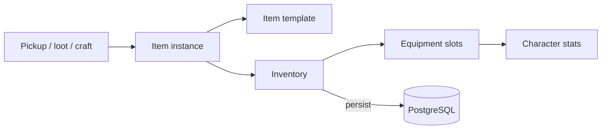

# Item / Inventory System

**Short description:** A component-based, template-driven framework for items, inventories, equipment, and banking in FishMMO.

## Table of Contents

- [Overview](#overview)
- [Supported Platforms](#supported-platforms)
- [Features](#features)
- [Prerequisites](#prerequisites)
- [Installation / Build](#installation--build)
- [Quick Start Guide](#quick-start-guide)
- [Configuration](#configuration)
- [Usage Examples](#usage-examples)
  - [Persistence shape](#persistence-shape)
  - [Item identity and the zero-id rule](#item-identity-and-the-zero-id-rule)
  - [Stack split and merge](#stack-split-and-merge)
  - [Slot locks](#slot-locks)
  - [Tooltips](#tooltips)
  - [Server hooks for shared code](#server-hooks-for-shared-code)
- [Operational Checks](#operational-checks)
- [Flow Diagrams](#flow-diagrams)
- [Project Structure](#project-structure)
- [License](#license)

## Overview

The Item system is a component-based, template-driven framework for items, inventories, equipment, and banking in FishMMO. Each `Item` instance is composed of optional sub-components (`ItemStackable`, `ItemEquippable`, `ItemGenerator`) determined by its template type. Items live inside slot-based `ItemContainer` controllers (`InventoryController`, `EquipmentController`, `BankController`) attached to characters as `CharacterBehaviour` components. The system supports seed-based deterministic attribute generation, stacking, equip/unequip with character stat modification, cross-container slot swaps, and FishNet network synchronization via broadcasts.

## Supported Platforms

| Platform | Supported | Notes |
|----------|-----------|-------|
| Windows  | Yes       | Full server and client support |
| Linux    | Yes       | Full server and client support |
| WebGL    | Yes       | Client only |

**Engine:** Unity 6.3 LTS  
**Backend:** IL2CPP

## Features

- Template-driven item definitions via ScriptableObjects (`BaseItemTemplate`, `EquippableItemTemplate`, `ConsumableTemplate`)
- Composition-based runtime item instances with optional `ItemStackable`, `ItemEquippable`, and `ItemGenerator` sub-components
- Seed-based deterministic attribute generation for weapons, armor, and random attribute pools
- Slot-based abstract `ItemContainer` with concrete `InventoryController` (32 slots), `EquipmentController` (10 slots), and `BankController` (100 slots)
- Full stacking logic with same-template/same-seed matching, stack merging, and unstacking
- Quantity-conserving stack split and merge (`ItemStackTransfer`), all-or-nothing and pinned by `ItemStackSplitMergeTests`
- Per-slot locks (`LockSlot` / `UnlockSlot` / `OnSlotLockChanged`) that make a slot in flight untouchable
- Equip/unequip flow with live character attribute modifier application and removal
- Cross-container slot swaps between inventory, equipment, and bank
- Consumable system with charge-based usage, cooldowns, and scroll-based ability learning; concrete `ResourceConsumableTemplate` and `KnowledgeScrollTemplate` assets
- FishNet network synchronization via typed broadcasts (set, batch set, remove, swap) per container
- Event-driven slot updates (`OnSlotUpdated`, `OnSlotLockChanged`, `OnEquip`, `OnUnequip`, `OnDestroy`)
- Typed tooltip rows (`TooltipContent`) built by every template and by the generated roll

## Prerequisites

- **Unity 6.3 LTS**
- **FishNetworking** — NetworkBehaviour, Reader/Writer, Broadcasts
- **FishMMO Shared Core** — `CharacterBehaviour`, `CachedScriptableObject`, `CharacterAttribute`, `BaseCondition`

## Installation / Build

This is an integrated module within the FishMMO project. No separate installation or build steps are required. The item system is included automatically when the FishMMO workspace is set up.

## Quick Start Guide

1. **Create an item template** — In the Unity Editor, right-click in the Project window and create a new ScriptableObject derived from `BaseItemTemplate` (e.g., `WeaponTemplate`, `ArmorTemplate`, `ConsumableTemplate`). Configure its fields (price, stack size, attributes, slot).
2. **Register the template** — Add the template to an `ItemTemplateDatabase` asset so it receives a deterministic cached ID.
3. **Instantiate at runtime** — Create an item via `new Item(id, seed, templateID, amount)`. The constructor auto-wires sub-components based on the template type.
4. **Add to a container** — Call `inventoryController.TryAddItem(item, out modifiedItems)` to place the item in a character's inventory.
5. **Equip an item** — Call `equipmentController.Equip(item, inventoryIndex, sourceContainer, targetSlot)` to equip from inventory.
6. **Consume an item** — Call `inventoryController.Activate(slot)`. A `ConsumableTemplate` is handed to `IAbilityController.ActivateConsumable(item)`, which pre-filters on the client, queues the use into the next replicate, and lets the server re-validate. Nothing is consumed by `Activate` itself; the template's `Invoke(character, item, currentTick)` runs from the activation pipeline.

## Configuration

### BaseItemTemplate (Inspector)

| Field | Type | Default | Description |
|-------|------|---------|-------------|
| `IsIdentifiable` | `bool` | false | Whether the item has hidden stats |
| `Generate` | `bool` | false | Whether to create an `ItemGenerator` |
| `MaxStackSize` | `uint` | 1 | Max stack size (>1 enables stacking) |
| `Price` | `int` | 0 | Buy/sell price |
| `Attributes` | `List<ItemAttributeTemplate>` | — | Base attributes added after generation |

### EquippableItemTemplate (Inspector)

| Field | Type | Description |
|-------|------|-------------|
| `Slot` | `ItemSlot` | Equipment slot (Head, Chest, Legs, etc.) — see [ItemSlot is numbered by contract](#itemslot-is-numbered-by-contract) |
| `MaxItemAttributes` | `int` | Max random attributes on generation |
| `RandomAttributeDatabases` | `ItemAttributeTemplateDatabase[]` | Pools for random attribute selection |
| `ModelSeed` | `uint` | Seed for model randomization |
| `ModelPools` | `int[]` | Visual model variation pools |

### ConsumableTemplate (Inspector)

| Field | Type | Default | Description |
|-------|------|---------|-------------|
| `ConsumableType` | `ConsumableType` | — | Potion, Food, Mount, or Scroll |
| `ChargeCost` | `uint` | 1 | Charges consumed per use |
| `Cooldown` | `float` | 0 | Seconds of cooldown after use |

### ItemSlot is numbered by contract

**Every member of `ItemSlot` is explicitly numbered, and must stay that way.**

Item templates are ScriptableObjects and serialize this enum as its **integer**, so the number
is the contract — not the name and not the position in the declaration.

Inserting `Shoulders` at index 2 once shifted every slot below `Hands` in every already-authored
asset: leggings became shoulders, boots became legs, a sword became feet and a shield became
back. Nothing errored, because each value was still a valid slot — the items simply equipped to
the wrong part of the body, and the only symptom was a sword on someone's feet.

| Slot | Value |
|------|-------|
| `Head` | 0 |
| `Chest` | 1 |
| `Shoulders` | 2 |
| `Hands` | 3 |
| `Legs` | 4 |
| `Feet` | 5 |
| `Back` | 6 |
| `Primary` | 7 |
| `Secondary` | 8 |
| `Accessory` | 9 |

Add new slots at the **end** with the next free number. Never insert, never reorder, and never
reuse the number of a slot that has been removed.

Two consequences worth knowing:

- **Renumbering does not migrate saved data.** A character's equipment is persisted with
  whatever integer the template held when it was saved, so correcting a template does not
  correct rows already written against the old numbering.
- **`FishMMO > Validate > Equipment Item Slots`** cross-checks every equippable template's
  `Slot` against the folder it is filed under, because the folder independently records what a
  human meant when they filed the asset. It reports mismatches rather than correcting them: a
  template deliberately filed somewhere that does not match its slot is legitimate, and the tool
  cannot tell that apart from a mistake.

### Container Sizes

| Container | Default Slots | Notes |
|-----------|---------------|-------|
| `InventoryController` | 32 | Main character inventory |
| `EquipmentController` | `ItemSlot` enum count (10) | One slot per equipment type |
| `BankController` | 100 | Persistent bank storage |

`BankController` no longer carries a `Currency` field of its own; the bank is a container of
items and nothing else.

Containers are pre-sized with empty slots at `OnAwake` (`AddSlots(null, count)`), so
`Items.Count` **is** the capacity and an empty slot is a `null` entry rather than a missing one.
The inventory and bank panels size their grids from that count rather than from how many slots
hold something: an empty slot is what a player drops an item onto, and what shows them the room
they have.

## Usage Examples

### Data Model

#### Item Instance

Each `Item` holds references to its optional sub-components and template:

| Field | Type | Description |
|-------|------|-------------|
| `ID` | `long` (get-only) | Database identity, written by the constructors and by `AssignPersistentID`. **Zero means "not yet written"** — see [Item identity and the zero-id rule](#item-identity-and-the-zero-id-rule). |
| `Version` | `long` | Incremented on state changes that affect client sync |
| `Slot` | `int` | Current slot index in its container (-1 if unslotted) |
| `Template` | `BaseItemTemplate` | The ScriptableObject blueprint |
| `Stackable` | `ItemStackable` | Stack management (null if non-stackable) |
| `Equippable` | `ItemEquippable` | Equip/unequip + owner tracking (null if non-equippable) |
| `Generator` | `ItemGenerator` | Seed-based attribute generation (null if non-generated) |

#### Item identity and the zero-id rule

`Item.ID` is the identity the `character_item` row is keyed by, and it survives a move between
slots, a move between containers, and a relog. An item created at runtime — loot, a quest reward,
a merchant purchase, a stack split — has **no identity until its first persist returns one**, and
`AssignPersistentID` is what records it.

Nothing may key durable state by a zero id, because two such items would collide. That has one
consequence worth knowing:

> **An item equipped before its first persist contributes no attribute bonuses.**
> `ItemGenerator.TryResolveLedgerSource` declines for `ID <= 0`, so `ApplyAttributes` writes no
> ledger entries at all. The server and the owning client agree on this — nothing diverges — but
> the gear reads as having no stats until the identity is issued.

`AssignPersistentID` is a method rather than a setter precisely because it has to publish that
contribution: it releases anything under the old key, records the id, derives the generation seed
from it if one was not supplied, and re-applies. It also **refuses** to reassign an identity that
has already been issued, since that would move the item's ledger key out from under contributions
it has already applied.

Deriving the seed there closes a related trap: `Initialize` derives a generated item's seed from
its id, so a looted weapon with no id rolled its attributes from seed 0 and the reload after
logout re-derived a real seed and rolled a *different* set. Both paths now call the same
`Item.DeriveSeed(long id)` — high word of the id when positive, low word otherwise, and 0 for
id 0 — so the seed an item is created with and the seed it is reloaded with cannot drift apart.

`Initialize(long id, uint amount, int seed)` is **`internal`** for the same reason: it writes `ID`
directly and does not re-key contributions the item has already applied, so its only callers are
`Item`'s own constructors.

`Item.Destroy()` unequips **before** detaching its handlers. `Equippable.Destroy()` raises
`OnUnequip`, and this item's own handler is what calls `ItemGenerator.RemoveAttributes`; detaching
first fired that event into an empty invocation list, so every generated modifier an equipped item
had applied stayed on the character's `ExternalModifier` after the item was destroyed. Clients
happen to recover from the next spawn payload; the server has nothing that re-asserts it, so a
pooled character carried the previous occupant's gear bonuses.

#### Persistence shape

Every item a character owns — inventory, equipment and bank alike — is **one row in
`character_item`, keyed by the item's own `ID`**. `ItemContainerType` (`Inventory` / `Equipment` /
`Bank`) and `Slot` are ordinary columns on that row.

This replaced three slot-keyed tables and their three services (`ICharacterInventoryService`,
`ICharacterEquipmentService`, `ICharacterBankService`) with one table and `ICharacterItemService`.
The old shape gave an item no identity of its own: a row was addressed by *(character, container,
slot)*, so moving an item destroyed one row and created another, and nothing durable could be keyed
by the item itself. That is exactly what `Item.ID` and the attribute ledger's
`ModifierSource.Item(item.ID, …)` need, and it is why an item's identity now survives a move between
slots, a move between containers, and a relog.

It also makes a cross-container move — dragging from the bank into the inventory — an `UPDATE` of
two columns rather than a delete and an insert across two different tables.

#### ItemStackable

| Field | Type | Description |
|-------|------|-------------|
| `Amount` | `uint` | Current stack count |
| `IsStackFull` | `bool` | True when `Amount == MaxStackSize` |

#### ItemEquippable

| Field | Type | Description |
|-------|------|-------------|
| `Character` | `ICharacter` | The character currently equipping this item (null if not equipped) |

#### ItemGenerator

| Field | Type | Description |
|-------|------|-------------|
| `Seed` | `int` | Deterministic seed for attribute generation |
| `Attributes` | `Dictionary<string, ItemAttribute>` | Generated attribute instances keyed by name |

#### ItemAttribute

| Field | Type | Description |
|-------|------|-------------|
| `Template` | `ItemAttributeTemplate` | The attribute type definition (min/max, linked CharacterAttribute) |
| `Value` | `int` | Current attribute value |

### Tooltips

Items build **typed tooltip rows** into a `TooltipContent`; the string-building `TooltipBuilder`
is gone. Every level of the hierarchy contributes:

| Writer | Rows |
|--------|------|
| `BaseItemTemplate.BuildTooltip(content, describingInstance)` | icon, title, "Stacks to" when stackable, "Price" |
| `EquippableItemTemplate` | subtitle = the `ItemSlot` it is worn in |
| `WeaponTemplate` / `ArmorTemplate` | attack power / attack speed / armor, via `AddAttributeRange` |
| `ConsumableTemplate` | subtitle = `ConsumableType`, "Use Time", "Cooldown", "Charges per use" |
| `ResourceConsumableTemplate` | a "Restores" header and one row per resource |
| `ScrollConsumableTemplate` | a "Teaches" header naming each base ability and effect, plus a hint pointing at the Knowledge tab and an Ability Crafter |
| `ItemGenerator.BuildTooltip(content)` | an "Attributes" header and every rolled value, then a muted "Seed" |
| `Item.BuildTooltip(content)` | "Amount" when the stack holds more than one, then a muted "Slot" (omitted when `Slot < 0`) and "Item ID" in the footer |

The `describingInstance` flag is the reason a template and an instance can share one tooltip. A
template can only say what an item of this kind *can* be — "Attack Power 1 - 3" — while an
instance knows what it rolled. `Item.BuildTooltip` sets the flag when the generator has rolled
anything, and `AddAttributeRange` writes nothing when it is set, so the range and the roll never
appear in the same tooltip under two different names.

### Server hooks for shared code

`ServerItemHooks` is a static pair of callbacks installed by `CharacterInventorySystem` when it
initialises and cleared when it goes away. It is **null on every other peer**, and shared callers
must treat null as "not the server".

| Hook | Signature | Purpose |
|------|-----------|---------|
| `GrantInventoryItem` | `Func<ICharacter, Item, bool>` | Places an item in a character's inventory, tells the owner, persists it. True when the whole item was placed |
| `InventoryChanged` | `Action<ICharacter, IReadOnlyList<Item>, IReadOnlyList<RemovedItemRecord>>` | Reports rows that changed (a reduced stack) and rows that ceased to exist, so they are written and the owner is told |

The ECA actions that give and remove items are shared code running on the server, and they used to
mutate the containers and stop: a quest that handed out an item produced one that vanished at the
next snapshot or reappeared after a crash, and the player saw it only after a relog. Equip and
unequip are covered by the controller's own `IEquipmentController.OnServerEquipmentChanged`; these
two cover the inventory.

`RemovedItemRecord` (`ItemID`, `Version`, `Slot`) exists because `ItemContainer.RemoveItem` sets
the removed item's `Slot` to `-1` on the way out, so anything that needs to tell the owning client
which slot emptied has to capture it first. `Version` is what the delete is authorised against.

### Container API

All containers extend `ItemContainer` which provides:

| Method | Description |
|--------|-------------|
| `AddSlots(items, amount)` | Initializes container capacity |
| `TryAddItem(item, out modifiedItems)` | Adds item with stacking logic, returns modified slots |
| `SetItemSlot(item, slot)` | Direct slot assignment |
| `SwapItemSlots(from, to)` | Swaps two slots, fires `OnSlotUpdated` for both |
| `RemoveItem(slot)` | Removes and returns the item at slot |
| `CanAddItem(item)` | Checks stacking capacity and free slots |
| `HasFreeSlot()` / `FreeSlots()` / `FilledSlots()` | Capacity queries |
| `ContainsItem(template)` / `GetItemCount(template)` | Search by template |
| `IsValidSlot(slot)` / `IsSlotEmpty(slot)` / `TryGetItem(slot, out item)` | Slot queries |
| `IsSlotLocked(slot)` / `LockSlot(slot)` / `UnlockSlot(slot)` | Per-slot lock — see [Slot locks](#slot-locks) |
| `Clear()` | Empties every slot, keeping the capacity |
| `CanManipulate()` | **Only** whether there is anything here to manipulate (`Items.Count > 0`). It does **not** check that the character is alive — see below |

`CanManipulate()` used to refuse while the character was dead. Every mutation consults it,
including the ones a client applies on the server's authority, so a dead character's containers
refused the server's own updates and drifted from it. Whether a character may *originate* a
request is a separate question and `CharacterStateValidation.CanAct(ICharacter)` is the one rule
for it: the server's handlers ask it before touching a container, and the client asks it before
queueing a request.

### Slot locks

A slot is locked for the duration of an operation that has left the client — a consumable
activation, an equip round trip — and unlocked when that operation resolves. A locked slot is
unswappable, unremovable and untransferable, and `OnSlotLockChanged` is what the UI greys out
from.

`ItemContainer` drops both the subscriber lists and every lock in **`ResetState(bool asServer)`**
as well as in `OnDestroying`. A despawn mid-flight resolves nothing, and a pooled object never
takes the destroy path, so a lock set at despawn used to survive into the next character to
occupy that `NetworkObject` — a permanently locked inventory slot with nothing in the UI to
explain it. Items are deliberately *not* cleared there: each concrete container clears its own in
its own `ResetState`, because `EquipmentController` has to run work on either side of that call.

### Stacking Logic

Items stack when they have the same template ID and matching generation seed (via `IsMatch()`).

```
ItemStackable.AddToStack(other)
  ├── Validate: same template, matching seed, neither stack full
  ├── Calculate remainingCapacity = MaxStackSize - Amount
  ├── Transfer: Amount += min(remainingCapacity, other.Amount)
  └── other.Amount = remainder

ItemStackable.TryUnstack(amount, out instance)
  ├── If amount >= Amount: hands back the original item (taking everything is a move, not a split)
  └── Else: allocates a new Item(0, sourceSeed, template, amount) FIRST, then decrements Amount
      └── the seed is copied so the two halves still IsMatch() and can be re-stacked
```

`ItemStackable.RemainingCapacity` is `MaxStackSize - Amount`, and is what both the merge and the
split check against.

### Stack split and merge

`ItemStackTransfer` (issue #198) is the static, container-level pair that moves quantity between
two slots without going through add/remove. It performs no persistence and no broadcasting — the
server handler owns writing the rows and telling the owner, and the client never calls it at all:
it learns the outcome from the ordinary set-slot messages.

| Member | Purpose |
|--------|---------|
| `CanMergeInto(destination, source)` | True when dropping `source` on `destination` should merge rather than swap. Agrees with `ItemStackable.AddToStack`, including its refusal of a **full** donor — pouring a full stack into a partial one is a swap by another name |
| `CanSplitOnto(occupant, source, amount)` | True when `amount` split off `source` can land on the destination: null (empty) or a matching stack with room for **all** of it |
| `IsValidSplitAmount(source, amount)` | `amount >= 1 && amount < source.Stackable.Amount`. The whole stack is not a valid split — taking everything is the existing swap |
| `TryMerge(from, fromSlot, to, toSlot, out source, out destination, out sourceEmptied)` | Pours as much as fits. The donor keeps the remainder and stays put, or its slot is cleared and `sourceEmptied` reports it so the caller can delete the row. The donor instance is handed back either way — the caller needs its identity and version for that delete |
| `TrySplit(from, fromSlot, to, toSlot, amount, out source, out destination, out destinationCreated)` | Takes `amount` off the stack: onto a matching occupant, or into a **new instance with `ID = 0`** when the slot is empty (`destinationCreated`) |

Both operations **conserve quantity and are all-or-nothing**. Every refusal happens before
anything is written, and the one write that can still fail afterwards — placing a freshly split
instance into its slot — is undone by putting the amount back on the source. A partially filled
destination is refused rather than partly filled, so the server's answer is either "done as
asked" or "nothing happened". `ItemStackSplitMergeTests` and `ItemStackConservationTests` pin
that.

The shared pre-flight (`SlotsAreUsable`) requires two real containers, two valid and *different*
slots, `CanManipulate()` on both, and **neither slot locked**. Locks are checked up front rather
than left to `SetItemSlot`'s own refusal, because both operations write two slots in sequence and
a refusal on the second would leave the first already changed.

`ItemContainer.TryAddItem` has a related invariant: the **donor joins `modifiedItems` only once
it has a slot of its own**. Every caller turns that list straight into persistence rows and
set-slot broadcasts, and a donor's `Slot` is `-1` until it is placed, so listing it after a merge
wrote `(slot = -1, amount = …)` rows and broadcast a slot the client discards. The stacks it
merged into are already listed; a donor that never gets a slot has no row to write.

### Consumable Usage

Consumables are charge-based, cooldown-gated, and **activated through the ability controller** —
that is what owns activation, prediction and the slot lock. `InventoryController.Activate(index)`
does nothing but route:

```
InventoryController.Activate(index)
  ├── ICharacterDamageController.IsAlive?   (returns silently if dead)
  ├── TryGetItem(index, out item)
  ├── If item.Template is ConsumableTemplate → IAbilityController.ActivateConsumable(item)
  │     └── client pre-filters, queues the use into the next replicate; the server re-validates
  └── Else → Log.Debug("… has no use action.")
```

`Activate` consumes nothing itself. The template's `Invoke` runs from the activation pipeline:

```
ConsumableTemplate.Invoke(character, item, currentTick)     [virtual]
  ├── CanConsume: character/item non-null, item stackable, Amount >= ChargeCost,
  │               ICooldownController present and not on cooldown for this template ID
  ├── If Cooldown > 0: cooldownController.AddCooldown(ID, new CooldownInstance(...))
  ├── If stackable: item.Stackable.Remove(ChargeCost)   ← one path for every charge, the last included
  └── Else: item.Destroy()                              ← a non-stackable consumable has exactly one use
```

`ItemStackable.Remove` is saturating and destroys the item itself once the stack empties, so
there is no "this is the final charge" special case. There used to be one, and it called
`Destroy()` **without** decrementing while `Destroy()` did not zero the stack — so `CanConsume`
kept seeing a full charge and the item could be used forever until the character relogged.

#### Concrete consumables

`ConsumableTemplate` and `ScrollConsumableTemplate` are both abstract and nothing derived from
either, so no consumable item could be authored at all — the charge, cooldown and destroy
machinery had nothing to run on. Two concrete templates close that:

| Template | Create menu | Behaviour |
|----------|-------------|-----------|
| `ResourceConsumableTemplate` | `FishMMO/Character/Item/Consumable/Resource Consumable` | `List<ResourceRestoration>` (a `CharacterAttributeTemplate` + an `int Amount`). Health is restored through `ICharacterDamageController.Heal` so a potion behaves like every other heal — refused on a dead character, draws a combat number, feeds healing achievements. Every other resource is a plain `CharacterResourceAttribute.Gain`, which clamps at the maximum |
| `KnowledgeScrollTemplate` | `FishMMO/Character/Item/Consumable/Knowledge Scroll` | The concrete `ScrollConsumableTemplate`. Behaviour is entirely inherited; it exists so a scroll can be created as an asset |

#### Scrolls teach two kinds of knowledge, server-side only

`ScrollConsumableTemplate` carries `List<BaseAbilityTemplate> AbilityTemplates` **and**
`List<AbilityEvent> AbilityEvents`. Crafting needs both — a base ability is the core, an effect is
what configures it — and a scroll could previously only teach the first.

The grant runs **only on the server** (`character.NetworkObject.IsServerStarted`) and is then told
to the owner:

```
ScrollConsumableTemplate.Invoke(character, item, currentTick)
  ├── base.Invoke(...)   → charge + cooldown; returns false and stops if the use was refused
  ├── server only, else return true
  ├── GrantBaseAbilities: for each unknown template (KnowsAbility(ID) == false)
  │     ├── abilityController.LearnBaseAbility(template)
  │     └── owner.Broadcast(new KnownAbilityAddBroadcast { TemplateID })
  └── GrantAbilityEvents: for each unknown event (KnowsAbilityEvent(ID) == false)
        ├── abilityController.LearnAbilityEvent(abilityEvent)
        └── owner.Broadcast(new KnownAbilityEventAddBroadcast { TemplateID })
```

`Invoke` also runs on the owning client, because the consumable pipeline predicts the use — but
knowledge is not a thing to predict. A predicted grant the server then denies leaves the client
believing it knows something it does not, and nothing short of a relog corrects it. Both grants
are idempotent: an already-known template is neither re-learned nor re-announced.

### Attribute Generation

The `ItemGenerator` uses deterministic seed-based generation:

1. **Seed derivation**: If no seed provided, derived from item ID bytes for reproducibility.
2. **Base attributes**: `WeaponTemplate` generates AttackPower + AttackSpeed; `ArmorTemplate` generates ArmorBonus — values rolled within the template's min/max range.
3. **Random attributes**: Up to `MaxItemAttributes` drawn from `RandomAttributeDatabases`, each with a rolled value.
4. **Additional attributes**: `BaseItemTemplate.Attributes` list merged/summed into generated attributes.

#### `MinValue` and `MaxValue` are INCLUSIVE

`DeterministicRNG.Next(int, int)` takes an **exclusive** upper bound, and every authored value
range used to be passed to it directly — so a template authored `1..3` could only ever roll 1 or
2, and the authored maximum was unreachable on every item in the game. `ItemGenerator.RollValue`
and `ItemGenerator.RollInclusive` fix the contract: a range authored as a single number
(`min == max`) must be able to produce that number, and an inverted range is the authored value
rather than an error. `int.MaxValue` as the maximum is the one case left exclusive, because
`max + 1` would overflow.

This matters most at the small end. With resistance applied as a 1:1 reduction, tiers are
authored as tight ranges, and under the old exclusive bound every one of them collapsed to its
minimum (`0..1` was always 0, `1..2` always 1). Counts and indices elsewhere in the class stay
exclusive, which is correct for them. The change alters the **value** a given seed produces but
not how many draws are taken, so the stream stays aligned across peers; existing items re-roll to
a new value from the same seed the next time they are generated.

#### A duplicate random draw is skipped, not dropped

The random-attribute draws are independent, so the same template can come up twice, and
`Dictionary.Add` throws on a duplicate key. That exception escaped `Item`'s constructor — which
runs from `EquipmentController.ReadPayload` and from the equipment reconcile — and took out the
rest of the spawn payload or the reconcile body. The value is now **drawn regardless** and only
the insert is skipped, so the RNG stream advances identically on every peer and the seed still
describes the same item everywhere.

`SetAttribute(name, newValue)` updates a generated attribute and, if the item is equipped,
restates its whole ledger contribution under `ModifierSource.Item(item.ID, attributeTemplateID)`.
It states rather than adjusting: an "add the difference" form is only correct while the old value
is exactly what had been added, and nothing enforced that.

### Events

#### Item Events

| Event | Parameters | Description |
|-------|------------|-------------|
| `Item.OnDestroy` | _(none)_ | Fired when the item is destroyed |

#### ItemEquippable Events

| Event | Parameters | Description |
|-------|------------|-------------|
| `OnEquip` | `ICharacter owner` | Fired when equipped to a character |
| `OnUnequip` | `ICharacter owner` | Fired when unequipped from a character |

#### Container Events

| Event | Parameters | Description |
|-------|------------|-------------|
| `OnSlotUpdated` | `IItemContainer, Item, int slot` | Fired on any slot change (add, remove, swap, set) |

### Network Synchronization

#### Equipment Payload (FishNet Reader/Writer)

The `EquipmentController` implements `ReadPayload` / `WritePayload` for initial character synchronization:

The payload has **two shapes**, chosen per connection by `PayloadVisibility.IsOwner`, and the
block is framed by a 4-byte length prefix so a defensive abort cannot misalign the behaviours read
after it.

| Shape | Data per item | On read |
|-------|---------------|---------|
| **Owner** | `ID, TemplateID, Slot, Seed, StackSize` | Creates `Item`, `SetItemSlot`, then `Equippable.Equip(Character)` — which raises `OnEquip` and applies the item's attribute bonuses. |
| **Observer** | `TemplateID, Slot, Seed` | Creates `Item`, `SetItemSlot`, then points the item at the character **silently** — no `OnEquip`, no attribute bonuses. |

**The observer must not apply bonuses**, because the attribute payload it receives in the same
spawn already carries the server's TOTAL `ExternalModifier`, which contains every equipped item.
Applying them again would count each item twice. The observer's interest in an equip is the mesh.
The same rule governs `ApplyObservedSlot`, which handles the equipment broadcast path, and
`ResetState`, which detaches silently on a peer that never applied.

A refused slot is skipped rather than equipped: the slot arrives off the wire, and an
out-of-range one would otherwise apply the item's modifiers to the character while the item itself
lived in no container, leaving nothing that could ever unequip it.

#### Broadcast Types — Inventory

| Broadcast | Direction | Purpose |
|-----------|-----------|---------|
| `InventorySetItemBroadcast` | Server → Client | Set a single inventory slot |
| `InventorySetMultipleItemsBroadcast` | Server → Client | Batch set multiple slots |
| `InventoryRemoveItemBroadcast` | Server → Client | Remove item from slot |
| `InventorySwapItemSlotsBroadcast` | Server → Client | Swap slots (within inventory or cross-container) |
| `InventorySplitItemBroadcast` | Client → Server | Split `Amount` off the stack in `From` into `To` of `FromInventory`. **Never echoed** — the client has never seen the item a split creates, so the server answers with ordinary set-slot messages for both slots |

#### Broadcast Types — Equipment

Equipment is predicted end to end: the owner's equip/unequip request rides `CharacterReplicateData.EquipmentRequest`, both peers apply it inside the replicate tick (`EquipmentController` at Order 93), and the reconcile's equipment array confirms or reverts the socket. One server → owner message remains:

| Broadcast | Direction | Purpose |
|-----------|-----------|---------|
| `EquipmentUnequipItemBroadcast` | Server → Owner | Where an unequipped item landed (`ItemID`, `ToInventory`, `ToSlot`); the owner moves it there by identity |
| `EquipmentObservedSlotBroadcast` | Server → Observers | An observed peer's equipment slot changed. Handled by `ApplyObservedSlot`, which attaches the item silently — no `OnEquip`, no attribute bonuses |

#### Broadcast Types — Bank

| Broadcast | Direction | Purpose |
|-----------|-----------|---------|
| `BankSetItemBroadcast` | Server → Client | Set a single bank slot |
| `BankSetMultipleItemsBroadcast` | Server → Client | Batch set multiple slots |
| `BankRemoveItemBroadcast` | Server → Client | Remove item from slot |
| `BankSwapItemSlotsBroadcast` | Server → Client | Swap slots (within bank or cross-container) |
| `BankSplitItemBroadcast` | Client → Server | The bank-side split request; answered the same way |

#### Refusals

| Broadcast | Direction | Purpose |
|-----------|-----------|---------|
| `ItemOperationFailedBroadcast` | Server → Owner | `Operation` (`ItemOperationType`), `Reason` (`ItemOperationFailureReason`), `Container` (`InventoryType`), `Slot`, `SecondarySlot` |

It carries **no item identity**, only slot indices the client already sent: it is a "resync these
slots" instruction, not a data source. The client must re-read the affected slots from its
authoritative container state rather than infer anything from the message.

#### Cross-Container Swaps

Swap broadcasts include an `InventoryType` field (`Inventory`, `Equipment`, `Bank`) to identify the source container. The receiving controller resolves the other container via `Character.TryGet<T>()` and performs the swap across both containers.

### External Integration Points

| System | Integration |
|--------|-------------|
| **CharacterAttribute** | `ItemGenerator.ApplyAttributes` states one ledger entry per item attribute under `ModifierSource.Item(item.ID, attributeTemplateID)`; `RemoveAttributes` releases the whole contributor with `ClearSourceGroup(Item, item.ID)` |
| **Ability System** | `ScrollConsumableTemplate` teaches abilities via `IAbilityController.LearnBaseAbilities` |
| **Cooldown System** | `ConsumableTemplate` adds cooldowns via `ICooldownController.AddCooldown` |
| **Damage System** | `ItemContainer.CanManipulate()` checks `ICharacterDamageController.IsAlive` |
| **Achievement System** | Item rewards delivered via `ServerItemHooks.GrantInventoryItem` |
| **ECA Actions** | Shared server-side give/remove actions persist and announce through `ServerItemHooks` — see [Server hooks for shared code](#server-hooks-for-shared-code) |
| **Tooltip System** | Every template and the generator write typed rows into `TooltipContent` — see [Tooltips](#tooltips) |
| **Quest System** | Checks item prerequisites via `ContainsItem` / `GetItemCount` |
| **Trade / Merchant** | Uses `Price` field and container add/remove operations |
| **Database Layer** | Persists/loads through `ICharacterItemService` and `CharacterItemData` — **one `character_item` row per item**, keyed by the item's own id, with `ItemContainerType` and `Slot` as ordinary columns. See [Persistence shape](#persistence-shape). |
| **UI** | Inventory, equipment, and bank panels subscribe to `OnSlotUpdated` events |

## Operational Checks

| Check | How to Verify | Expected Result |
|-------|---------------|-----------------|
| Item creation | Instantiate `new Item(id, seed, templateID, amount)` | Sub-components wired based on template type |
| Inventory add | `inventoryController.TryAddItem(item, out modified)` | Returns `true`, item appears in slot |
| Stacking | Add two items with same template + seed | Items merge into single stack |
| Equip | `equipmentController.Equip(item, slot, source, targetSlot)` | Item moves to equipment, character attributes modified |
| Unequip | `equipmentController.Unequip(targetContainer, slot, out modified)` | Item returns to target container, attribute modifiers removed |
| Network sync | Connect client to server with equipped items | `WritePayload` / `ReadPayload` round-trips item state correctly |
| Consumable use | `inventoryController.Activate(slot)` on a `ConsumableTemplate` item | Routed to `IAbilityController.ActivateConsumable`; on resolution charges are consumed, cooldown applied, item destroyed when the stack empties |
| Stack split | `ItemStackTransfer.TrySplit(...)` with `1 <= amount < stack` | Quantity conserved; destination is a new `ID = 0` instance on an empty slot, or the matching stack |
| Stack merge | `ItemStackTransfer.TryMerge(...)` onto a matching partial stack | Quantity conserved; `sourceEmptied` true only when the donor was fully absorbed |
| Inclusive roll | Author an `ItemAttributeTemplate` with `MinValue == MaxValue` | Generated items roll exactly that value |
| Cross-container swap | Swap broadcast with `InventoryType` field | Items swap correctly between inventory/equipment/bank |

## Flow Diagrams

### High-Level Overview



### Item Initialization

```
new Item(id, seed, templateID, amount)
  └── Initialize(id, amount, seed)
      ├── If MaxStackSize > 1: create ItemStackable(amount)
      ├── If template is EquippableItemTemplate: create ItemEquippable
      ├── If template.Generate: create ItemGenerator
      │   └── If seed == 0 && ID != 0: derive seed from item ID bytes
      ├── Equippable.Initialize(item)
      ├── Generator.Initialize(item, seed)  → calls Generate(seed)
      │   ├── If template is WeaponTemplate: generate AttackPower + AttackSpeed
      │   ├── If template is ArmorTemplate: generate ArmorBonus
      │   ├── If RandomAttributeDatabases: add random attributes
      │   └── Add additional template Attributes (merged/summed)
      └── Wire events: OnEquip → ApplyAttributes, OnUnequip → RemoveAttributes
```

### Equipping an Item

```
EquipmentController.Equip(item, inventoryIndex, sourceContainer, toSlot)
  ├── Validate: item != null, item.IsEquippable, CanManipulate()
  ├── Validate: template slot matches target slot
  ├── If slot occupied:
  │   ├── previousItem.Equippable.Unequip()  → removes attribute modifiers
  │   └── Swap previousItem back to sourceContainer[inventoryIndex]
  ├── Else: sourceContainer.RemoveItem(inventoryIndex)
  ├── SetItemSlot(item, slotIndex)
  └── item.Equippable.Equip(Character)
      └── fires OnEquip
          └── Item.ItemEquippable_OnEquip(character)
              └── Generator.ApplyAttributes(character)
                  └── For each generated attribute:
                      └── characterAttribute.SetSource(ModifierSource.Item(item.ID, attrID), value)
```

### Unequipping an Item

```
EquipmentController.Unequip(targetContainer, slot, out modifiedItems)
  ├── Validate: CanManipulate(), item exists, container.CanAddItem(item)
  ├── targetContainer.TryAddItem(item, out modifiedItems)
  ├── item.Equippable.Unequip()
  │   └── fires OnUnequip
  │       └── Item.ItemEquippable_OnUnequip(character)
  │           └── Generator.RemoveAttributes(character)
  │               └── For each generated attribute:
  │                   └── characterAttribute.ClearSourceGroup(ModifierSourceKind.Item, item.ID)
  └── SetItemSlot(null, slot)
```

## Project Structure

### Directory Structure

```
Item/
├── Item.cs                                    # Runtime item instance (composition root); ID, AssignPersistentID, DeriveSeed
├── ItemAttribute.cs                           # Runtime attribute instance on an item
├── ItemEquippable.cs                          # Equip/unequip component (IEquippable<ICharacter>)
├── ItemGenerator.cs                           # Seed-based attribute generation and application
├── ItemSlot.cs                                # Enum: Head, Chest, Shoulders, Hands, Legs, Feet, Back, Primary, Secondary, Accessory
├── ItemStackable.cs                           # Stack management component (IStackable<Item>); RemainingCapacity, TryUnstack
├── ServerItemHooks.cs                         # Server-installed grant / changed callbacks + RemovedItemRecord
├── Container/
│   ├── ItemContainer.cs                       # Abstract base container (CharacterBehaviour); slots, locks, ResetState
│   ├── ItemStackTransfer.cs                   # Static split / merge (issue #198)
│   ├── Bank/
│   │   └── BankController.cs                  # Bank container (100 slots)
│   └── Inventory/
│       ├── InventoryController.cs             # Main inventory container (32 slots); Activate routes consumables
│       └── InventoryType.cs                   # Enum: Inventory, Equipment, Bank
├── Loot/
│   ├── LootTableEntry.cs                      # One weighted drop entry
│   └── LootTableTemplate.cs                   # ScriptableObject: drop entries + currency range
└── Template/
    ├── ItemTemplateDatabase.cs                # ScriptableObject lookup: name → BaseItemTemplate
    ├── Attribute/
    │   ├── ItemAttributeTemplate.cs           # ScriptableObject: min/max value + CharacterAttribute link
    │   └── ItemAttributeTemplateDatabase.cs   # ScriptableObject lookup: name → ItemAttributeTemplate
    └── Types/
        ├── BaseItemTemplate.cs                # Abstract base template (price, icon, stackability, attributes)
        ├── Consumable/
        │   ├── ConsumableTemplate.cs          # Abstract consumable (charge cost, cooldown, activation time)
        │   ├── ConsumableType.cs              # Enum: Potion, Food, Mount, Scroll
        │   ├── ResourceConsumableTemplate.cs  # Concrete: restores Health / Mana / Stamina
        │   ├── ScrollConsumableTemplate.cs    # Abstract scroll: teaches base abilities + ability events
        │   └── KnowledgeScrollTemplate.cs     # Concrete scroll asset
        └── Equipment/
            ├── EquippableItemTemplate.cs       # Abstract equippable (slot, random attributes, model data)
            ├── WeaponTemplate.cs               # Weapon: attack power + attack speed
            └── ArmorTemplate.cs                # Armor: armor bonus
```

### Related Files (Outside This Directory)

```
Shared/Core/Entity/Item/Container/IItemContainer.cs                              # Container interface (slot CRUD, locks, events)
Shared/Core/Entity/Item/Container/Bank/IBankController.cs                        # Bank interface (LastInteractableID, swap validation)
Shared/Core/Entity/Item/Container/Equipment/IEquipmentController.cs              # Equipment interface (equip, unequip, OnServerEquipmentChanged)
Shared/Core/Entity/Item/Container/Inventory/IInventoryController.cs              # Inventory interface (Activate, swap validation)
Shared/Implementation/Entity/Prediction/Equipment/EquipmentController.cs         # Equipment container, predicted at Order 93
Shared/Implementation/Network/Character/Inventory/InventoryBroadcasts.cs         # Inventory broadcast structs
Shared/Implementation/Network/Character/Inventory/EquipmentBroadcasts.cs         # Equipment broadcast structs
Shared/Implementation/Network/Character/Inventory/EquipmentObserverBroadcasts.cs # Observed equipment slot broadcast
Shared/Implementation/Network/Character/Inventory/BankBroadcasts.cs              # Bank broadcast structs
Shared/Implementation/Network/Character/Inventory/ItemOperationBroadcasts.cs     # Refusal broadcast + operation/reason enums
Server/Implementation/World/SceneServer/CharacterInventory/CharacterInventorySystem.cs # Persists items, installs ServerItemHooks
UnitTests/ItemStackSplitMergeTests.cs                                            # Split / merge conservation
UnitTests/ItemStackConservationTests.cs                                          # Stacking conservation
```

> The container **interfaces** live under `Shared/Core/Entity/Item/`, not beside the
> implementations. `EquipmentController.cs` lives under `Prediction/Equipment/`.

### Inheritance Hierarchies

#### Runtime Instances (Composition)

```
Item
├── ItemStackable    (optional, if MaxStackSize > 1)
├── ItemEquippable   (optional, if template is EquippableItemTemplate)
└── ItemGenerator    (optional, if template.Generate is true)
```

#### Templates (ScriptableObjects)

```
CachedScriptableObject<BaseItemTemplate>
└── BaseItemTemplate
    ├── ConsumableTemplate (abstract)
    │   ├── ResourceConsumableTemplate
    │   └── ScrollConsumableTemplate (abstract)
    │       └── KnowledgeScrollTemplate
    └── EquippableItemTemplate (abstract)
        ├── WeaponTemplate
        └── ArmorTemplate

CachedScriptableObject<ItemAttributeTemplate>
└── ItemAttributeTemplate
```

#### Containers (NetworkBehaviour)

```
CharacterBehaviour
└── ItemContainer (abstract) : IItemContainer
    ├── InventoryController : IInventoryController
    ├── EquipmentController : IEquipmentController, IPredictableController (Order 93)
    └── BankController      : IBankController
```

> **Note:** `EquipmentController.cs` lives under `Prediction/Equipment/` and implements
> `IPredictableController` at Order 93. Equip and unequip requests ride
> `CharacterReplicateData.EquipmentRequest` rather than a broadcast, and equipment state is
> reconciled alongside the rest of the predicted state. The two remaining messages are
> `EquipmentUnequipItemBroadcast` (server → owner, where the item landed) and
> `EquipmentObservedSlotBroadcast` (server → observers, mesh only).

## License

This project is subject to the FishMMO project license.
