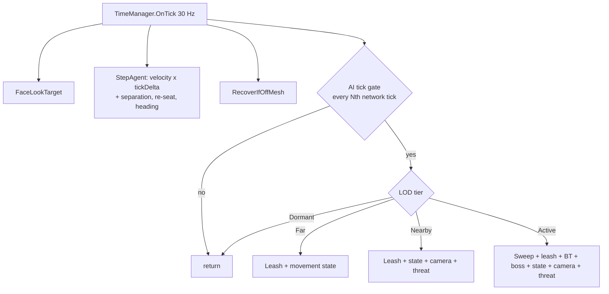

# AI System (NPC & Pet)

**Short description:** Server-authoritative NPC brain — a tick-driven state machine over data-defined archetypes, with a shared combat decision core, threat tracking, tick-stepped NavMesh movement with stuck and off-mesh recovery, multi-attacker spacing and separation, and distance-based level of detail.

## Table of Contents

- [Overview](#overview)
- [Supported Platforms](#supported-platforms)
- [Features](#features)
- [Prerequisites](#prerequisites)
- [Installation / Build](#installation--build)
- [Quick Start Guide](#quick-start-guide)
- [Configuration](#configuration)
- [Usage Examples](#usage-examples)
- [Operational Checks](#operational-checks)
- [Flow Diagram](#flow-diagram)
- [Project Structure](#project-structure)
- [License](#license)

## Overview

Every NPC and pet is driven by one `AIController`, which runs a `BaseAIState` machine on the FishNet `TimeManager` tick. The controller is server-only — it disables itself on any peer that is not running a server.

The system is layered so that **archetypes are data, not code**:

| Layer | Responsibility |
|---|---|
| `AIArchetypeTemplate` | One asset that is a whole brain: which states, which personality, which threat tuning, which LOD profile. The only AI wiring a prefab carries. |
| `BaseAIState` machine | Execution. What the NPC is doing right now. |
| `AICombatDecision` | A pure function over plain floats that every attacking state shares. |
| `AICombatPersonality` | Ability preferences, flee threshold, targeting mode. |
| `AIAbilityRotation` | Optional condition-driven ability selection, evaluated before the default scorer. |
| `AIBehaviorTree` | Optional decision layer above the state machine, for scripted and boss encounters. |
| `AggressionController` | Threat table, vulnerability scoring and target selection. |
| `AIStateClock` | Schedules each state's updates and reports the real interval one covers. |
| `AIAbilityReach` / `AIKiteBudget` / `AISeparation` | Pure helpers the combat and movement paths lean on — how far an ability really hits, how long an NPC may kite, and how bodies push apart. |

Melee, archer, caster, healer, defender and rogue behaviour all fall out of four serialized numbers fed into the shared decision — `PreferredDistance`, `MinComfortDistance`, `EmergencyRetreatThreshold`, and the controller's personality. A designer builds a new archetype by creating an asset, not by writing a class. Only three archetypes carry code, because they need something the numbers cannot express: healers scan for injured allies, defenders body-block for one, and rogues open from a target's rear arc.

Because the decision is a pure function over plain floats, an archetype's behaviour is directly assertable in an EditMode test — a "pathetic" critter can be proven to flee where a "raging" one does not, without a scene.

## Supported Platforms

| Platform | Supported | Notes |
|---|---|---|
| Windows | Yes | Server-authoritative; the controller disables itself on clients |
| Linux | Yes | Server-authoritative |
| WebGL | N/A | Server-only system |

- **Unity Version:** Unity 6.3 LTS
- **Scripting Backend:** IL2CPP

## Features

### Timing

- **Tick-driven, not frame-driven.** The brain runs on `TimeManager.OnTick`, the same fixed 30 Hz clock as prediction, cooldowns and ability activation. `AiTickRate` (default 8 Hz) is rounded to a whole divisor of the network tick so the brain is phase-locked and never drifts. `EffectiveAiTickRate` reports what a requested rate resolved to.
- **Exact deltas.** Elapsed time per AI tick is computed from the fixed tick rate, not measured from a variable frame. There is no drift to correct and no spike to clamp.
- **Facing runs on the network tick**, matching the `NetworkTransform` send rate — faster is work nobody sees, slower makes an NPC's head snap between orientations while its position interpolates smoothly. Smoothing is `1 - e^(-rate * dt)`, which is identical at any step size.
- **Deterministic stagger.** NPCs are spread across the tick interval by a monotonic AI tick index, so the spread is identical on a server running at 200 FPS and one at 30.
- **A state is handed the interval it actually covers.** A state asks to be updated every `updateRate` seconds while the brain ticks far more often; `AIStateClock` accumulates the ticks in between and reports the real elapsed time as `AIController.StateDeltaTime`. Every timer a state advances — attack pacing, unreachable-target patience, retreat — reads `StateDeltaTime`, not `LastAiDeltaTime`. Fed the brain's tick delta instead, a 1.2 s attack cooldown took ten seconds of wall clock.

### Level of detail

- Four tiers by distance to the nearest player observer, each with its own update interval in AI ticks: **Active** (full pipeline), **Nearby** (no behaviour tree, no boss script, no proactive sweep — combat still works, entry is event-driven), **Far** (movement only, combat disengages), **Dormant** (wake-up check only).
- Three profiles ship: `Standard AI LOD`, `Dense Population AI LOD`, `Companion AI LOD` (pets stay responsive — they are always beside the player and always on screen).
- **Distance is measured, not inferred from the observer set.** `TryGetNearestPlayerSqrDistance` asks `ObserverStreamingRegistry` how far the nearest viewer is; `ResolveLodTier` treats an unanswered measurement as `Active`, because an unanswered question is not permission to suspend a brain.
- The out-of-combat enemy sweep gates on `AIController.HasNearbyPlayer`, **not** `Observers.Count`. The observer set is a bandwidth budget, so a monster evicted from every viewer's budget had no observers, stopped sweeping entirely and could not aggro the player standing in front of it.
- The leash reset a Far transition performs — interrupt, full heal, threat clear, boss phase reset — re-asks proximity itself (`AllowsLeashReset`) rather than trusting the tier that triggered it. A tier says how much work to do; only distance says whether a fight is really over.

### Combat

- One `BaseAttackingState` shared by every archetype, plus `HealerAttackingState`, `DefenderAttackingState` and `RogueAttackingState` where behaviour cannot be expressed as tuning.
- **Range hysteresis.** An NPC already attacking tolerates a target drifting 10% past its ability range before giving chase. Without it a strafing target flips the NPC between Attack and CloseDistance every tick, toggling `isStopped` and making it shudder in place.
- **Combat slots.** Several attackers on one target claim distinct angular slots around it rather than all pathing to the same point. Ring capacity is derived from geometry — how many agents of a given radius fit on a circle — and overflow attackers form a staggered second rank.
- **Reach, not `Ability.Range`.** `Ability.Range` is `Speed × LifeTime` — how far a projectile travels — so every ability whose object does not travel (a punch spawned in front of the caster, a held ball of flame, a self buff) reports zero, and the planner read that zero as "cannot reach": a melee orc walked up to its target and stood there, a caster held its archetype's distance and never cast. `AIAbilityReach.Resolve` falls back to geometry — caster radius + twice the ability object's half-extent + `REACH_SLACK`, floored at `MIN_REACH`, or `DEFAULT_TARGETED_REACH` (20 m) for an object spawned on the target. Half-extents come from the collider's shape via `AbilityPrefabColliderCache.ResolveShapeHalfExtents`, because a prefab **asset**'s `bounds` are empty. Issue #220.
- **Spacing is fitted to the kit the NPC really has.** `AICombatDecision.ResolveSpacing` caps `PreferredDistance` at `AIController.MaxOffensiveReach` and drops a `MinComfortDistance` at or beyond that reach: backing away to a range you cannot hit from is not kiting. The state asset's spacing is a hope, not a fact — the Caster archetype prefers 22 m and an orc mage using it may know one ability that reaches 1.25 m. An NPC that knows no abilities keeps its spacing as authored.
- **Kiting is budgeted.** `AIKiteBudget` drains while the NPC backs away; once spent, both the panic radius and the comfort band are suspended for `KiteRecoverySeconds` and the NPC stands and fights, then the budget refills (standing still refunds at `REFUND_RATE`, half rate). Backing away also runs at `KiteSpeedMultiplier` of run speed so a pursuing player gains ground. Unbounded and at player run speed, a kiting caster was a fight nobody could close.
- **A refused activation is not a pacing event.** `ActivateAbility` arms the `AttackCooldown` timer only when `IAbilityController.Activate` actually queued something, so a refusal is retried on the next brain tick rather than leaving the NPC standing next to its target waiting out a cooldown for an attack it never made.
- **Target identity is the character ID, not the Transform.** A pooled `NetworkObject` keeps its Transform and components across occupants, so when a target despawned and its object was re-issued to somebody else the cached Transform still compared equal and every null/active/alive check passed — the NPC silently continued its attack on a character that never engaged it. `AIController.Target` returns null once the ID recorded at target time stops matching.
- **The sweep sees whole bodies.** Overlap results resolve through `TargetOrdering.ResolveHitKey`, so a character whose hitbox hangs off a child transform is detectable at all (a bare `GetComponent` on the collider found no `ICharacter`, making such a character invisible to every NPC while remaining able to attack them) and a multi-collider character is counted once. Query buffers regrow through `TargetOrdering.TryGrowQueryBuffer` until a query stops coming back full — a fixed buffer let the physics broadphase pick an arbitrary, run-varying subset of a large fight. Corpses are filtered out by `AITargetSelection.IsValidTarget`; the healer's ally scan does all of the same.
- **Death is a full stop.** `NPC.Despawn` disables the brain and calls `AIController.HaltMovement`, which clears the path, drops the target and look target, empties the threat table and releases the combat slot. Without it a corpse held its ring slot around its victim for the whole of its decay, and the pooled object came back still walking toward wherever the previous occupant's killer had stood.
- **Unreachable-target break-off.** A target standing somewhere the NPC cannot path to produces a partial path; the NPC gives up after `UnreachableTargetTimeout` and drops that target's threat so the next sweep does not immediately re-acquire it.
- **Abilities classify themselves.** An archetype never names the abilities it should use. `AIAbilityClassifier` reads the ECA actions attached to an ability and derives what it does — heal, damage, control, dispel, taunt — so a healer archetype works on any creature whose spellbook contains a heal, and picks up one added later without being edited.
- Personality styles: Balanced, Aggressive, Defensive, Cautious, Berserker, **Pathetic**, **Determined**, **Rampaging**. A Pathetic personality is guaranteed a retreat threshold even if the field is left at zero; fearless styles ignore one entirely.
- Targeting modes: Threat, Random, Weakest, Nearest. Rampaging forces Random and re-rolls onto a new victim mid-fight, so it cannot be held by threat or by a taunt.

### Movement

- **The agent simulates; the tick moves the body.** `updatePosition` and `updateRotation` are off. `StepAgent` advances the transform by `velocity × tickDelta` once per network tick, re-seats `Agent.nextPosition` on the result (which projects it back onto the mesh, so y follows the ground), and turns the heading toward the velocity at the agent's `angularSpeed` unless a `LookTarget` owns the facing. The displacement a `NetworkTransform` samples is therefore identical every tick for a given speed, whatever frame rate the server happened to run at. Off-mesh links are traversed by the agent itself and simply followed.
- **Separation replaces crowd avoidance.** `obstacleAvoidanceType` is `NoObstacleAvoidance` on every NPC agent, because Unity's crowd is one global simulation and a scene server stacks instances of the same world scene at the same coordinates — an NPC in one instance steered around NPCs in every other. `AISeparation.Resolve` takes its place: neighbours come from the NPC's own `PhysicsScene`, so the push is scene-scoped by construction, and it moves the body without turning it. Attackers around a target are spaced by `AICombatSlots`; separation covers the wander, idle and approach cases the ring does not.
- **Stuck detection reads the displacement that was applied**, not `NavMeshAgent.velocity`. With avoidance off nothing ever blocks the simulated velocity, so it could not tell a walking NPC from one whose every step the NavMesh projection clamped back to the same point.
- **Off-mesh recovery.** A failed `WarpTo` (a spawn point with no mesh in reach) or the mesh going away underneath an agent (a stacked scene instance unloading its copy of the `NavMeshData`) leaves `isOnNavMesh` false for good, and every guard then reads `AgentIsUsable` as false — an NPC frozen mid-stride until the pool recycles it. `RecoverIfOffMesh` re-seats it where it stands, then at `Home`, once per `OFF_MESH_RESEAT_INTERVAL` (1 s), warning once per episode rather than once a second.
- Every warp mirrors the agent's position onto the transform (`SyncTransformToAgent`); with `updatePosition` off nothing else does, and the `NetworkTransform` would keep sending the old spot until the next tick's step.
- Destination requests report what actually happened: `Complete`, `Partial`, `Failed` or `Throttled`. Unity does not fail a path to an unreachable destination — it silently returns the closest reachable point — so callers need to tell those apart.
- `HasArrived` requires a complete path to exist. An agent whose destination never took reports zero remaining distance and no pending path, which the naive test reads as "arrived".
- NavMesh sampling widens on retry rather than silently doing nothing.
- **Stuck detection and escalating recovery**: re-sample and repath first, warp only after the NPC has visibly failed to walk out. Every combat manoeuvre is time-bounded so it can give up.
- `WarpTo` is used on spawn and pool reuse, because a recycled NPC's agent still believes it is where the previous occupant died.

### Pets

- A pet's `Home` **is its owner** — the property resolves to the owner's live position, so every leash check, wander radius and return-home destination tracks them automatically. A Stay order pins it to the held position instead.
- Pet-specific combat rules live in `BaseAttackingState`, not a subclass, so a pet healer, defender or rogue behaves like a pet without inheriting from the wrong place.
- Follow uses a hysteresis band, a distance leash, and a time-based stuck teleport — a pet jammed behind a crate five metres from its owner never trips a distance check.

### Threat

- `AggressionDispatcher` takes **one** global subscription for the process. Damage dispatches by dictionary lookup on the defender — O(1) regardless of NPC count. Previously every NPC subscribed individually, so one sword swing invoked one delegate per NPC alive.
- **A pet and its owner share threat.** `Pet.PetOwner` declares the pair to the dispatcher (`LinkPet`/`UnlinkPet`), and a hit on either is delivered as threat to both — hit the owner and the pet engages, hit the pet and the owner engages (an NPC owner through its own aggression state). Keyed on characters, so an NPC given a pet gets the rule with no further wiring. The attacker is never a sharer, so an owner hitting its own pet generates nothing. Credit runs the other way as well: a pet's hit is recorded against its owner too, for the full amount, so an NPC struck by a summon hates the summoner and a player cannot shed threat by cycling pets.
- Threat decay and staleness share a single tick-advanced `Clock`, so expiry means "this many seconds of AI time without an event" rather than wall-clock time that disagreed with the decay whenever LOD throttled the NPC.
- **Target choice is by threat *score*, not raw points.** `AggressionController.GetThreatScore` scales an entry's points by `VulnerabilityMultiplier` — `LowHealthThreatMultiplier` below `LowHealthThreshold`, `LowResourceThreatMultiplier` below `LowResourceThreshold`, compounding. Anything meaning to move a character up or down the order has to reason in that space.
- `ApplyTauntAction` and `ApplyThreatAction` are ECA actions that let abilities generate threat: a taunt guarantees top threat rather than adding a flat bonus a long fight has already outgrown. It gets there by clearing `highestRaw × AggressionController.MaximumVulnerabilityMultiplier` — the table stores raw points and holds no character references, so it cannot compute another entry's score, but that product bounds every actual score. Comparing raw points, as it used to, made the "guarantee" not one.
- `AggressionDispatcher.TryFindHighestThreatAgainst` scans the registered tables for the NPC that hates a given character most. A click-time query, not a tick-time one — it backs the pet attack command's highest-threat step.

### Behaviour trees

- Optional layer above the state machine, edited visually via `FishMMO > Behavior Tree Editor` or the Open button on a tree in the FishMMO Dashboard.
- The editor refuses connections that would make a tree cyclic, and the runtime carries a depth guard so a hand-edited or badly-merged asset degrades to a failed evaluation instead of a stack overflow that terminates the server process.

## Prerequisites

- **Unity 6.3 LTS**
- **Unity AI Navigation** — `NavMeshAgent`, `NavMesh`
- **FishNetworking** — `NetworkBehaviour`, `TimeManager`, object pooling
- **FishMMO Shared Core** — `ICharacter`, `IAIController`, `IAbilityController`, `ICooldownController`, `ICharacterDamageController`, `IFactionController`

## Installation / Build

Integrated module within the FishMMO Shared assembly. No separate installation.

An NPC prefab requires `AIController`, `CharacterPredictionController`, `AbilityController`, `CooldownController`, `TargetController` and `EnablePrediction` on its `NetworkObject`. `NPC`'s `RequireComponent` attributes add the components automatically; `FishMMO > AI > Repair NPC Prefabs For Combat` migrates existing prefabs and enables prediction. The `TargetController` is not cosmetic: `AbilityController` resolves every cast's target through it, and a caster without one completes the cast, starts the cooldown and spawns nothing (issue #232).

## Quick Start Guide

The fastest route is the dashboard: `FishMMO > FishMMO Dashboard > NPCs > +` opens a form pre-filled from the selected NPC — name, folder, race, archetype, attribute databases, loot, abilities and interactable role — and `Create NPC` clones a working prefab, writes those fields onto it, registers it with Addressables and selects it. The steps below are what that form does, for when a piece has to be authored first.

1. Create an archetype: `FishMMO > Character > NPC > AI > Archetype`, or start from one of the 17 shipped assets under `Assets/Templates/Entity/NPCs/AI/Archetypes/` (10 enemy, 6 pet, 1 civilian).
2. Assign it to `AIController.Archetype` on the NPC prefab. That is the whole AI setup: the controller reads every state, the personality, the rotation, the LOD profile and the threat tuning from the archetype. There is no per-prefab slot to fill or override — a creature that needs one thing different gets its own archetype, so two NPCs naming the same archetype always behave the same.
3. Populate `NPC.Abilities` with `AbilityTemplate`s — **an NPC with no abilities will chase its target and never strike**.
4. Run `FishMMO > AI > Audit NPC Prefabs` to confirm the prefab is wired for combat.
5. Run `FishMMO > AI > Validate Archetypes` to confirm the archetype is internally consistent.

## Configuration

### AIController

| Field | Default | Purpose |
|---|---|---|
| `Archetype` | `null` | The whole brain; every state and tuning value is read from it. Required |
| `BossScript` | `null` | Optional phased encounter script. Per prefab, not per archetype, because it describes one encounter |
| `AiTickRate` | `8` | Brain updates per second; 5–10 is the useful band |
| `TurnRate` | `8` | Facing smoothing rate; higher is snappier |
| `RepathInterval` | `0.5` | Minimum seconds between throttled `SetDestination` calls |
| `StuckTimeout` | `2.5` | Seconds of no progress before the NPC counts as stuck |
| `StuckWarpTimeout` | `8.0` | Seconds stuck before it is warped free; 0 disables |
| `SeparationRadius` | `0` | Distance at which another NPC body starts pushing this one away; 0 = twice the agent radius |
| `SeparationSpeed` | `1.0` | Push speed when fully overlapped, m/s; 0 disables separation |

`Archetype` is the only serialized state slot. `InitialState`, `IdleState`, `AttackingState`, `Personality`, `AbilityRotation`, `BehaviorTree`, `LodSettings`, `EnemySweepRate` and `AvoidancePriority` are read-only properties that read straight through to it (or to a boss phase's override, where one is in force).

### AIArchetypeTemplate

| Field | Default | Purpose |
|---|---|---|
| `InitialState` / `IdleState` / `AttackingState` | `null` | Core states. Initial and idle are required; a civilian archetype leaves attacking empty |
| `WanderState` / `PatrolState` / `ReturnHomeState` / `RetreatState` / `DeadState` | `null` | Optional movement, leash, flee and death states |
| `Personality` | `null` | `AICombatPersonality`: ability weights, flee threshold, targeting mode |
| `AbilityRotation` / `BehaviorTree` | `null` | Optional decision layers above the scorer and the state machine |
| `LodSettings` | `null` | Distance throttling profile; null means always Active |
| `EnemySweepRate` | `1.5` | Seconds between out-of-combat hostile sweeps |
| `AvoidancePriority` | `Medium` | NavMeshAgent avoidance priority |
| `AggressionDamageWeight` | `1.0` | Threat per point of damage taken |
| `AggressionHealingWeight` | `0.6` | Threat per point of healing witnessed |
| `AggressionHitBonus` | `5.0` | Flat threat per hit |
| `AggressionDecayRate` | `3.0` | Threat lost per second |
| `AggressionStaleTimeout` | `30.0` | Seconds before a drained entry is forgotten |
| `AggressionVarietyChance` | `0.15` | Chance of picking the second-highest threat |

Assigning a different archetype to an initialised controller — a spawner's `ArchetypeOverride`, a harness clone — takes effect immediately: `ApplyArchetypeTuning` retunes the threat table and re-applies the avoidance priority, and every state is read live. The archetype the prefab was authored with is captured on first initialisation and restored by `ResetState`, so a spawner override does not ride a recycled instance into the next spawner.

Boss phases call `AIController.SetPhaseOverrides`, which puts the phase's attacking state, behaviour tree and ability rotation *in front of* the archetype's slots rather than writing into the shared asset; a slot the phase leaves null keeps whatever an earlier phase installed, and `ClearPhaseOverrides` drops them when the script resets or the instance is pooled. There is deliberately no other override layer: `AIArchetypeTemplate.ApplyTo` and its `OverrideThreatTuning` opt-in are gone, and the archetype's threat tuning always applies.

### BaseAttackingState

| Field | Default | Purpose |
|---|---|---|
| `PreferredDistance` | `0` | Working distance; 0 = close to melee reach |
| `MinComfortDistance` | `0` | Distance below which the NPC backs away; 0 = never |
| `EmergencyRetreatThreshold` | `0.5` | Fraction of comfort distance that triggers an interrupt-and-run |
| `AttackCooldown` / `AttackCooldownJitter` | `1.5` / `0.5` | Pacing between activations |
| `TargetReevaluationRate` | `3.0` | Seconds between mid-combat re-targeting |
| `AggressionSwitchThreshold` | `50` | Threat lead required to switch targets |
| `VarietyStates` / `MovementVarietyChance` | `[]` / `0` | Optional positioning manoeuvres |
| `UseCombatSlots` | `true` | Spread multiple attackers into a ring |
| `UnreachableTargetTimeout` | `6.0` | Seconds before breaking off an unreachable target |
| `OwnerLeashRange` | `30` | Pets only: distance from owner before breaking off |
| `KiteBudgetSeconds` | `2.5` | Seconds of backing away allowed per window; 0 = unlimited |
| `KiteRecoverySeconds` | `5.0` | Seconds the NPC holds its ground once the budget is spent |
| `KiteSpeedMultiplier` | `0.8` | Run speed multiplier while backing away |

### AILodSettings

Intervals are counted in **AI ticks**, not frames. At the default 8 Hz brain, the `Standard AI LOD` intervals of 1 / 3 / 10 / 40 give roughly 8 Hz, 2.7 Hz, 0.8 Hz and 0.2 Hz.

## Usage Examples

### Editor tooling

| Menu | Purpose |
|---|---|
| `FishMMO > AI > Repair NPC Prefabs For Combat` | Adds missing ability-pipeline components and enables prediction |
| `FishMMO > AI > Audit NPC Prefabs` | Reports prefabs that cannot fight, and why |
| `FishMMO > AI > Validate Archetypes` | Reports archetypes whose configuration cannot behave as described |
| `FishMMO > AI > Audit Ability Intents` | Reports what the AI derives each ability template to do |
| `FishMMO > AI > Organize AI Assets` | Files every AI asset into the canonical folder layout |
| `FishMMO > AI > Re-serialize AI Assets` | Writes newly added serialized fields into the asset YAML |
| `FishMMO > Behavior Tree Editor` | Visual behaviour tree graph editor |
| `FishMMO > Validate Network Timing` | Confirms every scene agrees on tick rate |

### How an NPC chooses an ability

Ability selection has two questions, asked in order.

**What can this ability do?** `AIAbilityClassifier` walks the ability template's five ECA event
lists, follows each event's conditions-met and conditions-not-met action lists, and turns the action
types it finds into `AIAbilityIntent` flags:

| ECA action | Intent |
|---|---|
| `ApplyDamageAction` | `Damage` |
| `ApplyHealAction` | `Heal` |
| `ApplyReviveAction` | `Revive` |
| `ApplyTauntAction`, `ApplyThreatAction` | `Threat` |
| `InterruptAction`, `KnockbackHitAction` | `Control` |
| `ApplyDispelAction` | `Dispel`, plus `Buff` or `Debuff` by direction |
| `ApplyBuffAction` | depends on the buff template (below) |
| `PetAbilityTemplate` | `Summon` |

Buffs carry no "harmful" flag, so direction is inferred: a state flag `CharacterIncapacitation`
recognises is `Control`; the **sum** of the attribute modifiers gives `Buff` or `Debuff`; the sum of
the resource ticks gives `Heal` or `Damage`. The sum rather than the count, so a plate-armour buff
with a small speed penalty is still a buff. This inference is the one place classification can be
wrong, and `AbilityTemplate.IntentOverride` is the fix when it is — it replaces the derived value
outright. Run `FishMMO > AI > Audit Ability Intents` to see what the AI makes of every ability in
the project.

An ability with no recognisable actions classifies as `None` and stays usable, so content that
predates classification keeps working rather than silently disarming the NPC that knows it.

**How much does this archetype want it?** `AICombatPersonality` carries a weight per intent —
`DamageWeight`, `HealWeight`, `ControlWeight`, `DebuffWeight`, `BuffWeight`, `ThreatWeight` — which
multiplies into the ability's score alongside the existing delivery weights (melee / ranged / AOE /
support). Delivery and purpose are orthogonal and both apply: a crowd controller wants ranged
delivery *and* controlling purpose. An ability carrying several intents takes the strongest matching
weight, not the product, so a compound ability cannot out-score a specialised one on flag count.

The two specialised archetypes use the same classification rather than a list:

- **Healer** — heals are abilities classified `Heal`. Everything else falls through to the damage
  rotation, and the damage rotation excludes anything purely supportive.
- **Defender** — taunts are abilities classified `Threat`, used ahead of anything the scoring picker
  would otherwise choose.

Both still expose their old template-ID list (`HealAbilityTemplateIDs`, `TauntAbilityTemplateIDs`)
as an **override**, for an ability that acts through some route the classifier cannot see. Leave
them empty in the normal case.

Finally, `BaseAttackingState.IsEnemyAbility` keeps the attack rotation honest: an ability that is
purely supportive and aimed at another character is excluded, so an NPC no longer heals the player
it is fighting. A self-cast shield stays in — the NPC aims it at itself — and so does a drain that
damages and heals, because the damage is the point.

### Asset layout

```
Assets/Templates/Entity/NPCs/AI/
├── Archetypes/        # AIArchetypeTemplate — the asset to assign to a prefab
├── Personalities/     # AICombatPersonality
├── States/
│   ├── Attack/        # BaseAttackingState and subclasses
│   ├── Combat/        # Orbit, flank, flee — combat positioning sub-states
│   ├── Movement/      # Idle, wander, patrol, return home
│   └── Pet/           # Pet follow states
├── Rotations/         # AIAbilityRotation
├── Conditions/        # AIAbilityCondition
├── BehaviorTrees/     # AIBehaviorTree
├── BehaviorNodes/     # AIBehaviorNode
├── Boss/              # BossScript
└── LOD/               # AILodSettings
```

### Shipped archetypes

**Enemy** — Melee, Brute, Pathetic Critter, Raging Beast, Archer, Caster, Crowd Controller, Healer, Defender, Rogue.
**Pet** — Melee, Archer, Caster, Healer, Defender, Rogue.

### Combat sub-states and `KeepsCombatTarget`

A state entered mid-fight for positioning (orbit, flank, flee) must have `KeepsCombatTarget` enabled. `BaseAttackingState.Exit` clears the combat target and interrupts the cast, which is correct on a disengage and catastrophic on a manoeuvre — the sub-state is handed a null target and bails straight to idle, silently ending the fight. `Validate` reports any variety or retreat state missing the flag.

## Operational Checks

| Check | How to Verify |
|---|---|
| Brain is ticking | `AIController.EffectiveAiTickRate` reports the resolved rate; at 30 Hz network tick and 8 Hz requested it is 7.5 |
| Archetype applied | `AIController.InitialState` and the other state properties resolve to the archetype's assets; a prefab with no archetype is reported by `Audit NPC Prefabs` and by the `EveryNPCPrefab_NamesAnArchetype` EditMode test |
| NPC can fight | `FishMMO > AI > Audit NPC Prefabs` reports no problems |
| Archetypes valid | `FishMMO > AI > Validate Archetypes` reports all valid |
| LOD engaged | Move a player away from an NPC; its update rate should drop through Nearby, Far and Dormant |
| Threat dispatch | Damage an NPC and confirm only that NPC's threat table changes |
| Ability intents | `FishMMO > AI > Audit Ability Intents` reads each ability the way it was authored |
| Taunt | Attach `ApplyTauntAction` to an ability's on-hit event; confirm the target switches to the taunter and stays |
| Multi-attacker spacing | Pull three or more melee NPCs onto one target; they should form a ring, not a scrum |
| Pet follow | Run a player through doorways and around props; the pet should keep up without wedging |
| Pet stance | Passive never engages, Defensive answers an attack on the owner, Aggressive hunts |
| Stuck recovery | Wedge an NPC against geometry; it should repath, then warp free after `StuckWarpTimeout` |
| Off-mesh recovery | Spawn an NPC away from any NavMesh; it re-seats within a second, or warns once naming the position |
| Attack pacing | `AttackCooldown` should elapse in wall-clock seconds, not brain ticks — `StateDeltaTime`, not `LastAiDeltaTime` |
| Kiting terminates | Chase a caster on foot; it backs away for `KiteBudgetSeconds`, then stands and fights for `KiteRecoverySeconds` |
| Reach on static abilities | An NPC whose only ability does not travel should close and strike, not stand at its archetype's preferred distance |
| Behaviour tree cycle safety | Connect a node to its own ancestor in the editor; the connection is refused |

## Flow Diagram

### Tick pipeline



### Combat decision

```
BaseAttackingState.UpdateState
│
├─ 1. Tick attack pacing timer
├─ 2. Pet leash check (Home tracks the owner)
├─ 3. Target lost or dead?  → sweep for a new one, else OnCombatEnded
├─ 4. TryAttack
│      ├─ Activation in progress? → hold and auto-release charged abilities
│      ├─ Roll for a movement-variety manoeuvre
│      ├─ PickAbility (rotation → personality-weighted scorer)
│      ├─ BuildContext (distance, reach, fitted spacing, health,
│      │                personality, was-attacking, kite exhausted)
│      ├─ AICombatDecision.Plan → intent
│      ├─ Charge the kite budget, set agent speed
│      └─ ExecutePlan
│           ├─ Flee              → RetreatState
│           ├─ EmergencyRetreat  → interrupt, break away
│           ├─ BackAway          → retreat, optionally firing on the way out
│           ├─ Attack            → stop and activate
│           ├─ CloseDistance     → move to a claimed combat slot
│           └─ HoldPosition      → stand and wait
└─ 5. ReevaluateTarget (threat lead, or rampage re-roll)
```

### Movement outcome

```
TryMoveTo(destination)
│
├─ Agent unusable      → Failed
├─ Repath throttled    → Throttled
├─ NavMesh sample fails (widening retries) → Failed
├─ Path is partial     → Partial   (destination unreachable; do NOT treat stopping as arriving)
└─ Path is complete    → Complete

GetMovementProgress(dt)
│
├─ Stopped / no path            → Idle
├─ Path pending                 → Computing
├─ Complete path within tolerance → Arrived
├─ Wants to move but is not,
│  or stranded on a partial path → Stuck (after StuckTimeout)
└─ otherwise                    → Moving
```

## Project Structure

```
AI/
├── AIController.cs                # Brain: tick pipeline, state machine, LOD, threat wiring
├── AIController.Movement.cs       # Destination requests, arrival, stuck detection and recovery
├── AIArchetypeTemplate.cs         # One asset = one complete brain, plus Validate()
├── AICombatPersonality.cs         # Styles, ability weights, flee threshold, targeting mode
├── AITargetingMode.cs
├── AIAbilityRotation.cs           # Condition-driven ability selection
├── AILodSettings.cs               # Distance tiers and per-tier tick intervals
├── AggressionController.cs        # Threat table, tick-advanced clock, target scoring
├── AggressionState.cs             # Per-NPC threat state and combat-entry event
├── AggressionDispatcher.cs        # One global subscription; O(1) damage routing
├── AggressionEntry.cs
├── AgentAvoidancePriority.cs
├── PackTactic.cs
├── AIUtility.cs
├── Combat/
│   ├── AIAbilityClassifier.cs     # Derives what an ability does from its ECA actions
│   ├── AIAbilityIntent.cs         # Heal / Damage / Control / Dispel / Threat flags
│   ├── AIAbilityReach.cs          # How far an ability really hits from; Range is 0 for anything static
│   ├── AICombatDecision.cs        # The shared, Unity-free combat decision, plus ResolveSpacing
│   ├── AICombatIntent.cs
│   ├── AICombatSlots.cs           # Ring slotting so attackers do not converge on one point
│   ├── AIKiteBudget.cs            # Per-NPC kiting allowance and recovery hold
│   ├── AIMovementResult.cs
│   ├── AISeparation.cs            # Scene-scoped body separation, in place of crowd avoidance
│   ├── AIStateClock.cs            # Per-state update scheduling and the interval each update covers
│   └── AITargetSelection.cs       # Random / weakest / nearest picking, and target validity
├── States/
│   ├── BaseAttackingState.cs      # The one attacking state; archetypes are its tuning
│   ├── MeleeAttackingState.cs     # Preset
│   ├── RangedAttackingState.cs    # Preset
│   ├── CasterAttackingState.cs    # Preset
│   ├── PetAttackingState.cs       # Preset
│   ├── HealerAttackingState.cs    # Scans for injured allies
│   ├── DefenderAttackingState.cs  # Taunts and body-blocks
│   ├── RogueAttackingState.cs     # Opens from the target's rear arc
│   ├── PetIdleState.cs            # Pet follow, stance engagement, stuck escape
│   ├── IdleState.cs / WanderState.cs / PatrolState.cs / ReturnHomeState.cs
│   └── OrbitState.cs / GetBehindState.cs / RetreatState.cs
├── Conditions/                    # AIAbilityCondition subclasses
├── BehaviorTree/                  # Tree, nodes, composites, decorators
├── Boss/                          # Phases and timed mechanics
└── Group/                         # NPCGroup, roles, pack tactics
```

### Related

- ECA actions: `Entity/ECA/Actions/Character/ApplyTauntAction.cs`, `ApplyThreatAction.cs`
- Ability templates: `Entity/Prediction/Ability/Template/AbilityTemplate.cs` (`IntentOverride`)
- Editor tooling: `Tools/Extensions/Unity/Editor/AI/`
- Tests: `Assets/UnitTests/AI/`

## License

This project is subject to the FishMMO project license.
