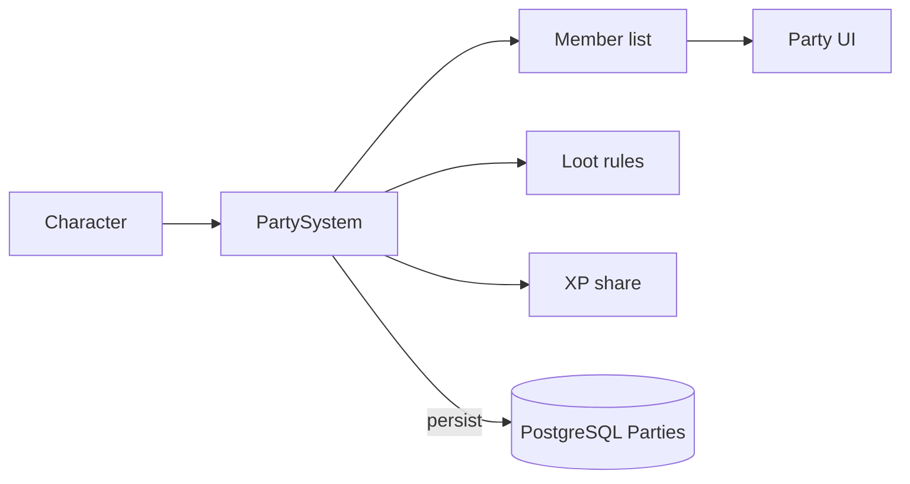

# Party System

**Short description:** A server-authoritative, database-backed framework for managing player parties with cross-server synchronization, rank management, and invitation workflows in FishMMO.

## Table of Contents

- [Overview](#overview)
- [Supported Platforms](#supported-platforms)
- [Features](#features)
- [Prerequisites](#prerequisites)
- [Installation / Build](#installation--build)
- [Quick Start Guide](#quick-start-guide)
- [Configuration](#configuration)
- [Usage Examples](#usage-examples)
- [Operational Checks](#operational-checks)
- [Flow Diagram](#flow-diagram)
- [Project Structure](#project-structure)
- [License](#license)

## Overview

The Party system is a server-authoritative, database-backed framework for managing player parties in FishMMO. It supports party creation, invitation with pending-invite validation, member addition/removal, rank management (leader/member), leadership transfer, and cross-server synchronization via database polling. Game logic and broadcasts run synchronously on the main thread, while database operations are performed asynchronously and marshalled back via a main-thread queue.

## Supported Platforms

| Platform | Status | Notes |
|----------|--------|-------|
| Windows  | ✅ Supported | Primary development platform |
| Linux    | ✅ Supported | Server and client builds |
| WebGL    | ✅ Supported | Via Unity WebGL export |

Built with **Unity 6.3 LTS** using **IL2CPP** scripting backend.

## Features

- **Party creation** with automatic leader assignment
- **Invitation system** with pending-invite validation and duplicate-invite prevention
- **Member addition/removal** with server-side authority
- **Rank management** — Leader and Member ranks with leadership transfer
- **Cross-server synchronization** via periodic database polling
- **Async worker pattern** — Database operations are fire-and-forget via `EnqueueAsyncWork()`
- **Main-thread marshalling** — Async DB results queued via `EnqueueMainThread()` and drained each frame in `OnLateUpdate()`
- **Optimistic concurrency** — Version-based writes (`Version + 1`) to prevent conflicts
- **Chat command integration** — `/pi` and `/invite` commands for party invitations
- **Health tracking** — Per-member health percentage for party UI
- **Character connect/disconnect handling** — Automatic party tracker updates and DB persistence

## Prerequisites

- Unity 6.3 LTS
- FishNetworking (FishNet)
- FishMMO Shared Core

## Installation / Build

This system is an integrated module of the FishMMO Unity project. No separate installation is required.

## Quick Start Guide

1. **Create a party** — A player sends a `PartyCreateBroadcast` (or triggers it via UI). The server validates the player is not already in a party, creates the party in the database, and assigns the player as Leader.
2. **Invite members** — The leader uses the `/pi <name>` or `/invite <name>` chat command, or sends a `PartyInviteBroadcast`. The server validates rank, capacity, and duplicate invites before forwarding the invitation.
3. **Accept/Decline** — The invited player sends `PartyAcceptInviteBroadcast` or `PartyDeclineInviteBroadcast`. On accept, the server persists membership and notifies all party members.
4. **Leave or kick** — Members send `PartyLeaveBroadcast` to leave. Leaders send `PartyRemoveBroadcast` to kick a member, or `PartyChangeRankBroadcast` to transfer leadership.

## Configuration

| Field            | Type    | Default | Description                                    |
|------------------|---------|---------|------------------------------------------------|
| `MaxPartySize`   | `int`   | 6       | Maximum members allowed in a party             |
| `UpdatePumpRate` | `float` | 1.0     | Seconds between database polling cycles        |

### Party Ranks

```
PartyRank : byte
├── None   = 0   # No party membership
├── Member = 1   # Standard party member
└── Leader = 2   # Party leader with elevated permissions
```

## Usage Examples

### Network Broadcasts

| Broadcast                        | Direction       | Purpose                                          |
|----------------------------------|-----------------|--------------------------------------------------|
| `PartyCreateBroadcast`           | Client → Server | Request to create a new party                    |
| `PartyCreateBroadcast`           | Server → Client | Confirmation of party creation (with ID)         |
| `PartyInviteBroadcast`           | Client → Server | Invite a target character to the party — **leader only**; a non-leader's invite is dropped without a reply |
| `PartyInviteBroadcast`           | Server → Client | Notify target of incoming invitation             |
| `PartyAcceptInviteBroadcast`     | Client → Server | Accept a pending party invitation                |
| `PartyDeclineInviteBroadcast`    | Client → Server | Decline a pending party invitation               |
| `PartyAddBroadcast`              | Server → Client | Notify client of a new party member              |
| `PartyAddMultipleBroadcast`      | Server → Client | Bulk member update (cross-server sync)           |
| `PartyLeaveBroadcast`            | Client → Server | Request to leave the party                       |
| `PartyLeaveBroadcast`            | Server → Client | Confirmation of party leave                      |
| `PartyRemoveBroadcast`           | Client → Server | Leader kicks a member                            |
| `PartyChangeRankBroadcast`       | Client → Server | Leader transfers leadership to another member    |

### Chat Commands

| Command     | Action                                               |
|-------------|------------------------------------------------------|
| `/pi`       | Invite a player to the party (by name)               |
| `/invite`   | Invite a player to the party (by name)               |

### Client Broadcast Handlers

| Broadcast                      | Handler                                          | Action                                                       |
|--------------------------------|--------------------------------------------------|--------------------------------------------------------------|
| `PartyCreateBroadcast`         | `OnClientPartyCreateBroadcastReceived`            | Sets `ID` and `Rank = Leader`, invokes `OnPartyCreated`      |
| `PartyInviteBroadcast`         | `OnClientPartyInviteBroadcastReceived`            | Invokes `OnReceivePartyInvite` with inviter ID               |
| `PartyAddBroadcast`            | `OnClientPartyAddBroadcastReceived`               | Updates local `ID`/`Rank` if self, invokes `OnAddPartyMember`|
| `PartyAddMultipleBroadcast`    | `OnClientPartyAddMultipleBroadcastReceived`       | Validates member set, then processes each add individually   |
| `PartyLeaveBroadcast`          | `OnClientPartyLeaveBroadcastReceived`             | Resets `ID = 0`, `Rank = None`, invokes `OnLeaveParty`       |
| `PartyRemoveBroadcast`         | `OnClientPartyRemoveBroadcastReceived`            | Invokes `OnRemovePartyMember` with member ID                 |

### IPartyController Interface

| Member                   | Type                                    | Description                                      |
|--------------------------|-----------------------------------------|--------------------------------------------------|
| `ID`                     | `long`                                  | The party ID (0 = not in a party)                |
| `Rank`                   | `PartyRank`                             | Character's rank within the party                |
| `OnPartyCreated`         | `Action<string>`                        | Fired when a party is successfully created       |
| `OnReceivePartyInvite`   | `Action<long>`                          | Fired when an invite is received (inviter ID)    |
| `OnAddPartyMember`       | `Action<long, PartyRank, float>`        | Fired when a member is added (ID, rank, HP%)     |
| `OnValidatePartyMembers` | `Action<HashSet<long>>`                 | Fired to validate the full member set            |
| `OnRemovePartyMember`    | `Action<long>`                          | Fired when a member is removed                   |
| `OnLeaveParty`           | `Action`                                | Fired when the local character leaves the party  |

### Character Connect/Disconnect

| Event        | Action                                                                          |
|--------------|---------------------------------------------------------------------------------|
| `OnConnect`  | Adds to party tracker, persists member data with current health %               |
| `OnDisconnect` | Removes pending invitations, removes from party tracker, persists party update |

### External Integration Points

- **Character System** — Connect/disconnect events trigger party tracker updates and DB persistence.
- **CharacterAttribute System** — Health percentage (`GetHealthResourceAttributeCurrentPercentage()`) is tracked per member for party UI.
- **Chat System** — Party invite chat commands (`/pi`, `/invite`) are registered via `ChatHelper`.
- **Faction System** — Party members share faction context for allied behavior.
- **UI System** — Events (`OnAddPartyMember`, `OnRemovePartyMember`, etc.) drive party frames, health bars, and invite dialogs.
- **Database Layer** — Persists/loads via `IPartyService`, `ICharacterPartyService`, `IPartyUpdateService` with `CharacterPartyData` and `PartyUpdateData` DTOs.
- **Scene System** — Party tracker maps which members are on this scene server for local broadcasts.
- **Periodic Update System** — Registers periodic callback for cross-server DB polling.

## Operational Checks

| Check | How to Verify | Expected Result |
|-------|---------------|-----------------|
| Party creation | Send `PartyCreateBroadcast` as a player not in a party | `PartyCreateBroadcast` returned with party ID; player rank set to Leader |
| Invitation flow | Leader sends `/invite <name>` | Target receives `PartyInviteBroadcast`; pending invite stored on server |
| Accept invite | Target sends `PartyAcceptInviteBroadcast` | Membership persisted; `PartyAddBroadcast` sent to all party members |
| Decline invite | Target sends `PartyDeclineInviteBroadcast` | Pending invitation removed; no membership change |
| Leave party | Member sends `PartyLeaveBroadcast` | Member removed; if leader left, leadership transferred to random member |
| Kick member | Leader sends `PartyRemoveBroadcast` with target ID | Target removed from DB and party tracker; notified via broadcast |
| Leadership transfer | Leader sends `PartyChangeRankBroadcast` | Old leader demoted to Member; target promoted to Leader |
| Cross-server sync | Members on different scene servers | `FetchAndProcessPartyUpdatesAsync()` polls DB at `UpdatePumpRate`; member lists reconciled |
| Max capacity | Invite when party is full (`MaxPartySize`) | Invitation rejected by server-side capacity check |
| Duplicate invite | Invite same player twice | Second invite rejected; no duplicate pending invitation stored |

## Flow Diagram

### High-Level Overview



### Creation

1. Client sends `PartyCreateBroadcast`.
2. Server validates character is not already in a party.
3. Async: Creates party in DB, persists leader membership.
4. Main thread: Sets `ID` and `Rank = Leader`, broadcasts `PartyCreateBroadcast` to client.

### Invitation

1. Leader sends `PartyInviteBroadcast` (or uses `/pi` / `/invite` chat commands).
2. Server validates: leader rank, party capacity (async DB check), target not already in party, no duplicate pending invite.
3. Stores the pending invitation via `IPartySystemRuntimeData.TryAddPendingInvitation(targetCharacterID, partyID, nowUtc)`.
4. Sends `PartyInviteBroadcast` to target client.

### Accept

1. Target sends `PartyAcceptInviteBroadcast`.
2. Server validates pending invitation exists and removes it.
3. Async: Checks party capacity, persists membership, notifies other servers via `PartyUpdateService`.
4. Main thread: Sets member `ID`/`Rank`, sends `PartyAddBroadcast` to joining client.

### Decline

1. Target sends `PartyDeclineInviteBroadcast`.
2. Server removes the pending invitation.

### Leave

1. Member sends `PartyLeaveBroadcast`.
2. Server immediately resets member's `ID`/`Rank` and sends leave broadcast.
3. Async: If leader left, randomly transfers leadership to a remaining member. Deletes leaving member from DB. If no members remain, deletes the party entirely.

### Remove (Kick)

1. Leader sends `PartyRemoveBroadcast` with target member ID.
2. Server validates leader rank, target is in the same party, and leader is not kicking themselves.
3. Async: Fetches target member version, deletes from DB, notifies other servers.

### Rank Change

1. Leader sends `PartyChangeRankBroadcast` with target member ID.
2. Server validates leader rank and target is different from self.
3. Async: Demotes current leader to member, promotes target to leader, notifies other servers.

### Cross-Server Sync

The `FetchAndProcessPartyUpdatesAsync()` method runs on `UpdatePumpRate`:

1. Collects all party IDs tracked on this scene server.
2. Fetches party updates from DB since `LastFetchTime`.
3. For each updated party, fetches current member list.
4. Marshals to main thread:
   - Computes member differences (removed members get `PartyLeaveBroadcast`).
   - Caches current member set in `PartyMemberTracker`.
   - Sends `PartyAddMultipleBroadcast` to all local party members with updated member list.

## Project Structure

### Directory Structure

```
Party/
├── PartyController.cs     # Client-side controller (CharacterBehaviour + broadcast listeners)
└── PartyRank.cs           # Enum defining party ranks (None, Member, Leader)
```

### Related Files (Outside This Directory)

```
Shared/Core/Entity/Party/
└── IPartyController.cs    # Interface for per-character party state and events

Shared/Implementation/Network/Character/
└── PartyBroadcasts.cs     # All party broadcast structs (Create, Invite, Add, Leave, Remove, ChangeRank)

Server/Implementation/World/SceneServer/Party/
├── PartySystem.cs                       # Server-side party logic (ServerBehaviour)
├── PartySystemRuntimeData.cs            # Runtime state container (pending invites, fetch time)
├── PartySystemMainThreadQueueData.cs    # Main-thread action queue for async marshalling
└── PartyCharacterMappingData.cs         # Tracks which party members are on this scene server
```

### Inheritance Hierarchies

#### Controllers (NetworkBehaviour)

```
CharacterBehaviour
└── PartyController : IPartyController
```

#### Server System

```
ServerBehaviour
└── PartySystem : IPartySystem<NetworkConnection>
```

## License

This project is subject to the FishMMO project license.
