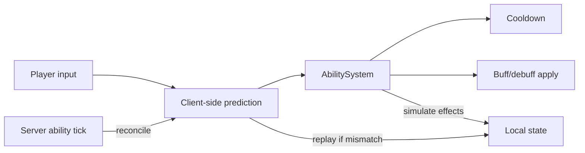

# Ability System

**Short description:** A server-authoritative, template-driven ability framework for FishMMO featuring client-side prediction, ECA event composition, deterministic RNG, and runtime ability crafting.

## Table of Contents
- [Overview](#overview)
- [Supported Platforms](#supported-platforms)
- [Features / Capabilities / Security Features](#features--capabilities--security-features)
- [Prerequisites](#prerequisites)
- [Installation / Build](#installation--build)
- [Quick Start Guides](#quick-start-guides)
- [Configuration](#configuration)
  - [AbilityController](#abilitycontroller)
  - [Template System](#template-system)
  - [Cooldown System](#cooldown-system)
- [Usage Examples](#usage-examples)
  - [Ability (Runtime Instance)](#ability-runtime-instance)
  - [AbilityObject](#abilityobject)
  - [Snapshot System](#snapshot-system)
  - [AbilitySummary (tooltip composition)](#abilitysummary-tooltip-composition)
- [Operational Checks](#operational-checks)
- [Flow Diagram](#flow-diagram)
  - [Ability Lifecycle](#ability-lifecycle)
  - [Network Prediction](#network-prediction)
- [Project Structure](#project-structure)
  - [Directory Structure](#directory-structure)
  - [Inheritance Hierarchies](#inheritance-hierarchies)
  - [Related Files](#related-files)
- [License](#license)

## Overview

The Ability system is a server-authoritative, template-driven framework for abilities in FishMMO. It handles the full ability lifecycle — learning, queuing, activation, spawning, ticking, collision, and destruction — using FishNet's Replicate/Reconcile prediction model with deterministic RNG seeds for mismatch detection. Abilities are composed from ScriptableObject templates and modular Event-Condition-Action (ECA) events that can be combined at runtime through an ability crafting system. The system includes per-ability cooldown tracking, a snapshot mechanism for detached ability objects that outlive their caster, and speed/cast-time reduction via character attributes.

> Note: See the Detailed File-Level Topology in the parent `Prediction/README.md` (`../README.md#detailed-file-level-topology`) for a file-level call/serialization topology and per-file interactions.

## Supported Platforms

| Platform | Status | Notes |
|----------|--------|-------|
| Windows  | ✅ Supported | Primary development platform |
| Linux    | ✅ Supported | Server and client builds |
| WebGL    | ✅ Supported | Via Unity WebGL export |

Built with **Unity 6.3 LTS** using **IL2CPP** scripting backend.

## Features / Capabilities / Security Features

### Features

- **Server-authoritative ability activation** with FishNet Replicate/Reconcile client-side prediction
- **Template-driven design** using ScriptableObject ability templates and modular ECA events
- **Runtime ability crafting** — combine base templates and event modules at runtime
- **Deterministic RNG seeds** for prediction mismatch detection and rollback
- **Full ability lifecycle management** — learning, queuing, activation, spawning, ticking, collision, destruction
- **Tick-based cooldown tracking** with deterministic network-synchronized cooldown state via `CooldownController` (IPredictableController, Order=90)
- **Snapshot system** for detached ability objects that outlive their caster
- **Speed/cast-time reduction** via character attributes (AttackSpeed, CastSpeed, CooldownReduction)
- **Consumable and mount activation** through the same prediction pipeline
- **ECA-based activation conditions** for resource costs, attribute requirements, faction, and archetype checks
- **Multiple spawn targets** — Self, PointBlank, Target, Forward, Camera, Spawner, SpawnerWithCameraRotation
- **Swept hit resolution** — `AbilityObjectSweep` covers the segment travelled each tick with an overlap at the start (a cast cannot see what it begins inside of) plus a cast along the segment, ordered by distance
- **Hit dedupe per object per target** — once per body for the object's whole life, so a stationary field does not drain its hit count into one victim in a fraction of a second
- **Hit count tracking** with automatic destruction on hit count depletion, spent only by the peer that decided the hit
- **Pet ability support** with dedicated PetAbilityTemplate and spawn bounding boxes
- **Predicted selection for every ability shape** — area, cone, line, chain and self-target abilities resolve on the caster's own client through `TargetSelector.ResolvesTargetsLocally`, with two deliberate exceptions (zone-wide selection and pet summons)
- **One tooltip composition** — `AbilitySummary` serves the template tooltip, the learned ability's tooltip, the knowledge panel and the crafting preview, so a preview and the crafted result cannot disagree
- **Ability type overrides** — an `AbilityTypeOverrideEventType` crafted onto an ability replaces its `AbilityType`; `Ability.EffectiveType` is what the grounding check reads

### Security Features

- All ability activations are validated server-side — cooldowns, resource costs, and `CanManipulate()` checks
- Deterministic RNG seeds prevent clients from influencing spawned ability outcomes
- Prediction mismatches trigger rollback, preventing exploits from client-side ability state manipulation
- Hits are resolved only by the server and by the caster's own client; a third-party observer is **told** (`AbilityObjectHitBroadcast`) rather than deciding for itself, because its world is interpolated against its own latency and would invent hits nothing would ever correct
- The observer spawn payload carries no generator state and no owner-only ability internals; `RegisterObservedAbility` refuses to run on the owner at all

## Prerequisites

- **Unity 6.3 LTS** (or compatible version)
- **FishNetworking** with Prediction V2 support (Replicate/Reconcile)
- **FishMMO Shared Core** — interfaces (`IAbilityController`, `IAbilityKnowledgeController`, `ICooldownController`), `CharacterBehaviour`, `CachedScriptableObject`, `IntBitExtensions`
- **FishMMO Character Attribute System** — `CharacterAttributeTemplate`, `CharacterAttributeController` for speed/cooldown reduction

## Installation / Build

The Ability system is an integral part of the **FishMMO Unity project**. There is no separate installation step.

1. Clone or update the FishMMO repository.
2. Open the project in Unity 6.3 LTS.
3. The Ability system is located at `Assets/Scripts/Shared/Implementation/Entity/Prediction/Ability/`.
4. Ensure all FishMMO dependencies (FishNetworking, Shared Core) are present in the project.

## Quick Start Guides

### Learning an Ability

Abilities are learned server-side through the `AbilityController`'s knowledge system:

```csharp
// Learn a base ability template
abilityController.LearnBaseAbility(templateID);

// Learn an ability event
abilityController.LearnAbilityEvent(eventID);

// Check if a character knows a base ability
bool knows = abilityController.KnowsBaseAbility(templateID);
```

### Activating an Ability

Ability activation flows through the Replicate/Reconcile prediction pipeline:

```csharp
// Queue a standard ability activation (client input)
abilityController.Activate(abilityID);

// Queue a consumable activation
abilityController.ActivateConsumable(item);

// Interrupt the current ability
abilityController.Interrupt();

// Release a held ability (charged/channeled)
abilityController.Release();
```

Activation is validated server-side: `CanManipulate()` is checked, cooldowns are verified, and resource costs are validated through ECA `ActivationConditions`.

## Configuration

### AbilityController

The `AbilityController` (`CharacterBehaviour`, `IAbilityController`) manages all ability state for a character. It is split into four **partial classes** for SOLID compliance:

| Partial File                        | Responsibility                                                      |
|-------------------------------------|---------------------------------------------------------------------|
| `AbilityController.cs`              | Core fields, lifecycle (`OnAwake`, `ResetState`), CSP Replicate/Reconcile pipeline |
| `AbilityController.Activation.cs`   | `Activate()`, `Interrupt()`, `Release()`, `ActivateConsumable()`, `CanManipulate()`, ability start/process/spawn/validate/cancel |
| `AbilityController.Knowledge.cs`    | `Learn*()` / `Knows*()` methods, knowledge dictionaries and events  |
| `AbilityController.Networking.cs`   | Client broadcast handlers, `ReadPayload()` / `WritePayload()`       |

#### Input Flags

Local input state is stored in a single `int inputFlags` field using `AbilityActivationFlags` bit positions and manipulated via `IntBitExtensions` (`EnableBit`, `DisableBit`, `IsFlagged`). Each tick, `HandleCharacterInput()` copies `inputFlags` into the replicate data and clears one-shot flags (`Interrupt`, `IsConsumable`, `IsMount`), while persistent flags (`IsHeld`) remain until explicitly released.

#### Consumable Activation

`ActivateConsumable(Item)` queues a consumable through the same Replicate/Reconcile pipeline as normal abilities. It sets the `IsConsumable` flag and stores the consumable template ID as `queuedAbilityID`, ensuring server-authoritative validation and prediction support.

#### Key Fields

| Field                       | Type                          | Description                                      |
|-----------------------------|-------------------------------|--------------------------------------------------|
| `AbilitySpawner`            | `Transform`                   | Spawn point for ability objects (e.g., hand)     |
| `AttackSpeedReductionTemplate` | `CharacterAttributeTemplate` | Attribute for physical speed reduction        |
| `CastSpeedReductionTemplate`   | `CharacterAttributeTemplate` | Attribute for magical speed reduction         |
| `CooldownReductionTemplate`    | `CharacterAttributeTemplate` | Attribute for cooldown reduction              |
| `BloodResourceConversionTemplate` | `AbilityEvent`            | Event template for health-to-mana conversion  |
| `ChargedTemplate`           | `AbilityEvent`                | Event template for charged abilities             |
| `ChanneledTemplate`         | `AbilityEvent`                | Event template for channeled abilities           |

#### Knowledge System (`IAbilityKnowledgeController`)

The controller tracks what the character has learned:

| Property                     | Type               | Description                              |
|------------------------------|--------------------|------------------------------------------|
| `KnownAbilities`             | `Dictionary<long, Ability>` | All crafted/learned ability instances |
| `KnownBaseAbilities`         | `HashSet<int>`     | Known base template IDs                  |
| `KnownAbilityEvents`         | `HashSet<int>`     | Known event template IDs                 |
| `KnownAbilityOnTickEvents`   | `HashSet<int>`     | Known OnTick event IDs                   |
| `KnownAbilityOnHitEvents`    | `HashSet<int>`     | Known OnHit event IDs                    |
| `KnownAbilityOnPreSpawnEvents` | `HashSet<int>`   | Known OnPreSpawn event IDs               |
| `KnownAbilityOnSpawnEvents`  | `HashSet<int>`     | Known OnSpawn event IDs                  |
| `KnownAbilityOnDestroyEvents`| `HashSet<int>`     | Known OnDestroy event IDs                |

#### Events

| Event                | Signature                          | Description                        |
|----------------------|------------------------------------|------------------------------------|
| `OnCanManipulate`    | `Func<bool>`                       | Checked before activation (e.g., not stunned) — an add/remove pair over `canManipulateHandlers` |
| `OnUpdate`           | `Action<string, float, float>`     | UI cast bar updates                |
| `OnInterrupt`        | `Action`                           | Current ability interrupted        |
| `OnCancel`           | `Action`                           | Current ability cancelled          |
| `OnReset`            | `Action`                           | Ability UI reset                   |
| `OnPredictionMismatch` | `Action<uint>`                   | Owner-only: the reconcile for that tick disagreed with the recorded prediction |
| `OnAbilityDenied`    | `Action<long>`                     | Owner-only: the server refused that ability id (driven by the `Denied` flag, not by a seed mismatch) |
| `OnAddAbility`       | `Action<Ability>`                  | New crafted ability learned        |
| `OnRemoveAbility`    | `Action<long>`                     | A known ability was removed        |
| `OnAddKnownAbility`  | `Action<BaseAbilityTemplate>`      | New base template learned          |
| `OnAddKnownAbilityEvent` | `Action<AbilityEvent>`         | New event template learned         |
| `OnConsumableUsed`   | `Action<ICharacter, int, int>`     | A consumable was consumed (`AbilityController.Activation.cs`) |
| `OnConsumableItemChanged` | `Action<ICharacter, Item, int, bool>` | Consumable slot contents changed |
| `OnObservedActivationCatchUp` | `static Action<CharacterCastBroadcast>` | Observer-side: a cast already in progress was caught up on (`AbilityController.Networking.cs`) |

### Death gate

`OnReplicate` refuses to **start** a new activation while the character is not alive
(`CanStartActivation`, backed by `ICharacterDamageController.IsAlive`).

Ability activation does not arrive by broadcast — it rides the predicted replicate stream — so
it bypassed `CharacterStateValidation.CanAct`, the gate every server broadcast handler uses and
which already rejects dead characters. A player could keep casting from the floor.

The gate sits on the *start* decision only, not at the top of `OnReplicate`:

- an already-active cast still processes (`Kill` cancels it server-side);
- the deterministic cooldown and resource simulation keeps running, so cooldowns continue to
  tick while dead instead of freezing and desyncing on revive;
- a refusal falls through the shared `tried && !started` path, so the server still records the
  denial and the client reconciles its prediction away.

It tests health rather than `CharacterFlags.IsDead` for the reason given in
[CharacterAttribute](../CharacterAttribute/README.md#the-dead-state-invariant): flags are
spawn-payload only and go stale on the client after the first death.

### Template System

#### BaseAbilityTemplate (Abstract)

The abstract base for all ability templates. Defines shared fields and ECA-based activation requirements.

| Field                 | Type                    | Description                                    |
|-----------------------|-------------------------|------------------------------------------------|
| `icon`                | `Sprite`                | Ability icon for UI display                    |
| `Description`         | `string`                | Ability description text                       |
| `ActivationTime`      | `float`                 | Base activation time                           |
| `LifeTime`            | `float`                 | Base effect lifetime                           |
| `Speed`               | `float`                 | Base effect speed                              |
| `Cooldown`            | `float`                 | Base cooldown                                  |
| `Price`               | `int`                   | Crafting price in game currency                |
| `ActivationConditions`| `List<BaseCondition>`   | ECA conditions for activation (resource costs, attribute requirements, faction, archetype) |

#### AbilityTemplate (Concrete)

| Field                  | Type                          | Description                                |
|------------------------|-------------------------------|--------------------------------------------|
| `AbilityObjectPrefab`  | `GameObject`                  | Prefab to instantiate as the ability object |
| `AbilitySpawnTarget`   | `AbilitySpawnTarget`          | Where the object spawns relative to caster  |
| `RequiresTarget`       | `bool`                        | Whether a target is needed                  |
| `AdditionalEventSlots` | `byte`                        | Extra crafting slots for events             |
| `HitCount`             | `int`                         | Max collision hits before destruction       |
| `Type`                 | `AbilityType`                 | Physical/Magic/Grounded/Aerial type         |
| `OnTickEvents`         | `List<AbilityOnTickEvent>`    | Tick-phase event list                       |
| `OnHitEvents`          | `List<AbilityOnHitEvent>`     | Hit-phase event list                        |
| `OnPreSpawnEvents`     | `List<AbilityOnPreSpawnEvent>`| Pre-spawn-phase event list                  |
| `OnSpawnEvents`        | `List<AbilityOnSpawnEvent>`   | Spawn-phase event list                      |
| `OnDestroyEvents`      | `List<AbilityOnDestroyEvent>` | Destroy-phase event list                    |

#### PetAbilityTemplate

Extends `AbilityTemplate` with pet-specific fields:

| Field               | Type         | Description                       |
|---------------------|--------------|-----------------------------------|
| `PetPrefab`         | `GameObject` | The pet NPC prefab to summon      |
| `SpawnBoundingBox`  | `Vector3`    | Random spawn offset bounding box  |

#### AbilityEvent (Abstract)

All events extend `Trigger` (which is `CachedScriptableObject<Trigger>`) and implement `ITooltip`. Each event contributes additive stat modifiers to the runtime `Ability`.

| Field            | Type              | Description                              |
|------------------|-------------------|------------------------------------------|
| `TargetSelector` | `TargetSelector`  | Optional target selector for this event. Overrides default collision/self target. Use `InitiatorTargetSelector` for self-buffs, `AreaTargetSelector` for AoE. When null, defaults to collision target or caster. |
| `ActivationTime` | `float`           | Additional activation time               |
| `LifeTime`       | `float`           | Additional lifetime                      |
| `Speed`          | `float`           | Additional speed                         |
| `Cooldown`       | `float`           | Additional cooldown                      |
| `Price`          | `int`             | Crafting price to add this event         |

Concrete subclasses: `AbilityOnTickEvent`, `AbilityOnHitEvent`, `AbilityOnPreSpawnEvent`, `AbilityOnSpawnEvent`, `AbilityOnDestroyEvent`.

### Cooldown System

The `CooldownController` (`CharacterBehaviour`, `ICooldownController`, `IPredictableController` with **Order = 90**) manages per-ability cooldowns using deterministic network ticks. It runs before `AbilityController` (Order=100) so expired cooldowns are removed before ability start checks.

#### CooldownInstance

| Field           | Type    | Description                                        |
|-----------------|---------|----------------------------------------------------|
| `StartTick`     | `uint`  | The network tick at which the cooldown started     |
| `DurationTicks` | `uint`  | Cooldown duration in network ticks (immutable)     |

Cooldown expiration is determined by integer comparison: `(currentTick - StartTick) >= DurationTicks`. This avoids floating-point drift and ensures deterministic results across client and server prediction.

#### CooldownController API

| Method                                                 | Description                                            |
|--------------------------------------------------------|--------------------------------------------------------|
| `IsOnCooldown(long id, uint currentTick)`              | Returns true if the ability is on cooldown             |
| `TryGetCooldown(long id, uint currentTick, out float)` | Gets remaining cooldown time in seconds               |
| `AddCooldown(long id, CooldownInstance)`               | Starts a cooldown for an ability                       |
| `RemoveCooldown(long id)`                              | Removes a cooldown                                     |
| `ExpireElapsed(uint currentTick)`                      | Removes all expired cooldowns for the given tick       |
| `Read(Reader, uint currentTick)` / `Write(Writer)`    | Network serialization for cooldown state               |

#### Prediction Pipeline

As an `IPredictableController`, `CooldownController` participates in the prediction pipeline:

| Method              | Behaviour                                                                    |
|---------------------|------------------------------------------------------------------------------|
| `PopulateInput`     | No-op (cooldowns have no input)                                              |
| `OnReplicate`       | Calls `ExpireElapsed(input.GetTick())` — deterministic expiry per tick       |
| `OnCreateReconcile` | Writes `CreateReconcileSnapshot()` → `CooldownReconcileEntry[]` array        |
| `OnReconcile`       | Calls `RestoreFromReconcile(entries)` to restore authoritative cooldown state |

## Usage Examples

### Ability (Runtime Instance)

The `Ability` class is a plain C# object constructed from an `AbilityTemplate` and an optional list of event IDs.

#### Stat Aggregation

Each `Ability` instance aggregates stats from the base template and all attached events:

| Property        | Type    | Description                                      |
|-----------------|---------|--------------------------------------------------|
| `ActivationTime`| `float` | Total activation time (template + all events)   |
| `LifeTime`      | `float` | Total lifetime (template + all events)           |
| `Speed`         | `float` | Total movement speed (template + all events)     |
| `Cooldown`      | `float` | Total cooldown (template + all events)           |
| `Range`         | `float` | Computed: `Speed * LifeTime`                     |

#### Event Dictionaries

Events are stored by type for efficient lifecycle dispatch:

| Dictionary          | Key    | Value                  | Fired When                    |
|---------------------|--------|------------------------|-------------------------------|
| `AbilityEvents`     | `int`  | `AbilityEvent`         | Master lookup (all events)    |
| `OnTickEvents`      | `int`  | `AbilityOnTickEvent`   | Each frame while alive        |
| `OnHitEvents`       | `int`  | `AbilityOnHitEvent`    | Collision with a character    |
| `OnPreSpawnEvents`  | `int`  | `AbilityOnPreSpawnEvent` | Before object instantiation |
| `OnSpawnEvents`     | `int`  | `AbilityOnSpawnEvent`  | After object instantiation    |
| `OnDestroyEvents`   | `int`  | `AbilityOnDestroyEvent`| Object lifetime expires       |

#### Resource Cost Calculation

Resource costs are determined via ECA conditions implementing `IResourceCost` on the template's `ActivationConditions` and each event's `Conditions`. Costs are cached and lazily recalculated when events are added or removed (`resourceCostsDirty` flag).

#### Example: Constructing and Inspecting an Ability

```csharp
// Construct a runtime ability from a template and event IDs
Ability ability = new Ability(abilityTemplate, eventIDs);

// Inspect aggregated stats
float totalActivation = ability.ActivationTime;
float totalCooldown = ability.Cooldown;
float range = ability.Range; // Speed * LifeTime

// Iterate over OnHit events
foreach (var kvp in ability.OnHitEvents)
{
    AbilityOnHitEvent hitEvent = kvp.Value;
    // Process hit event...
}

// Check resource costs
Dictionary<CharacterAttributeTemplate, int> costs = ability.GetResourceCosts();
```

### AbilityObject

A `MonoBehaviour` attached to the spawned ability prefab. Manages lifetime countdown, collision detection, tick dispatch, and hit count tracking.

#### Key Fields

| Field              | Type                     | Description                                         |
|--------------------|--------------------------|-----------------------------------------------------|
| `Ability`          | `Ability`                | Live ability reference (null after caster disconnects) |
| `Caster`           | `ICharacter`             | Caster reference (live or phantom `SnapshotCharacter`) |
| `Snapshot`         | `AbilityObjectSnapshot`  | Immutable fallback data when `Ability` is null      |
| `HitCount`         | `int`                    | Remaining collision hits before destruction          |
| `RemainingLifeTime`| `float`                  | Countdown timer in seconds                           |
| `SpawnTick`        | `PredictionTick`         | Replicate-domain tick at spawn (for prediction rollback) |
| `ContainerID`      | `int`                    | Deterministic container id, allocated by `AbilityContainerAllocator` so predicted and authoritative objects agree |
| `ElapsedTicks`     | `uint`                   | Integer tick count, so closed-form trajectories never accumulate float error |
| `PublishedHitCount`| `int`                    | How many hits have been broadcast to observers |
| `RNG`              | `DeterministicRNG`         | Deterministic RNG seeded from the controller         |

#### Snapshot Fallback

When the live `Ability` reference becomes null (caster disconnected), the `AbilityObject` falls back to `AbilityObjectSnapshot` for:
- `Speed` — movement calculations
- `LifeTime` — lifetime countdown
- `OnTickEvents` / `OnHitEvents` / `OnDestroyEvents` — event dispatch

### Snapshot System

When a caster disconnects while ability objects are still alive in the world, the system creates lightweight phantom replacements:

#### SnapshotCharacter

A `sealed class` implementing `ICharacter` that preserves:
- Identity data (`ID`, `Name`, `Flags`)
- The `AbilityObject.Transform` as its `Transform` (so positional queries resolve to the projectile, not a stale character position)
- A `SnapshotAttributeController` for stat-scaled calculations

Only `TryGet<ICharacterAttributeController>()` is supported. All other behaviour lookups return `false`, causing downstream systems to gracefully degrade.

`IsSpawned` always returns `true` so that `AbilityObject.Update()` and collision dispatch continue to function.

#### SnapshotAttributeController

A read-only `ICharacterAttributeController` that clones all `CharacterAttribute` instances from the live controller. Stat-scaled abilities continue to resolve damage/healing values correctly even after the caster is gone.

### AbilitySummary (tooltip composition)

`AbilitySummary` is the single composition behind every ability tooltip. An ability's numbers
used to be worked out in three places that disagreed — `Ability` summed the template, its bundled
events and any crafted events; the template's own tooltip summed only the template plus whatever
the crafting panel handed it; and the crafting panel added a third rule for price. A player
comparing a crafting preview against the ability they received was comparing two calculations.

| Member | Purpose |
|--------|---------|
| `AbilityStatBlock` | The four numbers (`ActivationTime`, `LifeTime`, `Speed`, `Cooldown`) plus `HitCount`, with `Range => Speed * LifeTime` |
| `Compose(AbilityTemplate, IReadOnlyList<ITooltip> chosen = null)` | Builds a summary for a template plus the effects currently chosen in the crafting panel |
| `FromAbility(Ability)` | Builds a summary for a learned runtime ability |
| `BaseStats` / `Stats` | The template with only its bundled effects, beside the fully composed ability — what lets the crafting UI show what each chosen effect actually changed |
| `TemplateEvents` / `CraftedEvents` | The two event sources kept apart for that comparison |
| `BaseResourceCosts` / `ResourceCosts` | Same split for resource costs |
| `Requirements` / `Targeting` / `Effects` | Prose rows for the tooltip body |
| `CraftPrice`, `HasCraftedEvents` | Crafting price and whether anything was chosen |
| `BuildTooltip(TooltipContent content, bool showDeltas = false, bool includePrice = true)` | Emits typed tooltip rows; `includePrice` is what lets a learned ability's tooltip omit the crafting price |
| `FormatDelta` / `ToneForDelta` / `EventCategory` | Delta text and `TooltipTone` selection for the crafting preview |

Type overrides participate: an `AbilityTypeOverrideEventType` chosen as a crafting event replaces
the ability's `AbilityType`, which the runtime instance exposes as
`Ability.EffectiveType` (`TypeOverride?.OverrideAbilityType ?? Template.Type`) and which
`PassesGroundingCheck` tests at activation.

## Operational Checks

Use the following checks to verify the Ability system is functioning correctly:

| Check | How to Verify | Expected Result |
|-------|---------------|-----------------|
| **Ability Learning** | Call `LearnBaseAbility(templateID)` and then `KnowsBaseAbility(templateID)` | Returns `true`; `OnAddKnownAbility` event fires |
| **Ability Activation** | Press a hotbar key bound to a learned ability | Ability enters activation phase; `OnUpdate` event fires with cast bar progress |
| **Prediction** | Activate an ability on the client | Ability activates immediately on client; server confirms or reconciles |
| **Reconcile / Rollback** | Cause a prediction mismatch (e.g., server rejects activation) | Client rolls back spawned ability objects matching the `SpawnTick` |
| **Deterministic RNG** | Activate abilities on both client and server | `currentSeed` on client matches `Seed` in reconcile data when prediction is correct |
| **Cooldowns** | Activate an ability and immediately try again | Second activation is blocked; `IsOnCooldown()` returns `true` |
| **Cooldown Expiry** | Wait for cooldown duration ticks to elapse | Cooldown removed by `ExpireElapsed()`; ability can be activated again |
| **Consumable Activation** | Call `ActivateConsumable(item)` | `IsConsumable` flag is set; server validates and processes the consumable |
| **Snapshot Fallback** | Disconnect a caster while an ability object is alive | Ability object continues ticking using `AbilityObjectSnapshot` and `SnapshotCharacter` |
| **Resource Costs** | Activate an ability with insufficient resources | Activation is rejected by ECA `ActivationConditions` |
| **Speed Reduction** | Increase AttackSpeed/CastSpeed attributes | `ActivationTime` is reduced proportionally |

## Flow Diagram

### High-Level Overview



### Ability Lifecycle

```
Learn Ability (server grants template + events)
        │
        ▼
Queue Activation (player presses hotbar key)
        │
        ▼
  ┌──────────────────────────────────────────────────┐
  │  AbilityController.Replicate()                   │
  │  (IReplicateData: QueuedAbilityID,               │
  │   ActivationFlags — encodes IsActualData,        │
  │   Interrupt, IsHeld, IsConsumable, IsMount)       │
  └─────────────────────────┬────────────────────────┘
                    │
                    ▼
        Validate CanManipulate()
        Check Cooldown (CooldownController)
        Validate Resource Costs (ECA ActivationConditions)
                    │
                    ▼
        Apply Speed Reduction (AttackSpeed / CastSpeed attributes)
        Count down ActivationTime
                    │
                    ▼
        Spawn AbilityObject(s)
        ├── OnPreSpawn events fire
        ├── Object instantiated at SpawnTarget position
        ├── OnSpawn events fire
        │
        ▼
  ┌─────────────────────────────────────┐
  │  AbilityObject lifetime loop        │
  │  ├── OnTick events fire each frame  │
  │  ├── OnHit events fire on collision │
  │  └── HitCount decrements on hit     │
  └─────────────────┬───────────────────┘
                    │
                    ▼
        RemainingLifeTime expires OR HitCount reaches 0
                    │
                    ▼
        OnDestroy events fire
        AbilityObject destroyed
        CooldownController.AddCooldown()
```

### Network Prediction

The `AbilityController` uses FishNet's **Replicate/Reconcile** prediction model for responsive ability activation.

#### What the caster's own client resolves

Every ability *shape* now predicts, not just projectiles. Spatial selection used to be
server-only, so an area, cone, line or chain ability produced nothing at all on the caster's
screen until the reconcile arrived. All spatial selectors now gate on
`TargetSelector.ResolvesTargetsLocally` (server, or the client that owns the initiator), and
`AbilityObject.Spawn`'s `AbilitySpawnTarget.Self` branch dispatches its `OnHitEvents` on the
same predicate a swept projectile hit uses (`ResolvesHitsOnThisPeer`).

Selection is not authority. A selector answers "which bodies are in this volume"; each action
re-asks what may be done to them one level down — `ApplyDamageAction`, `ApplyHealAction` and
`ApplyBuffAction` gate on `EcaAuthority.MayPredict`, while `ApplyThreatAction`,
`ApplyTauntAction`, `ApplyReviveAction`, `ApplyDispelAction`, the equip actions and the
achievement action gate on `EcaAuthority.IsServer` and stay server-only. Agreement between the
two peers rests on rewind, not on reproducible float arithmetic: the server gathers inside
`TargetSelector.GatherRewound`, rewound to the caster's view, and the client gathers against its
live world, which *is* that view (this is why `LagCompensationTick.TryResolve` answers false off
the server).

Two deliberate exceptions remain:

| Exception | Why |
|-----------|-----|
| `AllCharactersTargetSelector` | Still gated on `TargetSelector.IsAuthoritativePeer`. It asks "who is in the ZONE", and a client holds only the characters observer streaming has spawned for it — predicting would be systematic under-selection, not a boundary mispick. It is also the only selector paying a full-scene component scan. A zone-wide effect therefore has no predicted feedback. |
| `PetAbilityTemplate` summons | `AbilityObject.Spawn` fires the static `OnPetSummon` and returns null; the only subscriber is the server's `PetSystem`, because the pet is a networked spawn. The cast's cooldown and cost are still predicted; the pet itself is not. `CanActivateOptimistic` refuses to *queue* a re-summon while a pet exists — the server has no such check, so removing that filter makes re-summoning work. |

`AbilityObject.SpawnsWorldObject(template)` is the matching test for what an **observer** must be
told about: it is false for pet templates, for `AbilitySpawnTarget.Self`, and for prefab-less
templates, and it is what stops `NoSpawn` being stamped onto every completed self-buff.


#### Replicate Data (`AbilityActivationReplicateData`)

| Field              | Type   | Description                                        |
|--------------------|--------|----------------------------------------------------|
| `ActivationFlags`  | `int`  | Bit flags: `IsActualData`, `Interrupt`, `IsHeld`, `IsConsumable`, `IsMount` |
| `QueuedAbilityID`  | `long` | The ability or consumable template ID to activate  |

#### Reconcile Data (`CharacterReconcileData`)

| Field           | Type                              | Description                                     |
|-----------------|-----------------------------------|-------------------------------------------------|
| `AbilityID`     | `long`                            | The currently active ability (or `NO_ABILITY`)  |
| `RemainingTicks`| `uint`                            | Remaining activation time, in **ticks** — deterministic, so it cannot drift the way a float seconds counter did |
| `ChargedHoldTicks` | `uint`                         | Ticks a charged ability has been held past full charge. Carried rather than derived: the owner increments it once per invocation of the replicate body, and a reconcile replays every tick since the correction — so without an authoritative value the owner counts each replayed tick again and cancels its own charge early |
| `PackedFlagsAndSlot` | `int`                        | Persistent activation flags (bits 0–15) + consumable slot as a signed short (bits 16–31). Local input flags are deliberately excluded so inputs queued between ticks survive a reconcile |
| `Seed`          | `int`                             | Deterministic RNG seed for mismatch detection   |
| `RngS0`–`RngS3` | `uint` × 4                        | The generator's **full 128-bit state**. The seed alone cannot reconstruct it, so without these one mismatch permanently desynchronised the generator and every later activation mismatched too |
| `ResourceState` | `CharacterAttributeResourceState` | Current resource values for reconciliation      |
| `Cooldowns`     | `CooldownReconcileEntry[]`        | Snapshot of active cooldowns (AbilityID, StartTick, DurationTicks) |

The activation **phase is implicit** and reconstructible from these fields — there is no phase enum:

| State | Condition |
|-------|-----------|
| Idle | `AbilityID == NO_ABILITY` |
| Casting | `AbilityID != NO_ABILITY`, `RemainingTicks > 0`, `IsHeld` clear |
| Channeling | `AbilityID != NO_ABILITY`, `RemainingTicks > 0`, `IsHeld` set |
| Charged / holding | `AbilityID != NO_ABILITY`, `RemainingTicks == 0`, `IsHeld` set |

#### Deterministic RNG Seeds

The server generates a seed via `playerSeedGenerator` and sends it in reconcile data. Both client and server use the same seed to drive ability object spawning, ensuring identical outcomes.

Reconciliation of predicted spawns is **owner-only** and compares like with like:
`PredictedAbilityStateHistory` records what this client's simulation left behind for each tick, and
the reconcile for tick *T* is compared against the history entry for *T* — not against the live
state, which has moved on. A mismatch destroys objects spawned after that tick, restricted to the
ability whose activation diverged where one is identified.

Three signals are distinguished, because they mean different things:

| Signal | Meaning |
|--------|---------|
| `Seed` mismatch | The client's simulation of that tick produced a different roll — it spawned something the server did not, or vice versa |
| `Denied` flag | The server refused the activation. Authoritative and **independent of the RNG state**, since a rejection can happen before any seed advance — tying the callback to a seed mismatch dropped legitimate denials |
| `NoSpawn` flag | The server demonstrably spawned nothing at that tick while the client did |

A denied activation refunds itself: the cooldown table and the resource state both ride the same
reconcile, so the authoritative snapshot simply has no cooldown and full resources.

#### Draw order: providers above the gate, independent streams for server-only consumers

`AbilityObject.RNG` is seeded from the activation seed and then **shared by side effect** across
that object's OnSpawn / OnTick / OnHit / OnDestroy payloads — `RandomRangeValue` and
`RandomRangeFloatValue` consume it through `EventData.RNG`. Two rules follow, and both are
load-bearing:

- **Evaluate a value provider before any peer gate, never after.** A draw taken behind
  `EcaAuthority.MayPredict`, an `IsServer` test or `AbilityObject.ResolvesHitsLocally` advances
  the generator only on the peers that pass, and an ungated action later in the same chain
  (`AbilityForkHitAction`) then reads a different number — which put an observer's copy of a
  forking projectile on a heading the server never took, permanently, from its first hit. Draw,
  then gate on what to *do* with the value. `ResolveTargetAndSpawn` follows the same rule when it
  advances `currentSeed` on a replayed tick whose spawn it skips.
- **A server-only consumer takes its own stream, not the shared one.** `EventData.IndependentRNG(salt)`
  returns a generator memoised per (event chain, salt) — unlike `DeriveRNG(salt)`, which is a pure
  factory and hands back a fresh generator on every call, so two draws would repeat rather than
  advance. Its sequence is a function of the initiator's network identity, the event's tick and the
  salt, so every peer agrees on it without the shared generator being touched. **Salt 0 is
  reserved** (the shared `RNG` is `DeriveRNG(0)`); use a distinct non-zero constant per call site —
  existing ones are `RandomTargetSelector`'s `RandomSelectionSalt` (`0x52414E44`) and
  `ApplyDispelAction`'s `DispelSelectionSalt` (`0x4453504C`).

## Project Structure

### Directory Structure

```
Ability/
├── Ability.cs                          # Runtime ability instance (event dictionaries, resource costs, stat aggregation)
├── AbilityActivationFlags.cs           # Enum bit positions: IsActualData, Interrupt, IsHeld, IsConsumable, IsMount
├── AbilityController.cs                # Core partial (fields, lifecycle, CSP Replicate/Reconcile pipeline)
├── AbilityController.Activation.cs     # Activation partial (start, process, spawn, validate, cancel, consumable)
├── AbilityController.Knowledge.cs      # Knowledge partial (Learn/Knows methods, event dictionaries)
├── AbilityController.Networking.cs     # Network partial (broadcast handlers, ReadPayload/WritePayload)
├── AbilityObject.cs                    # Spawned ability object (MonoBehaviour, lifetime/collision/tick management)
├── AbilityObjectSnapshot.cs            # Immutable snapshot for detached ability objects
├── AbilityObjectSweep.cs               # AbilitySweepHit + the swept overlap/cast query that replaces Unity collision callbacks
├── AbilityPrefabColliderCache.cs       # Prefab collider lookup + ResolveShapeHalfExtents (prefab-asset bounds are empty)
├── AbilityContainerAllocator.cs        # Deterministic container/object ids shared by predicted and authoritative copies
├── AbilitySummary.cs                   # AbilityStatBlock + AbilitySummary: the one composition behind every ability tooltip
├── PredictedAbilityStateHistory.cs     # Per-tick ring of the owner's predicted (seed, abilityID), so reconcile compares like with like
├── Activation/
│   └── AbilityActivationReplicateData.cs    # IReplicateData: ActivationFlags (int), QueuedAbilityID (long)
├── Cooldown/
│   ├── CooldownController.cs           # Per-entity cooldown manager (CharacterBehaviour, ICooldownController, IPredictableController Order=90)
│   ├── CooldownInstance.cs             # Cooldown data: StartTick (uint), DurationTicks (uint)
│   └── CooldownReconcileEntry.cs       # Reconcile snapshot entry + index-delta array serialization
├── Snapshot/
│   ├── SnapshotCharacter.cs            # Lightweight phantom ICharacter for detached ability objects
│   └── SnapshotAttributeController.cs  # Read-only ICharacterAttributeController snapshot
└── Template/
    ├── BaseAbilityTemplate.cs          # Abstract ScriptableObject base (stats, ECA ActivationConditions, tooltip)
    ├── AbilityTemplate.cs              # Concrete template (prefab, SpawnTarget, HitCount, ECA trigger lists)
    ├── PetAbilityTemplate.cs           # Pet-specific template (PetPrefab, SpawnBoundingBox)
    ├── AbilitySpawnTarget.cs           # Enum: Self, PointBlank, Target, Forward, Camera, Spawner, SpawnerWithCameraRotation
    ├── AbilityType.cs                  # Enum: None, Physical, Magic, GroundedPhysical, GroundedMagic, AerialPhysical, AerialMagic
    ├── AbilityTypeOverrideEventType.cs # BaseAbilityTemplate subclass with OverrideAbilityType
    └── Events/
        ├── AbilityEvent.cs             # Abstract Trigger subclass (ActivationTime, LifeTime, Speed, Cooldown, Price)
        ├── AbilityOnDestroyEvent.cs    # Fired when the ability object is destroyed
        ├── AbilityOnHitEvent.cs        # Fired when the ability object collides with a character
        ├── AbilityOnPreSpawnEvent.cs   # Fired before the primary ability object is spawned
        ├── AbilityOnSpawnEvent.cs      # Fired when the primary ability object is spawned
        └── AbilityOnTickEvent.cs       # Fired each tick while the ability object is alive
```

### Inheritance Hierarchies

#### Runtime Instances

```
Ability                                 # Plain C# class (no MonoBehaviour)
    ├── Constructed from AbilityTemplate + optional event list
    └── Holds event dictionaries, stat aggregation, resource cost cache
```

#### Controllers (CharacterBehaviour)

```
CharacterBehaviour
├── AbilityController   : IAbilityController (extends IAbilityKnowledgeController)
│   ├── AbilityController.cs            # Core: fields, lifecycle, Replicate/Reconcile
│   ├── AbilityController.Activation.cs # Activation logic, consumable, interrupt, release
│   ├── AbilityController.Knowledge.cs  # Learn/Knows methods, event tracking
│   └── AbilityController.Networking.cs # Broadcasts, ReadPayload/WritePayload
└── CooldownController  : ICooldownController, IPredictableController (Order=90)
```

#### Ability Objects

```
MonoBehaviour
└── AbilityObject       # Spawned projectile/effect in the world
```

#### Templates (ScriptableObjects)

```
CachedScriptableObject<BaseAbilityTemplate>
└── BaseAbilityTemplate (abstract)
    ├── AbilityTemplate
    │   └── PetAbilityTemplate
    └── AbilityTypeOverrideEventType

Trigger (CachedScriptableObject<Trigger>)
└── AbilityEvent (abstract)
    ├── AbilityOnTickEvent
    ├── AbilityOnHitEvent
    ├── AbilityOnPreSpawnEvent
    ├── AbilityOnSpawnEvent
    └── AbilityOnDestroyEvent
```

#### Snapshot Types

```
ICharacter
└── SnapshotCharacter               # Phantom implementation for detached ability objects

ICharacterAttributeController
└── SnapshotAttributeController     # Read-only attribute snapshot
```

#### Enums

```
AbilityActivationFlags : int    # Bit positions in an int, manipulated via IntBitExtensions
├── IsActualData = 0    # Marks the replicate data as real (not default)
├── Interrupt    = 1    # Queues an interrupt of the current ability
├── IsHeld       = 2    # Activation key is held (charged/channeled abilities)
├── IsConsumable = 3    # Activation is for a consumable item
└── IsMount      = 4    # Activation is for a mount

AbilitySpawnTarget : byte
├── Self = 0                        # Apply directly to caster
├── PointBlank = 1                  # Spawn at caster's feet
├── Target = 2                      # Spawn at target's position
├── Forward = 3                     # Spawn in caster's forward direction
├── Camera = 4                      # Spawn from camera direction
├── Spawner = 5                     # Spawn from AbilitySpawner transform
└── SpawnerWithCameraRotation = 6   # Spawn from AbilitySpawner with camera rotation

AbilityType : byte
├── None = 0
├── Physical = 1
├── Magic = 2
├── GroundedPhysical = 3
├── GroundedMagic = 4
├── AerialPhysical = 5
└── AerialMagic = 6
```

### Related Files

```
Shared/Core/Entity/Prediction/Ability/                                    # Core interfaces (IAbilityController, IAbilityKnowledgeController, ICooldownController)
Shared/Implementation/Entity/Prediction/CharacterAttribute/    # Attribute templates for speed/cooldown reduction
Shared/Implementation/Entity/Prediction/Buff/                  # Buff system integrated via ApplyBuffActivationEvent
Shared/Implementation/Entity/Target/                           # TargetController used for targeted abilities
Shared/Implementation/Entity/Prediction/                       # CharacterPredictionController, CharacterReplicateData, CharacterReconcileData, delta serializers
Server/Implementation/World/SceneServer/Ability/               # Server-side ability systems and DB persistence
Client/GUI/World/Ability/                                      # Client-side ability bar and crafting UI
```

## License

This project is subject to the FishMMO project license.
