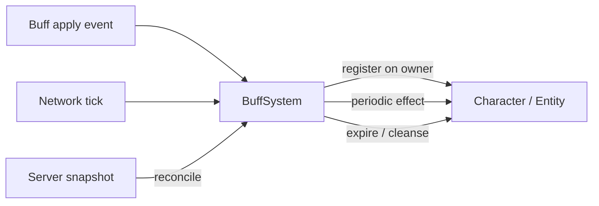

# Buff System

**Short description:** The Buff system is a data-driven, template-based framework for applying temporary (or permanent) effects to FishMMO characters.

## Table of Contents

- [Overview](#overview)
- [Supported Platforms](#supported-platforms)
- [Features / Capabilities / Security Features](#features--capabilities--security-features)
- [Prerequisites](#prerequisites)
- [Installation / Build](#installation--build)
- [Quick Start Guides](#quick-start-guides)
- [Configuration](#configuration)
- [Usage Examples](#usage-examples)
- [Operational Checks](#operational-checks)
- [Flow Diagram](#flow-diagram)
- [Project Structure](#project-structure)
- [Block and Deflect](#block-and-deflect)
- [License](#license)

## Overview

The Buff system is a data-driven, template-based framework for applying temporary (or permanent) effects to FishMMO characters. It supports tick-based expiration, tick-based periodic effects, stacking, attribute modification, FX instantiation, and FishNet network synchronization with deterministic prediction via `IPredictableController` (Order=85). Buffs and debuffs share the same pipeline, distinguished only by an `IsDebuff` flag on the template.

> Note: See the Detailed File-Level Topology in the parent `Prediction/README.md` (`../README.md#detailed-file-level-topology`) for a file-level call/serialization topology and per-file interactions.

## Supported Platforms

| Platform | Status | Notes |
|----------|--------|-------|
| Windows  | ✅ Supported | Primary development platform |
| Linux    | ✅ Supported | Server and client builds |
| WebGL    | ✅ Supported | Via Unity WebGL export |

Built with **Unity 6.3 LTS** using **IL2CPP** scripting backend.

## Features / Capabilities / Security Features

### Features

- **Tick-based expiration** — Buffs expire deterministically using absolute network ticks (`ExpiryTick`)
- **Tick-based periodic effects** — Periodic `OnTick` callbacks at configurable intervals using `NextTickTick`
- **ECA-driven periodic effects** — `OnTickEvents` fires `BuffTickEvent` triggers each tick, so a DoT is an `ApplyDamageAction` and a HoT an `ApplyHealAction` — no bespoke template subclass
- **DoTs behave like hits** — health ticks route through `CharacterDamageController.Damage` / `.Heal`, so they mitigate, generate threat, credit the caster and can kill
- **Caster attribution** — the applying character is snapshotted on the `Buff` and used as the attacker for every subsequent tick
- **Stacking** — Buffs support up to `MaxStacks`. Each hook states the whole contribution for the resulting stack count rather than adding a delta, so apply and remove are exact inverses at every count by construction
- **Attribute modification** — `AttributeBuffTemplate` states bonus attributes through the attributed ledger, under `ModifierSource.Buff(templateID, entryIndex)`
- **FX instantiation** — Client-side visual effect prefabs attached to character mesh
- **FishNet prediction support** — `BuffController` implements `IPredictableController` (Order=85) with Replicate/Reconcile via `BuffReconcileEntry[]`
- **Permanent buffs** — `IsPermanent` flag keeps buffs from expiring and protects them from mass-removal operations
- **Buff/debuff distinction** — Unified pipeline with `IsDebuff` flag for categorization, events, and UI
- **Five template types** — `AttributeBuffTemplate`, `AttributeTickBuffTemplate`, `CompositeBuffTemplate`, `ResourceTickBuffTemplate`, `StateBuffTemplate`
- **Static events** — `OnAddBuff`, `OnRemoveBuff`, `OnAddDebuff`, `OnRemoveDebuff`, `OnBuffTick` for UI and other systems
- **Database persistence** — Buffs are serialized/deserialized via payload methods for save/load

### Security Features

- Buff state is server-authoritative — clients cannot apply or remove buffs without server validation
- Prediction reconcile restores authoritative buff state on mismatch, preventing client-side buff manipulation

## Prerequisites

- Unity 6.3 LTS
- FishNetworking (FishNet)
- FishMMO Shared Core

## Installation / Build

This system is an integrated module of the FishMMO Unity project. No separate installation is required. It is automatically included when the project is opened in Unity.

## Quick Start Guides

**Applying a buff from gameplay (ability, item, region):**

```csharp
// Get the target's BuffController
IBuffController buffController = target.GetComponent<BuffController>();

// Apply a buff template (handles stacking, FX, events)
// Determine application tick. Prefer a TickEventData from trigger EventData when available,
// otherwise fall back to the character's local tick.
uint tick = target.GetLocalTick();
// if (eventData != null && eventData.TryGet(out TickEventData td)) tick = td.Tick;

buffController.Apply(myBuffTemplate, tick);
```

**Removing a buff:**

```csharp
// Remove a specific buff by template ID
buffController.Remove(buffTemplateID);

// Remove all non-permanent buffs
buffController.RemoveAll(ignoreInvokeRemove: false);

// Remove a random buff (with inclusion flags)
buffController.RemoveRandom(rng, includeBuffs: true, includeDebuffs: true);
```

`RemoveAll(ignoreInvokeRemove)` iterates a snapshot copy, skipping `IsPermanent` buffs.

`RemoveRandom(rng, includeBuffs, includeDebuffs)` attempts up to 10 random selections, skipping permanent buffs and checking buff/debuff inclusion flags.

**Creating a new buff template type:**

1. Create a new class extending `BaseBuffTemplate` in `Template/Types/`.
2. Add a `[CreateAssetMenu]` attribute for Unity's asset creation menu.
3. Implement the five abstract methods:
   - `OnApply(Buff buff, ICharacter target)` — Initial application effect.
   - `OnRemove(Buff buff, ICharacter target)` — Cleanup when the buff is fully removed.
   - `OnApplyStack(Buff buff, ICharacter target)` — Effect when a stack is added.
   - `OnRemoveStack(Buff buff, ICharacter target)` — Effect when a stack is removed.
   - `OnTick(Buff buff, ICharacter target)` — Periodic effect each tick interval.
4. Optionally override `SecondaryTooltip(Utf16ValueStringBuilder)` for custom tooltip content.
5. Optionally override `OnApplyFX(Buff, ICharacter)` (returns the instance) and `OnRemoveFX(GameObject, ICharacter)` for custom visual effects. `OnApplyFX` is also called with a **null buff** for an observed buff, because observers hold no `Buff` instance for another character.

**Important**: Ensure `OnApply`/`OnRemove` and `OnApplyStack`/`OnRemoveStack` are symmetric — every effect applied must be fully reversed on removal to avoid modifier leaks.

## Configuration

### Template Properties

`BaseBuffTemplate` exposes the following configurable fields:

| Property | Type | Description |
|----------|------|-------------|
| `FXPrefabReference` | `AssetReferenceGameObject` | Addressable visual effect prefab instantiated on the character (client-side only) |
| `Description` | `string` | Tooltip description text |
| `Icon` | `Sprite` | UI icon (loaded at runtime from the serialized `icon` addressable reference) |
| `Duration` | `float` | Total duration in seconds (0 = permanent or event-driven) |
| `TickRate` | `float` | Interval in seconds between `OnTick` calls |
| `MaxStacks` | `uint` | Maximum stack count (0 = no stacking) |
| `IsPermanent` | `bool` | If true, buff does not expire and `RemoveAll` / `RemoveRandom` skip it |
| `IsDebuff` | `bool` | Determines buff vs debuff categorization for events and UI |
| `OnTickEvents` | `List<BuffTickEvent>` | ECA triggers fired on every tick. Initiator is the caster, target is the carrier. |

### Attribute Modification

`AttributeBuffTemplate` is one of five concrete template types. It modifies character attributes and holds a `List<BuffAttributeTemplate> BonusAttributes` where each entry pairs a `CharacterAttributeTemplate Template` with an `int Value`.

Each hook **states the whole contribution** for the stack count that will be in effect once the
hook returns, through `SetSource(ModifierSource.Buff(ID, entryIndex), Value * multiplier)`. It does
not add a delta.

| Hook | Multiplier written | Why that expression |
|------|--------------------|---------------------|
| `OnApply` | `1 + Stacks` | The base application. `Stacks` is 0 on a fresh buff. |
| `OnApplyStack` | `2 + Stacks` | `Buff.AddStack` raises the hook **before** it increments `Stacks`, so the count that will be in effect is `Stacks + 1`, plus the base application. |
| `OnRemoveStack` | `Stacks` | `Buff.RemoveStack` raises the hook **before** it decrements, so the count that will remain is `Stacks - 1`, plus the base application. |
| `OnRemove` | — | `ClearSourceGroup(ModifierSourceKind.Buff, ID)` releases every entry this buff wrote, whatever index it used. |
| `OnTick` | — | No-op for attribute buffs. |

The off-by-one in `OnApplyStack` and `OnRemoveStack` is load-bearing and nothing in the type system
holds it, so `AttributeStackLedgerTests` walks every stack count in both directions.

The `entryIndex` is the entry's position in `BonusAttributes`. Two authored entries may name the
same character attribute — a flat part and a scalar part — and a single key per buff would silently
keep only the last of them.

Stating rather than adding is what makes the model safe: a reconcile that restores a buff at a
different stack count simply calls `AddStack`/`RemoveStack` until the counts match, and the final
call is the only one whose value survives.

#### All Template Types

| Template | Description |
|----------|-------------|
| `AttributeBuffTemplate` | States flat attribute bonuses through the ledger. No tick effect. |
| `AttributeTickBuffTemplate` | Grants attribute bonuses on apply, plus periodic attribute modification on each tick. |
| `CompositeBuffTemplate` | Composes multiple `BaseBuffTemplate` references, delegating all hooks to each child template. |
| `ResourceTickBuffTemplate` | Periodically ticks resource attributes (e.g., health/mana regen or drain over time). Health ticks route through the damage pipeline. |
| `StateBuffTemplate` | Applies a character state flag on apply, removes it on removal. No tick effect. |

### Damage and heal over time

There are two ways to author a periodic health effect, and they compose.

**ECA tick events (preferred).** Put a `BuffTickEvent` in `OnTickEvents` and hang an
`ApplyDamageAction` or `ApplyHealAction` on it. The event fires with the buff's **carrier as the
target** and the **caster as the initiator**, so the action behaves exactly as the same action does
on an ability's on-hit event. Conditions, target selectors and both condition branches all work,
which means "a poison that only ticks while its victim is moving" is a condition rather than a new
template type. Nothing new needs writing in C#, and the AI reads the actions directly rather than
inferring intent from numbers.

**Serialized resource ticks.** `ResourceTickBuffTemplate.TickAttributes` (and the same list on
`CompositeBuffTemplate`) still handles the flat case. A tick against the **health** resource is
routed through `ICharacterDamageController.Damage` / `.Heal`; a tick against any other resource
(mana, stamina) writes the resource directly, since there are no damage semantics to borrow.
`DamageAttribute` on the template selects the resistance the tick is mitigated by — leave it empty
for true damage.

Both paths run: a `CompositeBuffTemplate` can fire tick events *and* drain a resource.

> **Why health goes through the damage controller.** Both tick templates previously called
> `CharacterResourceAttribute.AddToCurrentValue`, which clamps the value and raises an
> attribute-changed notification and nothing else. That skipped every consequence of being hurt —
> no resistance, no `Immortal` check, no combat entry, and no `OnDamaged` event, so a DoT generated
> **no threat at all**. Worst of all, nothing could die of it: `Kill()` is only ever reached from
> inside `Damage()`, so a DoT drained its victim to zero health and stopped, and the "already dead"
> early-out at the top of `Damage()` then rejected every subsequent hit — leaving a character
> permanently alive at nothing.

#### Attribution

`Buff` snapshots the applying character (`Buff.Caster`) so a tick that fires seconds later still
has somebody to credit for threat, kill credit and combat state. It is passed by
`ApplyBuffAction` from the ECA initiator; sources with no initiator, such as region hazards, apply
with none.

The snapshot is deliberately **not** serialized into the reconcile payload or the database. The
server holds the authoritative buff for its whole life, which is the only place attribution is acted
on. If the caster is destroyed — disconnected, despawned — `Buff.Caster` returns null and **the tick
still lands**: a lingering poison is part of the simulation whether or not whoever cast it is still
in the scene. It simply credits nobody.

#### Prediction and replay

Ticks run on the client as well as the server, which is what keeps predicted health in step. The
authoritative consequences are already gated inside the damage controller — `Kill()` returns
immediately off the server. Reconcile replays every input since the last authoritative state, so a
tick fires again on each pass; `Buff.IsReplaying` is true during those, and is passed as
`ignoreAchievements` so a single tick of poison cannot count a dozen times toward an achievement.

### Static Events

All events are defined on `IBuffController`:

| Event | Signature | When Fired |
|-------|-----------|------------|
| `OnBuffTick` | `Action<Buff, uint>` | Each time a buff's `OnTick` fires during `Tick()` |
| `OnAddBuff` | `Action<Buff>` | When a non-debuff is applied |
| `OnRemoveBuff` | `Action<Buff>` | When a non-debuff is removed |
| `OnAddDebuff` | `Action<Buff>` | When a debuff is applied |
| `OnRemoveDebuff` | `Action<Buff>` | When a debuff is removed |

### External Integration Points

The buff system is consumed by and interacts with:

- **Ability System** — Abilities apply buffs/debuffs to targets via `BuffController.Apply(template, currentTick)` (prefer passing `TickEventData.Tick` from triggers or `ICharacter.LocalTick` as a fallback).
- **CharacterAttribute System** — `AttributeBuffTemplate` states attribute contributions through the attributed ledger (`SetSource` / `ClearSourceGroup`) on the `ExternalModifier` layer.
- **CharacterDamageController** — `RemoveAll()` is called on kill to clear all non-permanent buffs.
- **Item System** — Items may apply buffs on use or equip.
- **Database Layer** — Buffs are persisted and restored via `CharacterBuffData` DTO and loaded through `ReadPayload` → `Apply(Buff buff)`.
- **UI** — Buff icons, tooltips, and timers are driven by the `OnAddBuff`/`OnRemoveBuff`/`OnAddDebuff`/`OnRemoveDebuff`/`OnBuffTick` events.

### Notes

- **FX Prefabs**: `BaseBuffTemplate.OnApplyFX` instantiates `FXPrefab` as a child of the character's `MeshRoot` (or `Transform`) and returns it. `BuffController` owns the instance's lifetime: **one per template** (not per stack, not per re-application), destroyed through `OnRemoveFX` when the buff expires, is dispelled, is removed by reconcile, or the character is torn down, and re-created from `IModelReadyHandler.OnModelReady` after a model (re)load destroys it. FX prefabs may still self-destruct; they no longer have to.
- **Observer FX**: an observer never simulates another character's buffs, so its FX is driven by the diff of the server-sent `ObservedBuffs` list — added templates spawn, removed templates despawn. The owner drives FX from its own simulation instead, so it never spawns a second copy from its locally built observed list.

## Usage Examples

### Network Synchronization

Buff state is **fully reconcile-driven** and reaches owner and observers
through FishNet Prediction V2 state forwarding. There are no per-buff
add/remove broadcasts. Each authoritative tick, `BuffController` writes
its current set of `BuffReconcileEntry` records into
`CharacterReconcileData.Buffs`, and `CharacterReconcileDataDeltaSerializer`
ships only the entries that changed (index-delta with a packed
`(deltaFlag | count)` 16-bit header — see `BuffReconcileEntry.WriteArrayDelta`).

On the receiving side, `BuffController.OnReconcile` calls
`RestoreFromReconcile(rd.Buffs)` which performs an incremental Add/Remove
patch against the local cached snapshot, then fires queued
`OnAddBuff`/`OnAddDebuff`/`OnRemoveBuff`/`OnRemoveDebuff` events *after*
the patch loop completes so observers never see a half-restored set.

#### Payload Serialization (Persistence / DB)

For non-prediction code paths (DB save/load, character export) the
controller still exposes `WritePayload` / `ReadPayload`:

- **WritePayload**: Writes `Int32(count)`, then for each buff: `Int32(templateID)`, `Single(remainingTime)`, `Single(tickTime)`, `Int32(stacks)`.
- **ReadPayload**: Reads the payload and calls `Apply(Buff buff)` for each entry, which re-applies all attribute modifiers.

These are only invoked outside the prediction pipeline (for example, when
a character is loaded from the database). Live in-session sync uses
reconcile exclusively.

## Operational Checks

| Check | How to Verify | Expected Result |
|-------|---------------|-----------------|
| Buff applies correctly | Apply a buff template via `BuffController.Apply(template, currentTick)` (prefer `TickEventData.Tick` or `ICharacter.LocalTick`) | Buff appears in controller dictionary; `OnAddBuff`/`OnAddDebuff` event fires |
| Stacking works | Apply same buff multiple times (up to `MaxStacks`) | `Stacks` increments; attribute modifiers accumulate |
| Duration expiration | Wait for `ExpiryTick` to be reached | Stacks decrement one at a time; buff removed when stacks reach 0 |
| Tick fires | Apply buff with non-zero `TickRate` | `OnTick` called when `NextTickTick` is reached |
| Removal cleans up | Call `Remove(buffID)` | All modifiers reversed; `OnRemoveBuff`/`OnRemoveDebuff` fires |
| Permanent buff protection | Call `RemoveAll()` with `IsPermanent` buff active | Permanent buff remains |
| Network sync (owner) | Apply buff on server | Buff appears on owning client on the next reconcile via `CharacterReconcileData.Buffs` |
| Network sync (observer) | Apply buff on server with nearby observers | Buff appears on observers through FishNet Prediction V2 state forwarding (same reconcile path as owner) |
| DB persistence | Save character with active buffs, reload | Buffs restored via `ReadPayload` → `Apply(Buff buff)` with correct stacks/time |
| FX instantiation | Apply buff with `FXPrefab` set | FX prefab spawned as child of `MeshRoot`; self-destroys after effect |
| Modifier balance | Apply and fully remove a stacked buff | Net modifier change is zero (every `+V` paired with `-V`) |
| Prediction reconcile | Simulate prediction mismatch | `RestoreFromReconcile(BuffReconcileEntry[])` corrects client buff state |

## Flow Diagram

### High-Level Overview



### Buff Lifecycle

#### 1. Application

A buff enters the system through one of two `Apply` overloads on `BuffController`:

| Overload | Entry Point | Use Case |
|----------|------------|----------|
| `Apply(BaseBuffTemplate, uint currentTick)` | Gameplay trigger (ability, item, region) | Creates a new `Buff`, calls `buff.Apply(Character)`, handles stacking + FX |
| `Apply(Buff buff)` | DB load / network payload (`ReadPayload`) | Receives pre-constructed `Buff` with existing `Stacks`, calls `buff.Apply(Character)` + re-applies stack modifiers without incrementing `Stacks` |

**Application flow** (`Apply(BaseBuffTemplate, uint currentTick)`):

```
Apply(template, currentTick)
  ├── Buff already exists?
  │   └── No  → Create Buff(template.ID)
  │            → buff.Apply(Character)           // Template.OnApply → SetSource(1 x V) per attribute
  │            → Add to dictionary
  │            → Fire OnAddBuff / OnAddDebuff
  ├── Stacking allowed? (MaxStacks > 0 && Stacks < MaxStacks)
  │   └── Yes → buff.AddStack(Character)         // OnApplyStack → SetSource((2 + Stacks) x V)
  │            → ++Stacks
  │            → ResetDuration
  │   └── No  → ResetDuration only
  └── SpawnBuffFX(template, buff)               // Client-side, one tracked instance per template
```

**Restoration flow** (`Apply(Buff buff)`) — for DB load / network sync:

```
Apply(buff)
  ├── Already tracked? → skip
  └── Not tracked:
      → buff.Apply(Character)                    // Base application: OnApply → SetSource(1 x V)
      → Add to dictionary
      → Loop buff.Stacks times:
      │   → Template.OnApplyStack(buff, Character) // Re-apply each stack's modifiers
      │   (Stacks NOT incremented — already set from source)
      → Fire OnAddBuff / OnAddDebuff
```

#### 2. Ticking

`BuffController.Tick(uint currentTick)` runs each prediction tick (driven by `OnReplicate`):

```
foreach buff:
  if HasExpired(currentTick):
    if Stacks > 0:
      RemoveStack(Character)                     // OnRemoveStack → SetSource(Stacks x V)
      --Stacks
      ResetDuration(currentTick)                 // Continue with remaining stacks
    else:
      Queue for removal
  else:
    if TryTick(Character, currentTick):          // NextTickTick reached?
      Template.OnTick(buff, Character)          // Fires OnTickEvents, then any template-specific effect
      Fire IBuffController.OnBuffTick
      Advance NextTickTick
```

Timing uses absolute network ticks (`ExpiryTick`, `NextTickTick`) for deterministic prediction. `HasExpired()` compares via signed cast: `(int)(currentTick - ExpiryTick) >= 0`.

#### 3. Removal

```
Remove(buffID)
  → buff.Remove(Character)                       // OnRemove → ClearSourceGroup(Buff, ID)
  → Remove from dictionary
  → Fire OnRemoveBuff / OnRemoveDebuff
```

### Stacking Model

Each buff can have up to `Template.MaxStacks` stacks. The modifier accounting works as follows:

Each buff can have up to `Template.MaxStacks` stacks. The ledger entry is **restated** at every
transition, so the contribution is always exactly `(1 + Stacks) * Value` — the base application
plus one multiple per stack:

| Action | Ledger entry after | Stacks after |
|--------|--------------------|--------------|
| Initial apply | `1 × V` | 0 |
| Add 1st stack | `2 × V` | 1 |
| Add 2nd stack | `3 × V` | 2 |
| Duration expires (Stacks=2) | `2 × V`, reset duration | 1 |
| Duration expires (Stacks=1) | `1 × V`, reset duration | 0 |
| Duration expires (Stacks=0) | entry released | removed |

Because every write is absolute, the model is balanced by construction rather than by pairing: any
sequence of stack changes that ends at count *N* leaves the same value as any other, and a
mismatched pair cannot drift the sheet the way the previous additive `AddModifier(±V)` shape could.

### Prediction Pipeline

`BuffController` implements `IPredictableController` (Order=85), running after `KCCPlayer` (80) and before `CooldownController` (90), `CharacterAttributeController` (95), and `AbilityController` (100) in the prediction pipeline.

| Method              | Behaviour                                                                    |
|---------------------|------------------------------------------------------------------------------|
| `PopulateInput`     | No-op (buffs have no input)                                                  |
| `OnReplicate`       | Calls `Tick(input.GetTick())` — deterministic buff simulation per tick       |
| `OnCreateReconcile` | Writes `CreateReconcileSnapshot()` → `BuffReconcileEntry[]` array            |
| `OnReconcile`       | Calls `RestoreFromReconcile(entries)` to restore authoritative buff state    |

#### BuffReconcileEntry

Each `BuffReconcileEntry` captures the minimum state needed to restore a buff:

| Field        | Type   | Description                                       |
|--------------|--------|---------------------------------------------------|
| `TemplateID` | `int`  | The buff template ID                              |
| `ExpiryTick` | `uint` | Absolute network tick when the buff expires       |
| `NextTickTick` | `uint` | Absolute network tick for next periodic tick     |
| `Stacks`     | `int`  | Current stack count                               |

Array delta serialization uses index-based compression: unchanged entries are skipped, only modified/added/removed entries are transmitted.

> **Defensive guard (2025 audit):**
> Both `Buff` constructors coerce a non-positive `tickDelta` parameter to `1f / 30f` before computing `ExpiryTick` / `NextTickTick`. This prevents a `Buff` constructed before `TimeManager.TickDelta` is populated from collapsing `ExpiryTick` onto `applyTick` and immediately expiring. `SetTickDelta(...)` then resets the cached delta to the session's authoritative value once the network is fully up. See `Assets/UnitTests/Prediction/BuffExpiryTests.cs::SetTickDelta_RepairsZeroInitializedTickDelta_RemainingSecondsCorrects`.

## Project Structure

### Directory Structure

```
Buff/
├── Buff.cs                        # Runtime buff instance (tick-based timing, stacks, template ref)
├── BuffController.cs              # Per-entity controller (CharacterBehaviour, IBuffController, IPredictableController Order=85)
├── BuffReconcileEntry.cs          # Reconcile snapshot entry + index-delta array serialization (WriteArrayDelta/ReadArrayDelta)
└── Template/
    ├── BaseBuffTemplate.cs            # Abstract ScriptableObject base for all buff templates
    ├── BuffAttributeTemplate.cs       # Serializable attribute+value pair for template configuration
    ├── BuffTemplateDatabase.cs        # Name-to-template lookup database (ScriptableObject)
    ├── Events/
    │   └── BuffTickEvent.cs           # ECA trigger fired on each tick (DoT / HoT and anything periodic)
    └── Types/
        ├── AttributeBuffTemplate.cs       # Concrete template: states bonus attributes via SetSource
        ├── AttributeTickBuffTemplate.cs   # Grants attributes on apply + periodic attribute modification on tick
        ├── CompositeBuffTemplate.cs       # Composes multiple BaseBuffTemplate children, delegating all hooks
        ├── ResourceTickBuffTemplate.cs    # Periodic resource attribute modification (regen/drain over time)
        └── StateBuffTemplate.cs           # Applies a character state flag on apply, removes on removal
```

#### Related Files (Outside This Directory)

```
Shared/Implementation/Entity/Prediction/Buff/BuffReconcileEntry.cs   # Reconcile snapshot entry + index-delta array serialization
Shared/Implementation/Entity/Prediction/CharacterReconcileData.cs    # Unified reconcile payload that carries Buffs[]
Shared/Implementation/Entity/Prediction/CharacterReconcileDataDeltaSerializer.cs  # Delta writer that ships only changed buff entries
Shared/Implementation/Entity/BaseCharacter.cs                        # Client-side character cache used for observer routing
```

### Inheritance Hierarchies

#### Runtime Instances

```
Buff                               # Standalone class (no inheritance)
```

#### Templates (ScriptableObjects)

```
CachedScriptableObject<BaseBuffTemplate>
└── BaseBuffTemplate                   # Abstract: Duration, TickRate, MaxStacks, IsPermanent, IsDebuff
    ├── AttributeBuffTemplate          # Concrete: states BonusAttributes via SetSource
    ├── AttributeTickBuffTemplate      # Concrete: Attributes on apply + periodic attribute ticks
    ├── CompositeBuffTemplate          # Concrete: Composes multiple child templates
    ├── ResourceTickBuffTemplate       # Concrete: Periodic resource modification (regen/drain)
    ├── StateBuffTemplate              # Concrete: Applies/removes a character state flag
    ├── DamageNegationBuffTemplate     # Concrete: Block — absorbs, reduces or negates incoming damage
    └── DeflectBuffTemplate            # Concrete: Deflect — turns an incoming ability object away
```

#### Controllers (NetworkBehaviour)

```
CharacterBehaviour
└── BuffController : IBuffController, IPredictableController (Order=85)
```

#### Configuration Types

```
BuffAttributeTemplate              # [Serializable] class: Value + CharacterAttributeTemplate reference
```

## Block and Deflect

Blocking and deflecting are **buffs**, not a subsystem. Nothing in the ability system knows what a
shield is: an ability applies a mitigation buff to its caster through the ordinary ECA
`ApplyBuffAction`, and combat consults that buff when a hit is being resolved. That means every
block and deflect variant is authored, not coded.

### The two templates

| Template | What it does | When it is consulted |
|---|---|---|
| `DamageNegationBuffTemplate` | Takes damage off an incoming hit (`Absorb` / `Reduce` / `Immune`), and optionally raises a physical `ShieldVolume` that stops ability objects outright. | `CharacterDamageController.Damage` for mitigation; `AbilityObject.ApplyHit` and `AbilityApplyHitscanAction` for the volume |
| `DeflectBuffTemplate` | Turns an incoming ability object away — the hit is rejected, not mitigated. | `AbilityObject.ApplyHit`, before the hit is accepted |

Both honour a facing arc, measured through `TargetOrdering.IsWithinCone` — the same test the cone
selector uses — so a shield held forward stops the sword in front and not the arrow in the back.
Set `RequiresFacing` false (or the angle to 360) for an omnidirectional barrier.

### The shield volume

An arc says nothing about height or reach: a buckler and a tower shield cover identical cones, and a
shot at ankle height counts as "in front" of a shield held at the chest. `DamageNegationBuffTemplate`
therefore also carries a **`ShieldVolume`** — a real shape with real dimensions (`Sphere`, `Box` or
`Capsule`, plus `LocalCenter`, `Radius`/`Size`/`Height`).

An ability object whose impact lands **inside** the volume never touched the character: it is
destroyed outright and deals nothing, whatever `Mode` says. The arc and the mode still govern damage
that genuinely reaches you — melee, damage over time, splash — none of which has a meaningful impact
point on a shield. The two settings answer different questions on one template.

**The volume is authored in the character's own space, and that is what makes it correct.** Ability
hits are dispatched *after* the lag-compensation scope has closed, so a world-space volume read at
that moment would sit where the defender is now while the impact point came from where the defender
was — metres apart at 200 ms, blocking phantom hits and missing real ones. A local point against a
local volume has no such disagreement to have, because the body carried its own frame with it.
`AbilitySweepHit.LocalPoint` and `LagCompensatedQuery.CompensatedHit.LocalPoint` are captured inside
the scope for exactly this.

It gates both shapes of attack: a travelling projectile through `AbilityObject.ApplyHit`, and a
hitscan ray through `AbilityApplyHitscanAction`, where a covered victim stops the shot for everyone
behind them too.

### Sweeping the shield outward (`ShieldInterceptAction`)

The gate above stops anything that would have struck you. It cannot stop what was going to *miss* —
and a tower shield held out to the side should still sweep an arrow out of the air, and a fireball
should die on the shield face rather than reaching your chest.

`ShieldInterceptAction` is the outward-looking half: wire it to the block ability's `OnSpawn` (a
channel re-spawns each tick, so that fires once per tick) and it overlaps the shield volume and
destroys the ability objects it catches. Leave its own `Volume.Shape` at `None` and it sweeps
whatever volumes the character's active block buffs already define, so the dimensions are authored
once, on the buff.

Two properties worth knowing:

- **It cannot change whether damage lands.** Both halves read the same authored volume, so anything
  it catches would have been gated anyway had it gone on to strike. It is an accelerator, not the
  mechanism.
- **It runs after in-flight objects have already ticked.** Every `AbilityObject` subscribes to
  `TimeManager.OnTick` at spawn, so an object already in the air moves and resolves its own sweep
  first. A fast projectile can reach the body on the same tick this would have caught it — which is
  harmless precisely because the gate is what decides the outcome.

It may be predicted by the blocking client, unlike most hit resolution, because neither side of the
test is interpolated: an ability object's position is a closed form every peer computes identically,
and the blocker's own position is the one thing its client predicts and reconciles.

Both spend `Buff.RemainingCharges`, one counter whose **unit belongs to the template**: damage points
for an absorb shield, deflections for a guard. It is predicted state and rides
`BuffReconcileEntry.RemainingCharges`, because the two peers move it independently: the server spends
it as hits land, and the owner refills it every tick a channelled block re-applies its buff. It is deliberately **not** sent to observers —
how much more you have to hit through is not information the game otherwise gives.

### Authoring a channelled shield (hold to block)

1. **Buff asset** — `FishMMO/Character/Buff/Damage Negation Buff`.
   - `Mode = Reduce` (partial block) or `Immune` (full block) — this governs melee and splash.
   - `Amount` = percent for `Reduce`.
   - `Shield.Shape = Box`, `Size = (1.2, 1.4, 0.2)`, `LocalCenter = (0, 1.1, 0.75)` — the physical
     shield that stops projectiles. `VolumeBlockCost = 0` so holding the block does not wear it down.
   - `Duration` ≈ 2–3 ticks. Short on purpose: the channel re-applies it every tick, and it lapses
     shortly after the button is released. `MaxStacks = 1`.
   - `RequiresFacing = true`, `FacingAngleDegrees = 120`.
2. **Ability event** — an `AbilityOnSpawnEvent` whose trigger has
   `TargetSelector = InitiatorTargetSelector` and one `ApplyBuffAction` naming the buff above.
3. **Ability template** — give it the project's `ChanneledTemplate` event so it spawns one object per
   tick while held, `AbilitySpawnTarget = Spawner` (or `PointBlank`), and an `AbilityObjectPrefab`
   that is the shield visual with `LifeTime` of about one tick. `ActivationTime` may be 0;
   `ApplyChannelActivationFloor` raises a held channel to at least one tick for you.
4. **Optional** — add a `ShieldInterceptAction` to the same `OnSpawn` trigger, leaving its `Volume`
   at `None` so it sweeps the buff's volume. This is what makes a projectile visibly die on the
   shield and lets a wide shield catch shots that would have gone past.

The shield exists for as long as the button is down because the buff is refreshed every tick, and
`BuffController` re-fills `RemainingCharges` on every re-apply — so a held block does not run out of
pool part-way through the channel.

### Authoring a consumable barrier (absorbs N damage)

Same buff asset with `Mode = Absorb`, `Amount = 500`, and a real `Duration`. Apply it from any
ability, on-hit event or trigger through `ApplyBuffAction`. It disappears the moment the pool reaches
zero — `DamageMitigation` removes it through `IBuffController.Remove`, so the strip, the FX and the
observer push all hear about it exactly as they would for an expiry.

### Authoring a deflect window (timed parry)

1. **Buff asset** — `FishMMO/Character/Buff/Deflect Buff`.
   - `DeflectAngleDegrees = 120`.
   - `MaxDeflections = 0` for a window that turns away everything arriving while it is up, or `1`
     for a single-use guard consumed by the first thing it stops.
   - `Duration` = the parry window, a few ticks.
2. Apply it exactly as above — an `AbilityOnSpawnEvent` with `InitiatorTargetSelector` and
   `ApplyBuffAction` — from an instant ability whose object prefab plays the deflect animation.

A deflected object is never treated as having hit: no OnHit events, no hit count spent, no damage.
It leaves along the incoming heading mirrored about the impact normal, and the defender is added to
its hit set so the two cannot re-resolve against each other every tick.

### How the three peers stay in step

- The **server** decides both, inside the rewind scope that resolved the hit.
- The **caster's own client** resolves its own hits, so it deflects and blocks identically — except
  for an `Absorb` pool, whose remainder it cannot see; it may over-predict damage there and the
  server's resource push corrects it on the next tick, the same bound every predicted number has.
- **Observers** decide neither. A deflection reaches them as one bit on
  `AbilityObjectHitBroadcast`, and they recompute the new heading from the `Normal` already in that
  message — so the trajectory matches without the buff's timing having to.

Charges are spent only where `IBuffController.SimulatesBuffEffects` is true, so no peer drains a
pool it does not own.

## License

This project is subject to the FishMMO project license.
