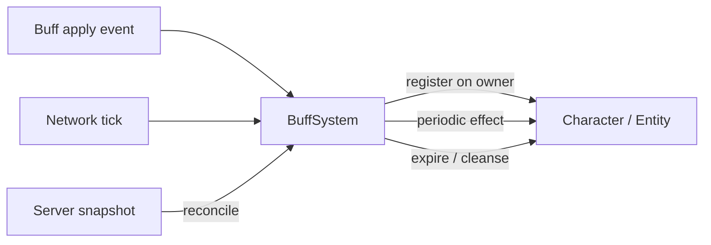

# Buff System

**Short description:** The Buff system is a data-driven, template-based framework for applying temporary (or permanent) effects to FishMMO characters.

## Table of Contents

- [Overview](#overview)
- [Supported Platforms](#supported-platforms)
- [Features / Capabilities / Security Features](#features--capabilities--security-features)
- [Prerequisites](#prerequisites)
- [Installation / Build](#installation--build)
- [Quick Start Guides](#quick-start-guides)
- [Configuration](#configuration)
- [Usage Examples](#usage-examples)
- [Operational Checks](#operational-checks)
- [Flow Diagram](#flow-diagram)
- [Project Structure](#project-structure)
- [License](#license)

## Overview

The Buff system is a data-driven, template-based framework for applying temporary (or permanent) effects to FishMMO characters. It supports tick-based expiration, tick-based periodic effects, stacking, attribute modification, FX instantiation, and FishNet network synchronization with deterministic prediction via `IPredictableController` (Order=80). Buffs and debuffs share the same pipeline, distinguished only by an `IsDebuff` flag on the template.

> Note: See the Detailed File-Level Topology in the parent `Prediction/README.md` (`../README.md#detailed-file-level-topology`) for a file-level call/serialization topology and per-file interactions.

## Supported Platforms

| Platform | Status | Notes |
|----------|--------|-------|
| Windows  | ✅ Supported | Primary development platform |
| Linux    | ✅ Supported | Server and client builds |
| WebGL    | ✅ Supported | Via Unity WebGL export |

Built with **Unity 6.3 LTS** using **IL2CPP** scripting backend.

## Features / Capabilities / Security Features

### Features

- **Tick-based expiration** — Buffs expire deterministically using absolute network ticks (`ExpiryTick`)
- **Tick-based periodic effects** — Periodic `OnTick` callbacks at configurable intervals using `NextTickTick`
- **Stacking** — Buffs support up to `MaxStacks` with symmetric modifier accounting
- **Attribute modification** — `AttributeBuffTemplate` grants bonus attributes via `AddModifier()` on the `ExternalModifier` layer
- **FX instantiation** — Client-side visual effect prefabs attached to character mesh
- **FishNet prediction support** — `BuffController` implements `IPredictableController` (Order=80) with Replicate/Reconcile via `BuffReconcileEntry[]`
- **Permanent buffs** — `IsPermanent` flag protects buffs from mass-removal operations
- **Buff/debuff distinction** — Unified pipeline with `IsDebuff` flag for categorization, events, and UI
- **Five template types** — `AttributeBuffTemplate`, `AttributeTickBuffTemplate`, `CompositeBuffTemplate`, `ResourceTickBuffTemplate`, `StateBuffTemplate`
- **Static events** — `OnAddBuff`, `OnRemoveBuff`, `OnAddDebuff`, `OnRemoveDebuff`, `OnBuffTick` for UI and other systems
- **Database persistence** — Buffs are serialized/deserialized via payload methods for save/load

### Security Features

- Buff state is server-authoritative — clients cannot apply or remove buffs without server validation
- Prediction reconcile restores authoritative buff state on mismatch, preventing client-side buff manipulation

## Prerequisites

- Unity 6.3 LTS
- FishNetworking (FishNet)
- FishMMO Shared Core

## Installation / Build

This system is an integrated module of the FishMMO Unity project. No separate installation is required. It is automatically included when the project is opened in Unity.

## Quick Start Guides

**Applying a buff from gameplay (ability, item, region):**

```csharp
// Get the target's BuffController
IBuffController buffController = target.GetComponent<BuffController>();

// Apply a buff template (handles stacking, FX, events)
// Determine application tick. Prefer a TickEventData from trigger EventData when available,
// otherwise fall back to the character's local tick.
uint tick = target.GetLocalTick();
// if (eventData != null && eventData.TryGet(out TickEventData td)) tick = td.Tick;

buffController.Apply(myBuffTemplate, tick);
```

**Removing a buff:**

```csharp
// Remove a specific buff by template ID
buffController.Remove(buffTemplateID);

// Remove all non-permanent buffs
buffController.RemoveAll(ignoreInvokeRemove: false);

// Remove a random buff (with inclusion flags)
buffController.RemoveRandom(rng, includeBuffs: true, includeDebuffs: true);
```

`RemoveAll(ignoreInvokeRemove)` iterates a snapshot copy, skipping `IsPermanent` buffs.

`RemoveRandom(rng, includeBuffs, includeDebuffs)` attempts up to 10 random selections, skipping permanent buffs and checking buff/debuff inclusion flags.

**Creating a new buff template type:**

1. Create a new class extending `BaseBuffTemplate` in `Template/Types/`.
2. Add a `[CreateAssetMenu]` attribute for Unity's asset creation menu.
3. Implement the five abstract methods:
   - `OnApply(Buff buff, ICharacter target)` — Initial application effect.
   - `OnRemove(Buff buff, ICharacter target)` — Cleanup when the buff is fully removed.
   - `OnApplyStack(Buff buff, ICharacter target)` — Effect when a stack is added.
   - `OnRemoveStack(Buff buff, ICharacter target)` — Effect when a stack is removed.
   - `OnTick(Buff buff, ICharacter target)` — Periodic effect each tick interval.
4. Optionally override `SecondaryTooltip(Utf16ValueStringBuilder)` for custom tooltip content.
5. Optionally override `OnApplyFX(Buff, ICharacter)` for custom visual effects.

**Important**: Ensure `OnApply`/`OnRemove` and `OnApplyStack`/`OnRemoveStack` are symmetric — every effect applied must be fully reversed on removal to avoid modifier leaks.

## Configuration

### Template Properties

`BaseBuffTemplate` exposes the following configurable fields:

| Property | Type | Description |
|----------|------|-------------|
| `FXPrefab` | `GameObject` | Visual effect prefab instantiated on the character (client-side only) |
| `Description` | `string` | Tooltip description text |
| `Icon` | `Sprite` | UI icon |
| `Duration` | `float` | Total duration in seconds (0 = permanent or event-driven) |
| `TickRate` | `float` | Interval in seconds between `OnTick` calls |
| `UseCount` | `uint` | Number of times the buff can be triggered |
| `MaxStacks` | `uint` | Maximum stack count (0 = no stacking) |
| `IsPermanent` | `bool` | If true, `RemoveAll` and `RemoveRandom` skip this buff |
| `IsDebuff` | `bool` | Determines buff vs debuff categorization for events and UI |

### Attribute Modification

`AttributeBuffTemplate` is one of five concrete template types. It modifies character attributes and holds a `List<BuffAttributeTemplate>` where each entry pairs a `CharacterAttributeTemplate` with an `int Value`.

| Hook | Effect |
|------|--------|
| `OnApply` | For each `BonusAttribute`: `characterAttribute.AddModifier(+Value)` |
| `OnRemove` | For each `BonusAttribute`: `characterAttribute.AddModifier(-Value)` |
| `OnApplyStack` | Delegates to `OnApply` (adds another `+Value`) |
| `OnRemoveStack` | Delegates to `OnRemove` (adds another `-Value`) |
| `OnTick` | No-op for attribute buffs |

All modifications go through `CharacterAttribute.AddModifier()`, which operates on the `ExternalModifier` layer. This ensures buff bonuses are never overwritten by the formula recalculation system (see CharacterAttribute README).

#### All Template Types

| Template | Description |
|----------|-------------|
| `AttributeBuffTemplate` | Grants flat attribute bonuses via `AddModifier()`. No tick effect. |
| `AttributeTickBuffTemplate` | Grants attribute bonuses on apply, plus periodic attribute modification on each tick. |
| `CompositeBuffTemplate` | Composes multiple `BaseBuffTemplate` references, delegating all hooks to each child template. |
| `ResourceTickBuffTemplate` | Periodically ticks resource attributes (e.g., health/mana regen or drain over time). |
| `StateBuffTemplate` | Applies a character state flag on apply, removes it on removal. No tick effect. |

### Static Events

All events are defined on `IBuffController`:

| Event | Signature | When Fired |
|-------|-----------|------------|
| `OnBuffTick` | `Action<Buff, uint>` | Each time a buff's `OnTick` fires during `Tick()` |
| `OnAddBuff` | `Action<Buff>` | When a non-debuff is applied |
| `OnRemoveBuff` | `Action<Buff>` | When a non-debuff is removed |
| `OnAddDebuff` | `Action<Buff>` | When a debuff is applied |
| `OnRemoveDebuff` | `Action<Buff>` | When a debuff is removed |

### External Integration Points

The buff system is consumed by and interacts with:

- **Ability System** — Abilities apply buffs/debuffs to targets via `BuffController.Apply(template, currentTick)` (prefer passing `TickEventData.Tick` from triggers or `ICharacter.LocalTick` as a fallback).
- **CharacterAttribute System** — `AttributeBuffTemplate` modifies attributes via `AddModifier()` on the `ExternalModifier` layer.
- **CharacterDamageController** — `RemoveAll()` is called on kill to clear all non-permanent buffs.
- **Item System** — Items may apply buffs on use or equip.
- **Database Layer** — Buffs are persisted and restored via `CharacterBuffData` DTO and loaded through `ReadPayload` → `Apply(Buff buff)`.
- **UI** — Buff icons, tooltips, and timers are driven by `OnAddBuff`/`OnRemoveBuff`/`OnSubtractTime` events.

### Notes

- **FX Prefabs**: `BaseBuffTemplate.OnApplyFX` instantiates `FXPrefab` as a child of the character's `MeshRoot` (or `Transform`). FX prefabs are expected to be self-destroying — they manage their own lifetime and clean up after their effect ends.

## Usage Examples

### Network Synchronization

Buff state is **fully reconcile-driven** and reaches owner and observers
through FishNet Prediction V2 state forwarding. There are no per-buff
add/remove broadcasts. Each authoritative tick, `BuffController` writes
its current set of `BuffReconcileEntry` records into
`CharacterReconcileData.Buffs`, and `CharacterReconcileDataDeltaSerializer`
ships only the entries that changed (index-delta with a packed
`(deltaFlag | count)` 16-bit header — see `BuffReconcileEntry.WriteArrayDelta`).

On the receiving side, `BuffController.OnReconcile` calls
`RestoreFromReconcile(rd.Buffs)` which performs an incremental Add/Remove
patch against the local cached snapshot, then fires queued
`OnAddBuff`/`OnAddDebuff`/`OnRemoveBuff`/`OnRemoveDebuff` events *after*
the patch loop completes so observers never see a half-restored set.

#### Payload Serialization (Persistence / DB)

For non-prediction code paths (DB save/load, character export) the
controller still exposes `WritePayload` / `ReadPayload`:

- **WritePayload**: Writes `Int32(count)`, then for each buff: `Int32(templateID)`, `Single(remainingTime)`, `Single(tickTime)`, `Int32(stacks)`.
- **ReadPayload**: Reads the payload and calls `Apply(Buff buff)` for each entry, which re-applies all attribute modifiers.

These are only invoked outside the prediction pipeline (for example, when
a character is loaded from the database). Live in-session sync uses
reconcile exclusively.

## Operational Checks

| Check | How to Verify | Expected Result |
|-------|---------------|-----------------|
| Buff applies correctly | Apply a buff template via `BuffController.Apply(template, currentTick)` (prefer `TickEventData.Tick` or `ICharacter.LocalTick`) | Buff appears in controller dictionary; `OnAddBuff`/`OnAddDebuff` event fires |
| Stacking works | Apply same buff multiple times (up to `MaxStacks`) | `Stacks` increments; attribute modifiers accumulate |
| Duration expiration | Wait for `ExpiryTick` to be reached | Stacks decrement one at a time; buff removed when stacks reach 0 |
| Tick fires | Apply buff with non-zero `TickRate` | `OnTick` called when `NextTickTick` is reached |
| Removal cleans up | Call `Remove(buffID)` | All modifiers reversed; `OnRemoveBuff`/`OnRemoveDebuff` fires |
| Permanent buff protection | Call `RemoveAll()` with `IsPermanent` buff active | Permanent buff remains |
| Network sync (owner) | Apply buff on server | Buff appears on owning client on the next reconcile via `CharacterReconcileData.Buffs` |
| Network sync (observer) | Apply buff on server with nearby observers | Buff appears on observers through FishNet Prediction V2 state forwarding (same reconcile path as owner) |
| DB persistence | Save character with active buffs, reload | Buffs restored via `ReadPayload` → `Apply(Buff buff)` with correct stacks/time |
| FX instantiation | Apply buff with `FXPrefab` set | FX prefab spawned as child of `MeshRoot`; self-destroys after effect |
| Modifier balance | Apply and fully remove a stacked buff | Net modifier change is zero (every `+V` paired with `-V`) |
| Prediction reconcile | Simulate prediction mismatch | `RestoreFromReconcile(BuffReconcileEntry[])` corrects client buff state |

## Flow Diagram

### High-Level Overview



### Buff Lifecycle

#### 1. Application

A buff enters the system through one of two `Apply` overloads on `BuffController`:

| Overload | Entry Point | Use Case |
|----------|------------|----------|
| `Apply(BaseBuffTemplate, uint currentTick)` | Gameplay trigger (ability, item, region) | Creates a new `Buff`, calls `buff.Apply(Character)`, handles stacking + FX |
| `Apply(Buff buff)` | DB load / network payload (`ReadPayload`) | Receives pre-constructed `Buff` with existing `Stacks`, calls `buff.Apply(Character)` + re-applies stack modifiers without incrementing `Stacks` |

**Application flow** (`Apply(BaseBuffTemplate, uint currentTick)`):

```
Apply(template, currentTick)
  ├── Buff already exists?
  │   └── No  → Create Buff(template.ID)
  │            → buff.Apply(Character)           // Template.OnApply → AddModifier(+V) per attribute
  │            → Add to dictionary
  │            → Fire OnAddBuff / OnAddDebuff
  ├── Stacking allowed? (MaxStacks > 0 && Stacks < MaxStacks)
  │   └── Yes → buff.AddStack(Character)         // Template.OnApplyStack → AddModifier(+V) again
  │            → ++Stacks
  │            → ResetDuration
  │   └── No  → ResetDuration only
  └── Template.OnApplyFX(buff, Character)        // Client-side FX instantiation
```

**Restoration flow** (`Apply(Buff buff)`) — for DB load / network sync:

```
Apply(buff)
  ├── Already tracked? → skip
  └── Not tracked:
      → buff.Apply(Character)                    // Base application: OnApply → AddModifier(+V)
      → Add to dictionary
      → Loop buff.Stacks times:
      │   → Template.OnApplyStack(buff, Character) // Re-apply each stack's modifiers
      │   (Stacks NOT incremented — already set from source)
      → Fire OnAddBuff / OnAddDebuff
```

#### 2. Ticking

`BuffController.Tick(uint currentTick)` runs each prediction tick (driven by `OnReplicate`):

```
foreach buff:
  if HasExpired(currentTick):
    if Stacks > 0:
      RemoveStack(Character)                     // Template.OnRemoveStack → AddModifier(-V)
      --Stacks
      ResetDuration(currentTick)                 // Continue with remaining stacks
    else:
      Queue for removal
  else:
    if TryTick(Character, currentTick):          // NextTickTick reached?
      Template.OnTick(buff, Character)
      Fire IBuffController.OnBuffTick
      Advance NextTickTick
```

Timing uses absolute network ticks (`ExpiryTick`, `NextTickTick`) for deterministic prediction. `HasExpired()` compares via signed cast: `(int)(currentTick - ExpiryTick) >= 0`.

#### 3. Removal

```
Remove(buffID)
  → buff.Remove(Character)                       // Template.OnRemove → AddModifier(-V) per attribute
  → Remove from dictionary
  → Fire OnRemoveBuff / OnRemoveDebuff
```

### Stacking Model

Each buff can have up to `Template.MaxStacks` stacks. The modifier accounting works as follows:

| Action | Modifier Calls | Stacks After |
|--------|---------------|-------------|
| Initial apply | `OnApply` → `AddModifier(+V)` × 1 | 0 |
| Add 1st stack | `OnApplyStack` → `AddModifier(+V)` × 1, then `++Stacks` | 1 |
| Add 2nd stack | `OnApplyStack` → `AddModifier(+V)` × 1, then `++Stacks` | 2 |
| Duration expires (Stacks=2) | `OnRemoveStack` → `AddModifier(-V)` × 1, then `--Stacks`, reset duration | 1 |
| Duration expires (Stacks=1) | `OnRemoveStack` → `AddModifier(-V)` × 1, then `--Stacks`, reset duration | 0 |
| Duration expires (Stacks=0) | `Remove` → `OnRemove` → `AddModifier(-V)` × 1 | removed |

**Total modifiers applied**: `1 (base) + N (stacks)` = `N + 1` calls to `AddModifier(+V)`.
**Total modifiers removed**: `N (stack expirations) + 1 (final remove)` = `N + 1` calls to `AddModifier(-V)`.

The system is balanced: every `+V` is paired with a `-V`.

### Prediction Pipeline

`BuffController` implements `IPredictableController` (Order=80), running before `CooldownController` (90) and `AbilityController` (100) in the prediction pipeline.

| Method              | Behaviour                                                                    |
|---------------------|------------------------------------------------------------------------------|
| `PopulateInput`     | No-op (buffs have no input)                                                  |
| `OnReplicate`       | Calls `Tick(input.GetTick())` — deterministic buff simulation per tick       |
| `OnCreateReconcile` | Writes `CreateReconcileSnapshot()` → `BuffReconcileEntry[]` array            |
| `OnReconcile`       | Calls `RestoreFromReconcile(entries)` to restore authoritative buff state    |

#### BuffReconcileEntry

Each `BuffReconcileEntry` captures the minimum state needed to restore a buff:

| Field        | Type   | Description                                       |
|--------------|--------|---------------------------------------------------|
| `TemplateID` | `int`  | The buff template ID                              |
| `ExpiryTick` | `uint` | Absolute network tick when the buff expires       |
| `NextTickTick` | `uint` | Absolute network tick for next periodic tick     |
| `Stacks`     | `int`  | Current stack count                               |

Array delta serialization uses index-based compression: unchanged entries are skipped, only modified/added/removed entries are transmitted.

> **Defensive guard (2025 audit):**
> Both `Buff` constructors coerce a non-positive `tickDelta` parameter to `1f / 30f` before computing `ExpiryTick` / `NextTickTick`. This prevents a `Buff` constructed before `TimeManager.TickDelta` is populated from collapsing `ExpiryTick` onto `applyTick` and immediately expiring. `SetTickDelta(...)` then resets the cached delta to the session's authoritative value once the network is fully up. See `Assets/UnitTests/Prediction/BuffExpiryTests.cs::SetTickDelta_RepairsZeroInitializedTickDelta_RemainingSecondsCorrects`.

## Project Structure

### Directory Structure

```
Buff/
├── Buff.cs                        # Runtime buff instance (tick-based timing, stacks, template ref)
├── BuffController.cs              # Per-entity controller (CharacterBehaviour, IBuffController, IPredictableController Order=80)
├── BuffReconcileEntry.cs          # Reconcile snapshot entry + index-delta array serialization (WriteArrayDelta/ReadArrayDelta)
└── Template/
    ├── BaseBuffTemplate.cs            # Abstract ScriptableObject base for all buff templates
    ├── BuffAttributeTemplate.cs       # Serializable attribute+value pair for template configuration
    ├── BuffTemplateDatabase.cs        # Name-to-template lookup database (ScriptableObject)
    └── Types/
        ├── AttributeBuffTemplate.cs       # Concrete template: grants bonus attributes via AddModifier()
        ├── AttributeTickBuffTemplate.cs   # Grants attributes on apply + periodic attribute modification on tick
        ├── CompositeBuffTemplate.cs       # Composes multiple BaseBuffTemplate children, delegating all hooks
        ├── ResourceTickBuffTemplate.cs    # Periodic resource attribute modification (regen/drain over time)
        └── StateBuffTemplate.cs           # Applies a character state flag on apply, removes on removal
```

#### Related Files (Outside This Directory)

```
Shared/Implementation/Entity/Prediction/Buff/BuffReconcileEntry.cs   # Reconcile snapshot entry + index-delta array serialization
Shared/Implementation/Entity/Prediction/CharacterReconcileData.cs    # Unified reconcile payload that carries Buffs[]
Shared/Implementation/Entity/Prediction/CharacterReconcileDataDeltaSerializer.cs  # Delta writer that ships only changed buff entries
Shared/Implementation/Entity/BaseCharacter.cs                        # Client-side character cache used for observer routing
```

### Inheritance Hierarchies

#### Runtime Instances

```
Buff                               # Standalone class (no inheritance)
```

#### Templates (ScriptableObjects)

```
CachedScriptableObject<BaseBuffTemplate>
└── BaseBuffTemplate                   # Abstract: Duration, TickRate, MaxStacks, IsPermanent, IsDebuff
    ├── AttributeBuffTemplate          # Concrete: Applies BonusAttributes via AddModifier()
    ├── AttributeTickBuffTemplate      # Concrete: Attributes on apply + periodic attribute ticks
    ├── CompositeBuffTemplate          # Concrete: Composes multiple child templates
    ├── ResourceTickBuffTemplate       # Concrete: Periodic resource modification (regen/drain)
    └── StateBuffTemplate              # Concrete: Applies/removes a character state flag
```

#### Controllers (NetworkBehaviour)

```
CharacterBehaviour
└── BuffController : IBuffController, IPredictableController (Order=80)
```

#### Configuration Types

```
BuffAttributeTemplate              # [Serializable] class: Value + CharacterAttributeTemplate reference
```

## License

This project is subject to the FishMMO project license.
