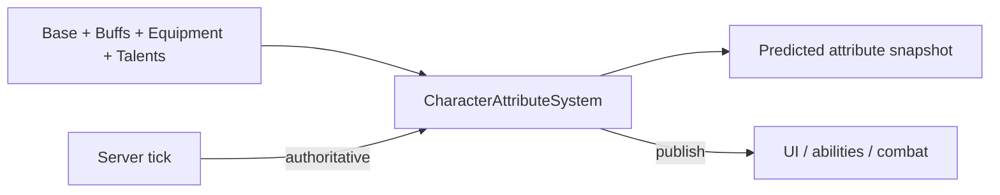

# CharacterAttribute System

**Short description:** A data-driven, template-based attribute framework for FishMMO characters providing hierarchical attribute relationships with formula-driven modifiers, depletable resource management, damage/resistance calculations, tick-based regeneration, and FishNet prediction support via `IPredictableController` (Order=95).

## Table of Contents

- [Overview](#overview)
- [Supported Platforms](#supported-platforms)
- [Features / Capabilities / Security Features](#features--capabilities--security-features)
- [Prerequisites](#prerequisites)
- [Installation / Build](#installation--build)
- [Quick Start Guides](#quick-start-guides)
- [Configuration](#configuration)
- [Usage Examples](#usage-examples)
  - [The attributed-modifier ledger](#the-attributed-modifier-ledger)
- [Operational Checks](#operational-checks)
- [Flow Diagram](#flow-diagram)
- [Project Structure](#project-structure)
- [License](#license)

## Overview

The CharacterAttribute system is a data-driven, template-based attribute framework for FishMMO characters. It provides hierarchical attribute relationships with formula-driven modifiers, depletable resource management (Health, Mana, Stamina), damage/resistance calculations, tick-based regeneration, and FishNet prediction support via `IPredictableController` (Order=95) with `CharacterAttributeResourceState` delta-serialized snapshots.

> Note: See the Detailed File-Level Topology in the parent `Prediction/README.md` (`../README.md#detailed-file-level-topology`) for a file-level call/serialization topology and per-file interactions.

## Supported Platforms

| Platform | Status | Notes |
|----------|--------|-------|
| Windows  | ✅ Supported | Primary development platform |
| Linux    | ✅ Supported | Server and client builds |
| WebGL    | ✅ Supported | Via Unity WebGL export |

Built with **Unity 6.3 LTS** using **IL2CPP** scripting backend.

## Features / Capabilities / Security Features

### Features

- Hierarchical attribute relationships with parent, child, and dependency links
- Formula-driven modifiers (flat bonus, percentage bonus) via ScriptableObject templates
- Depletable resource attributes (Health, Mana, Stamina) with current/max tracking
- Damage and resistance calculations with linked damage/resistance template pairs
- Tick-based regeneration on a **1 second pulse** (`regenTickRate`), delivering a share of the amount authored against a 5 second window (`REGEN_AUTHORING_WINDOW_SECONDS`), so the pulse got finer without getting stronger. A 1 second consumption lockout suppresses regen right after a spend.
- An **attributed-modifier ledger**: every external contribution is keyed by `ModifierSource(Kind, Id, Index)` so it can be restated idempotently and released by contributor, and the server's total is installed as a residual over whatever this peer has attributed
- Two distinct sync paths, because state forwarding is off: the owner reconciles every tick, observers receive `CharacterAttributesBroadcast` / `CharacterResourcesBroadcast` on a change-driven scheduler
- Replicate/Reconcile prediction support via `IPredictableController` (Order=95) and `CharacterAttributeResourceState` snapshots
- Static events for damage, kill, and heal for cross-system integration
- Immortality flag to prevent all damage and kill processing

### Security Features

- Resource state is reconciled from server-authoritative snapshots, preventing client-side resource manipulation
- Damage and kill processing is server-authoritative with client prediction for responsiveness

## Prerequisites

- Unity 6.3 LTS
- FishNetworking (FishNet)
- FishMMO Shared Core

## Installation / Build

This system is an integrated module of the FishMMO Unity project. No separate installation is required.

## Quick Start Guides

1. **Define templates** — Create `CharacterAttributeTemplate` ScriptableObjects for each attribute (e.g., Strength, Health). Configure base values, min/max, clamp settings, and parent/child/dependency relationships.
2. **Add damage/resistance pairs** — Use `DamageAttributeTemplate` for damage types and link each to a `ResistanceAttributeTemplate`.
3. **Assign formulas** — In each template's `Formulas` dictionary, map child templates to `CharacterAttributeFormulaTemplate` assets (`FlatBonusFormulaTemplate` or `PercentageBonusFormulaTemplate`).
4. **Attach controllers** — Add `CharacterAttributeController` and `CharacterDamageController` NetworkBehaviour components to your character prefab.
5. **Runtime wiring** — On initialization the controller calls `AddDependents()` which resolves all parent, child, and dependency links between attribute instances.
6. **External modifiers** — Call `SetSource(ModifierSource, value)` on any attribute to state an item, buff, dungeon-scaling, NPC or region bonus, and `ClearSourceGroup(kind, id)` to release everything one contributor added. These persist across formula recalculations. `SetSource` states a whole contribution rather than adding to one, so restating the same value every tick is idempotent — which is what makes an `OnRegionStay` trigger usable at all.

## Configuration

### Template Properties

Each `CharacterAttributeTemplate` ScriptableObject exposes:

| Property | Description |
|----------|-------------|
| `Value` | Base value set from template or database |
| `MinValue` / `MaxValue` | Clamp bounds for `FinalValue` |
| `ClampFinalValue` | Whether to enforce `[MinValue, MaxValue]` clamping |
| `ParentTypes` | Templates this attribute feeds into as a child input |
| `ChildTypes` | Templates that feed into this attribute's formulas |
| `DependantTypes` | Soft-reference templates for lookups (e.g., regen rate) |
| `Formulas` | `Dictionary<CharacterAttributeTemplate, CharacterAttributeFormulaTemplate>` mapping each child to a formula |

### Formula System

Formulas are ScriptableObjects assigned per-child in `CharacterAttributeTemplate.Formulas`.

| Formula | Calculation |
|---------|-------------|
| `FlatBonusFormulaTemplate` | `bonusAttribute.FinalValue` |
| `PercentageBonusFormulaTemplate` | `bonusAttribute.FinalValue * Percentage` |

### Relationship Model

Templates declare three types of relationships, resolved at runtime into bidirectional links between `CharacterAttribute` instances:

| Relationship | Purpose | Propagation |
|--------------|---------|-------------|
| **Parent** | This attribute feeds into the parent's formulas as a child input. | Automatic upward |
| **Child** | The child feeds into this attribute's formulas as a formula input. | Automatic upward |
| **Dependency** | Soft reference for lookups (e.g., regen rate). No formula involvement. | None |

During `AddDependents()`, the wiring works as follows:
- **ParentTypes**: The parent attribute calls `AddChild(instance)` — this attribute becomes a formula input for the parent.
- **ChildTypes**: This attribute calls `AddChild(childInstance)` — the child becomes a formula input for this attribute.
- **DependantTypes**: This attribute calls `AddDependant(dependantInstance)` — a soft reference for lookups.

## Usage Examples

### Value Calculation API

Each `CharacterAttribute` has four value layers:

| Layer | Description |
|-------|-------------|
| `Value` | Base value, set from template or database. |
| `FormulaModifier` | Derived from child attribute formulas. Reset and recalculated each `ApplyChildren()`. |
| `ExternalModifier` | The **sum of the attributed ledger** — one named entry per contributor (items, buffs, regions, dungeon scaling, NPC bonuses, and the server's residual). Persistent across recalculations. |
| `FinalValue` | `Value + FormulaModifier + ExternalModifier`, optionally clamped to `[MinValue, MaxValue]`. |

```
FinalValue = Clamp(Value + FormulaModifier + ExternalModifier, MinValue, MaxValue)
```

Clamping is only applied when `CharacterAttributeTemplate.ClampFinalValue` is `true`.

The `Modifier` property returns the total: `FormulaModifier + ExternalModifier`.

`CharacterResourceAttribute` adds a fifth layer:

| Layer | Description |
|-------|-------------|
| `CurrentValue` | Depletable float representing current HP/MP/Stamina. Clamped between `0` and `FinalValue`. |

### The attributed-modifier ledger

`ExternalModifier` is not a running total that anyone may add to. It is the sum of a list of
named contributions, each keyed by a `ModifierSource` — a `(Kind, Id, Index)` triple:

| Kind | Id | Index | Written by |
|------|----|-------|-----------|
| `Item` | `Item.ID` | item-attribute template id | `ItemGenerator.ApplyAttributes` |
| `Buff` | buff template id | position in `BonusAttributes` | `AttributeBuffTemplate` and friends |
| `Region` | region `NetworkObject.ObjectId` | authored entry index | `ApplyRegionAttributeAction` |
| `DungeonScaling` | scalar template id | — | `NPC` |
| `NpcBonus` | template id | entry index | `NPC` |
| `Authoritative` | — | — | the server's total, installed as a residual |
| `Unattributed` | — | — | `AddModifier`, which has no production caller |

**Why it exists.** Every contributor used to call `AddModifier(delta)` and nothing recorded who
had added what, so releasing a contribution meant adding its negation and trusting that the value
being subtracted was still the value that had been added. Nothing enforced that. `SetSource`
states a whole contribution instead, so restating it is idempotent and `ClearSourceGroup(kind, id)`
releases everything one contributor wrote whatever it keyed the entries as — which means the apply
and release halves do not have to agree on an index scheme forever.

**The `Index` matters.** Two authored entries may name the same attribute — a flat part and a
scalar part — and a single key per contributor would silently keep only the last of them.

#### The authoritative residual

The server's total arrives at the owner every tick and it already contains every buff and every
equipped item, because the server computed it by applying them. The owner has ALSO applied them
locally, because that is what predicting them means. So the total is installed as a **residual**:

```
Authoritative = serverTotal - (sum of everything this peer has attributed)
ExternalModifier = serverTotal        // by construction
```

This is not compensating for a mistake — the double application is structural and there is no
upstream fix short of giving up prediction of equip and buff bonuses. The residual is what
reconciles the two views, and it can legitimately go **negative** when the owner has predicted a
bonus the server has not granted yet.

**Where it can be briefly wrong.** The residual is derived at install time from whatever was
attributed *then*. If a total lands before its contributor is applied locally, the residual
absorbs the contributor and the next local apply counts it twice — until the next install
re-derives it. That window is **zero** for the reconcile path, because `IPredictableController.Order`
runs `BuffController` (85) and `EquipmentController` (93) before `CharacterAttributeController`
(95) in the same pass, so contributors are settled before the total is installed. For an
out-of-band apply it is one tick.

#### Pooled characters

`RestoreTemplateBaseline` must use `ClearAllModifierSources()`, never `SetModifierDirect(0)`. The
latter installs an authoritative residual of minus the attributed sum — a total of zero today, and
the previous occupant's items and buffs still sitting in the ledger for the next one.

### Network Synchronization

#### Payload Serialization (FishNet Reader/Writer)

The spawn payload has **two shapes**, chosen per connection by `PayloadVisibility.IsOwner`, and
the shape flag is carried in the stream rather than re-derived at read time. The whole block is
framed by a 4-byte length prefix: every `NetworkBehaviour` on an object shares one unframed
buffer, so a reader that stopped early would leave every behaviour after it reading from the
wrong offset. Every defensive abort seeks to the end of the frame before returning.

| Shape | Regular attributes | Resource attributes |
|-------|--------------------|---------------------|
| **Owner** | `(templateID, value)` — base only | `(templateID, value, currentValue)` — base only |
| **Observer** | `(templateID, value, externalModifier)` | `(templateID, value, currentValue, externalModifier)` |

**The external modifier goes to observers only, and the asymmetry is the point.** It is the
server's TOTAL, so it already contains every buff and every equipped item. An observer applies
none of those locally — `BuffController.MaterializeObservedBuffs` deliberately bypasses
`Apply`/`Remove`, and `EquipmentController` equips an observer's items silently — so the total is
the only thing it has and it is complete. The owner DOES apply them locally, as predictions, so
sending it the total as well would double every bonus. The owner instead builds its external
modifier from the buff and equipment restores that follow, and completes it on the first
reconcile's authoritative residual, which is the only thing that carries the region,
dungeon-scaling and NPC-bonus contributions no client can reconstruct.

The owner's resource *current* values are deferred to `OnStartNetwork` rather than applied during
the read: a depletable value is clamped against its maximum, and the owner's maximum is not
complete until the buff and equipment restores have run.

#### Reconcile-Driven Synchronization (unified)

**State forwarding is OFF for playable characters, and that is the intended configuration.**
Observers do not simulate their peers, so there are two distinct delivery paths and they carry
different things:

- **The owner** receives every attribute each prediction tick via `CharacterReconcileData`
  (`Attributes[]` for non-resource attributes, `ResourceState` for HP/MP/Stamina). This is the
  only path that carries the authoritative residual.
- **Observers** receive `CharacterAttributesBroadcast` and `CharacterResourcesBroadcast` — real
  broadcasts, never RPCs, sent to the observer set except the owner. Resources are pushed on a
  scheduler rather than per tick: `observedResourcePushInterval` (6 ticks) in combat and
  `observedResourceOutOfCombatPushInterval` (12 ticks) out of it, and only when something changed.

Derived and diagnostic values stay server-side; an observer is sent what it must display, not the
state that produced it.

| Reconcile field | Carries |
|-----------------|---------|
| `CharacterReconcileData.ResourceState` (`CharacterAttributeResourceState`) | Resource attributes (HP/MP/Stamina) — base value, `CurrentValue`, `NextRegenTick` |
| `CharacterReconcileData.Attributes` (`AttributeReconcileEntry[]`) | Non-resource attributes — `TemplateID`, `Value`, `ExternalModifier` |

`AttributeReconcileEntry[]` uses index-delta compression with a packed 16-bit header
(high bit = delta mode, low 15 bits = entry count) and `ReferenceEquals` fast-pathing:
unchanged ticks contribute **zero bytes**. `FormulaModifier` is intentionally NOT
replicated — it is recomputed locally via the dependency graph in `ApplyChildren()`.

#### Reconciliation

`CharacterAttributeResourceState` is a snapshot struct containing `NextRegenTick`, `Health`, `Mana`, `Stamina`, and max/final caps (`MaxHealth`, `MaxMana`, `MaxStamina`). Used by FishNet's Replicate/Reconcile prediction system via `GetResourceState()` / `ApplyResourceState()`. `NextRegenTick` is the absolute simulation tick at which the next regen pulse fires (replacing the legacy float regen accumulator), which guarantees deterministic client/server agreement on the exact tick a regen pulse fires.

### Prediction Pipeline

`CharacterAttributeController` implements `IPredictableController` (Order=95), running after `BuffController` (80) and `CooldownController` (90), and before `AbilityController` (100). This ensures regenerated resources are available for same-tick ability activation checks.

| Method              | Behaviour                                                                                |
|---------------------|------------------------------------------------------------------------------------------|
| `PopulateInput`     | No-op (attributes have no input)                                                         |
| `OnReplicate`       | Calls `Regenerate(tick)` — fires a regen pulse once the simulation tick reaches the scheduled `nextRegenTick`, then advances it by `regenTickInterval`. During reconcile replay the per-tick `OnAttributeUpdated` notifications are discarded so UI subscribers only react to the authoritative reconcile. |
| `OnCreateReconcile` | Writes `GetResourceState()` to `ResourceState` **and** `CreateAttributeSnapshot()` to `Attributes[]` (sorted by `TemplateID`). The snapshot array is cached and re-emitted across ticks when no attribute mutated, so the delta serializer's `ReferenceEquals` check produces zero network bytes. |
| `OnReconcile`       | Calls `ApplyResourceState(rd.ResourceState)` **and** `ApplyAttributeSnapshot(rd.Attributes)` to restore authoritative values. Dirty-tracking is suppressed during the restore so the cached snapshot retains identity. |

#### CharacterAttributeResourceState

| Field             | Type    | Description                                                  |
|-------------------|---------|--------------------------------------------------------------|
| `NextRegenTick`   | `uint`  | Absolute simulation tick at which the next regen pulse fires |
| `Health`          | `float` | Current health resource value                                |
| `MaxHealth`       | `int`   | Maximum health (FinalValue of health attribute)              |
| `Mana`            | `float` | Current mana resource value                                  |
| `MaxMana`         | `int`   | Maximum mana (FinalValue of mana attribute)                  |
| `Stamina`         | `float` | Current stamina resource value                               |
| `MaxStamina`      | `int`   | Maximum stamina (FinalValue of stamina attribute)            |

Delta serialization uses a 7-bit byte bitmask — only changed fields are transmitted, typically 3-4 bytes instead of 28.

> **Lifecycle note (defensive guard, 2025 audit):**
> `regenTickInterval` is computed in `OnStartNetwork` from `TimeManager.TickDelta` and is also explicitly cleared by `ResetState`. The `Regenerate()` path early-returns when `regenTickInterval == 0`, so a reset instance cannot tick at a stale rate before the next `OnStartNetwork` re-initialization. This guards object-pool / re-spawn reuse paths.

> **EditMode / unit-test note:**
> `CharacterAttributeResourceStateSerializer.RegisterSerializers` is decorated with `[RuntimeInitializeOnLoadMethod(BeforeSceneLoad)]`, which only fires in PlayMode. EditMode tests must invoke the registration method via reflection during fixture setup before exercising `GenericDeltaWriter<CharacterAttributeResourceState>.Write` / `GenericDeltaReader<CharacterAttributeResourceState>.Read`. See `Assets/UnitTests/Prediction/CharacterAttributeResourceStateSerializerTests.cs` for the canonical pattern.

### Static Events

| Event (on `ICharacterDamageController`) | Signature |
|-----------------------------------------|-----------|
| `OnDamaged` | `Action<ICharacter, ICharacter, int, DamageAttributeTemplate>` |
| `OnKilled` | `Action<ICharacter, ICharacter>` |
| `OnResurrected` | `Action<ICharacter, ICharacter>` |
| `OnHealed` | `Action<ICharacter, ICharacter, int>` |

### External Integration Points

The attribute system is consumed by many other systems:

- **Ability System** — Checks/consumes mana, applies damage via attributes.
- **Buff System** — States and releases external modifiers via `SetSource(ModifierSource.Buff(templateID, entryIndex), value)` / `ClearSourceGroup(ModifierSourceKind.Buff, templateID)`. A stacking buff restates `(1 + Stacks) * Value`; it does not add a delta per stack.
- **Item System** — `ItemGenerator.ApplyAttributes` states one entry per item attribute under `ModifierSource.Item(item.ID, attributeTemplateID)`; `RemoveAttributes` releases the contributor. An item with no database identity yet (`ID == 0`) writes nothing — see the Item README.
- **Quest System** — Checks attribute prerequisites.
- **KCC (Movement)** — Reads stamina for sprint/jump.
- **Party System** — Gets health percentages (`CurrentValue / FinalValue`).
- **UI** — Resource bars, target frames, pet controls.
- **Region Effects** — `ApplyRegionAttributeAction` states `ModifierSource.Region(regionObjectID, entryIndex)`; leaving releases every entry that region wrote.
- **Pet System** — Manages pet attributes.
- **Achievement System** — Tracks damage/heal/kill milestones.
- **Faction System** — Adjusted on kill events.
- **Database Layer** — Persists/loads via `CharacterAttributeData` DTO and `ICharacterAttributeService`.

Every external system writes through the **attributed-modifier ledger** (`ModifierSource`), so
`ExternalModifier` is the sum of named contributions rather than an anonymous running total, and
each contributor can be released without knowing what anyone else added. See
[The attributed-modifier ledger](#the-attributed-modifier-ledger) below.

`AddModifier(amount)` still exists and writes into the `Unattributed` bucket. It has no production
caller and should not gain one: nothing can release an unattributed contribution except by adding
its negation, which is the failure the ledger exists to end.

## Operational Checks

| Check | How to Verify | Expected Result |
|-------|---------------|-----------------|
| Attribute templates loaded | Open `CharacterAttributeTemplateDatabase` in Inspector | All attribute templates listed |
| Parent/child wiring | Enter Play mode, inspect `CharacterAttributeController` | Attributes show correct parent/child links |
| Formula propagation | Modify a child attribute's base value | Parent `FinalValue` updates automatically |
| External modifier persistence | Apply a buff, then trigger formula recalculation | `ExternalModifier` value unchanged |
| Ledger release | Equip an item, note `ExternalModifier`, unequip it | Returns to exactly the pre-equip value, with the item's entry gone from `ModifierSourceCount` |
| Damage/resistance calculation | Deal damage with a `DamageAttributeTemplate` | Health reduced by `RawDamage - Resistance.FinalValue` (clamped ≥ 0) |
| Regeneration tick | Wait `regenTickRate` seconds (default **1.0**) in Play mode with regen attributes set | Resource `CurrentValue` increases by one pulse's share |
| Network sync (owner)    | Modify any attribute server-side          | Owner receives the change in the next `CharacterReconcileData` (resources via `ResourceState`, others via `Attributes[]`) |
| Network sync (observer) | Modify another character's attribute      | Observer receives the change via FishNet Prediction V2 state forwarding (no broadcast)                                   |
| Reconciliation | Simulate prediction mismatch | `ApplyResourceState()` corrects client resource values |
| Immortality flag | Set `Immortal = true`, apply damage | No health change, no `OnDamaged` event |

## Flow Diagram

### High-Level Overview



### Value Calculation Flow

```
┌─────────────────┐
│  Value (Base)    │
└────────┬────────┘
         │
         ▼
┌──────────────────────┐     ┌──────────────────────────┐
│  ApplyChildren()     │◄────│  Child Attributes        │
│  Reset FormulaModifier│     │  (via Template.Formulas) │
│  Sum formula results │     └──────────────────────────┘
└────────┬─────────────┘
         │
         ▼
┌──────────────────────┐
│  FormulaModifier     │
└────────┬─────────────┘
         │
         ▼
┌──────────────────────────────────────────────────────┐
│  FinalValue = Value + FormulaModifier + ExternalModifier │
│  (Clamped to [MinValue, MaxValue] if enabled)        │
└────────┬─────────────────────────────────────────────┘
         │
         ▼
┌───────────────────────────────┐
│  If FinalValue changed →      │
│  Propagate upward to parents  │
│  Fire OnAttributeUpdated      │
└───────────────────────────────┘
```

### Propagation Flow

1. An attribute's base `Value` or `ExternalModifier` changes.
2. `UpdateValues()` calls `ApplyChildren()` which resets `FormulaModifier` to `0`.
3. For each entry in `Template.Formulas`, the matching child attribute is found and `CalculateBonus()` is called.
4. All formula results are summed into `FormulaModifier`.
5. `FinalValue` is recalculated as `Value + FormulaModifier + ExternalModifier`.
6. If `FinalValue` changed, propagation continues upward to all parent attributes.
7. `OnAttributeUpdated` fires after each recalculation.

**Key design**: `ApplyChildren()` only resets `FormulaModifier`. The `ExternalModifier` (from items, buffs, regions) is preserved across recalculations, ensuring equipment and buff bonuses are never lost during formula propagation.

### Damage and Resistance Flow

```
┌────────────────────┐
│  Raw Damage Input   │
└────────┬───────────┘
         │
         ▼
┌────────────────────────────────────────────────────────┐
│  EffectiveDamage = Clamp(RawDamage - Resistance, 0, 999999) │
└────────┬───────────────────────────────────────────────┘
         │
         ▼
┌──────────────────────────────────────┐
│  CharacterDamageController           │
│  ├─ Apply resistance modifiers       │
│  ├─ Consume health                   │
│  ├─ Fire OnDamaged                   │
│  ├─ Track achievements               │
│  └─ Kill if health reaches zero      │
└──────────────────────────────────────┘
```

The `CharacterDamageController` handles:
- **Damage**: Applies resistance modifiers, consumes health, fires `OnDamaged`, tracks achievements, triggers `Kill` if health reaches zero.
- **Kill**: Adjusts faction, fires ECA kill triggers, cancels active ability, triggers death animation, fires `OnKilled`. Buff removal and pet despawning are handled by the server-side `OnKilled` subscriber. Re-entry is guarded by `CharacterFlags.IsDead`, which `Kill` does not set itself — the server's `OnKilled` subscriber does, which is why that subscriber sets the flag *before* it runs anything else (buff removal invokes each buff's removal effects, i.e. game logic).
  `OnKilled` is dispatched per-subscriber with failures caught. Its subscribers include one `AggressionState` per aggressive NPC, registered at runtime; a plain multicast invoke would abandon the rest of the list at the first exception, and the list includes the handler that flags the death and notifies the client. `OnDamaged`/`OnHealed` are deliberately *not* isolated — `GetInvocationList` allocates per call, which is fine for a death and not for something raised on every hit.
- **Revive**: Resurrects a dead character via `ResourceInstance.Gain()`, fires `OnResurrected`, resets death animation, fires ECA resurrect triggers. **Clears `CharacterFlags.IsDead` itself**, before restoring health — see *The dead-state invariant* below.
- **Heal**: Gains health, fires `OnHealed`, tracks achievements. No-op on dead characters.
- **CompleteHeal**: Restores health to `FinalValue`. No-op on dead characters.

### The dead-state invariant

**A character has health above zero if and only if it is not dead.** Every path that could
break that has been closed, because the two halves disagreeing is worse than either state
alone: `Kill` early-returns on the flag, so a character that is flagged dead with health can
never be killed again, while `Heal` only tests health, so it starts working on that same
character.

| Path | Rule |
|---|---|
| `Heal` / `CompleteHeal` | Refuse at `CurrentValue <= 0`. |
| `Damage` | Refuses at `CurrentValue <= 0` — a corpse takes no further damage. |
| `Revive` | The only sanctioned route from zero. Clears `IsDead` *and* restores health, so no caller can do one without the other. |
| `Regenerate` | Skips entirely while health is depleted — health, mana and stamina alike. |
| `AbilityController` | Refuses to *start* an activation while not alive. |

> **Why these test health and not `CharacterFlags.IsDead`.** All of them run in the predicted
> replicate path, and `Flags` travels only in the spawn payload — it is never re-synced. A
> client's copy is therefore stale from its first death onward, so gating on it would make
> client and server disagree about every later heal, regen pulse and cast. Resource state is
> reconciled to the owner every tick, so both sides reach the same answer for the same tick.
> Code that runs *once at spawn* — restoring the death pose, opening the death dialog — uses
> the flag instead, because it is fresh at that moment and is the server's authoritative
> marker.

> **Regeneration previously resurrected corpses.** `Regenerate` had no death check at all, so
> health ticked back up from zero on its own: the character became alive by the only measure
> anything tests while `IsDead` stayed set, producing exactly the unkillable-but-healable
> state above. The schedule is advanced *before* the death check so a revived character
> resumes on the normal beat rather than firing an immediate catch-up pulse.
- **Immortal**: Flag that prevents all damage and kill processing.

### Regeneration Flow

`CharacterAttributeController.Regenerate()` uses a configurable tick rate (`regenTickRate`, default 5.0 seconds):

1. Converts `regenTickRate` into an integer `regenTickInterval` (ticks) from `TimeManager.TickDelta`.
2. Fires when the simulation tick reaches the scheduled `nextRegenTick`, then advances `nextRegenTick` by `regenTickInterval`.
3. For each resource (Health, Mana, Stamina), looks up the regeneration attribute via dependency and calls `RegenerateResource(...)`.

Regeneration attributes (HealthRegeneration, ManaRegeneration, StaminaRegeneration) are **dependencies** of their corresponding resource attribute.

## Project Structure

### Directory Structure

```
CharacterAttribute/
├── CharacterAttribute.cs                  # Runtime attribute instance (value layers, formula propagation)
├── CharacterResourceAttribute.cs          # Depletable resource (HP/MP/Stamina) with CurrentValue
├── CharacterAttributeController.cs        # Per-entity controller (CharacterBehaviour, ICharacterAttributeController, IPredictableController Order=95)
├── CharacterDamageController.cs           # Damage, heal, and kill logic (CharacterBehaviour, ICharacterDamageController)
├── CharacterAttributeResourceState.cs     # Snapshot struct for resource reconciliation [UseGlobalCustomSerializer]
├── CharacterAttributeResourceStateSerializer.cs # Regular + delta serializer; [RuntimeInitializeOnLoadMethod(BeforeSceneLoad)] registers the delta delegates
├── AttributeReconcileEntry.cs             # Snapshot entry for NON-resource attributes (Value + ExternalModifier) with index-delta WriteArrayDelta/ReadArrayDelta
└── Template/
    ├── CharacterAttributeTemplate.cs          # ScriptableObject blueprint (value, bounds, relationships, formulas)
    ├── CharacterAttributeTemplateDatabase.cs  # Master list of all templates
    ├── CharacterAttributeFormulaTemplate.cs   # Abstract formula base
    ├── DamageAttributeTemplate.cs             # Damage type with linked resistance
    ├── ResistanceAttributeTemplate.cs         # Resistance type marker
    └── Formulas/
        ├── FlatBonusFormulaTemplate.cs            # Flat bonus formula (bonusAttribute.FinalValue)
        └── PercentageBonusFormulaTemplate.cs      # Percentage bonus formula (bonusAttribute.FinalValue * Percentage)
```

#### Related Files (Outside This Directory)

```
Shared/Core/Entity/Prediction/CharacterAttribute/                                    # Core interfaces (ICharacterAttributeController, ICharacterDamageController)
Shared/Implementation/Entity/Prediction/CharacterPredictionController.cs             # Drives OnReplicate / OnCreateReconcile / OnReconcile
Shared/Implementation/Entity/Prediction/CharacterReconcileData.cs                    # Carries ResourceState + Attributes[] in the unified snapshot
Shared/Implementation/Entity/Prediction/CharacterReconcileDataDeltaSerializer.cs     # Invokes the resource bitmask + AttributeReconcileEntry index-delta
```

### Inheritance Hierarchies

#### Runtime Instances

```
CharacterAttribute
└── CharacterResourceAttribute
```

#### Templates (ScriptableObjects)

```
CachedScriptableObject<CharacterAttributeTemplate>
└── CharacterAttributeTemplate
    ├── DamageAttributeTemplate
    └── ResistanceAttributeTemplate

FormulaTemplate<CharacterAttribute>
└── CharacterAttributeFormulaTemplate
    ├── FlatBonusFormulaTemplate
    └── PercentageBonusFormulaTemplate
```

#### Controllers (NetworkBehaviour)

```
CharacterBehaviour
├── CharacterAttributeController : ICharacterAttributeController, IPredictableController (Order=95)
└── CharacterDamageController    : ICharacterDamageController, IDamageable, IHealable
```

## License

This project is subject to the FishMMO project license.
