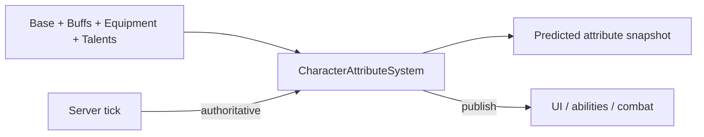

# CharacterAttribute System

**Short description:** A data-driven, template-based attribute framework for FishMMO characters providing hierarchical attribute relationships with formula-driven modifiers, depletable resource management, damage/resistance calculations, tick-based regeneration, and FishNet prediction support via `IPredictableController` (Order=95).

## Table of Contents

- [Overview](#overview)
- [Supported Platforms](#supported-platforms)
- [Features / Capabilities / Security Features](#features--capabilities--security-features)
- [Prerequisites](#prerequisites)
- [Installation / Build](#installation--build)
- [Quick Start Guides](#quick-start-guides)
- [Configuration](#configuration)
- [Usage Examples](#usage-examples)
- [Operational Checks](#operational-checks)
- [Flow Diagram](#flow-diagram)
- [Project Structure](#project-structure)
- [License](#license)

## Overview

The CharacterAttribute system is a data-driven, template-based attribute framework for FishMMO characters. It provides hierarchical attribute relationships with formula-driven modifiers, depletable resource management (Health, Mana, Stamina), damage/resistance calculations, tick-based regeneration, and FishNet prediction support via `IPredictableController` (Order=95) with `CharacterAttributeResourceState` delta-serialized snapshots.

> Note: See the Detailed File-Level Topology in the parent `Prediction/README.md` (`../README.md#detailed-file-level-topology`) for a file-level call/serialization topology and per-file interactions.

## Supported Platforms

| Platform | Status | Notes |
|----------|--------|-------|
| Windows  | ✅ Supported | Primary development platform |
| Linux    | ✅ Supported | Server and client builds |
| WebGL    | ✅ Supported | Via Unity WebGL export |

Built with **Unity 6.3 LTS** using **IL2CPP** scripting backend.

## Features / Capabilities / Security Features

### Features

- Hierarchical attribute relationships with parent, child, and dependency links
- Formula-driven modifiers (flat bonus, percentage bonus) via ScriptableObject templates
- Depletable resource attributes (Health, Mana, Stamina) with current/max tracking
- Damage and resistance calculations with linked damage/resistance template pairs
- Tick-based regeneration (configurable `regenTickRate`, default 5 seconds) for resource attributes
- External modifier accumulation from items, buffs, and region effects — preserved across formula recalculations
- FishNet network synchronization with owner and observer broadcast paths
- Replicate/Reconcile prediction support via `IPredictableController` (Order=95) and `CharacterAttributeResourceState` snapshots
- Static events for damage, kill, and heal for cross-system integration
- Immortality flag to prevent all damage and kill processing

### Security Features

- Resource state is reconciled from server-authoritative snapshots, preventing client-side resource manipulation
- Damage and kill processing is server-authoritative with client prediction for responsiveness

## Prerequisites

- Unity 6.3 LTS
- FishNetworking (FishNet)
- FishMMO Shared Core

## Installation / Build

This system is an integrated module of the FishMMO Unity project. No separate installation is required.

## Quick Start Guides

1. **Define templates** — Create `CharacterAttributeTemplate` ScriptableObjects for each attribute (e.g., Strength, Health). Configure base values, min/max, clamp settings, and parent/child/dependency relationships.
2. **Add damage/resistance pairs** — Use `DamageAttributeTemplate` for damage types and link each to a `ResistanceAttributeTemplate`.
3. **Assign formulas** — In each template's `Formulas` dictionary, map child templates to `CharacterAttributeFormulaTemplate` assets (`FlatBonusFormulaTemplate` or `PercentageBonusFormulaTemplate`).
4. **Attach controllers** — Add `CharacterAttributeController` and `CharacterDamageController` NetworkBehaviour components to your character prefab.
5. **Runtime wiring** — On initialization the controller calls `AddDependents()` which resolves all parent, child, and dependency links between attribute instances.
6. **External modifiers** — Call `AddModifier(amount)` on any attribute to apply item, buff, or region bonuses. These persist across formula recalculations.

## Configuration

### Template Properties

Each `CharacterAttributeTemplate` ScriptableObject exposes:

| Property | Description |
|----------|-------------|
| `Value` | Base value set from template or database |
| `MinValue` / `MaxValue` | Clamp bounds for `FinalValue` |
| `ClampFinalValue` | Whether to enforce `[MinValue, MaxValue]` clamping |
| `ParentTypes` | Templates this attribute feeds into as a child input |
| `ChildTypes` | Templates that feed into this attribute's formulas |
| `DependantTypes` | Soft-reference templates for lookups (e.g., regen rate) |
| `Formulas` | `Dictionary<CharacterAttributeTemplate, CharacterAttributeFormulaTemplate>` mapping each child to a formula |

### Formula System

Formulas are ScriptableObjects assigned per-child in `CharacterAttributeTemplate.Formulas`.

| Formula | Calculation |
|---------|-------------|
| `FlatBonusFormulaTemplate` | `bonusAttribute.FinalValue` |
| `PercentageBonusFormulaTemplate` | `bonusAttribute.FinalValue * Percentage` |

### Relationship Model

Templates declare three types of relationships, resolved at runtime into bidirectional links between `CharacterAttribute` instances:

| Relationship | Purpose | Propagation |
|--------------|---------|-------------|
| **Parent** | This attribute feeds into the parent's formulas as a child input. | Automatic upward |
| **Child** | The child feeds into this attribute's formulas as a formula input. | Automatic upward |
| **Dependency** | Soft reference for lookups (e.g., regen rate). No formula involvement. | None |

During `AddDependents()`, the wiring works as follows:
- **ParentTypes**: The parent attribute calls `AddChild(instance)` — this attribute becomes a formula input for the parent.
- **ChildTypes**: This attribute calls `AddChild(childInstance)` — the child becomes a formula input for this attribute.
- **DependantTypes**: This attribute calls `AddDependant(dependantInstance)` — a soft reference for lookups.

## Usage Examples

### Value Calculation API

Each `CharacterAttribute` has four value layers:

| Layer | Description |
|-------|-------------|
| `Value` | Base value, set from template or database. |
| `FormulaModifier` | Derived from child attribute formulas. Reset and recalculated each `ApplyChildren()`. |
| `ExternalModifier` | Accumulated from external sources (items, buffs, regions). Persistent across recalculations. |
| `FinalValue` | `Value + FormulaModifier + ExternalModifier`, optionally clamped to `[MinValue, MaxValue]`. |

```
FinalValue = Clamp(Value + FormulaModifier + ExternalModifier, MinValue, MaxValue)
```

Clamping is only applied when `CharacterAttributeTemplate.ClampFinalValue` is `true`.

The `Modifier` property returns the total: `FormulaModifier + ExternalModifier`.

`CharacterResourceAttribute` adds a fifth layer:

| Layer | Description |
|-------|-------------|
| `CurrentValue` | Depletable float representing current HP/MP/Stamina. Clamped between `0` and `FinalValue`. |

### Network Synchronization

#### Payload Serialization (FishNet Reader/Writer)

- **WritePayload**: Writes `(templateID, value)` for regular attributes; `(templateID, value, currentValue)` for resource attributes. Used during initial spawn / state transfer only.
- **ReadPayload**: Reads and applies via `SetAttribute()` / `SetResourceAttribute()`.

#### Reconcile-Driven Synchronization (unified)

**There are no client broadcast handlers for attributes.** Both base (non-resource) and
resource attributes are replicated each prediction tick via `CharacterReconcileData`
and reach owner *and* observers automatically through FishNet Prediction V2 state
forwarding. The previous `CharacterAttributeUpdateBroadcast` /
`CharacterAttributeUpdateMultipleBroadcast` / `CharacterObserverAttributeUpdateBroadcast`
types were removed entirely along with the per-tick dirty-flush pipeline.

| Reconcile field | Carries |
|-----------------|---------|
| `CharacterReconcileData.ResourceState` (`CharacterAttributeResourceState`) | Resource attributes (HP/MP/Stamina) — base value, `CurrentValue`, `NextRegenTick` |
| `CharacterReconcileData.Attributes` (`AttributeReconcileEntry[]`) | Non-resource attributes — `TemplateID`, `Value`, `ExternalModifier` |

`AttributeReconcileEntry[]` uses index-delta compression with a packed 16-bit header
(high bit = delta mode, low 15 bits = entry count) and `ReferenceEquals` fast-pathing:
unchanged ticks contribute **zero bytes**. `FormulaModifier` is intentionally NOT
replicated — it is recomputed locally via the dependency graph in `ApplyChildren()`.

#### Reconciliation

`CharacterAttributeResourceState` is a snapshot struct containing `NextRegenTick`, `Health`, `Mana`, `Stamina`, and max/final caps (`MaxHealth`, `MaxMana`, `MaxStamina`). Used by FishNet's Replicate/Reconcile prediction system via `GetResourceState()` / `ApplyResourceState()`. `NextRegenTick` is the absolute simulation tick at which the next regen pulse fires (replacing the legacy float regen accumulator), which guarantees deterministic client/server agreement on the exact tick a regen pulse fires.

### Prediction Pipeline

`CharacterAttributeController` implements `IPredictableController` (Order=95), running after `BuffController` (80) and `CooldownController` (90), and before `AbilityController` (100). This ensures regenerated resources are available for same-tick ability activation checks.

| Method              | Behaviour                                                                                |
|---------------------|------------------------------------------------------------------------------------------|
| `PopulateInput`     | No-op (attributes have no input)                                                         |
| `OnReplicate`       | Calls `Regenerate(tick)` — fires a regen pulse once the simulation tick reaches the scheduled `nextRegenTick`, then advances it by `regenTickInterval`. During reconcile replay the per-tick `OnAttributeUpdated` notifications are discarded so UI subscribers only react to the authoritative reconcile. |
| `OnCreateReconcile` | Writes `GetResourceState()` to `ResourceState` **and** `CreateAttributeSnapshot()` to `Attributes[]` (sorted by `TemplateID`). The snapshot array is cached and re-emitted across ticks when no attribute mutated, so the delta serializer's `ReferenceEquals` check produces zero network bytes. |
| `OnReconcile`       | Calls `ApplyResourceState(rd.ResourceState)` **and** `ApplyAttributeSnapshot(rd.Attributes)` to restore authoritative values. Dirty-tracking is suppressed during the restore so the cached snapshot retains identity. |

#### CharacterAttributeResourceState

| Field             | Type    | Description                                                  |
|-------------------|---------|--------------------------------------------------------------|
| `NextRegenTick`   | `uint`  | Absolute simulation tick at which the next regen pulse fires |
| `Health`          | `float` | Current health resource value                                |
| `MaxHealth`       | `int`   | Maximum health (FinalValue of health attribute)              |
| `Mana`            | `float` | Current mana resource value                                  |
| `MaxMana`         | `int`   | Maximum mana (FinalValue of mana attribute)                  |
| `Stamina`         | `float` | Current stamina resource value                               |
| `MaxStamina`      | `int`   | Maximum stamina (FinalValue of stamina attribute)            |

Delta serialization uses a 7-bit byte bitmask — only changed fields are transmitted, typically 3-4 bytes instead of 28.

> **Lifecycle note (defensive guard, 2025 audit):**
> `regenTickInterval` is computed in `OnStartNetwork` from `TimeManager.TickDelta` and is also explicitly cleared by `ResetState`. The `Regenerate()` path early-returns when `regenTickInterval == 0`, so a reset instance cannot tick at a stale rate before the next `OnStartNetwork` re-initialization. This guards object-pool / re-spawn reuse paths.

> **EditMode / unit-test note:**
> `CharacterAttributeResourceStateSerializer.RegisterSerializers` is decorated with `[RuntimeInitializeOnLoadMethod(BeforeSceneLoad)]`, which only fires in PlayMode. EditMode tests must invoke the registration method via reflection during fixture setup before exercising `GenericDeltaWriter<CharacterAttributeResourceState>.Write` / `GenericDeltaReader<CharacterAttributeResourceState>.Read`. See `Assets/UnitTests/Prediction/CharacterAttributeResourceStateSerializerTests.cs` for the canonical pattern.

### Static Events

| Event (on `ICharacterDamageController`) | Signature |
|-----------------------------------------|-----------|
| `OnDamaged` | `Action<ICharacter, ICharacter, int, DamageAttributeTemplate>` |
| `OnKilled` | `Action<ICharacter, ICharacter>` |
| `OnResurrected` | `Action<ICharacter, ICharacter>` |
| `OnHealed` | `Action<ICharacter, ICharacter, int>` |

### External Integration Points

The attribute system is consumed by many other systems:

- **Ability System** — Checks/consumes mana, applies damage via attributes.
- **Buff System** — Applies/removes external modifiers via `AddModifier()` / `AddModifier(-amount)`.
- **Item System** — Applies item attribute bonuses via `AddModifier()` on equip, reversed on unequip.
- **Quest System** — Checks attribute prerequisites.
- **KCC (Movement)** — Reads stamina for sprint/jump.
- **Party System** — Gets health percentages (`CurrentValue / FinalValue`).
- **UI** — Resource bars, target frames, pet controls.
- **Region Effects** — Zone-based attribute modification via `AddModifier()`.
- **Pet System** — Manages pet attributes.
- **Achievement System** — Tracks damage/heal/kill milestones.
- **Faction System** — Adjusted on kill events.
- **Database Layer** — Persists/loads via `CharacterAttributeData` DTO and `ICharacterAttributeService`.

All external systems use `AddModifier()` / `SetModifier()` which operate on `ExternalModifier`, ensuring their contributions are never overwritten by the formula recalculation system.

## Operational Checks

| Check | How to Verify | Expected Result |
|-------|---------------|-----------------|
| Attribute templates loaded | Open `CharacterAttributeTemplateDatabase` in Inspector | All attribute templates listed |
| Parent/child wiring | Enter Play mode, inspect `CharacterAttributeController` | Attributes show correct parent/child links |
| Formula propagation | Modify a child attribute's base value | Parent `FinalValue` updates automatically |
| External modifier persistence | Apply a buff, then trigger formula recalculation | `ExternalModifier` value unchanged |
| Damage/resistance calculation | Deal damage with a `DamageAttributeTemplate` | Health reduced by `RawDamage - Resistance.FinalValue` (clamped ≥ 0) |
| Regeneration tick | Wait for `regenTickRate` seconds (default 5.0) in Play mode with regen attributes set | Resource `CurrentValue` increases by regen amount |
| Network sync (owner)    | Modify any attribute server-side          | Owner receives the change in the next `CharacterReconcileData` (resources via `ResourceState`, others via `Attributes[]`) |
| Network sync (observer) | Modify another character's attribute      | Observer receives the change via FishNet Prediction V2 state forwarding (no broadcast)                                   |
| Reconciliation | Simulate prediction mismatch | `ApplyResourceState()` corrects client resource values |
| Immortality flag | Set `Immortal = true`, apply damage | No health change, no `OnDamaged` event |

## Flow Diagram

### High-Level Overview



### Value Calculation Flow

```
┌─────────────────┐
│  Value (Base)    │
└────────┬────────┘
         │
         ▼
┌──────────────────────┐     ┌──────────────────────────┐
│  ApplyChildren()     │◄────│  Child Attributes        │
│  Reset FormulaModifier│     │  (via Template.Formulas) │
│  Sum formula results │     └──────────────────────────┘
└────────┬─────────────┘
         │
         ▼
┌──────────────────────┐
│  FormulaModifier     │
└────────┬─────────────┘
         │
         ▼
┌──────────────────────────────────────────────────────┐
│  FinalValue = Value + FormulaModifier + ExternalModifier │
│  (Clamped to [MinValue, MaxValue] if enabled)        │
└────────┬─────────────────────────────────────────────┘
         │
         ▼
┌───────────────────────────────┐
│  If FinalValue changed →      │
│  Propagate upward to parents  │
│  Fire OnAttributeUpdated      │
└───────────────────────────────┘
```

### Propagation Flow

1. An attribute's base `Value` or `ExternalModifier` changes.
2. `UpdateValues()` calls `ApplyChildren()` which resets `FormulaModifier` to `0`.
3. For each entry in `Template.Formulas`, the matching child attribute is found and `CalculateBonus()` is called.
4. All formula results are summed into `FormulaModifier`.
5. `FinalValue` is recalculated as `Value + FormulaModifier + ExternalModifier`.
6. If `FinalValue` changed, propagation continues upward to all parent attributes.
7. `OnAttributeUpdated` fires after each recalculation.

**Key design**: `ApplyChildren()` only resets `FormulaModifier`. The `ExternalModifier` (from items, buffs, regions) is preserved across recalculations, ensuring equipment and buff bonuses are never lost during formula propagation.

### Damage and Resistance Flow

```
┌────────────────────┐
│  Raw Damage Input   │
└────────┬───────────┘
         │
         ▼
┌────────────────────────────────────────────────────────┐
│  EffectiveDamage = Clamp(RawDamage - Resistance, 0, 999999) │
└────────┬───────────────────────────────────────────────┘
         │
         ▼
┌──────────────────────────────────────┐
│  CharacterDamageController           │
│  ├─ Apply resistance modifiers       │
│  ├─ Consume health                   │
│  ├─ Fire OnDamaged                   │
│  ├─ Track achievements               │
│  └─ Kill if health reaches zero      │
└──────────────────────────────────────┘
```

The `CharacterDamageController` handles:
- **Damage**: Applies resistance modifiers, consumes health, fires `OnDamaged`, tracks achievements, triggers `Kill` if health reaches zero.
- **Kill**: Adjusts faction, fires ECA kill triggers, cancels active ability, triggers death animation, fires `OnKilled`. Buff removal and pet despawning are handled by the server-side `OnKilled` subscriber.
- **Revive**: Resurrects a dead character via `ResourceInstance.Gain()`, fires `OnResurrected`, resets death animation, fires ECA resurrect triggers.
- **Heal**: Gains health, fires `OnHealed`, tracks achievements. No-op on dead characters.
- **CompleteHeal**: Restores health to `FinalValue`. No-op on dead characters.
- **Immortal**: Flag that prevents all damage and kill processing.

### Regeneration Flow

`CharacterAttributeController.Regenerate()` uses a configurable tick rate (`regenTickRate`, default 5.0 seconds):

1. Converts `regenTickRate` into an integer `regenTickInterval` (ticks) from `TimeManager.TickDelta`.
2. Fires when the simulation tick reaches the scheduled `nextRegenTick`, then advances `nextRegenTick` by `regenTickInterval`.
3. For each resource (Health, Mana, Stamina), looks up the regeneration attribute via dependency and calls `RegenerateResource(...)`.

Regeneration attributes (HealthRegeneration, ManaRegeneration, StaminaRegeneration) are **dependencies** of their corresponding resource attribute.

## Project Structure

### Directory Structure

```
CharacterAttribute/
├── CharacterAttribute.cs                  # Runtime attribute instance (value layers, formula propagation)
├── CharacterResourceAttribute.cs          # Depletable resource (HP/MP/Stamina) with CurrentValue
├── CharacterAttributeController.cs        # Per-entity controller (CharacterBehaviour, ICharacterAttributeController, IPredictableController Order=95)
├── CharacterDamageController.cs           # Damage, heal, and kill logic (CharacterBehaviour, ICharacterDamageController)
├── CharacterAttributeResourceState.cs     # Snapshot struct for resource reconciliation [UseGlobalCustomSerializer]
├── CharacterAttributeResourceStateSerializer.cs # Regular + delta serializer; [RuntimeInitializeOnLoadMethod(BeforeSceneLoad)] registers the delta delegates
├── AttributeReconcileEntry.cs             # Snapshot entry for NON-resource attributes (Value + ExternalModifier) with index-delta WriteArrayDelta/ReadArrayDelta
└── Template/
    ├── CharacterAttributeTemplate.cs          # ScriptableObject blueprint (value, bounds, relationships, formulas)
    ├── CharacterAttributeTemplateDatabase.cs  # Master list of all templates
    ├── CharacterAttributeFormulaTemplate.cs   # Abstract formula base
    ├── DamageAttributeTemplate.cs             # Damage type with linked resistance
    ├── ResistanceAttributeTemplate.cs         # Resistance type marker
    └── Formulas/
        ├── FlatBonusFormulaTemplate.cs            # Flat bonus formula (bonusAttribute.FinalValue)
        └── PercentageBonusFormulaTemplate.cs      # Percentage bonus formula (bonusAttribute.FinalValue * Percentage)
```

#### Related Files (Outside This Directory)

```
Shared/Core/Entity/Prediction/CharacterAttribute/                                    # Core interfaces (ICharacterAttributeController, ICharacterDamageController)
Shared/Implementation/Entity/Prediction/CharacterPredictionController.cs             # Drives OnReplicate / OnCreateReconcile / OnReconcile
Shared/Implementation/Entity/Prediction/CharacterReconcileData.cs                    # Carries ResourceState + Attributes[] in the unified snapshot
Shared/Implementation/Entity/Prediction/CharacterReconcileDataDeltaSerializer.cs     # Invokes the resource bitmask + AttributeReconcileEntry index-delta
```

### Inheritance Hierarchies

#### Runtime Instances

```
CharacterAttribute
└── CharacterResourceAttribute
```

#### Templates (ScriptableObjects)

```
CachedScriptableObject<CharacterAttributeTemplate>
└── CharacterAttributeTemplate
    ├── DamageAttributeTemplate
    └── ResistanceAttributeTemplate

FormulaTemplate<CharacterAttribute>
└── CharacterAttributeFormulaTemplate
    ├── FlatBonusFormulaTemplate
    └── PercentageBonusFormulaTemplate
```

#### Controllers (NetworkBehaviour)

```
CharacterBehaviour
├── CharacterAttributeController : ICharacterAttributeController, IPredictableController (Order=95)
└── CharacterDamageController    : ICharacterDamageController, IDamageable, IHealable
```

## License

This project is subject to the FishMMO project license.
