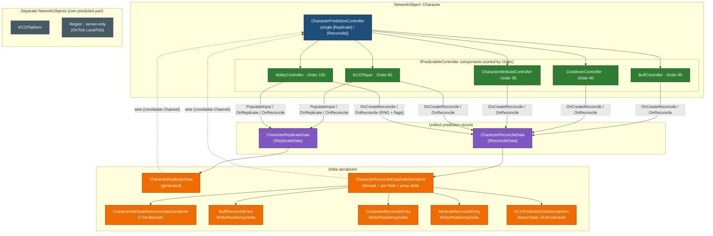
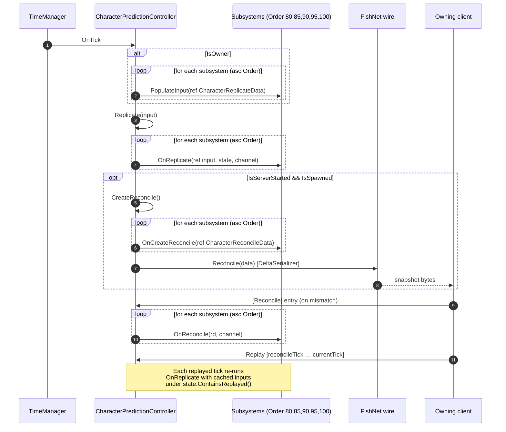
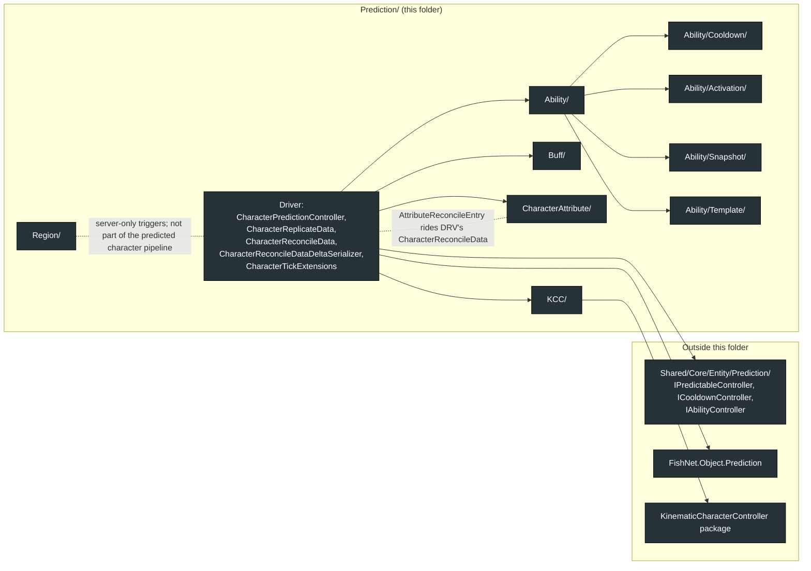
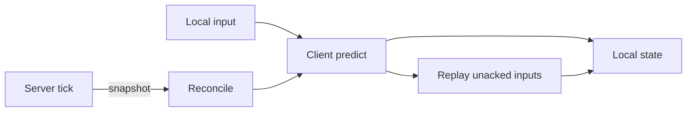

# Character Prediction System

**Short description:** Unified FishNet Prediction V2 pipeline that discovers, sorts, and drives all `IPredictableController` subsystems through a single `[Replicate]`/`[Reconcile]` pair on the character's `NetworkObject`.

## Table of Contents

- [Overview](#overview)
- [Supported Platforms](#supported-platforms)
- [Features / Capabilities / Security Features](#features--capabilities--security-features)
- [Prerequisites](#prerequisites)
- [Installation / Build](#installation--build)
- [Quick Start Guides](#quick-start-guides)
- [Configuration](#configuration)
- [Usage Examples](#usage-examples)
- [Lag compensation](#lag-compensation)
- [Observer synchronisation](#observer-synchronisation)
- [Operational Checks](#operational-checks)
- [System Architecture (Mermaid)](#system-architecture-mermaid)
- [Flow Diagram](#flow-diagram)
- [Project Structure](#project-structure)
- [License](#license)
## Detailed File-Level Topology

## Overview

FishNet's Prediction V2 allows only one `[Replicate]`/`[Reconcile]` pair per `NetworkObject` to work correctly. `CharacterPredictionController` solves this by acting as the single `NetworkBehaviour` entry point for the entire prediction pipeline. On `Awake()` it discovers all `IPredictableController` components on the same `GameObject`, sorts them by `Order`, and drives them through a unified tick cycle: `PopulateInput` → `Replicate` → `CreateReconcile` → `Reconcile`.

Subsystems (movement, buffs, cooldowns, equipment, attributes, abilities) implement `IPredictableController` and declare an `Order` value to control execution sequence. They never carry `[Replicate]`/`[Reconcile]` attributes themselves — all prediction traffic flows through the shared `CharacterReplicateData` and `CharacterReconcileData` structs, which are delta-serialized to minimize bandwidth.

## Supported Platforms

| Platform | Status | Notes |
|----------|--------|-------|
| Windows  | ✅ Supported | Primary development platform |
| Linux    | ✅ Supported | Server and client builds |
| WebGL    | ✅ Supported | Via Unity WebGL export |

Built with **Unity 6.3 LTS** using **IL2CPP** scripting backend.

## Features / Capabilities / Security Features

### Features

- **Single prediction entry point** — One `[Replicate]`/`[Reconcile]` pair per `NetworkObject`, avoiding FishNet multi-behaviour prediction conflicts
- **Automatic controller discovery** — `GetComponents<IPredictableController>()` on `Awake()` with `Order`-based sorting
- **Unified data structs** — `CharacterReplicateData` (input) and `CharacterReconcileData` (state) carry all subsystem data in one pipeline
- **Delta serialization** — Bitmask-based field compression on structs, index-delta compression on arrays (`CooldownReconcileEntry[]`, `BuffReconcileEntry[]`)
- **Reference-equality shortcut** — Cached reconcile snapshots skip delta comparison entirely when the array reference hasn't changed
- **Deterministic replay** — All controllers run against the same tick value (`input.GetTick()`), ensuring identical results during reconcile replay
- **Lag compensation** — Hits resolve against where the caster's client saw its peers, via a per-character position ring and a rewind scope. See [Lag compensation](#lag-compensation)
- **Loss-detecting delta chain** — A one-byte send sequence lets the reader reject a delta whose baseline it never received, instead of decoding it against the wrong one
- **Observer sync without state forwarding** — Observers do not simulate their peers. Position arrives via `NetworkTransform`, and resources, buffs, equipment and ability casts via dedicated broadcasts

### Registered Controllers

| Controller                       | Order | Responsibility                                      |
|----------------------------------|-------|-----------------------------------------------------|
| `KCCPlayer`                      | 80    | Movement input, motor simulation, camera state       |
| `BuffController`                 | 85    | Buff tick/expiry, reconcile buff snapshots           |
| `CooldownController`             | 90    | Cooldown expiry, reconcile cooldown snapshots        |
| `EquipmentController`            | 93    | Equipment state, attribute modifiers, reconcile equip|
| `CharacterAttributeController`   | 95    | Resource regeneration, reconcile resource state      |
| `AbilityController`              | 100   | Ability activation, spawning, RNG seed reconcile     |

### Security Features

- All prediction state is server-authoritative — clients cannot forge reconcile data
- Reconcile overwrites client state on mismatch, preventing prediction exploits
- Delta serializers guard against malformed packets with `MaxEntries` caps (4096; equipment 64), and every array read validates its count before allocating
- Each spawn payload is **length-framed**, so a defensive abort seeks to the end of its own block rather than desynchronising every `NetworkBehaviour` read after it — they all share one unframed buffer
- The client-supplied view offset is treated as a claim, not a fact: capped at `LagCompensationTick.MaximumCompensationTicks`, and clamped again by the recorded history window
- Observers are never sent owner-only state — no generator state, no full cooldown tables, no inventory internals. The boundary is the `IsOwner` check in `AbilityController.RegisterObservedAbility`

## Prerequisites

- **Unity 6.3 LTS** (or compatible version)
- **FishNetworking** with Prediction V2 support (`[Replicate]`/`[Reconcile]` attributes)
- **FishMMO Shared Core** — `IPredictableController` interface, `CharacterBehaviour` base class
- **KinematicCharacterController** — for `KinematicCharacterMotorState` in reconcile data

## Installation / Build

The prediction system is an integral part of the **FishMMO Unity project**. There is no separate installation step.

1. Clone or update the FishMMO repository.
2. Open the project in Unity 6.3 LTS.
3. The prediction system is located at `Assets/Scripts/Shared/Implementation/Entity/Prediction/`.
4. Ensure all FishMMO dependencies (FishNetworking, Shared Core, KinematicCharacterController) are present.

## Quick Start Guides

### Adding a New Predictable Controller

1. Implement `IPredictableController` on your `CharacterBehaviour` or `NetworkBehaviour`:

```csharp
public class MyController : CharacterBehaviour, IMyInterface, IPredictableController
{
    public int Order => 50; // Choose order relative to other controllers

    public void PopulateInput(ref CharacterReplicateData input)
    {
        // Write owner input into the shared struct (owner-only)
    }

    public void OnReplicate(ref CharacterReplicateData input, ReplicateState state, Channel channel)
    {
        // Simulate one tick using input data (runs on client + server)
    }

    public void OnCreateReconcile(ref CharacterReconcileData reconcileData)
    {
        // Write authoritative state into shared reconcile struct (server-only)
    }

    public void OnReconcile(CharacterReconcileData rd, Channel channel)
    {
        // Restore state from server reconcile data (client-only on mismatch)
    }
}
```

2. Add the component to the character prefab alongside `CharacterPredictionController`.
3. Add any new fields to `CharacterReplicateData` and/or `CharacterReconcileData`.
4. Update the corresponding delta serializers if adding new fields.

### Adding Fields to Replicate/Reconcile Structs

When a new subsystem needs to carry data through the prediction pipeline:

1. Add the field to `CharacterReplicateData` (for input) or `CharacterReconcileData` (for state).
2. Update the corresponding delta serializer (`CharacterReplicateDataDeltaSerializer` or `CharacterReconcileDataDeltaSerializer`) to include the new field in the bitmask.
3. For array fields, implement `WriteArrayDelta`/`ReadArrayDelta` methods (see `CooldownReconcileEntry` or `BuffReconcileEntry` for examples).

## Configuration

### CharacterPredictionController

`CharacterPredictionController` extends `NetworkBehaviour` and has no inspector-exposed fields. All configuration is implicit:

| Behaviour | Description |
|-----------|-------------|
| Controller discovery | `GetComponents<IPredictableController>()` on `Awake()` — all controllers on the same `GameObject` are automatically found |
| Execution order | Sorted by `IPredictableController.Order` ascending — lower values run first |
| Tick binding | Subscribes to `TimeManager.OnPreTick` and `OnTick` on `OnStartNetwork()`, unsubscribes on `OnStopNetwork()` |
| Tick snapshots | `CurrentLocalTickSnapshot`, `CurrentReplicateTickSnapshot` and `PendingReplicateTickSnapshot` are published so consumers that run before this behaviour's own tick callback (ability objects, region triggers) do not observe the previous tick's value |
| Input authority | `HasInputAuthority` — an AI character answers "the server", everyone else "the owning client". Ownership alone cannot answer it: a monster is server-owned with no owning connection, while a pet is owned by the summoner's connection yet driven entirely by a server-side `AIController`. |
| Observer transport | `ApplyObserverTransportMode` silences the `NetworkTransform` only when prediction genuinely moves the character (a `KCCPlayer` is present) **and** state forwarding is on. An NPC runs the same pipeline but is moved by a NavMeshAgent, so its `MotorState` is default every tick and the transform is the only thing moving it. |

### CharacterReplicateData

Unified per-tick input struct. Contains only input, not state.

| Field              | Type         | Subsystem | Description                                      |
|--------------------|--------------|-----------|--------------------------------------------------|
| `MoveAxisForward`  | `float`      | KCC       | Forward movement axis (W/S)                      |
| `MoveAxisRight`    | `float`      | KCC       | Right movement axis (A/D)                        |
| `MoveFlags`        | `int`        | KCC       | Bitmask: Jump, Crouch, Sprint (`KCCMoveFlags`)   |
| `AimDirection`     | `Vector3`    | KCC       | Unit aim vector, **already quantised** (see below) |
| `ViewOffsetTicks`  | `byte`       | Lag comp  | Whole ticks this client was rendering its peers behind server-present |
| `ViewOffsetFraction`| `byte`      | Lag comp  | Sub-tick remainder of that offset, in 1/256ths of a tick |
| `ActivationFlags`  | `int`        | Ability   | Bitmask: IsActualData, Interrupt, IsHeld, IsConsumable, IsMount |
| `QueuedAbilityID`  | `long`       | Ability   | Ability or consumable template ID to activate    |

Delta serialized with an 8-bit bitmask — only changed fields are transmitted. The axes ride a
single signed byte each (`MoveAxisCompression`) and the aim direction a packed `uint`
(`AimDirectionCompression`: 16 bits of yaw, 16 of pitch).

**`AimDirection` replaced a full `Quaternion CameraRotation`.** Nothing ever read the roll —
movement takes `rotation * Vector3.forward` to build its planar basis and the ability path takes
the same forward as its trace direction — so the quaternion carried a degree of freedom no
consumer used and that could not be represented exactly.

**Quantise on the producer, before predicting.** `KCCPlayer.PopulateInput` writes
`AimDirectionCompression.Quantize(...)` and `MoveAxisCompression.Quantize(...)` into the input
struct itself, not just onto the wire. This is input to a deterministic simulation, so the
producer must commit to the value the wire can carry — otherwise the owner predicts with one
direction while the server and observers simulate with the decoded one, and every cast diverges by
the quantisation error. `Encode`/`Decode` is a fixed point: the poles pin yaw to 0 and pitch uses
`Atan2` rather than `Asin`, which is numerically flat near ±1.

**The view offset is a client measurement the server cannot derive.** It is the full round trip
plus the client's interpolation buffer — see [Lag compensation](#lag-compensation).

### CharacterReconcileData

Unified per-tick authoritative state struct.

| Field               | Type                              | Subsystem  | Description                                       |
|---------------------|-----------------------------------|------------|---------------------------------------------------|
| `MotorState`        | `KinematicCharacterMotorState`    | KCC        | Full motor state (position, velocity, grounding)  |
| `AbilityID`         | `long`                            | Ability    | Currently active ability ID                       |
| `RemainingTicks`    | `uint`                            | Ability    | Remaining activation ticks                        |
| `Seed`              | `int`                             | Ability    | Deterministic RNG seed output                     |
| `PackedFlagsAndSlot`| `int`                             | Ability    | Packed activation flags (16-bit) + consumable slot (16-bit) |
| `ResourceState`     | `CharacterAttributeResourceState` | Attribute  | Health/Mana/Stamina current + max values          |
| `Cooldowns`         | `CooldownReconcileEntry[]`        | Cooldown   | Active cooldown snapshots (index-delta, ref-eq shortcut)  |
| `Buffs`             | `BuffReconcileEntry[]`            | Buff       | Active buff snapshots (index-delta, ref-eq shortcut)      |
| `Equipment`         | `EquipmentReconcileEntry[]`       | Equipment  | Equipped item snapshots (`TemplateID`, `Slot`, `Seed`, `ItemID`) — bit 10 |
| `Attributes`        | `AttributeReconcileEntry[]`       | Attribute  | Non-resource attribute snapshots (`Value` + `ExternalModifier`), sorted by `TemplateID` — bit 9 |
| `RngS0`–`RngS3`     | `uint` × 4                        | Ability    | Full xoshiro128** RNG internal state — bit 8 |
| `ChargedHoldTicks`  | `uint`                            | Ability    | Ticks a charged ability has been held past full charge — bit 11 |
| `Sequence`          | `byte`                            | —          | Server-side send counter, stamped at SEND time. The delta chain's loss detector; rides outside the flags word. |

Twelve of the sixteen bitmask bits are in use. **When adding a field, take the next bit and update
`WriteDelta`, `ReadDelta` and `DrainDeltaPayload` in lock-step** — all three read the same fields
in the same order, and a field added to one of them only silently misaligns every field after it.

#### The delta chain and its loss detector

Reconciles ride the unreliable `StateUpdate` datagram, and FishNet's scalar delta primitives are
*difference*-based: the writer emits `next - prev` and the reader adds it onto ITS previous value.
A payload is therefore only decodable by a peer holding the same baseline the writer used, so a
single lost datagram used to leave every later delta decoding against a baseline the client never
received — a wrong position applied to the owner for up to a second.

`Sequence` closes that. The reader requires `prev.Sequence + 1` and rejects the packet otherwise,
so a loss costs "no correction until the next snapshot" rather than "a wrong correction for up to a
second". It is stamped when the reconcile is actually *written*, not when it is created:
`CreateReconcile` runs every tick but the send is skipped when no resends remain, and a counter
that advanced on unsent states would read as a lost datagram.

A `FullSerialize` is written as an **absolute snapshot**, not as a delta — that is what makes it
usable by a peer with no baseline (a late-joining observer), and because FishNet emits one about
once per second it doubles as a periodic resync that repairs drift rather than letting it
accumulate.

Delta serialized with a bitmask + per-field delta encoding. Array fields use index-delta compression with reference-equality shortcutting.

> **Sort contract:** producers of `Attributes`, `Buffs`, and `Cooldowns` MUST emit entries sorted by their stable key (`TemplateID` ascending) so index-delta comparisons stay meaningful across ticks.

## Usage Examples

### Tick Execution Flow

Each `TimeManager.OnTick`, the controller executes:

```csharp
// 1. Owner populates unified input
CharacterReplicateData input = default;
if (IsOwner)
{
    for (int i = 0; i < controllers.Length; i++)
        controllers[i].PopulateInput(ref input);
}

// 2. Replicate (runs on all: owner, server, replay)
Replicate(input);

// 3. Server creates reconcile
CreateReconcile();
```

### Controller Order Example

If you need current movement/camera state to be available before buff, cooldown, attribute, and ability logic:

```
KCCPlayer (Order=80)          → Updates position/velocity/camera state
BuffController (Order=85)      → Ticks/expires buffs, applies modifiers
CooldownController (Order=90)  → Expires elapsed cooldowns
CharacterAttributeController (Order=95) → Regenerates resources
AbilityController (Order=100)  → Activates abilities, checks cooldowns + resources
```

## Lag compensation

Without compensation a hit resolves against where a character is *now*, while the shooter aimed at
where it was **rendered** — its interpolation buffer plus its own latency in the past. At 6 m/s
that gap runs from about 0.45 m on a same-city connection to 2.2 m at 300 ms, against ability
hitboxes authored at half a metre. At any real latency the shooter's aim and the server's answer
are describing different worlds.

### The derivation

Write everything in fractional server ticks. The owner produces an input at server time `S`:

| Term | Meaning |
|------|---------|
| `oneWay` | one-way network latency, in ticks |
| `interp` | `LagCompensationTick.SpectatorInterpolationTicks` — the client's render buffer |
| `queue` | `PredictionManager.StateInterpolation` — how long an arrived input waits before the replicate body consumes it |

- The state the owner is looking at left the server `oneWay` ago and is rendered `interp` behind
  even that, so it is watching server tick **`R = S − oneWay − interp`**.
- The input crosses the network and then waits in the replicate queue, so the body runs at server
  tick **`A = S + oneWay + queue`**.
- The offset subtracted is the client's claim (the **full** round trip plus its interpolation) plus
  the queue depth the client cannot see: `A − (2·oneWay + interp + queue)`.

Substituting `A` gives `S − oneWay − interp = R`. **Every latency term cancels exactly.** That only
holds while the client's half carries the full round trip and the server's half adds the queue
depth; either mistake leaves a residue proportional to ping, which is invisible at any single
latency. `LagCompensationClosedLoopTests` composes both halves across a spread of round trips and
pins the identity.

### The two halves

| Half | Where | What it does |
|------|-------|--------------|
| Client | `LagCompensationTick.ResolveViewOffset` (called by `KCCPlayer`) | Turns `TimeManager.RoundTripTime` and the interpolation setting into `ViewOffsetTicks` + `ViewOffsetFraction`. The server cannot derive this: FishNet exposes no per-connection latency server-side. |
| Server | `LagCompensationTick.ResolveAnchor` (called by `TryResolve`) | Caps the claim, adds the queue depth, and subtracts from the **server's own** `LocalTick`. |

**The anchor is always the server's tick.** A replicate's tick is the owning client's
unsynchronised counter and cannot index a history keyed by the server's — anchoring on it put every
target outside the recorded window, so nothing rewound and every hit silently resolved against live
positions.

**The sub-tick byte is not a nicety.** The whole-tick part alone quantises the rewind to a tick
boundary, and an interpolated view does not sit on one. At 30 Hz and 6 m/s that is 20 cm — most of
a capsule.

### The rewind scope

`LagCompensationRegistry.Rewind` displaces every registered character in the scene to its recorded
pose, calls `Physics.SyncTransforms` (colliders follow transforms only at a sync point), and
restores on `Dispose`. Rules that hold it together:

- **Nested rewinds are refused, not stacked.** A nested scope would capture already-displaced
  positions as its restore target and strand every character in the past. An inner query runs
  against the outer rewind instead.
- **A throw restores before it escapes.** Otherwise everything displaced so far stays half a second
  in the past, permanently.
- **Query, rank, dedupe and cap all happen inside one scope.** Ranking outside it mixes a rewound
  world with a live one.
- The caster is excluded — it fires from where it is, not where it was.

### The history ring

`CharacterPositionHistory` records one pose per tick on `OnPostTick`, into a ring sized from
`maximumRewindMilliseconds` (500 ms authored → 15 samples at 30 Hz). It never records while
displaced, which would persist a rewound pose as if it were real.

Resolution distinguishes two cases that look alike and are not:

- **A little older than the window clamps** to the oldest sample. Refusing it was a cliff, not a
  defence: the ceiling on how far back anyone can shoot is the recording either way, and an
  attacker reaches it by claiming a value just *inside* the window. Refusal only penalised honest
  high-latency clients.
- **Wildly older is refused.** A tick thousands out is not a latency claim at all — it is a tick
  domain error, and clamping it would hand back a real-looking pose for a tick nobody recorded.

> **500 ms RTT is the designed worst case, and the two constants deliberately disagree.**
> `MaximumCompensationTicks` is 30 while the ring holds 15 samples at 30 Hz, so past roughly 500 ms
> RTT the resolve clamps to the oldest sample and a player at 800 ms is compensated for about half of
> what the constant implies. That is intended, not an oversight:
>
> - The clamp is the safe direction — it returns the oldest *recorded* pose and never falls through to
>   a live one, so an over-window claim buys the recorded window and never more.
> - The two constants answer different questions. `MaximumCompensationTicks` bounds an
>   attacker-controlled **claim** before it is trusted; `maximumRewindMilliseconds` bounds what was
>   actually **recorded**. A claim capped *below* the ring length would be the real defect.
> - Rewinding further costs memory per character per scene and widens the window in which a player is
>   shot by someone looking at a very stale world — the thing lag compensation trades against.
>
> If the worst case ever moves, the knob is `maximumRewindMilliseconds` on the character prefab. Do not
> change `MaximumCompensationTicks` to match the ring.

### Who resolves hits

| Peer | Resolves? | Why |
|------|-----------|-----|
| Server | Yes, inside a rewind to the caster's view | Authoritative |
| The caster's owner | Yes, as a prediction, uncompensated | Its world already *is* that rewound one, which is what makes its predicted hit and the server's agree by construction |
| A third-party observer | **No** | It holds every character interpolated against its own latency, so the same query answers a question nobody asked. It is told instead, by `AbilityObjectHitBroadcast`. |

## Observer synchronisation

State forwarding is **off** for playable characters, and that is intended rather than a
misconfiguration. Observers do not simulate their peers, so each subsystem has an explicit
observer path:

| State | Owner | Observers |
|-------|-------|-----------|
| Position | Reconcile (`MotorState`) | `NetworkTransform` |
| Resources | Reconcile (`ResourceState`) | `CharacterResourcesBroadcast`, on a change-driven scheduler |
| Attributes | Reconcile (`Attributes[]`, carrying the authoritative residual) | `CharacterAttributesBroadcast` |
| Buffs | Own simulation | `CharacterBuffsBroadcast` (full set or delta) |
| Equipment | Own simulation + reconcile | `EquipmentObservedSlotBroadcast` |
| Ability casts | Own simulation | `AbilityActivatedBroadcast` |
| Ability hits | Own prediction, absorbed on echo | `AbilityObjectHitBroadcast` |
| Ability end-of-life | Own simulation | `AbilityObjectDestroyedBroadcast` (only for a hit-count end; lifetime expiry is identical everywhere and needs no message) |

They are **broadcasts, not RPCs**, sent to the observer set except the owner via
`ObserverBroadcastScope`. Every one of these is also written into the spawn payload in an
observer-shaped form, so a late joiner reconstructs the same visible state a peer that was present
the whole time holds.

### Transform stream rules

Observers receive position through `NetworkTransform`, shaped per observer by
`NetworkTransformDistanceLod` (distance) and `ObserverStreamingEntry` (the viewer's full-rate cap).
Four rules keep that stream rendering as motion, and each was learned from a live "NPCs teleporting
or rubber banding" report (issue #176):

- **No per-observer interval above `ObserverStreamingPolicy.MaxSendInterval` (2)**, which mirrors
  `NetworkTransform._interpolation` on every prefab. Both throttle tables — the prefab bands and the
  policy's cap bands — are clamped to it. The client waits for that many goals before it moves and
  again whenever its queue runs dry, and a queue overflow snaps to the newest goal; both scale with
  the interval. `NetworkTransformLodBufferTests` pins prefabs and policy together.
- **The first unreliable send after a reliable one goes to every observer** (FISHMMO EDIT in
  `NetworkBehaviour.SendObserversRpc`). The receiver measures it against the settle as one tick, so
  a filtered observer would otherwise play N ticks of motion in one at every stop-and-go.
- **Positions pack to 24 bits at 1 cm** (FISHMMO EDIT in `NetworkTransform`, multiplier 100 on
  every prefab). The wire grid must stay well under a walking character's per-tick displacement
  (5 cm at 30 Hz); the 10 cm grid tried before rendered a walk as alternating stalls and hops.
- **The NavMeshAgent is disabled on clients** (`AIController.OnStartNetwork`). Left enabled it
  re-maps the interpolated transform onto the client's NavMesh every frame.

The one thing genuinely broken by forwarding-off is a character with nothing to replicate position —
`CharacterPredictionController.OnStartNetwork` warns for a predicted object with no
`NetworkTransform`, because that presents as a content bug (a frozen character that keeps dealing
damage) rather than a networking one.

## Operational Checks

| Check | How to Verify | Expected Result |
|-------|---------------|-----------------|
| Controller discovery | Enter Play mode, break on `Awake()` | `controllers` array contains all 5 controllers sorted by Order |
| State Forwarding | Inspect `NetworkObject` Prediction settings | `EnableStateForwarding == false` on every shipped prefab — the interpolated open-world mode. Observers are fed by per-controller broadcasts, not by a forwarded reconcile; see `ObserverSyncMode`. `CharacterPredictionController.OnStartNetwork` warns only when forwarding is off AND there is no `NetworkTransform`, because then nothing replicates position at all |
| Tick execution | Place a breakpoint in `TimeManager_OnTick` | Called every server tick; `PopulateInput` runs only for owner |
| Replicate pipeline | Activate an ability on client | `OnReplicate` fires on both client and server with identical tick |
| Reconcile pipeline | Force a mismatch (server modifies ability state) | `OnReconcile` fires on client, restoring server state |
| `IsSpawned` gate | Break in `CreateReconcile` | Guarded by `IsServerStarted && IsSpawned`; reconciles are dropped before the `NetworkObject` is fully spawned to avoid NREs through partially-wired subsystems |
| Delta serialization | Monitor network traffic | Unchanged ticks transmit minimal bytes (bitmask-only for structs, skipped for reference-equal arrays) |
| Replay determinism | Cause a reconcile | All controllers replay from the reconcile tick with identical results |
| Order enforcement | Log `Order` values in `Awake()` | Sorted ascending: 80, 85, 90, 93, 95, 100 |

## System Architecture (Mermaid)

The diagrams below describe the entire `Prediction/` folder — components, the unified data structs, delta-serializer paths, and the per-tick lifecycle. They are the canonical reference; ASCII diagrams further down repeat the same information for terminal-only viewers.

### 1. Component & Data-Flow Topology



### 2. Per-Tick Lifecycle (sequence)



### 3. CharacterReconcileData Layout & Delta Strategy


### 4. Folder & Cross-Folder Dependencies



## Flow Diagram

### High-Level Overview



### Per-Tick Pipeline

```
TimeManager.OnTick()
        │
        ▼
┌──────────────────────────────────────────────────┐
│  PopulateInput (Owner only)                      │
│  ┌─ KCCPlayer.PopulateInput          (Order=80)  │
│  ├─ BuffController.PopulateInput     (Order=85)  │ ← no-op
│  ├─ CooldownController.PopulateInput (Order=90)  │ ← no-op
│  ├─ EquipmentController.PopulateInput(Order=93)  │ ← no-op
│  ├─ CharacterAttributeController     (Order=95)  │ ← no-op
│  └─ AbilityController.PopulateInput  (Order=100) │
│                                                  │
│  Result: CharacterReplicateData populated        │
└─────────────────────────┬────────────────────────┘
                          │
                          ▼
┌──────────────────────────────────────────────────┐
│  [Replicate] (Owner + Server + Replay)           │
│  ┌─ KCCPlayer.OnReplicate            → Motor sim │
│  ├─ BuffController.OnReplicate       → Tick()    │
│  ├─ CooldownController.OnReplicate   → Expire()  │
│  ├─ CharacterAttributeController     → Regen()   │
│  └─ AbilityController.OnReplicate    → Activate  │
└─────────────────────────┬────────────────────────┘
                          │
                          ▼
┌──────────────────────────────────────────────────┐
│  CreateReconcile (Server only)                   │
│  ┌─ KCCPlayer.OnCreateReconcile      → MotorState│
│  ├─ BuffController.OnCreateReconcile → Buffs[]   │
│  ├─ CooldownController               → Cooldowns │
│  ├─ CharacterAttributeController     → Resources │
│  └─ AbilityController               → Ability+RNG│
│                                                  │
│  Result: CharacterReconcileData sent to client   │
└─────────────────────────┬────────────────────────┘
                          │
                          ▼ (on mismatch)
┌──────────────────────────────────────────────────┐
│  [Reconcile] (Client only)                       │
│  ┌─ KCCPlayer.OnReconcile           → Restore    │
│  ├─ BuffController.OnReconcile      → Restore    │
│  ├─ CooldownController.OnReconcile  → Restore    │
│  ├─ CharacterAttributeController    → Restore    │
│  └─ AbilityController.OnReconcile   → Restore    │
│                                                  │
│  Then: Replay all ticks from reconcile→current   │
└──────────────────────────────────────────────────┘
```

### Delta Serialization

```
CharacterReplicateData: 7-bit byte bitmask → only changed fields written
CharacterReconcileData: ushort bitmask → per-field delta encoding
├── KinematicCharacterMotorState: 14-bit ushort bitmask
├── CharacterAttributeResourceState: 7-bit byte bitmask
├── CooldownReconcileEntry[]: index-delta compression (reference-equality shortcut)
├── BuffReconcileEntry[]: index-delta compression (reference-equality shortcut)
├── EquipmentReconcileEntry[]: index-delta compression (reference-equality shortcut)
├── AttributeReconcileEntry[]: index-delta compression (reference-equality shortcut)
└── RNG state (RngS0–S3): 4 × uint, only when changed
```

## Project Structure

### Directory Structure

```
Prediction/
├── CharacterPredictionController.cs            # Unified prediction driver (NetworkBehaviour, sole [Replicate]/[Reconcile])
├── CharacterReplicateData.cs                   # Shared per-tick input struct [UseGlobalCustomSerializer]
├── CharacterReconcileData.cs                   # Shared per-tick state struct [UseGlobalCustomSerializer]
├── CharacterReconcileDataDeltaSerializer.cs    # Bitmask-based delta serializer for reconcile data
├── CharacterTickExtensions.cs                  # ICharacter.GetLocalTick() helper (extension class — invisible to a type-level scan, not dead)
├── PredictionTick.cs                           # A tick that can only be produced from a replicate input, so the compiler enforces tick sourcing
├── AimDirectionCompression.cs                  # Yaw/pitch packing for CharacterReplicateData.AimDirection; Encode/Decode is a fixed point
├── MoveAxisCompression.cs                      # Signed-byte packing for the movement axes
├── CharacterAimOrigin.cs                       # Derives the aim origin from the motor (never replicated — it is reconstructible)
├── PayloadVisibility.cs                        # Chooses the owner or observer spawn-payload shape for a connection
├── ObserverSyncMode.cs                         # Whether a NetworkObject's observers consume reconcile or broadcasts
├── NetworkTransformDistanceLod.cs              # Per-observer send-rate shaping for the NetworkTransform
├── Ability/                                    # Ability system (see Ability/README.md)
│   ├── Ability.cs                              # Runtime ability instance
│   ├── AbilityController.cs                    # IPredictableController (Order=100), partials below
│   ├── AbilityController.Activation.cs         # Activation pipeline
│   ├── AbilityController.Knowledge.cs          # Known ability / event templates
│   ├── AbilityController.Networking.cs         # Knowledge broadcasts (NOT state replication)
│   ├── AbilityObject.cs                        # Spawned ability instance (projectile / hit volume)
│   ├── AbilityObjectSnapshot.cs                # Detached object snapshot (outlives caster)
│   ├── AbilityObjectSweep.cs                   # Swept-volume hit gathering (overlap at the start + cast along the segment), distance-ordered
│   ├── PredictedAbilityStateHistory.cs         # Owner-side per-tick (seed, abilityID) record the reconcile compares against
│   ├── AbilityPrefabColliderCache.cs           # Caches colliders per ability prefab to avoid GetComponent per spawn
│   ├── AbilityContainerAllocator.cs            # Allocates deterministic container IDs for spawned objects
│   ├── AbilityActivationFlags.cs               # 16-bit flags packed into CharacterReconcileData.PackedFlagsAndSlot
│   ├── Activation/                             # AbilityActivationReplicateData (per-ability input shape)
│   ├── Cooldown/                               # Cooldown system (see Ability/Cooldown/README.md)
│   ├── Snapshot/                               # SnapshotCharacter / SnapshotAttributeController
│   └── Template/                               # AbilityTemplate, AbilityType, AbilitySpawnTarget, Pet*, Events/
├── Buff/                                       # Buff system (see Buff/README.md)
│   ├── Buff.cs                                 # Per-buff state holder
│   ├── BuffController.cs                       # IPredictableController (Order=85)
│   ├── BuffReconcileEntry.cs                   # (TemplateID, ExpiryTick, NextTickTick, Stacks) + array-delta
│   └── Template/                               # AttributeBuffTemplate, CompositeBuffTemplate, etc.
├── Equipment/                                  # Equipment state reconcile (EquipmentController, EquipmentReconcileEntry)
├── CharacterAttribute/                         # Attribute system (see CharacterAttribute/README.md)
│   ├── CharacterAttributeController.cs         # IPredictableController (Order=95)
│   ├── CharacterAttribute.cs                   # Non-resource attribute runtime
│   ├── CharacterResourceAttribute.cs           # Health / Mana / Stamina runtime
│   ├── CharacterAttributeResourceState.cs      # 7-field snapshot struct
│   ├── CharacterAttributeResourceStateSerializer.cs  # Regular + delta serializers (BeforeSceneLoad registration)
│   ├── AttributeReconcileEntry.cs              # Non-resource attribute snapshot + array-delta
│   ├── ModifierSource.cs                       # The attributed-modifier ledger key: (Kind, Id, Index)
│   ├── CharacterDamageController.cs            # Damage / heal / kill pipeline
│   ├── CombatEventCoalescer.cs                 # Merges one tick's hits sharing (source, kind, damage type) into one report
│   ├── PredictedCombatEvents.cs                # Client-side predicted damage/heal labels, settled or greyed out by the server's report
│   ├── ObservedResourcePushScheduler.cs        # Decides when an observer resource push is due (in-combat vs out-of-combat interval)
│   └── Template/                               # CharacterAttributeTemplate, formulas, damage/resistance
├── KCC/                                        # Kinematic Character Controller
│   ├── KCCPlayer.cs                            # IPredictableController (Order=80) — movement prediction
│   ├── KCCController.cs                        # Motor simulation (ICharacterController)
│   ├── KCCCamera.cs                            # Third-person camera controller
│   ├── KCCPlatform.cs                          # Moving platform prediction (separate NetworkObject — own [Replicate]/[Reconcile])
│   ├── KCCInputReplicateData.cs                # KCC-specific replicate data (used internally)
│   ├── KCCMoveFlags.cs                         # Movement flag enum (Jump, Crouch, Sprint)
│   ├── KCCPlatformDeltaSerializers.cs          # Delta serializers for the moving-platform pipeline
│   └── KCCPredictionDeltaSerializers.cs        # Delta serializers for motor state + replicate data
├── LagCompensation/                            # Rewind-to-the-caster's-view (see "Lag compensation" above)
│   ├── LagCompensationTick.cs                  # BOTH halves of the derivation, as pure functions: ResolveViewOffset (client) and ResolveAnchor (server)
│   ├── LagCompensationRegistry.cs              # The rewind scope: displace every character, sync, restore. Refuses nesting.
│   ├── CharacterPositionHistory.cs             # Per-character pose ring, sized from maximumRewindMilliseconds
│   ├── LagCompensatedQuery.cs                  # OverlapSphereNearest / RaycastNearest — query, rank, dedupe and cap all inside ONE scope
│   └── RewindTarget.cs                         # A tick plus a sub-tick fraction, clamped
├── ObserverStreaming/                          # Per-observer range and full-rate cap
│   ├── ObserverStreamingRegistry.cs            # Registration and per-observer decisions
│   ├── ObserverStreamingPolicy.cs              # Density-scaled range and budget policy
│   ├── ObserverStreamingEntry.cs               # Per-object streaming state
│   └── ObserverBudgetCondition.cs              # FishNet observer condition implementing the budget
└── Region/                                     # Region trigger system (server-authoritative; NOT part of the predicted character pipeline)
    ├── Region.cs                               # NetworkBehaviour with NetworkTrigger; OnRegionEnter/Stay/Exit Trigger lists
    ├── RegionGeometry.cs                        # Authored region shape
    ├── RegionMembership.cs                      # Which region owns a character when regions nest
    └── FogSettings.cs                          # Per-region fog configuration data
```

### Related Files

```
Shared/Core/Entity/Prediction/IPredictableController.cs     # Interface all controllers implement
Shared/Core/Entity/Prediction/Ability/Cooldown/ICooldownController.cs  # Cooldown controller interface
Shared/Core/Entity/Prediction/Ability/IAbilityController.cs  # Ability controller interface
```

### Inheritance Hierarchy

```
NetworkBehaviour
└── CharacterPredictionController       # Drives the unified pipeline

IPredictableController                  # Implemented by all subsystem controllers
├── KCCPlayer              (Order=80)
├── BuffController         (Order=85)
├── CooldownController     (Order=90)
├── EquipmentController    (Order=93)
├── CharacterAttributeController (Order=95)
└── AbilityController      (Order=100)
```

## License

This project is subject to the FishMMO project license.
