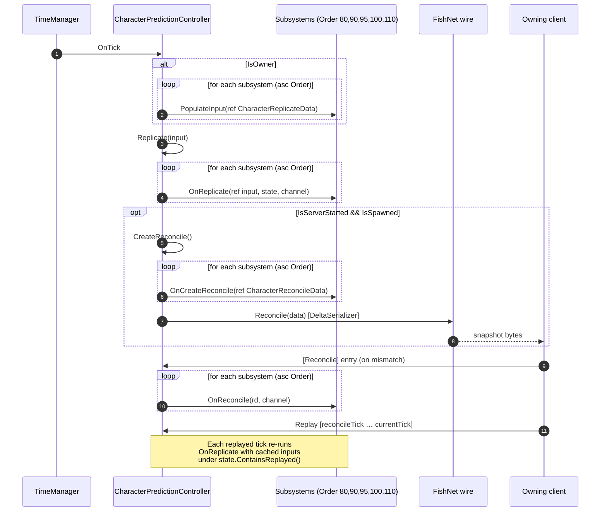
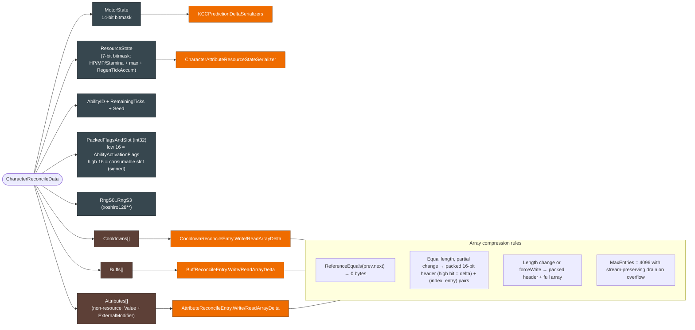
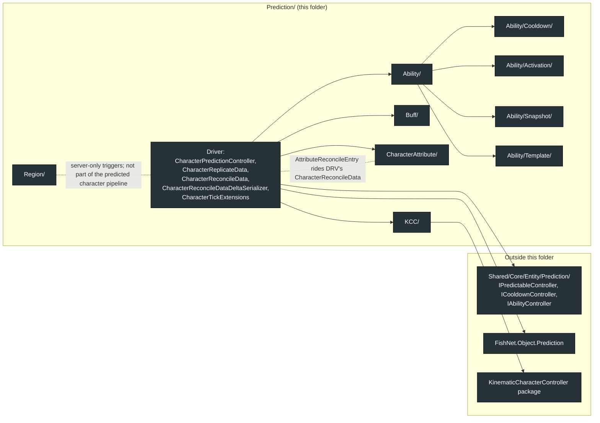
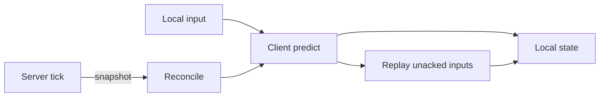

# Character Prediction System

**Short description:** Unified FishNet Prediction V2 pipeline that discovers, sorts, and drives all `IPredictableController` subsystems through a single `[Replicate]`/`[Reconcile]` pair on the character's `NetworkObject`.

## Table of Contents

- [Overview](#overview)
- [Supported Platforms](#supported-platforms)
- [Features / Capabilities / Security Features](#features--capabilities--security-features)
- [Prerequisites](#prerequisites)
- [Installation / Build](#installation--build)
- [Quick Start Guides](#quick-start-guides)
- [Configuration](#configuration)
- [Usage Examples](#usage-examples)
- [Operational Checks](#operational-checks)
- [System Architecture (Mermaid)](#system-architecture-mermaid)
- [Flow Diagram](#flow-diagram)
- [Project Structure](#project-structure)
- [License](#license)
## Detailed File-Level Topology

## Overview

FishNet's Prediction V2 allows only one `[Replicate]`/`[Reconcile]` pair per `NetworkObject` to work correctly. `CharacterPredictionController` solves this by acting as the single `NetworkBehaviour` entry point for the entire prediction pipeline. On `Awake()` it discovers all `IPredictableController` components on the same `GameObject`, sorts them by `Order`, and drives them through a unified tick cycle: `PopulateInput` → `Replicate` → `CreateReconcile` → `Reconcile`.

Subsystems (movement, buffs, cooldowns, attributes, abilities) implement `IPredictableController` and declare an `Order` value to control execution sequence. They never carry `[Replicate]`/`[Reconcile]` attributes themselves — all prediction traffic flows through the shared `CharacterReplicateData` and `CharacterReconcileData` structs, which are delta-serialized to minimize bandwidth.

## Supported Platforms

| Platform | Status | Notes |
|----------|--------|-------|
| Windows  | ✅ Supported | Primary development platform |
| Linux    | ✅ Supported | Server and client builds |
| WebGL    | ✅ Supported | Via Unity WebGL export |

Built with **Unity 6.3 LTS** using **IL2CPP** scripting backend.

## Features / Capabilities / Security Features

### Features

- **Single prediction entry point** — One `[Replicate]`/`[Reconcile]` pair per `NetworkObject`, avoiding FishNet multi-behaviour prediction conflicts
- **Automatic controller discovery** — `GetComponents<IPredictableController>()` on `Awake()` with `Order`-based sorting
- **Unified data structs** — `CharacterReplicateData` (input) and `CharacterReconcileData` (state) carry all subsystem data in one pipeline
- **Delta serialization** — Bitmask-based field compression on structs, index-delta compression on arrays (`CooldownReconcileEntry[]`, `BuffReconcileEntry[]`)
- **Reference-equality shortcut** — Cached reconcile snapshots skip delta comparison entirely when the array reference hasn't changed
- **Deterministic replay** — All controllers run against the same tick value (`input.GetTick()`), ensuring identical results during reconcile replay

### Registered Controllers

| Controller                       | Order | Responsibility                                      |
|----------------------------------|-------|-----------------------------------------------------|
| `BuffController`                 | 80    | Buff tick/expiry, reconcile buff snapshots           |
| `CooldownController`             | 90    | Cooldown expiry, reconcile cooldown snapshots        |
| `CharacterAttributeController`   | 95    | Resource regeneration, reconcile resource state      |
| `AbilityController`              | 100   | Ability activation, spawning, RNG seed reconcile     |
| `KCCPlayer`                      | 110   | Movement input, motor simulation, camera state       |

### Security Features

- All prediction state is server-authoritative — clients cannot forge reconcile data
- Reconcile overwrites client state on mismatch, preventing prediction exploits
- Delta serializers guard against malformed packets with `MaxEntries` caps (4096)

## Prerequisites

- **Unity 6.3 LTS** (or compatible version)
- **FishNetworking** with Prediction V2 support (`[Replicate]`/`[Reconcile]` attributes)
- **FishMMO Shared Core** — `IPredictableController` interface, `CharacterBehaviour` base class
- **KinematicCharacterController** — for `KinematicCharacterMotorState` in reconcile data

## Installation / Build

The prediction system is an integral part of the **FishMMO Unity project**. There is no separate installation step.

1. Clone or update the FishMMO repository.
2. Open the project in Unity 6.3 LTS.
3. The prediction system is located at `Assets/Scripts/Shared/Implementation/Entity/Prediction/`.
4. Ensure all FishMMO dependencies (FishNetworking, Shared Core, KinematicCharacterController) are present.

## Quick Start Guides

### Adding a New Predictable Controller

1. Implement `IPredictableController` on your `CharacterBehaviour` or `NetworkBehaviour`:

```csharp
public class MyController : CharacterBehaviour, IMyInterface, IPredictableController
{
    public int Order => 50; // Choose order relative to other controllers

    public void PopulateInput(ref CharacterReplicateData input)
    {
        // Write owner input into the shared struct (owner-only)
    }

    public void OnReplicate(ref CharacterReplicateData input, ReplicateState state, Channel channel)
    {
        // Simulate one tick using input data (runs on client + server)
    }

    public void OnCreateReconcile(ref CharacterReconcileData reconcileData)
    {
        // Write authoritative state into shared reconcile struct (server-only)
    }

    public void OnReconcile(CharacterReconcileData rd, Channel channel)
    {
        // Restore state from server reconcile data (client-only on mismatch)
    }
}
```

2. Add the component to the character prefab alongside `CharacterPredictionController`.
3. Add any new fields to `CharacterReplicateData` and/or `CharacterReconcileData`.
4. Update the corresponding delta serializers if adding new fields.

### Adding Fields to Replicate/Reconcile Structs

When a new subsystem needs to carry data through the prediction pipeline:

1. Add the field to `CharacterReplicateData` (for input) or `CharacterReconcileData` (for state).
2. Update the corresponding delta serializer (`CharacterReplicateDataDeltaSerializer` or `CharacterReconcileDataDeltaSerializer`) to include the new field in the bitmask.
3. For array fields, implement `WriteArrayDelta`/`ReadArrayDelta` methods (see `CooldownReconcileEntry` or `BuffReconcileEntry` for examples).

## Configuration

### CharacterPredictionController

`CharacterPredictionController` extends `NetworkBehaviour` and has no inspector-exposed fields. All configuration is implicit:

| Behaviour | Description |
|-----------|-------------|
| Controller discovery | `GetComponents<IPredictableController>()` on `Awake()` — all controllers on the same `GameObject` are automatically found |
| Execution order | Sorted by `IPredictableController.Order` ascending — lower values run first |
| Tick binding | Subscribes to `TimeManager.OnTick` on `OnStartNetwork()`, unsubscribes on `OnStopNetwork()` |

### CharacterReplicateData

Unified per-tick input struct. Contains only input, not state.

| Field              | Type         | Subsystem | Description                                      |
|--------------------|--------------|-----------|--------------------------------------------------|
| `MoveAxisForward`  | `float`      | KCC       | Forward movement axis (W/S)                      |
| `MoveAxisRight`    | `float`      | KCC       | Right movement axis (A/D)                        |
| `MoveFlags`        | `int`        | KCC       | Bitmask: Jump, Crouch, Sprint (`KCCMoveFlags`)   |
| `CameraPosition`   | `Vector3`    | KCC       | Camera position for ability aiming               |
| `CameraRotation`   | `Quaternion` | KCC       | Camera rotation for ability aiming               |
| `ActivationFlags`  | `int`        | Ability   | Bitmask: IsActualData, Interrupt, IsHeld, IsConsumable, IsMount |
| `QueuedAbilityID`  | `long`       | Ability   | Ability or consumable template ID to activate    |

Delta serialized with a 7-bit byte bitmask — only changed fields are transmitted.

### CharacterReconcileData

Unified per-tick authoritative state struct.

| Field               | Type                              | Subsystem  | Description                                       |
|---------------------|-----------------------------------|------------|---------------------------------------------------|
| `MotorState`        | `KinematicCharacterMotorState`    | KCC        | Full motor state (position, velocity, grounding)  |
| `AbilityID`         | `long`                            | Ability    | Currently active ability ID                       |
| `RemainingTicks`    | `uint`                            | Ability    | Remaining activation ticks                        |
| `Seed`              | `int`                             | Ability    | Deterministic RNG seed output                     |
| `PackedFlagsAndSlot`| `int`                             | Ability    | Packed activation flags (16-bit) + consumable slot (16-bit) |
| `ResourceState`     | `CharacterAttributeResourceState` | Attribute  | Health/Mana/Stamina current + max values          |
| `Cooldowns`         | `CooldownReconcileEntry[]`        | Cooldown   | Active cooldown snapshots (index-delta, ref-eq shortcut)  |
| `Buffs`             | `BuffReconcileEntry[]`            | Buff       | Active buff snapshots (index-delta, ref-eq shortcut)      |
| `Attributes`        | `AttributeReconcileEntry[]`       | Attribute  | Non-resource attribute snapshots (Value + ExternalModifier), sorted by `TemplateID` |
| `RngS0`–`RngS3`     | `uint` × 4                        | Ability    | Full xoshiro128** RNG internal state                      |

Delta serialized with a bitmask + per-field delta encoding. Array fields use index-delta compression with reference-equality shortcutting.

> **Sort contract:** producers of `Attributes`, `Buffs`, and `Cooldowns` MUST emit entries sorted by their stable key (`TemplateID` ascending) so index-delta comparisons stay meaningful across ticks.

## Usage Examples

### Tick Execution Flow

Each `TimeManager.OnTick`, the controller executes:

```csharp
// 1. Owner populates unified input
CharacterReplicateData input = default;
if (IsOwner)
{
    for (int i = 0; i < controllers.Length; i++)
        controllers[i].PopulateInput(ref input);
}

// 2. Replicate (runs on all: owner, server, replay)
Replicate(input);

// 3. Server creates reconcile
CreateReconcile();
```

### Controller Order Example

If you need a buff effect to influence attribute regeneration, which then affects ability cooldown checks:

```
BuffController (Order=80)      → Ticks/expires buffs, applies modifiers
CooldownController (Order=90)  → Expires elapsed cooldowns
CharacterAttributeController (Order=95) → Regenerates resources
AbilityController (Order=100)  → Activates abilities, checks cooldowns + resources
KCCPlayer (Order=110)          → Updates position/velocity
```

## Operational Checks

| Check | How to Verify | Expected Result |
|-------|---------------|-----------------|
| Controller discovery | Enter Play mode, break on `Awake()` | `controllers` array contains all 5 controllers sorted by Order |
| State Forwarding | Inspect `NetworkObject` Prediction settings | `EnableStateForwarding == true`. `CharacterPredictionController.OnStartNetwork` logs a warning otherwise — observers desync without it |
| Tick execution | Place a breakpoint in `TimeManager_OnTick` | Called every server tick; `PopulateInput` runs only for owner |
| Replicate pipeline | Activate an ability on client | `OnReplicate` fires on both client and server with identical tick |
| Reconcile pipeline | Force a mismatch (server modifies ability state) | `OnReconcile` fires on client, restoring server state |
| `IsSpawned` gate | Break in `CreateReconcile` | Guarded by `IsServerStarted && IsSpawned`; reconciles are dropped before the `NetworkObject` is fully spawned to avoid NREs through partially-wired subsystems |
| Delta serialization | Monitor network traffic | Unchanged ticks transmit minimal bytes (bitmask-only for structs, skipped for reference-equal arrays) |
| Replay determinism | Cause a reconcile | All controllers replay from the reconcile tick with identical results |
| Order enforcement | Log `Order` values in `Awake()` | Sorted ascending: 80, 90, 95, 100, 110 |

## System Architecture (Mermaid)

The diagrams below describe the entire `Prediction/` folder — components, the unified data structs, delta-serializer paths, and the per-tick lifecycle. They are the canonical reference; ASCII diagrams further down repeat the same information for terminal-only viewers.

### 1. Component & Data-Flow Topology


### 2. Per-Tick Lifecycle (sequence)



### 3. CharacterReconcileData Layout & Delta Strategy



### 4. Folder & Cross-Folder Dependencies



## Flow Diagram

### High-Level Overview



### Per-Tick Pipeline

```
TimeManager.OnTick()
        │
        ▼
┌──────────────────────────────────────────────────┐
│  PopulateInput (Owner only)                      │
│  ┌─ BuffController.PopulateInput     (Order=80)  │ ← no-op
│  ├─ CooldownController.PopulateInput (Order=90)  │ ← no-op
│  ├─ CharacterAttributeController     (Order=95)  │ ← no-op
│  ├─ AbilityController.PopulateInput  (Order=100) │
│  └─ KCCPlayer.PopulateInput          (Order=110) │
│                                                  │
│  Result: CharacterReplicateData populated        │
└─────────────────────────┬────────────────────────┘
                          │
                          ▼
┌──────────────────────────────────────────────────┐
│  [Replicate] (Owner + Server + Replay)           │
│  ┌─ BuffController.OnReplicate       → Tick()    │
│  ├─ CooldownController.OnReplicate   → Expire()  │
│  ├─ CharacterAttributeController     → Regen()   │
│  ├─ AbilityController.OnReplicate    → Activate  │
│  └─ KCCPlayer.OnReplicate            → Motor sim │
└─────────────────────────┬────────────────────────┘
                          │
                          ▼
┌──────────────────────────────────────────────────┐
│  CreateReconcile (Server only)                   │
│  ┌─ BuffController.OnCreateReconcile → Buffs[]   │
│  ├─ CooldownController               → Cooldowns │
│  ├─ CharacterAttributeController     → Resources │
│  ├─ AbilityController               → Ability+RNG│
│  └─ KCCPlayer.OnCreateReconcile      → MotorState│
│                                                  │
│  Result: CharacterReconcileData sent to client   │
└─────────────────────────┬────────────────────────┘
                          │
                          ▼ (on mismatch)
┌──────────────────────────────────────────────────┐
│  [Reconcile] (Client only)                       │
│  ┌─ BuffController.OnReconcile      → Restore    │
│  ├─ CooldownController.OnReconcile  → Restore    │
│  ├─ CharacterAttributeController    → Restore    │
│  ├─ AbilityController.OnReconcile   → Restore    │
│  └─ KCCPlayer.OnReconcile           → Restore    │
│                                                  │
│  Then: Replay all ticks from reconcile→current   │
└──────────────────────────────────────────────────┘
```

### Delta Serialization

```
CharacterReplicateData: 7-bit byte bitmask → only changed fields written
CharacterReconcileData: ushort bitmask → per-field delta encoding
├── KinematicCharacterMotorState: 14-bit ushort bitmask
├── CharacterAttributeResourceState: 7-bit byte bitmask
├── CooldownReconcileEntry[]: index-delta compression (reference-equality shortcut)
├── BuffReconcileEntry[]: index-delta compression (reference-equality shortcut)
└── RNG state (RngS0–S3): 4 × uint, only when changed
```

## Project Structure

### Directory Structure

```
Prediction/
├── CharacterPredictionController.cs            # Unified prediction driver (NetworkBehaviour, sole [Replicate]/[Reconcile])
├── CharacterReplicateData.cs                   # Shared per-tick input struct [UseGlobalCustomSerializer]
├── CharacterReconcileData.cs                   # Shared per-tick state struct [UseGlobalCustomSerializer]
├── CharacterReconcileDataDeltaSerializer.cs    # Bitmask-based delta serializer for reconcile data
├── CharacterTickExtensions.cs                  # ICharacter.GetLocalTick() helper
├── Ability/                                    # Ability system (see Ability/README.md)
│   ├── Ability.cs                              # Runtime ability instance
│   ├── AbilityController.cs                    # IPredictableController (Order=100), partials below
│   ├── AbilityController.Activation.cs         # Activation pipeline
│   ├── AbilityController.Knowledge.cs          # Known ability / event templates
│   ├── AbilityController.Networking.cs         # Knowledge broadcasts (NOT state replication)
│   ├── AbilityObject.cs                        # Spawned ability instance (projectile / hit volume)
│   ├── AbilityObjectSnapshot.cs                # Detached object snapshot (outlives caster)
│   ├── AbilityActivationFlags.cs               # 16-bit flags packed into CharacterReconcileData.PackedFlagsAndSlot
│   ├── Activation/                             # AbilityActivationReplicateData (per-ability input shape)
│   ├── Cooldown/                               # Cooldown system (see Ability/Cooldown/README.md)
│   ├── Snapshot/                               # SnapshotCharacter / SnapshotAttributeController
│   └── Template/                               # AbilityTemplate, AbilityType, AbilitySpawnTarget, Pet*, Events/
├── Buff/                                       # Buff system (see Buff/README.md)
│   ├── Buff.cs                                 # Per-buff state holder
│   ├── BuffController.cs                       # IPredictableController (Order=80)
│   ├── BuffReconcileEntry.cs                   # (TemplateID, ExpiryTick, NextTickTick, Stacks) + array-delta
│   └── Template/                               # AttributeBuffTemplate, CompositeBuffTemplate, etc.
├── CharacterAttribute/                         # Attribute system (see CharacterAttribute/README.md)
│   ├── CharacterAttributeController.cs         # IPredictableController (Order=95)
│   ├── CharacterAttribute.cs                   # Non-resource attribute runtime
│   ├── CharacterResourceAttribute.cs           # Health / Mana / Stamina runtime
│   ├── CharacterAttributeResourceState.cs      # 7-field snapshot struct
│   ├── CharacterAttributeResourceStateSerializer.cs  # Regular + delta serializers (BeforeSceneLoad registration)
│   ├── AttributeReconcileEntry.cs              # Non-resource attribute snapshot + array-delta
│   ├── CharacterDamageController.cs            # Damage / heal / kill pipeline
│   └── Template/                               # CharacterAttributeTemplate, formulas, damage/resistance
├── KCC/                                        # Kinematic Character Controller
│   ├── KCCPlayer.cs                            # IPredictableController (Order=110) — movement prediction
│   ├── KCCController.cs                        # Motor simulation (ICharacterController)
│   ├── KCCCamera.cs                            # Third-person camera controller
│   ├── KCCPlatform.cs                          # Moving platform prediction (separate NetworkObject — own [Replicate]/[Reconcile])
│   ├── KCCInputReplicateData.cs                # KCC-specific replicate data (used internally)
│   ├── KCCMoveFlags.cs                         # Movement flag enum (Jump, Crouch, Sprint)
│   └── KCCPredictionDeltaSerializers.cs        # Delta serializers for motor state + replicate data
└── Region/                                     # Region trigger system (server-authoritative; NOT part of the predicted character pipeline)
    ├── Region.cs                               # NetworkBehaviour with NetworkTrigger; OnRegionEnter/Stay/Exit Trigger lists
    └── FogSettings.cs                          # Per-region fog configuration data
```

### Related Files

```
Shared/Core/Entity/Prediction/IPredictableController.cs     # Interface all controllers implement
Shared/Core/Entity/Prediction/Ability/Cooldown/ICooldownController.cs  # Cooldown controller interface
Shared/Core/Entity/Prediction/Ability/IAbilityController.cs  # Ability controller interface
```

### Inheritance Hierarchy

```
NetworkBehaviour
└── CharacterPredictionController       # Drives the unified pipeline

IPredictableController                  # Implemented by all subsystem controllers
├── BuffController         (Order=80)
├── CooldownController     (Order=90)
├── CharacterAttributeController (Order=95)
├── AbilityController      (Order=100)
└── KCCPlayer              (Order=110)
```

## License

This project is subject to the FishMMO project license.
