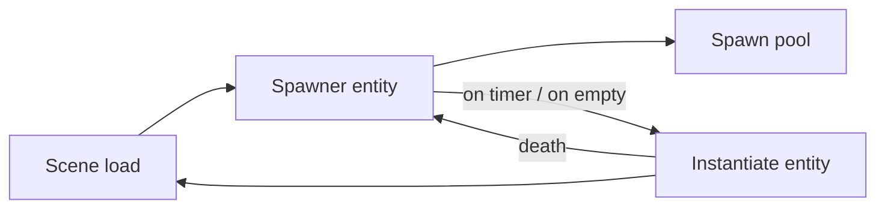

# Spawner System

**Short description:** Server-authoritative, condition-driven framework for spawning and respawning networked objects in FishMMO with configurable selection strategies, conditional gating, physics-based placement, and a pre-warmed object pool that gives a map a fixed memory footprint.

## Table of Contents

- [Overview](#overview)
- [Supported Platforms](#supported-platforms)
- [Features](#features)
- [Prerequisites](#prerequisites)
- [Installation / Build](#installation--build)
- [Quick Start Guide](#quick-start-guide)
- [Configuration](#configuration)
- [Usage Examples](#usage-examples)
- [Operational Checks](#operational-checks)
- [Flow Diagram](#flow-diagram)
- [Project Structure](#project-structure)
- [License](#license)

## Overview

The Spawner system is a server-authoritative, condition-driven framework for spawning and respawning networked objects in FishMMO. It provides configurable spawn selection (linear, random, weighted), conditional respawn gating (OR and AND condition lists), bounding-box placement with physics-based ground detection, object pooling via FishNet, and per-object respawn timers. Spawners are placed in scenes as `NetworkBehaviour` components and manage the full lifecycle of spawned entities.

### Deterministic memory footprint

Objects are never destroyed and re-instantiated on respawn — they are returned to FishNet's object pool with `DespawnType.Pool` and drawn back out with `GetPooledInstantiated`. That recycling alone is not enough to make a map's cost predictable, because the pool fills *lazily*: the first NPC of each kind is instantiated the moment a player walks into range, so a freshly loaded map hitches as it is explored and only reaches its true heap size once every spawner has fired at least once.

`ObjectSpawnerPool` closes that. Each spawner reserves `MaxSpawnCount + PrewarmHeadroom` instances of every prefab it can select, at scene start, de-duplicated across spawners that share a prefab. The result is a one-time load cost and a footprint you can plan capacity against, rather than one discovered under load.

This is also why the per-spawner override settings matter for memory and not only for content: one NPC prefab that becomes a weak variant at one spawner and an elite at another is **one** pool bucket. Duplicating the prefab to make the variant would be a second bucket and a second fixed slice of the budget.

## Supported Platforms

| Platform | Supported | Notes |
|----------|-----------|-------|
| Windows  | Yes       | Server-authoritative; spawners run on server only |
| Linux    | Yes       | Server-authoritative; spawners run on server only |
| WebGL    | N/A       | Server-side only system; no client-side spawner logic |

- **Unity Version:** Unity 6.3 LTS
- **Scripting Backend:** IL2CPP

## Features

- Server-authoritative spawn lifecycle (spawn, despawn, respawn)
- Three spawn selection strategies: Linear (sequential), Random (uniform), Weighted (proportional odds via `SpawnChance`)
- Conditional respawn gating with OR and AND condition lists (`BaseRespawnCondition`)
- Bounding-box placement with physics SphereCast ground detection
- FishNet object pooling via `GetPooledInstantiated()` / `Despawn(DespawnType.Pool)` — spawned entities are cached and recycled, never destroyed and re-instantiated
- Object pool pre-warming via `ObjectSpawnerPool.Reserve(...)`, giving a map a fixed memory footprint decided at load rather than discovered during play
- Per-spawner NPC overrides: attribute database, AI archetype, additional or replacement abilities, faction, corpse decay, and a random uniform scale range
- Weighted item roll tables so one world-item prefab can serve every ground pickup in the game from a single pool bucket
- NavMeshAgent re-seating on reuse: `IAIController.Initialize` warps the agent onto the NavMesh at the spawn position, because a recycled NPC's agent otherwise still believes it is where the previous occupant died
- Per-object configurable respawn timers (fixed or randomized between min/max)
- Auto-calculated vertical offset (`YOffset`) from prefab collider dimensions
- Initial spawn count with clamping to max concurrent limit
- AI controller initialization with home position on spawn, performed after the scene move and activation
- Scene-aware spawning via `SceneManager.MoveGameObjectToScene()`
- Editor gizmo visualization of bounding box and spawn area
- Extensible respawn condition system (e.g., `DeadNPCRespawnCondition` for boss encounters)
- NPC corpse decay: dead NPCs remain visible for `NPC.CorpseDecayDuration` seconds (default 30s) before returning to the object pool. AI is disabled during corpse state and the NPC is immortal. `NPCSpawnableSettings.CorpseDecayDurationOverride` allows per-spawner override. Pets bypass the corpse timer and despawn immediately.
- Re-rolled attributes on each spawn: NPC seed, RNG, gender, and name are regenerated in `OnStartServer` so pooled NPCs get fresh randomized attributes each time.

## Prerequisites

- **Unity 6.3 LTS**
- **FishNetworking** — `NetworkBehaviour`, `NetworkObject`, `ServerManager`, object pooling
- **FishMMO Shared Core** — `ISpawnable`, `IAIController`, `ICharacterDamageController`, scene infrastructure

## Installation / Build

This is an integrated module within the FishMMO project. No separate installation or build steps are required. The spawner system is included automatically when the FishMMO Shared assembly is referenced.

## Quick Start Guide

1. Add an `ObjectSpawner` component to a GameObject in your scene.
2. Configure `Spawnables` list — assign `NetworkObject` prefabs with spawn settings.
3. Set `InitialSpawnCount` and `MaxSpawnCount` to control concurrency.
4. Choose a `SpawnType` (Linear, Random, or Weighted).
5. Optionally configure `BoundingBoxSize` and enable `RandomSpawnPosition` for area-based placement.
6. Optionally add `BaseRespawnCondition` components and assign them to `OrConditions` / `TrueConditions`.
7. Enter Play Mode on the server — spawner initializes and begins managing entities automatically.

## Configuration

### ObjectSpawner Inspector Fields

| Field                | Type                          | Default        | Description                                          |
|----------------------|-------------------------------|----------------|------------------------------------------------------|
| `InitialSpawnCount`  | `int`                         | 0              | Objects spawned immediately on start                 |
| `MaxSpawnCount`      | `int`                         | 1              | Maximum concurrent spawned objects                   |
| `SpawnType`          | `ObjectSpawnType`             | Linear         | Selection strategy for choosing from the list        |
| `RandomRespawnTime`  | `bool`                        | true           | If true, randomizes between min/max respawn times    |
| `InitialRespawnTime` | `float`                       | 0              | Fixed respawn time when RandomRespawnTime is false   |
| `RandomSpawnPosition`| `bool`                        | true           | If true, picks random position within bounding box   |
| `BoundingBoxSize`    | `Vector3`                     | (1, 1, 1)      | Size of the spawn area                               |
| `SphereRadius`       | `float`                       | 0.5            | SphereCast radius for ground detection               |
| `Spawnables`         | `List<SpawnableSettings>`     | —              | List of spawnable object configurations              |
| `OrConditions`       | `List<BaseRespawnCondition>`  | —              | Any condition true → respawn allowed (logical OR)    |
| `TrueConditions`     | `List<BaseRespawnCondition>`  | —              | All conditions must be true (logical AND)            |
| `PrewarmPool`        | `bool`                        | true           | Instantiate this spawner's prefabs into the pool at scene start |
| `PrewarmHeadroom`    | `int`                         | 1              | Extra pooled instances beyond `MaxSpawnCount`, covering corpses that have not yet decayed |

Turn `PrewarmPool` off only for spawners whose prefabs are large and rarely used, where paying the cost on demand is preferable to paying it always.

### SpawnableSettings

Serializable configuration for each spawnable object in the spawner's list.

| Field               | Type             | Default | Description                                          |
|---------------------|------------------|---------|------------------------------------------------------|
| `NetworkObject`     | `NetworkObject`  | —       | The prefab to spawn                                  |
| `MinimumRespawnTime`| `float`          | 0       | Minimum respawn delay (seconds)                      |
| `MaximumRespawnTime`| `float`          | 0       | Maximum respawn delay (seconds)                      |
| `SpawnChance`       | `float [0–1]`    | 0.5     | Selection weight for weighted spawn mode             |
| `YOffset`           | `float`          | auto    | Vertical offset from ground, calculated from collider|

`OnValidate()` ensures the `NetworkObject` is marked spawnable and auto-calculates `YOffset` from the prefab's collider dimensions.

### NPCSpawnableSettings

Per-spawner overrides that let one NPC prefab serve a whole zone's worth of variants. Applied in `OnSpawned`, which runs after the object leaves the pool and before `ServerManager.Spawn` — that is, before `NPC.OnStartServer` rolls attributes and learns abilities, and before the spawn payload is written to clients.

| Field | Type | Default | Description |
|---|---|---|---|
| `AttributeBonusOverride` | `NPCAttributeDatabase` | — | Replaces the prefab's attribute database |
| `CorpseDecayDurationOverride` | `float` | 0 | Corpse decay seconds; 0 = prefab default |
| `ArchetypeOverride` | `AIArchetypeTemplate` | — | Replaces the prefab's whole AI brain |
| `AdditionalAbilities` | `List<AbilityTemplate>` | — | Abilities granted on top of the prefab's list |
| `ReplacePrefabAbilities` | `bool` | false | Replace the prefab's ability list rather than extending it |
| `FactionOverride` | `RaceTemplate` | — | Replaces the prefab's race template / faction source |
| `MinimumScale` / `MaximumScale` | `float` | 1 / 1 | Random uniform scale range; 1..1 leaves the prefab scale alone |

The archetype is re-applied here rather than relying on `AIController.InitializeOnce`, which only runs on an instance's very first Awake — without this a recycled NPC would keep the previous spawner's brain.

The scale is deliberately uniform: a non-uniform scale would desynchronise the NavMeshAgent's radius and height from the collider.

### ItemSpawnableSettings

| Field | Type | Default | Description |
|---|---|---|---|
| `ItemTemplate` | `BaseItemTemplate` | — | Item spawned when `RollTable` is empty |
| `MinimumAmount` / `MaximumAmount` | `int` | 1 / 1 | Stack size range |
| `RollTable` | `List<ItemRoll>` | — | Optional weighted table; when non-empty, one entry is rolled per spawn |
| `AchievementTemplateID` | `int` | 0 | Achievement granted on pickup; 0 = none |

Each `ItemRoll` carries its own template, stack range and weight. `OnValidate` repairs inverted stack ranges and negative weights, which would otherwise be a spawn-time exception on a live server rather than a bad item.

### ObjectSpawnType Enum

```
ObjectSpawnType : byte
├── Linear   = 0   # Sequential cycling through the list
├── Random   = 1   # Uniform random selection
└── Weighted = 2   # Weighted random using SpawnChance values
```

### Runtime State

| Field                    | Type                             | Description                                    |
|--------------------------|----------------------------------|------------------------------------------------|
| `Spawned`                | `Dictionary<long, ISpawnable>`   | Currently active spawned objects by ID          |
| `SpawnableRespawnTimers` | `List<DateTime>`                 | Pending respawn timestamps                     |

### Editor Settings

- `GizmoColor` — Configurable gizmo color (default: red) for bounding box visualization in Scene view.
- `OnDrawGizmos()` visualizes the spawner's bounding box or collider.
- Collider-based gizmo uses `DrawGizmo()` extension; fallback uses `DrawWireCube`.

## Usage Examples

### ISpawnable Interface

Interface implemented by any entity that can be spawned and managed by an `ObjectSpawner`.

| Member             | Type                | Description                                         |
|--------------------|---------------------|-----------------------------------------------------|
| `ObjectSpawner`    | `ObjectSpawner`     | The spawner that created and manages this entity     |
| `SpawnableSettings`| `SpawnableSettings` | The settings used when spawning this entity          |
| `NetworkObject`    | `NetworkObject`     | FishNet network object for synchronization           |
| `ID`               | `long`              | Unique identifier for the spawned entity             |
| `Despawn()`        | `void`              | Despawns the entity via its owning ObjectSpawner     |

### Spawn Selection Logic (`GetSpawnIndex`)

| SpawnType  | Selection Logic                                                    |
|------------|--------------------------------------------------------------------|
| `Linear`   | Increments an index, wrapping at list end                          |
| `Random`   | Uniform random: `Random.Range(0, Count)`                          |
| `Weighted` | Cumulative weight: picks based on `SpawnChance` proportional odds  |

### Respawn Conditions

#### BaseRespawnCondition

Abstract `MonoBehaviour` base. Subclasses implement `OnCheckCondition(ObjectSpawner)` returning `bool`.

#### DeadNPCRespawnCondition

Allows respawn only when **all** specified NPCs are dead:

- Iterates the `NPCs` list.
- Skips null entries or those without `ICharacterDamageController`.
- Returns `false` if any NPC's `IsAlive` is true.
- Returns `true` if all are dead or the list is empty.

Typical use: Boss encounters where all mobs must be defeated before the encounter resets.

### External Integration Points

- **NPC System** — NPCs implement `ISpawnable`; spawner sets their `ObjectSpawner` and `SpawnableSettings`, and calls `IAIController.Initialize()` with home position.
- **Pet System** — Pets (extending NPC) are spawnable entities managed by ObjectSpawner.
- **AI System** — `IAIController.Initialize(spawnPosition)` is called on spawn, setting the AI's home position.
- **CharacterAttribute System** — `ICharacterDamageController.IsAlive` is used by `DeadNPCRespawnCondition` for alive/dead checks.
- **FishNet Networking** — Object pooling via `GetPooledInstantiated()` / `Despawn(DespawnType.Pool)`, server spawning via `ServerManager.Spawn()`.
- **Scene System** — Spawned objects are moved to the spawner's scene via `SceneManager.MoveGameObjectToScene()`.
- **Physics System** — SphereCast for ground detection when placing objects with `RandomSpawnPosition`.

## Operational Checks

| Check | How to Verify | Expected Result |
|-------|---------------|-----------------|
| Initial spawn | Enter Play Mode on server with `InitialSpawnCount > 0` | Correct number of entities spawned immediately |
| Max spawn cap | Verify `Spawned.Count` never exceeds `MaxSpawnCount` | Count stays at or below configured maximum |
| Linear selection | Set `SpawnType = Linear`, observe spawn sequence | Spawns cycle sequentially through the list |
| Random selection | Set `SpawnType = Random`, observe over many spawns | Uniform distribution across spawnables |
| Weighted selection | Set `SpawnType = Weighted` with varied `SpawnChance` | Higher-chance entries spawn proportionally more |
| Respawn timer | Despawn an entity, wait for respawn delay | New entity spawns after configured delay |
| OR conditions | Add an OR condition that returns false | Respawn blocked until at least one OR condition is true |
| AND conditions | Add an AND condition that returns false | Respawn blocked until all AND conditions are true |
| Ground detection | Enable `RandomSpawnPosition`, place spawner above terrain | Entities placed on ground surface with correct YOffset |
| Gizmo display | Select spawner in Editor Scene view | Bounding box wireframe visible with configured color |
| Object pooling | Despawn and respawn repeatedly, monitor allocations | Objects returned to pool and reused |

## Flow Diagram

### High-Level Overview



### Spawn Lifecycle

#### Initialization (`OnStartNetwork`)

1. Validates all `SpawnableSettings` via `OnValidate()`.
2. Clamps `InitialSpawnCount` to `[0, MaxSpawnCount]`.
3. Spawns `InitialSpawnCount` objects immediately.
4. Creates respawn timers for the remaining slots up to `MaxSpawnCount`.

#### Spawn Placement (`SpawnObject`)

1. Selects a `SpawnableSettings` via `GetSpawnIndex()`.
2. If `RandomSpawnPosition` is true:
   - Picks a random XZ point within `BoundingBoxExtents`.
   - Casts a sphere downward from the top of the bounding box.
   - Places the object at the hit point + `YOffset`.
3. Retrieves a pooled instance via `NetworkManager.GetPooledInstantiated()`.
4. Moves the object to the spawner's scene.
5. Initializes `IAIController` (if present) with the spawn position as home.
6. Sets `ISpawnable.ObjectSpawner` and `SpawnableSettings` references.
7. Adds to `Spawned` dictionary.
8. Calls `ServerManager.Spawn()` to network the object.
9. Clears respawn timers if `MaxSpawnCount` is reached.

#### Despawn

1. Removes the entity from the `Spawned` dictionary.
2. Schedules a new respawn timer via `GetNextRespawnTime()`.
3. Clears the entity's `ObjectSpawner` and `SpawnableSettings` references.
4. Returns the object to the pool via `ServerManager.Despawn(DespawnType.Pool)`.

### Condition Evaluation Flow

```
Timer Elapsed?
    │
    ├── No  → Skip
    │
    └── Yes → Evaluate OrConditions
                  │
                  ├── List empty → shouldRespawn = true
                  │
                  ├── Any condition true → shouldRespawn = true
                  │
                  └── All conditions false → shouldRespawn = false
                            │
                            └── (skip AND check, no respawn)
                  │
                  └── shouldRespawn = true → Evaluate TrueConditions
                            │
                            ├── List empty → shouldRespawn = true
                            │
                            ├── All conditions true → shouldRespawn = true → Spawn
                            │
                            └── Any condition false → shouldRespawn = false → No respawn
```

### Respawn Loop (`TryRespawn`)

Runs every frame in `Update()`:

1. Skips if no spawnables or no pending timers.
2. Clears all timers if `Spawned.Count >= MaxSpawnCount`.
3. For each timer that has elapsed (`DateTime.UtcNow >= respawnTime`):
   - **OR conditions**: If any condition returns true, respawn is allowed. If the list is empty, defaults to allowed.
   - **AND conditions**: All conditions must return true (checked only if OR conditions passed).
   - If all conditions pass, spawns the object and removes the timer.

## Project Structure

### Directory Structure

```
Spawner/
├── ISpawnable.cs              # Interface for entities managed by an ObjectSpawner
├── ObjectSpawnType.cs          # Enum for spawn selection strategy (Linear, Random, Weighted)
├── ObjectSpawner.cs            # Core spawner component (NetworkBehaviour)
├── ObjectSpawnerPool.cs        # Pool pre-warming; fixes a map's memory footprint at load
├── Settings/
│   ├── SpawnableSettings.cs        # Per-object spawn configuration (respawn times, chance, offset)
│   ├── ItemSpawnableSettings.cs    # Item-specific spawnable settings
│   └── NPCSpawnableSettings.cs     # NPC-specific spawnable settings
└── Condition/
    ├── BaseRespawnCondition.cs          # Abstract base for respawn conditions
    └── Types/
        └── DeadNPCRespawnCondition.cs   # Condition: all specified NPCs must be dead
```

### Inheritance Hierarchies

#### Spawner Components

```
NetworkBehaviour
└── ObjectSpawner
```

#### Spawnable Interface

```
ISpawnable
├── NPC : BaseCharacter, ISceneObject, ISpawnable
│   └── Pet
└── (any entity implementing ISpawnable)
```

#### Respawn Conditions

```
MonoBehaviour
└── BaseRespawnCondition (abstract)
    └── DeadNPCRespawnCondition
```

## License

This project is subject to the FishMMO project license.
