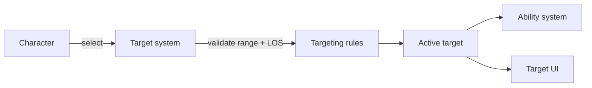

# Target System

**Short description:** Raycast-based targeting system for FishMMO characters, handling target selection, self-hit avoidance, and event-driven notifications on both client and server.

## Table of Contents

- [Overview](#overview)
- [Supported Platforms](#supported-platforms)
- [Features](#features)
- [Prerequisites](#prerequisites)
- [Installation / Build](#installation--build)
- [Quick Start Guide](#quick-start-guide)
- [Configuration](#configuration)
- [Usage Examples](#usage-examples)
- [Operational Checks](#operational-checks)
- [Flow Diagram](#flow-diagram)
- [Project Structure](#project-structure)
- [License](#license)

## Overview

The Target system provides raycast-based targeting for FishMMO characters. It handles target selection via physics raycasts, self-hit avoidance, target change/update/clear event notifications, and supports both client-side (screen-space mouse ray) and server-side (physics scene ray) targeting. The system operates on a configurable tick rate and exposes target state through a lightweight `TargetInfo` struct consumed by the ability system and UI.

## Supported Platforms

| Platform | Supported | Notes |
|----------|-----------|-------|
| Windows  | Yes       | Full client and server support |
| Linux    | Yes       | Full client and server support |
| WebGL    | Yes       | Client-side targeting only |

- **Unity Version:** Unity 6.3 LTS
- **Scripting Backend:** IL2CPP

## Features

- Raycast-based target selection from mouse position (client) or caller-provided ray (server)
- Self-hit avoidance with automatic re-raycast past the player's own collider
- Configurable physics layer mask for target filtering
- Event-driven notifications: `OnChangeTarget`, `OnUpdateTarget`, `OnClearTarget`
- Client-side **pinned target** beside the hover target: `TogglePinnedTarget` / `TryPinTarget` / `ClearPinnedTarget`, with `OnPinTarget` / `OnUnpinTarget` events and a pure release rule in `PinnedTargetRules`
- Lightweight `TargetInfo` value-type struct for zero-allocation target state
- Configurable tick rate (`TARGET_UPDATE_RATE`) to control update frequency
- Maximum target distance clamping (`MAX_TARGET_DISTANCE`)
- Platform-aware raycasting (client `Physics.Raycast` vs. server `PhysicsScene.Raycast`)
- Automatic cleanup of event delegates and target state on destroy

## Prerequisites

- **Unity 6.3 LTS**
- **FishNetworking** — Network transport and `CharacterBehaviour` base class
- **FishMMO Shared Core** — `PlayerCharacter`, `CharacterBehaviour`, scene/physics infrastructure

## Installation / Build

This is an integrated module within the FishMMO project. No separate installation or build steps are required. The target system is included automatically when the FishMMO Shared assembly is referenced.

## Quick Start Guide

1. Ensure `PlayerCharacter` has a `TargetController` component (added automatically via `[RequireComponent]`).
2. Configure the `LayerMask` field in the Inspector to include targetable physics layers.
3. Subscribe to targeting events on `ITargetController`:
   - `OnChangeTarget` — fired when a new target is selected.
   - `OnUpdateTarget` — fired when the same target is re-validated.
   - `OnClearTarget` — fired when the previous target is deselected.
4. On the server, call `ITargetController.UpdateTarget(origin, direction, maxDistance)` directly from the ability system.

## Configuration

### Constants

| Constant               | Value   | Description                                      |
|------------------------|---------|--------------------------------------------------|
| `MAX_TARGET_DISTANCE`  | `50.0f` | Maximum allowed raycast distance                 |
| `TARGET_UPDATE_RATE`   | `0.05f` | Seconds between target update ticks (client-side)|
| `PinnedTargetRules.RELEASE_DISTANCE` | `75.0f` | Distance beyond which a pinned target is released; wider than acquisition so a chased target keeps its card |

### Inspector Fields

| Field       | Type         | Description                                     |
|-------------|--------------|-------------------------------------------------|
| `LayerMask` | `LayerMask`  | Physics layer mask for target raycasts          |

### Runtime State

| Field       | Type         | Description                                     |
|-------------|--------------|-------------------------------------------------|
| `Last`      | `TargetInfo` | The previous frame's target information         |
| `Current`   | `TargetInfo` | The current frame's target information          |

### TargetInfo Struct

| Field         | Type        | Description                                           |
|---------------|-------------|-------------------------------------------------------|
| `Target`      | `Transform` | The transform of the targeted object, or `null` if nothing was hit |
| `HitPosition` | `Vector3`   | The world-space position where the ray hit, or the ray endpoint if nothing was hit |

### Platform Differences

| Feature              | Client (`!UNITY_SERVER`)                          | Server (`UNITY_SERVER`)                                |
|----------------------|---------------------------------------------------|--------------------------------------------------------|
| **Raycast API**      | `Physics.Raycast(ray, ...)`                       | `PlayerCharacter.Motor.PhysicsScene.Raycast(...)`      |
| **Update loop**      | `Update()` with tick rate                         | No automatic updates; called by ability system         |
| **Ray source**       | `Camera.main.ScreenPointToRay(Input.mousePosition)` | Provided by caller (e.g., ability controller)       |

## Usage Examples

### ITargetController Interface

| Member           | Type / Signature                                          | Description                                         |
|------------------|-----------------------------------------------------------|-----------------------------------------------------|
| `Current`        | `TargetInfo`                                              | The current target information (read-only)          |
| `OnChangeTarget` | `event Action<Transform>`                                 | Fired when the target changes to a different object |
| `OnUpdateTarget` | `event Action<Transform>`                                 | Fired when the same target is re-validated          |
| `OnClearTarget`  | `event Action<Transform>`                                 | Fired when the previous target is deselected        |
| `UpdateTarget`   | `TargetInfo UpdateTarget(Vector3, Vector3, float)`        | Performs a raycast and returns updated target info   |
| `PinnedTarget`   | `Transform`                                               | The character the owning client pinned to its frame, or null; always null on the server |
| `OnPinTarget`    | `event Action<Transform>`                                 | Fired on the owning client when a character is pinned |
| `OnUnpinTarget`  | `event Action<Transform>`                                 | Fired when the pin is released; null when the target was destroyed |
| `TogglePinnedTarget` | `bool TogglePinnedTarget()`                            | Pins the hovered character, or releases the pin when nothing (or the pinned character) is hovered |
| `TryPinTarget`   | `bool TryPinTarget(Transform)`                            | Pins a specific character; refused for non-characters, unspawned objects and oneself |
| `ClearPinnedTarget` | `void ClearPinnedTarget()`                             | Releases the pin |

### Client-Side Update Loop

On the client (`!UNITY_SERVER`), `Update()` runs at `TARGET_UPDATE_RATE`:

1. Constructs a ray from `Camera.main.ScreenPointToRay(Input.mousePosition)`.
2. Calls `UpdateTarget()` with the ray's origin, direction, and `MAX_TARGET_DISTANCE`.
3. Compares `Current.Target` with `Last.Target`:
   - **Target changed**: Invokes `OnClearTarget` for the old target, then `OnChangeTarget` for the new.
   - **Target unchanged**: Invokes `OnUpdateTarget` for the current target.

### Pinned Target

The hover target is the right readout for action combat — abilities go where the player aims — but it vanishes the moment the pointer moves, which makes it useless for following one opponent through a fight. The pin is a second, client-only target that lives beside the hover target rather than replacing it:

1. The `PinTarget` input action (`F` by default) calls `TogglePinnedTarget()`: it pins the character under the pointer, or releases the pin when the pointer is on nothing or on the pinned character itself.
2. Only spawned characters other than the player can be pinned. Scenery and interactables stay hover-only, so pinning never gets between the player and a door.
3. Each trace tick the controller asks `PinnedTargetRules.ShouldRelease` whether the pin still holds. It is released when the target is destroyed or despawned on this client, when it dies, or when it moves beyond `RELEASE_DISTANCE` (75 m, deliberately wider than the 50 m acquisition range so a target pinned at the edge does not flicker). Nothing else releases it — not the pointer, not a panel opening.
4. The pinned target takes precedence in the advisory `TargetSelectionBroadcast`, so the streaming budget never evicts the character the player is tracking.

**The pin is never a combat target.** Ability acquisition remains a server-side lag-compensated raycast from the replicated aim; the pin only changes what the player is shown. `UITKTarget` draws it as a second card beside the hover card, `ClientNameplateDisplay` keeps its nameplate up, and the party and guild invite buttons fall back to it when nothing is hovered.

### Self-Hit Avoidance

When the raycast hits the casting character itself, the controller fires a second raycast:
1. Moves the ray origin slightly past the hit point (`hit.point + direction.normalized * 0.1f`).
2. Reduces the max distance by the already-traveled distance.
3. Uses the new hit (if any) as the actual target.

This prevents the player from always targeting themselves when the camera is behind the character.

### External Integration Points

- **Ability System** — `AbilityController` calls `ITargetController.UpdateTarget()` to resolve the target before spawning ability objects. `AbilityObject.Spawn()` and `SetAbilitySpawnPosition()` use `TargetInfo` to determine projectile aim direction and ground-targeted ability placement.
- **UI System** — Subscribes to `OnChangeTarget`, `OnUpdateTarget`, and `OnClearTarget` to display target frames, health bars, name labels, and outline highlights; and to `OnPinTarget` / `OnUnpinTarget` for the pinned card.
- **PlayerCharacter** — `TargetController` is a `[RequireComponent]` on `PlayerCharacter`, ensuring every player entity has targeting capability.

### Cleanup

`OnDestroying()` nulls all three event delegates (`OnChangeTarget`, `OnUpdateTarget`, `OnClearTarget`) and resets `Last` and `Current` to `default` to prevent dangling references.

## Operational Checks

| Check | How to Verify | Expected Result |
|-------|---------------|-----------------|
| Target selection | Hover mouse over a targetable entity, observe target frame UI | `OnChangeTarget` fires, UI displays target info |
| Target clear | Move mouse away from all entities | `OnClearTarget` fires, UI hides target info |
| Pin target | Hover a character and press `F` | `OnPinTarget` fires; the pinned card stays up while the pointer moves away |
| Pin release | Press `F` with nothing (or the pinned character) hovered; or let the target die, despawn or pass 75 m | `OnUnpinTarget` fires, the pinned card comes down |
| Self-hit avoidance | Position camera behind character, hover over distant entity | Target resolves to distant entity, not self |
| Layer mask filtering | Set `LayerMask` to exclude a layer, hover over entity on that layer | Entity is not targeted |
| Server-side targeting | Use ability on server, check `UpdateTarget` return | `TargetInfo` contains correct target and hit position |
| Event consistency | Subscribe to all three events, cycle through targets | Events fire in correct order: Clear → Change or Update |

## Flow Diagram

### High-Level Overview



### UpdateTarget Flow

```
UpdateTarget(origin, direction, maxDistance)
    │
    ├── Clamp distance to [0, MAX_TARGET_DISTANCE]
    │
    ├── Raycast (client: Physics.Raycast, server: PhysicsScene.Raycast)
    │   │
    │   ├── Hit detected:
    │   │   │
    │   │   ├── Self-hit check (hitPlayerCharacter.ID == Character.ID)
    │   │   │   │
    │   │   │   └── Re-raycast from hit point + 0.1 * direction
    │   │   │       (uses remaining distance to avoid overshooting)
    │   │   │
    │   │   └── Return TargetInfo(hit.transform, hit.point)
    │   │
    │   └── No hit:
    │       └── Return TargetInfo(null, ray.GetPoint(distance))
    │
    └── Store result in Current, move old Current to Last
```

### Event Flow

```
Frame N:
    UpdateTarget() → Current = { TargetA, hitPos }

Frame N+1:
    UpdateTarget() → Current = { TargetB, hitPos }
    Current.Target != Last.Target
        → OnClearTarget(TargetA)      // old target deselected
        → OnChangeTarget(TargetB)     // new target selected

Frame N+2:
    UpdateTarget() → Current = { TargetB, hitPos }
    Current.Target == Last.Target
        → OnUpdateTarget(TargetB)     // same target, position refreshed

Frame N+3:
    UpdateTarget() → Current = { null, endpoint }
    Current.Target != Last.Target
        → OnClearTarget(TargetB)      // old target deselected
        → OnChangeTarget(null)        // no new target
```

## Project Structure

### Directory Structure

```
Target/
├── ITargetController.cs    # Target controller interface
├── TargetController.cs      # Per-entity controller (CharacterBehaviour)
└── TargetInfo.cs            # Lightweight target data struct
```

### Inheritance Hierarchies

#### Controllers (CharacterBehaviour)

```
CharacterBehaviour
└── TargetController : ITargetController
```

#### Data Structures

```
TargetInfo (struct)
    ├── Target      : Transform
    └── HitPosition : Vector3
```

## License

This project is subject to the FishMMO project license.
