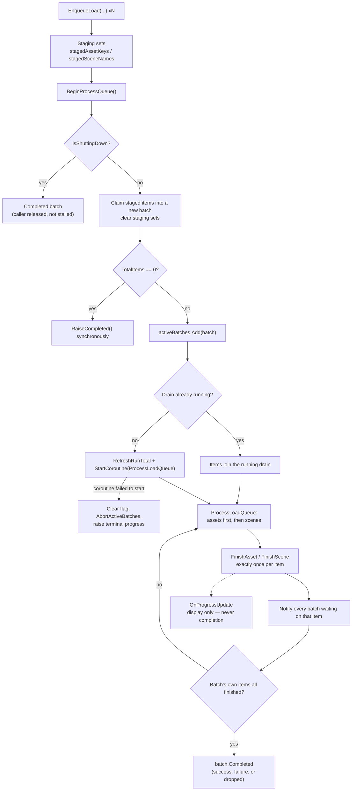

# Addressable Load Processor

**Short description:** A central queue for Addressable asset and scene loading. Callers stage work with `EnqueueLoad`, then claim it with `BeginProcessQueue()`, which returns an `AddressableLoadBatch` that completes when exactly that caller's items have finished.

## Table of Contents

- [Overview](#overview)
- [Batches vs. Progress](#batches-vs-progress)
- [Invariants](#invariants)
- [API](#api)
- [Data Types](#data-types)
- [Usage](#usage)
- [Shutdown](#shutdown)
- [Editor Play Mode Fix](#editor-play-mode-fix)
- [Operational Checks](#operational-checks)
- [Flow Diagram](#flow-diagram)
- [Project Structure](#project-structure)
- [License](#license)

## Overview

`AddressableLoadProcessor` is a static class backed by an on-demand `AddressableLoadHelper` MonoBehaviour that owns the drain coroutine and survives scene loads via `DontDestroyOnLoad`.

The usage pattern is **stage, then claim**:

1. Call `EnqueueLoad(...)` any number of times. Items land in a staging set.
2. Call `BeginProcessQueue()`. It claims everything staged since the previous call into a new batch, starts the drain if it is not already running, and hands the batch back.
3. Subscribe to `batch.Completed`.

Multiple callers can be in flight at once. A batch created while a drain is already running joins that drain and still completes independently of every other batch.

## Batches vs. Progress

This distinction is the reason the type exists, and getting it wrong reintroduces a class of hangs and double-invocations:

| | `AddressableLoadBatch.Completed` | `AddressableLoadProcessor.OnProgressUpdate` |
|---|---|---|
| Scope | Exactly the items one `BeginProcessQueue()` call claimed | Global aggregate across everything in flight |
| Use for | **Completion** | **Display only** — progress bars |
| Fires for work you did not request | Never | Yes |

`OnProgressUpdate` is a single multicast delegate shared by every bootstrap system, both loading screens, and the world-scene readiness handshake. Any queue draining anywhere reported "done" to all of them. Worse, a handler that resubscribed during dispatch mutated the invocation list while the runtime was iterating a stale snapshot of it, which could run another subscriber twice.

Each `BeginProcessQueue` call produces its own batch with its own event, so callers cannot observe one another's completion, and a handler that starts new work during dispatch is operating on a different object entirely.

**A batch counts an item as finished whether it succeeded, failed, or was dropped.** Load failures surface through `FailedItems` rather than by withholding completion — a batch that never completes would stall its caller forever, which is precisely the failure this design replaces.

## Invariants

Three properties the implementation depends on. Breaking any of them produces a hang rather than an error:

- **Termination.** Every item entering the queue must call `FinishAsset` or `FinishScene` exactly once, on every path — success, failure, duplicate, or invalid handle. An item that leaves without being finished is never removed from the in-flight tables, so `PendingItemCount` never reaches zero, the drain loop never exits, and every batch waiting on it stalls forever.
- **Ordering.** Within a pass the drain processes **assets before scenes**. Callers rely on this: bootstrap systems enqueue template labels and scenes together and expect templates to be in the cache before a scene referencing them deserializes.
- **Monotonic totals.** `RefreshRunTotal()` only ever raises the run's item total, so aggregate progress cannot move backwards when work is enqueued mid-drain.

## API

### Enqueue

| Overload | Purpose |
|---|---|
| `EnqueueLoad(string label, MergeMode = None)` | One asset label |
| `EnqueueLoad(IEnumerable<string> labels, MergeMode = None)` | Several labels |
| `EnqueueLoad(string label, string key, MergeMode = Intersection)` | Label + key pair |
| `EnqueueLoad(IEnumerable<KeyValuePair<string,string>> labels, MergeMode = Intersection)` | Several label/key pairs |
| `EnqueueLoad(AddressableSceneLoadData data, Action<Scene> globalOnScenePostProcess = null)` | One scene |
| `EnqueueLoad(IEnumerable<AddressableSceneLoadData> datas, Action<Scene> globalOnScenePostProcess = null)` | Several scenes |

Enqueuing an asset already loaded, or anything at all while shutting down, is a no-op. Enqueuing a scene that is already staged merges the two entries' `OnSceneLoaded` callbacks rather than dropping one.

### Drain

`static AddressableLoadBatch BeginProcessQueue()`

Claims the staged items into a new batch and starts the drain if needed. Two cases complete synchronously, before the call returns:

- **Nothing to claim** — everything requested was already loaded, or nothing was requested. Subscribing to `Completed` afterwards still invokes the handler, so sequential chains advance without waiting a frame.
- **Shutting down** — new work is refused, but a completed batch is still handed back so a caller awaiting it is released rather than stalled mid-quit.

If the drain coroutine fails to start, the processor clears `isProcessingQueue` (leaving it set would make every future `BeginProcessQueue` a silent no-op), aborts the active batches instead of hanging them, and raises a terminal progress value so loading screens do not sit over a dead queue.

### Observation

| Member | Meaning |
|---|---|
| `OnProgressUpdate` | `Action<float>` — display-only aggregate. Subscriber exceptions are caught and logged, never propagated into the drain |
| `OnAddressableLoaded` / `OnAddressableUnloaded` | `Action<UnityEngine.Object>` |
| `OnSceneLoaded` / `OnSceneUnloaded` | `Action<Scene>` / `Action<string>` |
| `CurrentProgress` | `itemsCompletedThisRun / itemsTotalThisRun`, clamped |
| `RemainingAssetsToLoad` | Items still queued or in flight |
| `IsLoading` | True while the drain runs |

> `IsLoading` exists so a subscriber created mid-drain can seed its own state. A loading screen living in a scene the processor is itself loading is exactly that case: every event raised before its `Awake` is lost, so without this it cannot distinguish "boot is still running" from "nothing is happening" until the next item happens to finish.

> `CurrentProgress` divides by the run's total, not by the remaining count. The earlier `processed / remaining` form produced 1/3, 2/2, 3/1, 4/0 for a four-item load — values at or above 1 from the halfway point on, which callers discarded, so bars never animated past the first item.

### Prefabs and unloading

| Method | Purpose |
|---|---|
| `LoadPrefabAsync(AssetReference, Action<GameObject>)` | Load a prefab outside the queue |
| `UnloadPrefab(AssetReference)` | Release it |
| `UnloadAssetByKey(AddressableAssetKey)` | Release a queued asset |
| `UnloadSceneByLabelAsync(string \| List<string> \| List<AddressableSceneLoadData>)` | Unload scenes |
| `IsSceneLoaded(string)` | Query |
| `ReleaseAllAssets()` | Full teardown — see [Shutdown](#shutdown) |

## Data Types

### `AddressableLoadBatch`

| Member | Meaning |
|---|---|
| `Completed` | `event Action<AddressableLoadBatch>` — raised once, when this batch's items have all finished. Subscribing to an already-complete batch invokes the handler immediately |
| `Progressed` | `event Action<float>` — this batch's own progress |
| `TotalItems` / `CompletedItems` | Counts |
| `Progress` | `CompletedItems / TotalItems`, or `1` when empty |
| `IsComplete` | Whether `Completed` has fired |
| `FailedItems` | `IReadOnlyList<string>` of names/keys that did not load successfully |
| `HasFailures` | Convenience over `FailedItems` |

### `AddressableAssetKey`

`List<string> Keys` plus a `MergeMode`. Implements `Equals`/`GetHashCode` so it can key the staging and in-flight sets.

### `AddressableSceneLoadData`

| Field | Default | Purpose |
|---|---|---|
| `SceneName` | — | Addressable scene name |
| `ActivateOnLoad` | `true` | Activate once loaded |
| `LoadSceneMode` | `Additive` | Load mode |
| `OnSceneLoaded` | `null` | Per-scene callback; merged when a duplicate is enqueued |

## Usage

```csharp
// Stage the work.
AddressableLoadProcessor.EnqueueLoad(new List<string>
{
    "Client_Static_Permanent",
    Constants.SharedStaticLabel,
});
AddressableLoadProcessor.EnqueueLoad(
    new AddressableSceneLoadData("ClientPostboot", OnPostbootSceneLoaded));

// Claim it and wait on this batch only.
AddressableLoadBatch batch = AddressableLoadProcessor.BeginProcessQueue();
batch.Completed += OnBatchCompleted;

void OnBatchCompleted(AddressableLoadBatch b)
{
    if (b.HasFailures)
    {
        // Report and continue. Do not block the chain on a failed item.
        Log.Error("MySystem", $"{b.FailedItems.Count} item(s) failed to load.");
    }
    // ... proceed
}
```

For a progress bar, subscribe to `OnProgressUpdate` (or `batch.Progressed` for just your own work) — never to detect completion.

## Shutdown

`ReleaseAllAssets()` tears the processor down and sets `isShuttingDown`, after which every `EnqueueLoad` is ignored and `BeginProcessQueue` returns an already-completed batch. It clears the staging sets, the active batch list, and the public event delegates so a stale subscriber from a previous run cannot be invoked after a domain reload.

## Editor Play Mode Fix

`../Editor/AddressablesPlayModeSceneHandleFix.cs` works around an "Attempting to use an invalid operation handle" exception thrown out of the Addressables package's own Play Mode teardown.

`AddressablesImpl` tracks a loaded Addressable scene in two places — `m_SceneInstances` and `m_resultToHandle`. `Dispose()` releases every handle in the second, then every handle in the first, with no `IsValid()` guard on either pass. The first pass drops a scene handle's refcount to zero, destroying the operation and bumping its version; the second releases that same stale handle and `AsyncOperationHandle.InternalOp` throws. Any Addressable scene still loaded when Play Mode exits reproduces it.

Our own shutdown cannot cover this. `Addressables.Initialize()` subscribes its cleanup from both `[InitializeOnLoadMethod]` and `[RuntimeInitializeOnLoadMethod(SubsystemRegistration)]`, long before any MonoBehaviour runs, and `EditorApplication.playModeStateChanged` dispatches in subscription order — so `Dispose()` runs *before* `ReleaseAllAssets` ever sees `ExitingPlayMode`. Unloading scenes there would not help regardless: scene unload is asynchronous and Play Mode exit gives it no frame to finish in.

The fix subscribes from `[InitializeOnLoadMethod]`, which runs at domain load and therefore lands ahead of Addressables' handler (Addressables re-appends itself to the tail of the delegate at SubsystemRegistration on every Play Mode start — true whether or not domain reload is disabled). It empties `m_SceneInstances` before `Dispose()` runs.

## Operational Checks

| Check | How to verify | Expected result |
|---|---|---|
| Empty batch completes | `BeginProcessQueue()` with nothing staged | `IsComplete` true on return; a handler subscribed afterwards still fires |
| Batches are independent | Two systems enqueue and claim separately | Each `Completed` fires once, only for its own items |
| Failures do not stall | Enqueue a missing Addressable key | Batch completes with `HasFailures`; the item is named in `FailedItems` |
| Assets precede scenes | Enqueue a template label and a scene using it together | Templates resolve before the scene deserializes |
| Progress animates | Watch a multi-item load | Bar advances smoothly rather than sticking after the first item |
| Play Mode exit is clean | Exit Play Mode with an Addressable scene loaded | No "invalid operation handle" exception in the console |

## Flow Diagram



## Project Structure

```
AddressableLoadProcessor/
├── AddressableLoadProcessor.cs   # Static queue, drain coroutine, unload + teardown APIs
├── AddressableLoadBatch.cs       # Per-caller completion handle
├── AddressableAssetKey.cs        # Asset keys + merge mode, value-equality
├── AddressableSceneLoadData.cs   # Scene name, load mode, activation, per-scene callback
└── README.md                     # This document

../Editor/
└── AddressablesPlayModeSceneHandleFix.cs   # Editor-only Play Mode teardown workaround
```

### Consumers

| Consumer | Uses it for |
|---|---|
| [BootstrapSystem](../../../../Bootstrap/README.md) | Preload and postload phases, each waiting on its own batch |
| [ClientLauncher](../../../../../../Client/Launcher/README.md) | Loading `ClientPostboot` on Play and unloading the launcher scene |
| Loading screens | `OnProgressUpdate` and `IsLoading` for display |

## License

This module is part of the FishMMO project and is distributed under the FishMMO project license.
