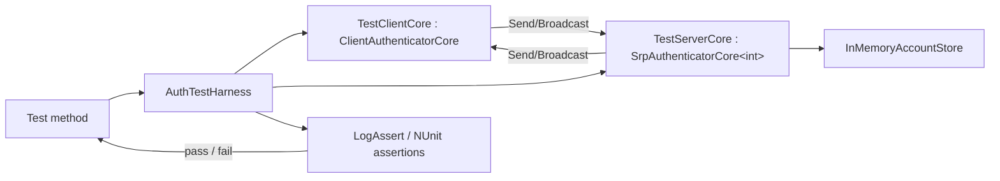

# FishMMO Unit Tests

The FishMMO test suite. **367 fixtures / ~3,730 test methods** live here, split across two
assemblies:

- **`FishMMO.UnitTests`** — 362 EditMode fixtures, all running without a NetworkManager, a
  physics simulation, or a live server.
- **`FishMMO.UnitTests.PlayMode`** — 5 fixtures that drive the simulation harness in
  `Assets/TestHarness/` under a real player loop and a real FishNet server.

A fixture here is a `.cs` file with at least one `[Test]`, `[UnityTest]` or `[TestCase]`
method; the counts are regenerated from the folders, not maintained by hand.

| Area | Folder | Fixtures | What it covers |
| --- | --- | --- | --- |
| **Prediction & combat** | `Prediction/` | 97 | The unified prediction pipeline, delta serialization, lag compensation, the attribute ledger, buffs, cooldowns, abilities, combat refusals, observer sync/culling, bandwidth budgets |
| **Gameplay, UI, content, server rules** | root | 168 | Auth and the login queue, UI Toolkit panels, items/trade/merchant, abilities, guild/group/arena, chat, naming & races, world map, nameplates, staff tools, persistence and hot-path pins, network statistics, prefab authoring |
| **NPC AI** | `AI/` | 39 | Combat decisions, personalities, kiting, threat and the leash evade, packs, boss adds, scheduling and LOD, body-grid separation, pets, NavMesh bake agreement, spawners |
| **Housing** | `Housing/` | 14 | Plot identity, ownership, access, placement, lifecycle, tax billing and routing, vault fees, the plot-sync window |
| **Weather & sky** | `Weather/` | 13 | The weather model, storm shapes, exposure, sky and clock, presentation, the host's scheduling, the wire |
| **World design** | `WorldDesign/`, `Celestial/` | 7 | Atlas geometry and routing, scene generation, world data, the world-systems audit, planet surfaces |
| **Servers & operations** | `Server/` | 12 | Scene placement and instance lifetimes, world routing and its clock, the world-queue place memory, shutdown countdowns, maintenance and daemon clocks, server bandwidth |
| **PlayMode sims** | `PlayMode/` | 5 | The four simulation scenes plus an `Update`-dispatch cost probe |
| **Currency / Map** | `Currency/`, `Map/` | 8 | Spend/grant paths, the persisted ledger numbering, trade currency settlement, map projection, markers and the explored readout |
| **Persistence, travel, NPC designer** | `Persistence/`, `Teleport/`, `Waypoint/`, `NPC/` | 4 | The 2026-09-07 persistence audit invariants, teleporter keys, waypoint unlock bits, the dashboard NPC designer |

The suite is a **regression ledger** as much as a test suite: a large share of the
`Prediction/` fixtures are named after the audit that found the defect
(`CombatAudit20260831Round3Tests`, `PredictionAuditRegressionTests`,
`AuditFollowUpFixTests`) and each test names the defect it pins.

### The authentication harness

Pairs `ClientAuthenticatorCore` and `SrpAuthenticatorCore<TConnection>` from the
`FishMMO-Auth` DLLs in-process and routes all `Send*` / `Broadcast*` calls
synchronously, completely bypassing FishNet and the network transport.

### The prediction harness

There is no equivalent single harness — the prediction fixtures instead lean on the
production code having been **shaped for testability**, which is a deliberate and
recurring pattern rather than an accident:

- **Pure functions extracted from behaviours.** `LagCompensationTick.ResolveViewOffset` /
  `ResolveAnchor`, `CharacterPredictionController.IsTransformRedundant`,
  `Buff.DurationToTicks`, `AbilityController.ResolveInterruptDisposition`,
  `TargetOrdering.*`. These exist so a rule can be exercised against production
  rather than re-implemented in a test — a re-implementation only ever proves the
  test agrees with itself.
- **`internal` + `InternalsVisibleTo`** (`Scripts/Shared/AssemblyInfo.cs`) for test seams that
  should not be public API. Two assemblies are named there: `FishMMO.UnitTests` and
  `FishMMO.TestHarness`.
- **`ScriptableObject.CreateInstance` + `AddToCache`/`RemoveFromCache`** to stand up
  templates without assets. Remember that a `CreateInstance` template leaves
  collection fields null where an authored asset would serialise them empty, and that a
  template's `ID` is 0 until it is cached.
- **`AddComponent` + an explicit `OnAwake()`**, since Unity's own callbacks do not run
  for a bare `AddComponent` in edit mode.
- **`Harness/StubCharacter`** — a minimal `ICharacter` for exercising one
  `CharacterBehaviour` without a networked character. Only the behaviour lookup, the flags
  and registration are implemented; everything else throws deliberately.
- **Reflection**, but only for genuinely private mechanism (`CharacterPositionHistory.Record`,
  `BuffController.ApplyObservedBuffs`).

### The UI Toolkit pattern

Panel fixtures (`MerchantPanelTests`, `TradePanelTests`, `AbilitiesPanelTests`,
`EquipmentPanelLayoutTests`, `ColorPickerTests`, `ScrollbarThemeTests`,
`Map/ExploredReadoutTests`, `NameGeneratorWindowTests`, `BuffDismissTooltipTests`) mount the real
panel on a real `UIDocument`: clone `Assets/UI Toolkit/PanelSettings.asset`, set `visualTreeAsset`
to the panel's UXML, `AddComponent` the panel class, then call its `OnStarting()` directly —
Unity's own callbacks never fire in edit mode. There is no shared helper; each fixture builds its
own so the setup stays legible next to the assertions.

`FishMMO.Client` carries no `InternalsVisibleTo` (only `Assets/Scripts/Shared/AssemblyInfo.cs`
does), so a `Client` panel's `internal` seams — `UITKBuffContainer.TryRequestDismiss`,
`CanDismiss`, `UITKControl.Awake` — are reached by reflection rather than widened to `public` for
the tests' sake. `BuffDismissTooltipTests` also seeds the strip's private `entries` model by
reflection, asserting the *permitted* case as well as the refused one so a silently failed seed
cannot pass.

Two traps that have already been paid for: hiding a panel disables its `UIDocument` and
discards the tree, so a re-`Show()` must be followed by re-querying elements; and a
`suppress` flag wrapped around `.value =` is inert inside a dispatch — use
`SetValueWithoutNotify`.

**Prefer a behavioural assertion to a source-text one.** Several fixtures used to grep the
source for a literal spelling; those break on any refactor while proving less than the
consequence does. Where a property has no behavioural expression at all — "this number is
read live from `PredictionManager.StateInterpolation` rather than assumed" — a source
assertion is the right tool, and should say why it is one. New source pins go through
`SourceScanPins` (root): `CodeOnly` / `Body` / `InOrder` read code without its comments, and
`HoldsAndFires` runs each check twice — on the real source, where it must pass, and on a copy
with the defect put back, where it must fail — so a pin whose anchor was reworded fails instead
of passing while checking nothing. Nineteen fixtures use it so far (`AuthClockPinsTests`,
`ChatPumpTests`, `GuildSocialFollowUpTests`, `AI/NPCPackTests`, `Server/ControlPanelClockTests`,
…); older source pins, including several of the `*PinsTests` fixtures, still scan with their own
regexes.

## Table of Contents

- [Description](#fishmmo-unit-tests)
- [Supported Platforms](#supported-platforms)
- [Architecture](#architecture)
- [Key Components](#key-components)
- [Configuration](#configuration)
- [Running](#running)
- [Layout](#layout)
- [PlayMode tests and the simulation harness](#playmode-tests-and-the-simulation-harness)
- [Test inventory](#test-inventory)
- [State machine driven by each login test](#state-machine-driven-by-each-login-test)
- [`InMemoryAccountStore` API](#inmemoryaccountstore-api)
- [Extending](#extending)
- [Known limitations](#known-limitations)
- [Flow Diagram](#flow-diagram)

## Supported Platforms

| Platform | Status | Notes |
| --- | --- | --- |
| Unity Editor on Windows / Linux / macOS | Supported | Run via Test Runner (EditMode) or the `FishMMO Dashboard → Core → Unit Tests` page. |
| Unity batch mode (headless) | Supported | `-runTests -testPlatform EditMode`; see [Running](#running). |
| Player builds | Not applicable | Both assemblies carry the `UNITY_INCLUDE_TESTS` define constraint. |

Requirements: Unity 6.3 LTS, the `FishMMO-Auth` DLLs present in `Assets/Dependencies/`, and the Unity Test Framework package.

`FishMMO.UnitTests.asmdef` is `"includePlatforms": ["Editor"]` with
`"defineConstraints": ["UNITY_INCLUDE_TESTS", "!UNITY_SERVER"]` — the `!UNITY_SERVER`
constraint is there because the assembly references `FishMMO.Client`, which is itself
`!UNITY_SERVER` constrained. It also sets `"overrideReferences": true`, so **a new test
that touches an assembly not already in the `references` list will compile under
`dotnet build` and then fail Unity compilation with CS0246** — add the reference to the
asmdef, not just to the generated csproj.

`PlayMode/FishMMO.UnitTests.PlayMode.asmdef` has `"includePlatforms": []` (all platforms);
an Editor-only asmdef would be classified EditMode and the PlayMode runner would silently
report `total=0`.

## Architecture

```
Assets/UnitTests/
├── FishMMO.UnitTests.asmdef                  # EditMode-only assembly definition
├── UnitTestMenu.cs                           # FishMMO Dashboard → Core → Unit Tests buttons + auth DLL provenance report
├── TestAssemblySetup.cs                      # [SetUpFixture] — initialises FishMMO.Logging.Log
├── SourceScanPins.cs                         # Source-scan helpers with a control run (HoldsAndFires)
├── Harness/
│   ├── AuthTestHarness.cs                    # Pairs ClientAuthenticatorCore + SrpAuthenticatorCore in-process
│   ├── TestClientCore.cs                     # ClientAuthenticatorCore subclass (payload capture + interceptors)
│   ├── TestServerCore.cs                     # SrpAuthenticatorCore<int> subclass (broadcast routing, AddressResolver)
│   ├── InMemoryAccountStore.cs               # IAccountStore double (no DB)
│   ├── StubCharacter.cs                      # Minimal ICharacter for single-behaviour tests
│   ├── AuthTestTrace.cs                      # Trace gateway (AuthTestTrace.Verbose)
│   └── LogAssert.cs                          # NUnit assertion wrappers that log pass/fail
├── AI/                          (39)         # NPC brains, threat, leash evade, packs, scheduling, pets, NavMesh, spawners
│   ├── SpawnerTestKit.cs                     #   Helper: SpawnerRuntimes that respawn without a network stack
│   └── BrainCatalogueYaml.cs                 #   Helper: reads the server's AI brain catalogue from YAML
├── Celestial/                    (1)         # Planet surface generated from a seed
├── Currency/                     (3)         # Spend/grant path, persisted ledger numbering, trade currency settlement
├── Housing/                     (14)         # Plot identity, access, placement, lifecycle, tax billing and routing, fees, sync window
├── Map/                          (5)         # Map projection, explored readout, marker click and culling, dungeon entrances
├── NPC/                          (1)         # Dashboard NPC designer / NPCPrefabFactory
├── Persistence/                  (1)         # 2026-09-07 persistence audit invariants
├── Prediction/                  (97)         # Prediction, combat, observers, bandwidth
├── Server/                      (12)         # Placement, instance lifetimes, world routing, shutdown, maintenance, daemon, bandwidth
├── Teleport/                     (1)         # Teleporter key + live-vs-baked waypoints
├── Waypoint/                     (1)         # Waypoint unlock bit set, travel truth table
├── Weather/                     (13)         # Weather model, storms, exposure, sky and clock, presentation, host scheduling
├── WorldDesign/                  (6)         # World atlas, scene generation, world data, world-systems audit
├── PlayMode/                     (5)         # Simulation-scene tests + Update dispatch cost
│   └── FishMMO.UnitTests.PlayMode.asmdef
├── *.cs                        (168)         # Auth, UI panels, items, abilities, social, chat, staff tools, server rules
└── README.md                                 # This document

Counts in brackets are fixtures; the helper files listed are not.
```

EditMode tests do not touch PostgreSQL, FishNet, sockets, or any singleton state — each
test instantiates a fresh harness and account store. The asset-scanning fixtures
(`PrefabNetworkAuthoringTests`, `RegionAssetIntegrityTests`, `AI/NavMeshSceneBakeTests`,
`AI/AILodAssignmentTests`, `WorldMapDefinitionTests`) read on-disk YAML or the asset
database instead, so they see what is actually shipped rather than what a loaded asset
reports.

## Key Components

| Component | Purpose |
| --- | --- |
| `AuthTestHarness` | Constructs a paired client / server authenticator, wires `Send*` and `Broadcast*` to direct in-process calls, drives the test scenario. Exposes `Client`, `Server`, `Store`. |
| `InMemoryAccountStore` | Implements the same surface as the production account store, but keeps state in dictionaries — see [`InMemoryAccountStore` API](#inmemoryaccountstore-api). |
| `TestServerCore` | `SrpAuthenticatorCore<int>` subclass — FishNet's `NetworkConnection` is replaced by a plain `int` connection ID so the server authenticator can talk to a virtual client. `AddressResolver` fakes the source IP; `ConnectionEpoch` counts attempts. |
| `TestClientCore` | `ClientAuthenticatorCore` subclass — captures every encrypted payload, exposes `SetToken`, `AttemptLogin`, `AttemptTokenLogin`, `ReconnectAs`, and the `SrpProofInterceptor` / `SrpVerifyInterceptor` tamper hooks. |
| `StubCharacter` | Minimal `ICharacter` — behaviour lookup, flags, registration. Every other member throws so a test that wanders off says so. |
| `LagCompensationTick.ClaimOverride` | The one production accommodation for the simulation harness: an `internal static` hook, null in production, consulted before the owner/AI gates so a sim can carry synthetic 0–500 ms latency claims through the real rewind path. |

## Configuration

These tests are configuration-free: no environment variables, `appsettings`,
or external services are read. Verbose logging is toggled via the
`FishMMO Dashboard → Core → Unit Tests → Run All EditMode Tests (Verbose)` button, which sets
the static `AuthTestTrace.Verbose` flag for the run.

---

## Running

1. Open the project in Unity.
2. `Window > General > Test Runner`.
3. Select the **EditMode** tab.
4. Run the `FishMMO.UnitTests` assembly.

Or use the FishMMO Dashboard's **Core → Unit Tests** page:

| Button | Effect |
| --- | --- |
| `FishMMO Dashboard → Core → Unit Tests → Open Test Runner` | Opens the Test Runner window |
| `FishMMO Dashboard → Core → Unit Tests → Run All EditMode Tests` | Runs all tests (quiet) |
| `FishMMO Dashboard → Core → Unit Tests → Run All EditMode Tests (Verbose)` | Runs all tests with per-step trace logging |
| `FishMMO Dashboard → Core → Unit Tests → Print Auth Assembly Identities` | Prints each auth type's assembly name, version and on-disk location — proves the tests loaded the DLLs from `Assets/Dependencies/` rather than falling back to local sources |

A direct run through the menu goes through `TestRunnerApi` with a
`Filter { testMode = EditMode, assemblyNames = ["FishMMO.UnitTests"] }` and logs
`▶ / ✓ / ✗` lines plus a pass/fail summary to the Unity console.

### Headless

```
<editor> -batchmode -projectPath "$PWD" \
         -runTests -testPlatform EditMode \
         -testResults <abs>.xml -logFile <abs>.log
```

- Wrap in `xvfb-run -a -s "-screen 0 1600x1000x24"` on Linux — with no X display, anything
  reaching Unity's input backend crashes with SIGSEGV.
- `-testFilter` takes a semicolon-separated list of fully qualified fixture names:
  `-testFilter "FishMMO.UnitTests.LoginTests;FishMMO.UnitTests.SecurityTests"`.
- **There are no `[Category]` attributes anywhere in the suite**, so `-testCategory` selects
  nothing. Filter by assembly or by fixture name.
- **Trust the results XML, not the exit code.** Batch mode runs no script at all when any
  assembly fails to compile, and it intermittently aborts at startup with
  `SDL leaked 2 allocations` before running anything. Verify the XML exists.

---

## Layout

### Authentication fixtures (root)

| File | Tests | Purpose |
| --- | --- | --- |
| `LoginTests.cs` | 16 | Full client↔server SRP login flow, per-account and database lockouts, the beta gate, two-factor lockout, verification codes, stale-token fallback |
| `RegisterTests.cs` | 11 | Client-side registration validation, `CreateAccount` emission, the optional profile's encoding and rules |
| `TokenLoginTests.cs` | 8 | Token-based authentication: lifecycle, edge cases, failure modes |
| `SecurityTests.cs` | 21 methods (29 cases) | Adversarial SRP, handshake attacks, ZK, input validation |
| `AttackAndFailureScenariosTests.cs` | 8 | Brute-force, ban, 2FA, online-check, pending-kick, dropped-message attacks |
| `ServerAuthenticatorIntegrationTests.cs` | 2 | End-to-end SRP→token integration and token lifecycle |
| `RateLimiterTests.cs` | 3 | Per-source-IP handshake burst / sustained-flood throttling |
| `ConnectionTokenKeyRefreshTests.cs` | 7 | When a connection-token key refresh counts as a change (so a poll stops logging a Warning every time) |
| `TestAssemblySetup.cs` | — | `[SetUpFixture]` — initialises `FishMMO.Logging.Log` once for the assembly |

### Gameplay, UI and content fixtures (root)

The other 160 root fixtures, by theme. Each one's `<summary>` states the invariant it pins.

| Theme | Fixtures |
| --- | --- |
| Accounts, sign-in and admission (14) | `AccountNameIdentityTests`, `AccountVerificationRulesTests`, `AuthDatabaseFaultTests`, `AuthClockPinsTests`, `AuthTrackerClockTests`, `FixedWindowCounterTests`, `PendingAuthTrackerTests`, `PendingAuthTrackingTests`, `TwoFactorEndingTests`, `TokenRenewalScheduleTests`, `LoginQueueAdmissionTests`, `IpAbuseTrackerTests`, `CharacterLockAtSelectTests`, `WorldQueueDisplayTests` |
| Server hot paths, persistence and dispatch (14) | `HotPathFixPassPinsTests`, `PersistenceHotPathTests`, `CharacterWriteGateTests`, `RepeatingFaultLogTests`, `IngressGuardTests`, `SingleFlightCacheTests`, `PersistentPoolTests`, `QuestEventDispatchTests`, `PlayerRequestPreambleTests`, `LogLevelGatingTests`, `AuditFollowUpPinsTests`, `BroadcastArrayLengthBoundTests`, `BroadcastArraySerializerTests`, `DashboardToolTests` |
| Items, trade, merchants (17) | `ItemStackConservationTests`, `ItemStackSplitMergeTests`, `ItemAttributeRollTests`, `ItemGrantAccountingTests`, `ItemWriteSequenceTests`, `QuickTransferTests`, `SlotPanelSharingTests`, `PendingSlotWatchdogTests`, `TradeSessionTests`, `TradeExchangeTests`, `TradePanelTests`, `MerchantPanelTests`, `MerchantPurchaseResultTests`, `MerchantQuantityFieldTests`, `MerchantSingleQuantityTests`, `BankCapacityReadoutTests`, `ConsumableTemplateTests` |
| Equipment (6) | `PredictedEquipmentTests`, `UnequipDestinationTests`, `UnequipSlotAgreementTests`, `EquipmentPanelLayoutTests`, `EquipmentPreviewTests`, `EquipmentVisualLifetimeTests` |
| Abilities and buffs (17) | `AbilityAuthoringContractTests`, `AbilityCompositionTests`, `AbilityCraftResultTests`, `AbilitySelfHitTests`, `AbilityForgetTests`, `AbilityGrantIdentityTests`, `AbilityKnowledgeReverseIndexTests`, `StartingAbilityTests`, `KnownAbilityPersistenceTests`, `KnowledgeSyncWireTests`, `KnowledgeTabRealContentTests`, `HostileNpcAbilityTests`, `AbilitiesPanelTests`, `AbilitiesPanelForgetTests`, `BuffSetPersistenceTests`, `BuffDismissTooltipTests`, `BuffStripBandTests` |
| NPCs, death and observers (5) | `NpcTargetControllerTests`, `NpcCombatEdgeCaseTests`, `DeathResetTests`, `CastVisibilityTests`, `ObserverPayloadShapingTests` |
| Guilds, groups, arenas, leaderboards (13) | `GuildCreationFeeTests`, `GuildRankEditTests`, `GuildRankInsertTests`, `GuildRosterRaceTests`, `GuildSocialFollowUpTests`, `SocialUpdatePumpTests`, `InviteByNameHelperTests`, `GroupFinderRulesTests`, `ArenaRulesTests`, `ArenaHotPathPinsTests`, `LeaderboardRulesTests`, `LeaderboardWiringTests`, `FactionPanelTests` |
| Chat and naming (9) | `ChatSanitizerTests`, `ChatTellAddressTests`, `ChatFloodMuteTests`, `ChatPumpTests`, `ChatReadWindowTests`, `ChatScrollBehaviourTests`, `ChatHelpCommandTests`, `NamingBatchTests`, `NamingRequestBudgetTests` |
| Staff tools, moderation, support (13) | `StaffCommandLineTests`, `StaffConsoleLayoutTests`, `StaffConsolePanelTests`, `StaffConsoleReadAuditTests`, `StaffConsoleSecurityTests`, `OperatorCommandBoundaryTests`, `OperatorCommandParsingTests`, `GameMasterRescueEscalateTableTests`, `PlayerUnstuckCommandTests`, `RescuePointsTests`, `ReportCommandParseTests`, `ReportPlayerPanelTests`, `SupportTicketTierEnforcementTests` |
| Network statistics (5) | `NetworkStatsPresentationTests`, `NetworkStatsPanelTests`, `NetworkStatsOptionsTests`, `TransportTrafficMathTests`, `TransportTrafficPinsTests` |
| Naming and content data (7) | `NameGenerationTemplateTests`, `NameGeneratorWindowTests`, `TitleGenerationTests`, `RaceCatalogTests`, `BiomeSystemTests`, `SceneObjectNamerTests`, `BodyRegionDiscoveryTests` |
| World and scenes (4) | `WorldMapDefinitionTests`, `WorldSceneDetailsCacheBuilderTests`, `WorldLabelProjectionOrderTests`, `CharacterGroundingLayerTests` |
| Nameplates (4) | `NameplateModelTests`, `NameplateOptionsTests`, `NameplateVisibilityTests`, `NameplateIconTests` |
| HUD, hotkeys, targeting, camera (11) | `HotkeyBarLayoutTests`, `HotkeyBarLiftTests`, `HotkeyBarStackLayoutTests`, `ResourceBarCentringTests`, `PinnedTargetRulesTests`, `PinnedTargetInteractionTests`, `TooltipSlotRefreshTests`, `CameraObstructionTests`, `CameraRestTests`, `CameraSettingsTests`, `CrosshairSettingsTests` |
| Options and UI chrome (19) | `AudioChannelRoutingTests`, `AnisotropicFilteringTests`, `AntialiasingSettingTests`, `KeyBindingDisplayNameTests`, `ShippedKeyBindingTests`, `OptionsRowLayoutTests`, `CloseButtonConsistencyTests`, `TextInputHeightTests`, `ScrollbarThemeTests`, `ColorPickerTests`, `InteractPanelInventoryTests`, `PanelHideKeepsTreeTests`, `PanelReopenStateTests`, `PanelSettingsScaleModeTests`, `StylesheetCursorTests`, `WindowOverlapTests`, `RegisterPanelLayoutTests`, `LauncherSettingsOverlayTests`, `LauncherSettingsReachableTests` |
| Prefab authoring (2) | `PrefabNetworkObjectBindingTests`, `NetworkBehaviourOwnerRebindTests` |

### Prediction & combat fixtures (`Prediction/`, 97 files)

Too many to list individually; these are the ones that pin a **whole invariant** rather than a
single method, and are the right place to start reading:

| File | Pins |
| --- | --- |
| `PredictionSystemMapTests.cs` | An enforced map of what is predicted, what is interpolated, and what rides a broadcast |
| `PredictionAuditRegressionTests.cs` | The 2026-08-28 audit's 35 defects across three rounds |
| `CombatAuditRoundTwoTests.cs`, `CombatAuditFollowUpTests.cs`, `CombatAudit20260830Tests.cs`, `CombatAudit20260830FixTests.cs` | The 2026-08-29 and 2026-08-30 combat audits and the fixes applied after them |
| `CombatAudit20260831Tests.cs`, `CombatAudit20260831Round3Tests.cs`, `CombatAudit20260831RecommendedFixTests.cs` | The 2026-08-31 audit, its round 3, and the ten recommendations the follow-up session implemented |
| `AuditFollowUpFixTests.cs`, `RiskRemediationTests.cs`, `RegressionHistoryTests.cs` | Remaining audit follow-ups and the historical broadcast-path divergence |
| `LagCompensationClosedLoopTests.cs` | **"You hit what you saw"** — composes the client and server halves of the rewind derivation across a spread of round trips and asserts sub-millimetre agreement |
| `LagCompensationTests.cs` | The position ring's resolution, clamping and refusal rules |
| `AttributeLedgerContractTests.cs`, `AttributeStackLedgerTests.cs` | The attributed-modifier ledger: residual arithmetic, contributor release, exact stack inverses |
| `ReconcileDeltaChainTests.cs`, `DeltaSerializerStreamAlignmentTests.cs`, `ReplicateDeltaPacketTests.cs` | The delta chain's loss detection and framing |
| `DeltaSerializerRegistrationTests.cs` | Fails the build when a prediction type has no delta serializer — the condition FishNet used to report at runtime |
| `ObserverSynchronizationProofTests.cs`, `AbilityObserverReproductionTests.cs`, `LateJoinerReplayTests.cs` | That a late joiner reconstructs what a continuous observer holds |
| `ObserverStreamingPolicyTests.cs`, `ObserverCullingAuditTests.cs`, `ObserverInterestBoundaryTests.cs`, `ObserverSendShapingTests.cs` | Per-observer relevance, LOD intervals, density-scaled range, and the 2026-09-08 culling audit's outcome |
| `ObservedBuffBaselineTests.cs`, `ObservedBuffDeltaTests.cs`, `ObservedBuffSimulationTests.cs` | The observed-buff contract: what the server may re-baseline, and that an observed peer counts its own durations down without applying effects |
| `TargetSelectorBodyIdentityTests.cs`, `SpatialQueryGrowLoopTests.cs`, `OverlapHitRootResolutionTests.cs`, `EcaDeterminismTests.cs` | Hit-root resolution, per-body dedupe, grow-on-full, broadphase-order independence |
| `PredictedSelectionTests.cs`, `PredictedCombatEventTests.cs`, `PredictedAbilityStateHistoryTests.cs` | Selection is not authority; the predict/confirm/reject cycle for numbers the caster draws itself |
| `CombatRefusalReportTests.cs` | A hit refused by an evading or immortal target is reported to the attacker alone, and the predicted number becomes "Evade" or "Immune"; the evade gate on debuffs and knockback |
| `PredictionQuantizationTests.cs`, `RotationPrecisionTests.cs`, `AimDirectionTests.cs`, `NetworkTransformPrecisionTests.cs` | That `Encode`/`Decode` round trips are fixed points, and the 24-bit position packing |
| `PlatformCatchUpTests.cs`, `PlatformRiderSmoothingTests.cs`, `KCCPlatformDeltaChainTests.cs` | The moving-platform contract after issue #228: deterministic step, carried riders, matched tick smoothing |
| `NetworkTransformDistanceLodTests.cs`, `NetworkTransformLodBufferTests.cs` | Band selection with hysteresis, and that the interpolation buffer bridges the send interval |
| `PredictionBandwidthBenchmarkTests.cs`, `ObserverChannelCostTests.cs`, `BandwidthCompositionTests.cs`, `PayloadFieldCostTests.cs`, `PredictionModeBandwidthMapTests.cs`, `ScaleProjectionTests.cs`, `PredictionCostBenchmarkTests.cs` | Per-peer byte budgets, per-field costs and CPU/allocation cost, so a new field's cost is visible when it lands |
| `PrefabNetworkAuthoringTests.cs`, `RegionAssetIntegrityTests.cs`, `InterestManagementWiringTests.cs`, `CharacterHealthAuthoringTests.cs` | That the shipped prefabs, scenes and assets still match what the code expects |
| `ResourceRegenerationTests.cs`, `RegenReplicateTickSeedTests.cs` | The regen cadence and consumption lockout, and the empty-queue tick seed that killed regen on every relog |
| `InteractionRegressionTests.cs` | The NPC interaction chain end to end, after a live "can't interact with NPCs" report whose cause was invisible in every log |

Several fixtures are **measurement** rather than assertion: 39 files `TestContext.WriteLine` a
`MEASURE …` line so a bandwidth or cost regression is legible in the run log even when it stays
inside its budget.

### Other folders

One line per fixture, from its `<summary>`.

#### `AI/` (39)

| File | Pins |
| --- | --- |
| `AIAbilityClassifierTests.cs` | Proofs that an ability's role is readable from the ECA actions a designer attached to it, which is what lets archetypes stop naming abilities by template ID. |
| `AIAbilityReachTests.cs` | Pins the reach the AI plans with for abilities whose object does not travel. |
| `AIAimSolverTests.cs` | Pins the aim arithmetic behind issue #274, including the regression that made every NPC miss. |
| `AIArchetypeAssetTests.cs` | Asserts that the AI archetype assets shipped with the project actually behave the way their names promise. |
| `AIBehaviorTreeTests.cs` | Proofs that a malformed behavior tree degrades instead of taking the server down. |
| `AIBodyGridTests.cs` | Pins the per-scene body grid separation reads its neighbours from, in place of a physics overlap per NPC per brain tick. |
| `AICombatDecisionTests.cs` | Proofs for `AICombatDecision`, the single decision every NPC archetype runs on. |
| `AICombatHysteresisTests.cs` | Proofs that an NPC does not flip between attacking and chasing when its target sits on the edge of its ability range. |
| `AICombatKiteTests.cs` | Pins the two rules that make a kiting archetype fightable in melee (issue #220): spacing is fitted to what the NPC's abilities can reach, and backing away is budgeted. |
| `AICombatPersonalityTests.cs` | Proofs for the personality styles that give the shipped archetypes their character: a "pathetic" enemy must run, a "determined" or "raging" one must not, and a raging one must be impossible to hold with threat. |
| `AICombatSlotTests.cs` | Proofs for the combat ring that keeps several attackers from converging on one point. |
| `AIControllerTickMotionTests.cs` | Pins the tick-driven NavMeshAgent stepping introduced for issue #220: the transform must advance by exactly one tick of velocity per tick, whatever the server frame rate, and the heading must follow the velocity on the same clock without pitching or spinning on noise. |
| `AILeashPhaseSweepTests.cs` | Pins four follow-ups to the leash evade (hot-path audit H9): the full evade on a live brain (O2), the heal that belongs to the leash rather than the return state (O12), the boss phase attacking state installed when the phase starts (O13), and the enemy sweep that stays out of every combat sub-state (O14). |
| `AILodAssignmentTests.cs` | Asserts that every NPC prefab with a brain has AI level-of-detail settings assigned. |
| `AIMovementStateTests.cs` | Asserts the movement-state configuration invariants that decide whether an NPC can actually get where it is going. |
| `AIPersonalityIntentAssetTests.cs` | Asserts that the shipped personality assets actually lean the way their names promise, now that leaning is the only thing steering an archetype toward the right half of its spellbook. |
| `AIRetreatBudgetTests.cs` | Pins the memory that lets a chase end: the cumulative retreat cap, the hold once it is spent, and the hold imposed by choosing to turn and fight (issue #262). |
| `AIRetreatDecisionTests.cs` | Pins the rules that stop a fleeing NPC running forever (issue #262). |
| `AIScheduleSpreadTests.cs` | Pins how NPC brain work is spread across network ticks, and the per-tick body work a brain skips when there is nothing to do (hot-path audit, 2026-09-25: M1, M3, M4, L9). |
| `AISeparationTests.cs` | Pins the scene-scoped NPC separation that replaces NavMesh crowd avoidance (issue #220). |
| `AIStateClockTests.cs` | Pins that a state update is told the real interval it covers, not one brain tick. |
| `AIThreatEntryTests.cs` | Pins how an NPC enters combat from a hit and how it evades on a leash return (hot-path audit, 2026-09-25: H9, L10, L11, L12). |
| `AIThreatIntegrationTests.cs` | Proofs for the parts of the threat system that exist to be driven from outside the AI — taunts and scripted aggro grabs. |
| `AggressionControllerTests.cs` | Proofs for the NPC threat table. |
| `AggressionReverseIndexTests.cs` | Pins the dispatcher's reverse index — character ID to the NPCs whose tables track it — that heal and kill events are routed through (hot-path audit, 2026-09-25: M5). |
| `BossAddLifetimeTests.cs` | A boss's adds: which NPCs are the boss's to send away, that a leash reset sends them away, and the cap on how many a timed mechanic keeps alive. |
| `NPCPackTests.cs` | Pins spawner-owned NPC packs (optional change O33): who is in a pack and when they leave, when a pack is released, how a respawn finds its pack again, how the brain host ticks packs inside the AI tick and LOD contract, the tactic geometry, and the boss adds that join a boss's pack. |
| `NavMeshSceneBakeTests.cs` | Pins the NavMesh bake settings a terrain scene needs for NPCs to stand on the ground. |
| `NavMeshTerrainAgreementTests.cs` | Measures, rather than reads from YAML, that every terrain scene's baked NavMesh sits on its terrain. |
| `NpcAgentAvoidanceTests.cs` | Pins crowd avoidance OFF on every NPC's agent (issue #220): the NavMesh crowd is global across stacked scene instances, so avoidance made NPCs dodge NPCs in other instances. |
| `PetAttackCommandTests.cs` | The pet attack button sends the pet at the owner's target frame. |
| `PetAttackPriorityTests.cs` | The player-set order a pet attack command tries its target choices in. |
| `PetSystemAssetTests.cs` | Asserts the pet-side invariants that the pet system depends on but nothing enforces at compile time. |
| `PetThreatSharingTests.cs` | A pet and its owner share threat: hitting either is a hit on both. |
| `ServerBrainTests.cs` | Pins the move of the NPC brain to the server: where the code lives, how shared code reaches it, and how the server attaches it to an NPC that carries none. |
| `SpawnTableBakeTests.cs` | Pins the spawner move to the server: spawners are authoring-only, baked into server tables, and absent from everything a client build contains. |
| `SpawnerPollCostTests.cs` | Measures what a `SpawnerRuntime` respawn poll actually costs, so the choice of scheduler is settled with numbers rather than intuition. |
| `SpawnerSchedulerTests.cs` | Proofs for the active list that replaced the per-spawner respawn `Update`. |
| `SpawnerSettingsTests.cs` | Proofs for the spawner settings that decide what a recycled object becomes when it comes back out of the pool. |

#### `Housing/` (14)

| File | Pins |
| --- | --- |
| `PlotAccessTests.cs` | Tests for who may do what on a plot. |
| `PlotEvictionTests.cs` | Tests for where somebody is put when they may no longer be where they are. |
| `PlotFoundationTests.cs` | Tests for `PlotFoundation`'s authored state. |
| `PlotIdentityTests.cs` | Tests for `PlotIdentity`. |
| `PlotOwnerTests.cs` | Tests for `PlotOwner`. |
| `PlotPlacementTests.cs` | Tests for the shared placement maths. |
| `PlotStateParityTests.cs` | The stored plot state column and `PlotState` must stay numerically identical. |
| `PlotStateTests.cs` | Tests for the plot lifecycle. |
| `PlotSyncWindowTests.cs` | Tests for the cross-channel plot sync's window: where each poll starts, and when a finished poll may move it on. |
| `PlotTaxBillingTests.cs` | Tests for what a due plot is billed: every period that has fallen due, at once. |
| `PlotTaxDecisionTests.cs` | Tests for the tax sweep's rule. |
| `PlotTaxRoutingTests.cs` | Tests for which path a due plot takes through the tax sweep. |
| `PlotTaxSourcePinsTests.cs` | Source pins for the tax sweep's shape that no behavioural test can reach without a server and a database: which writes mark a plot for the other channels, and that both charge paths bill the one bill the sweep priced. |
| `PlotVaultFeeTests.cs` | Tests for what it costs to get something back out of a house vault. |

#### `Server/` (12)

| File | Pins |
| --- | --- |
| `ControlPanelClockTests.cs` | Maintenance windows and the daemon board judge time by the database clock, never by the Control Panel's or a daemon host's. |
| `DaemonCommandExpiryTests.cs` | A daemon command is stamped, claimed, judged expired and completed by the database clock, and the daemon re-checks expiry on its monotonic clock, never its wall clock. |
| `MaintenanceStartRetryTests.cs` | Starting a maintenance window is safe to retry after a reply lost past the commit. |
| `SceneInstanceLifetimeTests.cs` | Pins the arithmetic of a scene instance's lifetime cap, closing warnings and idle timeout. |
| `SceneServerPlacementPolicyTests.cs` | Pins how a scene server rations the pending-scene queue against its own load. |
| `ServerBandwidthLedgerTests.cs` | The rules a server's bandwidth sampler files its transport counters by: which minute a byte lands in, how a minute's running total is rewritten, what a restart and a missing layer do, and the bucket arithmetic the database side shares. |
| `ServerBandwidthPinsTests.cs` | Pins the shape of server bandwidth recording: the SET-not-ADD upserts, the key fixed before the retried write, the transaction-level rollup lock, roll-before-delete retention, and the wiring into all three server tiers and the Control Panel. |
| `ServerBandwidthReportTests.cs` | How the Bandwidth page is assembled from what its queries return: "no data" stays null, a tier adds only what its servers reported, and a peak is the busiest point of the summed series. |
| `ShutdownCountdownTests.cs` | A scheduled shutdown counts down on the process's monotonic clock from the time remaining the database measured, never by comparing the row's instant with the host's wall clock (optional change O25). |
| `WorldQueuePlaceMemoryTests.cs` | A queued account keeps its place in the open-world line across a dropped connection and a stalled-line purge, for a grace window; a player who chose to leave does not (optional change O4). |
| `WorldRoutingClockTests.cs` | The world server's routing and the scene servers' channel list time their waits on the process's monotonic clock, and judge a scene server's liveness by the pulse age the database measured — never by the host's wall clock (audit finding L17). |
| `WorldSceneRoutingRulesTests.cs` | Pins the world server's routing decisions: which queued connections a pass takes, when a placement needs its character row rebound, and where an instanced character goes. |

#### `Weather/` (13)

| File | Pins |
| --- | --- |
| `AIShelterTests.cs` | Whether an NPC goes and stands out of the weather, and which cover it picks (Q15). |
| `BuffVolumeTests.cs` | Which region buffs a character standing at a point should have (N13). |
| `CelestialTimeTests.cs` | Day and night from the solar system, and the world clock every scene reads them from. |
| `SkyTests.cs` | The sky: where bodies appear in a scene, the events a changing sky raises, the colours a sun altitude gives, the lightning and meteor schedules every client must agree on, and the rule that one component owns the render settings the sky needs. |
| `StormCellShapeTests.cs` | The shapes a storm covers the ground in: a disc, a front, a hurricane's eye, a tornado. |
| `SurfaceShaderTests.cs` | The weather surface shaders are copies of URP's own, with a few edits. |
| `WeatherContentTests.cs` | The content layer over the weather (Q16): what a designer can gate a spawn on, test in a trigger, and scale an ability by. |
| `WeatherExposureStateTests.cs` | What the weather has to be doing to put a character into a state, how fast it builds and wears off, and how those levels survive the wire. |
| `WeatherExposureTickTests.cs` | The closed loop between the prediction replicate's tick and the tick the weather is read at (N12). |
| `WeatherHostSchedulingTests.cs` | The weather host's scene rotation and resync rule, and the terrain lookup every weather and biome sample goes through. |
| `WeatherModelTests.cs` | The weather model both sides evaluate: how layers blend, how a storm re-types with the temperature, how cover builds and clears, and how the timeline moves between revisions. |
| `WeatherPresentationTests.cs` | The client's weather presentation, minus the GPU: fog laid over region fog, which kinds are drawn and how they fall, the precipitation mesh, the sky occlusion map, audio levels and the shader globals. |
| `WeatherWireTests.cs` | The weather and clock broadcasts through the serializer FishNet actually uses, and the web player's graphics API order. |

#### `WorldDesign/` (6)

| File | Pins |
| --- | --- |
| `AtlasGeometryTests.cs` | Globe maths for the world atlas: positions, time zones, scene rectangles on a sphere, the flat projection routes are planned in, overlap, free spots and the auto radius. |
| `AtlasRouterTests.cs` | The atlas route planner: lines leave from spread-out ports, never cross a scene, report when no clean path exists, and come out the same every time. |
| `SceneGenerationTests.cs` | Cutting a new scene out of a planet: what may be cut, where the tiles land, and whether the ground agrees with the globe it came from. |
| `WorldDesignDataTests.cs` | The sky of a place, comets, showers and belts; the atlas entry a scene reads its world data from; and the checks the designers show. |
| `WorldSceneSettingsOwnSceneTests.cs` | Tests for the scene a `WorldSceneSettings` resolves once and the biome sampler reads, in place of asking the engine for `gameObject.scene` on every sample. |
| `WorldSystemsAuditTests.cs` | Whether a world scene is set up for the weather, cloud and sky systems — and, just as much, whether the audit knows the difference between a scene that opted out and one nobody finished. |

#### Smaller folders (`Celestial/`, `Currency/`, `Map/`, `NPC/`, `Persistence/`, `Teleport/`, `Waypoint/`)

| File | Pins |
| --- | --- |
| `Celestial/PlanetSurfaceTests.cs` | The terrain of a world, generated from its seed alone. |
| `Currency/CharacterCurrencyTests.cs` | Tests for `CharacterCurrency`, the shared read/spend/grant path. |
| `Currency/CurrencyLedgerStateTests.cs` | Tests for the currency ledger's persisted numbering. |
| `Currency/TradeCurrencySettlementTests.cs` | Proofs for the currency half of a trade's commit: credits applied at the apply and held, exact reversal on a refusal, and the save path leaving a settling attribute to the trade. |
| `Map/DungeonEntranceMapMarkerTests.cs` | A dungeon entrance puts itself on the minimap and the world map. |
| `Map/ExploredReadoutTests.cs` | The world map's "Explored %" readout, and the thing that actually moves it. |
| `Map/MapMarkerClickTests.cs` | A marker is drawn where it is, and is clickable over everything it draws (issue #270). |
| `Map/MapMarkerCullTests.cs` | A marker is hidden when it has left the frame, and not while any of it is still on it (issue #271). |
| `Map/MapSystemTests.cs` | Covers the parts of the map system that are pure arithmetic or pure file format, where a mistake is invisible in a screenshot but wrong in a way that compounds. |
| `NPC/NPCPrefabFactoryTests.cs` | Pins what the dashboard's NPC designer produces: a prefab cloned from a working base with exactly the recipe's race, brain, stats, kit and role written onto it, and nothing foreign left inside. |
| `Persistence/PersistenceAuditTests.cs` | Pins the invariants the 2026-09-07 persistence audit restored: factions and archetypes carry a dirty mark and a version that advances on mutation, restored rows are clean, a pooled attribute forgets its previous occupant's version stream, the faction reader refuses a frame too short to hold its header, and the player prefab requires every controller the save legs write. |
| `Teleport/TeleportTests.cs` | Pins the teleport-system rules that were fixed on 2026-09-08: the one spelling of a teleporter's lookup key, and the live-vs-baked waypoint comparison. |
| `Waypoint/WaypointTests.cs` | Pins the waypoint system's invariants: the bit set that is the unlock record, the travel rules as a truth table, the framed spawn payload, the map's "unlocked or invisible" rule, and the achievement dirty tracking the waypoint achievements depend on. |

### Harness files (`Harness/`)

| File | Purpose |
| --- | --- |
| `AuthTestHarness.cs` | `IDisposable` wrapper that owns the paired `Client`, `Server`, and `Store` |
| `TestServerCore.cs` | `SrpAuthenticatorCore<int>` subclass — routes broadcasts to the client; adds ban-check via `TryLoginAsync`; `AddressResolver` fakes the source IP; `BeginNewConnection` tells the core the previous connection ended |
| `TestClientCore.cs` | `ClientAuthenticatorCore` subclass — captures payloads; exposes `SetToken`, `AttemptLogin`, `AttemptTokenLogin`, `ResetForNextAttempt`, `ReconnectAs`, `SrpProofInterceptor`, `SrpVerifyInterceptor` |
| `InMemoryAccountStore.cs` | Concurrent in-memory account DB + token store |
| `StubCharacter.cs` | Minimal `ICharacter` for single-behaviour tests |
| `AuthTestTrace.cs` | Trace gateway used by all tests; controlled by `AuthTestTrace.Verbose` |
| `LogAssert.cs` | NUnit assertion wrappers that log pass/fail via `AuthTestTrace` |

---

## PlayMode tests and the simulation harness

`PlayMode/` mirrors the four self-running simulation scenes in `Assets/Scenes/Test/`, which
are generated from `Assets/TestHarness/` by `FishMMO Dashboard → Core → Maintenance → Generate All Test Scenes`
(headless: `-executeMethod FishMMO.TestHarness.Editor.TestSceneGenerator.GenerateAll`). Each
PlayMode fixture asserts exactly what the scene's PASS banner shows, so a green run here and a
green banner in the editor are the same fact.

| Fixture | Scene | What it drives |
| --- | --- | --- |
| `PlatformSimPlayModeTests` | `PlatformSim.unity` | Twin-world prediction/rollback with real motors and `KCCPlatform.Step`: identity at RTT 0, zero edge-replay divergences at every RTT, ≥1 ferry crossing per leg, `CarrySlips` 0 |
| `CombatSimPlayModeTests` | `CombatSim.unity` | Zero-client real server: NPC fighters cast the whole mock roster through the production pipeline, and a 500 ms synthetic claim per caster drives the real lag-compensation resolver via `LagCompensationTick.ClaimOverride` |
| `InteractableSimPlayModeTests` | `InteractableSim.unity` | The server interact chain step-for-step (`CanAct` → registry + liveness → `InteractableResolver` → `CanInteract` → rate limit → `ExecuteOnInteract`) against known-answer probes |
| `RegionSimPlayModeTests` | `RegionSim.unity` | Real `Region` components with real `NetworkTrigger` colliders: enter/exit pairing, nested ownership handoff, ledger symmetry |
| `UpdateDispatchCostTests` | — | Prices Unity's per-`MonoBehaviour` `Update` dispatch, so the choice between an interval gate and a central scheduler is settled with numbers |

The `InteractableSim` half lives in its own `FishMMO.TestHarness.Server` asmdef, because
referencing `FishMMO.Server` from the main harness asmdef would break client-platform
compilation. `FishMMO.UnitTests.PlayMode` references both harness assemblies and nothing else.

**Cleanup in `[UnityTearDown]`, never `try`/`finally`.** An unhandled error log fails a
`[UnityTest]` by *abandoning* its iterator at the next yield, so `finally` never runs; the
leaked harness then logs into every later test and its `NetworkManager` makes FishNet destroy
the next sim's manager as a duplicate.

---

## Test inventory

### `LoginTests.cs`

| Test | Expected result |
| --- | --- |
| `Login_CorrectCredentials_ReturnsSuccess` | `LoginSuccess` |
| `Login_WrongPassword_ReturnsInvalidUsernameOrPassword` | `InvalidUsernameOrPassword` |
| `Login_UnknownUser_ReturnsInvalidUsernameOrPasswordWithoutEnumeration` | `InvalidUsernameOrPassword` (same as wrong pw — anti-enumeration) |
| `Login_UnverifiedAccount_ReturnsAccountUnverifiedAfterCorrectProof` | `AccountUnverified` |
| `Login_UnverifiedAccount_IsAskedForAnyCodeWhateverItOwes` | `AccountUnverified` for every mix of owed channels; never `PhoneUnverified` |
| `Login_UnverifiedAccount_RefreshesEveryOwedCodeOnlyAfterACorrectProof` | SMS resend and Discord code issue happen only after a correct proof, on every account that owes them |
| `Login_SequentialSessionsSameServer_StateProperlyReset` | Both sessions `LoginSuccess`, with distinct per-session server pubkey / cookie |
| `Login_SameCredentials_CaseSensitivePassword_Rejected` | `InvalidUsernameOrPassword` (SRP does not normalize case) |
| `Login_DistributedPasswordGuessing_LocksTheAccountOut` | Wrong passwords from distinct source IPs lock the account; the *correct* password is then refused too |
| `Login_CorrectPasswordBeforeThreshold_ClearsTheFailureCount` | A success below the threshold resets the counter |
| `Login_WithStaleTokenHeld_AuthenticatesWithCredentials` | A held stale token does not block credential login |
| `Login_DatabaseLockedPasswordStep_AnswersLikeAWrongPasswordWithoutEvaluatingTheProof` | A password step locked in the shared store refuses even the correct password with the wrong-password answer, and never evaluates the proof |
| `Login_DatabaseLockout_CountsWrongProofsAndClearsOnSuccess` | Wrong proofs count against the shared lockout; a correct one clears the count |
| `Login_BetaGate_RefusesAfterACorrectProofAndNeverBefore` | The beta gate is asked only after a correct proof, so it cannot reveal which accounts have beta access |
| `Login_TwoFactorLocked_IsReportedWithTheWaitInsteadOfPrompting` | A locked two-factor step is named after the password proof, with the time left, instead of prompting |
| `VerificationRequest_OnANewConnection_SendsTheCodeInsteadOfSigningIn` | A verification-only connection sends the code on the requested channel as soon as the handshake completes, and starts no sign-in |

The lockout tests bypass the per-IP debounce with
`h.Server.AddressResolver = _ => $"203.0.113.{(h.Server.ConnectionEpoch % 251) + 1}"` — keyed
on the *attempt*, not the call, because `GetConnectionAddress` is consulted twice per
handshake (bind the cookie, then verify the echo) and a per-call counter breaks cookie
verification.

### `RegisterTests.cs`

| Test | Expected result |
| --- | --- |
| `Register_HappyPath_SendsEncryptedCreateAccountBroadcast` | Encrypted `CreateAccount` payload emitted |
| `Register_EmptyEmail_DisconnectsBeforeCreateAccount` | No `CreateAccount` emitted |
| `Register_InvalidUsername_RejectedByClient` | `SetLoginCredentials` returns `false` |
| `Register_InvalidPassword_RejectedByClient` | `SetLoginCredentials` returns `false` |
| `Register_DifferentCredentials_ProduceDifferentEncryptedPayloads` | Ciphertexts are pairwise distinct |
| `Register_SameCredentialsTwoAttempts_ProduceDifferentSalts` | Each attempt derives a fresh salt |
| `Register_ProfileRoundTripsThroughRegistrationEncryption` | Every optional profile detail survives client encryption and the server's decryption and parsing |
| `Register_WithoutAProfile_StillSendsAnEmptyProfileField` | A registration with no profile still sends one (empty), so the server's field count never varies |
| `RegistrationProfile_MirrorsTheDatabaseProfileRules` | The client's copy of the profile rules agrees with the database's on limits and phone normalisation |
| `RegistrationProfile_StillReadsTheVersionOneFormat` | The server still reads the version 1 profile a client one release behind sends |
| `RegistrationProfile_RefusesMalformedSerialisations` | The decoder refuses anything the encoder could not have produced |

### `TokenLoginTests.cs`

| Test | Expected result |
| --- | --- |
| `TokenLogin_ValidToken_ReturnsSuccess` | `LoginSuccess` |
| `TokenLogin_ExpiredToken_ReturnsTokenExpired` | `TokenExpired` |
| `TokenLogin_RevokedToken_ReturnsTokenRevoked` | `TokenRevoked` |
| `TokenLogin_InvalidToken_ReturnsInvalidToken` | `TokenInvalid` |
| `TokenLogin_ServerBusy_ReturnsServerBusy` | `ServerBusy` (DB error simulated before login) |
| `TokenLogin_EmptyToken_SetTokenReturnsFalse` | `SetToken("")` returns `false`; no connection started |
| `TokenLogin_RenewedToken_IsValid` | Renewed token → `LoginSuccess` |
| `TokenLogin_RevokingOneToken_DoesNotAffectOtherValidTokens` | Revoking token A leaves token B valid |

### `SecurityTests.cs`

#### Zero-knowledge / anti-enumeration

| Test | What is verified |
| --- | --- |
| `Security_AntiEnumeration_UnknownAndWrongPassword_AreIndistinguishable` | Unknown-user and wrong-password produce identical responses |
| `Security_Password_NeverAppearsInAnyWirePayload` | Cleartext password absent from all captured encrypted payloads |
| `Security_Username_NeverAppearsInAnyEncryptedPayload` | Cleartext username absent from all captured encrypted payloads |

#### Non-determinism & replay protection

| Test | What is verified |
| --- | --- |
| `Security_SameCredentialsTwoSessions_ProduceDifferentSrpVerifyCiphertexts` | Fresh per-session ephemerals; IV/nonce reuse impossible |
| `Security_TamperedSrpProof_IsRejectedAndDisconnects` | Bit-flipped M1 ciphertext → rejected + disconnect |
| `Security_ReplayedSrpProofAcrossSessions_IsRejected` | M1 from session 1 replayed in session 2 → rejected |
| `Security_SuccessfulSessions_ProduceUniquePerSessionMaterial` | N sessions: server pubkeys, cookies, and ciphertexts all pairwise distinct |

#### Protocol & lifecycle

| Test | What is verified |
| --- | --- |
| `Security_UnsupportedProtocolVersion_HandshakeIsRefused` | Future-only version range → handshake refused without SRP traffic |
| `Security_DisposedClient_ClearsSessionSecrets` | `Dispose` zeroes GCM nonce contexts and ephemeral keypair |
| `Security_AuthTypes_ResolveToPrecompiledDependencyDlls` | Auth types resolve to DLLs under `Assets/Dependencies/`, not in-project sources |

#### Handshake-layer attacks

| Test | What is verified |
| --- | --- |
| `Security_MalformedHandshakePublicKey_IsRejected` ×4 | Lengths 0, 31, 33, 64 → disconnected; no cookie issued |
| `Security_ZeroFilledX25519PublicKey_IsRejected` | An all-zero X25519 public key (small-subgroup / zero-shared-secret attempt) → rejected |
| `Security_ForgedCookieOnPhase2Handshake_IsRejected` | Random/never-issued cookie → disconnected; no server-handshake sent |
| `Security_HandshakeCookie_IsBoundToPublicKey` | Cookie bound to key A → rejected with key B |

#### Message-ordering attacks

| Test | What is verified |
| --- | --- |
| `Security_SrpProofBeforeVerify_IsIgnored` | Proof arrives before SrpVerify → ignored/rejected |
| `Security_SrpVerifyBeforeHandshake_IsRejected` | SrpVerify before ECDH complete → rejected |

#### Payload validation

| Test | What is verified |
| --- | --- |
| `Security_OversizedSrpVerifyPayload_IsRejected` | Oversized SrpVerify → rejected before SRP math |
| `Security_TamperedSrpVerifyCiphertext_IsRejected` | Bit-flipped SrpVerify ciphertext → rejected |
| `Security_TamperedServerProof_M2_ClientDoesNotAccept` | Tampered server M2 (via `TestServerCore.SrpSuccessInterceptor`) → the client refuses to accept the session |

#### Input validation

| Test | Cases |
| --- | --- |
| `Security_InvalidCredentials_RejectedAtClientValidator` | `null`/`""`/too-short username or password — 6 `[TestCase]` entries |
| `Security_OversizedUsername_RejectedAtValidator` | 1 MiB username → client rejects before any SRP math |

### `AttackAndFailureScenariosTests.cs`

| Test | Expected result |
| --- | --- |
| `Register_DuplicateUsernameOrEmail_Rejected` | `SetLoginCredentials` returns `false` for duplicate |
| `Register_InvalidEmailOrUnderage_Rejected` | `SetLoginCredentials` returns `false` for bad email; age < min |
| `Login_BannedOrLockedAccount_Rejected` | `Banned` |
| `BruteForce_RepeatedWrongPasswords_AllReturnInvalidCredentials` | 3 independent attempts, all `InvalidUsernameOrPassword` |
| `SrpProof_Dropped_NoSuccessDelivered` | Login times out; `ReceivedSuccess` remains `false` |
| `Login_AlreadyOnline_ReturnsAlreadyOnline` | `AlreadyOnline` |
| `TwoFactor_AccountRequires2FA_ReturnsTwoFactorRequired` | `TwoFactorRequired` after correct SRP proof on TOTP-enabled account |
| `Login_PendingKick_AccountRejected` | Account flagged for kick is rejected |

### `ServerAuthenticatorIntegrationTests.cs`

| Test | What is verified |
| --- | --- |
| `FullLoginFlow_SRPAndTokenAuthenticators_Success` | SRP login then token login on the same account both return `LoginSuccess` |
| `TokenIssuanceRenewalRevocation_ErrorHandling` | Issue → renew → revoke returns `TokenRevoked`; simulated DB error returns `ServerBusy` |

### `RateLimiterTests.cs`

| Test | What is verified |
| --- | --- |
| `Handshake_BurstOfSimultaneousLoginsFromOneIp_AllComplete` | A legitimate burst from one IP is not throttled away |
| `Handshake_SustainedFloodFromOneIp_IsThrottledBeyondBurst` | Sustained flood past the burst allowance is refused |
| `Handshake_DistinctSourceIps_AreNotGroupedUnderOneKey` | Distinct IPs get distinct buckets |

---

## State machine driven by each login test

1. `Client.OnConnected()` → X25519 keypair generated + `SendClientHandshake` (phase 1)
2. Server cookie challenge → client echoes cookie + public key (phase 2)
3. Server ECDH agreement → `BroadcastServerHandshake` with server public key + agreed version
4. Client derives directional AES-GCM keys → `SendSrpVerify` (encrypted username + client ephemeral)
5. Server async worker → `BroadcastSrpVerifyResponse` (encrypted salt + server ephemeral)
6. Client computes SRP-6a M1 → `SendSrpProof` (encrypted M1)
7. Server async worker → `BroadcastSrpSuccess` (encrypted M2 + token) or `BroadcastAuthResult` on failure
8. Client decrypts M2, stores token → `OnAuthResultCallback` → `TaskCompletionSource` resolved

For token auth the ECDH handshake (steps 1–3) completes normally; step 4 diverges to `SendTokenAuth` instead of `SendSrpVerify`. In the test harness this path is bypassed: `TestClientCore.SendTokenAuth` validates the pending token directly against `InMemoryAccountStore.ValidateToken` without real crypto decryption.

---

## `InMemoryAccountStore` API

```csharp
// Account setup
void SeedAccount(string username, string password,
    bool isVerified = true, bool totpEnabled = false,
    string? totpSecret = null, string? email = null, bool isBanned = false)
void SetVerified(string username, bool value)
void SetOnline(string username, bool value)
void SetPendingKick(string username, bool value)

// Token lifecycle
string  IssueValidToken(string username)     // → valid token ID
string  IssueExpiredToken(string username)   // → expired token ID
string  IssueRevokedToken(string username)   // → revoked token ID
string? RenewToken(string token)             // → new valid token ID (original unchanged)
void    RevokeToken(string token)
void    SimulateDbError()                    // one-shot: next ValidateToken returns ServerBusy
ClientAuthenticationResult ValidateToken(string token)

// Inspection
bool    ContainsAccount(string username)
bool    IsOnline(string username)
bool    HasPendingKick(string username)
string? GetTotpSecret(string username)
string? GetLastTokenHash(string username)
void    PersistTokenHash(string username, string hash, int expirationMinutes)
```

---

## Extending

Minimal test skeleton:

```csharp
[Test]
public async Task MyFeature_SomeCondition_ExpectedOutcome()
{
    using AuthTestHarness h = new AuthTestHarness();
    h.Store.SeedAccount("user", "pass");
    ClientAuthenticationResult result = await h.Client.AttemptLogin("user", "pass");
    LogAssert.AreEqual(ClientAuthenticationResult.LoginSuccess, result);
}
```

For token auth:

```csharp
string token = h.Store.IssueValidToken("user");
ClientAuthenticationResult result = await h.Client.AttemptTokenLogin(token);
```

To intercept / tamper with SRP proof before it reaches the server:

```csharp
h.Client.SrpProofInterceptor = original =>
{
    byte[] tampered = (byte[])original.Clone();
    tampered[tampered.Length / 2] ^= 0xFF;
    return tampered;   // return null to drop the message entirely
};
```

For a non-auth behaviour that only needs an `ICharacter`:

```csharp
StubCharacter character = new StubCharacter { Behaviour = someController };
```

When adding a fixture, add its `.cs` to the asmdef's assembly (automatic — it is folder
scoped) but check that every assembly it references is in
`FishMMO.UnitTests.asmdef`'s `references` list; `overrideReferences` is `true`, so an
unreferenced assembly is a Unity-only CS0246 that `dotnet build` will not catch.

---

## Known limitations

- **Account creation is not exercised server-side.** `SrpAuthenticatorCore` does not handle `CreateAccount` broadcasts — that logic lives in the Unity-side `AccountCreationSystem`. `RegisterTests` therefore stops after asserting the client emitted a well-formed encrypted `CreateAccount` payload.
- **Token auth bypasses real decryption.** `TestClientCore.SendTokenAuth` validates the pending token string directly against `InMemoryAccountStore.ValidateToken` rather than decrypting it with the session key. This exercises token-state logic without needing a full `TokenAuthenticatorCore` worker setup.
- **A harness has no transport, so a connection never "ends" by itself.** `AttemptLogin` / `AttemptTokenLogin` call `ResetForNextAttempt`, which calls `TestServerCore.BeginNewConnection` to tell the core the previous connection is gone — without it, a refused attempt leaves `disconnected` latched (so the next refusal is answered with silence) and a successful one leaves the core holding authenticated state (so the next handshake is ignored as a replay). Use `ReconnectAs(newConnectionId)` when a test needs the server to see a genuinely different connection while keeping the capture lists for cross-session comparison.
- **PlayMode tests need a display.** Under `-batchmode -nographics` with no X server, the Linux input backend segfaults; run them under `xvfb-run`.
- **A `CreateInstance` template is not an authored asset.** Collection fields are null where a serialised asset would have an empty list, and `ID` is 0 until `AddToCache` runs.


## Flow Diagram


