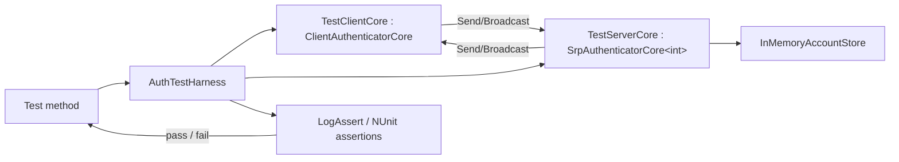

# FishMMO Unit Tests

The FishMMO test suite. **221 fixtures / ~2,100 test methods** live here, split across two
assemblies:

- **`FishMMO.UnitTests`** — 216 EditMode fixtures, all running without a NetworkManager, a
  physics simulation, or a live server.
- **`FishMMO.UnitTests.PlayMode`** — 5 fixtures that drive the simulation harness in
  `Assets/TestHarness/` under a real player loop and a real FishNet server.

| Area | Folder | Fixtures | What it covers |
| --- | --- | --- | --- |
| **Prediction & combat** | `Prediction/` | 95 | The unified prediction pipeline, delta serialization, lag compensation, the attribute ledger, buffs, cooldowns, abilities, observer sync/culling, bandwidth budgets |
| **Gameplay, UI, content** | root | 75 | Auth, UI Toolkit panels, items/trade/merchant, abilities, guild/group/arena, naming & races, world map, nameplates, prefab authoring |
| **NPC AI** | `AI/` | 27 | Combat decisions, personalities, kiting, threat, pets, NavMesh bake agreement, spawners, AI LOD |
| **Housing** | `Housing/` | 10 | Plot identity, ownership, access, placement, lifecycle, tax and vault fees |
| **PlayMode sims** | `PlayMode/` | 5 | The four simulation scenes plus an `Update`-dispatch cost probe |
| **Currency / Map** | `Currency/`, `Map/` | 4 | Spend/grant paths, the persisted ledger numbering, map projection and the explored readout |
| **Persistence, servers, travel** | `Persistence/`, `Server/`, `Teleport/`, `Waypoint/`, `NPC/` | 5 | The 2026-09-07 persistence audit invariants, scene-server placement, teleporter keys, waypoint unlock bits, the dashboard NPC designer |

The suite is a **regression ledger** as much as a test suite: a large share of the
`Prediction/` fixtures are named after the audit that found the defect
(`CombatAudit20260831Round3Tests`, `PredictionAuditRegressionTests`,
`AuditFollowUpFixTests`) and each test names the defect it pins.

### The authentication harness

Pairs `ClientAuthenticatorCore` and `SrpAuthenticatorCore<TConnection>` from the
`FishMMO-Auth` DLLs in-process and routes all `Send*` / `Broadcast*` calls
synchronously, completely bypassing FishNet and the network transport.

### The prediction harness

There is no equivalent single harness — the prediction fixtures instead lean on the
production code having been **shaped for testability**, which is a deliberate and
recurring pattern rather than an accident:

- **Pure functions extracted from behaviours.** `LagCompensationTick.ResolveViewOffset` /
  `ResolveAnchor`, `CharacterPredictionController.IsTransformRedundant`,
  `Buff.DurationToTicks`, `AbilityController.ResolveInterruptDisposition`,
  `TargetOrdering.*`. These exist so a rule can be exercised against production
  rather than re-implemented in a test — a re-implementation only ever proves the
  test agrees with itself.
- **`internal` + `InternalsVisibleTo`** (`Scripts/Shared/AssemblyInfo.cs`) for test seams that
  should not be public API. Two assemblies are named there: `FishMMO.UnitTests` and
  `FishMMO.TestHarness`.
- **`ScriptableObject.CreateInstance` + `AddToCache`/`RemoveFromCache`** to stand up
  templates without assets. Remember that a `CreateInstance` template leaves
  collection fields null where an authored asset would serialise them empty, and that a
  template's `ID` is 0 until it is cached.
- **`AddComponent` + an explicit `OnAwake()`**, since Unity's own callbacks do not run
  for a bare `AddComponent` in edit mode.
- **`Harness/StubCharacter`** — a minimal `ICharacter` for exercising one
  `CharacterBehaviour` without a networked character. Only the behaviour lookup, the flags
  and registration are implemented; everything else throws deliberately.
- **Reflection**, but only for genuinely private mechanism (`CharacterPositionHistory.Record`,
  `BuffController.ApplyObservedBuffs`).

### The UI Toolkit pattern

Panel fixtures (`MerchantPanelTests`, `TradePanelTests`, `AbilitiesPanelTests`,
`EquipmentPanelLayoutTests`, `ColorPickerTests`, `ScrollbarThemeTests`,
`Map/ExploredReadoutTests`, `NameGeneratorWindowTests`) mount the real panel on a real
`UIDocument`: clone `Assets/UI Toolkit/PanelSettings.asset`, set `visualTreeAsset` to the
panel's UXML, `AddComponent` the panel class, then call its `OnStarting()` directly — Unity's
own callbacks never fire in edit mode. There is no shared helper; each fixture builds its own
so the setup stays legible next to the assertions.

Two traps that have already been paid for: hiding a panel disables its `UIDocument` and
discards the tree, so a re-`Show()` must be followed by re-querying elements; and a
`suppress` flag wrapped around `.value =` is inert inside a dispatch — use
`SetValueWithoutNotify`.

**Prefer a behavioural assertion to a source-text one.** Several fixtures used to grep the
source for a literal spelling; those break on any refactor while proving less than the
consequence does. Where a property has no behavioural expression at all — "this number is
read live from `PredictionManager.StateInterpolation` rather than assumed" — a source
assertion is the right tool, and should say why it is one.

## Table of Contents

- [Description](#fishmmo-unit-tests)
- [Supported Platforms](#supported-platforms)
- [Architecture](#architecture)
- [Key Components](#key-components)
- [Configuration](#configuration)
- [Running](#running)
- [Layout](#layout)
- [PlayMode tests and the simulation harness](#playmode-tests-and-the-simulation-harness)
- [Test inventory](#test-inventory)
- [State machine driven by each login test](#state-machine-driven-by-each-login-test)
- [`InMemoryAccountStore` API](#inmemoryaccountstore-api)
- [Extending](#extending)
- [Known limitations](#known-limitations)
- [Flow Diagram](#flow-diagram)

## Supported Platforms

| Platform | Status | Notes |
| --- | --- | --- |
| Unity Editor on Windows / Linux / macOS | Supported | Run via Test Runner (EditMode) or `FishMMO / Unit Tests` menu. |
| Unity batch mode (headless) | Supported | `-runTests -testPlatform EditMode`; see [Running](#running). |
| Player builds | Not applicable | Both assemblies carry the `UNITY_INCLUDE_TESTS` define constraint. |

Requirements: Unity 6.3 LTS, the `FishMMO-Auth` DLLs present in `Assets/Dependencies/`, and the Unity Test Framework package.

`FishMMO.UnitTests.asmdef` is `"includePlatforms": ["Editor"]` with
`"defineConstraints": ["UNITY_INCLUDE_TESTS", "!UNITY_SERVER"]` — the `!UNITY_SERVER`
constraint is there because the assembly references `FishMMO.Client`, which is itself
`!UNITY_SERVER` constrained. It also sets `"overrideReferences": true`, so **a new test
that touches an assembly not already in the `references` list will compile under
`dotnet build` and then fail Unity compilation with CS0246** — add the reference to the
asmdef, not just to the generated csproj.

`PlayMode/FishMMO.UnitTests.PlayMode.asmdef` has `"includePlatforms": []` (all platforms);
an Editor-only asmdef would be classified EditMode and the PlayMode runner would silently
report `total=0`.

## Architecture

```
Assets/UnitTests/
├── FishMMO.UnitTests.asmdef                  # EditMode-only assembly definition
├── UnitTestMenu.cs                           # FishMMO / Unit Tests menu items + auth DLL provenance report
├── TestAssemblySetup.cs                      # [SetUpFixture] — initialises FishMMO.Logging.Log
├── Harness/
│   ├── AuthTestHarness.cs                    # Pairs ClientAuthenticatorCore + SrpAuthenticatorCore in-process
│   ├── TestClientCore.cs                     # ClientAuthenticatorCore subclass (payload capture + interceptors)
│   ├── TestServerCore.cs                     # SrpAuthenticatorCore<int> subclass (broadcast routing, AddressResolver)
│   ├── InMemoryAccountStore.cs               # IAccountStore double (no DB)
│   ├── StubCharacter.cs                      # Minimal ICharacter for single-behaviour tests
│   ├── AuthTestTrace.cs                      # Trace gateway (AuthTestTrace.Verbose)
│   └── LogAssert.cs                          # NUnit assertion wrappers that log pass/fail
├── AI/                          (27)         # NPC brains, threat, pets, NavMesh, spawners
├── Currency/                     (2)         # Spend/grant path + persisted ledger numbering
├── Housing/                     (10)         # Plot identity, access, placement, lifecycle, fees
├── Map/                          (2)         # Map projection, explored readout
├── NPC/                          (1)         # Dashboard NPC designer / NPCPrefabFactory
├── Persistence/                  (1)         # 2026-09-07 persistence audit invariants
├── Prediction/                  (95)         # Prediction, combat, observers, bandwidth
├── Server/                       (1)         # Scene-server placement policy
├── Teleport/                     (1)         # Teleporter key + live-vs-baked waypoints
├── Waypoint/                     (1)         # Waypoint unlock bit set, travel truth table
├── PlayMode/                     (5)         # Simulation-scene tests + Update dispatch cost
│   └── FishMMO.UnitTests.PlayMode.asmdef
├── *.cs                         (75)         # Auth, UI panels, items, abilities, social, content
└── README.md                                 # This document
```

EditMode tests do not touch PostgreSQL, FishNet, sockets, or any singleton state — each
test instantiates a fresh harness and account store. The asset-scanning fixtures
(`PrefabNetworkAuthoringTests`, `RegionAssetIntegrityTests`, `AI/NavMeshSceneBakeTests`,
`AI/AILodAssignmentTests`, `WorldMapDefinitionTests`) read on-disk YAML or the asset
database instead, so they see what is actually shipped rather than what a loaded asset
reports.

## Key Components

| Component | Purpose |
| --- | --- |
| `AuthTestHarness` | Constructs a paired client / server authenticator, wires `Send*` and `Broadcast*` to direct in-process calls, drives the test scenario. Exposes `Client`, `Server`, `Store`. |
| `InMemoryAccountStore` | Implements the same surface as the production account store, but keeps state in dictionaries — see [`InMemoryAccountStore` API](#inmemoryaccountstore-api). |
| `TestServerCore` | `SrpAuthenticatorCore<int>` subclass — FishNet's `NetworkConnection` is replaced by a plain `int` connection ID so the server authenticator can talk to a virtual client. `AddressResolver` fakes the source IP; `ConnectionEpoch` counts attempts. |
| `TestClientCore` | `ClientAuthenticatorCore` subclass — captures every encrypted payload, exposes `SetToken`, `AttemptLogin`, `AttemptTokenLogin`, `ReconnectAs`, and the `SrpProofInterceptor` / `SrpVerifyInterceptor` tamper hooks. |
| `StubCharacter` | Minimal `ICharacter` — behaviour lookup, flags, registration. Every other member throws so a test that wanders off says so. |
| `LagCompensationTick.ClaimOverride` | The one production accommodation for the simulation harness: an `internal static` hook, null in production, consulted before the owner/AI gates so a sim can carry synthetic 0–500 ms latency claims through the real rewind path. |

## Configuration

These tests are configuration-free: no environment variables, `appsettings`,
or external services are read. Verbose logging is toggled via the
`FishMMO / Unit Tests / Run All EditMode Tests (Verbose)` menu, which sets
the static `AuthTestTrace.Verbose` flag for the run.

---

## Running

1. Open the project in Unity.
2. `Window > General > Test Runner`.
3. Select the **EditMode** tab.
4. Run the `FishMMO.UnitTests` assembly.

Or use the Unity menu shortcuts:

| Menu item | Effect |
| --- | --- |
| `FishMMO / Unit Tests / Open Test Runner` | Opens the Test Runner window |
| `FishMMO / Unit Tests / Run All EditMode Tests` | Runs all tests (quiet) |
| `FishMMO / Unit Tests / Run All EditMode Tests (Verbose)` | Runs all tests with per-step trace logging |
| `FishMMO / Unit Tests / Print Auth Assembly Identities` | Prints each auth type's assembly name, version and on-disk location — proves the tests loaded the DLLs from `Assets/Dependencies/` rather than falling back to local sources |

A direct run through the menu goes through `TestRunnerApi` with a
`Filter { testMode = EditMode, assemblyNames = ["FishMMO.UnitTests"] }` and logs
`▶ / ✓ / ✗` lines plus a pass/fail summary to the Unity console.

### Headless

```
<editor> -batchmode -projectPath "$PWD" \
         -runTests -testPlatform EditMode \
         -testResults <abs>.xml -logFile <abs>.log
```

- Wrap in `xvfb-run -a -s "-screen 0 1600x1000x24"` on Linux — with no X display, anything
  reaching Unity's input backend crashes with SIGSEGV.
- `-testFilter` takes a semicolon-separated list of fully qualified fixture names:
  `-testFilter "FishMMO.UnitTests.LoginTests;FishMMO.UnitTests.SecurityTests"`.
- **There are no `[Category]` attributes anywhere in the suite**, so `-testCategory` selects
  nothing. Filter by assembly or by fixture name.
- **Trust the results XML, not the exit code.** Batch mode runs no script at all when any
  assembly fails to compile, and it intermittently aborts at startup with
  `SDL leaked 2 allocations` before running anything. Verify the XML exists.

---

## Layout

### Authentication fixtures (root)

| File | Tests | Purpose |
| --- | --- | --- |
| `LoginTests.cs` | 9 | Full client↔server SRP login flow, per-account lockout, stale-token fallback |
| `RegisterTests.cs` | 6 | Client-side registration validation + `CreateAccount` emission |
| `TokenLoginTests.cs` | 8 | Token-based authentication: lifecycle, edge cases, failure modes |
| `SecurityTests.cs` | 19 methods (~29 cases) | Adversarial SRP, handshake attacks, ZK, input validation |
| `AttackAndFailureScenariosTests.cs` | 8 | Brute-force, ban, 2FA, online-check, pending-kick, dropped-message attacks |
| `ServerAuthenticatorIntegrationTests.cs` | 2 | End-to-end SRP→token integration and token lifecycle |
| `RateLimiterTests.cs` | 3 | Per-source-IP handshake burst / sustained-flood throttling |
| `ConnectionTokenKeyRefreshTests.cs` | 7 | When a connection-token key refresh counts as a change (so a poll stops logging a Warning every time) |
| `TestAssemblySetup.cs` | — | `[SetUpFixture]` — initialises `FishMMO.Logging.Log` once for the assembly |

### Gameplay, UI and content fixtures (root)

The remaining root fixtures, by theme. Each one's `<summary>` states the invariant it pins.

| Theme | Representative fixtures |
| --- | --- |
| Items, trade, merchants | `ItemStackConservationTests`, `ItemStackSplitMergeTests`, `ItemAttributeRollTests`, `ItemGrantAccountingTests`, `ItemWriteSequenceTests`, `QuickTransferTests`, `TradeSessionTests`, `TradeExchangeTests`, `TradePanelTests`, `MerchantPurchaseResultTests`, `MerchantSingleQuantityTests`, `BankCapacityReadoutTests`, `ConsumableTemplateTests` |
| Equipment | `PredictedEquipmentTests`, `UnequipDestinationTests`, `UnequipSlotAgreementTests`, `EquipmentPanelLayoutTests` |
| Abilities | `AbilityAuthoringContractTests`, `AbilityCompositionTests`, `AbilityCraftResultTests`, `AbilitySelfHitTests`, `StartingAbilityTests`, `KnownAbilityPersistenceTests`, `HostileNpcAbilityTests`, `AbilitiesPanelTests` |
| NPCs & death | `NpcTargetControllerTests`, `NpcCombatEdgeCaseTests`, `DeathResetTests` |
| Social systems | `GuildCreationFeeTests`, `GuildRankEditTests`, `GuildRankInsertTests`, `GroupFinderRulesTests`, `ArenaRulesTests` |
| Naming & content data | `NameGenerationTemplateTests`, `NameGeneratorWindowTests`, `TitleGenerationTests`, `RaceCatalogTests`, `BiomeSystemTests`, `SceneObjectNamerTests` |
| World & scenes | `WorldMapDefinitionTests`, `WorldSceneDetailsCacheBuilderTests`, `WorldLabelProjectionOrderTests`, `CharacterGroundingLayerTests` |
| Nameplates | `NameplateModelTests`, `NameplateOptionsTests`, `NameplateVisibilityTests` |
| Options & UI chrome | `CrosshairSettingsTests`, `CameraSettingsTests`, `AudioChannelRoutingTests`, `AnisotropicFilteringTests`, `AntialiasingSettingTests`, `KeyBindingDisplayNameTests`, `OptionsRowLayoutTests`, `CloseButtonConsistencyTests`, `TextInputHeightTests`, `ScrollbarThemeTests`, `ColorPickerTests`, `ChatScrollBehaviourTests`, `InteractPanelInventoryTests`, `PinnedTargetRulesTests` |
| Chat & models | `ChatSanitizerTests`, `BodyRegionDiscoveryTests` |
| Prefab authoring | `PrefabNetworkObjectBindingTests`, `NetworkBehaviourOwnerRebindTests` |
| Observer shaping | `ObserverPayloadShapingTests`, `CastVisibilityTests` |

### Prediction & combat fixtures (`Prediction/`, 95 files)

Too many to list individually; these are the ones that pin a **whole invariant** rather than a
single method, and are the right place to start reading:

| File | Pins |
| --- | --- |
| `PredictionSystemMapTests.cs` | An enforced map of what is predicted, what is interpolated, and what rides a broadcast |
| `PredictionAuditRegressionTests.cs` | The 2026-08-28 audit's 35 defects across three rounds |
| `CombatAuditRoundTwoTests.cs`, `CombatAuditFollowUpTests.cs`, `CombatAudit20260830Tests.cs`, `CombatAudit20260830FixTests.cs` | The 2026-08-29 and 2026-08-30 combat audits and the fixes applied after them |
| `CombatAudit20260831Tests.cs`, `CombatAudit20260831Round3Tests.cs`, `CombatAudit20260831RecommendedFixTests.cs` | The 2026-08-31 audit, its round 3, and the ten recommendations the follow-up session implemented |
| `AuditFollowUpFixTests.cs`, `RiskRemediationTests.cs`, `RegressionHistoryTests.cs` | Remaining audit follow-ups and the historical broadcast-path divergence |
| `LagCompensationClosedLoopTests.cs` | **"You hit what you saw"** — composes the client and server halves of the rewind derivation across a spread of round trips and asserts sub-millimetre agreement |
| `LagCompensationTests.cs` | The position ring's resolution, clamping and refusal rules |
| `AttributeLedgerContractTests.cs`, `AttributeStackLedgerTests.cs` | The attributed-modifier ledger: residual arithmetic, contributor release, exact stack inverses |
| `ReconcileDeltaChainTests.cs`, `DeltaSerializerStreamAlignmentTests.cs`, `ReplicateDeltaPacketTests.cs` | The delta chain's loss detection and framing |
| `DeltaSerializerRegistrationTests.cs` | Fails the build when a prediction type has no delta serializer — the condition FishNet used to report at runtime |
| `ObserverSynchronizationProofTests.cs`, `AbilityObserverReproductionTests.cs`, `LateJoinerReplayTests.cs` | That a late joiner reconstructs what a continuous observer holds |
| `ObserverStreamingPolicyTests.cs`, `ObserverCullingAuditTests.cs`, `ObserverInterestBoundaryTests.cs`, `ObserverSendShapingTests.cs` | Per-observer relevance, LOD intervals, density-scaled range, and the 2026-09-08 culling audit's outcome |
| `ObservedBuffBaselineTests.cs`, `ObservedBuffDeltaTests.cs`, `ObservedBuffSimulationTests.cs` | The observed-buff contract: what the server may re-baseline, and that an observed peer counts its own durations down without applying effects |
| `TargetSelectorBodyIdentityTests.cs`, `SpatialQueryGrowLoopTests.cs`, `OverlapHitRootResolutionTests.cs`, `EcaDeterminismTests.cs` | Hit-root resolution, per-body dedupe, grow-on-full, broadphase-order independence |
| `PredictedSelectionTests.cs`, `PredictedCombatEventTests.cs`, `PredictedAbilityStateHistoryTests.cs` | Selection is not authority; the predict/confirm/reject cycle for numbers the caster draws itself |
| `PredictionQuantizationTests.cs`, `RotationPrecisionTests.cs`, `AimDirectionTests.cs`, `NetworkTransformPrecisionTests.cs` | That `Encode`/`Decode` round trips are fixed points, and the 24-bit position packing |
| `PlatformCatchUpTests.cs`, `PlatformRiderSmoothingTests.cs`, `KCCPlatformDeltaChainTests.cs` | The moving-platform contract after issue #228: deterministic step, carried riders, matched tick smoothing |
| `NetworkTransformDistanceLodTests.cs`, `NetworkTransformLodBufferTests.cs` | Band selection with hysteresis, and that the interpolation buffer bridges the send interval |
| `PredictionBandwidthBenchmarkTests.cs`, `ObserverChannelCostTests.cs`, `BandwidthCompositionTests.cs`, `PayloadFieldCostTests.cs`, `PredictionModeBandwidthMapTests.cs`, `ScaleProjectionTests.cs`, `PredictionCostBenchmarkTests.cs` | Per-peer byte budgets, per-field costs and CPU/allocation cost, so a new field's cost is visible when it lands |
| `PrefabNetworkAuthoringTests.cs`, `RegionAssetIntegrityTests.cs`, `InterestManagementWiringTests.cs`, `CharacterHealthAuthoringTests.cs` | That the shipped prefabs, scenes and assets still match what the code expects |
| `ResourceRegenerationTests.cs`, `RegenReplicateTickSeedTests.cs` | The regen cadence and consumption lockout, and the empty-queue tick seed that killed regen on every relog |
| `InteractionRegressionTests.cs` | The NPC interaction chain end to end, after a live "can't interact with NPCs" report whose cause was invisible in every log |

Several fixtures are **measurement** rather than assertion: 38 files `TestContext.WriteLine` a
`MEASURE …` line so a bandwidth or cost regression is legible in the run log even when it stays
inside its budget.

### Harness files (`Harness/`)

| File | Purpose |
| --- | --- |
| `AuthTestHarness.cs` | `IDisposable` wrapper that owns the paired `Client`, `Server`, and `Store` |
| `TestServerCore.cs` | `SrpAuthenticatorCore<int>` subclass — routes broadcasts to the client; adds ban-check via `TryLoginAsync`; `AddressResolver` fakes the source IP; `BeginNewConnection` tells the core the previous connection ended |
| `TestClientCore.cs` | `ClientAuthenticatorCore` subclass — captures payloads; exposes `SetToken`, `AttemptLogin`, `AttemptTokenLogin`, `ResetForNextAttempt`, `ReconnectAs`, `SrpProofInterceptor`, `SrpVerifyInterceptor` |
| `InMemoryAccountStore.cs` | Concurrent in-memory account DB + token store |
| `StubCharacter.cs` | Minimal `ICharacter` for single-behaviour tests |
| `AuthTestTrace.cs` | Trace gateway used by all tests; controlled by `AuthTestTrace.Verbose` |
| `LogAssert.cs` | NUnit assertion wrappers that log pass/fail via `AuthTestTrace` |

---

## PlayMode tests and the simulation harness

`PlayMode/` mirrors the four self-running simulation scenes in `Assets/Scenes/Test/`, which
are generated from `Assets/TestHarness/` by `FishMMO / Test Scenes / Generate All`
(headless: `-executeMethod FishMMO.TestHarness.Editor.TestSceneGenerator.GenerateAll`). Each
PlayMode fixture asserts exactly what the scene's PASS banner shows, so a green run here and a
green banner in the editor are the same fact.

| Fixture | Scene | What it drives |
| --- | --- | --- |
| `PlatformSimPlayModeTests` | `PlatformSim.unity` | Twin-world prediction/rollback with real motors and `KCCPlatform.Step`: identity at RTT 0, zero edge-replay divergences at every RTT, ≥1 ferry crossing per leg, `CarrySlips` 0 |
| `CombatSimPlayModeTests` | `CombatSim.unity` | Zero-client real server: NPC fighters cast the whole mock roster through the production pipeline, and a 500 ms synthetic claim per caster drives the real lag-compensation resolver via `LagCompensationTick.ClaimOverride` |
| `InteractableSimPlayModeTests` | `InteractableSim.unity` | The server interact chain step-for-step (`CanAct` → registry + liveness → `InteractableResolver` → `CanInteract` → rate limit → `ExecuteOnInteract`) against known-answer probes |
| `RegionSimPlayModeTests` | `RegionSim.unity` | Real `Region` components with real `NetworkTrigger` colliders: enter/exit pairing, nested ownership handoff, ledger symmetry |
| `UpdateDispatchCostTests` | — | Prices Unity's per-`MonoBehaviour` `Update` dispatch, so the choice between an interval gate and a central scheduler is settled with numbers |

The `InteractableSim` half lives in its own `FishMMO.TestHarness.Server` asmdef, because
referencing `FishMMO.Server` from the main harness asmdef would break client-platform
compilation. `FishMMO.UnitTests.PlayMode` references both harness assemblies and nothing else.

**Cleanup in `[UnityTearDown]`, never `try`/`finally`.** An unhandled error log fails a
`[UnityTest]` by *abandoning* its iterator at the next yield, so `finally` never runs; the
leaked harness then logs into every later test and its `NetworkManager` makes FishNet destroy
the next sim's manager as a duplicate.

---

## Test inventory

### `LoginTests.cs`

| Test | Expected result |
| --- | --- |
| `Login_CorrectCredentials_ReturnsSuccess` | `LoginSuccess` |
| `Login_WrongPassword_ReturnsInvalidUsernameOrPassword` | `InvalidUsernameOrPassword` |
| `Login_UnknownUser_ReturnsInvalidUsernameOrPasswordWithoutEnumeration` | `InvalidUsernameOrPassword` (same as wrong pw — anti-enumeration) |
| `Login_UnverifiedAccount_ReturnsAccountUnverifiedAfterCorrectProof` | `AccountUnverified` |
| `Login_SequentialSessionsSameServer_StateProperlyReset` | Both sessions `LoginSuccess`, with distinct per-session server pubkey / cookie |
| `Login_SameCredentials_CaseSensitivePassword_Rejected` | `InvalidUsernameOrPassword` (SRP does not normalize case) |
| `Login_DistributedPasswordGuessing_LocksTheAccountOut` | Wrong passwords from distinct source IPs lock the account; the *correct* password is then refused too |
| `Login_CorrectPasswordBeforeThreshold_ClearsTheFailureCount` | A success below the threshold resets the counter |
| `Login_WithStaleTokenHeld_AuthenticatesWithCredentials` | A held stale token does not block credential login |

The lockout tests bypass the per-IP debounce with
`h.Server.AddressResolver = _ => $"203.0.113.{(h.Server.ConnectionEpoch % 251) + 1}"` — keyed
on the *attempt*, not the call, because `GetConnectionAddress` is consulted twice per
handshake (bind the cookie, then verify the echo) and a per-call counter breaks cookie
verification.

### `RegisterTests.cs`

| Test | Expected result |
| --- | --- |
| `Register_HappyPath_SendsEncryptedCreateAccountBroadcast` | Encrypted `CreateAccount` payload emitted |
| `Register_EmptyEmail_DisconnectsBeforeCreateAccount` | No `CreateAccount` emitted |
| `Register_InvalidUsername_RejectedByClient` | `SetLoginCredentials` returns `false` |
| `Register_InvalidPassword_RejectedByClient` | `SetLoginCredentials` returns `false` |
| `Register_DifferentCredentials_ProduceDifferentEncryptedPayloads` | Ciphertexts are pairwise distinct |
| `Register_SameCredentialsTwoAttempts_ProduceDifferentSalts` | Each attempt derives a fresh salt |

### `TokenLoginTests.cs`

| Test | Expected result |
| --- | --- |
| `TokenLogin_ValidToken_ReturnsSuccess` | `LoginSuccess` |
| `TokenLogin_ExpiredToken_ReturnsTokenExpired` | `TokenExpired` |
| `TokenLogin_RevokedToken_ReturnsTokenRevoked` | `TokenRevoked` |
| `TokenLogin_InvalidToken_ReturnsInvalidToken` | `TokenInvalid` |
| `TokenLogin_ServerBusy_ReturnsServerBusy` | `ServerBusy` (DB error simulated before login) |
| `TokenLogin_EmptyToken_SetTokenReturnsFalse` | `SetToken("")` returns `false`; no connection started |
| `TokenLogin_RenewedToken_IsValid` | Renewed token → `LoginSuccess` |
| `TokenLogin_RevokingOneToken_DoesNotAffectOtherValidTokens` | Revoking token A leaves token B valid |

### `SecurityTests.cs`

#### Zero-knowledge / anti-enumeration

| Test | What is verified |
| --- | --- |
| `Security_AntiEnumeration_UnknownAndWrongPassword_AreIndistinguishable` | Unknown-user and wrong-password produce identical responses |
| `Security_Password_NeverAppearsInAnyWirePayload` | Cleartext password absent from all captured encrypted payloads |
| `Security_Username_NeverAppearsInAnyEncryptedPayload` | Cleartext username absent from all captured encrypted payloads |

#### Non-determinism & replay protection

| Test | What is verified |
| --- | --- |
| `Security_SameCredentialsTwoSessions_ProduceDifferentSrpVerifyCiphertexts` | Fresh per-session ephemerals; IV/nonce reuse impossible |
| `Security_TamperedSrpProof_IsRejectedAndDisconnects` | Bit-flipped M1 ciphertext → rejected + disconnect |
| `Security_ReplayedSrpProofAcrossSessions_IsRejected` | M1 from session 1 replayed in session 2 → rejected |
| `Security_SuccessfulSessions_ProduceUniquePerSessionMaterial` | N sessions: server pubkeys, cookies, and ciphertexts all pairwise distinct |

#### Protocol & lifecycle

| Test | What is verified |
| --- | --- |
| `Security_UnsupportedProtocolVersion_HandshakeIsRefused` | Future-only version range → handshake refused without SRP traffic |
| `Security_DisposedClient_ClearsSessionSecrets` | `Dispose` zeroes GCM nonce contexts and ephemeral keypair |
| `Security_AuthTypes_ResolveToPrecompiledDependencyDlls` | Auth types resolve to DLLs under `Assets/Dependencies/`, not in-project sources |

#### Handshake-layer attacks

| Test | What is verified |
| --- | --- |
| `Security_MalformedHandshakePublicKey_IsRejected` ×4 | Lengths 0, 31, 33, 64 → disconnected; no cookie issued |
| `Security_ZeroFilledX25519PublicKey_IsRejected` | An all-zero X25519 public key (small-subgroup / zero-shared-secret attempt) → rejected |
| `Security_ForgedCookieOnPhase2Handshake_IsRejected` | Random/never-issued cookie → disconnected; no server-handshake sent |
| `Security_HandshakeCookie_IsBoundToPublicKey` | Cookie bound to key A → rejected with key B |

#### Message-ordering attacks

| Test | What is verified |
| --- | --- |
| `Security_SrpProofBeforeVerify_IsIgnored` | Proof arrives before SrpVerify → ignored/rejected |
| `Security_SrpVerifyBeforeHandshake_IsRejected` | SrpVerify before ECDH complete → rejected |

#### Payload validation

| Test | What is verified |
| --- | --- |
| `Security_OversizedSrpVerifyPayload_IsRejected` | Oversized SrpVerify → rejected before SRP math |
| `Security_TamperedSrpVerifyCiphertext_IsRejected` | Bit-flipped SrpVerify ciphertext → rejected |
| `Security_TamperedServerProof_M2_ClientDoesNotAccept` | Tampered server M2 (via `TestServerCore.SrpSuccessInterceptor`) → the client refuses to accept the session |

#### Input validation

| Test | Cases |
| --- | --- |
| `Security_InvalidCredentials_RejectedAtClientValidator` | `null`/`""`/too-short username or password — 6 `[TestCase]` entries |
| `Security_OversizedUsername_RejectedAtValidator` | 1 MiB username → client rejects before any SRP math |

### `AttackAndFailureScenariosTests.cs`

| Test | Expected result |
| --- | --- |
| `Register_DuplicateUsernameOrEmail_Rejected` | `SetLoginCredentials` returns `false` for duplicate |
| `Register_InvalidEmailOrUnderage_Rejected` | `SetLoginCredentials` returns `false` for bad email; age < min |
| `Login_BannedOrLockedAccount_Rejected` | `Banned` |
| `BruteForce_RepeatedWrongPasswords_AllReturnInvalidCredentials` | 3 independent attempts, all `InvalidUsernameOrPassword` |
| `SrpProof_Dropped_NoSuccessDelivered` | Login times out; `ReceivedSuccess` remains `false` |
| `Login_AlreadyOnline_ReturnsAlreadyOnline` | `AlreadyOnline` |
| `TwoFactor_AccountRequires2FA_ReturnsTwoFactorRequired` | `TwoFactorRequired` after correct SRP proof on TOTP-enabled account |
| `Login_PendingKick_AccountRejected` | Account flagged for kick is rejected |

### `ServerAuthenticatorIntegrationTests.cs`

| Test | What is verified |
| --- | --- |
| `FullLoginFlow_SRPAndTokenAuthenticators_Success` | SRP login then token login on the same account both return `LoginSuccess` |
| `TokenIssuanceRenewalRevocation_ErrorHandling` | Issue → renew → revoke returns `TokenRevoked`; simulated DB error returns `ServerBusy` |

### `RateLimiterTests.cs`

| Test | What is verified |
| --- | --- |
| `Handshake_BurstOfSimultaneousLoginsFromOneIp_AllComplete` | A legitimate burst from one IP is not throttled away |
| `Handshake_SustainedFloodFromOneIp_IsThrottledBeyondBurst` | Sustained flood past the burst allowance is refused |
| `Handshake_DistinctSourceIps_AreNotGroupedUnderOneKey` | Distinct IPs get distinct buckets |

---

## State machine driven by each login test

1. `Client.OnConnected()` → X25519 keypair generated + `SendClientHandshake` (phase 1)
2. Server cookie challenge → client echoes cookie + public key (phase 2)
3. Server ECDH agreement → `BroadcastServerHandshake` with server public key + agreed version
4. Client derives directional AES-GCM keys → `SendSrpVerify` (encrypted username + client ephemeral)
5. Server async worker → `BroadcastSrpVerifyResponse` (encrypted salt + server ephemeral)
6. Client computes SRP-6a M1 → `SendSrpProof` (encrypted M1)
7. Server async worker → `BroadcastSrpSuccess` (encrypted M2 + token) or `BroadcastAuthResult` on failure
8. Client decrypts M2, stores token → `OnAuthResultCallback` → `TaskCompletionSource` resolved

For token auth the ECDH handshake (steps 1–3) completes normally; step 4 diverges to `SendTokenAuth` instead of `SendSrpVerify`. In the test harness this path is bypassed: `TestClientCore.SendTokenAuth` validates the pending token directly against `InMemoryAccountStore.ValidateToken` without real crypto decryption.

---

## `InMemoryAccountStore` API

```csharp
// Account setup
void SeedAccount(string username, string password,
    bool isVerified = true, bool totpEnabled = false,
    string? totpSecret = null, string? email = null, bool isBanned = false)
void SetVerified(string username, bool value)
void SetOnline(string username, bool value)
void SetPendingKick(string username, bool value)

// Token lifecycle
string  IssueValidToken(string username)     // → valid token ID
string  IssueExpiredToken(string username)   // → expired token ID
string  IssueRevokedToken(string username)   // → revoked token ID
string? RenewToken(string token)             // → new valid token ID (original unchanged)
void    RevokeToken(string token)
void    SimulateDbError()                    // one-shot: next ValidateToken returns ServerBusy
ClientAuthenticationResult ValidateToken(string token)

// Inspection
bool    ContainsAccount(string username)
bool    IsOnline(string username)
bool    HasPendingKick(string username)
string? GetTotpSecret(string username)
string? GetLastTokenHash(string username)
void    PersistTokenHash(string username, string hash, int expirationMinutes)
```

---

## Extending

Minimal test skeleton:

```csharp
[Test]
public async Task MyFeature_SomeCondition_ExpectedOutcome()
{
    using AuthTestHarness h = new AuthTestHarness();
    h.Store.SeedAccount("user", "pass");
    ClientAuthenticationResult result = await h.Client.AttemptLogin("user", "pass");
    LogAssert.AreEqual(ClientAuthenticationResult.LoginSuccess, result);
}
```

For token auth:

```csharp
string token = h.Store.IssueValidToken("user");
ClientAuthenticationResult result = await h.Client.AttemptTokenLogin(token);
```

To intercept / tamper with SRP proof before it reaches the server:

```csharp
h.Client.SrpProofInterceptor = original =>
{
    byte[] tampered = (byte[])original.Clone();
    tampered[tampered.Length / 2] ^= 0xFF;
    return tampered;   // return null to drop the message entirely
};
```

For a non-auth behaviour that only needs an `ICharacter`:

```csharp
StubCharacter character = new StubCharacter { Behaviour = someController };
```

When adding a fixture, add its `.cs` to the asmdef's assembly (automatic — it is folder
scoped) but check that every assembly it references is in
`FishMMO.UnitTests.asmdef`'s `references` list; `overrideReferences` is `true`, so an
unreferenced assembly is a Unity-only CS0246 that `dotnet build` will not catch.

---

## Known limitations

- **Account creation is not exercised server-side.** `SrpAuthenticatorCore` does not handle `CreateAccount` broadcasts — that logic lives in the Unity-side `AccountCreationSystem`. `RegisterTests` therefore stops after asserting the client emitted a well-formed encrypted `CreateAccount` payload.
- **Token auth bypasses real decryption.** `TestClientCore.SendTokenAuth` validates the pending token string directly against `InMemoryAccountStore.ValidateToken` rather than decrypting it with the session key. This exercises token-state logic without needing a full `TokenAuthenticatorCore` worker setup.
- **A harness has no transport, so a connection never "ends" by itself.** `AttemptLogin` / `AttemptTokenLogin` call `ResetForNextAttempt`, which calls `TestServerCore.BeginNewConnection` to tell the core the previous connection is gone — without it, a refused attempt leaves `disconnected` latched (so the next refusal is answered with silence) and a successful one leaves the core holding authenticated state (so the next handshake is ignored as a replay). Use `ReconnectAs(newConnectionId)` when a test needs the server to see a genuinely different connection while keeping the capture lists for cross-session comparison.
- **PlayMode tests need a display.** Under `-batchmode -nographics` with no X server, the Linux input backend segfaults; run them under `xvfb-run`.
- **A `CreateInstance` template is not an authored asset.** Collection fields are null where a serialised asset would have an empty list, and `ID` is 0 until `AddToCache` runs.


## Flow Diagram


