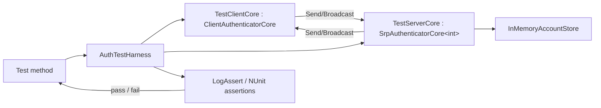

# FishMMO Unit Tests

EditMode unit tests for FishMMO. The assembly now covers three broad areas, all of
them running without a NetworkManager, a physics simulation, or a live server —
roughly **1,080 cases in about 25 seconds**:

| Area | Folder | What it covers |
| --- | --- | --- |
| **Authentication** | root (`LoginTests.cs`, `SecurityTests.cs`, …) | SRP-6a + X25519 ECDH handshake, TOTP, account locking, kick requests, rate limiting |
| **Prediction & combat** | `Prediction/` (76 files) | The unified prediction pipeline, delta serialization, lag compensation, the attribute ledger, buffs, cooldowns, abilities, observer sync, bandwidth budgets |
| **Gameplay systems** | `AI/`, `Currency/`, `Map/`, `Server/`, root | AI states and target selection, currency, world map projection, item stack conservation, chat sanitisation, character grounding |

`PlayMode/` holds the small number of tests that genuinely need a running player loop.

### The authentication harness

Pairs `ClientAuthenticatorCore` and `SrpAuthenticatorCore<TConnection>` from the
`FishMMO-Auth` DLLs in-process and routes all `Send*` / `Broadcast*` calls
synchronously, completely bypassing FishNet and the network transport.

### The prediction harness

There is no equivalent single harness — the prediction fixtures instead lean on the
production code having been **shaped for testability**, which is a deliberate and
recurring pattern rather than an accident:

- **Pure functions extracted from behaviours.** `LagCompensationTick.ResolveViewOffset` /
  `ResolveAnchor`, `CharacterPredictionController.IsTransformRedundant`,
  `Buff.DurationToTicks`, `AbilityController.ResolveInterruptDisposition`,
  `TargetOrdering.*`. These exist so a rule can be exercised against production
  rather than re-implemented in a test — a re-implementation only ever proves the
  test agrees with itself.
- **`internal` + `InternalsVisibleTo("FishMMO.UnitTests")`** (`Shared/AssemblyInfo.cs`)
  for test seams that should not be public API.
- **`ScriptableObject.CreateInstance` + `AddToCache`/`RemoveFromCache`** to stand up
  templates without assets. Remember that a `CreateInstance` template leaves
  collection fields null where an authored asset would serialise them empty.
- **`AddComponent` + an explicit `OnAwake()`**, since Unity's own callbacks do not run
  for a bare `AddComponent` in edit mode.
- **Reflection**, but only for genuinely private mechanism (`CharacterPositionHistory.Record`,
  `BuffController.ApplyObservedBuffs`).

**Prefer a behavioural assertion to a source-text one.** Several fixtures used to grep the
source for a literal spelling; those break on any refactor while proving less than the
consequence does. Where a property has no behavioural expression at all — "this number is
read live from `PredictionManager.StateInterpolation` rather than assumed" — a source
assertion is the right tool, and should say why it is one.

## Table of Contents

- [Description](#fishmmo-auth-unit-tests)
- [Supported Platforms](#supported-platforms)
- [Architecture](#architecture)
- [Key Components](#key-components)
- [Configuration](#configuration)
- [Running](#running)
- [Layout](#layout)
- [Test inventory](#test-inventory)
- [State machine driven by each login test](#state-machine-driven-by-each-login-test)
- [`InMemoryAccountStore` API](#inmemoryaccountstore-api)
- [Extending](#extending)
- [Known limitations](#known-limitations)
- [Flow Diagram](#flow-diagram)

## Supported Platforms

| Platform | Status | Notes |
| --- | --- | --- |
| Unity Editor on Windows / Linux / macOS | Supported | Run via Test Runner (EditMode) or `FishMMO / Unit Tests` menu. |
| CI (Unity batch mode) | Supported | `-runTests -testPlatform EditMode -testCategory FishMMO.UnitTests`. |
| Player builds | Not applicable | EditMode tests are excluded from player builds. |

Requirements: Unity 6.3 LTS, the `FishMMO-Auth` DLLs present in `Assets/Dependencies/`, and the Unity Test Framework package.

## Architecture

```
Assets/UnitTests/
├── FishMMO.UnitTests.asmdef                  # EditMode-only assembly definition
├── UnitTestMenu.cs                           # FishMMO / Unit Tests menu items
├── TestAssemblySetup.cs                      # [SetUpFixture] — initialises FishMMO.Logging.Log
├── Harness/
│   ├── AuthTestHarness.cs                    # Pairs ClientAuthenticatorCore + SrpAuthenticatorCore in-process
│   ├── TestClientCore.cs                     # ClientAuthenticatorCore subclass (payload capture + interceptors)
│   ├── TestServerCore.cs                     # SrpAuthenticatorCore<int> subclass (routes broadcasts to the client)
│   ├── InMemoryAccountStore.cs               # IAccountStore double (no DB)
│   ├── AuthTestTrace.cs                      # Trace gateway (AuthTestTrace.Verbose)
│   └── LogAssert.cs                          # NUnit assertion wrappers that log pass/fail
├── LoginTests.cs                             # Happy / unhappy login paths
├── RegisterTests.cs                          # Client-side registration validation
├── TokenLoginTests.cs                        # Token-based authentication
├── SecurityTests.cs                          # Adversarial SRP / handshake / input validation
├── AttackAndFailureScenariosTests.cs         # Brute-force, ban, 2FA, online-check
├── ServerAuthenticatorIntegrationTests.cs    # End-to-end SRP → token integration
├── RateLimiterTests.cs                       # Per-IP handshake rate limiting
├── Prediction/                               # Prediction / reconcile serializer tests (non-auth)
└── README.md                                 # This document
```

Tests do not touch PostgreSQL, FishNet, sockets, or any singleton state — each
test instantiates a fresh harness and account store.

## Key Components

| Component | Purpose |
| --- | --- |
| `AuthTestHarness` | Constructs a paired client / server authenticator, wires `Send*` and `Broadcast*` to direct in-process calls, drives the test scenario. |
| `InMemoryAccountStore` | Implements the same surface as the production account store, but keeps state in dictionaries — see [`InMemoryAccountStore` API](#inmemoryaccountstore-api). |
| `TestServerCore` | `SrpAuthenticatorCore<int>` subclass — FishNet's `NetworkConnection` is replaced by a plain `int` connection ID so the server authenticator can talk to a virtual client. |
| Test classes | Cover login, TOTP, handshake, and kick scenarios — see [Test inventory](#test-inventory). |

## Configuration

These tests are configuration-free: no environment variables, `appsettings`,
or external services are read. Verbose logging is toggled via the
`FishMMO / Unit Tests / Run All EditMode Tests (Verbose)` menu, which sets
the static `AuthTestTrace.Verbose` flag for the run.

---

## Running

1. Open the project in Unity.
2. `Window > General > Test Runner`.
3. Select the **EditMode** tab.
4. Run the `FishMMO.UnitTests` assembly.

Or use the Unity menu shortcuts:

| Menu item | Effect |
| --- | --- |
| `FishMMO / Unit Tests / Open Test Runner` | Opens the Test Runner window |
| `FishMMO / Unit Tests / Run All EditMode Tests` | Runs all tests (quiet) |
| `FishMMO / Unit Tests / Run All EditMode Tests (Verbose)` | Runs all tests with per-step trace logging |

---

## Layout

### Test files

| File | Tests | Purpose |
| --- | --- | --- |
| `LoginTests.cs` | 6 | Full client↔server SRP login flow |
| `RegisterTests.cs` | 6 | Client-side registration validation + `CreateAccount` emission |
| `TokenLoginTests.cs` | 8 | Token-based authentication: lifecycle, edge cases, failure modes |
| `SecurityTests.cs` | 19 methods (25+ cases) | Adversarial SRP, handshake attacks, ZK, input validation |
| `AttackAndFailureScenariosTests.cs` | 8 | Brute-force, ban, 2FA, online-check, pending-kick, dropped-message attacks |
| `ServerAuthenticatorIntegrationTests.cs` | 2 | End-to-end SRP→token integration and token lifecycle |
| `RateLimiterTests.cs` | 3 | Per-source-IP handshake burst / sustained-flood throttling |
| `TestAssemblySetup.cs` | — | `[SetUpFixture]` — initialises `FishMMO.Logging.Log` once for the assembly |

### Prediction & combat fixtures (`Prediction/`)

Too many to list individually; these are the ones that pin a **whole invariant** rather than a
single method, and are the right place to start reading:

| File | Pins |
| --- | --- |
| `PredictionAuditRegressionTests.cs` | The 2026-08-28 audit's 35 defects across three rounds |
| `CombatAuditRoundTwoTests.cs`, `CombatAuditFollowUpTests.cs`, `CombatAudit20260830Tests.cs` | The 2026-08-29 and 2026-08-30 combat audits |
| `CombatAudit20260830FixTests.cs` | The post-audit fixes: shared ability-object resolution, the observer equip path, exclusion-inside-the-cap, total ray ordering, per-character chain-break reporting, shared buffer growth, reproducible heal targeting |
| `LagCompensationClosedLoopTests.cs` | **"You hit what you saw"** — composes the client and server halves of the rewind derivation across a spread of round trips and asserts sub-millimetre agreement |
| `LagCompensationTests.cs` | The position ring's resolution, clamping and refusal rules |
| `AttributeLedgerContractTests.cs`, `AttributeStackLedgerTests.cs` | The attributed-modifier ledger: residual arithmetic, contributor release, exact stack inverses |
| `ReconcileDeltaChainTests.cs`, `DeltaSerializerStreamAlignmentTests.cs` | The delta chain's loss detection and framing |
| `ObserverSynchronizationProofTests.cs`, `AbilityObserverReproductionTests.cs`, `LateJoinerReplayTests.cs` | That a late joiner reconstructs what a continuous observer holds |
| `TargetSelectorBodyIdentityTests.cs`, `SpatialQueryGrowLoopTests.cs`, `OverlapHitRootResolutionTests.cs` | Hit-root resolution, per-body dedupe, grow-on-full |
| `PredictionQuantizationTests.cs`, `RotationPrecisionTests.cs`, `AimDirectionTests.cs` | That `Encode`/`Decode` round trips are fixed points |
| `PredictionBandwidthBenchmarkTests.cs`, `ObserverChannelCostTests.cs`, `BandwidthCompositionTests.cs` | Per-peer byte budgets, so a new field's cost is visible when it lands |
| `PrefabNetworkAuthoringTests.cs`, `RegionAssetIntegrityTests.cs` | That the shipped prefabs and assets still match what the code expects |

Several fixtures are **measurement** rather than assertion: they `TestContext.WriteLine` a
`MEASURE …` line so a bandwidth or cost regression is legible in the run log even when it stays
inside its budget.

### Harness files (`Harness/`)

| File | Purpose |
| --- | --- |
| `AuthTestHarness.cs` | `IDisposable` wrapper that owns the paired `Client`, `Server`, and `Store` |
| `TestServerCore.cs` | `SrpAuthenticatorCore<int>` subclass — routes broadcasts to the client; adds ban-check via `TryLoginAsync` |
| `TestClientCore.cs` | `ClientAuthenticatorCore` subclass — captures payloads; exposes `SetToken`, `AttemptLogin`, `AttemptTokenLogin`, `SrpProofInterceptor`, `SrpVerifyInterceptor` |
| `InMemoryAccountStore.cs` | Concurrent in-memory account DB + token store |
| `AuthTestTrace.cs` | Trace gateway used by all tests; controlled by `AuthTestTrace.Verbose` |
| `LogAssert.cs` | NUnit assertion wrappers that log pass/fail via `AuthTestTrace` |

---

## Test inventory

### `LoginTests.cs`

| Test | Expected result |
| --- | --- |
| `Login_CorrectCredentials_ReturnsSuccess` | `LoginSuccess` |
| `Login_WrongPassword_ReturnsInvalidUsernameOrPassword` | `InvalidUsernameOrPassword` |
| `Login_UnknownUser_ReturnsInvalidUsernameOrPasswordWithoutEnumeration` | `InvalidUsernameOrPassword` (same as wrong pw — anti-enumeration) |
| `Login_UnverifiedAccount_ReturnsAccountUnverifiedAfterCorrectProof` | `AccountUnverified` |
| `Login_SequentialSessionsSameServer_StateProperlyReset` | Both sessions `LoginSuccess`, with distinct per-session server pubkey / cookie |
| `Login_SameCredentials_CaseSensitivePassword_Rejected` | `InvalidUsernameOrPassword` (SRP does not normalize case) |

### `RegisterTests.cs`

| Test | Expected result |
| --- | --- |
| `Register_HappyPath_SendsEncryptedCreateAccountBroadcast` | Encrypted `CreateAccount` payload emitted |
| `Register_EmptyEmail_DisconnectsBeforeCreateAccount` | No `CreateAccount` emitted |
| `Register_InvalidUsername_RejectedByClient` | `SetLoginCredentials` returns `false` |
| `Register_InvalidPassword_RejectedByClient` | `SetLoginCredentials` returns `false` |
| `Register_DifferentCredentials_ProduceDifferentEncryptedPayloads` | Ciphertexts are pairwise distinct |
| `Register_SameCredentialsTwoAttempts_ProduceDifferentSalts` | Each attempt derives a fresh salt |

### `TokenLoginTests.cs`

| Test | Expected result |
| --- | --- |
| `TokenLogin_ValidToken_ReturnsSuccess` | `LoginSuccess` |
| `TokenLogin_ExpiredToken_ReturnsTokenExpired` | `TokenExpired` |
| `TokenLogin_RevokedToken_ReturnsTokenRevoked` | `TokenRevoked` |
| `TokenLogin_InvalidToken_ReturnsInvalidToken` | `TokenInvalid` |
| `TokenLogin_ServerBusy_ReturnsServerBusy` | `ServerBusy` (DB error simulated before login) |
| `TokenLogin_EmptyToken_SetTokenReturnsFalse` | `SetToken("")` returns `false`; no connection started |
| `TokenLogin_RenewedToken_IsValid` | Renewed token → `LoginSuccess` |
| `TokenLogin_RevokingOneToken_DoesNotAffectOtherValidTokens` | Revoking token A leaves token B valid |

### `SecurityTests.cs`

#### Zero-knowledge / anti-enumeration

| Test | What is verified |
| --- | --- |
| `Security_AntiEnumeration_UnknownAndWrongPassword_AreIndistinguishable` | Unknown-user and wrong-password produce identical responses |
| `Security_Password_NeverAppearsInAnyWirePayload` | Cleartext password absent from all captured encrypted payloads |
| `Security_Username_NeverAppearsInAnyEncryptedPayload` | Cleartext username absent from all captured encrypted payloads |

#### Non-determinism & replay protection

| Test | What is verified |
| --- | --- |
| `Security_SameCredentialsTwoSessions_ProduceDifferentSrpVerifyCiphertexts` | Fresh per-session ephemerals; IV/nonce reuse impossible |
| `Security_TamperedSrpProof_IsRejectedAndDisconnects` | Bit-flipped M1 ciphertext → rejected + disconnect |
| `Security_ReplayedSrpProofAcrossSessions_IsRejected` | M1 from session 1 replayed in session 2 → rejected |
| `Security_SuccessfulSessions_ProduceUniquePerSessionMaterial` | N sessions: server pubkeys, cookies, and ciphertexts all pairwise distinct |

#### Protocol & lifecycle

| Test | What is verified |
| --- | --- |
| `Security_UnsupportedProtocolVersion_HandshakeIsRefused` | Future-only version range → handshake refused without SRP traffic |
| `Security_DisposedClient_ClearsSessionSecrets` | `Dispose` zeroes GCM nonce contexts and ephemeral keypair |
| `Security_AuthTypes_ResolveToPrecompiledDependencyDlls` | Auth types resolve to DLLs under `Assets/Dependencies/`, not in-project sources |

#### Handshake-layer attacks

| Test | What is verified |
| --- | --- |
| `Security_MalformedHandshakePublicKey_IsRejected` ×4 | Lengths 0, 31, 33, 64 → disconnected; no cookie issued |
| `Security_ForgedCookieOnPhase2Handshake_IsRejected` | Random/never-issued cookie → disconnected; no server-handshake sent |
| `Security_HandshakeCookie_IsBoundToPublicKey` | Cookie bound to key A → rejected with key B |

#### Message-ordering attacks

| Test | What is verified |
| --- | --- |
| `Security_SrpProofBeforeVerify_IsIgnored` | Proof arrives before SrpVerify → ignored/rejected |
| `Security_SrpVerifyBeforeHandshake_IsRejected` | SrpVerify before ECDH complete → rejected |

#### Payload validation

| Test | What is verified |
| --- | --- |
| `Security_OversizedSrpVerifyPayload_IsRejected` | Oversized SrpVerify → rejected before SRP math |
| `Security_TamperedSrpVerifyCiphertext_IsRejected` | Bit-flipped SrpVerify ciphertext → rejected |

#### Input validation

| Test | Cases |
| --- | --- |
| `Security_InvalidCredentials_RejectedAtClientValidator` | `null`/`""`/too-short username or password — 6 `[TestCase]` entries |
| `Security_OversizedUsername_RejectedAtValidator` | 1 MiB username → client rejects before any SRP math |

### `AttackAndFailureScenariosTests.cs`

| Test | Expected result |
| --- | --- |
| `Register_DuplicateUsernameOrEmail_Rejected` | `SetLoginCredentials` returns `false` for duplicate |
| `Register_InvalidEmailOrUnderage_Rejected` | `SetLoginCredentials` returns `false` for bad email; age < min |
| `Login_BannedOrLockedAccount_Rejected` | `Banned` |
| `BruteForce_RepeatedWrongPasswords_AllReturnInvalidCredentials` | 3 independent attempts, all `InvalidUsernameOrPassword` |
| `SrpProof_Dropped_NoSuccessDelivered` | Login times out; `ReceivedSuccess` remains `false` |
| `Login_AlreadyOnline_ReturnsAlreadyOnline` | `AlreadyOnline` |
| `TwoFactor_AccountRequires2FA_ReturnsTwoFactorRequired` | `TwoFactorRequired` after correct SRP proof on TOTP-enabled account |
| `Login_PendingKick_AccountRejected` | Account flagged for kick is rejected |

### `ServerAuthenticatorIntegrationTests.cs`

| Test | What is verified |
| --- | --- |
| `FullLoginFlow_SRPAndTokenAuthenticators_Success` | SRP login then token login on the same account both return `LoginSuccess` |
| `TokenIssuanceRenewalRevocation_ErrorHandling` | Issue → renew → revoke returns `TokenRevoked`; simulated DB error returns `ServerBusy` |

---

## State machine driven by each login test

1. `Client.OnConnected()` → X25519 keypair generated + `SendClientHandshake` (phase 1)
2. Server cookie challenge → client echoes cookie + public key (phase 2)
3. Server ECDH agreement → `BroadcastServerHandshake` with server public key + agreed version
4. Client derives directional AES-GCM keys → `SendSrpVerify` (encrypted username + client ephemeral)
5. Server async worker → `BroadcastSrpVerifyResponse` (encrypted salt + server ephemeral)
6. Client computes SRP-6a M1 → `SendSrpProof` (encrypted M1)
7. Server async worker → `BroadcastSrpSuccess` (encrypted M2 + token) or `BroadcastAuthResult` on failure
8. Client decrypts M2, stores token → `OnAuthResultCallback` → `TaskCompletionSource` resolved

For token auth the ECDH handshake (steps 1–3) completes normally; step 4 diverges to `SendTokenAuth` instead of `SendSrpVerify`. In the test harness this path is bypassed: `TestClientCore.SendTokenAuth` validates the pending token directly against `InMemoryAccountStore.ValidateToken` without real crypto decryption.

---

## `InMemoryAccountStore` API

```csharp
// Account setup
void SeedAccount(string username, string password,
    bool isVerified = true, bool totpEnabled = false,
    string? totpSecret = null, string? email = null, bool isBanned = false)
void SetVerified(string username, bool value)
void SetOnline(string username, bool value)
void SetPendingKick(string username, bool value)

// Token lifecycle
string  IssueValidToken(string username)     // → valid token ID
string  IssueExpiredToken(string username)   // → expired token ID
string  IssueRevokedToken(string username)   // → revoked token ID
string? RenewToken(string token)             // → new valid token ID (original unchanged)
void    RevokeToken(string token)
void    SimulateDbError()                    // one-shot: next ValidateToken returns ServerBusy
ClientAuthenticationResult ValidateToken(string token)

// Inspection
bool    ContainsAccount(string username)
string? GetLastTokenHash(string username)
void    PersistTokenHash(string username, string hash, int expirationMinutes)
```

---

## Extending

Minimal test skeleton:

```csharp
[Test]
public async Task MyFeature_SomeCondition_ExpectedOutcome()
{
    using AuthTestHarness h = new AuthTestHarness();
    h.Store.SeedAccount("user", "pass");
    ClientAuthenticationResult result = await h.Client.AttemptLogin("user", "pass");
    LogAssert.AreEqual(ClientAuthenticationResult.LoginSuccess, result);
}
```

For token auth:

```csharp
string token = h.Store.IssueValidToken("user");
ClientAuthenticationResult result = await h.Client.AttemptTokenLogin(token);
```

To intercept / tamper with SRP proof before it reaches the server:

```csharp
h.Client.SrpProofInterceptor = original =>
{
    byte[] tampered = (byte[])original.Clone();
    tampered[tampered.Length / 2] ^= 0xFF;
    return tampered;   // return null to drop the message entirely
};
```

---

## Known limitations

- **Account creation is not exercised server-side.** `SrpAuthenticatorCore` does not handle `CreateAccount` broadcasts — that logic lives in the Unity-side `AccountCreationSystem`. `RegisterTests` therefore stops after asserting the client emitted a well-formed encrypted `CreateAccount` payload.
- **Token auth bypasses real decryption.** `TestClientCore.SendTokenAuth` validates the pending token string directly against `InMemoryAccountStore.ValidateToken` rather than decrypting it with the session key. This exercises token-state logic without needing a full `TokenAuthenticatorCore` worker setup.
- **Single connection per harness.** `AuthTestHarness` uses a fixed connection ID (`1`). Consecutive `AttemptLogin` / `AttemptTokenLogin` calls on the same harness will fail if the previous attempt left the server's `SrpAccountManager` in a non-`None` state (e.g. after a disconnect). Use a fresh `AuthTestHarness` per attempt when testing failure-recovery sequences.


## Flow Diagram


