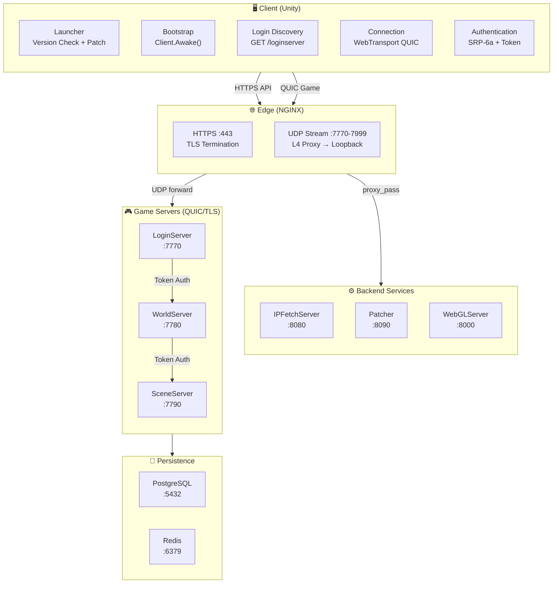
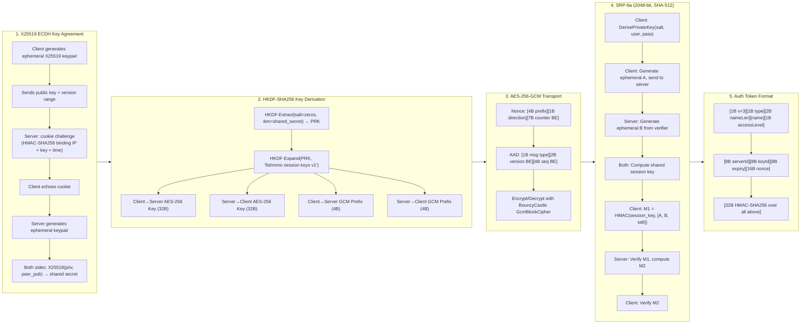
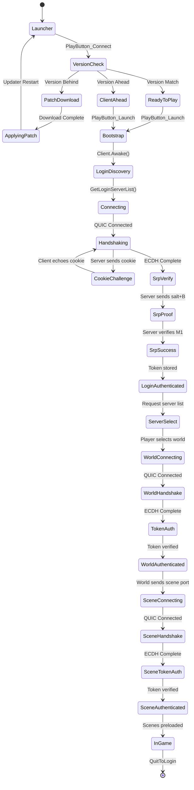

# FishMMO Connection Pipeline

This document describes the complete connection flow from client launch to in-game world entry. All game traffic uses **WebTransport (QUIC/HTTP3)** tunneled through an NGINX L4 UDP stream proxy. HTTP API calls use standard HTTPS with TLS certificate pinning.

---

## Architecture Overview

---

## Complete Connection Flow

```mermaid
sequenceDiagram
    autonumber
    actor Player
    participant Launcher as ClientLauncher
    participant API as api.fishmmo.com<br/>(NGINX → Services)
    participant Client as Client.cs
    participant CM as ClientConnectionManager
    participant WT as WebTransport<br/>(QUIC/HTTP3)
    participant Nginx as NGINX UDP Stream
    participant Login as LoginServer<br/>:7770
    participant World as WorldServer<br/>:7780
    participant Scene as SceneServer<br/>:7790
    participant DB as PostgreSQL

    %% ── Phase 0: Launcher ──
    rect rgb(40, 50, 60)
        Note over Player,API: Phase 0 — Launcher & Version Check
        Player->>Launcher: Start Game
        Launcher->>API: GET /news (HTTPS)
        API-->>Launcher: HTML Content
        Launcher->>API: GET /latest_version?from=X.Y.Z<br/>X-FishMMO-Client HMAC
        API-->>Launcher: {latest_version, patch_available, sha256}
        alt Patch Required
            Launcher->>API: GET /{version}.zip
            API-->>Launcher: Patch Binary (SHA-256 verified)
            Launcher->>Launcher: Launch Updater.exe
            Launcher->>Launcher: Quit & Restart
        end
        Launcher->>Client: Load ClientPostboot Scene
    end

    %% ── Phase 1: Bootstrap ──
    rect rgb(50, 40, 30)
        Note over Client,WT: Phase 1 — Client Bootstrap
        Client->>Client: Find NetworkManager
        Client->>WT: SetClientTransport<WebTransport>()
        Client->>CM: new ClientConnectionManager(nm)
        Client->>Client: Register Broadcasts<br/>(ClientHandshake, SrpVerify, etc.)
    end

    %% ── Phase 2: Login Discovery ──
    rect rgb(30, 50, 40)
        Note over Client,API: Phase 2 — Login Server Discovery
        Client->>API: GET /loginserver<br/>X-FishMMO-Client HMAC
        Note right of API: ClientSSLCertificateHandler<br/>SPKI Pin Validation
        API-->>Client: {Ports: [7770..7779], ConnectionToken}
        Client->>Client: Cache for 55s TTL
    end

    %% ── Phase 3: QUIC Connection ──
    rect rgb(50, 40, 60)
        Note over Client,Login: Phase 3 — WebTransport QUIC Connection
        Client->>CM: ConnectToServer(host, port)
        CM->>WT: StartConnection(address, port)
        WT->>WT: libfishmmo_webtransport Init
        WT->>Nginx: QUIC ClientHello (UDP)
        Nginx->>Login: UDP Forward :7770
        Note right of Login: Server terminates own TLS<br/>PEM cert from /etc/fishmmo/certs/
        Login-->>WT: QUIC Handshake Complete
        WT-->>CM: ConnectionState.Started
        CM-->>Client: OnConnectionSuccessful
    end

    %% ── Phase 4: ECDH Handshake ──
    rect rgb(40, 30, 50)
        Note over Client,Login: Phase 4 — X25519 ECDH Key Agreement
        Client->>Login: ClientHandshake<br/>(X25519 PubKey, Version Range, ConnectionToken)
        Login->>Login: Validate ConnectionToken<br/>(SHA-256 hash → DB lookup)
        alt Cookie Challenge (Anti-DDoS)
            Login-->>Client: ServerHandshake<br/>(Cookie, null Key)
            Client->>Login: ClientHandshake<br/>(X25519 PubKey, Cookie Echo)
        end
        Login->>Login: Generate X25519 Keypair
        Login-->>Client: ServerHandshake<br/>(Server PubKey, AgreedVersion)
        Client->>Client: X25519 ECDH → Shared Secret
        Login->>Login: X25519 ECDH → Shared Secret
        Client->>Client: HKDF-SHA256 → AES-256-GCM Keys<br/>(C→S + S→C directional)
        Login->>Login: HKDF-SHA256 → AES-256-GCM Keys
        Note over Client,Login: All subsequent messages encrypted under AES-256-GCM
    end

    %% ── Phase 5: SRP-6a Auth ──
    rect rgb(30, 40, 50)
        Note over Client,Login: Phase 5 — SRP-6a Authentication
        Client->>Login: SrpVerifyBroadcast<br/>(Encrypted: Username, Client Ephemeral A)
        Login->>DB: Fetch salt, verifier by username
        DB-->>Login: SRP Salt + Verifier
        Login-->>Client: SrpVerifyBroadcast<br/>(Encrypted: Salt s, Server Ephemeral B)
        Client->>Client: Derive private key from password<br/>Compute client proof M1
        Client->>Login: SrpProofBroadcast<br/>(Encrypted: Client Proof M1)
        Login->>Login: Verify M1, compute server proof M2
        Login->>Login: Build signed Auth Token<br/>[HMAC-SHA256 | Expiry | AccessLevel]
        Login-->>Client: SrpSuccessBroadcast<br/>(Encrypted: Server Proof M2, Auth Token)
        Client->>Client: Verify M2, store Auth Token
        Client->>Client: OnAuthResult(LoginSuccess)
    end

    %% ── Phase 6: Server Select ──
    rect rgb(50, 50, 40)
        Note over Client,World: Phase 6 — Server Selection & World Connection
        Client->>Login: RequestServerListBroadcast
        Login->>DB: Fetch active WorldServers
        DB-->>Login: World Server List
        Login-->>Client: ServerListBroadcast<br/>(WorldServerDetails[])
        Player->>Client: Select World Server
        Login-->>Client: WorldSceneConnectBroadcast<br/>(Port)
        Client->>Client: Disconnect from LoginServer
        Client->>CM: ConnectToServer(host, worldPort)
        Note over Client,World: Repeat Phase 3 (QUIC) + Phase 4 (ECDH)
    end

    %% ── Phase 7: Token Auth ──
    rect rgb(50, 40, 40)
        Note over Client,World: Phase 7 — Token-Based Authentication
        Client->>World: TokenAuthBroadcast<br/>(Encrypted: Auth Token)
        World->>DB: Fetch HMAC Signing Key<br/>(KeyEnvelope Unwrap with KEK)
        World->>World: Verify HMAC-SHA256 signature<br/>Check expiry, access level, revocation
        alt Token Valid
            World->>World: Issue Renewal Token
            World-->>Client: RenewTokenResponseBroadcast<br/>(Encrypted: New Auth Token)
            World-->>Client: ClientAuthResultBroadcast<br/>(WorldLoginSuccess)
            Client->>Client: OnAuthResult(WorldLoginSuccess)
        else Token Invalid/Expired/Revoked
            World-->>Client: ClientAuthResultBroadcast<br/>(TokenInvalid)
            Client->>Client: ClearAuthToken()
            Client->>Client: QuitToLogin()
        end
    end

    %% ── Phase 8: Scene Entry ──
    rect rgb(40, 50, 40)
        Note over Client,Scene: Phase 8 — Scene Server Handoff & World Entry
        World-->>Client: WorldSceneConnectBroadcast<br/>(Scene Port)
        Client->>Client: Disconnect from WorldServer
        Client->>CM: ConnectToServer(host, scenePort)
        Note over Client,Scene: Repeat Phase 3 + Phase 4 + Phase 7
        Scene-->>Client: ClientAuthResultBroadcast<br/>(SceneLoginSuccess)
        Client->>Client: OnAuthResult(SceneLoginSuccess)
        Scene-->>Client: ClientValidatedSceneBroadcast
        Client->>Client: Preload World Scenes<br/>(Addressables)
        Client-->>Scene: ClientValidatedSceneBroadcast
        Client->>Client: DismissLoadingScreen()
        Client->>Client: OnEnterGameWorld 🔥
    end
```

---

## Cryptographic Protocol Detail

---

## Security Features

| Layer | Feature | Implementation |
|-------|---------|---------------|
| **Transport** | TLS 1.3 (QUIC) | MsQuic via `libfishmmo_webtransport` |
| **Transport** | SPKI Certificate Pinning | `ClientCertificatePinning` (BouncyCastle) |
| **Key Exchange** | X25519 ECDH | Forward secrecy per connection |
| **Key Exchange** | Small-order point rejection | 12 known weak points blocked |
| **Key Derivation** | HKDF-SHA256 | Domain-separated labels |
| **Encryption** | AES-256-GCM | All auth messages encrypted |
| **Encryption** | GCM AAD binding | Message type + version + sequence |
| **Encryption** | Counter-based nonces | 2^32 messages per direction max |
| **Auth** | SRP-6a (2048-bit, SHA-512) | Password never transmitted |
| **Auth** | Fake SRP salts | Prevent account enumeration |
| **Auth** | Constant-time comparison | All HMAC/pin/crypto checks |
| **Auth** | TOTP 2FA | OtpNet with recovery codes (600k PBKDF2) |
| **Auth** | Token HMAC-SHA256 | 60-minute max TTL |
| **Auth** | Token key wrapping | AES-256-GCM KeyEnvelope with KEK |
| **Auth** | Dummy HMAC key | Timing equalization for missing keys |
| **API** | HMAC request signing | `X-FishMMO-Client` header, 30s anti-replay |
| **API** | Rate limiting | Token bucket per IP (10-30 rps) |
| **Edge** | NGINX rate limiting | `limit_req` + `limit_conn` per endpoint |
| **Edge** | Security headers | HSTS, CSP, XFO, CORP, COOP |
| **Server** | Per-IP rate limiting | Auth attempts, account creation |
| **Server** | Connection token | Client IP recovery through L4 proxy |
| **Server** | Key zeroing | `CryptographicOperations.ZeroMemory` |

---

## Platform Support Matrix

| Platform | Transport | Certificate Validation | Notes |
|----------|-----------|----------------------|-------|
| **Windows (Standalone)** | libfishmmo_webtransport.dll | BouncyCastle SPKI pinning | Binary not yet built |
| **Linux (Standalone)** | libfishmmo_webtransport.so | BouncyCastle SPKI pinning | ✅ Built & tested |
| **macOS (Standalone)** | libfishmmo_webtransport.dylib | BouncyCastle SPKI pinning | Binary not yet built |
| **WebGL (Browser)** | WebTransport.jslib → W3C API | Browser-native TLS | ✅ JS bridge complete |

---

## Configuration Files

| Server Type | Config File | Key Settings |
|-------------|------------|--------------|
| LoginServer | `LoginServer.cfg` | Port, MaxClients, Cert paths, SMTP, AutoVerifyAccounts |
| WorldServer | `WorldServer.cfg` | Port, MaxClients, Cert paths |
| SceneServer | `SceneServer.cfg` | Port, MaxClients, Cert paths |
| NGINX | `nginx.conf` | Upstreams, rate limits, TLS, CSP, stream includes |
| UDP Proxy | `gen-fishmmo-stream-config.sh` | Auto-generates 230 port forwards |
| Database | `appsettings.json` | PostgreSQL connection, pool settings |
| Certificates | `certbot-fishmmo.sh` | Auto-renewal deploy hook |

---

## Server Port Allocation

| Range | Count | Purpose |
|-------|-------|---------|
| 7770–7779 | 10 | Login Servers |
| 7780–7789 | 10 | World Servers |
| 7790–7999 | 210 | Scene Servers |
| 8000 | 1 | WebGL Static Asset Server |
| 8080 | 1 | IP Fetch / Login Discovery API |
| 8090 | 1 | Patcher / Version API |
| 5432 | 1 | PostgreSQL |

---

## Connection States

