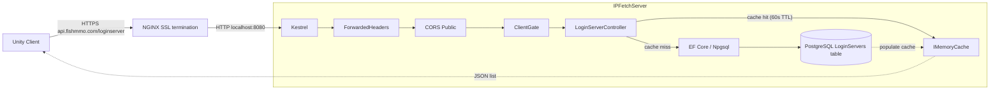

# IPFetchServer

## Table of Contents

- [Overview](#overview)
- [Supported Platforms](#supported-platforms)
- [Architecture](#architecture)
- [Directory Structure](#directory-structure)
- [Middleware Pipeline](#middleware-pipeline)
- [Endpoints](#endpoints)
- [Key Components](#key-components)
- [Configuration](#configuration)
- [Security](#security)
- [External Dependencies](#external-dependencies)
- [Requirements](#requirements)
- [Flow Diagram](#flow-diagram)

## Overview

ASP.NET Core Web API that provides login server IP address discovery for FishMMO clients. Unity clients query this service to obtain the list of active login servers before connecting. The server reads login server records from PostgreSQL, caches results in memory, issues one-time connection tokens for real-IP recovery, and gates access through `ClientGate` HMAC-signed request validation middleware shared across all FishMMO web services.

Designed to run behind NGINX as a reverse proxy (via `api.fishmmo.com`). NGINX terminates SSL and forwards requests over plain HTTP to Kestrel on localhost.

## Supported Platforms

| Target | Status |
|---|---|
| .NET 8.0 — Linux  | Yes (recommended) |
| .NET 8.0 — Windows | Yes |
| .NET 8.0 — macOS  | Yes |

| Requirement | Version |
|---|---|
| .NET SDK | 8.0+ |
| PostgreSQL | 14+ (with `LoginServers` table) |
| NGINX | Recommended for production (SSL termination) |

## Architecture

```
Unity Client
    |
    v HTTPS (api.fishmmo.com/loginserver)
+---------+
|  NGINX  |  <- SSL termination, X-Forwarded-For/Proto
+----+----+
     | HTTP (localhost:8080)
+----v---------------------------------------+
|  Kestrel (IPFetchServer)                  |
|  +-- ForwardedHeaders middleware          |
|  +-- CORS (Public)                 |
|  +-- ClientGate (HMAC request signing)    |
|  +-- Rate Limiting (token bucket)         |
|  +-- LoginServerController                |
|       +-- PostgreSQL (via EF Core)        |
|       +-- MemoryCache (60s TTL + jitter)  |
|       +-- ConnectionTokenService (DB)     |
+--------------------------------------------+
```

## Directory Structure

```
IpFetchServer/
├── Program.cs                      # Host builder, Kestrel config, middleware pipeline
├── Controllers/
│   └── LoginServerController.cs    # GET /loginserver — returns login server list + connection token
├── TokenCleanupService.cs          # Background service: deletes expired connection tokens
├── appsettings.json                # Port, connection string, rate limiting configuration
└── (ClientGate is in FishMMO-WebShared/)
```

## Middleware Pipeline

1. **`UseForwardedHeaders`** — trusts `X-Forwarded-For` / `X-Forwarded-Proto` from NGINX.
2. **`UseCors("Public")`** — allows cross-origin requests from `play.fishmmo.com`.
3. **`UseFishMMOClientGate`** — validates `X-FishMMO-Client` HMAC-signed header (shared `ClientGate` middleware from FishMMO-WebShared). Rejects requests with invalid/missing/replayed signatures.
4. **`UseRateLimiter`** — token-bucket rate limiting (10 req/s replenishment, 30 burst).
5. **`UseRouting` + `MapControllers`** — standard ASP.NET routing.
6. **`MapHealthChecks`** — `/healthz` endpoint with DB connectivity check.

## Key Components

| Component | Responsibility |
|---|---|
| `LoginServerController` | Single-endpoint controller backing `GET /loginserver`. Reads active login servers from PostgreSQL via EF Core, returns `{ Ports, ConnectionToken }` envelope. Uses `SemaphoreSlim(1,1)` single-flight cache-stampede protection with 60s TTL + 0-10s random jitter. |
| `ClientGate` (FishMMO-WebShared) | HMAC-SHA256 request signing validation with timestamp (±300s window) and nonce LRU replay protection. Shared across IPFetch, Patcher, and WebGL servers. |
| `TokenCleanupService` | `BackgroundService` that runs every 60 seconds deleting expired connection tokens from the database via raw SQL. |
| `IMemoryCache` (built-in) | 60-second TTL cache with jitter to prevent thundering-herd on cache expiry (was 300s in earlier versions). Won't cache empty results. |
| `ConnectionTokenService` | Issues CSPRNG 32-byte connection tokens (SHA-256 hashed in DB, 60s TTL) for real-IP recovery at the QUIC layer. |

## Endpoints

### `GET /loginserver`

Returns JSON array of active login servers with `Address` and `Port` fields.

**Caching:** Results are cached in `IMemoryCache` for 60 seconds with 0–10s random jitter to prevent thundering-herd on cache expiry. Won't cache empty results. Cache miss triggers a PostgreSQL query.

**Response Codes:**

| Code | Condition |
|------|-----------|
| 200 | Login servers found (returns `[{Address, Port}, ...]`) |
| 401 | Missing or invalid `X-FishMMO-Client` header (from ClientGate middleware) |
| 404 | No login servers available |
| 429 | Rate limit exceeded (token bucket) |
| 500 | Internal server error (e.g. DB connection failure, unexpected exception) |

## Configuration

Configuration is loaded in the following order (later sources override earlier):

- `appsettings.json` (defaults)
- `appsettings.{Environment}.json` (e.g. `appsettings.Development.json`, `appsettings.Production.json`)
- Environment variables
- Command-line arguments

Environment variable precedence:

- `FISHMMO_ENVIRONMENT` (custom, highest precedence for selecting the JSON file)
- `DOTNET_ENVIRONMENT`
- `ASPNETCORE_ENVIRONMENT`

The application reads `FISHMMO_ENVIRONMENT` first (if present) and will use it to determine which `appsettings.{Environment}.json` file to load.

Example `appsettings.Development.json` (kept out of source control in most setups):

```json
{
  "ConnectionStrings": {
    "NpgsqlConnection": "Host=localhost;Port=5432;Database=fishmmo_dev;Username=devuser;Password=devpass;"
  },
  "WebServer": {
    "HttpPort": 8080
  }
}
```

Recommendations:

- Do not commit production connection strings into source control. Remove `ConnectionStrings` from `appsettings.json` and provide them via environment variables or `appsettings.Production.json`.
- To set the connection string via environment variables, use the double-underscore form to map to nested keys. For example:

```
export ConnectionStrings__NpgsqlConnection="Host=...;Port=5432;Database=...;Username=...;Password=...;"
```

- The application will also pick up `WebServer:HttpPort` from configuration or environment variables. For example:

```
export WebServer__HttpPort=8080
```

- The code explicitly configures JSON files, environment variables, and command-line args. `Host.CreateDefaultBuilder` already provides similar behavior; this project makes the sources explicit.

## Security

- **ClientGate** validates HMAC-SHA256 request signatures with timestamp and nonce replay protection.
- **CORS policy** (`Public`) restricts cross-origin access to `play.fishmmo.com`.
- **ForwardedHeaders** ensures correct client IP logging when behind NGINX.
- **Rate limiting** (token bucket: 10 req/s, 30 burst) prevents DDoS.
- Kestrel binds to **localhost only** — not directly accessible from the internet.
- Connection tokens are CSPRNG-generated, SHA-256 hashed before DB storage, and expire after 60 seconds.

## External Dependencies

- **Npgsql / Entity Framework Core** - PostgreSQL access via `NpgsqlDbContextFactory`.
- **Microsoft.Extensions.Caching.Memory** - in-memory caching for login server list.
- **FishMMO.Logging** - structured async logging.

## Requirements

- .NET 8.0 SDK or later
- PostgreSQL database with `LoginServers` table
- NGINX reverse proxy (recommended for production)

## Flow Diagram


