# IPFetchServer

## Table of Contents

- [Overview](#overview)
- [Supported Platforms](#supported-platforms)
- [Architecture](#architecture)
- [Directory Structure](#directory-structure)
- [Middleware Pipeline](#middleware-pipeline)
- [Endpoints](#endpoints)
- [Key Components](#key-components)
- [Configuration](#configuration)
- [Security](#security)
- [External Dependencies](#external-dependencies)
- [Requirements](#requirements)
- [Flow Diagram](#flow-diagram)

## Overview

ASP.NET Core Web API that provides login server IP address discovery for FishMMO clients. Unity clients query this service to obtain the list of active login servers before connecting. The server reads login server records from PostgreSQL, caches results in memory, issues stateless HMAC-signed connection tokens for real-IP recovery, and gates access through `ClientGate` HMAC-signed request validation middleware shared across all FishMMO web services.

Designed to run behind NGINX as a reverse proxy (via `api.fishmmo.com`). NGINX terminates SSL and forwards requests over plain HTTP to Kestrel on localhost.

## Supported Platforms

| Target | Status |
|---|---|
| .NET 8.0 — Linux  | Yes (recommended) |
| .NET 8.0 — Windows | Yes |
| .NET 8.0 — macOS  | Yes |

| Requirement | Version |
|---|---|
| .NET SDK | 8.0+ |
| PostgreSQL | 14+ (with `LoginServers` table) |
| NGINX | Recommended for production (SSL termination) |

## Architecture

```
Unity Client
    |
    v HTTPS (api.fishmmo.com/loginserver)
+---------+
|  NGINX  |  <- SSL termination, X-Forwarded-For/Proto
+----+----+
     | HTTP (localhost:8080)
+----v---------------------------------------+
|  Kestrel (IPFetchServer)                  |
|  +-- Exception handler middleware         |
|  +-- ForwardedHeaders middleware          |
|  +-- Null-IP rejection middleware         |
|  +-- FishMMOSecurityHeaders middleware    |
|  +-- ClientGate (HMAC, key from DB)       |
|  +-- CORS (configurable origins)          |
|  +-- Rate Limiting (token bucket)         |
|  +-- LoginServerController                |
|       +-- PostgreSQL (via EF Core)        |
|       +-- MemoryCache (60s TTL + jitter)  |
|       +-- Stateless HMAC connection token |
+--------------------------------------------+
```

## Directory Structure

```
IpFetchServer/
├── Program.cs                      # Host builder, Kestrel config, middleware pipeline
├── Controllers/
│   └── LoginServerController.cs    # GET /loginserver — returns login server list + HMAC connection token
├── appsettings.json                # Port, connection string, rate limiting configuration
└── (ClientGate is in FishMMO-WebShared/)
```

## Middleware Pipeline

1. **`UseExceptionHandler`** — catches unhandled exceptions, returns structured error responses.
2. **`UseForwardedHeaders`** — trusts `X-Forwarded-For` / `X-Forwarded-Proto` from NGINX (ForwardLimit=1).
3. **Null-IP rejection middleware** — returns 400 if `RemoteIpAddress` is null after forwarding (proxy misconfiguration guard).
4. **`UseFishMMOSecurityHeaders`** — adds `X-Content-Type-Options`, `X-Frame-Options`, `Referrer-Policy`, etc.
5. **`UseFishMMOClientGate`** — validates `X-FishMMO-Client` HMAC-signed header (shared `ClientGate` middleware from FishMMO-WebShared). The shared secret is loaded from the `deployment_secrets` database table at startup (via `IDeploymentSecretService` + `GateSecretHolder`) — no environment variable or configuration file fallback. Loopback paths (`/healthz`) are exempted for monitoring. Rejects requests with invalid/missing/replayed signatures.
6. **`UseCors`** — configurable CORS policy (default deny, configured via `Cors:AllowedOrigins`).
7. **`UseRateLimiter`** — token-bucket rate limiting (10 req/s replenishment, 30 burst, partitioned by real client IP).
8. **`UseRouting` + `MapControllers`** — standard ASP.NET routing.
9. **`MapHealthChecks`** — `/healthz` endpoint with DB connectivity check.

## Key Components

| Component | Responsibility |
|---|---|
| `LoginServerController` | Single-endpoint controller backing `GET /loginserver`. Reads active login servers from PostgreSQL via EF Core, returns `{ Ports, ConnectionToken }` envelope. Uses `SemaphoreSlim(1,1)` single-flight cache-stampede protection with 60s TTL + 0-10s random jitter. Issues stateless HMAC-SHA256 connection tokens — no database storage required. |
| `ClientGate` (FishMMO-WebShared) | HMAC-SHA256 request signing validation with timestamp (±30s window) and nonce LRU replay protection (100,000 entries). Shared across IPFetch and Patcher web servers. Intentionally absent on WebGLServer (browsers cannot add custom headers to static resource requests). |
| `IMemoryCache` (built-in) | 60-second TTL cache with jitter to prevent thundering-herd on cache expiry. Won't cache empty results (allows fast recovery when LoginServers register). |

## Endpoints

### `GET /loginserver`

Returns JSON object with login server ports and a stateless connection token for real-IP recovery.

**Response format:** `{ "Ports": [7770, 7771, ...], "ConnectionToken": "base64url..." }`

**Connection token format:** `base64url(realIp|expiryUnixTimestamp).base64url(HMAC-SHA256(sharedKey, payload))`

The HMAC key is configured via `ConnectionToken:HmacKey` in appsettings.json or `CONNECTION_TOKEN_HMAC_KEY` environment variable. The Login Server verifies the HMAC and extracts the real IP — no database round-trip required.

**Caching:** Results are cached in `IMemoryCache` for 60 seconds with 0–10s random jitter to prevent thundering-herd on cache expiry. Won't cache empty results. Cache miss triggers a PostgreSQL query with single-flight gate.

**Response Codes:**

| Code | Condition |
|------|-----------|
| 200 | Login servers found (returns `{ Ports, ConnectionToken }`) |
| 400 | Null remote IP after forwarding (proxy misconfiguration) |
| 401 | Missing or invalid `X-FishMMO-Client` header (from ClientGate middleware) |
| 404 | No login servers available |
| 429 | Rate limit exceeded (token bucket) |
| 500 | Internal server error (e.g. DB connection failure, unconfigured HMAC key) |

## Configuration

Configuration is loaded in the following order (later sources override earlier):

- `appsettings.json` (defaults)
- `appsettings.{Environment}.json` (e.g. `appsettings.Development.json`, `appsettings.Production.json`)
- Environment variables
- Command-line arguments

Environment variable precedence:

- `FISHMMO_ENVIRONMENT` (custom, highest precedence for selecting the JSON file)
- `DOTNET_ENVIRONMENT`
- `ASPNETCORE_ENVIRONMENT`

The application reads `FISHMMO_ENVIRONMENT` first (if present) and will use it to determine which `appsettings.{Environment}.json` file to load.

### Connection Token HMAC Key

The shared key for stateless connection tokens is configured via:

- **appsettings.json:** `ConnectionToken:HmacKey` (Base64-encoded 32-byte key)
- **Environment variable:** `CONNECTION_TOKEN_HMAC_KEY` (Base64-encoded 32-byte key)

This same key must be configured on the Login Server via `.cfg` key `ConnectionTokenHmacKeyBase64` or env var `FISHMMO_CONNECTION_TOKEN_HMAC_KEY_BASE64`.

Example `appsettings.Development.json` (kept out of source control in most setups):

```json
{
  "ConnectionStrings": {
    "NpgsqlConnection": "Host=localhost;Port=5432;Database=fishmmo_dev;Username=devuser;Password=devpass;"
  },
  "WebServer": {
    "HttpPort": 8080
  },
  "ConnectionToken": {
    "HmacKey": "base64-encoded-32-byte-key-here"
  }
}
```

Recommendations:

- Do not commit production connection strings into source control. Remove `ConnectionStrings` from `appsettings.json` and provide them via environment variables or `appsettings.Production.json`.
- To set the connection string via environment variables, use the double-underscore form to map to nested keys. For example:

```
export ConnectionStrings__NpgsqlConnection="Host=...;Port=5432;Database=...;Username=...;Password=...;"
```

- The application will also pick up `WebServer:HttpPort` from configuration or environment variables. For example:

```
export WebServer__HttpPort=8080
```

- The code explicitly configures JSON files, environment variables, and command-line args. `Host.CreateDefaultBuilder` already provides similar behavior; this project makes the sources explicit.

### Gate Secret (ClientGate)

The HMAC shared secret for `ClientGate` request signing is a separate concern from the connection token key above. It is loaded **exclusively** from the `deployment_secrets` database table at startup:

1. After building the host, the application opens a DI scope and resolves `IDeploymentSecretService`.
2. The service fetches the record with key `"client_gate_secret"`.
3. The value is stored in a singleton `GateSecretHolder`.
4. The `Configure` callback reads `GateSecretHolder.Secret` and passes it to `UseFishMMOClientGate(environment, gateSecret, bypassPaths)`.

**Sources:** This value is **not** configurable via environment variables, `appsettings.json`, command-line arguments, or any other configuration source. The database is the sole source.

**Setup:** Operators must run the `fishmmo-installer → Database → Configure Server Keys` workflow to populate it, or insert a row directly:

```sql
INSERT INTO deployment_secrets (key, value, created_at, updated_at)
VALUES ('client_gate_secret', 'your-32+byte-secret', NOW(), NOW());
```

**Behaviour if missing:** In Production the host refuses to start with a clear error; in Development the gate logs a warning and passes all requests through, so local dev works without a configured database.

**Shared secret:** The same secret must be shared across all servers that validate `X-FishMMO-Client`:
- **IPFetchServer** (via `GateSecretHolder`)
- **Patcher** (via `GateSecretHolder`; also used by `PatchVersionService` to HMAC-sign version manifest responses)
- **Unity client** (embedded via Unity Editor: **FishMMO > Security > Fetch Client Secrets**, which writes `ClientApiSecret.generated.cs`)

The `client_gate_secret` is a single value (or a comma-separated set for rotation). If a comma-separated keyset is provided, all keys are tried during verification so old clients continue to work during rotation.

## Security

- **ClientGate** validates HMAC-SHA256 request signatures with timestamp and nonce replay protection. The shared secret is loaded from the `deployment_secrets` database table at startup — not from environment variables or configuration files.
- **CORS policy** is configurable via `Cors:AllowedOrigins` array; defaults to deny-all.
- **ForwardedHeaders** (ForwardLimit=1) ensures correct client IP when behind a single trusted NGINX proxy.
- **Rate limiting** (token bucket: 10 req/s replenish, 30 burst, partitioned by real client IP) prevents DDoS.
- Kestrel binds to **localhost only** — not directly accessible from the internet.
- **Connection tokens** are stateless HMAC-SHA256: the real IP is cryptographically bound with a 60-second expiry. No database storage, no table maintenance, no cleanup service. Token replay within the TTL window is bounded by the HMAC signature.

## External Dependencies

- **Npgsql / Entity Framework Core** - PostgreSQL access via `NpgsqlDbContextFactory`.
- **Microsoft.Extensions.Caching.Memory** - in-memory caching for login server list.
- **FishMMO.Logging** - structured async logging.

## Requirements

- .NET 8.0 SDK or later
- PostgreSQL database with `LoginServers` table
- NGINX reverse proxy (recommended for production)
- Shared HMAC key provisioned on both IPFetch and Login Server for connection token signing
- Gate secret populated in `deployment_secrets` database table (via `fishmmo-installer → Database → Configure Server Keys`)

## Flow Diagram

```mermaid
flowchart LR
    Client[Unity Client] -->|"HTTPS api.fishmmo.com/loginserver"| Nginx[NGINX SSL termination]
    Nginx -->|"HTTP localhost:8080"| Kestrel[Kestrel]
    subgraph Server[IPFetchServer]
        Kestrel --> Fwd[ForwardedHeaders]
        Fwd --> NullGuard[Null-IP Rejection]
        NullGuard --> SecHdr[SecurityHeaders]
        SecHdr --> Gate[ClientGate]
        Gate --> Cors[CORS]
        Cors --> RateLimit[Rate Limiter]
        RateLimit --> Ctrl[LoginServerController]
        Ctrl -->|"cache hit (60s TTL)"| Cache[IMemoryCache]
        Ctrl -->|cache miss| EF[EF Core / Npgsql]
        EF --> DB1[("PostgreSQL LoginServers")]
        Ctrl -->|"HMAC-SHA256"| Token["Stateless Connection Token"]
        DB2[("PostgreSQL\ndeployment_secrets")] -.->|"startup\nIDeploymentSecretService"| Gate
    end
    Cache -. "{ Ports, ConnectionToken }" .-> Client
    DB1 -. populate cache .-> Cache
```


