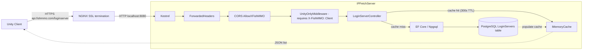

# IPFetchServer

## Table of Contents

- [Overview](#overview)
- [Supported Platforms](#supported-platforms)
- [Architecture](#architecture)
- [Directory Structure](#directory-structure)
- [Middleware Pipeline](#middleware-pipeline)
- [Endpoints](#endpoints)
- [Key Components](#key-components)
- [Configuration](#configuration)
- [Security](#security)
- [External Dependencies](#external-dependencies)
- [Requirements](#requirements)
- [Flow Diagram](#flow-diagram)

## Overview

ASP.NET Core Web API that provides login server IP address discovery for FishMMO clients. Unity clients query this service to obtain the list of active login servers before connecting. The server reads login server records from PostgreSQL, caches results in memory, and gates access through a custom middleware that rejects non-FishMMO requests.

Designed to run behind NGINX as a reverse proxy (via `api.fishmmo.com`). NGINX terminates SSL and forwards requests over plain HTTP to Kestrel on localhost.

## Supported Platforms

| Target | Status |
|---|---|
| .NET 8.0 — Linux  | Yes (recommended) |
| .NET 8.0 — Windows | Yes |
| .NET 8.0 — macOS  | Yes |

| Requirement | Version |
|---|---|
| .NET SDK | 8.0+ |
| PostgreSQL | 14+ (with `LoginServers` table) |
| NGINX | Recommended for production (SSL termination) |

## Architecture

```
Unity Client
    |
    v HTTPS (api.fishmmo.com/loginserver)
+---------+
|  NGINX  |  <- SSL termination, X-Forwarded-For/Proto
+----+----+
     | HTTP (localhost:8080)
+----v------------------------------------+
|  Kestrel (IPFetchServer)               |
|  +-- ForwardedHeaders middleware       |
|  +-- CORS (AllowXFishMMO)              |
|  +-- UnityOnlyMiddleware               |
|  +-- LoginServerController             |
|       +-- PostgreSQL (via Npgsql)      |
|       +-- MemoryCache (300s TTL)       |
+-----------------------------------------+
```

## Directory Structure

```
IpFetchServer/
+-- Program.cs                      # Host builder, Kestrel config, middleware pipeline
+-- Controllers/
|   +-- LoginServerController.cs    # GET /loginserver - returns login server list
+-- UnityOnlyMiddleware.cs          # Rejects requests without X-FishMMO: Client header
+-- appsettings.json                # Port, connection string configuration

```

## Middleware Pipeline

1. **`UseForwardedHeaders`** - trusts `X-Forwarded-For` / `X-Forwarded-Proto` from NGINX.
2. **`UseCors("AllowXFishMMO")`** - allows any origin with `X-FishMMO` header.
3. **`UnityOnlyMiddleware`** - checks `X-FishMMO` header equals `"Client"`. Returns 403 if missing/invalid.
4. **`UseRouting` + `UseAuthorization`** - standard ASP.NET routing.
5. **`MapControllers`** - maps attribute-routed controller endpoints.

## Key Components

| Component | Responsibility |
|---|---|
| `LoginServerController` | Single-endpoint controller backing `GET /loginserver`. Reads from EF Core `NpgsqlDbContext.LoginServers` and serializes `{ Address, Port }` records. |
| `UnityOnlyMiddleware` | Rejects requests that do not carry `X-FishMMO: Client`. Returns `403` for non-Unity callers. |
| `IMemoryCache` (built-in) | 300-second TTL cache that absorbs the read-heavy traffic from clients between rare DB updates. |
| `NpgsqlDbContextFactory` | EF Core context factory used per-request to avoid scoped-context concurrency issues. |

## Endpoints

### `GET /loginserver`

Returns JSON array of active login servers with `Address` and `Port` fields.

**Caching:** Results are cached in `IMemoryCache` for 300 seconds (5 minutes). Cache miss triggers a PostgreSQL query via `NpgsqlDbContext.LoginServers`.

**Response Codes:**

| Code | Condition |
|------|-----------|
| 200 | Login servers found (returns `[{Address, Port}, ...]`) |
| 401 | Failed to create DB context |
| 403 | Missing or invalid `X-FishMMO` header (from middleware) |
| 404 | No login servers available |

## Configuration

Configuration is loaded in the following order (later sources override earlier):

- `appsettings.json` (defaults)
- `appsettings.{Environment}.json` (e.g. `appsettings.Development.json`, `appsettings.Production.json`)
- Environment variables
- Command-line arguments

Environment variable precedence:

- `FISHMMO_ENVIRONMENT` (custom, highest precedence for selecting the JSON file)
- `DOTNET_ENVIRONMENT`
- `ASPNETCORE_ENVIRONMENT`

The application reads `FISHMMO_ENVIRONMENT` first (if present) and will use it to determine which `appsettings.{Environment}.json` file to load.

Example `appsettings.Development.json` (kept out of source control in most setups):

```json
{
  "ConnectionStrings": {
    "NpgsqlConnection": "Host=localhost;Port=5432;Database=fishmmo_dev;Username=devuser;Password=devpass;"
  },
  "WebServer": {
    "HttpPort": 8080
  }
}
```

Recommendations:

- Do not commit production connection strings into source control. Remove `ConnectionStrings` from `appsettings.json` and provide them via environment variables or `appsettings.Production.json`.
- To set the connection string via environment variables, use the double-underscore form to map to nested keys. For example:

```
export ConnectionStrings__NpgsqlConnection="Host=...;Port=5432;Database=...;Username=...;Password=...;"
```

- The application will also pick up `WebServer:HttpPort` from configuration or environment variables. For example:

```
export WebServer__HttpPort=8080
```

- The code explicitly configures JSON files, environment variables, and command-line args. `Host.CreateDefaultBuilder` already provides similar behavior; this project makes the sources explicit.

## Security

- **UnityOnlyMiddleware** rejects all requests that do not include `X-FishMMO: Client` header.
- **CORS policy** (`AllowXFishMMO`) restricts allowed headers to `X-FishMMO`.
- **ForwardedHeaders** ensures correct client IP logging when behind NGINX.
- Kestrel binds to **localhost only** - not directly accessible from the internet.

## External Dependencies

- **Npgsql / Entity Framework Core** - PostgreSQL access via `NpgsqlDbContextFactory`.
- **Microsoft.Extensions.Caching.Memory** - in-memory caching for login server list.
- **FishMMO.Logging** - structured async logging.

## Requirements

- .NET 8.0 SDK or later
- PostgreSQL database with `LoginServers` table
- NGINX reverse proxy (recommended for production)

## Flow Diagram


