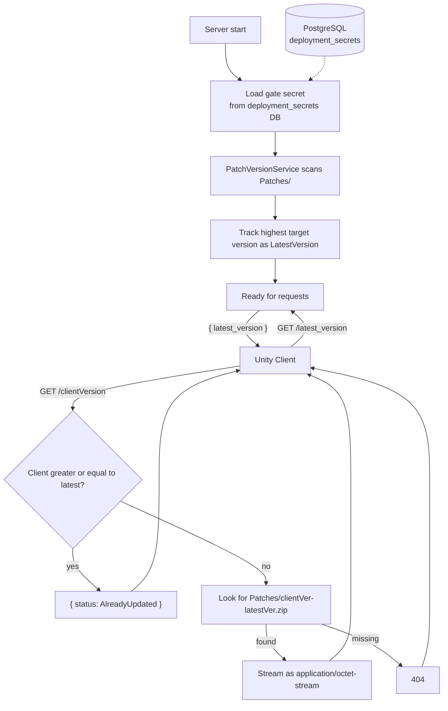

# FishMMO Patch Server (ASP.NET)

## Table of Contents

- [Overview](#overview)
- [Supported Platforms](#supported-platforms)
- [Architecture](#architecture)
- [Directory Structure](#directory-structure)
- [Middleware Pipeline](#middleware-pipeline)
- [Endpoints](#endpoints)
- [Key Components](#key-components)
- [Configuration](#configuration)
- [Security](#security)
- [External Dependencies](#external-dependencies)
- [Requirements](#requirements)
- [Flow Diagram](#flow-diagram)

## Overview

ASP.NET Core patch delivery server for FishMMO clients. Determines the latest available patch version by scanning the patch directory on startup (with FileSystemWatcher hot-reload), then serves versioned `.zip` patch files to clients that are behind the current version. Access is gated through `ClientGate` HMAC-signed request validation middleware shared across all FishMMO web services.

Designed to run behind NGINX as a reverse proxy (via `api.fishmmo.com`). NGINX terminates SSL and forwards requests over plain HTTP to Kestrel on localhost.

## Supported Platforms

| Target | Status |
|---|---|
| .NET 8.0 — Linux | Yes (recommended) |
| .NET 8.0 — Windows | Yes |
| .NET 8.0 — macOS | Yes |

| Requirement | Version |
|---|---|
| .NET SDK | 8.0+ |
| `Patches/` directory | Required, populated by `PatchGenerator` |
| NGINX | Recommended for production |

## Architecture

```
Unity Client
    |
    v HTTPS (api.fishmmo.com/latest_version or api.fishmmo.com/{version})
+---------+
|  NGINX  |  <- SSL termination, X-Forwarded-For/Proto
+----+----+
     | HTTP (localhost:8090)
+----v-----------------------------------------+
|  Kestrel (Patcher)                          |
|  +-- Exception handler middleware          |
|  +-- ForwardedHeaders middleware            |
|  +-- Null-IP rejection middleware           |
|  +-- FishMMOSecurityHeaders middleware      |
|  +-- ClientGate (HMAC, key from DB)         |
|  +-- CORS (Public)                   |
|  +-- Rate Limiting (two-tier)               |
|  +-- PatchController                        |
|       +-- PatchVersionService               |
|       |    +-- VersionConfig parser         |
|       |    +-- FileSystemWatcher            |
|       |    +-- HMAC signing (from gate key) |
|       +-- Patches/ directory (zips)         |
+----------------------------------------------+
```

## Directory Structure

```
Patcher/
├── Program.cs                      # Host builder, Kestrel config, middleware pipeline
├── Controllers/
│   └── PatchController.cs          # GET /latest_version, GET /{version}
├── Services/
│   └── PatchVersionService.cs      # Startup patch directory scanner, SHA-256 indexing, FileSystemWatcher
├── VersionConfig.cs                # SemVer parser with pre-release support and comparison operators
├── appsettings.json                # Port, patch directory configuration
└── (ClientGate is in FishMMO-WebShared/)
```

## Middleware Pipeline

1. **`UseExceptionHandler`** — catches unhandled exceptions, returns structured error responses.
2. **`UseForwardedHeaders`** — trusts `X-Forwarded-For` / `X-Forwarded-Proto` from NGINX.
3. **Null-IP rejection middleware** — returns 400 if `RemoteIpAddress` is null after forwarding (proxy misconfiguration guard).
4. **`UseFishMMOSecurityHeaders`** — adds `X-Content-Type-Options`, `X-Frame-Options`, `Referrer-Policy`, etc.
5. **`UseFishMMOClientGate`** — validates `X-FishMMO-Client` HMAC-signed header (shared `ClientGate` middleware from FishMMO-WebShared). The shared secret is loaded from the `deployment_secrets` database table at startup (via `IDeploymentSecretService` + `GateSecretHolder`) — no environment variable or configuration file fallback. Loopback paths (`/healthz`) are exempted for monitoring.
6. **`UseCors("Public")`** — allows cross-origin requests from `play.fishmmo.com`.
7. **`UseRateLimiter`** — two-tier: token bucket (10 req/s, 30 burst) for metadata endpoints; sliding window (6 permits/60s) for patch downloads.
8. **`UseRouting` + `MapControllers`** — standard ASP.NET routing.
9. **`MapHealthChecks`** — `/healthz` endpoint with patch version status.

## Endpoints

### `GET /latest_version`

Returns the latest patch version string as JSON:
```json
{ "latest_version": "1.2.3" }
```

### `GET /{version}`

Downloads the patch file for upgrading from `{version}` to the latest version.

**Flow:**
1. Parse client version via `VersionConfig.Parse(version)`.
2. Parse server latest version via `VersionConfig.Parse(latest)`.
3. If client >= latest: return `{ "status": "AlreadyUpdated" }`.
4. Look for `Patches/{clientVersion}-{latestVersion}.zip`.
5. If found: stream as `application/octet-stream`.

**Response Codes:**

| Code | Condition |
|------|-----------|
| 200 | Patch file streamed, or already up to date |
| 400 | Invalid client version format |
| 401 | Missing or invalid `X-FishMMO-Client` header (from ClientGate middleware) |
| 404 | Patch file not found |
| 429 | Rate limit exceeded (token bucket or sliding window) |
| 500 | Latest version unavailable or malformed |

## Key Components

### `PatchVersionService`

Singleton service that scans the `Patches/` directory on startup:

- Matches files against regex: `^(\d+\.\d+\.\d+(?:\.[a-zA-Z0-9]+)?)-(\d+\.\d+\.\d+(?:\.[a-zA-Z0-9]+)?)\.zip$`
- Parses target versions (second capture group) via `VersionConfig.Parse`.
- Tracks the highest target version as `LatestVersion`.
- Falls back to `0.0.0` if no valid patch files are found.
- **HMAC signing key:** Receives the gate secret via its constructor (loaded from the `deployment_secrets` database table at startup). Derives an HMAC-SHA256 signing key from the first comma-separated key entry to sign version manifest responses via `SignContent()`. The Unity client verifies this signature to confirm the response originated from an authentic patcher.

### `VersionConfig`

SemVer-compatible version model with pre-release support:

- **Format:** `Major.Minor.Patch[.PreRelease]` (e.g., `1.2.3`, `1.2.3.alpha`)
- **Comparison:** `IComparable<VersionConfig>` with full operator overloads (`==`, `!=`, `<`, `>`, `<=`, `>=`)
- **Pre-release rules:** A pre-release version has lower precedence than a normal version (SemVer compliant). Pre-release tags are compared lexicographically.

### Patch File Naming Convention

```
<from_version>-<to_version>.zip
```

Examples:
- `1.0.0-1.0.1.zip`
- `1.0.0.alpha-1.0.0.beta.zip`

## Configuration

`appsettings.json`:

```json
{
  "WebServer": {
    "HttpPort": "8090"
  },
  "Patches": {
    "DirectoryName": "Patches"
  }
}
```

| Key | Default | Purpose |
|-----|---------|---------|
| `WebServer:HttpPort` | `8090` | Kestrel listen port (localhost only) |
| `Patches:DirectoryName` | `Patches` | Subdirectory containing `.zip` patch files |

### Gate Secret (ClientGate)

The HMAC shared secret for `ClientGate` request signing and `PatchVersionService` version-manifest signing is loaded **exclusively** from the `deployment_secrets` database table at startup:

1. After building the host, the application opens a DI scope and resolves `IDeploymentSecretService`.
2. The service fetches the record with key `"client_gate_secret"`.
3. The value is stored in a singleton `GateSecretHolder`.
4. The `Configure` callback reads `GateSecretHolder.Secret` and passes it to `UseFishMMOClientGate(environment, gateSecret, bypassPaths)`.
5. The `PatchVersionService` constructor also receives the gate secret and derives its HMAC signing key.

**Sources:** This value is **not** configurable via environment variables, `appsettings.json`, command-line arguments, or any other configuration source. The database is the sole source.

**Setup:** Operators must run the `fishmmo-installer → Database → Configure Server Keys` workflow to populate it, or insert a row directly:

```sql
INSERT INTO deployment_secrets (key, value, created_at, updated_at)
VALUES ('client_gate_secret', 'your-32+byte-secret', NOW(), NOW());
```

**Behaviour if missing:** In Production the host refuses to start with a clear error; in Development the gate logs a warning and passes all requests through, so local dev works without a configured database.

**Shared secret:** The same secret must be deployed to all servers that validate `X-FishMMO-Client`:
- **IPFetchServer** (via `GateSecretHolder`)
- **Patcher** (via `GateSecretHolder`; also used by `PatchVersionService` to HMAC-sign version manifest responses)
- **Unity client** (embedded via Unity Editor: **FishMMO > Security > Fetch Client Secrets**, which writes `ClientApiSecret.generated.cs`)

The `client_gate_secret` is a single value (or a comma-separated set for rotation). If a comma-separated keyset is provided, all keys are tried during verification so old clients continue to work during rotation.

## Security

- **ClientGate** validates HMAC-SHA256 request signatures with timestamp and nonce replay protection. The shared secret is loaded from the `deployment_secrets` database table at startup — not from environment variables or configuration files.
- **CORS policy** (`Public`) restricts cross-origin access to `play.fishmmo.com`.
- **ForwardedHeaders** ensures correct client IP logging when behind NGINX.
- **Rate limiting** (two-tier: metadata + download) prevents abuse.
- Kestrel binds to **localhost only** — not directly accessible from the internet.
- Patch files are served with `FileOptions.SequentialScan`, ETag support (conditional GET), and path traversal defense at both index-time and serve-time.

## External Dependencies

- **FishMMO.Logging** - structured async logging.
- **Npgsql** - PostgreSQL connection (for loading gate secret from `deployment_secrets` table via `IDeploymentSecretService`).

## Requirements

- .NET 8.0 SDK or later
- `Patches/` directory with properly named `.zip` files
- Gate secret populated in `deployment_secrets` database table (via `fishmmo-installer → Database → Configure Server Keys`)

## Flow Diagram


- NGINX reverse proxy (recommended for production)