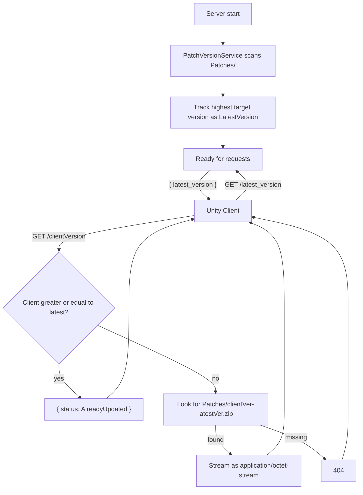

# FishMMO Patch Server (ASP.NET)

## Table of Contents

- [Overview](#overview)
- [Supported Platforms](#supported-platforms)
- [Architecture](#architecture)
- [Directory Structure](#directory-structure)
- [Middleware Pipeline](#middleware-pipeline)
- [Endpoints](#endpoints)
- [Key Components](#key-components)
- [Configuration](#configuration)
- [Security](#security)
- [External Dependencies](#external-dependencies)
- [Requirements](#requirements)
- [Flow Diagram](#flow-diagram)

## Overview

ASP.NET Core patch delivery server for FishMMO clients. Determines the latest available patch version by scanning the patch directory on startup, then serves versioned `.zip` patch files to clients that are behind the current version. Access is gated to FishMMO clients only via custom middleware.

Designed to run behind NGINX as a reverse proxy (via `api.fishmmo.com`). NGINX terminates SSL and forwards requests over plain HTTP to Kestrel on localhost.

## Supported Platforms

| Target | Status |
|---|---|
| .NET 8.0 — Linux | Yes (recommended) |
| .NET 8.0 — Windows | Yes |
| .NET 8.0 — macOS | Yes |

| Requirement | Version |
|---|---|
| .NET SDK | 8.0+ |
| `Patches/` directory | Required, populated by `PatchGenerator` |
| NGINX | Recommended for production |

## Architecture

```
Unity Client
    |
    v HTTPS (api.fishmmo.com/latest_version or api.fishmmo.com/{version})
+---------+
|  NGINX  |  <- SSL termination, X-Forwarded-For/Proto
+----+----+
     | HTTP (localhost:8090)
+----v--------------------------------------+
|  Kestrel (Patcher)                       |
|  +-- ForwardedHeaders middleware         |
|  +-- CORS (AllowXFishMMO)                |
|  +-- UnityOnlyMiddleware                 |
|  +-- PatchController                     |
|       +-- PatchVersionService            |
|            +-- VersionConfig parser      |
|       +-- Patches/ directory (zips)      |
+-------------------------------------------+
```

## Directory Structure

```
Patcher/
+-- Program.cs                      # Host builder, Kestrel config, middleware pipeline
+-- Controllers/
|   +-- PatchController.cs          # GET /latest_version, GET /{version}
+-- Services/
|   +-- PatchVersionService.cs      # Startup patch directory scanner, latest version tracker
+-- VersionConfig.cs                # SemVer parser with pre-release support and comparison operators
+-- UnityOnlyMiddleware.cs          # Rejects requests without X-FishMMO: Client header
+-- appsettings.json                # Port, patch directory
```

## Middleware Pipeline

1. **`UseForwardedHeaders`** - trusts `X-Forwarded-For` / `X-Forwarded-Proto` from NGINX.
2. **`UseCors("AllowXFishMMO")`** - allows any origin with `X-FishMMO` header.
3. **`UnityOnlyMiddleware`** - checks `X-FishMMO` header equals `"Client"`. Returns 403 if missing/invalid.
4. **`UseRouting`** - standard ASP.NET routing.
5. **`MapControllers`** - maps attribute-routed controller endpoints.

## Endpoints

### `GET /latest_version`

Returns the latest patch version string as JSON:
```json
{ "latest_version": "1.2.3" }
```

### `GET /{version}`

Downloads the patch file for upgrading from `{version}` to the latest version.

**Flow:**
1. Parse client version via `VersionConfig.Parse(version)`.
2. Parse server latest version via `VersionConfig.Parse(latest)`.
3. If client >= latest: return `{ "status": "AlreadyUpdated" }`.
4. Look for `Patches/{clientVersion}-{latestVersion}.zip`.
5. If found: stream as `application/octet-stream`.

**Response Codes:**

| Code | Condition |
|------|-----------|
| 200 | Patch file streamed, or already up to date |
| 400 | Invalid client version format |
| 403 | Missing or invalid `X-FishMMO` header |
| 404 | Patch file not found |
| 500 | Latest version unavailable or malformed |

## Key Components

### `PatchVersionService`

Singleton service that scans the `Patches/` directory on startup:

- Matches files against regex: `^(\d+\.\d+\.\d+(?:\.[a-zA-Z0-9]+)?)-(\d+\.\d+\.\d+(?:\.[a-zA-Z0-9]+)?)\.zip$`
- Parses target versions (second capture group) via `VersionConfig.Parse`.
- Tracks the highest target version as `LatestVersion`.
- Falls back to `0.0.0` if no valid patch files are found.

### `VersionConfig`

SemVer-compatible version model with pre-release support:

- **Format:** `Major.Minor.Patch[.PreRelease]` (e.g., `1.2.3`, `1.2.3.alpha`)
- **Comparison:** `IComparable<VersionConfig>` with full operator overloads (`==`, `!=`, `<`, `>`, `<=`, `>=`)
- **Pre-release rules:** A pre-release version has lower precedence than a normal version (SemVer compliant). Pre-release tags are compared lexicographically.

### Patch File Naming Convention

```
<from_version>-<to_version>.zip
```

Examples:
- `1.0.0-1.0.1.zip`
- `1.0.0.alpha-1.0.0.beta.zip`

## Configuration

`appsettings.json`:

```json
{
  "WebServer": {
    "HttpPort": "8090"
  },
  "Patches": {
    "DirectoryName": "Patches"
  }
}
```

| Key | Default | Purpose |
|-----|---------|---------|
| `WebServer:HttpPort` | `8090` | Kestrel listen port (localhost only) |
| `Patches:DirectoryName` | `Patches` | Subdirectory containing `.zip` patch files |

## Security

- **UnityOnlyMiddleware** rejects all requests without `X-FishMMO: Client` header.
- **CORS policy** (`AllowXFishMMO`) restricts allowed headers to `X-FishMMO`.
- **ForwardedHeaders** ensures correct client IP logging when behind NGINX.
- Kestrel binds to **localhost only** - not directly accessible from the internet.
- Patch files are streamed with async `FileStream` to avoid memory pressure on large patches.

## External Dependencies

- **FishMMO.Logging** - structured async logging.
- **Npgsql** - PostgreSQL connection (for heartbeat/registration).

## Requirements

- .NET 8.0 SDK or later
- `Patches/` directory with properly named `.zip` files

## Flow Diagram


- NGINX reverse proxy (recommended for production)