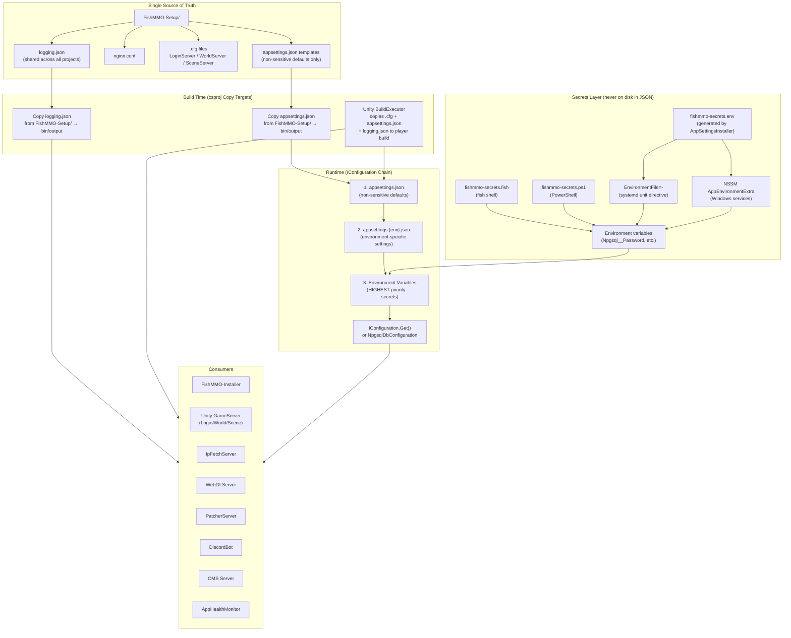
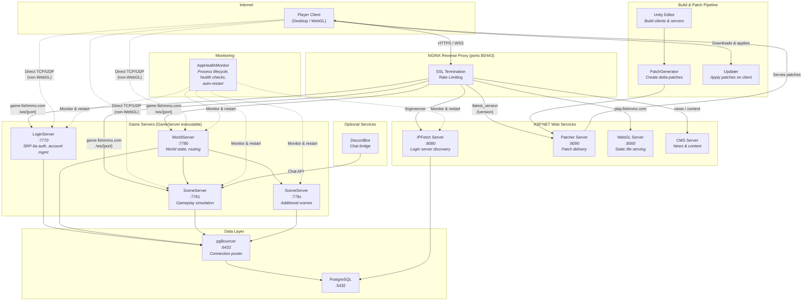

[](https://discord.gg/9JQEYjkSNk)
[Join our Discord](https://discord.gg/9JQEYjkSNk)

# FishMMO

A modular, open-source MMO framework built on **Unity 6.3 LTS**, **FishNet**, and **PostgreSQL**.

---

## Table of Contents

- [Overview](#overview)
- [Supported Platforms](#supported-platforms)
- [Prerequisites](#prerequisites)
- [Installation Guide](#installation-guide)
  - [1. Clone the Repository](#1-clone-the-repository)
  - [2. Build the FishMMO-Installer](#2-build-the-fishmmo-installer)
  - [3. Run the Installer](#3-run-the-installer)
  - [4. Open the Unity Project](#4-open-the-unity-project)
- [Database Setup](#database-setup)
- [Unity Project Setup](#unity-project-setup)
  - [Build World Scene Details](#build-world-scene-details)
  - [Versioning](#versioning)
  - [FishMMO Builds](#fishmmo-builds)
  - [Patching — PatchGenerator and Updater](#patching--patchgenerator-and-updater)
- [Configuration](#configuration)
  - [Constants.cs — Client Domains](#constantscs--client-domains)
  - [Server Configuration Files](#server-configuration-files)
  - [Logging Configuration](#logging-configuration)
  - [FishMMO-Auth — Signing Keys & KEK](#fishmmo-auth--signing-keys--kek)
- [Infrastructure Setup](#infrastructure-setup)
  - [Configure Unity Hub](#configure-unity-hub)
  - [Configure PostgreSQL](#configure-postgresql)
  - [Configure pgBouncer](#configure-pgbouncer)
    - [Configure NGINX](#configure-nginx)
- [Running the Servers](#running-the-servers)
  - [Launch Order](#launch-order)
  - [Starting Game Servers](#starting-game-servers)
  - [Starting Web Servers](#starting-web-servers)
  - [Running Multiple Scene Servers](#running-multiple-scene-servers)
- [FishMMO-AppHealthMonitor](#fishmmo-apphealthmonitor)
- [Optional Services](#optional-services)
  - [FishMMO-DiscordBot](#fishmmo-discordbot)
  - [FishMMO-CMS](#fishmmo-cms)
- [Client Setup](#client-setup)
  - [Client TLS Certificate Pinning](#client-tls-certificate-pinning)
- [Production Deployment](#production-deployment)
  - [Linux Config Hardening](#linux-config-hardening)
  - [Systemd Services](#systemd-services)
  - [Port Reference](#port-reference)
- [Flow Diagram](#flow-diagram)
- [License](#license)

---

## Overview

FishMMO is a complete multiplayer online game framework consisting of:

| Component | Description |
|---|---|
| **FishMMO-Unity** | Unity project containing client, server, and shared game code |
| **FishMMO-Auth** | Transport-agnostic .NET authentication library (SRP-6a, token auth, TOTP 2FA) |
| **FishMMO-Database (FishMMO-DB)** | PostgreSQL data-access layer using Entity Framework Core + Npgsql |
| **FishMMO-Installer** | Cross-platform .NET 8 console tool that automates dependency installation |
| **FishMMO-Dependencies** | Centralised NuGet dependency library (netstandard2.1) |
| **FishMMO-Logger** | Flexible logging library with file, email, and console backends |
| **FishMMO-SharedUtility** | Pure C# utility library shared between client and server projects |
| **FishMMO-AppHealthMonitor** | Daemon that monitors, auto-restarts, and health-checks server processes |
| **FishMMO-WebServers** | ASP.NET Core web services — IPFetch, Patcher, and WebGL static server |
| **FishMMO-Patcher** | Client-side updater that applies versioned patch files |
| **FishMMO-Setup** | Configuration templates — nginx.conf, server .cfg files, appsettings.json |
| **FishMMO-DiscordBot** | Discord bot bridging in-game chat with a Discord guild |
| **FishMMO-CMS** | ASP.NET Core CMS for launcher news, announcements, and web content |

The server architecture uses three server types:

- **LoginServer** — Handles account creation, SRP-6a authentication, character select, and TOTP 2FA.
- **WorldServer** — Manages world state, character routing, and scene server orchestration.
- **SceneServer** — Runs gameplay simulation for individual world scenes (chat, combat, inventory, guilds, etc.).

All three are launched from a single `GameServer` executable with a command-line argument (`LOGIN`, `WORLD`, or `SCENE`).

---

## Supported Platforms

| Platform | Client | Server |
|---|---|---|
| Windows 10/11 | Yes | Yes |
| Linux (Ubuntu/Debian, Arch/CachyOS) | Yes | Yes |
| macOS | Yes | Yes |
| WebGL | Yes (via browser) | N/A |

| Requirement | Version |
|---|---|
| Unity | 6.3 LTS |
| .NET SDK | 8.0+ |
| PostgreSQL | 14+ |
| Scripting Backend | IL2CPP |

---

## Prerequisites

- **Git** for cloning the repository
- **.NET 8.0 SDK**
- **Unity Hub** with **Unity 6.3 LTS** (the installer can install these for you)
- **PostgreSQL 14+** (the installer can install this for you)
- Administrator/root privileges for system-level installs
- Internet connectivity

---

## Installation Guide

### 1. Clone the Repository

```bash
git clone https://github.com/jimdroberts/FishMMO.git
cd FishMMO
```

> **Tip:** Use the `dev` branch if it is more up-to-date than `main`:
> ```bash
> git checkout dev
> ```

### 2. Build the FishMMO-Installer

The **FishMMO-Installer** is the recommended way to set up all dependencies. It automates installing .NET, PostgreSQL, NGINX, PgBouncer, Unity Hub, building all C# projects, and setting up the database.

```bash
cd FishMMO-Installer
dotnet build
dotnet run --project FishMMO-Installer
```

Or run the compiled binary directly:
- **Windows:** `FishMMO-Installer\bin\Debug\net8.0\FishMMO-Installer.exe`
- **Linux:** `./FishMMO-Installer/bin/Debug/net8.0/FishMMO-Installer`

> **Windows:** Run from an elevated PowerShell (Administrator) for system-level installs.
> **Linux:** You will be prompted for `sudo` when needed.

### 3. Run the Installer

The installer supports two modes: **interactive menu** (default) and **CLI-driven** (for headless/automated deployment).

#### Interactive Menu Mode (default)

Run with no arguments to enter the menu:

```
=== FishMMO Installer ===
1 : Runtime & Tooling     — .NET EF Tool, ASP.NET Runtime, VS Build Tools
2 : Database              — PostgreSQL, PgBouncer, DB management
3 : Web Server            — NGINX, Let's Encrypt SSL, Firewall, Services
4 : Unity & Build         — Unity Hub, Unity Editor, C# project builds
5 : Configuration         — appsettings.json setup
0 : Quit
```

#### Sub-Menu: Runtime & Tooling

```
1 : Install DotNet EF Tool (dotnet-ef)
2 : Install ASP.NET Runtime
3 : Install Visual Studio Build Tools (Windows Only)
0 : Back
```

#### Sub-Menu: Database

```
1 : Install PostgreSQL
2 : Install PgBouncer (Connection Pooler)
3 : Install FishMMO Database (User/Schema/Initial Migration)
4 : Create New Database Migration
5 : Grant User Permissions on Database
6 : Delete FishMMO Database (DANGEROUS!)
7 : Configure PgBouncer (generate pgbouncer.ini + userlist.txt, Linux)
0 : Back
```

#### Sub-Menu: Web Server

```
1 : Install NGINX (Web Server/Reverse Proxy)
2 : Install/Renew Let's Encrypt Certificate (NGINX)
3 : Deploy FishMMO nginx.conf (from FishMMO-Setup/)
4 : Configure Firewall Rules (open ports 80, 443)
5 : Register FishMMO Web Servers as Services (systemd / NSSM)
0 : Back
```

#### Sub-Menu: Unity & Build

```
1 : Install Unity Hub
2 : Install Unity Editor (+Modules)
3 : Build all C# Projects
4 : Build FishMMO-Unity (Client/Server/Addressables)
0 : Back
```

#### Sub-Menu: Configuration

```
1 : Configure appsettings.json
0 : Back
```

#### CLI / Non-Interactive Mode

For headless servers and CI/CD pipelines, use CLI arguments:

```bash
# Show help
FishMMO-Installer --help

# Show version
FishMMO-Installer --version

# Install a single component
FishMMO-Installer --component postgresql

# Run health checks on all installed components
FishMMO-Installer --validate

# Simulate without making changes
FishMMO-Installer --dry-run --component nginx

# Unattended installation from a config file
FishMMO-Installer --non-interactive -f install-config.json
```

**`install-config.json` format:**

```json
{
  "components": ["dotnet-sdk", "postgresql", "nginx", "firewall", "systemd-services"],
  "configureFirewall": true,
  "firewallPorts": [80, 443],
  "registerSystemdServices": true,
  "validateAfterInstall": true
}
```

**Available component names for CLI use:**
`dotnet-sdk`, `aspnet-runtime`, `vs-build-tools`, `postgresql`, `pgbouncer`, `fishmmo-db`, `nginx`, `letsencrypt`, `unity-hub`, `unity-editor`, `build-projects`, `build-unity`, `appsettings`, `firewall`, `systemd-services`

> **Pre-flight checks** automatically run before any CLI-mode installation, verifying internet connectivity, disk space, memory, admin/sudo access, and port conflicts.

> **Download integrity:** Downloaded files are verified against SHA256 checksums in `checksums.json`. Corrupt or tampered downloads are rejected.

#### Recommended Installation Order (Fresh Setup)

| Step | Menu | Action | Windows | Linux |
|---|---|---|---|---|
| 1 | Runtime & Tooling | Install DotNet EF Tool | Yes | Yes |
| 2 | Runtime & Tooling | Install ASP.NET Runtime | Yes | Yes |
| 3 | Runtime & Tooling | Install VS Build Tools | Yes | *(skip)* |
| 4 | Unity & Build | Build all C# Projects | Yes | Yes |
| 5 | Unity & Build | Install Unity Hub | Yes | Yes |
| 6 | Unity & Build | Install Unity Editor (+Modules) | Yes | Yes |
| 7 | Database | Install PostgreSQL | Yes | Yes |
| 8 | Database | Install FishMMO Database | Yes | Yes |
| 9 | Database | Install PgBouncer | Yes | Yes |
| 10 | Database | Configure PgBouncer | *(manual)* | Yes |
| 11 | Web Server | Install NGINX | Yes | Yes |
| 12 | Web Server | Deploy FishMMO nginx.conf | Yes | Yes |
| 13 | Web Server | Configure Firewall Rules | Yes | Yes |
| 14 | Web Server | Install/Renew Let's Encrypt Certificate | Optional | Optional |
| 15 | Web Server | Register FishMMO Web Services | Optional | Yes |
| 16 | Configuration | Configure appsettings.json | Yes | Yes |

> **"Build all C# Projects"** discovers and builds all `.csproj` files under the repository root, including:
> - `FishMMO-Dependencies` — copies dependency DLLs into `FishMMO-Unity/Assets/Dependencies/`
> - `FishMMO-Auth` — authentication library (copies DLL to Unity Dependencies)
> - `FishMMO-Database/FishMMO-DB` — database library
> - `FishMMO-Logger` — logging library (copies DLL to Unity Dependencies)
> - `FishMMO-SharedUtility` — shared utility library (copies DLL to Unity Dependencies)
> - `FishMMO-WebServers/IPFetchASP.NET` — login server discovery API
> - `FishMMO-WebServers/PatcherASP.NET` — patch delivery server
> - `FishMMO-WebServers/WebGLServerASP.NET` — WebGL static file server
> - `FishMMO-AppHealthMonitor` — server health monitor daemon
> - `FishMMO-DiscordBot` — Discord chat bridge bot
> - `FishMMO-CMS` — content management system

### 4. Open the Unity Project

After building all C# projects, open the Unity project to compile Unity-side scripts and perform Unity-specific setup:

1. Open **Unity Hub**
2. Click **ADD** → Select the `FishMMO-Unity` directory
3. Open the project with **Unity 6.3 LTS**
4. Wait for the initial asset import and script compilation to complete
5. Follow the [Unity Project Setup](#unity-project-setup) section below

---

## Database Setup

The FishMMO-Installer automates database creation (Database menu, option `3`), but here is what happens under the hood:

1. **PostgreSQL Installation** — The installer installs PostgreSQL via your platform's package manager (option `1`).
2. **Database + User Creation** — Creates the `fish_mmo_postgresql` database and a dedicated `fishmmo` user role (option `3`).
3. **EF Core Migration** — Creates and applies an initial Entity Framework Core migration (option `3`).
4. **Permissions** — Grants the user full privileges on the `public` schema (options `3` and `5`).

### Manual Database Setup (Without the Installer)

If you prefer to set up the database manually:

```bash
# Linux — become the postgres user
sudo -u postgres psql
```

```sql
CREATE USER fishmmo WITH PASSWORD 'your_secure_password';
CREATE DATABASE fish_mmo_postgresql OWNER fishmmo;
GRANT ALL PRIVILEGES ON DATABASE fish_mmo_postgresql TO fishmmo;
\c fish_mmo_postgresql
GRANT ALL ON SCHEMA public TO fishmmo;
```

Then apply the EF Core migrations:

```bash
cd FishMMO-Database/FishMMO-DB-Migrator
dotnet run
```

### Creating New Migrations

When your data model changes, create a new migration via the Installer (Database menu, option `4`) or manually:

```bash
cd FishMMO-Database/FishMMO-DB-Migrator
dotnet ef migrations add YourMigrationName
dotnet run
```

### Database Configuration


**Environment-based overrides:** The database library supports layered configuration in this priority order:

1. `appsettings.json` (required)
2. `appsettings.{Environment}.json` (optional — e.g., `appsettings.Development.json`)
3. Environment variables (highest priority, use `__` for nesting)

Set the environment via `FISHMMO_ENVIRONMENT` (preferred), `DOTNET_ENVIRONMENT`, or `ASPNETCORE_ENVIRONMENT`.

**Environment variable overrides:**

| Variable | Maps To |
|---|---|
| `FISHMMO_ENVIRONMENT` | Environment name (`Development`, `Production`) |
| `Npgsql__Host` | PostgreSQL host |
| `Npgsql__Port` | PostgreSQL port |
| `Npgsql__Database` | Database name |
| `Npgsql__Username` | Database user |
| `Npgsql__Password` | Database password |

Example (fish shell):

```fish
set -Ux FISHMMO_ENVIRONMENT Production
set -Ux Npgsql__Password super_secret
```

Example (bash):

```bash
export FISHMMO_ENVIRONMENT=Production
export Npgsql__Password=super_secret
```

---

---

## Unity Project Setup

### Build World Scene Details

This caches important game world details (spawn points, teleporters, boundaries, scene metadata) for both clients and servers. **Run this whenever you add or modify a scene.**

**Unity Menu:** `FishMMO → Build → Rebuild World Scene Details`

This generates `WorldSceneDetailsCache` assets that are loaded at runtime by the WorldServer and SceneServer for scene routing and character placement.

### Versioning

Manage the project's semantic versioning from the Unity Editor.

**Unity Menu:** `FishMMO → Version → ...`

| Option | Effect |
|---|---|
| Increment Major | Increases the major version number |
| Increment Minor | Increases the minor version number |
| Increment Patch | Increases the patch version number |
| Reset Version | Resets all version fields to zero |

Each action updates `VersionConfig.asset` and Unity's bundle version. The final version is written to `version.txt` in the build output directory.

> **Optional:** Enable automatic patch increments by uncommenting the `UpdateBuildVersion()` call in `OnPostprocessBuild`.

### FishMMO Builds

Use the custom build menu in Unity to create clients, servers, and Addressables.

**Unity Menu:** `FishMMO → Build → ...`

The FishMMO Dashboard provides a comprehensive build interface:

| Build Option | Description |
|---|---|
| **Build Client** | Standalone client executable (Windows/Linux/macOS) |
| **Build Server** | Headless server executable (Login/World/Scene from one binary) |
| **Build Addressables** | Builds all Addressable asset bundles required by client and server |
| **Build All** | Builds Addressables, then client, then server in sequence |

**Build Environments:**

| Environment | Address Binding | Use Case |
|---|---|---|
| **Development** | `127.0.0.1` (loopback) | Local testing |
| **Release** | `0.0.0.0` (all interfaces) | Production deployment |

The build process copies the appropriate `.cfg` and `appsettings.json` files from `FishMMO-Setup/Development/` or `FishMMO-Setup/Release/` into the build output.

> **Important:** Build Addressables first, then build client/server. The client and server depend on the Addressable bundles produced in the first step.

### Patching — PatchGenerator and Updater

#### PatchGenerator

A custom Unity Editor window for creating delta patches between game builds.

**Unity Menu:** `FishMMO → Patch → Patch Generator`

1. Select the **new** and **old** build directories.
2. Configure options, exclusions, and version details.
3. Click **Generate Patch** to create delta files and a manifest.

Patch files are ZIP archives named `<from_version>-<to_version>.zip` (e.g., `1.0.0-1.0.1.zip`).

#### Updater

The FishMMO Updater is a standalone .NET 8 executable that applies versioned patches to the client. It is launched automatically by the game launcher.

```
Updater.exe -version=1.0.0 -latestversion=1.0.1 -pid=1234 -exe=FishMMOClient.exe
```

Features: transactional patching with per-file backup and rollback, parallel file operations, SHA-256 hash verification on both sides of each diff, automatic client restart after successful patch.

#### Patch Server

Build the **PatcherASP.NET** web server and point it to a directory containing your generated patch `.zip` files. Clients query `/latest_version` to check for updates and download patches via `/{version}`.

---

## Configuration

### Constants.cs — Client Domains

The file [`FishMMO-Unity/Assets/Scripts/Shared/Implementation/Constants.cs`](FishMMO-Unity/Assets/Scripts/Shared/Implementation/Constants.cs) contains domain endpoints used by the client to connect to your infrastructure.

```csharp
public static class Configuration
{
    /// Unified API Host URL. NGINX routes to the correct backend by path.
    public static readonly string APIHost = "https://api.fishmmo.com/";

    /// NGINX game WebSocket hostname for Bayou/WebGL clients.
    /// WebGL clients connect via wss://GameHost/ws/{port} instead of direct IP:port.
    public static readonly string GameHost = "game.fishmmo.com";
}
```

| Field | Purpose | Update When |
|---|---|---|
| `APIHost` | Base URL for IPFetch and Patcher API calls | You use a different domain or run without NGINX |
| `GameHost` | WebSocket hostname for WebGL game connections | You use a different domain for game traffic |

> For local development, override these to `https://localhost/` and `localhost` respectively, or configure your hosts file.

### Server Configuration Files

Each server type reads a `.cfg` file from its working directory. Templates are in `FishMMO-Setup/Development/` and `FishMMO-Setup/Release/`.

#### LoginServer.cfg

```ini
ServerName=LoginServer
MaximumClients=4000
Address=127.0.0.1
Port=7770
StaleSceneTimeout=5
```

#### WorldServer.cfg

```ini
ServerName=World Server
MaximumClients=4000
Address=127.0.0.1
Port=7780
StaleSceneTimeout=5
```

#### SceneServer.cfg

```ini
ServerName=Scene Server
MaximumClients=4000
Address=127.0.0.1
Port=7781
StaleSceneTimeout=5
```

| Key | Description | Default |
|---|---|---|
| `ServerName` | Display name for logs and monitoring | varies |
| `MaximumClients` | Maximum concurrent connections | 4000 |
| `Address` | Bind address (`127.0.0.1` for dev, `0.0.0.0` for production) | varies |
| `Port` | Listen port (Login=7770, World=7780, Scene=7781+) | varies |
| `StaleSceneTimeout` | Seconds before idle scenes are unloaded | 5 |

**Format:** Simple `key=value` per line. Lines starting with `#` or `;` are comments.

> **Production:** Edit the `Release/` templates before building. Each SceneServer needs a unique port if running multiple instances.

### Logging Configuration

All projects share a single canonical `logging.json` at [`FishMMO-Setup/logging.json`](FishMMO-Setup/logging.json). Each project's build copies it into the output directory automatically — operators only need to edit the one source file.

```json
{
  "LoggingManager": {
    "ConsoleAllowedLevels": ["Info", "Warning", "Error", "Critical", "Debug"]
  },
  "Loggers": []
}
```

**Log levels:** `Verbose`, `Debug`, `Info`, `Warning`, `Error`, `Critical`.

**Adding file logging** (edit `FishMMO-Setup/logging.json`):

```json
{
  "LoggingManager": {
    "ConsoleAllowedLevels": ["Info", "Warning", "Error", "Critical"]
  },
  "Loggers": [
    {
      "Type": "FileLoggerConfig",
      "LoggerType": "FileLogger",
      "Enabled": true,
      "AllowedLevels": ["Info", "Warning", "Error", "Critical", "Debug"],
      "LogDirectory": "logs",
      "FileName": "server.log"
    }
  ]
}
```

**Adding email alerts** (append to the `Loggers` array):

```json
{
  "Type": "EmailLoggerConfig",
  "LoggerType": "EmailLogger",
  "Enabled": true,
  "AllowedLevels": ["Error", "Critical"],
  "SmtpServer": "smtp.example.com",
  "Port": 587,
  "EnableSsl": true,
  "Username": "alerts@example.com",
  "Password": "********",
  "From": "alerts@example.com",
  "To": "ops@example.com",
  "Subject": "FishMMO Alert"
}
```

> **Security:** Keep SMTP credentials out of source control. Load secrets from environment variables or a separate secrets file. See [FishMMO-Logger README](FishMMO-Logger/README.md) for full configuration details.

**Runtime override:** Place a modified `logging.json` in the working directory — it takes precedence over the bundled copy. The log level can also be overridden via the `FISHMMO_LOG_LEVEL` environment variable (e.g. `Debug`, `Verbose`).

### Configuration Files — `FishMMO-Setup/`

All project configuration lives in [`FishMMO-Setup/`](FishMMO-Setup/) as the single source of truth. **Non-sensitive defaults (host, port, database name) are stored in JSON. Secrets (passwords, tokens, API keys) are set via environment variables** and override the JSON values at runtime. Each template includes a `_comment` field listing the env var names to set.

**Directory structure:**

```
FishMMO-Setup/
├── logging.json                              # Shared logging — all projects
├── nginx.conf                                # NGINX reverse-proxy config
├── Development/                              # Dev / local configurations
│   ├── appsettings.json                      # Unity server Npgsql (dev)
│   ├── appsettings.AppHealthMonitor.json      # Process supervisor config
│   ├── appsettings.DiscordBot.json           # Discord token + Npgsql
│   ├── appsettings.IpFetchServer.json        # IP-fetch web server base
│   ├── appsettings.IpFetchServer.Development.json  # Dev overrides
│   ├── appsettings.Patcher.json              # Patch delivery web server
│   ├── appsettings.WebGLServer.json          # Static asset web server
│   ├── appsettings.CMS.json                  # CMS web app
│   ├── appsettings.Database.json             # Npgsql pool / retry template
│   ├── install-config.*.json                 # Installer templates (3)
│   ├── LoginServer.cfg / WorldServer.cfg / SceneServer.cfg
├── Release/                                  # Production configurations
│   ├── appsettings.json                      # Unity server Npgsql + Redis
│   ├── appsettings.IpFetchServer.Production.json  # Prod overrides
│   ├── LoginServer.cfg / WorldServer.cfg / SceneServer.cfg
```

**How it works:** Each project's `.csproj` copies the appropriate file from `FishMMO-Setup/` into its build output directory, renaming it to `appsettings.json` (or `logging.json`). At runtime, applications resolve config with a **working-directory-first** pattern: if a modified file exists in the working directory, it overrides the bundled copy. Environment variables (prefixed `FISHMMO_`) provide the highest-priority overrides.

**Unity Npgsql example** ([`Development/appsettings.json`](FishMMO-Setup/Development/appsettings.json)):

```json
{
  "_comment": "Non-sensitive defaults only. Override secrets via env vars: Npgsql__Password, Npgsql__Username",
  "Npgsql": {
    "Database": "fish_mmo_postgresql",
    "Username": "",
    "Password": "",
    "Host": "127.0.0.1",
    "Port": "5432"
  }
}
```

**Release adds Redis** ([`Release/appsettings.json`](FishMMO-Setup/Release/appsettings.json)):

{
  "_comment": "Non-sensitive defaults only. Override secrets via env vars: Npgsql__Password, Npgsql__Username, Redis__Password",
  "Npgsql": {
{
  "Npgsql": {
    "Database": "fish_mmo_postgresql",
    "Username": "",
    "Password": "",
    "Host": "127.0.0.1",
    "Port": "5432"
  },
  "Redis": {
    "Host": "127.0.0.1",
    "Port": "6379",
    "Password": ""
}
```

If using PgBouncer, change `Npgsql.Port` to `6432` (see [Configure pgBouncer](#configure-pgbouncer)).

> **Security:** Never commit `appsettings.json` with real passwords. Use environment variables for secrets in production (see [Database Setup](#database-setup) for environment variable override syntax).

### Configuration & Deployment Flow




### FishMMO-Auth — Signing Keys & KEK

The authentication system uses HMAC-SHA256 for token signing. In production, signing keys are wrapped with an AES-256 Key Encryption Key (KEK).

#### Setting the KEK

Set the environment variable `FISHMMO_SIGNING_KEY_KEK_BASE64` to a 32-byte base64-encoded AES-256 key:

```bash
# Generate a new KEK (do this once, store securely)
KEK=$(openssl rand -base64 32)
echo "Your KEK: $KEK"

# Set it in your environment
export FISHMMO_SIGNING_KEY_KEK_BASE64="$KEK"
```

**Linux (systemd):** Add to your service unit file:
```ini
[Service]
Environment=FISHMMO_SIGNING_KEY_KEK_BASE64=your_base64_kek_here
```

**Linux (fish shell, persistent):**
```fish
set -Ux FISHMMO_SIGNING_KEY_KEK_BASE64 your_base64_kek_here
```

#### How It Works

1. The LoginServer generates a fresh HMAC-SHA256 signing key at startup.
2. The key is wrapped using AES-256-GCM with the KEK and an AAD bound to the LoginServer's database ID.
3. The wrapped key envelope is stored in the database.
4. World/Scene servers fetch and unwrap the signing key to validate client tokens.
5. Keys are rotated each time the LoginServer restarts.

> **Without a KEK:** If `FISHMMO_SIGNING_KEY_KEK_BASE64` is not set, the LoginServer will log a warning and tokens will not be issued. Client authentication will fail on World/Scene servers.

---

## Infrastructure Setup

### Configure Unity Hub

1. **Add the Project:**
   - Click **ADD** in Unity Hub.
   - Select the `FishMMO-Unity` directory.

2. **Install Required Modules:**
   - Go to the **Installs** tab.
   - Click the gear icon next to your Unity 6.3 LTS version → **Add Modules**.
   - Install:
     - **Linux Build Support (IL2CPP and Mono)**
     - **Linux Dedicated Server Build Support**
     - **Mac Build Support (IL2CPP and Mono)**
     - **WebGL Build Support**
     - **Windows Build Support (IL2CPP)**
     - **Windows Dedicated Server Build Support**

3. Open the **FishMMO-Unity** project from Unity Hub and wait for full compilation.

### Configure PostgreSQL

The installer handles PostgreSQL installation. For manual setup, ensure:

1. PostgreSQL is running and listening on `localhost:5432`.
2. The `fishmmo` user can connect with password authentication.
3. `pg_hba.conf` allows local password connections:
   ```
   local   fish_mmo_postgresql   fishmmo   md5
   host    fish_mmo_postgresql   fishmmo   127.0.0.1/32   md5
   ```

**Securing PostgreSQL (Production):**

The installer's `PostgreSQLHardening` module applies:
- Password-based authentication only (no trust)
- Restricted listen addresses (`localhost` or private network)
- Connection limits
- Query logging for audit trails

### Configure pgBouncer

PgBouncer is a lightweight PostgreSQL connection pooler that sits between your game servers and PostgreSQL, reducing connection overhead. Each game server opens many short-lived connections — PgBouncer multiplexes these onto a smaller pool of persistent connections.

#### Installation

Use the Installer (Database menu, option `2`):
- **Linux:** Package manager install + `systemctl enable --now pgbouncer`
- **Windows:** `winget` (preferred) or Chocolatey fallback

#### Configuration

After installation, configure PgBouncer to pool connections to your FishMMO database.

**Linux:** The installer's "Configure PgBouncer" option (Database menu, option `7`) generates `pgbouncer.ini` and `userlist.txt` for you. Otherwise, manually edit `/etc/pgbouncer/pgbouncer.ini`.

**Windows:** Edit `pgbouncer.ini` in the install directory.

##### pgbouncer.ini

```ini
[databases]
fish_mmo_postgresql = host=127.0.0.1 port=5432 dbname=fish_mmo_postgresql

[pgbouncer]
listen_addr = 127.0.0.1
listen_port = 6432

auth_type = md5
auth_file = /etc/pgbouncer/userlist.txt

pool_mode = transaction
default_pool_size = 20
min_pool_size = 5
max_client_conn = 200
max_db_connections = 50

server_idle_timeout = 300
client_idle_timeout = 0
query_timeout = 30

log_connections = 0
log_disconnections = 0
log_pooler_errors = 1

admin_users = fishmmo
stats_users = fishmmo
```

##### userlist.txt

```
"fishmmo" "your_secure_password"
```

> On Linux, generate the password hash:
> ```bash
> psql -c "SELECT concat('\"', usename, '\" \"', passwd, '\"') FROM pg_shadow WHERE usename = 'fishmmo';" postgres
> ```

##### Update appsettings.json

Point your game servers at PgBouncer (port `6432`) instead of PostgreSQL directly:

```json
{
  "Npgsql": {
    "Port": "6432"
  }
}
```

##### Verify

**Linux:**
```bash
sudo systemctl status pgbouncer
sudo systemctl restart pgbouncer
# Test connection through PgBouncer
psql -h 127.0.0.1 -p 6432 -U fishmmo -d fish_mmo_postgresql
```

**Windows:**
```powershell
sc.exe query pgbouncer
```

---

## Running the Servers

### Launch Order

Servers must be started in this exact order:

1. **PostgreSQL** — Must be running before any server starts.
2. **PgBouncer**  — If used, must be running before game servers start.
3. **LoginServer** — Must be running and registered in the database before World servers.
4. **WorldServer** — Must be running and registered before Scene servers.
5. **SceneServer(s)** — Can start once WorldServer is registered.
6. **IPFetch Server** — Should start after the LoginServer is registered.
7. **Patcher Server** — Can start independently; needs patch files.
8. **WebGL Server** — Can start independently; needs a WebGL build.

### Starting Game Servers

All three server types use the same `GameServer` executable with different launch arguments. Build the server first from Unity (`FishMMO → Build → Build Server`).

**Recommended:** Use the [AppHealthMonitor](FishMMO-AppHealthMonitor/README.md) daemon for production deployments — it provides automatic restarts, health checks, and process supervision:

```bash
cd FishMMO-AppHealthMonitor
dotnet build
dotnet run --project AppHealthMonitor/AppHealthMonitor.csproj
```

Install as a systemd service (Linux) via the [FishMMO-Installer](FishMMO-Installer/README.MD):
```bash
FishMMO-Installer --component apphealthmonitor-service
```

**Manual startup (dev/testing):**

**Linux:**
```bash
./GameServer LOGIN &
sleep 10
./GameServer WORLD &
sleep 5
./GameServer SCENE &
```

**Windows:**
```powershell
# Start LoginServer
Start-Process GameServer.exe -ArgumentList "LOGIN"
Start-Sleep 10

# Start WorldServer
Start-Process GameServer.exe -ArgumentList "WORLD"
Start-Sleep 5

# Start SceneServer(s)
Start-Process GameServer.exe -ArgumentList "SCENE"
```

Each server needs these files in its working directory:
- `GameServer` (the executable)
- `LoginServer.cfg` / `WorldServer.cfg` / `SceneServer.cfg` (matching the server type)
- `logging.json` (shared logging config, copied from `FishMMO-Setup/` at build)
- `appsettings.json` (database config, copied from `FishMMO-Setup/` at build)
- `AddressableAssetsData/` (Addressable asset bundles from the build)
- `StreamingAssets/` (if any)

> The Unity build process copies the correct `.cfg`, `appsettings.json`, and `logging.json` from `FishMMO-Setup/` automatically via `BuildExecutor.CopyConfigurationFiles()`.

### Starting Web Servers

All web servers load `appsettings.json` and `logging.json` from `FishMMO-Setup/` (copied to the build output at build time). Place a modified copy in the working directory for local overrides.

**For production,** install them as OS services via the [FishMMO-Installer](FishMMO-Installer/README.MD):

```bash
# Linux (systemd):
FishMMO-Installer --component systemd-services

# Windows (NSSM):
FishMMO-Installer --component windows-services
```

This configures automatic startup, crash recovery, environment variables (`FISHMMO_ENVIRONMENT=Production`), and log file capture. See the [Installer README](FishMMO-Installer/README.MD) for details.

**For development:**

**IPFetch Server (Login Server Discovery):**
```bash
cd FishMMO-WebServers/IPFetchASP.NET/IpFetchServer
dotnet build   # copies configs from FishMMO-Setup/
dotnet run
```

**Patcher Server (Patch Delivery):**
```bash
cd FishMMO-WebServers/PatcherASP.NET/Patcher
dotnet build
dotnet run
```

**WebGL Server (Static File Serving):**
```bash
cd FishMMO-WebServers/WebGLServerASP.NET/WebGLServer
dotnet build
dotnet run
```

Place a `Patches/` directory alongside the Patcher server containing your generated patch ZIP files.

### Running Multiple Scene Servers

Each SceneServer needs a unique port. Copy `SceneServer.cfg` and change the port:

```ini
# SceneServer A — Port 7781
ServerName=Scene Server A
Port=7781

# SceneServer B — Port 7782
ServerName=Scene Server B
Port=7782
```

Launch each with `./GameServer SCENE` from its own working directory (or pass a custom config path). The WorldServer will distribute characters across all registered scene servers.

---

## FishMMO-AppHealthMonitor

The AppHealthMonitor is a daemon that monitors, auto-restarts, and health-checks your server processes. It performs **process liveness checks, TCP/UDP/WebSocket port probes, CPU and memory threshold monitoring, exponential-backoff restarts, and circuit breaker protection**.

### Build

```bash
cd FishMMO-AppHealthMonitor
dotnet build -c Release
```

### Configure appsettings.json

Place `appsettings.json` in the AppHealthMonitor's working directory:

```json
{
  "Headless": false,
  "Applications": [
    {
      "Name": "LoginServer",
      "ApplicationExePath": "/path/to/GameServer",
      "MonitoredPort": 7770,
      "PortTypes": ["TCP", "UDP"],
      "LaunchArguments": "LOGIN",
      "CheckIntervalSeconds": 30,
      "LaunchDelaySeconds": 2,
      "InitialHealthCheckDelaySeconds": 30,
      "PostLaunchSettleDelaySeconds": 5,
      "GracefulShutdownTimeoutSeconds": 10,
      "InitialRestartDelaySeconds": 5,
      "MaxRestartDelaySeconds": 60,
      "MaxRestartAttempts": 5,
      "CircuitBreakerFailureThreshold": 3
    },
    {
      "Name": "WorldServer",
      "ApplicationExePath": "/path/to/GameServer",
      "MonitoredPort": 7780,
      "PortTypes": ["TCP", "UDP"],
      "LaunchArguments": "WORLD",
      "CheckIntervalSeconds": 30,
      "LaunchDelaySeconds": 2,
      "InitialHealthCheckDelaySeconds": 30,
      "PostLaunchSettleDelaySeconds": 5,
      "GracefulShutdownTimeoutSeconds": 10,
      "InitialRestartDelaySeconds": 5,
      "MaxRestartDelaySeconds": 60,
      "MaxRestartAttempts": 5,
      "CircuitBreakerFailureThreshold": 3
    },
    {
      "Name": "SceneServer",
      "ApplicationExePath": "/path/to/GameServer",
      "MonitoredPort": 7781,
      "PortTypes": ["TCP", "UDP"],
      "LaunchArguments": "SCENE",
      "CheckIntervalSeconds": 30,
      "LaunchDelaySeconds": 2,
      "InitialHealthCheckDelaySeconds": 30,
      "PostLaunchSettleDelaySeconds": 5,
      "GracefulShutdownTimeoutSeconds": 10,
      "InitialRestartDelaySeconds": 5,
      "MaxRestartDelaySeconds": 60,
      "MaxRestartAttempts": 5,
      "CircuitBreakerFailureThreshold": 3
    },
    {
      "Name": "IPFetch Server",
      "ApplicationExePath": "/path/to/IpFetchServer",
      "MonitoredPort": 8080,
      "PortTypes": ["TCP"],
      "LaunchArguments": "",
      "CheckIntervalSeconds": 30,
      "LaunchDelaySeconds": 2,
      "InitialHealthCheckDelaySeconds": 30,
      "PostLaunchSettleDelaySeconds": 5,
      "GracefulShutdownTimeoutSeconds": 10,
      "InitialRestartDelaySeconds": 5,
      "MaxRestartDelaySeconds": 60,
      "MaxRestartAttempts": 5,
      "CircuitBreakerFailureThreshold": 3
    }
  ]
}
```

| Key | Description |
|---|---|
| `Headless` | `true` for production (auto-starts monitoring, no interactive console). `false` for development. |
| `Name` | Friendly name shown in logs and `status` command. |
| `ApplicationExePath` | Absolute or relative path to the executable. |
| `LaunchArguments` | Server type selector: `LOGIN`, `WORLD`, `SCENE`, or empty for web services. |
| `MonitoredPort` | Must match the port in the corresponding `.cfg` file. `0` = process-only monitoring. |
| `PortTypes` | Health check protocol(s): `TCP`, `UDP`, `WebSocket`. |
| `CheckIntervalSeconds` | Probe interval (minimum 5). |
| `InitialHealthCheckDelaySeconds` | Delay before first probe after launch (minimum 1). |
| `PostLaunchSettleDelaySeconds` | Pause after launch/restart before resuming probes. |
| `CircuitBreakerFailureThreshold` | Consecutive failures across launches that trip the circuit breaker. |
| `InitialRestartDelaySeconds` | Base delay for exponential backoff. |
| `MaxRestartDelaySeconds` | Cap for exponential backoff. |
| `MaxRestartAttempts` | After this many restarts, the circuit breaker may trip. |

### Console Commands (Headless = false)

| Command | Description |
|---|---|
| `help` | List all commands |
| `start <name>` | Start monitoring a specific application |
| `stop <name>` | Stop monitoring a specific application |
| `status` | Show status of all monitored applications (PID, state, restart/failure counters) |
| `restart <name>` | Force-restart a specific application |
| `kill <name>` | Force-kill a specific application |
| `shutdown` | Gracefully shut down all applications and exit |
| `exit` | Alias for `shutdown` |

### Running as a Systemd Service (Linux)

Create `/etc/systemd/system/apphealthmonitor.service`:

```ini
[Unit]
Description=FishMMO Application Health Monitor

[Service]
Type=simple
User=fishmmo
WorkingDirectory=/opt/fishmmo/AppHealthMonitor
ExecStart=/opt/fishmmo/AppHealthMonitor/AppHealthMonitor
Restart=on-failure
RestartSec=10

[Install]
WantedBy=multi-user.target
```

```bash
sudo systemctl daemon-reload
sudo systemctl enable --now apphealthmonitor
```

---

## Optional Services

### FishMMO-DiscordBot

The Discord bot bridges in-game chat with a Discord guild, provides account linking, dynamic channel management, and moderation commands.

#### Prerequisites
- A Discord application with a bot token (create at https://discord.com/developers/applications)
- Required privileged intents: `MESSAGE CONTENT`, `GUILD MEMBERS`
- Required scopes: `bot`, `applications.commands`
- Bot must have permissions: Read/Send/Manage Messages, Manage Channels, Timeout/Ban Members

#### Build & Configure

```bash
cd FishMMO-DiscordBot
dotnet build FishMMO-DiscordBot.sln -c Release
```

Create `appsettings.json` in the output directory:

```json
{
  "Discord": {
    "Token": "YOUR_DISCORD_BOT_TOKEN",
    "Prefix": "!",
    "GuildId": "0000000000000000000"
  },
  "FishMMO": {
    "ApiUrl": "http://localhost:5000/api/",
    "ApiKey": "YOUR_FISHMMO_API_KEY",
    "ChatPollIntervalMs": 1500
  },
  "ChannelMappings": {
    "World": "discord-channel-id",
    "Trade": "discord-channel-id",
    "Admin": "discord-admin-channel-id"
  },
  "DynamicChannels": {
    "Enabled": true,
    "CategoryId": "discord-category-id",
    "AutoArchiveMinutes": 60
  },
  "RateLimits": {
    "PerUserPerMinute": 10,
    "PerChannelPerMinute": 60
  },
  "Linking": {
    "CodeLengthChars": 8,
    "CodeTtlSeconds": 300
  }
}
```

#### Run

```bash
dotnet run --project FishMMO-DiscordBot/FishMMO-DiscordBot.csproj
```

### FishMMO-CMS

The CMS serves launcher news, announcements, and web content. It is an ASP.NET Core application.

```bash
cd FishMMO-CMS
dotnet build FishMMO-CMS.slnx -c Release
dotnet run --project FishMMO-CMS.Server/FishMMO-CMS.Server.csproj
```

Place `appsettings.json` with database connection details alongside the executable.

---

## Client Setup

### Building the Client

1. Open the FishMMO-Unity project in Unity.
2. **Build Addressables:** `FishMMO → Build → Build Addressables`
3. **Build Client:** `FishMMO → Build → Build Client`
4. The output goes to the configured build directory with the client executable, data files, and Addressable bundles.

### Client Launcher Flow

1. **Launcher starts** — Fetches news HTML from the CMS, resolves the API host, checks for updates.
2. **Version check** — Queries `api.fishmmo.com/latest_version`. If outdated, downloads and applies patches.
3. **Login** — Client connects to the LoginServer discovered via `api.fishmmo.com/loginserver`.
4. **Auth** — SRP-6a authentication handshake, optional TOTP 2FA.
5. **Character Select** — Choose or create a character.
6. **World Entry** — WorldServer routes the character to the correct SceneServer.
7. **Gameplay** — SceneServer handles all in-game simulation.

### Client TLS Certificate Pinning

The client pins TLS certificates to prevent man-in-the-middle attacks on API and WebSocket connections.

**Configuration file:** `FishMMO-Unity/Assets/StreamingAssets/client-security.json`

```json
{
  "pins": [
    {
      "host": "api.fishmmo.com",
      "spkiHashes": [
        "base64_sha256_spki_hash_1",
        "base64_sha256_spki_hash_2"
      ]
    },
    {
      "host": "game.fishmmo.com",
      "spkiHashes": [
        "base64_sha256_spki_hash_1"
      ]
    }
  ]
}
```

> **Development builds:** Empty pins are allowed (TOFU / trust-on-first-use mode).
> **Release builds:** At least one pin per host is **required**. The build will fail otherwise.

To generate SPKI pin hashes from your certificate:

```bash
# From a live server
openssl s_client -connect api.fishmmo.com:443 -servername api.fishmmo.com </dev/null 2>/dev/null \
  | openssl x509 -pubkey -noout \
  | openssl pkey -pubin -outform der \
  | openssl dgst -sha256 -binary \
  | openssl base64

# From a certificate file
openssl x509 -in cert.pem -pubkey -noout \
  | openssl pkey -pubin -outform der \
  | openssl dgst -sha256 -binary \
  | openssl base64
```

---

## Production Deployment

### Linux Config Hardening

The installer applies several hardening measures for production Linux deployments:

- **Core dump disabling** — Prevents sensitive memory from being written to disk.
- **ptrace restrictions** — Restricts process tracing to root only (`kernel.yama.ptrace_scope = 1`).
- **File permissions** — `appsettings.json` set to `600` or `640`, owned by the service user.
- **PostgreSQL hardening** — Password auth only, restricted listen addresses, connection limits.

### Firewall Configuration

The installer can automate host firewall rules for the ports NGINX requires:

- **Linux:** Uses `ufw` (preferred) or `firewalld` — adds rules for ports 80/tcp and 443/tcp.
- **Windows:** Uses `netsh advfirewall` — adds inbound rules for the same ports.
- **Menu:** Web Server → `4` | **CLI:** `--component firewall` or `install-config.json` `"configureFirewall": true`

> Backend server ports (`8000`, `8080`, `8090`, `7770-7899`) are **not** opened to the public — only NGINX ports 80/443 are exposed.

### Systemd Services

All FishMMO server components are designed to run as systemd services. Reference units:

#### GameServer Login

```ini
[Unit]
Description=FishMMO LoginServer
Requires=postgresql.service

[Service]
Type=simple
User=fishmmo
WorkingDirectory=/opt/fishmmo/LoginServer
ExecStart=/opt/fishmmo/LoginServer/GameServer LOGIN
Restart=on-failure
RestartSec=5
Environment=FISHMMO_ENVIRONMENT=Production
Environment=FISHMMO_SIGNING_KEY_KEK_BASE64=your_kek_here

[Install]
WantedBy=multi-user.target
```

#### GameServer World

```ini
[Unit]
Description=FishMMO WorldServer
After=fishmmo-login.service
Requires=fishmmo-login.service

[Service]
Type=simple
User=fishmmo
WorkingDirectory=/opt/fishmmo/WorldServer
ExecStart=/opt/fishmmo/WorldServer/GameServer WORLD
Restart=on-failure
RestartSec=5
Environment=FISHMMO_ENVIRONMENT=Production

[Install]
WantedBy=multi-user.target
```

#### GameServer Scene

```ini
[Unit]
Description=FishMMO SceneServer
After=fishmmo-world.service
Requires=fishmmo-world.service

[Service]
Type=simple
User=fishmmo
WorkingDirectory=/opt/fishmmo/SceneServer
ExecStart=/opt/fishmmo/SceneServer/GameServer SCENE
Restart=on-failure
RestartSec=5
Environment=FISHMMO_ENVIRONMENT=Production

[Install]
WantedBy=multi-user.target
```

Enable all services:

```bash
sudo systemctl daemon-reload
sudo systemctl enable --now fishmmo-login
sudo systemctl enable --now fishmmo-world
sudo systemctl enable --now fishmmo-scene
sudo systemctl enable --now apphealthmonitor
```

#### Web Server Systemd Services (Installer-Generated)

The installer can automatically generate and register systemd units for the ASP.NET web servers (Web Server menu, option `5`, or CLI `--component systemd-services`). It finds each server's publish directory, generates a `.service` file with the correct working directory, `ExecStart`, `User`, and `EnvironmentFile`, and runs `systemctl enable --now`.

Generated services:
- **`fishmmo-ipfetch.service`** — IPFetch Web Server on port 8080
- **`fishmmo-patcher.service`** — Patcher Web Server on port 8090
- **`fishmmo-webgl.service`** — WebGL Web Server on port 8000

Each service unit includes `EnvironmentFile=-/path/to/fishmmo-secrets.env` so database passwords and signing keys are never baked into the unit file. Generate the env file via the Configuration menu, option `1` → choose a component → `3` (Generate secrets environment-variable file).

```bash
# Verify after installer-generated registration:
systemctl status fishmmo-ipfetch fishmmo-patcher fishmmo-webgl
```

### Port Reference

| Port | Service | Exposure |
|---|---|---|
| 80 | NGINX (HTTP → HTTPS redirect) | Public |
| 443 | NGINX (HTTPS + WSS) | Public |
| 5432 | PostgreSQL | Private (localhost) |
| 6432 | PgBouncer | Private (localhost) |
| 7770 | LoginServer | Private (behind NGINX for WebGL) |
| 7780 | WorldServer | Private (behind NGINX for WebGL) |
| 7781+ | SceneServer(s) | Private (behind NGINX for WebGL) |
| 8000 | WebGL Static Server | Private (behind NGINX) |
| 8080 | IPFetch Server | Private (behind NGINX) |
| 8090 | Patcher Server | Private (behind NGINX) |

> Desktop clients connect directly to game server ports (TCP/UDP). WebGL clients connect through NGINX via WebSocket on port 443.

---

## Flow Diagram



---

## License

This project is licensed under the **MIT License**. See [LICENSE](LICENSE) for details.
