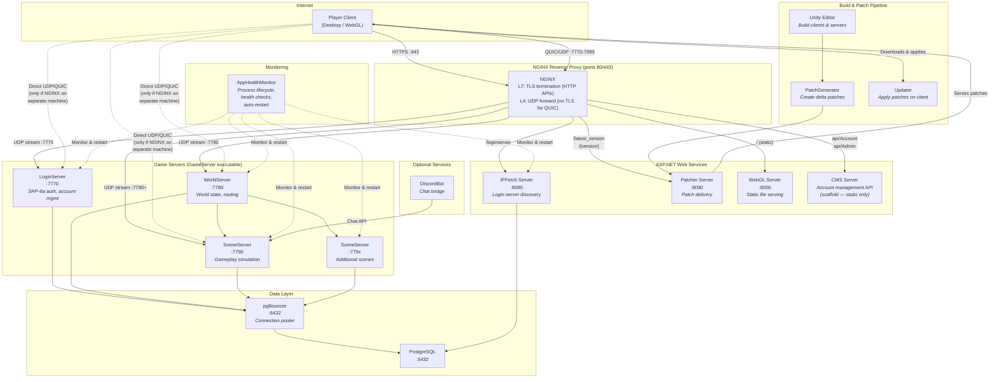

[](https://discord.gg/9JQEYjkSNk)
[Join our Discord](https://discord.gg/9JQEYjkSNk)

# FishMMO

A modular, open-source MMO framework built on **Unity 6.3 LTS**, **FishNet**, **QUIC/WebTransport**, and **PostgreSQL**.

---

## Table of Contents

- [Overview](#overview)
- [Supported Platforms](#supported-platforms)
- [Prerequisites](#prerequisites)
- [Installation Guide](#installation-guide)
  - [1. Clone the Repository](#1-clone-the-repository)
  - [2. Build the FishMMO-Installer](#2-build-the-fishmmo-installer)
  - [3. Run the Installer](#3-run-the-installer)
  - [4. Build the WebTransport C++ Library](#4-build-the-webtransport-c-library)
  - [5. Open the Unity Project](#5-open-the-unity-project)
- [Database Setup](#database-setup)
- [Unity Project Setup](#unity-project-setup)
  - [Build World Scene Details](#build-world-scene-details)
  - [Versioning](#versioning)
  - [FishMMO Builds](#fishmmo-builds)
  - [Patching — PatchGenerator and Updater](#patching--patchgenerator-and-updater)
- [Configuration](#configuration)
  - [Constants.cs — Client Domains](#constantscs--client-domains)
  - [Server Configuration Files](#server-configuration-files)
  - [Logging Configuration](#logging-configuration)
  - [Configuration Files — `FishMMO-Setup/`](#configuration-files--fishmmo-setup)
  - [FishMMO-Auth — Signing Keys & KEK](#fishmmo-auth--signing-keys--kek)
- [Infrastructure Setup](#infrastructure-setup)
  - [Configure Unity Hub](#configure-unity-hub)
  - [Configure PostgreSQL](#configure-postgresql)
  - [Configure pgBouncer](#configure-pgbouncer)
  - [Configure NGINX](#configure-nginx)
  - [NGINX Stream Configuration (UDP Game Traffic)](#nginx-stream-configuration-udp-game-traffic)
  - [TLS Certificate Setup for Game Servers](#tls-certificate-setup-for-game-servers)
- [Web Server Configuration](#web-server-configuration)
  - [ClientGate Middleware](#clientgate-middleware)
  - [Web Server Security & Environment Variables](#web-server-security--environment-variables)
- [Running the Servers](#running-the-servers)
  - [Launch Order](#launch-order)
  - [Starting Game Servers](#starting-game-servers)
  - [Starting Web Servers](#starting-web-servers)
  - [Running Multiple Scene Servers](#running-multiple-scene-servers)
- [FishMMO-AppHealthMonitor](#fishmmo-apphealthmonitor)
- [Optional Services](#optional-services)
  - [FishMMO-DiscordBot](#fishmmo-discordbot)
  - [FishMMO-CMS](#fishmmo-cms)
- [Client Setup](#client-setup)
  - [Client Launcher Flow](#client-launcher-flow)
  - [Client TLS Certificate Pinning](#client-tls-certificate-pinning)
- [Production Deployment](#production-deployment)
  - [Linux Config Hardening](#linux-config-hardening)
  - [Firewall Configuration](#firewall-configuration)
  - [Systemd Services](#systemd-services)
  - [Port Reference](#port-reference)
  - [Certbot Deploy Hook (TLS Renewal)](#certbot-deploy-hook-tls-renewal)
- [Architecture](#architecture)
  - [Connection Pipeline](#connection-pipeline)
  - [Server Initialization Order](#server-initialization-order)
  - [Flow Diagram](#flow-diagram)
- [License](#license)

---

## Overview

FishMMO is a complete multiplayer online game framework consisting of:

| Component | Description |
|---|---|
| **FishMMO-Unity** | Unity project containing client, server, and shared game code (970+ C# files) — full prediction pipeline, modular character visuals, threat-based AI, ECA trigger system |
| **FishMMO-Auth** | Transport-agnostic .NET authentication library (SRP-6a, X25519 ECDH, token auth, TOTP 2FA) |
| **FishMMO-Database (FishMMO-DB)** | PostgreSQL data-access layer using Entity Framework Core + Npgsql (41 entities/tables, 42 services) |
| **FishMMO-WebTransport** | C++ native library wrapping MsQuic (QUIC/HTTP3) — P/Invoked from C# as a FishNet transport plugin |
| **FishMMO-Installer** | Cross-platform .NET 8 console tool that automates dependency installation |
| **FishMMO-Dependencies** | Centralised NuGet dependency aggregator (43 packages, netstandard2.1) — copies DLLs to Unity |
| **FishMMO-Logger** | Flexible logging library with file, email, and console backends |
| **FishMMO-SharedUtility** | Pure C# utility library shared between client and server projects |
| **FishMMO-AppHealthMonitor** | Daemon that monitors, auto-restarts, and health-checks server processes |
| **FishMMO-WebServers** | ASP.NET Core 8.0 web services — IPFetch (8080), Patcher (8090), and WebGL static server (8000) |
| **FishMMO-Patcher** | Client-side updater that applies versioned patch files |
| **FishMMO-Setup** | Configuration templates — nginx.conf, server .cfg files, appsettings.json, deploy hooks, stream config generator |
| **FishMMO-DiscordBot** | Discord bot bridging in-game chat with a Discord guild |
| **FishMMO-CMS** | ASP.NET Core 8.0 account-management web API (registration, password/2FA self-service, admin account actions) — **scaffold only, every handler is a TODO stub** |

The server architecture uses three server types:

- **LoginServer** — Handles account creation, SRP-6a authentication, character select, and TOTP 2FA.
- **WorldServer** — Manages world state, character routing, and scene server orchestration.
- **SceneServer** — Runs gameplay simulation for individual world scenes (chat, combat, inventory, guilds, etc.).

All three are launched from a single `GameServer` executable with a command-line argument (`LOGIN`, `WORLD`, or `SCENE`).

### Networking Architecture

FishMMO uses **QUIC/WebTransport** (RFC 9000) as its sole transport protocol — there is no TCP or WebSocket fallback for game traffic:

| Layer | Technology | Purpose |
|---|---|---|
| **Transport** | QUIC (UDP) via MsQuic C++ library | Encrypted, multiplexed transport with 0-RTT support |
| **Reliable Channel** | QUIC bidirectional streams | FishNet Channel 0 (game state, RPCs, broadcasts) |
| **Unreliable Channel** | QUIC DATAGRAM frames (RFC 9221) | FishNet Channel 1 (position updates, snapshots) |
| **WebGL/Browser** | Browser WebTransport API → HTTP/3 | Native browser QUIC without plugin |
| **Reverse Proxy** | NGINX L4 UDP stream + L7 HTTP | L7: TLS termination for HTTP APIs. L4: zero-copy UDP forwarding (no TLS termination for game traffic) |
| **HTTP TLS** | TLS 1.2/1.3 terminated by NGINX | NGINX handles HTTPS for `api.fishmmo.com` and `play.fishmmo.com` |
| **Game TLS** | QUIC/TLS 1.3 terminated by each game server | NGINX **cannot** terminate QUIC TLS — raw UDP packets pass through unmodified. Each game server **must** have certificates configured |

#### Default Architecture: Loopback + NGINX Reverse Proxy

All backend servers (LoginServer, WorldServer, SceneServer, IPFetch, Patcher, WebGL) are configured to **bind to `127.0.0.1` (loopback) by default**. NGINX acts as the sole public-facing reverse proxy, forwarding traffic to these loopback-bound upstream servers. This is a deliberate security posture:

- **Backend servers are never directly exposed to the internet** — only NGINX ports 80 and 443 (and UDP 7770-7999 via the stream module) are public.
- **NGINX handles TLS for HTTP APIs** (api.fishmmo.com, play.fishmmo.com) at Layer 7.
- **NGINX does NOT terminate TLS for game traffic.** QUIC/WebTransport uses UDP at Layer 4 — NGINX forwards raw encrypted QUIC packets without inspecting them. Each game server **must** have valid TLS certificates configured in its `.cfg` file (`CertificatePath`/`PrivateKeyPath`) because it terminates its own QUIC/TLS session. There is no way for NGINX to do this on the game server's behalf.
- **The real client IP is recovered via a one-time connection token** from the HTTP API, since game servers only see NGINX's loopback address.

**When to bind to `0.0.0.0` or a specific IP:** Only when a backend server runs on a **different machine** than NGINX. In that case, change the `Address` in the server's `.cfg` file (or the `BACKEND_IP` env var for stream config generation) to the server's network-facing IP, and ensure NGINX's `proxy_pass` targets that IP instead of `127.0.0.1`.

For the complete end-to-end connection flow, see [CONNECTION_PIPELINE.md](CONNECTION_PIPELINE.md). For server startup, see [SERVER_INITIALIZATION_ORDER.md](SERVER_INITIALIZATION_ORDER.md).

---

## Supported Platforms

| Platform | Client | Server |
|---|---|---|
| Windows 10/11 | Yes | Yes |
| Linux (Ubuntu/Debian, Arch/CachyOS) | Yes | Yes |
| macOS | Yes | Yes |
| WebGL | Yes (via browser WebTransport) | N/A |

| Requirement | Version |
|---|---|
| Unity | 6.3 LTS (6000.3.2f1) |
| .NET SDK | 8.0+ |
| PostgreSQL | 14+ |
| CMake | 3.20+ (for WebTransport C++ library) |
| C++ Compiler | GCC 9+/Clang 10+/MSVC 2022+ (C11/C++17) |
| Scripting Backend | IL2CPP |

---

## Prerequisites

- **Git** for cloning the repository
- **.NET 8.0 SDK**
- **Unity Hub** with **Unity 6.3 LTS** (the installer can install these for you)
- **CMake 3.20+** and a C++17 compiler (for building the WebTransport native library)
- **OpenSSL 3+** development headers (libssl-dev / openssl-devel)
- **PostgreSQL 14+** (the installer can install this for you)
- Administrator/root privileges for system-level installs
- Internet connectivity

> **Note:** The C++ WebTransport library links statically against msquic (fetched automatically by CMake), so you do **not** need to install msquic separately. OpenSSL is the only system-level dependency needed beyond a C++ compiler.

---

## Installation Guide

### 1. Clone the Repository

```bash
git clone https://github.com/jimdroberts/FishMMO.git
cd FishMMO
```

> **Tip:** Use the `dev` branch if it is more up-to-date than `main`:
> ```bash
> git checkout dev
> ```

### 2. Build the FishMMO-Installer

The **FishMMO-Installer** is the recommended way to set up all dependencies. It automates installing .NET, PostgreSQL, NGINX, PgBouncer, Unity Hub, building all C# projects, and setting up the database.

```bash
cd FishMMO-Installer
dotnet build
dotnet run --project FishMMO-Installer
```

Or run the compiled binary directly:
- **Windows:** `FishMMO-Installer\bin\Debug\net8.0\FishMMO-Installer.exe`
- **Linux:** `./FishMMO-Installer/bin/Debug/net8.0/FishMMO-Installer`

> **Windows:** Run from an elevated PowerShell (Administrator) for system-level installs.
> **Linux:** You will be prompted for `sudo` when needed.

### 3. Run the Installer

The installer supports two modes: **interactive menu** (default) and **CLI-driven** (for headless/automated deployment).

#### Interactive Menu Mode (default)

Run with no arguments to enter the menu:

```
=== FishMMO Installer ===
1 : Runtime & Tooling     — .NET EF Tool, ASP.NET Runtime, VS Build Tools
2 : Database              — PostgreSQL, PgBouncer, DB management
3 : Web Server            — NGINX, Let's Encrypt SSL, Firewall, Services
4 : Unity & Build         — Unity Hub, Unity Editor, C# project builds
5 : Configuration         — appsettings.json setup
0 : Quit
```

#### Sub-Menu: Runtime & Tooling

```
1 : Install DotNet EF Tool (dotnet-ef)
2 : Install ASP.NET Runtime
3 : Install Visual Studio Build Tools (Windows Only)
0 : Back
```

#### Sub-Menu: Database

```
1 : Configure Database Secrets (DB credentials — username, password, host)
2 : Install PostgreSQL
3 : Install PgBouncer (Connection Pooler)
4 : Install FishMMO Database (User/Schema/Initial Migration)
5 : Create New Database Migration
6 : Grant User Permissions on Database
7 : Delete FishMMO Database (DANGEROUS!)
8 : Configure PgBouncer (generate pgbouncer.ini + userlist.txt, Linux)
9 : Configure Server Keys (gate secret, HMAC key, KEK → database)
0 : Back
```

#### Sub-Menu: Web Server

```
1 : Install NGINX (Web Server/Reverse Proxy)
2 : Install/Renew Let's Encrypt Certificate (NGINX)
3 : Deploy FishMMO nginx.conf (from FishMMO-Setup/)
4 : Configure Firewall Rules (open ports 80, 443)
5 : Register FishMMO Web Servers as Services (systemd / NSSM)
0 : Back
```

#### Sub-Menu: Unity & Build

```
1 : Install Unity Hub
2 : Install Unity Editor (+Modules)
3 : Build all C# Projects
4 : Build FishMMO-Unity (Client/Server/Addressables)
0 : Back
```

#### Sub-Menu: Configuration

```
1 : Configure appsettings.json (web servers — IPFetch, Patcher, WebGL)
2 : Configure Discord Bot
3 : Configure CMS
0 : Back
```

#### CLI / Non-Interactive Mode

For headless servers and CI/CD pipelines, use CLI arguments:

```bash
# Show help
FishMMO-Installer --help

# Show version
FishMMO-Installer --version

# Install a single component
FishMMO-Installer --component postgresql

# Run health checks on all installed components
FishMMO-Installer --validate

# Simulate without making changes
FishMMO-Installer --dry-run --component nginx

# Unattended installation from a config file (-f is an alias for --config)
FishMMO-Installer --non-interactive -f install-config.json

# Unattended install using the bundled quickstart template
FishMMO-Installer --quickstart

# Other flags
FishMMO-Installer --list-components          # Print component names and exit
FishMMO-Installer --accept-defaults          # (-y / --yes) Skip confirmation prompts
FishMMO-Installer --generate-checksums       # Generate SHA256 hashes for downloaded files
FishMMO-Installer --log-file /path/to.log    # Tee log output to a file
```

**`install-config.json` format:**

```json
{
  "components": ["dotnet-sdk", "postgresql", "nginx", "firewall", "systemd-services"],
  "configureFirewall": true,
  "firewallPorts": [80, 443],
  "registerSystemdServices": true,
  "validateAfterInstall": true
}
```

**Available component names for CLI use** (`--list-components` prints this list):
`dotnet-ef`, `aspnet-runtime`, `vs-build-tools`, `postgresql`, `pgbouncer`, `fishmmo-db`, `nginx`, `letsencrypt`, `unity-hub`, `unity-editor`, `build-projects`, `build-unity`, `appsettings`, `create-migration`, `firewall`, `systemd-services`, `all`

> **Pre-flight checks** automatically run before any CLI-mode installation, verifying internet connectivity, disk space, memory, admin/sudo access, and port conflicts.

> **Download integrity:** Downloaded files are verified against SHA256 checksums in `checksums.json`. Corrupt or tampered downloads are rejected.

#### Pre-built Install Config Templates

`FishMMO-Setup/Development/` includes three ready-to-use install configs:

| Template | Purpose |
|---|---|
| `install-config.quickstart.json` | Minimal dev setup (postgresql, fishmmo-db, nginx, firewall) |
| `install-config.web.json` | Web server setup (postgresql, fishmmo-db, nginx, letsencrypt, firewall, systemd-services) |
| `install-config.full.json` | Complete production setup (all components including UDP game port firewall rules) |

The full template maps to:
```json
{
  "components": ["dotnet-ef", "aspnet-runtime", "postgresql", "pgbouncer",
    "fishmmo-db", "nginx", "letsencrypt", "firewall", "systemd-services", "appsettings"],
  "configureFirewall": true,
  "firewallPorts": [80, 443, "7770-7999/udp"],
  "registerSystemdServices": true,
  "webServers": ["ipfetch", "patcher", "webgl"],
  "validateAfterInstall": true
}
```

#### Recommended Installation Order (Fresh Setup)

| Step | Menu | Action | Windows | Linux |
|---|---|---|---|---|
| 1 | Runtime & Tooling | Install DotNet EF Tool | Yes | Yes |
| 2 | Runtime & Tooling | Install ASP.NET Runtime | Yes | Yes |
| 3 | Runtime & Tooling | Install VS Build Tools | Yes | *(skip)* |
| 4 | Unity & Build | Build all C# Projects | Yes | Yes |
| 5 | Unity & Build | Install Unity Hub | Yes | Yes |
| 6 | Unity & Build | Install Unity Editor (+Modules) | Yes | Yes |
| 7 | Database | Configure Database Secrets (DB credentials) | Yes | Yes |
| 8 | Database | Install PostgreSQL | Yes | Yes |
| 9 | Database | Install FishMMO Database | Yes | Yes |
| 10 | Database | Install PgBouncer | Yes | Yes |
| 11 | Database | Configure PgBouncer | *(manual)* | Yes |
| 12 | Database | **Configure Server Keys** (REQUIRED) | Yes | Yes |
| 13 | Web Server | Install NGINX | Yes | Yes |
| 14 | Web Server | Deploy FishMMO nginx.conf | Yes | Yes |
| 15 | Web Server | Configure Firewall Rules | Yes | Yes |
| 16 | Web Server | Install/Renew Let's Encrypt Certificate | Optional | Optional |
| 17 | Web Server | Register FishMMO Web Services | Optional | Yes |
| 18 | Configuration | Configure appsettings.json (web servers) | Yes | Yes |

> **"Configure Server Keys" (step 12) is required.** Without the gate secret, KEK, and connection token HMAC key in the database, game servers and web servers will refuse to start. This step runs `SecurityKeyInstaller` which generates all three keys and stores them in the `deployment_secrets` and `connection_token_keys` tables.
>
> **After the Installer, open Unity and run these Editor tools** (see [Unity Project Setup](#unity-project-setup)):
> - **FishMMO Dashboard → Game Settings → Client Secret** — pulls the gate secret from the database and writes `ClientApiSecret.generated.cs`
> - **FishMMO Dashboard → Game Settings → Certificate Pins** — connects to your live hosts and writes `CertificatePins.generated.cs`
>
> **"Build all C# Projects"** discovers and builds all `.csproj` files under the repository root, including:
> - `FishMMO-Dependencies` — resolves 43 NuGet packages and copies their DLLs into `FishMMO-Unity/Assets/Dependencies/`
> - `FishMMO-Auth` — authentication library (copies DLL to Unity Dependencies)
> - `FishMMO-Database/FishMMO-DB` — database library
> - `FishMMO-Logger` — logging library (copies DLL to Unity Dependencies)
> - `FishMMO-SharedUtility` — shared utility library (copies DLL to Unity Dependencies)
> - `FishMMO-WebServers/IPFetchASP.NET` — login server discovery API
> - `FishMMO-WebServers/PatcherASP.NET` — patch delivery server
> - `FishMMO-WebServers/WebGLServerASP.NET` — WebGL static file server
> - `FishMMO-AppHealthMonitor` — server health monitor daemon
> - `FishMMO-DiscordBot` — Discord chat bridge bot
> - `FishMMO-CMS` — account-management web API (scaffold)

### 4. Build the WebTransport C++ Library

The WebTransport native library (`libfishmmo_webtransport`) is a C++ shared library that wraps Microsoft's [MsQuic](https://github.com/microsoft/msquic) QUIC implementation. It is P/Invoked from C# as FishNet's transport plugin. **This must be built before running the game server** — the Unity project expects the native binary at `Assets/Plugins/FishNet/Plugins/WebTransport/Plugins/{platform}/`.

#### Linux (Native Build)

**Prerequisites:**
```bash
# Arch / CachyOS
sudo pacman -S cmake openssl gcc

# Ubuntu / Debian
sudo apt-get install cmake libssl-dev build-essential

# Fedora
sudo dnf install cmake openssl-devel gcc-c++
```

**Build:**
```bash
cd FishMMO-WebTransport
./build_linux.sh
```

**Output:** `libfishmmo_webtransport.so` placed directly into `../FishMMO-Unity/Assets/Plugins/FishNet/Plugins/WebTransport/Plugins/linux_x86_64/`

> **The Linux binary is committed to the repository.** If you're deploying on Linux, you can skip this build step. Windows and macOS binaries must be built on their respective platforms.

#### Windows (Native Build)

**Prerequisites:**
- Visual Studio 2022 with C++ workload
- CMake 3.20+ (`winget install Kitware.CMake`)
- OpenSSL (`vcpkg install openssl:x64-windows`)

**Build:**
```powershell
cd FishMMO-WebTransport
.\build_windows.ps1
```

**Output:** `fishmmo_webtransport.dll` in `.../Plugins/windows_x86_64/` (msquic is statically linked — no separate `msquic.dll` needed)

#### Windows Cross-Compile from Linux (Zig)

If you develop on Linux but need a Windows `.dll` for client builds:

**Prerequisites:**
```bash
# Arch / CachyOS
sudo pacman -S zig
# Or download from https://ziglang.org/download/
```

**Build:**
```bash
cd FishMMO-WebTransport
./build_windows_cross.sh
```

This script:
1. Downloads the msquic NuGet package (`Microsoft.Native.Quic.MsQuic.Schannel/2.5.9`)
2. Extracts headers and DLL from the NuGet package
3. Compiles all `.cpp` files with `zig c++ -target x86_64-windows-gnu`
4. Links into a DLL importing `msquic.dll`
5. Copies both `fishmmo_webtransport.dll` and `msquic.dll` to the Unity plugins directory (cross-compile requires `msquic.dll` alongside the main DLL — unlike native VS builds where msquic is statically linked)

#### macOS (Native Build)

Must be built on a Mac:
```bash
brew install cmake openssl@3
cd FishMMO-WebTransport
./build_macos.sh
```

**Output:** `libfishmmo_webtransport.dylib` in `.../Plugins/mac_x86_64/`

#### What CMake Does

The `CMakeLists.txt`:
- Fetches msquic v2.5.9 from GitHub (`FetchContent`) and statically links it
- Uses `quictls` (OpenSSL fork) as msquic's TLS backend
- Finds system OpenSSL for the wrapper library's own TLS needs
- Compiles 7 `.cpp` source files (server, client, session, stream_manager, datagram_queue, http3, webtransport_api)
- Outputs the shared library directly to the Unity project's Plugins directory

#### Build Options

| CMake Option | Default | Description |
|---|---|---|
| `BUILD_SHARED_LIBS` | ON | Build as shared library (`.so`/`.dylib`/`.dll`) |
| `WT_STATIC_MSQUIC` | ON | Statically link msquic (recommended) |
| `WT_BUILD_TESTS` | OFF | Build test programs |

### 5. Open the Unity Project

After building all C# projects and the WebTransport native library, open the Unity project:

1. Open **Unity Hub**
2. Click **ADD** → Select the `FishMMO-Unity` directory
3. Open the project with **Unity 6.3 LTS**
4. Wait for the initial asset import and script compilation to complete
5. Follow the [Unity Project Setup](#unity-project-setup) section below

---

## Database Setup

The FishMMO-Installer automates database creation (Database menu, option `4` — *Install FishMMO Database*), but here is what happens under the hood:

1. **PostgreSQL Installation** — The installer installs PostgreSQL via your platform's package manager (option `2`).
2. **Database + User Creation** — Creates the `fishmmo` database and a dedicated `fishmmo` user role (option `4`).
3. **EF Core Migration** — Creates and applies an initial Entity Framework Core migration (option `4`).
4. **Permissions** — Grants the user full privileges on the `public` schema (options `4` and `6`).

### Manual Database Setup (Without the Installer)

If you prefer to set up the database manually:

```bash
# Linux — become the postgres user
sudo -u postgres psql
```

```sql
CREATE USER fishmmo WITH PASSWORD 'your_secure_password';
CREATE DATABASE fishmmo OWNER fishmmo;
GRANT ALL PRIVILEGES ON DATABASE fishmmo TO fishmmo;
\c fishmmo
GRANT ALL ON SCHEMA public TO fishmmo;
```

Then apply the EF Core migrations:

```bash
cd FishMMO-Database/FishMMO-DB-Migrator
dotnet run
```

### Creating New Migrations

When your data model changes, create a new migration via the Installer (Database menu, option `5` — *Create New Database Migration*) or manually:

```bash
cd FishMMO-Database/FishMMO-DB
dotnet ef migrations add YourMigrationName \
  --startup-project ../FishMMO-DB-Migrator \
  --output-dir ../../Migrations

# The scaffolder writes the model snapshot to the project default rather than
# --output-dir, where the SDK glob also compiles it — move it and remove the folder.
mv Migrations/NpgsqlDbContextModelSnapshot.cs ../../Migrations/
rmdir Migrations

cd ../FishMMO-DB-Migrator
dotnet run
```

Three things about this are not obvious:

- **`--startup-project` is mandatory.** `FishMMO-DB` targets `netstandard2.1`, which has no runtime, so the EF tooling refuses to run against it alone. `FishMMO-DB-Migrator` is the only executable project that references it.
- **Migrations live at the monorepo root**, in `Migrations/`, which is `.gitignore`d and compiled into `FishMMO-DB` via `<Compile Include="..\..\Migrations\*.cs" />`. Hence `--output-dir ../../Migrations` and the snapshot move above.
- **Review the scaffold before running it.** The model currently carries two pre-existing drifts (`character_pet.abilities` and `character_abilities.ability_events` are `text` in the database but `List<int>` in the model) that every new migration re-scaffolds as a destructive `ALTER … TYPE integer[]`. Strip those from `Up` and `Down` unless you are deliberately converting them.

To review the generated SQL without touching a database — `dotnet ef database update` ignores `FISHMMO_CONNECTION_STRING` and resolves the design-time factory, which points at your **live** local database:

```bash
dotnet ef migrations script PreviousMigration YourMigrationName \
  --startup-project ../FishMMO-DB-Migrator --idempotent
```

### Database Configuration

**Environment-based overrides:** The database library supports layered configuration in this priority order:

1. `appsettings.json` (required)
2. `appsettings.{Environment}.json` (optional — e.g., `appsettings.Development.json`)
3. Environment variables (highest priority, use `__` for nesting)

Set the environment via `FISHMMO_ENVIRONMENT` (preferred), `DOTNET_ENVIRONMENT`, or `ASPNETCORE_ENVIRONMENT`.

**Environment variable overrides for database credentials:**

DB credentials are resolved by the `DatabaseSecrets` class, checking environment variables first, then the platform secrets file (`/etc/fishmmo/db-secrets.env` on Linux, `%ProgramData%\FishMMO\db-secrets.env` on Windows):

| Variable | Maps To |
|---|---|
| `FISHMMO_ENVIRONMENT` | Environment name (`Development`, `Production`) |
| `FISHMMO_DB_HOST` | PostgreSQL host |
| `FISHMMO_DB_PORT` | PostgreSQL port |
| `FISHMMO_DB_NAME` | Database name |
| `FISHMMO_DB_USERNAME` | Database user |
| `FISHMMO_DB_PASSWORD` | Database password |

Example (fish shell):

```fish
set -Ux FISHMMO_ENVIRONMENT Production
set -Ux FISHMMO_DB_PASSWORD super_secret
```

Example (bash):

```bash
export FISHMMO_ENVIRONMENT=Production
export FISHMMO_DB_PASSWORD=super_secret
```

---

## Unity Project Setup

### Client Security Setup (REQUIRED before building)

Before building the client, you must generate two security files from within Unity. Both live in the **FishMMO Dashboard → Game Settings** panel (`FishMMO → FishMMO Dashboard`, Ctrl+Shift+D), alongside the Host Configuration and Constants sections.

**1. Client Secret** (Game Settings → *Client Secret* section)
- Reads the gate secret from the `deployment_secrets` database table
- Writes `ClientApiSecret.generated.cs` — the shared secret for `X-FishMMO-Client` HMAC header signing
- Requires database access (uses the same `FISHMMO_DB_*` credentials)
- Run once per deployment or when the gate secret is rotated

**2. Certificate Pins** (Game Settings → *Certificate Pins* section)
- **Fetch Pins** connects to your live hosts over TLS to download leaf certificates; **Write Pins to File** then saves them
- Computes SHA-256 SPKI hashes and writes `CertificatePins.generated.cs`
- Minimum 2 pins (active + backup) required for release builds
- Only hosts serving HTTPS on port 443 work — QUIC-only game hostnames will fail, so pin the API/IPFetch/play hosts
- Run whenever TLS certificates are renewed with new key pairs

> **Without these files, release client builds will fail.** The build validator blocks any build with missing or sentinel-placeholder values. Development builds are exempt.

### Build World Scene Details

This caches important game world details (spawn points, teleporters, boundaries, scene metadata) for both clients and servers. **Run this whenever you add or modify a scene.**

**Unity Menu:** `FishMMO → Rebuild World Scene Details`, or `FishMMO → FishMMO Dashboard` → **World Scene Details** in the World category

This generates `WorldSceneDetailsCache` assets that are loaded at runtime by the WorldServer and SceneServer for scene routing and character placement.

### Versioning

Manage the project's semantic versioning from the **FishMMO Dashboard**.

**Unity Menu:** `FishMMO → FishMMO Dashboard` (Ctrl+Shift+D) → Select **Version** in the Core category

The Version panel provides:

| Control | Effect |
|---|---|
| **Increment Major** | Major++, resets Minor and Patch to 0 |
| **Increment Minor** | Minor++, resets Patch to 0 |
| **Increment Patch** | Patch++ |
| **Pre-Release Tag** | Free-text tag (e.g., `alpha`, `beta`, `rc1`) appended to the version |
| **Reset to 0.0.0** | Resets all version fields to zero (with confirmation) |

The panel also shows the current full version, asset path, and Addressable registration status. The `VersionConfig.asset` is automatically registered as an Addressable under the `Shared_Static_Permanent` group and label. The final version is written to `version.txt` in the build output directory during the build process.

### FishMMO Builds

Use the **FishMMO Dashboard** to configure and execute builds.

**Unity Menu:** `FishMMO → FishMMO Dashboard` (Ctrl+Shift+D) → Select **Build** in the Core category

The Build panel provides:

**Configuration:**
| Setting | Options | Description |
|---|---|---|
| **Build Type** | Server / Client | Selects which executable to build |
| **OS Target** | Windows x64 / Linux x64 / WebGL | Target platform for the build |
| **Environment** | Development / Production | Controls `.cfg` and `appsettings.json` copy source and loopback binding |

**Actions:**
| Button | Description |
|---|---|
| **Apply Platform Settings** | Switches the Unity Editor to the selected build target |
| **Build Addressables** | Builds all Addressable asset bundles required by client and server |
| **Build Game** | Executes the build for the selected Build Type, OS Target, and Environment |
| **Update Linker** | Regenerates the IL2CPP link.xml file |

The Dashboard also shows the current build settings, active build target, and background task progress (compilation, asset import).

**Build Settings via Menu:** Individual build settings can also be changed via `FishMMO → Build → Build Type`, `FishMMO → Build → OS Target`, and `FishMMO → Build → Environment`.

**Build Environments:**

| Environment | Address Binding | Use Case |
|---|---|---|
| **Development** | `127.0.0.1` (loopback) | Local testing — all servers on the same machine |
| **Production** | Configurable via `.cfg` files | Production deployment — default is `127.0.0.1` (behind NGINX); change to server's network IP only if NGINX is on a separate machine |

The build process copies the appropriate `.cfg` and `appsettings.json` files from `FishMMO-Setup/Development/` or `FishMMO-Setup/Production/` into the build output.

> **Important:** Build Addressables first, then build the game. The game build depends on the Addressable bundles produced in the first step.

### Patching — PatchGenerator and Updater

#### PatchGenerator

A custom Unity Editor window for creating delta patches between game builds.

**Unity Menu:** `FishMMO → FishMMO Dashboard` (Ctrl+Shift+D) → Select **Patch Generator** in the Core category

1. Select the **new** and **old** build directories.
2. Configure options, exclusions, and version details.
3. Click **Generate Patch** to create delta files and a manifest.

Patch files are ZIP archives named `<from_version>-<to_version>.zip` (e.g., `1.0.0-1.0.1.zip`). This naming scheme is a contract between the generator, the patcher server's index, the launcher's download path (`Constants.GetPatchFileName`), and the Updater's lookup — changing it requires changing all four.

#### Updater

The FishMMO Updater is a standalone .NET 8 executable that applies **one** patch archive to the client. It is launched automatically by the game launcher.

```
Updater.exe -version=1.0.0 -latestversion=1.0.1 -pid=1234 -exe=FishMMOClient.exe
```

It looks for exactly one archive — `Patches/{version}-{latestversion}.zip`, resolved relative to its own base directory — and applies it. **There is no multi-step chaining**: if the server only publishes `1.0.0-1.0.1` and `1.0.1-1.0.2`, a `1.0.0` client cannot reach `1.0.2` in one run. Publish a direct `1.0.0-1.0.2` patch for every version you intend to support upgrading from.

Behaviour:

| Aspect | Detail |
|---|---|
| **Transaction** | Per-file backup with full rollback on any critical failure; parallel file writes, sequential deletes and moves for finalization |
| **Verification** | SHA-256 hash verification on both sides of each diff |
| **Archive lifecycle** | Deleted after a successful apply; **left in place after a failure** so the same run can be retried without re-downloading |
| **Exit code** | **Always 0.** Failure is not signalled via exit code — by the time the Updater finishes, the launcher it was reporting to has already been killed by PID. Read its console output for the result |
| **Launcher shutdown** | `Process.CloseMainWindow()` on Windows; on Linux/macOS the Updater P/Invokes `kill(pid, SIGTERM)` from `libc`, because `CloseMainWindow` is Windows-only. A forced kill follows if the graceful request is not honoured |
| **Restart** | The client executable named by `-exe` is started again on every exit path, patched or not |

> The `Patches` directory name is a three-way contract: the Unity client resolves it via `Constants.Configuration.PatchesDirectoryName` / `Constants.GetPatchesDirectory()`, the standalone Updater hard-codes `"Patches"` (it cannot reference the Unity assembly), and the patch server reads it from `Patches:DirectoryName` in `appsettings.Patcher.json`. Change one, change all three.

#### Patch Server

Build the **PatcherASP.NET** web server and place your generated patch `.zip` files in the directory named by `Patches:DirectoryName` (default `Patches`, resolved **relative to the application base directory** — the server refuses to start if it resolves outside). The files are indexed and hashed at startup, and only indexed files are reachable — no caller-controlled string is ever concatenated into a filesystem path.

| Route | Behaviour |
|---|---|
| `GET`/`HEAD /latest_version` | `{ latest_version }` |
| `GET`/`HEAD /latest_version?from={clientVersion}` | `{ latest_version, up_to_date: true }` when the client is current; `{ latest_version, patch_available: false }` when no indexed patch upgrades that version; otherwise `{ latest_version, patch_available: true, sha256, size }` so the launcher can verify the download |
| `GET /{version}` | Streams `{version}-{latest}.zip` as `application/octet-stream` (range requests enabled, rate-limited by the `PatchDownload` policy). Returns **204 No Content** when the client is already current, and **404** when no patch path exists from that version |

Both `/latest_version` forms send a weak `ETag`, `Cache-Control: public, max-age=30`, and an `X-FishMMO-Version-Signature` HMAC over the manifest (signed with the shared gate secret, so a spoofed origin cannot forge a version answer). A matching `If-None-Match` short-circuits to `304`. Download responses carry `X-Patch-Sha256`, `X-Patch-Size`, a strong `ETag`, and `Cache-Control: public, max-age=3600, immutable`.

---

## Configuration

### Constants.cs — Client Domains

The file [`FishMMO-Unity/Assets/Scripts/Shared/Implementation/Constants.cs`](FishMMO-Unity/Assets/Scripts/Shared/Implementation/Constants.cs) contains domain endpoints used by the client to connect to your infrastructure.

These values are **not literals in `Constants.cs`** — each one reads from `GeneratedHostConfig`, an IL-embedded generated class whose real values are substituted at build time by CI or the FishMMO-Installer. The committed sentinel values are intentionally invalid, and the build validator blocks release builds that still contain them.

```csharp
public static class Configuration
{
    /// Unified API Host URL. NGINX routes to the correct backend by path.
    public static readonly string APIHost = GeneratedHostConfig.ApiHost;

    /// Game server hostname. Clients connect to this host via QUIC/WebTransport (UDP).
    /// NGINX forwards game traffic at Layer 4 to loopback-bound game servers.
    public static readonly string GameHost = GeneratedHostConfig.GameHost;

    /// Launcher HTML/news page URL.
    public static readonly string LauncherHtmlUrl = GeneratedHostConfig.LauncherHtmlUrl;
}
```

| Field | `GeneratedHostConfig` source | Purpose |
|---|---|---|
| `APIHost` | `ApiHost` (CI: `FISHMMO_API_HOST`) | Base URL for IPFetch and Patcher API calls — NGINX reverse-proxies to loopback web servers |
| `GameHost` | `GameHost` (CI: `FISHMMO_GAME_HOST`) | Hostname for game QUIC/WebTransport connections — NGINX forwards UDP to loopback game servers |
| `LauncherHtmlUrl` | `LauncherHtmlUrl` (CI: `FISHMMO_ROOT_DOMAIN`) | Page the launcher fetches its news panel from |
| `SmtpFromAddress` / `SmtpFromName` | `SmtpFromAddress` / `SmtpFromName` | From-address and display name for verification emails |

Write these values from the Unity Editor via **FishMMO Dashboard → Game Settings**, which regenerates `HostConfig.generated.cs`. `GeneratedHostConfig` also carries `PlayHost` (WebGL/player-facing hostname) and `RootDomain` (TLS certs and email).

> For local development, point the hosts at `https://localhost/` and `localhost`, or configure your hosts file. Prefer the `GlobalSettings` override mechanism (see `ApiHostResolver`) over editing generated constants for one-off testing. When running without NGINX, set `APIHost` to your web server's address directly and `GameHost` to the game server's address.

### Server Configuration Files

Each server type reads a `.cfg` file from its working directory. Templates are in `FishMMO-Setup/Development/` and `FishMMO-Setup/Production/`.

> Only the templates under `FishMMO-Setup/` are tracked. The `.cfg` files a server actually reads are per-deployment copies and are gitignored, so edits to them never reach source control — change the template, not the copy. In the Editor, `Constants.GetWorkingDirectory()` resolves to the repository root, so running a server from Play Mode drops `LoginServer.cfg`, `WorldServer.cfg`, and `SceneServer.cfg` there; the root `.gitignore` excludes those three paths by name. Runtime `appsettings.json` for the web servers is copied to `$(OutDir)` / `$(PublishDir)`, both under `bin/`, which the general `[Bb]in/` rule already covers.

#### LoginServer.cfg

```ini
ServerName=LoginServer
MaximumClients=4000
Address=127.0.0.1
Port=7770
StaleSceneTimeout=5
CertificatePath=/etc/fishmmo/certs/fullchain.pem
PrivateKeyPath=/etc/fishmmo/certs/privkey.pem
```

#### WorldServer.cfg

```ini
ServerName=World Server
MaximumClients=4000
Address=127.0.0.1
Port=7780
StaleSceneTimeout=5
CertificatePath=/etc/fishmmo/certs/fullchain.pem
PrivateKeyPath=/etc/fishmmo/certs/privkey.pem
```

#### SceneServer.cfg

```ini
ServerName=Scene Server
MaximumClients=4000
Address=127.0.0.1
Port=7790
StaleSceneTimeout=5
StaleInstanceSceneTimeout=2
CertificatePath=/etc/fishmmo/certs/fullchain.pem
PrivateKeyPath=/etc/fishmmo/certs/privkey.pem
```

| Key | Description | Default |
|---|---|---|
| `ServerName` | Display name for logs and monitoring | varies |
| `MaximumClients` | Maximum concurrent connections | 4000 |
| `Address` | Bind address — `127.0.0.1` when behind NGINX (default); set to the server's network IP only if NGINX runs on a different machine | `127.0.0.1` |
| `Port` | Listen port (Login=7770, World=7780, Scene=7790+) | varies |
| `StaleSceneTimeout` | **Minutes** an empty **open-world** scene instance stays loaded before it is unloaded and its scene row deleted. SceneServer only. The templates ship `5`; the code's fallback when the key is missing is `60` | 5 |
| `StaleInstanceSceneTimeout` | **Minutes** an empty **Group/PvP (instanced)** scene stays loaded. Deliberately shorter than `StaleSceneTimeout`: a dungeon instance belongs to one character or party, so once it empties it is unlikely to be wanted again, while each one holds a full physics scene. Long enough to survive a wipe-and-run-back or a relog. SceneServer only; the code's fallback is `5` | 2 |
| `CertificatePath` | PEM certificate for QUIC/TLS (game servers terminate their own TLS) | platform-dependent |
| `PrivateKeyPath` | PEM private key for QUIC/TLS | platform-dependent |
| `ConnectionTokenHmacKeyBase64` | **Leave empty.** Loaded at runtime from the `connection_token_keys` database table | empty |
| `AutoVerifyAccounts` | LoginServer only — skip email verification at account creation and at login (Development builds only, never in Production) | `true` (Dev) / `false` (Prod) |
| `AllowedOrigins` | LoginServer only — comma-separated CORS origins permitted for WebGL clients | `https://play.fishmmo.com` |
| `Smtp:Host` / `Smtp:Port` / `Smtp:Username` / `Smtp:Password` / `Smtp:FromAddress` / `Smtp:FromName` / `Smtp:UseSsl` | LoginServer only — verification-email relay. Port 465 = implicit TLS (`UseSsl=true`); port 587 = STARTTLS (`UseSsl=false`) | `localhost` / `465` / — / — / `noreply@fishmmo.com` / `FishMMO` / `true` |
| `LoginQueueUpdateRateSeconds` | LoginServer only — how often queued clients receive position updates | `2.0` |
| `LoginQueueMaxSize` | LoginServer only — queue capacity; excess clients are rejected outright | `500` |
| `LoginQueueAdmissionRatePerSecond` | LoginServer only — admission rate from the queue | `5.0` |
| `LoginQueueTimeoutSeconds` | LoginServer only — maximum wait before a queued client is timed out | `300` |

**Format:** Simple `key=value` per line. Lines starting with `#` or `;` are comments. The SMTP settings can be overridden via `FISHMMO_SMTP_HOST`, `FISHMMO_SMTP_PORT`, `FISHMMO_SMTP_USERNAME`, `FISHMMO_SMTP_PASSWORD`, `FISHMMO_SMTP_FROM_ADDRESS`, `FISHMMO_SMTP_FROM_NAME`, and `FISHMMO_SMTP_USE_SSL`.

> **IPv6 is not supported at the native QUIC layer.** The `EnableIPv6` and `IPv6Address` keys appear commented out in the templates and are reserved for future implementation — IPv6 clients must reach the servers through an IPv6-enabled NGINX L4 proxy.

> The Production login-queue defaults (`500` / `5.0` / `300`) are conservative, sized for roughly 500 concurrent players. The template's own tuning note suggests `1000–8000`, `10–20/s`, and `120–600s` for a launch-scale deployment.

> **Certificate paths are required on every game server.** `CertificatePath` and `PrivateKeyPath` must point to valid PEM files on each server. NGINX cannot terminate QUIC TLS — it only forwards raw UDP. If certificates are missing, the server will fail to start or clients will be unable to connect. See [TLS Certificate Setup for Game Servers](#tls-certificate-setup-for-game-servers).

> **Production:** Edit the `Production/` templates before building. Each SceneServer needs a unique port if running multiple instances (e.g., 7790, 7791, 7792...).

> **About the bind address:** All server `.cfg` templates default to `Address=127.0.0.1` — servers listen on loopback and NGINX forwards public traffic to them via `proxy_pass`. This keeps backend servers off the public network. Only change `Address` if the server runs on a different machine than NGINX; in that case, set it to the machine's network-facing IP and update the corresponding NGINX upstream or stream config to point to that IP.

#### Platform-Specific Certificate Paths

| Platform | Default Certificate Path |
|---|---|
| Linux | `/etc/fishmmo/certs/fullchain.pem` |
| Windows | `C:\ProgramData\FishMMO\certs\fullchain.pem` |
| macOS | `/usr/local/share/fishmmo/certs/fullchain.pem` |
| Other | `certs/fullchain.pem` (relative to working directory) |

### Logging Configuration

All projects share a single canonical `logging.json` at [`FishMMO-Setup/logging.json`](FishMMO-Setup/logging.json). Each project's build copies it into the output directory automatically — operators only need to edit the one source file.

```json
{
  "LoggingManager": {
    "ConsoleAllowedLevels": ["Info", "Warning", "Error", "Critical", "Debug"]
  },
  "Loggers": []
}
```

**Log levels:** `Verbose`, `Debug`, `Info`, `Warning`, `Error`, `Critical`.

**Adding file logging** (edit `FishMMO-Setup/logging.json`):

```json
{
  "LoggingManager": {
    "ConsoleAllowedLevels": ["Info", "Warning", "Error", "Critical"]
  },
  "Loggers": [
    {
      "Type": "FileLoggerConfig",
      "LoggerType": "FileLogger",
      "Enabled": true,
      "AllowedLevels": ["Info", "Warning", "Error", "Critical", "Debug"],
      "LogDirectory": "logs",
      "FileName": "server.log"
    }
  ]
}
```

**Adding email alerts** (append to the `Loggers` array):

```json
{
  "Type": "EmailLoggerConfig",
  "LoggerType": "EmailLogger",
  "Enabled": true,
  "AllowedLevels": ["Error", "Critical"],
  "SmtpServer": "smtp.example.com",
  "Port": 587,
  "EnableSsl": true,
  "Username": "alerts@example.com",
  "Password": "********",
  "From": "alerts@example.com",
  "To": "ops@example.com",
  "Subject": "FishMMO Alert"
}
```

> **Security:** Keep SMTP credentials out of source control. Load them via environment variables (e.g., `FISHMMO_SMTP_PASSWORD`). Application secrets (gate secret, KEK, connection token HMAC key) are stored in the database — see [FishMMO-Auth — Signing Keys & KEK](#fishmmo-auth--signing-keys--kek). See [FishMMO-Logger README](FishMMO-Logger/README.md) for full configuration details.

**Runtime override:** Place a modified `logging.json` in the working directory — it takes precedence over the bundled copy. The log level can also be overridden via the `FISHMMO_LOG_LEVEL` environment variable (e.g. `Debug`, `Verbose`).

**Level policy (why it is a data-handling decision, not just noise control):** `Warning` and
above are the tiers that get shipped off-host, aggregated and retained longest. Two rules follow
for server code, and both have been violated in this codebase before:

- *A healthy path never logs above `Debug`.* Every Login→World and World→Scene hop mints a
  connection token; logging the **successful** mint at `Warning` produced one line per hop on a
  busy server and buried the failures the tier exists for.
- *Per-player identifiers do not travel with success.* That same line named the client's
  resolved real IP, putting one player-attributable record into a widely-retained tier on every
  zone change, for no diagnostic gain — the failure branch already identifies the connection
  that could not be served.

Failures keep their `Warning`/`Error` level and their identifying detail. See
[Security Properties](CONNECTION_PIPELINE.md#security-properties).

### Configuration Files — `FishMMO-Setup/`

All project configuration lives in [`FishMMO-Setup/`](FishMMO-Setup/) as the single source of truth. **Non-sensitive defaults (host, port, database name) are stored in JSON. Database credentials are set via environment variables (`FISHMMO_DB_*`) or the platform secrets file (`/etc/fishmmo/db-secrets.env`). Application secrets (gate secret, KEK, connection token HMAC key) are stored in the database and loaded by each server at startup — no env vars or secrets files are needed for them.** Each template includes a `_comment` field listing the env var names to set.

**Directory structure:**

```
FishMMO-Setup/
├── logging.json                              # Shared logging — all projects
├── nginx.conf                                # NGINX reverse-proxy config (L4 UDP + L7 HTTP)
├── Development/                              # Dev / local configurations
│   ├── .env.example                          # Template for FISHMMO_* environment variables
│   ├── appsettings.json                      # Unity server Npgsql (dev)
│   ├── appsettings.AppHealthMonitor.json      # Process supervisor config
│   ├── appsettings.DiscordBot.json           # Discord token + Npgsql
│   ├── appsettings.IpFetchServer.json        # IP-fetch web server base
│   ├── appsettings.IpFetchServer.Development.json  # Dev overrides (DB connection string)
│   ├── appsettings.Patcher.json              # Patch delivery web server
│   ├── appsettings.WebGLServer.json          # Static asset web server
│   ├── appsettings.CMS.json                  # CMS web app
│   ├── appsettings.Database.json             # Npgsql pool / retry template
│   ├── install-config.full.json              # Full production install template
│   ├── install-config.quickstart.json         # Minimal dev install template
│   ├── install-config.web.json               # Web server install template
│   ├── LoginServer.cfg / WorldServer.cfg / SceneServer.cfg
├── Production/                                # Production configurations
│   ├── README.md                             # Production deployment notes
│   ├── appsettings.json                      # Unity server Npgsql
│   ├── appsettings.AppHealthMonitor.json      # Process supervisor config
│   ├── appsettings.DiscordBot.json           # Discord token + Npgsql
│   ├── appsettings.IpFetchServer.Production.json  # Prod overrides (empty — must set env vars)
│   ├── appsettings.Patcher.json              # Patch delivery web server
│   ├── appsettings.WebGLServer.json          # Static asset web server
│   ├── appsettings.CMS.json                  # CMS web app
│   ├── LoginServer.cfg / WorldServer.cfg / SceneServer.cfg
```

> **Not in this repository:** `nginx.conf` and the deployment docs below also reference two operator-supplied shell scripts — `gen-fishmmo-stream-config.sh` (NGINX UDP stream config generator) and the certbot deploy hook `certbot-fishmmo.sh`. Neither is shipped here; the documented behaviour is the contract they must satisfy.

**How it works:** Each project's `.csproj` copies the appropriate file from `FishMMO-Setup/` into its build output directory, renaming it to `appsettings.json` (or `logging.json`). At runtime, applications resolve config with a **working-directory-first** pattern: if a modified file exists in the working directory, it overrides the bundled copy. Environment variables (prefixed `FISHMMO_` or using `__` separator) provide the highest-priority overrides.

**Unity Npgsql example** ([`Development/appsettings.json`](FishMMO-Setup/Development/appsettings.json)):

```json
{
  "_comment": "Non-sensitive defaults only. Username and Password are resolved from FISHMMO_DB_USERNAME / FISHMMO_DB_PASSWORD env vars or /etc/fishmmo/db-secrets.env (chmod 600). NEVER put credentials in this file.",
  "Npgsql": {
    "Database": "fishmmo",
    "Host": "127.0.0.1",
    "Port": "5432"
  }
}
```

**Production Npgsql example** ([`Production/appsettings.json`](FishMMO-Setup/Production/appsettings.json)):

```json
{
  "_comment": "Non-sensitive defaults only. Username and Password are resolved from FISHMMO_DB_USERNAME / FISHMMO_DB_PASSWORD env vars or /etc/fishmmo/db-secrets.env (chmod 600). NEVER put credentials in this file.",
  "Npgsql": {
    "Database": "fishmmo",
    "Host": "127.0.0.1",
    "Port": "5432"
  }
}
```

If using PgBouncer, change `Npgsql.Port` to `6432` (see [Configure pgBouncer](#configure-pgbouncer)).

**Database pool and retry configuration** ([`Development/appsettings.Database.json`](FishMMO-Setup/Development/appsettings.Database.json)) — sets `CommandTimeout: 10`, `ConnectionTimeout: 15`, `MinPoolSize: 5`, `MaxPoolSize: 100`, Npgsql retry policy (3 retries, 20ms base, 10ms jitter), optional query performance tracking, and `ConnectionPoolHealth` thresholds (warn at 70%, critical at 85%, checked every 60s).

> **Security:** Never commit `appsettings.json` with real passwords. Use environment variables for secrets in production (see [Database Setup](#database-setup) for environment variable override syntax).

### FishMMO-Auth — Signing Keys & KEK

The authentication system uses HMAC-SHA256 for token signing. In production, signing keys are wrapped with an AES-256 Key Encryption Key (KEK).

#### Setting the KEK

The KEK is stored in the `deployment_secrets` database table under the key `signing_key_kek`. It is generated and stored by the FishMMO-Installer's **SecurityKeyInstaller**:

```bash
# From the Installer interactive menu:
# Database > Configure Server Keys

# Or via CLI — the argument is a comma-separated list of region IDs;
# each region gets its own keyId + HMAC key pair:
FishMMO-Installer --configure-server-secrets default
```

> The CLI form needs the PostgreSQL superuser password: supply it via `FISHMMO_PG_SUPERUSER_PASSWORD` or answer the prompt.

All game servers load the KEK from the database at startup via `IDeploymentSecretService`. No environment variable or secrets file is needed to distribute the KEK between machines.

#### How It Works

1. The LoginServer generates a fresh HMAC-SHA256 signing key at startup.
2. The key is wrapped using AES-256-GCM with the KEK and an AAD bound to the LoginServer's database ID.
3. The wrapped key envelope is stored in the database.
4. World/Scene servers fetch and unwrap the signing key to validate client tokens.
5. Keys are rotated each time the LoginServer restarts.

> **Without a KEK:** If the `signing_key_kek` row is missing from the `deployment_secrets` table, the LoginServer will log a warning and tokens will not be issued. Client authentication will fail on World/Scene servers. Run the Installer's **Database > Configure Server Keys** to populate it.

#### Auth Protocol Constants

The authentication library has several compile-time security constants (in `BaseAuthenticatorCore` and `SrpAuthenticatorCore`, under `FishMMO-Auth/FishMMO-ServerAuth/Implementation/Auth/`):

| Constant | Default | Declared In | Description |
|---|---|---|---|
| `AuthStaleTtlSeconds` | 15 | `BaseAuthenticatorCore` | Stale-auth sweep interval |
| `AuthHardDeadlineSeconds` | 60 | `BaseAuthenticatorCore` | Hard authentication deadline |
| `MaxPendingAuthConnections` | 10,000 | `BaseAuthenticatorCore` | Concurrent pending auth cap |
| `HandshakeIpWindowSeconds` | 2 | `BaseAuthenticatorCore` | Sliding window for the per-IP handshake limiter |
| `HandshakeIpBurstLimit` | 8 | `BaseAuthenticatorCore` | Phase-2 handshake completions allowed from one IP per window — sustains 4/sec/IP while tolerating a NAT burst |
| `MaxGlobalHandshakesPerSecond` | 500 | `BaseAuthenticatorCore` | Global X25519 handshake cap per 1-second window |
| `MaxTotpAttempts` | 5 | `SrpAuthenticatorCore` | TOTP attempts per connection |
| `MaxTotpFailuresPerUsername` | 15 | `SrpAuthenticatorCore` | Per-account TOTP lockout threshold |
| `TotpUsernameLockoutDuration` | 5 min | `SrpAuthenticatorCore` | TOTP lockout duration |

---

## Infrastructure Setup

### Configure Unity Hub

1. **Add the Project:**
   - Click **ADD** in Unity Hub.
   - Select the `FishMMO-Unity` directory.

2. **Install Required Modules:**
   - Go to the **Installs** tab.
   - Click the gear icon next to your Unity 6.3 LTS version → **Add Modules**.
   - Install:
     - **Linux Build Support (IL2CPP and Mono)**
     - **Linux Dedicated Server Build Support**
     - **Mac Build Support (IL2CPP and Mono)**
     - **WebGL Build Support**
     - **Windows Build Support (IL2CPP)**
     - **Windows Dedicated Server Build Support**

3. Open the **FishMMO-Unity** project from Unity Hub and wait for full compilation.

### Configure PostgreSQL

The installer handles PostgreSQL installation. For manual setup, ensure:

1. PostgreSQL is running and listening on `localhost:5432`.
2. The `fishmmo` user can connect with password authentication.
3. `pg_hba.conf` allows local password connections:
   ```
   local   fishmmo   fishmmo   md5
   host    fishmmo   fishmmo   127.0.0.1/32   md5
   ```

**Securing PostgreSQL (Production):**

The installer's `PostgreSQLHardening` module applies:
- Password-based authentication only (no trust)
- Restricted listen addresses (`localhost` or private network)
- Connection limits
- Query logging for audit trails

### Configure pgBouncer

PgBouncer is a lightweight PostgreSQL connection pooler that sits between your game servers and PostgreSQL, reducing connection overhead. Each game server opens many short-lived connections — PgBouncer multiplexes these onto a smaller pool of persistent connections.

#### Installation

Use the Installer (Database menu, option `3` — *Install PgBouncer*):
- **Linux:** Package manager install + `systemctl enable --now pgbouncer`
- **Windows:** `winget` (preferred) or Chocolatey fallback

#### Configuration

After installation, configure PgBouncer to pool connections to your FishMMO database.

**Linux:** The installer's "Configure PgBouncer" option (Database menu, option `8`) generates `pgbouncer.ini` and `userlist.txt` for you. Otherwise, manually edit `/etc/pgbouncer/pgbouncer.ini`.

**Windows:** Edit `pgbouncer.ini` in the install directory.

##### pgbouncer.ini

```ini
[databases]
fishmmo = host=127.0.0.1 port=5432 dbname=fishmmo

[pgbouncer]
listen_addr = 127.0.0.1
listen_port = 6432

auth_type = md5
auth_file = /etc/pgbouncer/userlist.txt

pool_mode = transaction
default_pool_size = 20
min_pool_size = 5
max_client_conn = 200
max_db_connections = 50

server_idle_timeout = 300
client_idle_timeout = 0
query_timeout = 30

log_connections = 0
log_disconnections = 0
log_pooler_errors = 1

admin_users = fishmmo
stats_users = fishmmo
```

##### userlist.txt

```
"fishmmo" "your_secure_password"
```

> On Linux, generate the password hash:
> ```bash
> psql -c "SELECT concat('\"', usename, '\" \"', passwd, '\"') FROM pg_shadow WHERE usename = 'fishmmo';" postgres
> ```

##### Update appsettings.json

Point your game servers at PgBouncer (port `6432`) instead of PostgreSQL directly:

```json
{
  "Npgsql": {
    "Port": "6432"
  }
}
```

##### Verify

**Linux:**
```bash
sudo systemctl status pgbouncer
sudo systemctl restart pgbouncer
# Test connection through PgBouncer
psql -h 127.0.0.1 -p 6432 -U fishmmo -d fishmmo
```

**Windows:**
```powershell
sc.exe query pgbouncer
```

### Configure NGINX

NGINX is the **single public-facing reverse proxy** for all FishMMO traffic. Every backend server binds to `127.0.0.1` (loopback) and NGINX forwards public traffic to them — backend servers are never directly reachable from the internet. The configuration in `FishMMO-Setup/nginx.conf` implements a dual-layer architecture:

- **Layer 7 (HTTP/HTTPS):** Terminates TLS for `api.fishmmo.com` and `play.fishmmo.com`, then reverse-proxies requests to the loopback-bound ASP.NET web servers.
- **Layer 4 (UDP Stream):** Forwards raw QUIC/UDP packets to loopback-bound game servers. **NGINX does not and cannot terminate QUIC TLS** — the game servers receive the encrypted QUIC packets directly and must have their own certificates.

> **Critical:** Because NGINX only forwards UDP at Layer 4, **every game server must be provisioned with valid TLS certificates** via the `CertificatePath` and `PrivateKeyPath` settings in its `.cfg` file. NGINX's Let's Encrypt integration covers the HTTP hostnames only. See [TLS Certificate Setup for Game Servers](#tls-certificate-setup-for-game-servers) for the full procedure.

**NGINX upstream routing table:**

| Public Hostname | Protocol | NGINX Role | Upstream Backend | Backend Bind |
|---|---|---|---|---|
| `api.fishmmo.com` | HTTPS | TLS termination → reverse proxy | IPFetch (`127.0.0.1:8080`) + Patcher (`127.0.0.1:8090`) | loopback |
| `play.fishmmo.com` | HTTPS | TLS termination → reverse proxy | WebGL Static Server (`127.0.0.1:8000`) | loopback |
| `game.fishmmo.com` | UDP (QUIC) | L4 stream forward | Game Servers (`127.0.0.1:7770-7999`) | loopback |
| `game.fishmmo.com:443` | TCP | Returns 444 (close) | — | — |

> **If a backend server is on a different machine than NGINX:** Change the `proxy_pass` (HTTP) or stream `server` block (UDP) to target that machine's network IP instead of `127.0.0.1`, and update the server's `.cfg` `Address` accordingly.

Deploy the nginx config via the Installer (Web Server menu, option `3`) or manually:

```bash
sudo cp FishMMO-Setup/nginx.conf /etc/nginx/nginx.conf
sudo nginx -t && sudo nginx -s reload
```

### NGINX Stream Configuration (UDP Game Traffic)

Game traffic uses UDP ports **7770-7999** forwarded at Layer 4 through NGINX's stream module. Each port gets its own `server {}` block. By default, streams forward to **`127.0.0.1`** — the game servers are expected to be on the same machine, bound to loopback.

> **NGINX does not terminate TLS for these streams.** It forwards the raw encrypted QUIC packets. Each game server terminates its own QUIC/TLS session, so certificates must be configured in every server's `.cfg` file (see [TLS Certificate Setup for Game Servers](#tls-certificate-setup-for-game-servers)).

#### Auto-Generating Stream Configs

`FishMMO-Setup/nginx.conf` includes `/etc/nginx/stream.d/*.conf` and expects those per-port configs to be produced by a generator script installed at `/usr/local/bin/gen-fishmmo-stream-config.sh`:

```bash
sudo /usr/local/bin/gen-fishmmo-stream-config.sh
```

> **The script is not shipped in this repository** — it is a deployment-side artifact you provide. The contract below is what `nginx.conf` assumes of it; write the generator to match, or hand-write the `stream.d/*.conf` files.

The generator should:
- Generates individual `.conf` files in `/etc/nginx/stream.d/` for each port
- **Port ranges:**
  - **7770-7779** — Login Servers
  - **7780-7789** — World Servers
  - **7790-7999** — Scene Servers
- Configurable via environment variables:

| Variable | Default | Description |
|---|---|---|
| `STREAM_DIR` | `/etc/nginx/stream.d` | Output directory for generated `.conf` files |
| `BACKEND_IP` | `127.0.0.1` | IP where game servers are listening — change only if servers run on a different machine |
| `LOGIN_START` / `LOGIN_END` | `7770` / `7779` | Login server port range |
| `WORLD_START` / `WORLD_END` | `7780` / `7789` | World server port range |
| `SCENE_START` / `SCENE_END` | `7790` / `7999` | Scene server port range |
| `PROXY_TIMEOUT` | `30s` | UDP session idle timeout — how long NGINX keeps a session mapping alive after the last packet |

- Use atomic temp-directory-then-replace so a failed run cannot leave partial configs
- Validate generated configs with `nginx -t` before replacing live files

**Configuration applied per port:**

```nginx
server {
    listen 7770 udp;
    proxy_pass 127.0.0.1:7770;
    proxy_timeout 30s;
    proxy_upload_rate 100m;
    proxy_download_rate 100m;
}
```

> **Keep `PROXY_TIMEOUT` in step with `StaleSceneTimeout`.** The game servers' idle disconnect threshold is `StaleSceneTimeout` in the `.cfg` files (default `5` seconds). `proxy_timeout` must be `>= StaleSceneTimeout` plus a margin — the 30s default is deliberately generous — but a `proxy_timeout` far larger than the server's threshold leaves NGINX holding session mappings for connections the server has already freed, wasting memory and file descriptors.
>
> **The stream module has no health checking**, not even passive. If a game server crashes, NGINX keeps forwarding datagrams to the dead upstream until the stream config is regenerated and reloaded. See the comment block at the top of `FishMMO-Setup/nginx.conf` for external health-check patterns (systemd timer, cron, or Consul Template).

> **Multi-machine deployment:** If game servers run on a separate machine from NGINX, set `BACKEND_IP` to that machine's IP and update each server's `.cfg` `Address` to bind to its own network interface instead of `127.0.0.1`.

Reload with zero downtime:
```bash
sudo nginx -s reload
```

### TLS Certificate Setup for Game Servers

> **This is not optional.** NGINX cannot terminate QUIC/TLS for game traffic — it only forwards raw UDP packets at Layer 4. Every LoginServer, WorldServer, and SceneServer **must** have valid TLS certificates configured in its `.cfg` file (`CertificatePath` and `PrivateKeyPath`). Without certificates, game servers will fail to start or clients will be unable to connect.

Unlike a typical web setup where NGINX terminates all TLS, **each FishMMO game server terminates its own QUIC/TLS session on loopback**. NGINX forwards raw UDP packets at Layer 4 without inspecting or decrypting them. This means:

- Game data is **end-to-end encrypted** — NGINX never sees plaintext game traffic.
- TLS certificates must be **present on each game server machine** (by default, the same machine as NGINX).
- The real client IP is recovered via a **one-time connection token** from the HTTP API (IPFetch issues a SHA-256 hashed token, the client passes it in the QUIC handshake), since the game server only sees NGINX's `127.0.0.1` as the source address.

> **Multi-machine:** If game servers run on separate machines, copy the certificates to each machine and update the `CertificatePath`/`PrivateKeyPath` in each server's `.cfg` file. NGINX itself does not need certs for the game ports (it only forwards UDP).

#### Certificate Files

Game servers read PEM certificates from the paths in their `.cfg` file. The defaults are:

| File | Path |
|---|---|
| Full chain certificate | `/etc/fishmmo/certs/fullchain.pem` |
| Private key | `/etc/fishmmo/certs/privkey.pem` |

**Permissions:** `chmod 640`, owned by the `fishmmo` service user.

#### Initial Certificate Setup (Let's Encrypt)

```bash
# Install certbot and obtain a wildcard certificate
sudo certbot certonly --manual --preferred-challenges dns \
  -d fishmmo.com -d '*.fishmmo.com'

# Create the game server cert directory
sudo mkdir -p /etc/fishmmo/certs

# Install the certbot deploy hook (auto-copies renewed certs)
sudo install -m 755 certbot-fishmmo.sh \
  /etc/letsencrypt/renewal-hooks/deploy/fishmmo.sh

# Run the hook manually for first setup
sudo /etc/letsencrypt/renewal-hooks/deploy/fishmmo.sh
```

#### Certificate Renewal

> **The deploy hook is not shipped in this repository** — you supply `certbot-fishmmo.sh`. What follows is the contract it must satisfy for the game servers to pick up renewed certificates.

The certbot deploy hook runs automatically after each successful certificate renewal. It must:

1. **Validates** the renewed certificate (checks existence, non-empty, not expired)
2. **Copies** `fullchain.pem` and `privkey.pem` to `/etc/fishmmo/certs/`
3. **Sets ownership** and permissions (`640`, user `fishmmo`)
4. **Reloads NGINX** with zero downtime
5. **Restarts game servers** (MsQuic reads certs once at startup — a restart is required to pick up renewed certs)

> **Important:** MsQuic does not auto-reload TLS certificates. After certificate renewal, game servers must be restarted. For zero-downtime rolling restart, use systemd template units with the certbot hook's built-in restart logic.

---

## Web Server Configuration

### ClientGate Middleware

The IPFetch and Patcher web servers use a **ClientGate** middleware that validates the `X-FishMMO-Client` header on every request. This prevents generic crawlers and unauthorized clients from accessing the API.

**How it works:**
- An HMAC-SHA256 shared secret is loaded from the `deployment_secrets` database table (key `client_gate_secret`) at startup via `IDeploymentSecretService` and held in `GateSecretHolder`
- The header format is: `v1.<timestamp>.<nonce>.<base64url-hmac>`
- Replay protection via a 100,000-entry nonce cache with a 30-second timestamp window
- The secret must be at least 32 bytes; comma-separated values enable key rotation

**In Production:** The server **refuses to start** if the `client_gate_secret` row is not present in the `deployment_secrets` table.
**In Development:** Logs a warning and passes all requests through.
**WebGL Server:** Does not use ClientGate (static content, publicly accessible).

The gate secret is generated and stored by the FishMMO-Installer's SecurityKeyInstaller (Database menu > Configure Server Keys, or CLI `--configure-server-secrets <regions>`). The client-side copy is obtained from the **FishMMO Dashboard → Game Settings → Client Secret** section in the Unity Editor.

### Web Server Security & Environment Variables

All three web servers (IPFetch, Patcher, WebGL) run on Kestrel bound to **`127.0.0.1` (localhost only)** — they are designed to sit behind NGINX. NGINX handles TLS termination and public exposure; the web servers themselves never accept connections from the public internet. This is enforced at the Kestrel level, not just by firewall rules.

**Key environment variables:**

| Variable | Used By | Purpose |
|---|---|---|
| `FISHMMO_ENVIRONMENT` | All servers | Sets `DOTNET_ENVIRONMENT` and `ASPNETCORE_ENVIRONMENT` |

> **Application secrets (gate secret, KEK, connection token HMAC key) are NOT configured via environment variables.** They are stored in the database (`deployment_secrets` and `connection_token_keys` tables) and loaded by each server at startup via `IDeploymentSecretService` and `IConnectionTokenKeyService`. See [FishMMO-Auth -- Signing Keys & KEK](#fishmmo-auth--signing-keys--kek) and [ClientGate Middleware](#clientgate-middleware).

**Production safety checks** (refuse to start if unmet):
- The `client_gate_secret` row must exist in the `deployment_secrets` table (IPFetch, Patcher)
- Trusted proxy IPs/networks must be configured in `ForwardedHeaders` (or set `ForwardedHeaders:AllowUnconfigured=true` to bypass)
- Npgsql connection must use `Ssl Mode=Require` or stricter (IPFetch)

**Web server port bindings** (all localhost):

| Server | Config Key | Default Port |
|---|---|---|
| IPFetch Server | `WebServer:HttpPort` | 8080 |
| Patcher Server | `WebServer:HttpPort` | 8090 |
| WebGL Server | `WebServer:HttpPort` | 8000 |

---

## Running the Servers

### Launch Order

Servers must be started in this exact order:

1. **PostgreSQL** — Must be running before any server starts.
2. **PgBouncer**  — If used, must be running before game servers start.
3. **LoginServer** — Must be running and registered in the database before World servers.
4. **WorldServer** — Must be running and registered before Scene servers.
5. **SceneServer(s)** — Can start once WorldServer is registered.
6. **IPFetch Server** — Should start after the LoginServer is registered.
7. **Patcher Server** — Can start independently; needs patch files.
8. **WebGL Server** — Can start independently; needs a WebGL build.

### Starting Game Servers

All three server types use the same `GameServer` executable with different launch arguments. Build the server first from Unity (**FishMMO Dashboard → Build**: set Build Type to *Server*, then **Build Game**).

**Recommended:** Use the [AppHealthMonitor](FishMMO-AppHealthMonitor/README.md) daemon for production deployments — it provides automatic restarts, health checks, and process supervision:

```bash
cd FishMMO-AppHealthMonitor
dotnet build
dotnet run --project AppHealthMonitor/AppHealthMonitor.csproj
```

> The installer's `systemd-services` component registers only the three **web** servers (`fishmmo-ipfetch`, `fishmmo-patcher`, `fishmmo-webgl`). The AppHealthMonitor unit is not exposed as a CLI component — write it by hand as shown in [Running as a Systemd Service (Linux)](#running-as-a-systemd-service-linux) below.

**Manual startup (dev/testing):**

**Linux:**
```bash
./GameServer LOGIN &
sleep 10
./GameServer WORLD &
sleep 5
./GameServer SCENE &
```

**Windows:**
```powershell
# Start LoginServer
Start-Process GameServer.exe -ArgumentList "LOGIN"
Start-Sleep 10

# Start WorldServer
Start-Process GameServer.exe -ArgumentList "WORLD"
Start-Sleep 5

# Start SceneServer(s)
Start-Process GameServer.exe -ArgumentList "SCENE"
```

Each server needs these files in its working directory:
- `GameServer` (the executable)
- `LoginServer.cfg` / `WorldServer.cfg` / `SceneServer.cfg` (matching the server type)
- `logging.json` (shared logging config, copied from `FishMMO-Setup/` at build)
- `appsettings.json` (database config, copied from `FishMMO-Setup/` at build)
- `AddressableAssetsData/` (Addressable asset bundles from the build)
- `StreamingAssets/` (if any)
- TLS certificate and private key at the paths specified in the `.cfg` file

> The Unity build process copies the correct `.cfg`, `appsettings.json`, and `logging.json` from `FishMMO-Setup/` automatically via `BuildExecutor.CopyConfigurationFiles()`.

> **Bind address:** Server `.cfg` files default to `Address=127.0.0.1` — the server listens on loopback and expects NGINX to forward public traffic to it. If you are running without NGINX or on a separate machine, change `Address` to `0.0.0.0` (all interfaces) or the machine's specific network IP. NGINX's stream config (`BACKEND_IP`) and HTTP upstream blocks must point to the same address.

### Starting Web Servers

All web servers load `appsettings.json` and `logging.json` from `FishMMO-Setup/` (copied to the build output at build time). Place a modified copy in the working directory for local overrides.

**For production,** install them as OS services via the [FishMMO-Installer](FishMMO-Installer/README.MD):

```bash
# Linux (systemd) — registers fishmmo-ipfetch, fishmmo-patcher, fishmmo-webgl
FishMMO-Installer --component systemd-services
```

This configures automatic startup, crash recovery, environment variables (`FISHMMO_ENVIRONMENT=Production`, `FISHMMO_DB_PASSWORD`, etc.), and log file capture. It requires each web server to have been published first — the installer looks for `FishMMO-WebServers/<project>/bin/Release/net8.0/publish` and skips any server it cannot find there.

> **Linux only.** `systemd-services` is a no-op on Windows. The installer contains an NSSM-based Windows service registration path (`FishMMO-IpFetch`, `FishMMO-Patcher`, `FishMMO-WebGL`), but it is not currently reachable from any CLI component name — configure Windows services via NSSM manually. See the [Installer README](FishMMO-Installer/README.MD) for details.

**For development:**

> All web servers bind to `127.0.0.1` by default (configured via `WebServer:HttpPort` in their appsettings). NGINX reverse-proxies to them. To test a web server directly without NGINX, configure its `appsettings.json` to bind to `0.0.0.0` or a specific IP.

**IPFetch Server (Login Server Discovery):**
```bash
cd FishMMO-WebServers/IPFetchASP.NET/IpFetchServer
dotnet build   # copies configs from FishMMO-Setup/
dotnet run
```

**Patcher Server (Patch Delivery):**
```bash
cd FishMMO-WebServers/PatcherASP.NET/Patcher
dotnet build
dotnet run
```

**WebGL Server (Static File Serving):**
```bash
cd FishMMO-WebServers/WebGLServerASP.NET/WebGLServer
dotnet build
dotnet run
```

Place a `Patches/` directory alongside the Patcher server containing your generated patch ZIP files.

### Running Multiple Scene Servers

Each SceneServer needs a unique port. Copy `SceneServer.cfg` and change the port:

```ini
# SceneServer A — Port 7790
ServerName=Scene Server A
Port=7790

# SceneServer B — Port 7791
ServerName=Scene Server B
Port=7791
```

Launch each with `./GameServer SCENE` from its own working directory (or pass a custom config path). The WorldServer will distribute characters across all registered scene servers.

**Scene servers are not bound to a world server.** Each one pulls from a single global pending-scene queue, so any scene server may end up hosting scenes for any world server. This is what lets you scale zone capacity independently of world instances, and it is why scene rows, population counts and routing caches are all keyed by world server ID as well as scene name.

**Multiple instances of one open-world scene are channels.** When every instance of a scene is at its authored `MaxClients`, the WorldServer enqueues another and holds arriving clients in its routing queue (they see a position and a reason) until it is ready. Players move between instances of their current scene through the channel picker; the switch is refused in combat and rate-limited per character via `characters.last_channel_switch_utc`, so it survives the disconnect the switch performs.

An empty instance is unloaded once it has been stale for `StaleInstanceSceneTimeout` minutes (the templates ship `2`), which also deletes its scene row. Open-world scenes use the separate, longer `StaleSceneTimeout`.


### Locking a server and scheduling maintenance

Both `world_servers.locked` / `world_servers.shutdown_at_utc` and the matching `scene_servers`
columns are the **authority** for a server's lifecycle state. Servers never write them on their
own: each one reads its own row back on every pulse (~5s) and adopts what it finds. Anything that
can write those rows therefore controls the servers — the in-game commands below, a CMS, or plain
`psql` — exactly as `kick_requests` already works for accounts.

**Locking drains, it does not evict.** A locked server keeps the players it has and stops
receiving new ones: a locked world refuses logins, and a locked scene server is skipped by the
world server's open-world routing and stops taking scene-load requests. Instance routing
deliberately ignores the lock, because a character bound to a dungeon can only go to the one
server hosting it — refusing there would evict them from their instance rather than drain them.

**A locked world still admits accounts above `AccessLevel.Player`**, so locking a world for
maintenance does not lock out the people doing the maintenance. A world with a *shutdown*
scheduled admits nobody.

In-game commands, all requiring `AccessLevel.Admin` (3):

| Command | Effect |
|---|---|
| `/admin status` | Reports this scene server's state and that of the worlds it hosts scenes for |
| `/admin lockserver` | Locks the character's world server — no new logins except elevated accounts |
| `/admin unlockserver` | Reopens the world |
| `/admin shutdown <seconds>` | Locks the world and schedules its shutdown. Players are warned as the countdown passes 15m / 10m / 5m / 2m / 1m / 30s / 10s, then disconnected with a maintenance notice |
| `/admin stopshutdown` | Cancels the scheduled world shutdown. **Leaves the world locked** — reopening is a separate decision |
| `/admin lockscene` | Locks the scene server the admin is standing on |
| `/admin unlockscene` | Reopens that scene server |
| `/admin shutdownscene <seconds>` | Locks and shuts down that one scene server; its players are warned, disconnected, and can rejoin on another |
| `/admin stopshutdownscene` | Cancels it, leaving the scene server locked |

`lockworld` / `unlockworld` are accepted as aliases of `lockserver` / `unlockserver`.

Commands are refused silently to anyone below `AccessLevel.Admin` — the server gives no
indication the command exists, so an unprivileged player cannot probe for command names — but
every refused attempt is logged at warning level with the character and account that tried it.

> **Note on automatic restarts.** The AppHealthMonitor restarts server processes. A world server
> deregisters itself on a graceful shutdown, so it comes back clean; a scene server clears its own
> consumed shutdown (and the lock that came with it) as it exits, for the same reason. Either way
> a scheduled shutdown will be followed by a restart unless you stop the monitor first.

---

## FishMMO-AppHealthMonitor

The AppHealthMonitor is a daemon that monitors, auto-restarts, and health-checks your server processes. It performs **process liveness checks, TCP/UDP/WebSocket port probes, CPU and memory threshold monitoring, exponential-backoff restarts, and circuit breaker protection**.

### Build

```bash
cd FishMMO-AppHealthMonitor
dotnet build -c Release
```

### Configure appsettings.json

Place `appsettings.json` in the AppHealthMonitor's working directory:

```json
{
  "Headless": false,
  "Applications": [
    {
      "Name": "LoginServer",
      "ApplicationExePath": "/path/to/GameServer",
      "MonitoredPort": 7770,
      "PortTypes": ["TCP", "UDP"],
      "LaunchArguments": "LOGIN",
      "CheckIntervalSeconds": 30,
      "LaunchDelaySeconds": 2,
      "InitialHealthCheckDelaySeconds": 30,
      "PostLaunchSettleDelaySeconds": 5,
      "GracefulShutdownTimeoutSeconds": 10,
      "InitialRestartDelaySeconds": 5,
      "MaxRestartDelaySeconds": 60,
      "MaxRestartAttempts": 5,
      "CircuitBreakerFailureThreshold": 3
    },
    {
      "Name": "WorldServer",
      "ApplicationExePath": "/path/to/GameServer",
      "MonitoredPort": 7780,
      "PortTypes": ["TCP", "UDP"],
      "LaunchArguments": "WORLD",
      "CheckIntervalSeconds": 30,
      "LaunchDelaySeconds": 2,
      "InitialHealthCheckDelaySeconds": 30,
      "PostLaunchSettleDelaySeconds": 5,
      "GracefulShutdownTimeoutSeconds": 10,
      "InitialRestartDelaySeconds": 5,
      "MaxRestartDelaySeconds": 60,
      "MaxRestartAttempts": 5,
      "CircuitBreakerFailureThreshold": 3
    },
    {
      "Name": "SceneServer",
      "ApplicationExePath": "/path/to/GameServer",
      "MonitoredPort": 7790,
      "PortTypes": ["TCP", "UDP"],
      "LaunchArguments": "SCENE",
      "CheckIntervalSeconds": 30,
      "LaunchDelaySeconds": 2,
      "InitialHealthCheckDelaySeconds": 30,
      "PostLaunchSettleDelaySeconds": 5,
      "GracefulShutdownTimeoutSeconds": 10,
      "InitialRestartDelaySeconds": 5,
      "MaxRestartDelaySeconds": 60,
      "MaxRestartAttempts": 5,
      "CircuitBreakerFailureThreshold": 3
    },
    {
      "Name": "IPFetch Server",
      "ApplicationExePath": "/path/to/IpFetchServer",
      "MonitoredPort": 0,
      "PortTypes": [],
      "LaunchArguments": "",
      "CheckIntervalSeconds": 30,
      "LaunchDelaySeconds": 2,
      "InitialHealthCheckDelaySeconds": 30,
      "PostLaunchSettleDelaySeconds": 5,
      "GracefulShutdownTimeoutSeconds": 10,
      "InitialRestartDelaySeconds": 5,
      "MaxRestartDelaySeconds": 60,
      "MaxRestartAttempts": 5,
      "CircuitBreakerFailureThreshold": 3
    }
  ]
}
```

| Key | Description |
|---|---|
| `Headless` | `true` for production (auto-starts monitoring, no interactive console). `false` for development. |
| `Name` | Friendly name shown in logs and `status` command. |
| `ApplicationExePath` | Absolute or relative path to the executable. |
| `LaunchArguments` | Server type selector: `LOGIN`, `WORLD`, `SCENE`, or empty for web services. |
| `MonitoredPort` | Must match the port in the corresponding `.cfg` file. `0` = process-only monitoring. |
| `PortTypes` | Health check protocol(s): `TCP`, `UDP`, `WebSocket`. |
| `CheckIntervalSeconds` | Probe interval (minimum 5). |
| `InitialHealthCheckDelaySeconds` | Delay before first probe after launch (minimum 1). |
| `PostLaunchSettleDelaySeconds` | Pause after launch/restart before resuming probes. |
| `CircuitBreakerFailureThreshold` | Consecutive failures across launches that trip the circuit breaker. |
| `InitialRestartDelaySeconds` | Base delay for exponential backoff. |
| `MaxRestartDelaySeconds` | Cap for exponential backoff. |
| `MaxRestartAttempts` | After this many restarts, the circuit breaker may trip. |
| `CpuThresholdPercent` | CPU usage above this percentage counts as a resource failure. Production templates use `80`. |
| `MemoryThresholdMB` | Memory usage above this counts as a resource failure. Production templates use `1024` for game servers, `512` for web services. |
| `ResourceCheckFailureThreshold` | Consecutive CPU/memory breaches before the process is restarted. Production templates use `2`. |
| `HealthCheckHost` | Host the port probe connects to. `127.0.0.1` for loopback-bound servers. |
| `PortCheckTimeoutMs` | TCP/UDP probe timeout. Production templates use `2000`. |
| `WebSocketCheckTimeoutMs` | WebSocket probe timeout. Production templates use `5000`. |
| `GracefulShutdownTimeoutSeconds` | Time allowed for a graceful stop before escalating. |
| `ForceKillTimeoutSeconds` | Time allowed for the forced kill to take effect. |
| `LaunchDelaySeconds` | Delay before launching the process. |

> The example above is trimmed for readability. The shipped templates in `FishMMO-Setup/{Development,Production}/appsettings.AppHealthMonitor.json` also set `CpuThresholdPercent`, `MemoryThresholdMB`, `ResourceCheckFailureThreshold`, `HealthCheckHost`, `PortCheckTimeoutMs`, `WebSocketCheckTimeoutMs`, and `ForceKillTimeoutSeconds` — start from those rather than from this snippet. The Production template sets `"Headless": true` and paths under `/opt/fishmmo/`.

### Console Commands (Headless = false)

| Command | Description |
|---|---|
| `help` | List all commands |
| `start` | Start monitoring **all** configured applications |
| `stop` | Gracefully terminate monitored applications and return to the waiting state |
| `force-kill` | Immediately terminate all monitored applications, bypassing graceful shutdown |
| `force-restart` | Immediately terminate and then restart all applications |
| `status` | Show status of all monitored applications (PID, state, restart/failure counters) |
| `shutdown` | Gracefully shut down the daemon and all applications |
| `exit` | Alias for `shutdown` |

> The commands operate on **all** configured applications — none of them take a per-application name argument.

### Running as a Systemd Service (Linux)

Create `/etc/systemd/system/apphealthmonitor.service`:

```ini
[Unit]
Description=FishMMO Application Health Monitor

[Service]
Type=simple
User=fishmmo
WorkingDirectory=/opt/fishmmo/AppHealthMonitor
ExecStart=/opt/fishmmo/AppHealthMonitor/AppHealthMonitor
Restart=on-failure
RestartSec=10

[Install]
WantedBy=multi-user.target
```

```bash
sudo systemctl daemon-reload
sudo systemctl enable --now apphealthmonitor
```

---

## Optional Services

### FishMMO-DiscordBot

The Discord bot bridges in-game chat with a Discord guild, provides account linking, dynamic channel management, and moderation commands.

#### Prerequisites
- A Discord application with a bot token (create at https://discord.com/developers/applications)
- Required privileged intents: `MESSAGE CONTENT`, `GUILD MEMBERS`
- Required scopes: `bot`, `applications.commands`
- Bot must have permissions: Read/Send/Manage Messages, Manage Channels, Timeout/Ban Members

#### Build & Configure

```bash
cd FishMMO-DiscordBot
dotnet build FishMMO-DiscordBot.sln -c Release
```

Create `appsettings.json` in the output directory:

```json
{
  "Discord": {
    "Token": "",
    "DefaultGuildId": 0
  },
  "ConnectionStrings": {
    "Npgsql": "Host=localhost;Port=5432;Database=fishmmo;Username=;Password=;"
  },
  "ChatPollingIntervalSeconds": 5,
  "BridgeMessageMaxLength": 2000,
  "RateLimiting": {
    "MaxMessagesPerWindow": 10,
    "WindowSeconds": 60
  }
}
```

| Key | Description |
|---|---|
| `Discord:Token` | Bot token. **Set via the `Discord__Token` environment variable** — an empty token fails at startup, and the token must never be committed. |
| `Discord:DefaultGuildId` | Discord guild snowflake. `0` disables it; dynamic channel creation from game chat needs a real ID. |
| `ConnectionStrings:Npgsql` | PostgreSQL connection. Set via `ConnectionStrings__Npgsql` in production. |
| `ChatPollingIntervalSeconds` | How often the bot polls the game chat tables (default `5`). |
| `BridgeMessageMaxLength` | Maximum bridged message length (default `2000`, Discord's limit). |
| `RateLimiting:MaxMessagesPerWindow` / `WindowSeconds` | Per-window message cap (defaults `10` per `60` seconds). |

The templates live at `FishMMO-Setup/{Development,Production}/appsettings.DiscordBot.json`.

#### Run

```bash
dotnet run --project FishMMO-DiscordBot/FishMMO-DiscordBot.csproj
```

### FishMMO-CMS

An ASP.NET Core 8.0 web API for **account management** — the out-of-game counterpart to the in-game authentication the LoginServer performs. It exposes player self-service routes under `api/Account` (`register`, `verify`, `change-password`, `2fa/setup`) and operator routes under `api/Admin` (`accounts/search`, `ban`, `unban`, `access-level`, `revoke-tokens`, `reset-2fa`, `force-password-reset`).

> **This is not a news CMS.** The launcher's news panel is fetched from `Constants.Configuration.LauncherHtmlUrl`, baked at build time from `GeneratedHostConfig.LauncherHtmlUrl` (CI substitutes `FISHMMO_ROOT_DOMAIN`). Nothing in this project serves it.

> **Status: scaffold — do not deploy.** The routes exist and are reachable, but **every handler body is a `TODO` stub** returning a canned success response. There is no database wiring, no auth service registration, no persistence, no caller authentication on `api/Account`, and **no authorization at all on `api/Admin`** — any caller could invoke every administrative route. Keep it off any network until those are implemented.

```bash
cd FishMMO-CMS
dotnet build FishMMO-CMS.slnx -c Release
dotnet run --project FishMMO-CMS.Server
```

Configuration is layered: the build copies `FishMMO-Setup/Development/appsettings.CMS.json` (and the Production variant) into the output directory, then `./appsettings.json` and `./appsettings.{Environment}.json` in the working directory override it. Edit the templates under `FishMMO-Setup/`, not the copies in `bin/`. Swagger UI is served at `/swagger` in the Development environment only.

See [FishMMO-CMS/README.md](FishMMO-CMS/README.md) for the full endpoint table and implementation status.

---

## Client Setup

### Building the Client

1. Open the FishMMO-Unity project in Unity.
2. Open the **FishMMO Dashboard** (`FishMMO → FishMMO Dashboard`, Ctrl+Shift+D) and select **Build** in the Core category.
3. Set **Build Type** to *Client*, pick the **OS Target** and **Environment**, then click **Apply Platform Settings**.
4. Click **Build Addressables**, then **Build Game**. (Addressables must be built first — the player build depends on those bundles.)
5. The output goes to the configured build directory with the client executable, data files, and Addressable bundles.

> Build Type, OS Target, and Environment can also be set from the `FishMMO → Build → …` menus. The build actions themselves live only in the Dashboard.

### Client Launcher Flow

1. **Launcher starts** — Fetches the news HTML from `Constants.Configuration.LauncherHtmlUrl` (baked at build time from `GeneratedHostConfig.LauncherHtmlUrl`, which CI substitutes from `FISHMMO_ROOT_DOMAIN`) and extracts the configured `div` class. News is cosmetic: a fetch failure is shown in the news pane and does **not** block the version check.
2. **Version check** — Queries `{APIHost}latest_version?from={clientVersion}`. If a patch is available, the launcher downloads it into `<install root>/Patches/{from}-{to}.zip`, verifies it against the `sha256` the server reported, then hands off to the external Updater and quits so the Updater can replace the client binaries. If the server reports `patch_available: false`, the launcher enters `PatchUnavailable` — retrying cannot help, the player needs a full reinstall.
3. **Play** — The launcher loads the `ClientPostboot` scene, calls `StartBootstrap()` on its `ClientPostbootSystem`, and unloads its own scene.
4. **Login** — Client connects to the LoginServer discovered via `api.fishmmo.com/LoginServer`.
5. **QUIC/WebTransport Handshake** — X25519 ECDH key agreement + stateless cookie challenge → AES-256-GCM encrypted session.
6. **Auth** — SRP-6a authentication handshake, optional TOTP 2FA.
7. **Character Select** — Choose or create a character.
8. **World Entry** — WorldServer routes the character to the correct SceneServer.
9. **Gameplay** — SceneServer handles all in-game simulation.

> The launcher is a plain `MonoBehaviour` and only exists in **Standalone** builds. In the Editor and on WebGL the `ClientPreboot` bootstrap loads `ClientPostboot` directly, because neither can run the external updater. A transient-state watchdog (`transientStateTimeoutSeconds`, default `120`) recovers the UI if a launcher coroutine dies mid-flight.

### Client TLS Certificate Pinning

The client pins TLS certificates to prevent man-in-the-middle attacks on API and WebTransport connections. Pins are **IL-embedded at compile time** via `FishMMO-Unity/Assets/Scripts/Client/Security/CertificatePins.generated.cs` -- no separate configuration file is needed.

> **Development builds:** Empty pins are allowed (TOFU / trust-on-first-use mode).
> **Release builds:** At least 2 pins (active + backup) are **required**. The build will fail if fewer than 2 valid pins are configured or if sentinel placeholders are still present.

**Generating pins via Unity Editor:** Use the **FishMMO Dashboard → Game Settings → Certificate Pins** section. **Fetch Pins** connects to your live hosts over TLS and extracts SPKI SHA-256 hashes; **Write Pins to File** saves them to `CertificatePins.generated.cs`. This embeds the pins at compile time -- no separate config file or CI substitution is needed. Only hosts serving HTTPS on port 443 can be fetched — QUIC-only game hostnames will fail.

To generate SPKI pin hashes manually from your certificate:

```bash
# From a live server
openssl s_client -connect api.fishmmo.com:443 -servername api.fishmmo.com </dev/null 2>/dev/null \
  | openssl x509 -pubkey -noout \
  | openssl pkey -pubin -outform der \
  | openssl dgst -sha256 -binary \
  | openssl base64

# From a certificate file
openssl x509 -in cert.pem -pubkey -noout \
  | openssl pkey -pubin -outform der \
  | openssl dgst -sha256 -binary \
  | openssl base64
```

---

## Production Deployment

### Linux Config Hardening

The installer applies several hardening measures for production Linux deployments:

- **Core dump disabling** — Prevents sensitive memory from being written to disk.
- **ptrace restrictions** — Restricts process tracing to root only (`kernel.yama.ptrace_scope = 1`).
- **File permissions** — `appsettings.json` set to `600` or `640`, owned by the service user.
- **PostgreSQL hardening** — Password auth only, restricted listen addresses, connection limits.

### Firewall Configuration

The installer can automate host firewall rules for the ports NGINX requires:

- **Linux:** Uses `ufw` (preferred) or `firewalld` — adds rules for ports 80/tcp and 443/tcp.
- **Windows:** Uses `netsh advfirewall` — adds inbound rules for the same ports.
- **Menu:** Web Server → `4` | **CLI:** `--component firewall` or `install-config.json` `"configureFirewall": true`

**Standard deployment (NGINX on same machine as backend servers):**

Only NGINX's public ports need to be open. Backend servers bind to loopback and are invisible to the public network:

```bash
# HTTP/HTTPS (the only ports that need to be publicly accessible)
sudo ufw allow 80/tcp
sudo ufw allow 443/tcp

# UDP game ports — NGINX listens publicly, forwards to loopback game servers
sudo ufw allow 7770:7999/udp
```

**Multi-machine deployment (NGINX on separate machine from backend servers):**

Only the NGINX machine opens public ports. Backend servers only need to accept connections from NGINX's IP (private network):

```bash
# On the NGINX machine:
sudo ufw allow 80/tcp
sudo ufw allow 443/tcp
sudo ufw allow 7770:7999/udp

# On each backend server machine (restrict to NGINX's IP):
sudo ufw allow from <nginx-ip> to any port 8000,8080,8090 proto tcp
sudo ufw allow from <nginx-ip> to any port 7770:7999 proto udp
```

> Backend HTTP ports (`8000`, `8080`, `8090`) should **never** be opened to the public — NGINX is the only entry point.

### Systemd Services

All FishMMO server components are designed to run as systemd services. Reference units:

#### GameServer Login

```ini
[Unit]
Description=FishMMO LoginServer
Requires=postgresql.service

[Service]
Type=simple
User=fishmmo
WorkingDirectory=/opt/fishmmo/LoginServer
ExecStart=/opt/fishmmo/LoginServer/GameServer LOGIN
Restart=on-failure
RestartSec=5
Environment=FISHMMO_ENVIRONMENT=Production

[Install]
WantedBy=multi-user.target
```

#### GameServer World

```ini
[Unit]
Description=FishMMO WorldServer
After=fishmmo-login.service
Requires=fishmmo-login.service

[Service]
Type=simple
User=fishmmo
WorkingDirectory=/opt/fishmmo/WorldServer
ExecStart=/opt/fishmmo/WorldServer/GameServer WORLD
Restart=on-failure
RestartSec=5
Environment=FISHMMO_ENVIRONMENT=Production

[Install]
WantedBy=multi-user.target
```

#### GameServer Scene

```ini
[Unit]
Description=FishMMO SceneServer
After=fishmmo-world.service
Requires=fishmmo-world.service

[Service]
Type=simple
User=fishmmo
WorkingDirectory=/opt/fishmmo/SceneServer
ExecStart=/opt/fishmmo/SceneServer/GameServer SCENE
Restart=on-failure
RestartSec=5
Environment=FISHMMO_ENVIRONMENT=Production

[Install]
WantedBy=multi-user.target
```

Enable all services:

```bash
sudo systemctl daemon-reload
sudo systemctl enable --now fishmmo-login
sudo systemctl enable --now fishmmo-world
sudo systemctl enable --now fishmmo-scene
sudo systemctl enable --now apphealthmonitor
```

#### Web Server Systemd Services (Installer-Generated)

The installer can automatically generate and register systemd units for the ASP.NET web servers (Web Server menu, option `5`, or CLI `--component systemd-services`). It finds each server's publish directory, generates a `.service` file with the correct working directory, `ExecStart`, `User`, and `EnvironmentFile`/`Environment` entries, and runs `systemctl enable --now`.

Generated services:
- **`fishmmo-ipfetch.service`** — IPFetch Web Server on port 8080
- **`fishmmo-patcher.service`** — Patcher Web Server on port 8090
- **`fishmmo-webgl.service`** — WebGL Web Server on port 8000

The generated service units set `Environment=ASPNETCORE_ENVIRONMENT=Production` and `Environment=FISHMMO_ENVIRONMENT=Production`, plus `Restart=always` / `RestartSec=5` and `After=network.target postgresql.service`. **`User=` is set to the account that ran the installer**, not a dedicated service user — edit the unit if you want the servers to run as `fishmmo`. Each server must have been published to `bin/Release/net8.0/publish` first; the installer skips any it cannot find. Application secrets (gate secret, KEK, connection token HMAC key) are **not** set via environment variables or env files -- they are loaded from the database at startup by each server. Database credentials can be provided via `EnvironmentFile=-/etc/fishmmo/db-secrets.env` or the `FISHMMO_DB_*` environment variables.

```bash
# Verify after installer-generated registration:
systemctl status fishmmo-ipfetch fishmmo-patcher fishmmo-webgl
```

### Port Reference

| Port | Service | Protocol | Listens On | Public Exposure |
|---|---|---|---|---|
| 80 | NGINX (HTTP → HTTPS redirect) | TCP | `0.0.0.0` | Public |
| 443 | NGINX (HTTPS) | TCP | `0.0.0.0` | Public |
| 5432 | PostgreSQL | TCP | `127.0.0.1` | None (loopback only) |
| 6432 | PgBouncer | TCP | `127.0.0.1` | None (loopback only) |
| 7770-7779 | LoginServer(s) | UDP (QUIC) | `127.0.0.1` by default | Via NGINX L4 stream only |
| 7780-7789 | WorldServer(s) | UDP (QUIC) | `127.0.0.1` by default | Via NGINX L4 stream only |
| 7790-7999 | SceneServer(s) | UDP (QUIC) | `127.0.0.1` by default | Via NGINX L4 stream only |
| 8000 | WebGL Static Server | TCP (HTTP) | `127.0.0.1` | Via NGINX reverse proxy only |
| 8080 | IPFetch Server | TCP (HTTP) | `127.0.0.1` | Via NGINX reverse proxy only |
| 8090 | Patcher Server | TCP (HTTP) | `127.0.0.1` | Via NGINX reverse proxy only |

> **All backend services bind to loopback by default.** NGINX is the only component with public-facing listeners. Desktop/native clients connect to NGINX's public IP for both HTTP APIs and UDP game traffic — from the client's perspective, it talks to `api.fishmmo.com:443` and `game.fishmmo.com:7770`; NGINX transparently proxies to the loopback-bound backend. If a backend server runs on a different machine, change its bind address and the corresponding NGINX upstream/stream target.

### Certbot Deploy Hook (TLS Renewal)

A certbot deploy hook handles the TLS certificate lifecycle. **The script is operator-supplied — it is not shipped in this repository** — and must perform the following:

```
┌────────────────────────────────────────────────────┐
│ certbot renew → new certs in /etc/letsencrypt/    │
│     ↓                                              │
│ certbot-fishmmo.sh (deploy hook)                   │
│     ├─ Validate renewed certificate                │
│     ├─ Copy certs → /etc/fishmmo/certs/            │
│     ├─ chown fishmmo:fishmmo, chmod 640            │
│     ├─ nginx -s reload (zero-downtime)             │
│     └─ systemctl restart fishmmo-login fishmmo-world │
│        + fishmmo-scene@* (rolling restart)          │
└────────────────────────────────────────────────────┘
```

**Install the hook:**
```bash
sudo mkdir -p /etc/letsencrypt/renewal-hooks/deploy
sudo install -m 755 certbot-fishmmo.sh \
  /etc/letsencrypt/renewal-hooks/deploy/fishmmo.sh
```

**Test the renewal pipeline:**
```bash
sudo certbot renew --dry-run --deploy-hook /etc/letsencrypt/renewal-hooks/deploy/fishmmo.sh
```

---

## Architecture

### Connection Pipeline

The full end-to-end connection flow is documented in [CONNECTION_PIPELINE.md](CONNECTION_PIPELINE.md). Key phases:

| Phase | Description |
|---|---|
| 1. Launcher Startup | News fetch, version check, HMAC-signed API requests |
| 2. Server Discovery | IPFetch returns active login servers + one-time connection token |
| 3. QUIC/WebTransport | QUIC Initial → TLS 1.3 handshake → encrypted tunnel |
| 4. X25519 ECDH | Stateless cookie challenge → key agreement → AES-256-GCM session |
| 5. SRP-6a Auth | Zero-knowledge password proof, async worker channel, token issuance |
| 6. TOTP 2FA | 6-digit code or recovery code, failure lockout |
| 7. Token & Character | Token hash persisted, character CRUD, server list |
| 8. World Server | Token auth with HMAC verification, renewal token |
| 9. Scene Server | Same token auth flow, order-independent scene handshake, gameplay begins |
| 9a. Scene-Routing Queue | When there is nowhere to route yet — capacity, a scene still loading, or a combat-logout body only one instance can return — the client waits on the World server and is told its position and the reason |
| 10. Token Lifecycle | Auto-renewal after each auth, revocation on logout/pause/quit |

### Server Initialization Order

The 5-phase server startup sequence is documented in [SERVER_INITIALIZATION_ORDER.md](SERVER_INITIALIZATION_ORDER.md):

| Phase | What Happens |
|---|---|
| 1. MainBootstrap | Unity loads bootstrap scene, initializes logging, enqueues ServerLauncher |
| 2. ServerLauncher | Determines server type (args), loads server scenes additively |
| 3. Server Scene | Server.Start() — finds NetworkManager, creates CoreServer, fetches external IP |
| 4. Finalize Setup | Data containers initialized, behaviours registered, physics + network started |
| 5. Runtime | Frame-based LateUpdate, client connections, periodic callbacks |

Key guarantee: **RuntimeDataContainers are always initialized before ServerBehaviours** — no race conditions between logic and data.

### Flow Diagram



---

## License

This project is licensed under the **MIT License**. See [LICENSE](LICENSE) for details.
