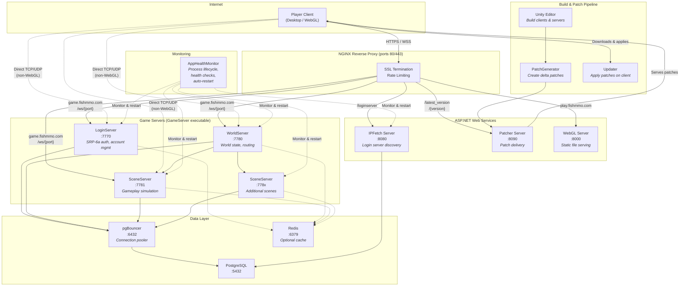

[](https://discord.gg/9JQEYjkSNk)
[Join our Discord](https://discord.gg/9JQEYjkSNk)

# FishMMO

A modular, open-source MMO framework built on **Unity 6.3 LTS**, **FishNet**, and **PostgreSQL**.

---

## Table of Contents

- [Overview](#overview)
- [Supported Platforms](#supported-platforms)
- [Prerequisites](#prerequisites)
- [Installation Guide](#installation-guide)
  - [1. Clone the Repository](#1-clone-the-repository)
  - [2. Build the FishMMO-Installer](#2-build-the-fishmmo-installer)
  - [3. Use the Installer to Set Up Dependencies](#3-use-the-installer-to-set-up-dependencies)
- [Database Setup](#database-setup)
- [Build World Scene Details](#build-world-scene-details)
- [Versioning](#versioning)
- [Patching — PatchGenerator and Updater](#patching--patchgenerator-and-updater)
- [FishMMO Builds](#fishmmo-builds)
- [Configuration](#configuration)
  - [Configure Unity Hub](#configure-unity-hub)
  - [Configure NGINX](#configure-nginx)
  - [Configure pgBouncer](#configure-pgbouncer)
  - [Configure Constants.cs Domains](#configure-constantscs-domains)
  - [Server Configuration Files](#server-configuration-files)
  - [FishMMO-AppHealthMonitor](#fishmmo-apphealthmonitor)
- [Flow Diagram](#flow-diagram)
- [License](#license)

---

## Overview

FishMMO is a complete multiplayer online game framework consisting of:

| Component | Description |
|---|---|
| **FishMMO-Unity** | Unity project containing client, server, and shared game code |
| **FishMMO-Database (FishMMO-DB)** | PostgreSQL database layer using Entity Framework Core + Npgsql |
| **FishMMO-Installer** | Cross-platform .NET 8 console tool that automates dependency installation |
| **FishMMO-Dependencies** | Centralised NuGet dependency library (netstandard2.1) |
| **FishMMO-Logger** | Flexible logging library with file, email, and console backends |
| **FishMMO-SharedUtility** | Pure C# utility library shared between client and database projects |
| **FishMMO-AppHealthMonitor** | Daemon that monitors, auto-restarts, and health-checks server processes |
| **FishMMO-WebServers** | ASP.NET Core web services — IPFetch, Patcher, and WebGL static server |
| **FishMMO-Patcher** | Client-side updater that applies versioned patch files |
| **FishMMO-Setup** | Configuration templates — nginx.conf, server .cfg files, appsettings.json |

The server architecture uses three server types:
- **LoginServer** — Handles account creation, SRP-6a authentication, and character select.
- **WorldServer** — Manages world state, character routing, and scene server orchestration.
- **SceneServer** — Runs gameplay simulation for individual world scenes (chat, combat, inventory, guilds, etc.).

All three are launched from a single GameServer executable with a command-line argument (`LOGIN`, `WORLD`, or `SCENE`).

---

## Supported Platforms

| Platform | Client | Server |
|---|---|---|
| Windows 10/11 | Yes | Yes |
| Linux (Ubuntu/Debian, Arch/CachyOS) | Yes | Yes |
| macOS | Yes | Yes |
| WebGL | Yes (via browser) | N/A |

| Requirement | Version |
|---|---|
| Unity | 6.3 LTS |
| .NET SDK | 8.0+ |
| PostgreSQL | 14+ |
| Scripting Backend | IL2CPP |

---

## Prerequisites

- **Git** for cloning the repository
- **.NET 8.0 SDK** (the installer can install this for you if you have a newer version installed)
- **Unity Hub** with **Unity 6.3 LTS** (the installer can install these for you)
- **PostgreSQL** (the installer can install this for you)
- Administrator/root privileges for system-level installs
- Internet connectivity

---

## Installation Guide

### 1. Clone the Repository

```bash
git clone https://github.com/jimdroberts/FishMMO.git
cd FishMMO
```

> **Tip:** Use the `dev` branch if it is more up-to-date than `main`:
> ```bash
> git checkout dev
> ```

### 2. Build the FishMMO-Installer

The **FishMMO-Installer** is the recommended way to set up all dependencies. It automates installing .NET, PostgreSQL, NGINX, PgBouncer, Unity Hub, building all C# projects, and setting up the database.

```bash
cd FishMMO-Installer
dotnet build
dotnet run --project FishMMO-Installer
```

Or run the compiled binary directly:
- **Windows:** `FishMMO-Installer\bin\Debug\net8.0\FishMMO-Installer.exe`
- **Linux:** `./FishMMO-Installer/bin/Debug/net8.0/FishMMO-Installer`

> **Windows:** Run from an elevated PowerShell (Administrator) for system-level installs.
> **Linux:** You will be prompted for `sudo` when needed.

### 3. Use the Installer to Set Up Dependencies

The installer presents an interactive menu:

```
1 : Install DotNet
2 : Install Visual Studio Build Tools (Windows Only)
3 : Install PgBouncer (Connection Pooler)
4 : Build all C# Projects
5 : Install Unity Hub
6 : Install Unity Editor (+Modules)
7 : Install NGINX (Web Server/Reverse Proxy)
8 : Install/Renew Let's Encrypt Certificate (NGINX)
9 : Install PostgreSQL (Database Server)
A : Install FishMMO Database (User/Schema/Initial Migration)
B : Create new database migration
C : Grant User Permissions on Database
D : Delete FishMMO Database (DANGEROUS!)
0 : Quit
```

**Recommended order for a fresh setup:**

| Step | Windows | Linux |
|---|---|---|
| 1 | Install DotNet | Install DotNet |
| 2 | Install Visual Studio Build Tools | *(skip)* |
| 3 | Install PgBouncer | Install PgBouncer |
| 4 | Build all C# Projects | Build all C# Projects |
| 5 | Install Unity Hub | Install Unity Hub |
| 6 | Install Unity Editor (+Modules) | Install Unity Editor (+Modules) |
| 7 | Install NGINX | Install NGINX |
| 8 | Install/Renew Let's Encrypt Certificate | Install/Renew Let's Encrypt Certificate |
| 9 | Install PostgreSQL | Install PostgreSQL |
| 10 | Install FishMMO Database | Install FishMMO Database |

**"Build all C# Projects" (option 4)** will discover and build all `.csproj` files under the repository root, including:
- `FishMMO-Dependencies` — copies dependency DLLs into `FishMMO-Unity/Assets/Dependencies/`
- `FishMMO-Database/FishMMO-DB` — database library
- `FishMMO-Logger` — logging library (copies DLL to Unity Dependencies)
- `FishMMO-SharedUtility` — shared utility library (copies DLL to Unity Dependencies)
- `FishMMO-WebServers/IPFetchASP.NET` — login server discovery API
- `FishMMO-WebServers/PatcherASP.NET` — patch delivery server
- `FishMMO-WebServers/WebGLServerASP.NET` — WebGL static file server
- `FishMMO-AppHealthMonitor` — server health monitor daemon

> After building, open the **FishMMO-Unity** project in Unity Hub to compile the Unity-side scripts.

---

## Database Setup

The FishMMO-Installer automates database creation, but here is what happens under the hood:

1. **PostgreSQL Installation** — The installer installs PostgreSQL via your platform's package manager.
2. **Database + User Creation** — Creates the `fish_mmo_postgresql` database and a dedicated user role.
3. **EF Core Migration** — Creates and applies an initial Entity Framework Core migration.
4. **Permissions** — Grants the user full privileges on the `public` schema.

**Configuration** is loaded from `appsettings.json` (placed alongside the server executable at runtime):

```json
{
  "Npgsql": {
    "Database": "fish_mmo_postgresql",
    "Username": "fishmmo",
    "Password": "your_password",
    "Host": "127.0.0.1",
    "Port": "5432"
  },
  "Redis": {
    "Host": "127.0.0.1",
    "Port": "6379",
    "Password": "your_redis_password"
  }
}
```

**Environment-based overrides:** The database library supports layered configuration:
1. `appsettings.json` (required)
2. `appsettings.{Environment}.json` (optional — e.g., `appsettings.Development.json`)
3. Environment variables (highest priority, use `__` for nesting: `Npgsql__Host`, `Npgsql__Password`, etc.)

Set the environment via `FISHMMO_ENVIRONMENT`, `DOTNET_ENVIRONMENT`, or `ASPNETCORE_ENVIRONMENT`.

---

## Build World Scene Details

This caches important game world details for clients and servers. **Run this whenever you add a new scene.**

**Unity Menu:** `FishMMO → Build → Rebuild World Scene Details`

---

## Versioning

Manage the project's semantic versioning from the Unity Editor.

**Unity Menu:** `FishMMO → Version → ...`

| Option | Effect |
|---|---|
| Increment Major | Increases the major version number |
| Increment Minor | Increases the minor version number |
| Increment Patch | Increases the patch version number |
| Reset Version | Resets all version fields to zero |

Each action updates `VersionConfig.asset` and Unity's bundle version. The final version is written to `version.txt` in the build output directory.

> **Optional:** Enable automatic patch increments by uncommenting the `UpdateBuildVersion()` call in `OnPostprocessBuild`.

---

## Patching — PatchGenerator and Updater

### PatchGenerator

A custom Unity Editor window for creating delta patches between game builds.

**Unity Menu:** `FishMMO → Patch → Patch Generator`

1. Select the **new** and **old** build directories.
2. Configure options, exclusions, and version details.
3. Click **Generate Patch** to create delta files and a manifest.

Patch files are ZIP archives named `<from_version>-<to_version>.zip` (e.g., `1.0.0-1.0.1.zip`).

### Updater

The FishMMO Updater applies versioned patches to the client. It is launched automatically by the game launcher.

```
Updater.exe -version=1.0.0 -latestversion=1.0.1 -pid=1234 -exe=FishMMOClient.exe
```

Features: transactional patching with rollback, parallel file operations, automatic client restart.

### Patch Server

Build the **PatcherASP.NET** web server and point it to the directory containing your generated patch `.zip` files. Clients query `/latest_version` and download patches via `/{version}`.

---

## FishMMO Builds

Use the custom build menu in Unity to create clients, servers, Addressables, and the database installer.

**Unity Menu:** `FishMMO → Build → ...`

**Build Environments:**

| Environment | Address Binding | Use Case |
|---|---|---|
| **Development** | `127.0.0.1` (loopback) | Local testing |
| **Release** | `0.0.0.0` (all interfaces) | Production deployment |

The build process copies the appropriate `.cfg` and `appsettings.json` files from `FishMMO-Setup/Development/` or `FishMMO-Setup/Release/` into the build output.

---

## Configuration

### Configure Unity Hub

1. **Add the Project:**
   - Click **ADD** in Unity Hub.
   - Select the `FishMMO-Unity` directory.

2. **Install Required Modules:**
   - Go to the **Installs** tab.
   - Click the gear icon next to your Unity version → **Add Modules**.
   - Install:
     - Linux Build Support (IL2CPP and Mono)
     - Linux Dedicated Server Build Support
     - Mac Build Support
     - WebGL Build Support
     - Windows Build Support (IL2CPP)
     - Windows Dedicated Server Build Support

3. Open the **FishMMO-Unity** project from Unity Hub.

---

### Configure NGINX

NGINX acts as the reverse proxy and SSL terminator for all FishMMO web services and WebSocket game traffic. The reference configuration is at `FishMMO-Setup/nginx.conf`.

#### Architecture

```
Internet
   │
   ▼ HTTPS (ports 80/443 only)
┌──────────┐
│  NGINX   │  ← SSL termination, rate limiting, WebSocket upgrade
└────┬─────┘
     │ HTTP (localhost only)
     ├──→ play.fishmmo.com  → WebGL Server  (localhost:8000)
     ├──→ api.fishmmo.com   → IPFetch       (localhost:8080)
     │                      → Patcher       (localhost:8090)
     └──→ game.fishmmo.com  → Game Servers  (localhost:7770-7899 via /ws/{port})
```

#### Subdomain Routing

| Subdomain | Backend | Port | Purpose |
|---|---|---|---|
| `play.fishmmo.com` | WebGL Server | 8000 | Serves Unity WebGL builds |
| `api.fishmmo.com` | IPFetch / Patcher | 8080 / 8090 | Login server discovery + patch delivery |
| `game.fishmmo.com` | Game Servers | 7770–7899 | WebSocket proxy for Bayou/WebGL clients |

#### Installation

The FishMMO-Installer (option `7`) handles installation. After installing:

**Linux:**
```bash
# Copy the reference config
sudo cp FishMMO-Setup/nginx.conf /etc/nginx/nginx.conf
sudo chown root:root /etc/nginx/nginx.conf
sudo chmod 644 /etc/nginx/nginx.conf

# Create certbot webroot
sudo mkdir -p /var/www/certbot/.well-known/acme-challenge

# Open firewall ports
sudo ufw allow 80/tcp
sudo ufw allow 443/tcp

# Test and start
sudo nginx -t
sudo systemctl enable --now nginx
sudo systemctl reload nginx
```

**Windows:**
```powershell
# Copy config (installer default: C:\nginx\nginx-1.29.5)
Copy-Item "FishMMO-Setup\nginx.conf" "C:\nginx\nginx-1.29.5\conf\nginx.conf" -Force

# Open firewall
netsh advfirewall firewall add rule name="FishMMO HTTP" dir=in action=allow protocol=TCP localport=80
netsh advfirewall firewall add rule name="FishMMO HTTPS" dir=in action=allow protocol=TCP localport=443

# Validate and restart
& "C:\nginx\nginx-1.29.5\nginx.exe" -t
sc.exe stop "FishMMO-NGINX"
sc.exe start "FishMMO-NGINX"
```

#### SSL Certificates (Let's Encrypt)

Use the installer's option `8` to install or renew certificates:
- Enter your domains (e.g., `fishmmo.com,play.fishmmo.com,api.fishmmo.com,game.fishmmo.com`)
- Use staging mode first to validate the flow
- The installer updates the `ssl_certificate` / `ssl_certificate_key` paths in `nginx.conf` automatically

#### Key Security Features

| Feature | Detail |
|---|---|
| TLS 1.2 / 1.3 only | Older protocols disabled |
| OCSP Stapling | Faster TLS handshakes |
| Rate limiting | Per-IP zones for API, patch downloads, and WebGL assets |
| Connection limits | Per-IP connection caps per server block |
| Request body limits | 1KB default (prevents oversized payloads) |
| Slowloris mitigation | Header/body buffer and timeout limits |
| Hidden version | `server_tokens off` |

#### Game Server Port Mapping (WebSocket)

For WebGL clients, NGINX routes `wss://game.fishmmo.com/ws/{port}` to the correct backend. The port-to-address map is configured in `nginx.conf`:

```nginx
map $backend_port $backend_address {
    default       127.0.0.1;          # fallback for local/dev servers

    # Login Servers
    # 7770        192.168.1.10;       # Login Server A

    # World Servers
    # 7780        192.168.1.10;       # World Server A

    # Scene Servers
    # 7790        192.168.1.10;       # Scene Server A
    # 7791        192.168.1.11;       # Scene Server B
}
```

Allowed port range: **7770–7899** (130 server slots). Adjust the regex in the `game.fishmmo.com` server block if you need more.

#### Important Port Notes

| Port | Exposure | Purpose |
|---|---|---|
| 80, 443 | **Public** (forward through router) | NGINX (HTTP redirect + HTTPS) |
| 8000, 8080, 8090 | **Private** (localhost only) | Backend web servers |
| 7770–7899 | **Private** (behind NGINX) | Game servers (routed via WebSocket) |

> **Do NOT** publicly forward ports 8000, 8080, 8090, or 7770-7899. All traffic goes through NGINX on ports 80/443.

---

### Configure pgBouncer

PgBouncer is a lightweight PostgreSQL connection pooler that sits between your game servers and PostgreSQL, reducing connection overhead.

#### Installation

The FishMMO-Installer (option `3`) handles installation:
- **Linux:** Package manager install + `systemctl enable --now pgbouncer`
- **Windows:** `winget` (preferred) or Chocolatey fallback

#### Configuration

After installation, configure PgBouncer to pool connections to your FishMMO database.

**Linux:** Edit `/etc/pgbouncer/pgbouncer.ini`
**Windows:** Edit `pgbouncer.ini` in the install directory

##### pgbouncer.ini

```ini
[databases]
; Map the database name to the actual PostgreSQL backend.
; Use the same database name your appsettings.json references.
fish_mmo_postgresql = host=127.0.0.1 port=5432 dbname=fish_mmo_postgresql

[pgbouncer]
; Listen on localhost only — game servers connect here instead of directly to PostgreSQL.
listen_addr = 127.0.0.1
listen_port = 6432

; Authentication
auth_type = md5
auth_file = /etc/pgbouncer/userlist.txt

; Pool mode: transaction pooling is recommended for game servers.
; Each query gets a connection for the duration of the transaction, then returns it to the pool.
pool_mode = transaction

; Pool sizing
default_pool_size = 20
min_pool_size = 5
max_client_conn = 200
max_db_connections = 50

; Timeouts
server_idle_timeout = 300
client_idle_timeout = 0
query_timeout = 30

; Logging
log_connections = 0
log_disconnections = 0
log_pooler_errors = 1

; Admin access (for pgbouncer SHOW commands)
admin_users = fishmmo
stats_users = fishmmo
```

##### userlist.txt

```
"fishmmo" "your_password"
```

> On Linux, generate the password hash: `psql -c "SELECT concat('\"', usename, '\" \"', passwd, '\"') FROM pg_shadow WHERE usename = 'fishmmo';" postgres`

##### Update appsettings.json

Point your game servers at PgBouncer (port `6432`) instead of PostgreSQL directly (port `5432`):

```json
{
  "Npgsql": {
    "Database": "fish_mmo_postgresql",
    "Username": "fishmmo",
    "Password": "your_password",
    "Host": "127.0.0.1",
    "Port": "6432"
  }
}
```

##### Verify

**Linux:**
```bash
sudo systemctl status pgbouncer
sudo systemctl restart pgbouncer
# Test connection through PgBouncer
psql -h 127.0.0.1 -p 6432 -U fishmmo -d fish_mmo_postgresql
```

**Windows:**
```powershell
sc.exe query pgbouncer
```

---

### Configure Constants.cs Domains

The file `FishMMO-Unity/Assets/Scripts/Shared/Implementation/Constants.cs` contains domain endpoints used by the client to connect to your infrastructure.

```csharp
public static class Configuration
{
    /// Unified API Host URL. NGINX routes to the correct backend by path.
    public static readonly string APIHost = "https://api.fishmmo.com/";

    /// NGINX game WebSocket hostname for Bayou/WebGL clients.
    /// WebGL clients connect via wss://GameHost/ws/{port} instead of direct IP:port.
    public static readonly string GameHost = "game.fishmmo.com";
}
```

| Field | Purpose | Update When |
|---|---|---|
| `APIHost` | Base URL for IPFetch and Patcher API calls | You use a different domain or run without NGINX |
| `GameHost` | WebSocket hostname for WebGL game connections | You use a different domain for game traffic |

> For local development, you can override these to `https://localhost/` and `localhost` respectively, or configure your hosts file.

---

### Server Configuration Files

Each server type reads a `.cfg` file from its working directory. Templates are in `FishMMO-Setup/Development/` and `FishMMO-Setup/Release/`.

#### LoginServer.cfg

```ini
ServerName=LoginServer
MaximumClients=4000
Address=127.0.0.1
Port=7770
StaleSceneTimeout=5
```

#### WorldServer.cfg

```ini
ServerName=World Server
MaximumClients=4000
Address=127.0.0.1
Port=7780
StaleSceneTimeout=5
```

#### SceneServer.cfg

```ini
ServerName=Scene Server
MaximumClients=4000
Address=127.0.0.1
Port=7781
StaleSceneTimeout=5
```

| Key | Description | Default |
|---|---|---|
| `ServerName` | Display name for logs and monitoring | varies |
| `MaximumClients` | Maximum concurrent connections | 4000 |
| `Address` | Bind address (`127.0.0.1` for dev, `0.0.0.0` for production) | varies |
| `Port` | Listen port (Login=7770, World=7780, Scene=7781+) | varies |
| `StaleSceneTimeout` | Seconds before idle scenes are considered stale | 5 |

**Format:** Simple `key=value` per line. Lines starting with `#` or `;` are comments.

#### appsettings.json

Placed alongside the server executable. Contains database and Redis connection details (see [Database Setup](#database-setup)).

#### logging.json

Configures the FishMMO-Logger system:

```json
{
  "LogLevel": "Info",
  "Loggers": [
    {
      "Type": "File",
      "Config": {
        "FilePath": "logs/server.log",
        "Append": true,
        "MaxFileSizeMB": 10
      }
    }
  ]
}
```

Log levels: `Trace`, `Debug`, `Info`, `Warning`, `Error`, `Critical`.

---

### FishMMO-AppHealthMonitor

The AppHealthMonitor is a daemon that monitors, auto-restarts, and health-checks your server processes.

#### Build

```bash
cd FishMMO-AppHealthMonitor
dotnet build
```

#### Configure appsettings.json

```json
{
  "Headless": false,
  "Applications": [
    {
      "Name": "LoginServer",
      "ApplicationExePath": "/path/to/GameServer",
      "MonitoredPort": 7770,
      "PortTypes": ["TCP", "UDP"],
      "LaunchArguments": "LOGIN",
      "CheckIntervalSeconds": 30,
      "LaunchDelaySeconds": 2,
      "GracefulShutdownTimeoutSeconds": 10,
      "InitialRestartDelaySeconds": 5,
      "MaxRestartDelaySeconds": 60,
      "MaxRestartAttempts": 5,
      "CircuitBreakerFailureThreshold": 3
    },
    {
      "Name": "WorldServer",
      "ApplicationExePath": "/path/to/GameServer",
      "MonitoredPort": 7780,
      "PortTypes": ["TCP", "UDP"],
      "LaunchArguments": "WORLD",
      "CheckIntervalSeconds": 30,
      "LaunchDelaySeconds": 2,
      "GracefulShutdownTimeoutSeconds": 10,
      "InitialRestartDelaySeconds": 5,
      "MaxRestartDelaySeconds": 60,
      "MaxRestartAttempts": 5,
      "CircuitBreakerFailureThreshold": 3
    },
    {
      "Name": "SceneServer",
      "ApplicationExePath": "/path/to/GameServer",
      "MonitoredPort": 7781,
      "PortTypes": ["TCP", "UDP"],
      "LaunchArguments": "SCENE",
      "CheckIntervalSeconds": 30,
      "LaunchDelaySeconds": 2,
      "GracefulShutdownTimeoutSeconds": 10,
      "InitialRestartDelaySeconds": 5,
      "MaxRestartDelaySeconds": 60,
      "MaxRestartAttempts": 5,
      "CircuitBreakerFailureThreshold": 3
    },
    {
      "Name": "IPFetch Server",
      "ApplicationExePath": "/path/to/IpFetchServer",
      "MonitoredPort": 8080,
      "PortTypes": ["TCP"],
      "LaunchArguments": "",
      "CheckIntervalSeconds": 30,
      "LaunchDelaySeconds": 2,
      "GracefulShutdownTimeoutSeconds": 10,
      "InitialRestartDelaySeconds": 5,
      "MaxRestartDelaySeconds": 60,
      "MaxRestartAttempts": 5,
      "CircuitBreakerFailureThreshold": 3
    }
  ]
}
```

> Set `"Headless": true` for production daemon deployments — this auto-starts monitoring and suppresses the interactive console.

| Key | Description |
|---|---|
| `MonitoredPort` | Must match the port in the corresponding `.cfg` file |
| `PortTypes` | Health check protocol(s): `TCP`, `UDP`, `WebSocket` |
| `LaunchArguments` | Server type selector: `LOGIN`, `WORLD`, or `SCENE` |
| `CircuitBreakerFailureThreshold` | Consecutive failures before the circuit breaker stops restart attempts |

#### Console Commands

| Command | Description |
|---|---|
| `help` | List all commands |
| `start <name>` | Start monitoring a specific application |
| `stop <name>` | Stop monitoring a specific application |
| `status` | Show status of all monitored applications |
| `restart <name>` | Force-restart a specific application |
| `kill <name>` | Force-kill a specific application |
| `shutdown` | Gracefully shut down all applications and exit |

#### Running as a Systemd Service (Linux)

Create `/etc/systemd/system/apphealthmonitor.service`:

```ini
[Unit]
Description=FishMMO Application Health Monitor
After=network.target

[Service]
Type=simple
User=your-username
WorkingDirectory=/path/to/FishMMO-AppHealthMonitor
ExecStart=/path/to/AppHealthMonitor
Restart=on-failure
RestartSec=10

[Install]
WantedBy=multi-user.target
```

```bash
sudo systemctl daemon-reload
sudo systemctl enable --now apphealthmonitor
```

---

## Flow Diagram



---

## License

This project is licensed under the **MIT License**. See [LICENSE](LICENSE) for details.
